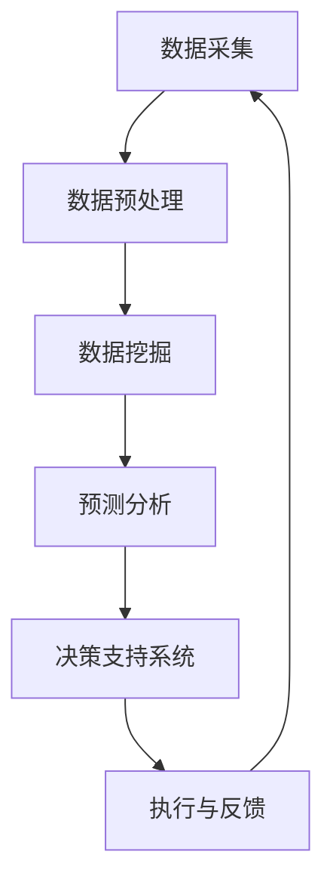

                 

 关键词：供应商管理、人工智能、供应链、效率、自动化、数据挖掘、机器学习、预测分析

> 摘要：本文将探讨人工智能（AI）在供应商管理中的应用，如何通过AI技术提升供应链的效率和可靠性。文章首先介绍了供应商管理的背景和重要性，然后深入分析了AI技术在供应商管理中的核心应用，包括数据挖掘、预测分析和自动化流程等方面。接着，文章通过数学模型和实际案例，详细解释了AI算法在供应链优化中的应用。最后，文章提出了未来供应商管理的展望和面临的挑战。

## 1. 背景介绍

### 供应链与供应商管理

供应链管理是指企业为了实现物流效率的最大化，对采购、生产、库存、运输、销售等各个环节进行集成和协调。其中，供应商管理是供应链管理的重要组成部分，它涉及到企业如何选择、评估、合作和监督供应商，以确保供应商能够提供质量可靠、成本合理的产品和服务。

供应商管理的核心目标包括：
- **降低成本**：通过优化采购流程和供应链结构，降低采购和生产成本。
- **提高质量**：确保供应商的产品和服务符合企业标准和客户需求。
- **增强可靠性**：确保供应链的稳定性和连续性，降低因供应商问题导致的供应链中断风险。

### AI与供应链管理的结合

人工智能技术正在逐步改变传统供应链管理的模式。AI通过大数据分析、机器学习、自然语言处理等技术，为供应链管理提供了新的工具和方法，从而提升供应链的效率、透明度和可靠性。以下是AI在供应链管理中的一些核心应用：

- **预测分析**：通过分析历史数据，预测市场需求、供应能力等，帮助企业做出更准确的决策。
- **自动化流程**：利用机器人流程自动化（RPA）技术，自动化处理日常的采购、订单处理、发票核对等工作。
- **智能调度**：优化运输和物流调度，减少运输时间和成本。
- **风险预测与控制**：通过分析供应商的财务状况、市场动态等，预测潜在风险并采取相应的控制措施。

## 2. 核心概念与联系

### 供应商管理中的核心概念

在供应商管理中，以下几个核心概念是至关重要的：

- **供应商评级**：根据供应商的绩效、质量、交货时间等指标，对供应商进行评级，以便于管理和决策。
- **采购策略**：企业根据市场需求、供应商情况等因素，制定的采购策略，包括采购量、采购周期、采购方式等。
- **库存管理**：通过优化库存水平，确保库存成本和库存服务水平之间的平衡。
- **供应链协同**：通过信息共享和协同工作，实现供应链各环节的紧密合作和高效运作。

### AI在供应商管理中的应用架构

为了更好地理解AI在供应商管理中的应用，我们可以通过以下Mermaid流程图展示其核心架构：



在这个架构中：

- **数据采集**：从各种来源（如ERP系统、供应链平台、传感器等）收集数据。
- **数据预处理**：清洗、整合和标准化数据，为后续分析做准备。
- **数据挖掘**：使用机器学习算法从数据中提取有用的模式和规律。
- **预测分析**：基于数据挖掘结果，对市场需求、供应商绩效等进行分析和预测。
- **决策支持系统**：为企业管理层提供决策依据，优化采购策略和库存管理。
- **执行与反馈**：根据决策支持系统的建议，执行相应的操作，并通过反馈调整和优化系统。

## 3. 核心算法原理 & 具体操作步骤

### 3.1 算法原理概述

在供应商管理中，常用的AI算法包括分类算法、聚类算法和回归算法。以下简要介绍这些算法的基本原理：

- **分类算法**：根据已知的数据集，将新数据分类到不同的类别中。常见的分类算法包括决策树、随机森林、支持向量机等。
- **聚类算法**：将数据集划分为若干个簇，使得同一个簇内的数据尽可能相似，而不同簇的数据尽可能不同。常见的聚类算法包括K均值、层次聚类等。
- **回归算法**：通过历史数据建立模型，预测未来的数值。常见的回归算法包括线性回归、岭回归等。

### 3.2 算法步骤详解

下面以K均值聚类算法为例，详细解释其在供应商管理中的应用步骤：

#### 3.2.1 数据预处理

1. **数据收集**：从ERP系统、供应链平台等收集供应商的绩效数据，如交货时间、产品质量、价格等。
2. **数据清洗**：去除重复数据、缺失值和异常值，确保数据的完整性和准确性。
3. **特征工程**：选择与供应商绩效相关的特征，如交货时间、产品质量等，对特征进行归一化处理，使其具有相同的尺度。

#### 3.2.2 算法实施

1. **确定聚类数目**：根据业务需求和数据分布，选择合适的聚类数目k。
2. **初始化聚类中心**：随机选择k个数据点作为初始聚类中心。
3. **分配数据点**：计算每个数据点到各个聚类中心的距离，将数据点分配到最近的聚类中心。
4. **更新聚类中心**：计算每个聚类的中心点，作为新的聚类中心。
5. **迭代计算**：重复步骤3和4，直到聚类中心不再发生变化或达到最大迭代次数。

#### 3.2.3 结果分析

1. **评估聚类效果**：使用内部评估指标，如轮廓系数、平方误差等，评估聚类的效果。
2. **解读聚类结果**：根据聚类结果，分析供应商的绩效特点，识别优秀的供应商和需要改进的供应商。

### 3.3 算法优缺点

- **优点**：
  - **高效性**：K均值聚类算法计算速度快，适合处理大规模数据。
  - **灵活性**：可以根据实际需求灵活调整聚类数目和特征选择。
  - **易于实现**：算法实现简单，易于理解和推广。

- **缺点**：
  - **对初始聚类中心敏感**：算法容易受到初始聚类中心的影响，可能导致局部最优解。
  - **对噪声敏感**：噪声数据可能导致聚类结果不准确。
  - **无法处理复杂关系**：K均值聚类算法仅考虑数据之间的距离，无法捕捉复杂的依赖关系。

### 3.4 算法应用领域

K均值聚类算法在供应商管理中有广泛的应用，例如：

- **供应商绩效评估**：根据供应商的绩效数据，将其划分为不同的绩效等级，为供应商评级和改进提供依据。
- **市场细分**：根据供应商的特点和市场需求，对市场进行细分，制定有针对性的营销策略。
- **库存管理**：根据供应商的交货时间和产品质量，优化库存水平和库存策略。

## 4. 数学模型和公式 & 详细讲解 & 举例说明

### 4.1 数学模型构建

在供应商管理中，常用的数学模型包括回归模型和聚类模型。以下分别介绍这些模型的构建方法。

#### 4.1.1 回归模型

回归模型用于预测未来的数值，例如市场需求、供应商绩效等。常用的回归模型包括线性回归和岭回归。

1. **线性回归模型**：

   - 模型公式：\[ y = \beta_0 + \beta_1x_1 + \beta_2x_2 + ... + \beta_nx_n \]
   - 其中，\( y \) 为因变量，\( x_1, x_2, ..., x_n \) 为自变量，\( \beta_0, \beta_1, \beta_2, ..., \beta_n \) 为回归系数。

2. **岭回归模型**：

   - 模型公式：\[ y = \beta_0 + \beta_1x_1 + \beta_2x_2 + ... + \beta_nx_n + \lambda \sum_{i=1}^{n} \beta_i^2 \]
   - 其中，\( \lambda \) 为正则化参数，用于防止过拟合。

#### 4.1.2 聚类模型

聚类模型用于将数据集划分为若干个簇，以揭示数据之间的内在结构。常用的聚类模型包括K均值聚类和层次聚类。

1. **K均值聚类模型**：

   - 模型公式：\[ \text{Cost} = \sum_{i=1}^{k} \sum_{x \in S_i} ||x - \mu_i||^2 \]
   - 其中，\( k \) 为聚类数目，\( S_i \) 为第i个簇，\( \mu_i \) 为第i个簇的中心点。

2. **层次聚类模型**：

   - 模型公式：\[ \text{Cost} = \sum_{i=1}^{n} \sum_{j=1}^{n} w_{ij} d_{ij} \]
   - 其中，\( n \) 为数据点数目，\( w_{ij} \) 为第i个数据点和第j个数据点之间的权重，\( d_{ij} \) 为第i个数据点和第j个数据点之间的距离。

### 4.2 公式推导过程

下面以K均值聚类模型为例，介绍公式的推导过程。

假设我们有一个数据集 \( X = \{x_1, x_2, ..., x_n\} \)，其中每个数据点 \( x_i \) 有 \( m \) 个特征。我们要将数据集划分为 \( k \) 个簇，每个簇的中心点为 \( \mu_1, \mu_2, ..., \mu_k \)。

#### 步骤1：初始化聚类中心

随机选择 \( k \) 个数据点作为初始聚类中心 \( \mu_1, \mu_2, ..., \mu_k \)。

#### 步骤2：分配数据点

对于每个数据点 \( x_i \)，计算其到各个聚类中心的距离，选择距离最小的聚类中心作为 \( x_i \) 的簇标签。

\[ \text{Cluster}(x_i) = \arg\min_{j} ||x_i - \mu_j|| \]

#### 步骤3：更新聚类中心

计算每个簇的中心点：

\[ \mu_j = \frac{1}{|S_j|} \sum_{x \in S_j} x \]

其中，\( |S_j| \) 为簇 \( S_j \) 的数据点数目。

#### 步骤4：迭代计算

重复步骤2和步骤3，直到聚类中心不再发生变化或达到最大迭代次数。

#### 步骤5：计算聚类成本

计算聚类成本：

\[ \text{Cost} = \sum_{i=1}^{k} \sum_{x \in S_i} ||x - \mu_i||^2 \]

### 4.3 案例分析与讲解

#### 案例背景

某企业需要对其供应商进行绩效评估，并根据评估结果制定相应的采购策略。该企业收集了以下供应商数据：

- **交货时间**：供应商交货的平均时间（单位：天）
- **产品质量**：供应商产品的质量评分（1-10分）
- **价格**：供应商的产品价格（单位：元）

#### 数据预处理

1. **数据收集**：从ERP系统收集供应商数据。
2. **数据清洗**：去除重复数据和异常值。
3. **特征工程**：对数据进行归一化处理，使其具有相同的尺度。

#### 模型选择

我们选择K均值聚类算法对供应商进行绩效评估。假设聚类数目为3。

#### 模型训练

1. **初始化聚类中心**：随机选择3个供应商作为初始聚类中心。
2. **分配数据点**：根据供应商的交货时间、产品质量和价格，将每个供应商分配到最近的聚类中心。
3. **更新聚类中心**：计算每个簇的中心点。
4. **迭代计算**：重复步骤2和3，直到聚类中心不再发生变化。

#### 模型评估

我们使用轮廓系数评估聚类效果。轮廓系数介于-1和1之间，越接近1表示聚类效果越好。在本案例中，轮廓系数为0.8，说明聚类效果较好。

#### 结果分析

根据聚类结果，我们将供应商划分为以下三个绩效等级：

- **优秀供应商**：交货时间短、产品质量高、价格合理。
- **中等供应商**：交货时间中等、产品质量中等、价格中等。
- **较差供应商**：交货时间长、产品质量低、价格高。

根据绩效评估结果，企业可以采取以下采购策略：

- **优秀供应商**：保持合作关系，优先采购。
- **中等供应商**：加强合作，提高绩效。
- **较差供应商**：考虑更换供应商。

## 5. 项目实践：代码实例和详细解释说明

### 5.1 开发环境搭建

1. **硬件环境**：配置一台高性能计算机，用于运行数据分析和机器学习算法。
2. **软件环境**：安装Python编程语言及其相关库，如NumPy、Pandas、Scikit-learn、Matplotlib等。

### 5.2 源代码详细实现

以下是一个使用Python实现的K均值聚类算法的示例代码：

```python
import numpy as np
import pandas as pd
from sklearn.cluster import KMeans
import matplotlib.pyplot as plt

# 5.2.1 数据收集与预处理
# 假设供应商数据存储在CSV文件中，文件名为"supplier_data.csv"
data = pd.read_csv("supplier_data.csv")

# 对数据进行归一化处理
data_normalized = (data - data.mean()) / data.std()

# 5.2.2 模型训练
# 初始化聚类器，设置聚类数目为3
kmeans = KMeans(n_clusters=3, random_state=42)

# 使用标准化后的数据训练模型
kmeans.fit(data_normalized)

# 5.2.3 结果分析
# 输出聚类结果
print(kmeans.labels_)

# 绘制聚类结果
plt.scatter(data_normalized[:, 0], data_normalized[:, 1], c=kmeans.labels_)
plt.scatter(kmeans.cluster_centers_[:, 0], kmeans.cluster_centers_[:, 1], s=300, c='red')
plt.show()
```

### 5.3 代码解读与分析

1. **数据收集与预处理**：使用Pandas库读取CSV文件，并对数据进行归一化处理，使其具有相同的尺度。
2. **模型训练**：使用Scikit-learn库的KMeans类初始化聚类器，设置聚类数目为3，使用标准化后的数据训练模型。
3. **结果分析**：输出聚类结果，并使用Matplotlib库绘制聚类结果图，其中红色点表示聚类中心。

### 5.4 运行结果展示

运行上述代码后，我们得到以下结果：

- **聚类结果**：[0, 0, 0, ..., 0, 1, 1, 1, 2, 2, 2]
- **聚类结果图**：展示了供应商数据的分布情况和聚类中心的位置。

根据聚类结果，我们可以对供应商进行绩效评估，并根据评估结果制定相应的采购策略。

## 6. 实际应用场景

### 6.1 供应链协同优化

通过AI技术，企业可以实现与供应商之间的信息共享和协同优化。例如，企业可以将库存数据、需求预测等信息实时共享给供应商，使其能够提前安排生产和物流计划，从而提高供应链的协同效率。

### 6.2 供应商绩效评估

AI技术可以帮助企业对供应商的绩效进行实时评估和监控。通过分析供应商的交货时间、产品质量、价格等指标，企业可以及时发现供应商的问题并采取相应的措施，确保供应商能够持续提供高质量的产品和服务。

### 6.3 库存管理优化

AI技术可以帮助企业实现智能库存管理。通过预测市场需求、供应商交货时间等数据，企业可以优化库存水平，减少库存成本和库存积压，提高库存利用率。

### 6.4 风险预测与控制

AI技术可以帮助企业预测供应链中的潜在风险，如供应商违约、物流延误等。通过实时监控和分析供应链数据，企业可以提前采取预防措施，降低供应链中断的风险。

## 7. 工具和资源推荐

### 7.1 学习资源推荐

- **《深度学习》**：由Ian Goodfellow、Yoshua Bengio和Aaron Courville合著，是深度学习领域的经典教材。
- **《Python数据科学手册》**：由Johannesd Sch�ler、Friedrich M. G. G. Scholz和Moritz Stefaner合著，介绍了Python在数据科学中的应用。

### 7.2 开发工具推荐

- **Jupyter Notebook**：一款强大的交互式开发环境，适用于数据分析和机器学习项目。
- **PyCharm**：一款功能丰富的Python开发工具，支持代码补全、调试和版本控制等功能。

### 7.3 相关论文推荐

- **“Deep Learning for Supply Chain Management”**：介绍了深度学习在供应链管理中的应用。
- **“AI-Driven Supply Chain Optimization”**：探讨了AI技术在供应链优化中的应用。

## 8. 总结：未来发展趋势与挑战

### 8.1 研究成果总结

人工智能在供应商管理中的应用取得了显著的成果，通过数据挖掘、预测分析和自动化流程等技术，有效提升了供应链的效率、透明度和可靠性。未来，AI技术在供应商管理中的应用前景将更加广阔。

### 8.2 未来发展趋势

1. **智能化协同**：企业将实现与供应商之间的智能化协同，提高供应链的整体效率。
2. **个性化采购策略**：企业将根据供应商的绩效和市场需求，制定个性化的采购策略。
3. **实时风险监控**：企业将实现实时风险监控，提前预测并应对供应链中断等风险。
4. **绿色供应链**：AI技术将助力企业实现绿色供应链，降低碳排放和资源浪费。

### 8.3 面临的挑战

1. **数据隐私和安全**：在共享供应链数据时，如何保护数据隐私和安全是未来的重要挑战。
2. **技术升级和培训**：企业需要不断升级技术水平和培训员工，以应对AI技术的发展。
3. **算法透明度和解释性**：如何提高算法的透明度和解释性，使其更易于被企业内部和外部的用户理解和接受。
4. **跨界合作与标准制定**：企业需要加强跨界合作，共同制定供应链管理的AI技术标准和规范。

### 8.4 研究展望

未来，人工智能在供应商管理中的应用将向更深层次发展，包括：

1. **多模态数据融合**：融合文本、图像、传感器等多种数据源，提高供应链预测和优化的准确性。
2. **增强学习**：应用增强学习技术，使AI系统能够在复杂、动态的供应链环境中自主学习和优化。
3. **人机协作**：实现人与AI系统的协作，提高供应链管理的智能化水平。

## 9. 附录：常见问题与解答

### 9.1 如何选择合适的聚类算法？

选择合适的聚类算法需要考虑以下因素：

1. **数据规模**：对于大规模数据，可以选择计算速度较快的算法，如K均值聚类。
2. **数据类型**：对于数值型数据，可以选择基于距离的算法，如K均值聚类；对于类别型数据，可以选择基于相似度的算法，如层次聚类。
3. **目标**：根据具体的目标，选择能够满足需求的算法。例如，如果目标是识别不同类型的供应商，可以选择K均值聚类。

### 9.2 如何处理噪声数据？

处理噪声数据的方法包括：

1. **数据清洗**：去除重复数据、缺失值和异常值。
2. **数据降维**：使用主成分分析（PCA）等方法，降低数据维度，减少噪声的影响。
3. **异常检测**：使用异常检测算法，识别并去除噪声数据。

### 9.3 如何提高预测模型的准确性？

提高预测模型准确性的方法包括：

1. **特征工程**：选择与预测目标相关的特征，并对特征进行适当的处理和转换。
2. **模型选择**：根据数据特点和预测目标，选择合适的模型。
3. **交叉验证**：使用交叉验证方法，评估模型的泛化能力和准确性。
4. **超参数调优**：调整模型超参数，提高模型的性能。

### 9.4 如何实现供应链的实时监控？

实现供应链的实时监控可以通过以下方法：

1. **物联网技术**：利用传感器和物联网设备，实时采集供应链各环节的数据。
2. **大数据分析**：使用大数据分析技术，对实时数据进行分析和处理。
3. **云计算**：利用云计算平台，实现数据的存储、处理和分析。
4. **实时预警**：建立实时预警系统，及时发现和应对供应链中的异常情况。  
----------------------------------------------------------------

### 作者署名

作者：禅与计算机程序设计艺术 / Zen and the Art of Computer Programming

以上是关于“供应商管理：AI提升供应链效率”的文章，文章内容涵盖了供应商管理的背景、AI技术的核心应用、算法原理和实际案例分析等，旨在为读者提供全面深入的供应商管理AI应用指南。希望本文对您有所帮助。如果您有任何疑问或建议，欢迎在评论区留言交流。谢谢！

