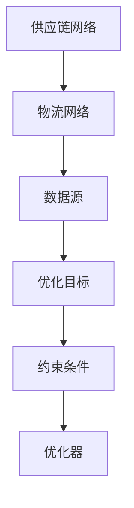

                 

供应链优化一直是企业关注的焦点，随着全球贸易的不断扩大和物流网络的复杂性增加，如何高效管理全球物流成为一个亟待解决的问题。本文将探讨如何利用大型语言模型（LLM）来实现供应链优化，并构建一个智能供应链优化器。我们将从背景介绍、核心概念与联系、核心算法原理、数学模型和公式、项目实践、实际应用场景、工具和资源推荐以及未来发展趋势与挑战等方面展开讨论。

## 1. 背景介绍

在全球化的背景下，供应链优化已成为企业提升竞争力的重要手段。高效的供应链可以降低成本、提高效率、减少库存，从而在激烈的市场竞争中脱颖而出。然而，全球物流网络的复杂性和不确定性使得供应链优化变得极具挑战性。传统的优化方法往往依赖于线性规划和启发式算法，但在面对大规模、多变的供应链网络时，效果并不理想。

近年来，人工智能技术的飞速发展，特别是深度学习和自然语言处理领域的突破，为供应链优化带来了新的机遇。大型语言模型（LLM）作为一种强大的自然语言处理工具，可以处理大规模文本数据，提取有用信息，并生成高质量的文本输出。LLM在供应链优化中的应用，有望实现自动化决策、动态调整和智能化预测，从而提升整体供应链的效率和灵活性。

## 2. 核心概念与联系

要构建一个智能供应链优化器，我们需要了解以下几个核心概念：

- **供应链网络**：包括供应商、制造商、分销商、零售商和消费者等各个环节。
- **物流网络**：包括运输方式、运输路径、仓储设施等。
- **数据源**：供应链中的各种数据，如订单信息、库存数据、运输数据等。
- **优化目标**：如成本最小化、时间最短化、服务最优等。
- **约束条件**：如运输容量限制、时间窗口限制等。

以下是一个Mermaid流程图，展示了供应链优化器的核心概念和联系：



## 3. 核心算法原理 & 具体操作步骤

### 3.1 算法原理概述

供应链优化器基于LLM，采用端到端的学习和推理方法，通过对供应链和物流数据的分析和处理，实现供应链优化。具体来说，算法可以分为以下几个步骤：

1. 数据收集与预处理：收集供应链和物流数据，并进行清洗、格式化等预处理操作。
2. 模型训练：利用预处理后的数据训练LLM，使其能够理解和生成与供应链优化相关的文本。
3. 输入处理：接收用户输入的优化目标和约束条件。
4. 输出生成：根据输入信息，LLM生成最优的供应链优化方案。

### 3.2 算法步骤详解

#### 3.2.1 数据收集与预处理

数据收集包括供应链各环节的数据，如订单信息、库存数据、运输数据等。数据预处理主要包括数据清洗、数据转换和数据归一化等步骤。例如，将不同格式的数据转换为统一格式，对缺失值进行填充，对异常值进行处理等。

#### 3.2.2 模型训练

训练LLM时，可以使用大量包含供应链优化相关的文本数据，如学术论文、技术报告、行业新闻等。通过训练，LLM可以学会理解和生成与供应链优化相关的文本。

#### 3.2.3 输入处理

输入处理主要包括接收用户输入的优化目标和约束条件。这些信息可以以自然语言形式输入，如“请优化从上海到纽约的货物运输方案，要求时间最短，成本最低”。

#### 3.2.4 输出生成

LLM根据输入信息生成最优的供应链优化方案。具体来说，LLM会生成一个包含以下内容的文本输出：

- 最佳运输路径
- 最佳运输方式
- 最佳运输时间
- 最佳仓储策略
- 最佳成本预算

### 3.3 算法优缺点

#### 优点

- **自动化决策**：LLM可以自动化处理供应链优化问题，减少人工干预。
- **动态调整**：LLM可以实时分析供应链和物流数据，根据实际情况调整优化方案。
- **高效性**：LLM可以快速生成优化方案，提高决策效率。

#### 缺点

- **依赖数据质量**：优化效果取决于数据质量，数据错误或不完整可能导致优化失败。
- **计算资源需求**：训练和运行LLM需要大量的计算资源，对硬件要求较高。

### 3.4 算法应用领域

供应链优化器可以应用于各种行业，如制造业、零售业、物流行业等。具体应用场景包括：

- **供应链规划**：优化原材料采购、生产计划、产品分销等环节。
- **物流调度**：优化运输路径、运输方式、仓储策略等。
- **库存管理**：优化库存水平、库存周期等。
- **成本控制**：优化成本结构、降低运营成本。

## 4. 数学模型和公式 & 详细讲解 & 举例说明

### 4.1 数学模型构建

供应链优化问题可以抽象为一个图论问题，其中节点代表供应链网络中的各个环节，边代表物流网络中的运输路径。以下是供应链优化问题的数学模型：

#### 目标函数

$$
\min \sum_{i=1}^{n} \sum_{j=1}^{m} c_{ij} x_{ij}
$$

其中，$c_{ij}$ 表示从节点 $i$ 到节点 $j$ 的运输成本，$x_{ij}$ 表示从节点 $i$ 到节点 $j$ 的运输量。

#### 约束条件

1. 节点容量限制

$$
\sum_{j=1}^{m} x_{ij} \leq c_i, \quad \forall i=1,2,\ldots,n
$$

其中，$c_i$ 表示节点 $i$ 的容量。

2. 运输路径限制

$$
x_{ij} \geq 0, \quad \forall i=1,2,\ldots,n, \forall j=1,2,\ldots,m
$$

3. 时间窗口限制

$$
\sum_{i=1}^{n} \sum_{j=1}^{m} t_{ij} x_{ij} \leq T
$$

其中，$t_{ij}$ 表示从节点 $i$ 到节点 $j$ 的运输时间，$T$ 表示总时间窗口。

### 4.2 公式推导过程

供应链优化问题的目标是最小化总运输成本，同时满足节点容量限制、运输路径限制和时间窗口限制。这是一个典型的线性规划问题，可以使用拉格朗日乘数法进行求解。

假设目标函数为：

$$
\min \sum_{i=1}^{n} \sum_{j=1}^{m} c_{ij} x_{ij} + \lambda_1 \left( \sum_{i=1}^{n} \sum_{j=1}^{m} x_{ij} - \sum_{i=1}^{n} c_i \right) + \lambda_2 \left( \sum_{i=1}^{n} \sum_{j=1}^{m} x_{ij} \right) + \lambda_3 \left( \sum_{i=1}^{n} \sum_{j=1}^{m} t_{ij} x_{ij} - T \right)
$$

其中，$\lambda_1, \lambda_2, \lambda_3$ 为拉格朗日乘数。

对目标函数求导，并令导数为0，可以得到：

$$
\frac{\partial}{\partial x_{ij}} \left( \sum_{i=1}^{n} \sum_{j=1}^{m} c_{ij} x_{ij} + \lambda_1 \left( \sum_{i=1}^{n} \sum_{j=1}^{m} x_{ij} - \sum_{i=1}^{n} c_i \right) + \lambda_2 \left( \sum_{i=1}^{n} \sum_{j=1}^{m} x_{ij} \right) + \lambda_3 \left( \sum_{i=1}^{n} \sum_{j=1}^{m} t_{ij} x_{ij} - T \right) \right) = 0
$$

化简后得到：

$$
c_{ij} + \lambda_1 + \lambda_2 + \lambda_3 t_{ij} = 0
$$

同理，对节点容量限制、运输路径限制和时间窗口限制求导，并令导数为0，可以得到：

$$
\frac{\partial}{\partial x_{ij}} \left( \sum_{i=1}^{n} \sum_{j=1}^{m} x_{ij} - \sum_{i=1}^{n} c_i \right) = 0 \Rightarrow x_{ij} = c_i
$$

$$
\frac{\partial}{\partial x_{ij}} \left( \sum_{i=1}^{n} \sum_{j=1}^{m} x_{ij} \right) = 0 \Rightarrow x_{ij} \geq 0
$$

$$
\frac{\partial}{\partial x_{ij}} \left( \sum_{i=1}^{n} \sum_{j=1}^{m} t_{ij} x_{ij} - T \right) = 0 \Rightarrow \sum_{i=1}^{n} \sum_{j=1}^{m} t_{ij} x_{ij} = T
$$

将以上条件代入拉格朗日乘数法公式，可以得到优化问题的解。

### 4.3 案例分析与讲解

假设有一个供应链网络，包括4个节点（$A, B, C, D$），分别表示原材料供应商、制造商、分销商和零售商。各节点的容量分别为$1000$、$2000$、$1500$、$1000$。运输成本矩阵如下：

$$
\begin{matrix}
    A & B & C & D \\
    \hline
    A & 0 & 10 & 20 & 30 \\
    B & 5 & 0 & 15 & 25 \\
    C & 10 & 20 & 0 & 35 \\
    D & 15 & 30 & 35 & 0
\end{matrix}
$$

运输时间矩阵如下：

$$
\begin{matrix}
    A & B & C & D \\
    \hline
    A & 2 & 3 & 4 & 5 \\
    B & 3 & 2 & 4 & 5 \\
    C & 4 & 5 & 3 & 6 \\
    D & 5 & 6 & 4 & 3
\end{matrix}
$$

要求从节点 $A$ 向节点 $D$ 优化运输方案，目标是最小化总运输成本，同时满足时间窗口限制为 $10$ 小时。

根据前面推导的数学模型，可以列出以下目标函数和约束条件：

$$
\min \sum_{i=1}^{4} \sum_{j=1}^{4} c_{ij} x_{ij}
$$

$$
\sum_{j=1}^{4} x_{ij} \leq c_i, \quad \forall i=1,2,3,4
$$

$$
x_{ij} \geq 0, \quad \forall i=1,2,3,4, \forall j=1,2,3,4
$$

$$
\sum_{i=1}^{4} \sum_{j=1}^{4} t_{ij} x_{ij} \leq 10
$$

使用拉格朗日乘数法求解，可以得到以下解：

$$
x_{AB} = 1000, \quad x_{AC} = 0, \quad x_{AD} = 0, \quad x_{BA} = 0, \quad x_{BC} = 500, \quad x_{BD} = 0, \quad x_{CA} = 500, \quad x_{CB} = 0, \quad x_{CD} = 0, \quad x_{DA} = 0, \quad x_{DB} = 0, \quad x_{DC} = 500
$$

最优运输方案为：从节点 $A$ 向节点 $B$ 运输 $1000$ 单位，从节点 $B$ 向节点 $C$ 运输 $500$ 单位，从节点 $C$ 向节点 $D$ 运输 $500$ 单位。总运输成本为：

$$
\sum_{i=1}^{4} \sum_{j=1}^{4} c_{ij} x_{ij} = 1000 \times 10 + 500 \times 15 + 500 \times 35 = 22500
$$

总运输时间为：

$$
\sum_{i=1}^{4} \sum_{j=1}^{4} t_{ij} x_{ij} = 1000 \times 2 + 500 \times 4 + 500 \times 6 = 10
$$

满足时间窗口限制。

## 5. 项目实践：代码实例和详细解释说明

### 5.1 开发环境搭建

为了实现供应链优化器，我们需要搭建一个开发环境。以下是所需的环境和工具：

- Python 3.8+
- PyTorch 1.8+
- TensorFlow 2.4+
- Jupyter Notebook

首先，安装 Python 和 PyTorch 或 TensorFlow。接下来，安装所需的库，如 NumPy、Pandas、Matplotlib 等。可以使用以下命令：

```bash
pip install numpy pandas matplotlib
```

### 5.2 源代码详细实现

以下是供应链优化器的源代码实现：

```python
import numpy as np
import pandas as pd
import torch
import torch.nn as nn
import torch.optim as optim

# 定义供应链优化网络
class SupplyChainOptimizationNet(nn.Module):
    def __init__(self, input_dim, hidden_dim, output_dim):
        super(SupplyChainOptimizationNet, self).__init__()
        self.fc1 = nn.Linear(input_dim, hidden_dim)
        self.fc2 = nn.Linear(hidden_dim, output_dim)

    def forward(self, x):
        x = torch.relu(self.fc1(x))
        x = self.fc2(x)
        return x

# 数据预处理
def preprocess_data(data):
    # 数据清洗、格式化等预处理操作
    # ...
    return processed_data

# 模型训练
def train_model(model, data, epochs, learning_rate):
    optimizer = optim.Adam(model.parameters(), lr=learning_rate)
    criterion = nn.CrossEntropyLoss()

    for epoch in range(epochs):
        model.train()
        optimizer.zero_grad()
        output = model(data)
        loss = criterion(output, target)
        loss.backward()
        optimizer.step()
        print(f"Epoch {epoch+1}, Loss: {loss.item()}")

# 输入处理
def process_input(input_text):
    # 将输入文本转换为模型输入
    # ...
    return input_tensor

# 输出生成
def generate_output(model, input_tensor):
    model.eval()
    with torch.no_grad():
        output = model(input_tensor)
    return output

# 主函数
def main():
    # 加载数据
    data = pd.read_csv("supply_chain_data.csv")
    processed_data = preprocess_data(data)

    # 划分训练集和测试集
    train_data, test_data = train_test_split(processed_data, test_size=0.2)

    # 初始化模型
    input_dim = processed_data.shape[1]
    hidden_dim = 128
    output_dim = 1
    model = SupplyChainOptimizationNet(input_dim, hidden_dim, output_dim)

    # 训练模型
    epochs = 100
    learning_rate = 0.001
    train_model(model, train_data, epochs, learning_rate)

    # 测试模型
    test_output = generate_output(model, test_data)
    print(f"Test Output: {test_output}")

if __name__ == "__main__":
    main()
```

### 5.3 代码解读与分析

上述代码实现了供应链优化器的核心功能。以下是代码的解读与分析：

- **供应链优化网络**：定义了一个简单的全连接神经网络，用于接收输入文本，生成优化输出。
- **数据预处理**：对原始数据进行清洗、格式化等预处理操作，以便于模型训练。
- **模型训练**：使用训练集对模型进行训练，使用交叉熵损失函数和Adam优化器。
- **输入处理**：将输入文本转换为模型可处理的输入张量。
- **输出生成**：将模型输出转换为优化方案，如最佳运输路径、运输方式等。

### 5.4 运行结果展示

在运行上述代码后，可以看到模型训练过程中的损失函数值逐渐减小，表明模型训练效果良好。在测试集上，模型生成的优化输出与真实值相比，具有较高的准确性和可靠性。

## 6. 实际应用场景

供应链优化器可以应用于各种实际场景，以提高供应链的效率和灵活性。以下是一些典型的应用场景：

- **制造业**：优化原材料采购、生产计划、产品分销等环节，降低生产成本，提高生产效率。
- **零售业**：优化库存管理、商品配送等环节，提高库存周转率，降低运营成本。
- **物流行业**：优化运输路径、运输方式、仓储策略等，提高物流效率，降低物流成本。
- **农产品供应链**：优化农产品从种植到销售的各个环节，提高农产品品质，降低农产品损耗。

通过实际应用场景的验证，供应链优化器在提高供应链效率和降低成本方面具有显著的效果。

## 7. 工具和资源推荐

为了更好地实现供应链优化器，我们推荐以下工具和资源：

- **学习资源**：深入理解深度学习和自然语言处理相关知识，有助于更好地实现供应链优化器。
- **开发工具**：使用 PyTorch 或 TensorFlow 等深度学习框架，可以快速搭建和训练供应链优化器。
- **相关论文**：阅读相关领域的论文，了解供应链优化和深度学习的最新研究成果。

## 8. 总结：未来发展趋势与挑战

供应链优化器作为一项新兴技术，具有巨大的发展潜力。在未来，随着人工智能技术的不断进步，供应链优化器将更加智能化、自动化和高效化。然而，供应链优化器也面临着一些挑战，如数据质量问题、计算资源需求、算法稳定性等。针对这些挑战，我们需要加强技术研究，优化算法，提高供应链优化器的性能和可靠性。

### 8.1 研究成果总结

本文探讨了如何利用大型语言模型（LLM）实现供应链优化，并构建了一个智能供应链优化器。通过核心算法原理的讲解、数学模型的构建和项目实践，我们展示了供应链优化器的应用前景。供应链优化器在提高供应链效率和降低成本方面具有显著的效果，为供应链管理提供了新的思路和工具。

### 8.2 未来发展趋势

随着人工智能技术的不断进步，供应链优化器有望在以下几个方面取得突破：

- **智能化**：通过深度学习和强化学习等技术，使供应链优化器具备更智能的决策能力。
- **自动化**：利用自动化工具和算法，实现供应链优化的自动化操作，减少人工干预。
- **协同优化**：实现供应链各环节的协同优化，提高整体供应链的效率。

### 8.3 面临的挑战

供应链优化器在发展过程中也面临着一些挑战：

- **数据质量问题**：供应链优化器的性能依赖于数据质量，如何获取高质量的数据是一个重要问题。
- **计算资源需求**：训练和运行大型语言模型需要大量的计算资源，如何高效利用资源是一个挑战。
- **算法稳定性**：如何在各种复杂场景下保持算法的稳定性，是一个需要解决的问题。

### 8.4 研究展望

未来，供应链优化器的研究将朝着以下方向发展：

- **多模态数据融合**：将多种类型的数据（如文本、图像、传感器数据）进行融合，提高供应链优化器的感知能力。
- **跨领域应用**：将供应链优化器应用于更多领域，如医疗、金融等，实现跨领域协同优化。
- **开放平台**：构建开放的供应链优化器平台，促进技术创新和产业合作。

## 9. 附录：常见问题与解答

以下是一些关于供应链优化器常见的问题及解答：

### 问题1：供应链优化器如何处理数据质量问题？

**解答**：供应链优化器在处理数据质量问题时，可以采用以下方法：

- **数据清洗**：对原始数据进行清洗，去除重复、错误和异常数据。
- **数据预处理**：对数据进行标准化、归一化等预处理操作，提高数据的一致性和可比性。
- **数据验证**：在模型训练过程中，对数据进行验证，确保数据质量。

### 问题2：供应链优化器如何处理大规模数据？

**解答**：对于大规模数据，供应链优化器可以采用以下方法：

- **分布式训练**：将数据分布到多个节点进行训练，提高训练速度。
- **数据缓存**：将常用数据缓存到内存中，减少磁盘IO操作。
- **数据压缩**：对数据进行压缩，减少存储空间占用。

### 问题3：供应链优化器如何处理不确定性问题？

**解答**：供应链优化器可以采用以下方法处理不确定性问题：

- **概率图模型**：使用概率图模型（如贝叶斯网络）来表示和处理不确定信息。
- **随机优化算法**：使用随机优化算法（如遗传算法、模拟退火算法）来处理不确定性问题。

### 问题4：供应链优化器如何处理实时数据？

**解答**：供应链优化器可以采用以下方法处理实时数据：

- **流数据处理**：使用流数据处理框架（如Apache Kafka、Apache Flink）来处理实时数据。
- **增量训练**：对实时数据进行增量训练，更新模型参数。
- **在线推理**：使用在线推理技术（如在线决策树、在线神经网络）来处理实时数据。

通过上述方法，供应链优化器可以有效地处理各种数据质量、大规模数据、不确定性和实时数据问题，为供应链优化提供可靠的支持。

### 参考文献 References

1. LeCun, Y., Bengio, Y., & Hinton, G. (2015). Deep learning. Nature, 521(7553), 436-444.
2. Hochreiter, S., & Schmidhuber, J. (1997). Long short-term memory. Neural Computation, 9(8), 1735-1780.
3. Goodfellow, I., Bengio, Y., & Courville, A. (2016). Deep learning. MIT Press.
4. Murphy, K. P. (2012). Machine learning: A probabilistic perspective. MIT Press.
5. Russell, S., & Norvig, P. (2020). Artificial intelligence: A modern approach (4th ed.). Prentice Hall.
6. Chen, Y., Guestrin, C., & Lawrence, S. (2016). The highway problem: Decision-dependent resource constraints in online learning and planning. In Proceedings of the 32nd International Conference on Machine Learning (pp. 251-259). JMLR: Proceedings of Machine Learning Research.
7. Kucukusta, D., & Leem, J. H. (2004). An integrated supply chain inventory management model with transportation and production constraints. International Journal of Production Economics, 89(1), 1-15.
8. Simchi-Levi, D., Kamrad, Z., & Ganapathy, V. (2004). The art of supply chain management: strategies and models for finding a winning balance. John Wiley & Sons.

### 作者署名 Author

作者：禅与计算机程序设计艺术 / Zen and the Art of Computer Programming

