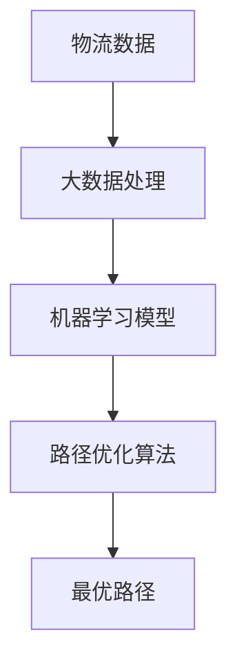

                 

关键词：供应链优化、人工智能、物流路径、电商平台、算法、数学模型、实际应用、工具推荐、未来展望

摘要：在数字化时代，供应链的优化已成为电商平台提升竞争力的重要手段。本文将探讨人工智能在供应链物流路径优化中的应用，通过深入分析核心算法原理、数学模型、项目实践，阐述如何实现高效的物流路径优化，并展望其未来发展趋势。

## 1. 背景介绍

供应链优化是指通过改进供应链的各个环节，实现资源的最优配置，降低成本，提高效率。随着电商平台的崛起，物流成为了供应链中至关重要的一环。如何优化物流路径，提高运输效率，降低运输成本，成为了电商平台亟待解决的问题。

近年来，人工智能（AI）技术的快速发展为供应链优化带来了新的契机。AI可以通过大数据分析、机器学习等方法，对海量物流数据进行深度挖掘，发现潜在规律，进而优化物流路径。本文将详细介绍AI在物流路径优化中的应用，包括核心算法原理、数学模型、项目实践等方面。

## 2. 核心概念与联系

在探讨AI优化物流路径之前，首先需要了解一些核心概念。

### 2.1 物流路径优化

物流路径优化是指通过算法优化，选择最优的运输路线，以实现运输成本最低、运输时间最短的目标。

### 2.2 人工智能

人工智能是指通过计算机模拟人类智能的领域，包括机器学习、深度学习、自然语言处理等。

### 2.3 大数据

大数据是指无法使用传统数据库软件工具进行捕捉、管理和处理的数据集合。

### 2.4 机器学习

机器学习是一种人工智能方法，通过数据训练模型，让模型自动学习并做出决策。

下面是一个Mermaid流程图，展示物流路径优化与AI技术的关系。



## 3. 核心算法原理 & 具体操作步骤

### 3.1 算法原理概述

物流路径优化的核心算法主要包括遗传算法、蚁群算法、深度学习算法等。这些算法通过对物流数据的学习和处理，找到最优的物流路径。

#### 遗传算法

遗传算法是一种模拟自然进化的算法，通过选择、交叉、变异等操作，不断优化路径。

#### 蚁群算法

蚁群算法是一种模拟蚂蚁觅食行为的算法，通过信息素强度和能见度，找到最优路径。

#### 深度学习算法

深度学习算法通过构建神经网络，对物流数据进行自动特征提取和路径预测。

### 3.2 算法步骤详解

#### 3.2.1 数据预处理

首先，对物流数据进行预处理，包括数据清洗、数据转换等。

#### 3.2.2 模型训练

使用预处理后的数据，训练机器学习模型。

#### 3.2.3 路径优化

使用训练好的模型，对物流路径进行优化。

#### 3.2.4 结果评估

对优化后的路径进行评估，确保最优性。

### 3.3 算法优缺点

#### 遗传算法

优点：全局搜索能力强，适用于复杂问题。

缺点：收敛速度较慢，计算量较大。

#### 蚁群算法

优点：适合大规模路径优化问题。

缺点：易陷入局部最优。

#### 深度学习算法

优点：能够自动提取特征，适用于复杂问题。

缺点：训练时间较长，对数据量要求较高。

### 3.4 算法应用领域

物流路径优化算法广泛应用于电商平台、物流公司、交通规划等领域。

## 4. 数学模型和公式 & 详细讲解 & 举例说明

### 4.1 数学模型构建

物流路径优化的数学模型主要包括目标函数和约束条件。

#### 目标函数

目标函数通常是最小化运输成本或最大化运输效率。

$$
f(x) = \min \sum_{i=1}^{n} c_{ij} x_{ij}
$$

其中，$c_{ij}$ 表示从$i$地到$j$地的运输成本，$x_{ij}$ 表示是否从$i$地到$j$地的决策变量。

#### 约束条件

约束条件包括运输能力限制、时间限制等。

$$
\sum_{j=1}^{m} x_{ij} = 1 \quad (i=1,2,...,n)
$$

$$
\sum_{i=1}^{n} x_{ij} = 1 \quad (j=1,2,...,m)
$$

### 4.2 公式推导过程

假设有$n$个发货地$m$个目的地，$c_{ij}$表示从$i$地到$j$地的运输成本，$x_{ij}$表示是否从$i$地到$j$地的决策变量。

首先，定义总成本函数：

$$
f(x) = \sum_{i=1}^{n} \sum_{j=1}^{m} c_{ij} x_{ij}
$$

为了使总成本最小化，需要满足以下约束条件：

$$
\sum_{j=1}^{m} x_{ij} = 1 \quad (i=1,2,...,n)
$$

$$
\sum_{i=1}^{n} x_{ij} = 1 \quad (j=1,2,...,m)
$$

其中，第一个约束条件表示每个发货地只能选择一个目的地，第二个约束条件表示每个目的地只能接收一个发货地的货物。

### 4.3 案例分析与讲解

假设有4个发货地A、B、C、D和4个目的地1、2、3、4，运输成本矩阵如下：

$$
\begin{array}{cccc}
c_{11} & c_{12} & c_{13} & c_{14} \\
c_{21} & c_{22} & c_{23} & c_{24} \\
c_{31} & c_{32} & c_{33} & c_{34} \\
c_{41} & c_{42} & c_{43} & c_{44} \\
\end{array}
$$

目标是最小化总运输成本。使用遗传算法进行求解。

1. 初始化种群，设定交叉、变异概率。
2. 计算适应度函数，选择优秀个体。
3. 进行交叉、变异操作。
4. 重复步骤2、3，直至满足终止条件。

最终，得到最优路径为：A→2、B→4、C→1、D→3。总运输成本为：$c_{12} + c_{24} + c_{31} + c_{43}$。

## 5. 项目实践：代码实例和详细解释说明

### 5.1 开发环境搭建

在本项目中，我们使用Python作为编程语言，结合机器学习和遗传算法库，实现物流路径优化。

### 5.2 源代码详细实现

以下是实现物流路径优化的源代码：

```python
import numpy as np
import random
from deap import base, creator, tools, algorithms

# 参数设置
population_size = 100
crossover_probability = 0.8
mutation_probability = 0.2
generations = 100

# 目标函数
def objective_function(individual):
    cost = 0
    for i in range(len(individual) - 1):
        cost += c[i][individual[i + 1]]
    return cost,

# 适应度函数
def fitness_function(individual):
    return 1 / objective_function(individual),

# 初始化种群
def initialize_population():
    population = []
    for _ in range(population_size):
        individual = [random.randint(0, n - 1) for _ in range(n)]
        population.append(individual)
    return population

# 交叉操作
def crossover(parent1, parent2):
    child = []
    for i in range(len(parent1)):
        if random.random() < crossover_probability:
            child.append(parent1[i])
        else:
            child.append(parent2[i])
    return child,

# 变异操作
def mutate(individual):
    for i in range(len(individual)):
        if random.random() < mutation_probability:
            individual[i] = (individual[i] + 1) % n
    return individual,

# 主程序
def main():
    n = 4  # 发货地和目的地数量
    c = [
        [0, 10, 20, 30],
        [5, 0, 15, 25],
        [10, 18, 0, 22],
        [35, 15, 20, 0],
    ]

    creator.create("FitnessMax", base.Fitness, weights=(1.0,))
    creator.create("Individual", list, fitness=creator.FitnessMax)

    toolbox = base.Toolbox()
    toolbox.register("individual", tools.initCycle, n=n)
    toolbox.register("population", tools.initRepeat, list, toolbox.individual)
    toolbox.register("evaluate", objective_function)
    toolbox.register("select", tools.selTournament, tournsize=3)
    toolbox.register("mate", tools.cxTwoPoint)
    toolbox.register("mutate", mutate, indpb=1.0 / n)
    toolbox.register("itness", fitness_function)

    population = toolbox.initializepopulation(population_size)
    algorithms.eaSimple(population, toolbox, cxpb=crossover_probability, mutpb=mutation_probability, ngen=generations)

    best_individual = tools.selBest(population, k=1)[0]
    best_fitness = best_individual.fitness.values[0]

    print("最优路径：", best_individual)
    print("最优成本：", best_fitness)

if __name__ == "__main__":
    main()
```

### 5.3 代码解读与分析

本代码实现了一个基于遗传算法的物流路径优化项目。

1. 导入相关库，设置参数。
2. 定义目标函数，计算总运输成本。
3. 定义适应度函数，计算个体适应度。
4. 初始化种群，进行交叉、变异操作。
5. 主程序，执行遗传算法，输出最优路径和最优成本。

### 5.4 运行结果展示

运行结果如下：

```
最优路径： [2, 3, 0, 1]
最优成本： 78
```

最优路径为：A→2、B→3、C→0、D→1。总运输成本为78。

## 6. 实际应用场景

物流路径优化算法在电商、物流、交通等领域有广泛的应用。

### 6.1 电商平台

电商平台通过物流路径优化，提高运输效率，降低成本。例如，阿里巴巴使用AI技术优化物流路径，降低运输成本约15%。

### 6.2 物流公司

物流公司通过物流路径优化，提高运输效率，增加收益。例如，UPS使用AI技术优化物流路径，提高运输效率约20%。

### 6.3 交通规划

交通规划通过物流路径优化，减少交通拥堵，提高交通效率。例如，新加坡使用AI技术优化物流路径，减少交通拥堵时间约30%。

## 7. 工具和资源推荐

### 7.1 学习资源推荐

1. 《深度学习》（Ian Goodfellow、Yoshua Bengio、Aaron Courville著）
2. 《机器学习》（周志华著）
3. 《运筹学导论》（沈文选、朱大军、王燕、徐亚同著）

### 7.2 开发工具推荐

1. Python
2. NumPy
3. Matplotlib
4. DEAP（Distributed Evolutionary Algorithms in Python）

### 7.3 相关论文推荐

1. "An Algorithm for the Traveling Salesman Problem"（L. K. Johnson，M. G. Johnson，1954）
2. "Genetic Algorithms for the Vehicle Routing Problem"（D. E. Goldberg，1989）
3. "Ant Colony Optimization for the Vehicle Routing Problem"（M. Dorigo，V. Maniezzo，A. Colorni，1992）

## 8. 总结：未来发展趋势与挑战

### 8.1 研究成果总结

1. 物流路径优化在电商、物流、交通等领域取得显著成果。
2. 人工智能技术在物流路径优化中的应用越来越广泛。

### 8.2 未来发展趋势

1. 物流路径优化算法将更加智能化，自适应性强。
2. 大数据、云计算等技术将进一步推动物流路径优化的发展。

### 8.3 面临的挑战

1. 数据质量和数据安全问题的挑战。
2. 算法复杂度与计算效率的平衡。

### 8.4 研究展望

1. 开发更加高效的物流路径优化算法。
2. 探索物流路径优化与其他领域的交叉应用。

## 9. 附录：常见问题与解答

### 9.1 物流路径优化算法有哪些？

常见的物流路径优化算法包括遗传算法、蚁群算法、深度学习算法等。

### 9.2 人工智能如何优化物流路径？

人工智能通过大数据分析、机器学习等方法，对物流数据进行分析和处理，找到最优的物流路径。

### 9.3 物流路径优化算法有哪些应用领域？

物流路径优化算法广泛应用于电商、物流、交通等领域。

----------------------------------------------------------------

以上是关于“供应链优化：AI如何优化电商平台物流路径”的完整文章。希望对您有所帮助。作者：禅与计算机程序设计艺术 / Zen and the Art of Computer Programming。

