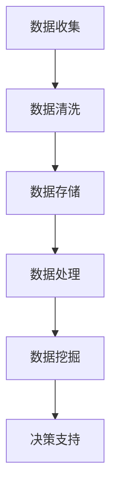

                 

关键词：大数据、决策支持、信息差、质量提升、算法原理、数学模型、项目实践、应用场景、未来展望。

> 摘要：在信息爆炸的时代，大数据技术为决策提供了强大的支持。本文将深入探讨大数据如何通过信息差来提升决策质量，包括核心概念、算法原理、数学模型、项目实践和未来展望等方面。

## 1. 背景介绍

### 1.1 大数据时代的来临

随着互联网的普及和智能设备的广泛应用，数据产生的速度和规模达到了前所未有的高度。大数据时代已然来临，人类社会进入了信息爆炸的阶段。

### 1.2 决策的重要性

决策是人类社会发展的核心驱动力，无论是在个人生活还是企业运营中，决策的正确与否直接影响到结果的成败。

### 1.3 信息差的作用

信息差是指不同个体、不同组织之间在获取和处理信息方面的差异。信息差的存在使得决策者在面对复杂问题时，往往处于不同的认知状态。

## 2. 核心概念与联系

### 2.1 大数据的基本概念

大数据通常是指无法使用传统数据库软件工具进行捕捉、管理和处理的数据集，这些数据集具有大规模、多样性、高速率和低价值密度等特点。

### 2.2 决策支持系统的架构

决策支持系统（DSS）是一种辅助决策者进行决策的计算机系统，通过数据收集、分析和展示，提供决策支持。

### 2.3 Mermaid 流程图



## 3. 核心算法原理 & 具体操作步骤

### 3.1 算法原理概述

大数据决策支持的核心算法包括数据挖掘、机器学习和深度学习等，这些算法通过处理海量数据，提取出有用的信息，辅助决策者做出更精准的判断。

### 3.2 算法步骤详解

- **数据收集**：通过各种渠道收集数据，如互联网、传感器、日志等。
- **数据清洗**：处理缺失值、异常值，保证数据的准确性。
- **数据存储**：将清洗后的数据存储在合适的数据库或数据仓库中。
- **数据处理**：对数据进行预处理，如特征工程、降维等。
- **数据挖掘**：使用算法挖掘数据中的模式和关联性。
- **决策支持**：根据挖掘结果，生成决策建议。

### 3.3 算法优缺点

- **优点**：能够处理海量数据，发现潜在规律，提升决策效率。
- **缺点**：算法复杂度高，对计算资源和数据质量要求高。

### 3.4 算法应用领域

- **金融**：风险评估、投资策略等。
- **医疗**：疾病预测、治疗方案优化等。
- **零售**：消费者行为分析、库存管理等。

## 4. 数学模型和公式 & 详细讲解 & 举例说明

### 4.1 数学模型构建

在决策支持系统中，常用的数学模型包括线性回归、逻辑回归、支持向量机等。

### 4.2 公式推导过程

以线性回归为例，假设我们有n个样本点$(x_1, y_1), (x_2, y_2), ..., (x_n, y_n)$，目标是找到一条直线$y = wx + b$来拟合这些点。

### 4.3 案例分析与讲解

以一家零售公司为例，分析顾客购买行为的模式，预测顾客的购买概率。

## 5. 项目实践：代码实例和详细解释说明

### 5.1 开发环境搭建

- 语言：Python
- 库：NumPy、Pandas、Scikit-learn、Matplotlib

### 5.2 源代码详细实现

```python
import pandas as pd
from sklearn.model_selection import train_test_split
from sklearn.linear_model import LinearRegression
from sklearn.metrics import mean_squared_error

# 读取数据
data = pd.read_csv('data.csv')

# 数据预处理
X = data[['age', 'income']]
y = data['sales']

# 划分训练集和测试集
X_train, X_test, y_train, y_test = train_test_split(X, y, test_size=0.2, random_state=42)

# 建立线性回归模型
model = LinearRegression()
model.fit(X_train, y_train)

# 预测
y_pred = model.predict(X_test)

# 评估
mse = mean_squared_error(y_test, y_pred)
print(f'MSE: {mse}')

# 可视化
plt.scatter(X_test['age'], y_test)
plt.plot(X_test['age'], y_pred, color='red')
plt.show()
```

### 5.3 代码解读与分析

- 读取数据：使用Pandas库读取CSV文件。
- 数据预处理：提取特征并划分训练集和测试集。
- 模型训练：使用线性回归模型进行训练。
- 预测与评估：对测试集进行预测，并计算均方误差（MSE）。
- 可视化：绘制实际值与预测值的散点图。

## 6. 实际应用场景

### 6.1 金融风险管理

通过大数据分析，金融机构可以更准确地评估风险，制定合理的风险控制策略。

### 6.2 医疗健康

大数据分析可以帮助医生更准确地诊断疾病，制定个性化的治疗方案。

### 6.3 零售电商

通过大数据分析消费者行为，零售电商可以优化库存管理，提升销售额。

## 7. 工具和资源推荐

### 7.1 学习资源推荐

- 《大数据技术基础》
- 《Python数据分析》
- 《机器学习实战》

### 7.2 开发工具推荐

- Jupyter Notebook
- PyCharm

### 7.3 相关论文推荐

- "Big Data: A Revolution That Will Transform How We Live, Work, and Think"
- "Data-Driven Decision Making: A Practical Guide to Creating a Data-Driven Organization"

## 8. 总结：未来发展趋势与挑战

### 8.1 研究成果总结

大数据技术在决策支持领域取得了显著成果，为各行各业带来了巨大价值。

### 8.2 未来发展趋势

随着技术的进步，大数据决策支持将更加智能化、自动化，进一步提升决策质量。

### 8.3 面临的挑战

数据隐私、数据安全、算法透明性等问题仍然是大数据决策支持领域面临的挑战。

### 8.4 研究展望

未来研究将聚焦于如何更好地利用大数据，实现更加精准、高效的决策支持。

## 9. 附录：常见问题与解答

### 9.1 什么是大数据？

大数据是指无法使用传统数据库软件工具进行捕捉、管理和处理的数据集，这些数据集具有大规模、多样性、高速率和低价值密度等特点。

### 9.2 大数据决策支持的优点有哪些？

大数据决策支持的优点包括：能够处理海量数据，发现潜在规律，提升决策效率；适用于各种行业，具有广泛的应用场景。

### 9.3 大数据决策支持面临的挑战是什么？

大数据决策支持面临的挑战包括：数据隐私、数据安全、算法透明性等问题。

### 9.4 如何进行大数据分析？

大数据分析通常包括数据收集、数据清洗、数据存储、数据处理、数据挖掘和决策支持等步骤。

### 9.5 哪些工具适合进行大数据分析？

适合进行大数据分析的工具包括：Hadoop、Spark、Python、R等。

### 9.6 大数据决策支持系统如何应用？

大数据决策支持系统可以应用于金融、医疗、零售、物流等多个领域，提升决策质量，实现业务增长。

----------------------------------------------------------------

本文由禅与计算机程序设计艺术 / Zen and the Art of Computer Programming 撰写，旨在探讨大数据如何通过信息差提升决策质量。文章涵盖了大数据的基本概念、决策支持系统的架构、核心算法原理、数学模型、项目实践、实际应用场景和未来展望等内容，为读者提供了一个全面的技术视角。希望通过本文，读者能够更好地理解大数据在决策支持中的重要作用，并在实际应用中取得更好的效果。

