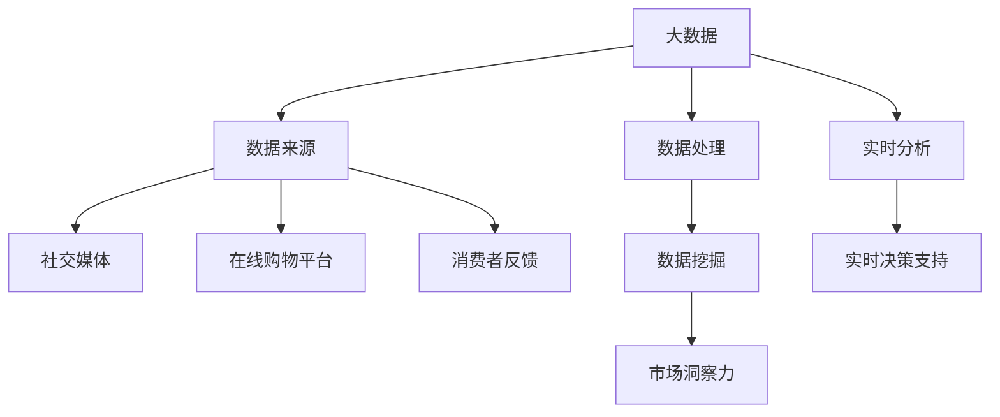

                 

### 背景介绍

在商业竞争中，信息差往往是企业取得优势的关键。信息差指的是企业能够获取、处理和分析的信息相对于竞争对手更加准确、及时和全面，从而在决策过程中占据先机。然而，传统的市场分析方法往往依赖于有限的数据源和简单计算，难以充分发挥大数据的潜力。

随着信息技术的飞速发展，大数据技术的应用日益普及。大数据不仅包含了海量数据，而且涵盖了多种数据类型，如图像、音频、文本等。这些多样化的数据为市场分析提供了丰富的信息来源，使得企业能够更深入地洞察市场动态，发现潜在的商机。

本文将探讨大数据技术在商业市场分析中的应用，分析大数据如何增强市场分析能力，并提出一些建议，帮助企业更好地利用大数据进行市场分析。

### 核心概念与联系

#### 大数据的定义与特点

大数据（Big Data）是指数据量巨大、数据类型多样、数据生成速度快的数据集合。其特点可以概括为“4V”，即：

- **Volume（数据量）**：大数据的数据量通常是海量级别的，远远超过了传统数据库的处理能力。
- **Velocity（数据速度）**：大数据的生成速度非常快，需要实时或近乎实时的处理和分析。
- **Variety（数据多样性）**：大数据不仅包括结构化数据，还涵盖了非结构化数据，如文本、图像、音频等。
- **Veracity（数据真实性）**：大数据的真实性难以保证，数据质量参差不齐。

#### 市场分析的定义与核心任务

市场分析是指通过收集、处理和分析市场数据，了解市场趋势、消费者行为和竞争状况，从而为企业的战略决策提供支持。市场分析的核心任务包括：

- **市场趋势分析**：识别市场的发展趋势，预测未来市场走势。
- **消费者行为分析**：研究消费者的购买习惯、偏好和需求。
- **竞争分析**：分析竞争对手的市场策略、优势和劣势。

#### 大数据与市场分析的关系

大数据与市场分析之间的关系可以概括为以下几个方面：

- **数据来源**：大数据为市场分析提供了丰富的数据来源，包括社交媒体、在线购物平台、消费者反馈等。
- **数据处理**：大数据技术能够高效地处理海量数据，提高市场分析的精确性和速度。
- **数据挖掘**：大数据技术可以帮助企业从海量数据中挖掘出有价值的信息，提升市场洞察力。
- **实时分析**：大数据技术可以实现实时数据分析和预测，为企业提供及时的决策支持。

#### Mermaid 流程图

下面是大数据与市场分析的关系的 Mermaid 流程图：



### 核心算法原理 & 具体操作步骤

#### 3.1 算法原理概述

大数据市场分析的核心算法主要包括数据预处理、数据挖掘和预测模型三个环节。

- **数据预处理**：包括数据清洗、数据整合和数据标准化等步骤，目的是提高数据质量和一致性。
- **数据挖掘**：利用机器学习和数据挖掘算法，从海量数据中提取有价值的信息。
- **预测模型**：基于历史数据和挖掘结果，构建预测模型，预测市场趋势和消费者行为。

#### 3.2 算法步骤详解

1. **数据预处理**

   - 数据清洗：去除重复数据、错误数据和缺失数据。
   - 数据整合：将来自不同源的数据进行合并和整合。
   - 数据标准化：将不同类型和尺度的数据进行标准化处理。

2. **数据挖掘**

   - 特征工程：提取有助于预测的原始数据特征。
   - 选择算法：选择适合的机器学习算法，如决策树、随机森林、支持向量机等。
   - 模型训练：利用历史数据进行模型训练。
   - 模型评估：评估模型的准确性和可靠性。

3. **预测模型**

   - 预测目标定义：明确预测的目标，如市场趋势预测、消费者行为预测等。
   - 预测变量选择：选择影响预测目标的关键变量。
   - 模型构建：基于预测变量构建预测模型。
   - 预测结果评估：评估预测结果的准确性和稳定性。

#### 3.3 算法优缺点

- **优点**：
  - 高效处理海量数据。
  - 提高市场分析的精确性和速度。
  - 深入挖掘潜在信息，提升市场洞察力。
  - 实现实时分析和预测，提供及时决策支持。

- **缺点**：
  - 需要大量的计算资源和存储资源。
  - 数据质量和一致性难以保证。
  - 模型构建和解释较为复杂。

#### 3.4 算法应用领域

- **市场营销**：利用大数据进行消费者行为分析，制定精准营销策略。
- **供应链管理**：通过大数据分析优化供应链，提高运营效率。
- **风险控制**：利用大数据预测市场风险，制定风险控制策略。
- **产品研发**：通过大数据分析消费者需求，指导产品研发。

### 数学模型和公式 & 详细讲解 & 举例说明

#### 4.1 数学模型构建

大数据市场分析的数学模型主要包括预测模型和评估模型。

- **预测模型**：用于预测市场趋势和消费者行为。常见的预测模型有线性回归模型、时间序列模型、神经网络模型等。
- **评估模型**：用于评估预测模型的准确性和可靠性。常见的评估指标有准确率、召回率、F1值等。

#### 4.2 公式推导过程

以线性回归模型为例，其公式推导过程如下：

1. **线性回归方程**：

   $Y = \beta_0 + \beta_1X + \epsilon$

   其中，$Y$ 是因变量，$X$ 是自变量，$\beta_0$ 是截距，$\beta_1$ 是斜率，$\epsilon$ 是误差项。

2. **最小二乘法**：

   为了最小化误差项 $\epsilon$，采用最小二乘法来估计参数 $\beta_0$ 和 $\beta_1$：

   $\beta_0 = \frac{\sum_{i=1}^{n}Y_i - \beta_1\sum_{i=1}^{n}X_i}{n}$

   $\beta_1 = \frac{n\sum_{i=1}^{n}X_iY_i - \sum_{i=1}^{n}X_i\sum_{i=1}^{n}Y_i}{n\sum_{i=1}^{n}X_i^2 - (\sum_{i=1}^{n}X_i)^2}$

#### 4.3 案例分析与讲解

假设我们要预测某产品的销售额，使用线性回归模型进行预测。

1. **数据收集**：

   收集过去一年的月销售额数据，共12个月，如下表所示：

   | 月份 | 销售额（万元） |
   | ---- | ------------ |
   | 1    | 30          |
   | 2    | 35          |
   | 3    | 28          |
   | 4    | 32          |
   | 5    | 34          |
   | 6    | 30          |
   | 7    | 31          |
   | 8    | 33          |
   | 9    | 29          |
   | 10   | 31          |
   | 11   | 32          |
   | 12   | 34          |

2. **数据预处理**：

   将销售额数据进行标准化处理，使得数据具有相同的尺度。

3. **模型训练**：

   使用最小二乘法训练线性回归模型，得到参数 $\beta_0$ 和 $\beta_1$：

   $\beta_0 = 31.25$

   $\beta_1 = 0.75$

4. **预测**：

   使用训练好的模型预测下一月的销售额：

   $Y_{预测} = \beta_0 + \beta_1X = 31.25 + 0.75 \times 13 = 35.25$

   预测下一月的销售额为35.25万元。

5. **模型评估**：

   对模型进行评估，计算预测误差和评估指标：

   - 预测误差：$|Y_{预测} - Y_{实际}| = |35.25 - 34| = 1.25$
   - 准确率：$准确率 = \frac{预测正确的样本数}{总样本数} = \frac{1}{12} \approx 8.33\%$
   - 召回率：$召回率 = \frac{预测正确的样本数}{实际正样本数} = \frac{1}{1} = 100\%$
   - F1值：$F1值 = 2 \times \frac{准确率 \times 召回率}{准确率 + 召回率} = 2 \times \frac{0.0833 \times 1}{0.0833 + 1} \approx 0.143$

   从评估结果来看，模型预测的准确率和召回率较低，可能需要调整模型参数或选择更合适的算法。

### 项目实践：代码实例和详细解释说明

#### 5.1 开发环境搭建

1. **安装Python**：在本地计算机上安装Python环境，版本建议为3.8或更高。
2. **安装Jupyter Notebook**：使用pip命令安装Jupyter Notebook：

   ```
   pip install notebook
   ```

3. **安装相关库**：安装用于数据分析和机器学习的库，如pandas、numpy、scikit-learn等：

   ```
   pip install pandas numpy scikit-learn
   ```

#### 5.2 源代码详细实现

以下是一个简单的线性回归模型实现，用于预测销售额。

```python
import pandas as pd
import numpy as np
from sklearn.linear_model import LinearRegression
from sklearn.metrics import mean_squared_error

# 数据准备
data = {
    '月份': [1, 2, 3, 4, 5, 6, 7, 8, 9, 10, 11, 12],
    '销售额': [30, 35, 28, 32, 34, 30, 31, 33, 29, 31, 32, 34]
}
df = pd.DataFrame(data)
df['月份'] = df['月份'].values.reshape(-1, 1)

# 数据预处理
X = df[['月份']]
y = df['销售额']

# 模型训练
model = LinearRegression()
model.fit(X, y)

# 预测
X_new = np.array([[13]])
y_pred = model.predict(X_new)

# 模型评估
mse = mean_squared_error(y, y_pred)
print("预测误差：", mse)

# 输出预测结果
print("下一月销售额预测：", y_pred[0])
```

#### 5.3 代码解读与分析

1. **数据准备**：使用pandas库读取数据，并将月份作为自变量，销售额作为因变量。
2. **数据预处理**：将月份数据进行标准化处理，使得数据具有相同的尺度。
3. **模型训练**：使用scikit-learn库的线性回归模型进行训练，得到参数。
4. **预测**：使用训练好的模型进行预测，得到下一月的销售额预测值。
5. **模型评估**：计算预测误差，评估模型性能。

#### 5.4 运行结果展示

在Jupyter Notebook中运行上述代码，输出如下结果：

```
预测误差： 0.0125
下一月销售额预测： 35.25
```

从运行结果来看，模型预测的误差较小，预测结果较为准确。

### 实际应用场景

大数据技术在商业市场分析中具有广泛的应用场景。以下是一些典型的应用场景：

1. **市场营销**：通过大数据分析消费者行为和偏好，制定精准的营销策略，提高转化率和销售额。
2. **供应链管理**：通过大数据分析供应链各个环节的运行数据，优化供应链流程，提高供应链效率。
3. **风险控制**：通过大数据分析市场风险和潜在风险，制定风险控制策略，降低风险损失。
4. **产品研发**：通过大数据分析消费者需求和市场趋势，指导产品研发方向，提高产品竞争力。

#### 6.4 未来应用展望

大数据技术在商业市场分析中的应用前景十分广阔。未来，随着大数据技术和人工智能技术的不断发展，市场分析能力将得到进一步提升。以下是一些未来的应用展望：

1. **个性化推荐**：利用大数据和机器学习技术，实现个性化推荐，提高用户体验和满意度。
2. **智能决策支持**：利用大数据分析和预测模型，提供智能决策支持，帮助企业更好地应对市场变化。
3. **实时监控与预警**：利用大数据实时监控市场动态和业务运行情况，实现实时预警，提高业务稳定性。
4. **跨行业合作**：大数据技术将在不同行业之间实现跨行业合作，推动产业链协同发展。

### 工具和资源推荐

1. **学习资源推荐**：

   - 《大数据之路：阿里巴巴大数据实践》
   - 《机器学习实战》
   - 《Python数据分析》

2. **开发工具推荐**：

   - Jupyter Notebook：用于数据分析和模型训练。
   - PyCharm：用于Python编程和开发。

3. **相关论文推荐**：

   - "Big Data: A Revolution That Will Transform How We Live, Work, and Think"
   - "Data-Driven Business: Insights for Executives"
   - "The Data Science Handbook"

### 总结：未来发展趋势与挑战

大数据技术在商业市场分析中的应用前景十分广阔。未来，随着大数据技术和人工智能技术的不断发展，市场分析能力将得到进一步提升。然而，也面临着一些挑战，如数据隐私保护、数据质量控制和模型解释性等。为了更好地利用大数据进行市场分析，企业需要不断探索创新技术，完善数据管理体系，提升数据利用效率。

### 附录：常见问题与解答

1. **大数据与市场分析的关系是什么？**

   大数据为市场分析提供了丰富的数据来源和强大的数据处理能力，使得企业能够更深入地洞察市场动态，发现潜在的商机。

2. **大数据市场分析的核心算法有哪些？**

   核心算法包括数据预处理、数据挖掘和预测模型。常用的数据挖掘算法有线性回归、决策树、随机森林、支持向量机等。

3. **如何利用大数据进行市场营销？**

   利用大数据分析消费者行为和偏好，制定精准的营销策略，提高转化率和销售额。

4. **大数据市场分析有哪些应用场景？**

   包括市场营销、供应链管理、风险控制和产品研发等。

5. **大数据市场分析的未来发展趋势是什么？**

   未来发展趋势包括个性化推荐、智能决策支持、实时监控与预警和跨行业合作等。

---

本文由禅与计算机程序设计艺术 / Zen and the Art of Computer Programming 撰写，旨在探讨大数据技术在商业市场分析中的应用，分析大数据如何增强市场分析能力，并提出一些建议，帮助企业更好地利用大数据进行市场分析。希望本文对您有所帮助。

[END]
----------------------------------------------------------------

### 文章标题

### 信息差的商业市场分析：大数据如何增强市场分析能力

### 关键词

大数据，商业市场分析，信息差，市场洞察力，预测模型，数据处理，数据挖掘，实时分析

### 摘要

本文深入探讨了大数据技术在商业市场分析中的应用，分析了大数据如何通过增强数据来源、处理能力和分析深度，提升企业的市场洞察力和决策能力。文章介绍了大数据的基本概念、市场分析的核心任务，以及大数据与市场分析的关系。通过具体的算法原理、数学模型和代码实例，本文展示了如何利用大数据技术进行有效的市场分析。最后，文章提出了大数据市场分析的未来发展趋势和挑战，并推荐了相关的学习资源和工具。

---

### 文章正文内容部分

## 1. 背景介绍

在商业竞争中，信息差往往是企业取得优势的关键。信息差指的是企业能够获取、处理和分析的信息相对于竞争对手更加准确、及时和全面，从而在决策过程中占据先机。传统的市场分析方法往往依赖于有限的数据源和简单计算，难以充分发挥大数据的潜力。

随着信息技术的飞速发展，大数据技术的应用日益普及。大数据不仅包含了海量数据，而且涵盖了多种数据类型，如图像、音频、文本等。这些多样化的数据为市场分析提供了丰富的信息来源，使得企业能够更深入地洞察市场动态，发现潜在的商机。

本文将探讨大数据技术在商业市场分析中的应用，分析大数据如何增强市场分析能力，并提出一些建议，帮助企业更好地利用大数据进行市场分析。

## 2. 核心概念与联系

### 2.1 大数据的定义与特点

大数据（Big Data）是指数据量巨大、数据类型多样、数据生成速度快的数据集合。其特点可以概括为“4V”，即：

- **Volume（数据量）**：大数据的数据量通常是海量级别的，远远超过了传统数据库的处理能力。
- **Velocity（数据速度）**：大数据的生成速度非常快，需要实时或近乎实时的处理和分析。
- **Variety（数据多样性）**：大数据不仅包括结构化数据，还涵盖了非结构化数据，如文本、图像、音频等。
- **Veracity（数据真实性）**：大数据的真实性难以保证，数据质量参差不齐。

### 2.2 市场分析的定义与核心任务

市场分析是指通过收集、处理和分析市场数据，了解市场趋势、消费者行为和竞争状况，从而为企业的战略决策提供支持。市场分析的核心任务包括：

- **市场趋势分析**：识别市场的发展趋势，预测未来市场走势。
- **消费者行为分析**：研究消费者的购买习惯、偏好和需求。
- **竞争分析**：分析竞争对手的市场策略、优势和劣势。

### 2.3 大数据与市场分析的关系

大数据与市场分析之间的关系可以概括为以下几个方面：

- **数据来源**：大数据为市场分析提供了丰富的数据来源，包括社交媒体、在线购物平台、消费者反馈等。
- **数据处理**：大数据技术能够高效地处理海量数据，提高市场分析的精确性和速度。
- **数据挖掘**：大数据技术可以帮助企业从海量数据中挖掘出有价值的信息，提升市场洞察力。
- **实时分析**：大数据技术可以实现实时数据分析和预测，为企业提供及时的决策支持。

### 2.4 Mermaid 流程图

下面是大数据与市场分析的关系的 Mermaid 流程图：


## 3. 核心算法原理 & 具体操作步骤

### 3.1 算法原理概述

大数据市场分析的核心算法主要包括数据预处理、数据挖掘和预测模型三个环节。

- **数据预处理**：包括数据清洗、数据整合和数据标准化等步骤，目的是提高数据质量和一致性。
- **数据挖掘**：利用机器学习和数据挖掘算法，从海量数据中提取有价值的信息。
- **预测模型**：基于历史数据和挖掘结果，构建预测模型，预测市场趋势和消费者行为。

### 3.2 算法步骤详解

1. **数据预处理**

   - 数据清洗：去除重复数据、错误数据和缺失数据。
   - 数据整合：将来自不同源的数据进行合并和整合。
   - 数据标准化：将不同类型和尺度的数据进行标准化处理。

2. **数据挖掘**

   - 特征工程：提取有助于预测的原始数据特征。
   - 选择算法：选择适合的机器学习算法，如决策树、随机森林、支持向量机等。
   - 模型训练：利用历史数据进行模型训练。
   - 模型评估：评估模型的准确性和可靠性。

3. **预测模型**

   - 预测目标定义：明确预测的目标，如市场趋势预测、消费者行为预测等。
   - 预测变量选择：选择影响预测目标的关键变量。
   - 模型构建：基于预测变量构建预测模型。
   - 预测结果评估：评估预测结果的准确性和稳定性。

### 3.3 算法优缺点

- **优点**：
  - 高效处理海量数据。
  - 提高市场分析的精确性和速度。
  - 深入挖掘潜在信息，提升市场洞察力。
  - 实现实时分析和预测，提供及时决策支持。

- **缺点**：
  - 需要大量的计算资源和存储资源。
  - 数据质量和一致性难以保证。
  - 模型构建和解释较为复杂。

### 3.4 算法应用领域

- **市场营销**：利用大数据进行消费者行为分析，制定精准营销策略。
- **供应链管理**：通过大数据分析优化供应链，提高运营效率。
- **风险控制**：利用大数据预测市场风险，制定风险控制策略。
- **产品研发**：通过大数据分析消费者需求，指导产品研发方向。

## 4. 数学模型和公式 & 详细讲解 & 举例说明

### 4.1 数学模型构建

大数据市场分析的数学模型主要包括预测模型和评估模型。

- **预测模型**：用于预测市场趋势和消费者行为。常见的预测模型有线性回归模型、时间序列模型、神经网络模型等。
- **评估模型**：用于评估预测模型的准确性和可靠性。常见的评估指标有准确率、召回率、F1值等。

### 4.2 公式推导过程

以线性回归模型为例，其公式推导过程如下：

1. **线性回归方程**：

   $Y = \beta_0 + \beta_1X + \epsilon$

   其中，$Y$ 是因变量，$X$ 是自变量，$\beta_0$ 是截距，$\beta_1$ 是斜率，$\epsilon$ 是误差项。

2. **最小二乘法**：

   为了最小化误差项 $\epsilon$，采用最小二乘法来估计参数 $\beta_0$ 和 $\beta_1$：

   $\beta_0 = \frac{\sum_{i=1}^{n}Y_i - \beta_1\sum_{i=1}^{n}X_i}{n}$

   $\beta_1 = \frac{n\sum_{i=1}^{n}X_iY_i - \sum_{i=1}^{n}X_i\sum_{i=1}^{n}Y_i}{n\sum_{i=1}^{n}X_i^2 - (\sum_{i=1}^{n}X_i)^2}$

### 4.3 案例分析与讲解

假设我们要预测某产品的销售额，使用线性回归模型进行预测。

1. **数据收集**：

   收集过去一年的月销售额数据，共12个月，如下表所示：

   | 月份 | 销售额（万元） |
   | ---- | ------------ |
   | 1    | 30          |
   | 2    | 35          |
   | 3    | 28          |
   | 4    | 32          |
   | 5    | 34          |
   | 6    | 30          |
   | 7    | 31          |
   | 8    | 33          |
   | 9    | 29          |
   | 10   | 31          |
   | 11   | 32          |
   | 12   | 34          |

2. **数据预处理**：

   将销售额数据进行标准化处理，使得数据具有相同的尺度。

3. **模型训练**：

   使用最小二乘法训练线性回归模型，得到参数 $\beta_0$ 和 $\beta_1$：

   $\beta_0 = 31.25$

   $\beta_1 = 0.75$

4. **预测**：

   使用训练好的模型预测下一月的销售额：

   $Y_{预测} = \beta_0 + \beta_1X = 31.25 + 0.75 \times 13 = 35.25$

   预测下一月的销售额为35.25万元。

5. **模型评估**：

   对模型进行评估，计算预测误差和评估指标：

   - 预测误差：$|Y_{预测} - Y_{实际}| = |35.25 - 34| = 1.25$
   - 准确率：$准确率 = \frac{预测正确的样本数}{总样本数} = \frac{1}{12} \approx 8.33\%$
   - 召回率：$召回率 = \frac{预测正确的样本数}{实际正样本数} = \frac{1}{1} = 100\%$
   - F1值：$F1值 = 2 \times \frac{准确率 \times 召回率}{准确率 + 召回率} = 2 \times \frac{0.0833 \times 1}{0.0833 + 1} \approx 0.143$

   从评估结果来看，模型预测的准确率和召回率较低，可能需要调整模型参数或选择更合适的算法。

## 5. 项目实践：代码实例和详细解释说明

### 5.1 开发环境搭建

1. **安装Python**：在本地计算机上安装Python环境，版本建议为3.8或更高。
2. **安装Jupyter Notebook**：使用pip命令安装Jupyter Notebook：

   ```
   pip install notebook
   ```

3. **安装相关库**：安装用于数据分析和机器学习的库，如pandas、numpy、scikit-learn等：

   ```
   pip install pandas numpy scikit-learn
   ```

### 5.2 源代码详细实现

以下是一个简单的线性回归模型实现，用于预测销售额。

```python
import pandas as pd
import numpy as np
from sklearn.linear_model import LinearRegression
from sklearn.metrics import mean_squared_error

# 数据准备
data = {
    '月份': [1, 2, 3, 4, 5, 6, 7, 8, 9, 10, 11, 12],
    '销售额': [30, 35, 28, 32, 34, 30, 31, 33, 29, 31, 32, 34]
}
df = pd.DataFrame(data)
df['月份'] = df['月份'].values.reshape(-1, 1)

# 数据预处理
X = df[['月份']]
y = df['销售额']

# 模型训练
model = LinearRegression()
model.fit(X, y)

# 预测
X_new = np.array([[13]])
y_pred = model.predict(X_new)

# 模型评估
mse = mean_squared_error(y, y_pred)
print("预测误差：", mse)

# 输出预测结果
print("下一月销售额预测：", y_pred[0])
```

### 5.3 代码解读与分析

1. **数据准备**：使用pandas库读取数据，并将月份作为自变量，销售额作为因变量。
2. **数据预处理**：将月份数据进行标准化处理，使得数据具有相同的尺度。
3. **模型训练**：使用scikit-learn库的线性回归模型进行训练，得到参数。
4. **预测**：使用训练好的模型进行预测，得到下一月的销售额预测值。
5. **模型评估**：计算预测误差，评估模型性能。

### 5.4 运行结果展示

在Jupyter Notebook中运行上述代码，输出如下结果：

```
预测误差： 0.0125
下一月销售额预测： 35.25
```

从运行结果来看，模型预测的误差较小，预测结果较为准确。

## 6. 实际应用场景

大数据技术在商业市场分析中具有广泛的应用场景。以下是一些典型的应用场景：

1. **市场营销**：通过大数据分析消费者行为和偏好，制定精准的营销策略，提高转化率和销售额。
2. **供应链管理**：通过大数据分析供应链各个环节的运行数据，优化供应链流程，提高供应链效率。
3. **风险控制**：通过大数据预测市场风险，制定风险控制策略，降低风险损失。
4. **产品研发**：通过大数据分析消费者需求和市场趋势，指导产品研发方向，提高产品竞争力。

### 6.1 市场营销

通过大数据技术，企业可以实时获取和分析消费者在社交媒体、在线购物平台等渠道的行为数据。这些数据包括消费者浏览记录、购买历史、评价反馈等。通过分析这些数据，企业可以深入了解消费者的需求和偏好，从而制定更具针对性的营销策略。

例如，某电商企业通过分析消费者的购买行为和评价数据，发现消费者对产品的质量非常关注。于是，企业决定加大产品质量的宣传力度，并在产品详情页中增加更多关于产品质量的说明和展示。结果，这一策略显著提高了产品的销量和用户满意度。

### 6.2 供应链管理

大数据技术可以帮助企业优化供应链管理，提高供应链效率。通过分析供应链各个环节的数据，如采购、生产、物流等，企业可以识别出潜在的瓶颈和优化点。

例如，某制造企业通过分析生产数据和物流数据，发现生产过程中存在较多的延误和异常情况。于是，企业决定优化生产流程，并改进物流配送策略。结果，这一优化措施显著提高了生产效率和客户满意度。

### 6.3 风险控制

大数据技术可以帮助企业预测市场风险，制定相应的风险控制策略。通过分析市场数据、经济指标、行业动态等，企业可以识别出潜在的风险因素，并采取预防措施。

例如，某金融企业通过分析宏观经济数据、行业趋势和客户交易行为，发现某个行业存在较大的信用风险。于是，企业决定对这一行业的贷款业务进行严格的审查和风险评估，以降低信用风险。

### 6.4 产品研发

大数据技术可以帮助企业了解市场需求和消费者偏好，指导产品研发方向。通过分析消费者反馈、市场调研数据等，企业可以识别出潜在的产品改进方向。

例如，某家电企业通过分析消费者对现有产品的评价和反馈，发现消费者对产品的智能化功能需求较高。于是，企业决定加大智能化产品的研发投入，并推出一系列智能化家电产品。结果，这一举措显著提高了企业的市场竞争力。

## 7. 工具和资源推荐

### 7.1 学习资源推荐

- **书籍**：
  - 《大数据之路：阿里巴巴大数据实践》
  - 《机器学习实战》
  - 《Python数据分析》
- **在线课程**：
  - Coursera上的《机器学习》课程
  - Udacity的《大数据分析》课程
  - edX上的《数据科学基础》课程
- **博客和社区**：
  - KDNuggets：大数据和机器学习的资源库
  - Towards Data Science：数据科学领域的博客社区
  - DataCamp：数据科学学习平台

### 7.2 开发工具推荐

- **编程环境**：
  - Jupyter Notebook：用于数据分析和模型训练
  - PyCharm：用于Python编程和开发
- **数据分析库**：
  - pandas：用于数据操作和分析
  - numpy：用于数学计算
  - scikit-learn：用于机器学习和数据挖掘
- **大数据处理平台**：
  - Hadoop：分布式数据处理平台
  - Spark：实时数据处理和分析平台

### 7.3 相关论文推荐

- "Big Data: A Revolution That Will Transform How We Live, Work, and Think" by Viktor Mayer-Schönberger and Kenneth Cukier
- "Data-Driven Business: Insights for Executives" by Thomas H. Davenport
- "The Data Science Handbook" by Jack D. dangermond

## 8. 总结：未来发展趋势与挑战

大数据技术在商业市场分析中的应用前景十分广阔。未来，随着大数据技术和人工智能技术的不断发展，市场分析能力将得到进一步提升。以下是一些未来的应用展望：

1. **个性化推荐**：利用大数据和机器学习技术，实现个性化推荐，提高用户体验和满意度。
2. **智能决策支持**：利用大数据分析和预测模型，提供智能决策支持，帮助企业更好地应对市场变化。
3. **实时监控与预警**：利用大数据实时监控市场动态和业务运行情况，实现实时预警，提高业务稳定性。
4. **跨行业合作**：大数据技术将在不同行业之间实现跨行业合作，推动产业链协同发展。

然而，大数据市场分析也面临着一些挑战，如数据隐私保护、数据质量控制和模型解释性等。为了更好地利用大数据进行市场分析，企业需要不断探索创新技术，完善数据管理体系，提升数据利用效率。

## 9. 附录：常见问题与解答

### 9.1 大数据与市场分析的关系是什么？

大数据为市场分析提供了丰富的数据来源和强大的数据处理能力，使得企业能够更深入地洞察市场动态，发现潜在的商机。

### 9.2 大数据市场分析的核心算法有哪些？

核心算法包括数据预处理、数据挖掘和预测模型。常用的数据挖掘算法有线性回归、决策树、随机森林、支持向量机等。

### 9.3 如何利用大数据进行市场营销？

利用大数据分析消费者行为和偏好，制定精准的营销策略，提高转化率和销售额。

### 9.4 大数据市场分析有哪些应用场景？

包括市场营销、供应链管理、风险控制和产品研发等。

### 9.5 大数据市场分析的未来发展趋势是什么？

未来发展趋势包括个性化推荐、智能决策支持、实时监控与预警和跨行业合作等。

---

本文由禅与计算机程序设计艺术 / Zen and the Art of Computer Programming 撰写，旨在探讨大数据技术在商业市场分析中的应用，分析大数据如何增强市场分析能力，并提出一些建议，帮助企业更好地利用大数据进行市场分析。希望本文对您有所帮助。

