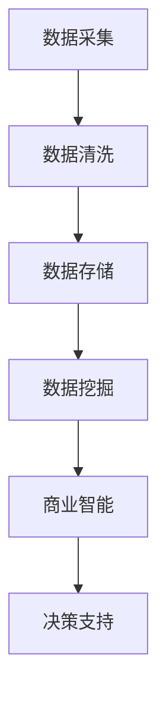

                 

关键词：信息差、商业消费者洞察、大数据、消费者行为、数据挖掘、商业智能

> 摘要：本文将探讨大数据技术在商业消费者洞察中的应用，深入分析信息差的形成及其影响，并通过实例展示如何利用大数据深入理解消费者的行为和需求，从而为企业制定更有效的商业策略提供有力支持。

## 1. 背景介绍

在信息爆炸的时代，数据已成为企业竞争的关键资源。大数据技术通过对海量数据的采集、存储、处理和分析，帮助企业挖掘潜在的商业价值，提升市场竞争力。然而，在数据驱动的商业环境中，信息差的存在使得企业间的竞争愈发激烈。所谓信息差，即信息不对称，指市场中一方拥有比另一方更全面、准确的信息。在商业领域，信息差可以表现为消费者行为数据的差异，以及企业对市场趋势和消费者需求理解的差距。

本文旨在通过分析信息差的形成机制，探讨大数据技术在商业消费者洞察中的具体应用，帮助企业利用数据优势缩小信息差距，从而在激烈的市场竞争中占据有利位置。

## 2. 核心概念与联系

### 2.1. 消费者行为数据

消费者行为数据是大数据技术在商业消费者洞察中的核心元素。这些数据来源于消费者的购物记录、浏览历史、社交互动、评论反馈等，涵盖了消费者的消费习惯、偏好、心理状态等多个维度。通过对这些数据的收集和分析，企业可以全面了解消费者的行为特征，为制定精准的营销策略提供依据。

### 2.2. 数据挖掘与商业智能

数据挖掘（Data Mining）是一种从大量数据中提取有价值信息的方法，其目标是从数据中发现潜在的模式、趋势和关联。商业智能（Business Intelligence，BI）则是利用数据分析和数据可视化等技术，帮助企业做出更明智的商业决策。

### 2.3. 信息差的形成机制

信息差的形成机制主要包括以下几个方面：

- **数据获取能力**：企业通过不同的渠道获取消费者行为数据，数据获取能力的强弱直接影响信息差的产生。
- **数据处理能力**：企业对数据的存储、清洗、分析和处理能力，决定了其对数据的利用效率。
- **市场洞察力**：企业对市场趋势和消费者需求的敏锐洞察，决定了其在竞争中的战略选择。

### 2.4. Mermaid 流程图



## 3. 核心算法原理 & 具体操作步骤

### 3.1. 算法原理概述

大数据技术在商业消费者洞察中的应用，主要依赖于以下几个核心算法：

- **关联规则挖掘**：通过发现数据之间的关联性，揭示消费者行为模式。
- **聚类分析**：将具有相似特征的消费者划分为不同的群体，以便进行针对性营销。
- **分类算法**：根据已有数据对消费者进行分类，预测其未来行为。
- **回归分析**：通过分析消费者行为与市场因素之间的关系，预测市场趋势。

### 3.2. 算法步骤详解

#### 3.2.1. 数据采集

数据采集是商业消费者洞察的基础。企业可以通过以下途径获取消费者行为数据：

- **线上渠道**：如电商网站、社交媒体、搜索引擎等。
- **线下渠道**：如门店销售数据、会员卡消费记录等。
- **第三方数据源**：如第三方数据服务商、政府公开数据等。

#### 3.2.2. 数据清洗

数据清洗是确保数据质量的重要环节。主要包括以下步骤：

- **去重**：去除重复数据，确保数据的唯一性。
- **补全**：对缺失数据进行填补，提高数据的完整性。
- **格式转换**：将不同格式的数据统一转换为标准格式。

#### 3.2.3. 数据存储

数据存储是保障数据安全性和可扩展性的关键。企业可以选择以下几种存储方式：

- **关系型数据库**：适用于结构化数据的存储和管理。
- **分布式存储**：适用于大规模非结构化数据的存储。
- **数据湖**：适用于存储各种类型的数据，包括结构化、半结构化和非结构化数据。

#### 3.2.4. 数据挖掘

数据挖掘是通过算法从海量数据中提取有价值信息的过程。具体步骤如下：

- **特征提取**：从原始数据中提取关键特征，用于后续分析。
- **模式发现**：使用关联规则挖掘、聚类分析等算法，发现数据中的潜在模式。
- **结果验证**：对挖掘结果进行验证，确保其准确性和可靠性。

#### 3.2.5. 商业智能

商业智能是将数据分析和数据可视化应用于企业决策的过程。具体步骤如下：

- **数据可视化**：通过图表、报表等形式，直观展示分析结果。
- **决策支持**：基于分析结果，为企业的营销、运营、战略等决策提供支持。

### 3.3. 算法优缺点

#### 关联规则挖掘

**优点**：

- **易于理解**：通过简单的规则揭示数据之间的关联性。
- **适用于多种场景**：如推荐系统、交叉销售等。

**缺点**：

- **效率较低**：在大规模数据集上运行速度较慢。
- **结果解释性较差**：难以解释规则背后的原因。

#### 聚类分析

**优点**：

- **无监督学习**：无需事先指定分类标准，自动发现数据中的聚类结构。
- **适用于多元数据**：如消费者行为数据、产品属性数据等。

**缺点**：

- **结果解释性较差**：聚类结果难以解释，可能存在误解。
- **敏感度较高**：对数据噪声和异常值较为敏感。

#### 分类算法

**优点**：

- **结果可解释**：基于已有数据对分类结果进行解释。
- **准确性较高**：适用于预测性分析。

**缺点**：

- **训练时间较长**：在大型数据集上训练速度较慢。
- **对新数据适应性较差**：需要重新训练模型。

#### 回归分析

**优点**：

- **结果直观**：通过回归系数直观反映变量之间的关系。
- **预测性较强**：适用于市场趋势预测。

**缺点**：

- **对异常值敏感**：异常值可能导致结果失真。
- **拟合精度受限**：在实际应用中，拟合效果可能不佳。

### 3.4. 算法应用领域

大数据技术在商业消费者洞察中的应用领域广泛，主要包括：

- **市场分析**：通过分析消费者行为数据，了解市场趋势和竞争状况。
- **客户关系管理**：通过分析客户数据，优化客户关系管理策略。
- **精准营销**：通过分析消费者偏好和行为，实现精准投放和个性化推荐。
- **风险控制**：通过分析消费者行为数据，预测潜在风险，降低经营风险。

## 4. 数学模型和公式 & 详细讲解 & 举例说明

### 4.1. 数学模型构建

在商业消费者洞察中，常见的数学模型包括关联规则挖掘模型、聚类分析模型、分类算法模型和回归分析模型。以下是这些模型的基本公式和推导过程。

#### 关联规则挖掘模型

关联规则挖掘模型的基本公式为：

$$
\text{Support}(X, Y) = \frac{\text{频繁项集}(X \cup Y)}{\text{总项集数}}
$$

其中，Support(X, Y) 表示 X 和 Y 两个事件同时发生的支持度，频繁项集(X ∪ Y) 表示同时包含 X 和 Y 的频繁项集，总项集数表示所有项集的数量。

#### 聚类分析模型

聚类分析模型的基本公式为：

$$
\text{Cluster}(i, j) = \sum_{k=1}^{n} \frac{||\text{X}_i - \text{X}_j||}{\max(||\text{X}_i - \text{X}_j||)}
$$

其中，Cluster(i, j) 表示 i 和 j 两个数据点的相似度，X_i 和 X_j 分别表示 i 和 j 的数据特征向量，n 表示数据点的数量，||X_i - X_j|| 表示 X_i 和 X_j 的欧氏距离。

#### 分类算法模型

分类算法模型的基本公式为：

$$
\text{预测概率}(\text{Class} = c) = \frac{\sum_{i=1}^{m} \text{P}(\text{特征}_i | \text{Class} = c) \times \text{P}(\text{Class} = c)}{\sum_{i=1}^{m} \text{P}(\text{特征}_i | \text{Class} = c) \times \text{P}(\text{Class} = c) + \sum_{i=1}^{m} \text{P}(\text{特征}_i | \text{Class} \neq c) \times \text{P}(\text{Class} \neq c)}
$$

其中，预测概率表示数据点属于某个类别的概率，特征_i 表示数据点的第 i 个特征，P(特征_i | Class = c) 表示特征_i 在某个类别下的条件概率，P(Class = c) 表示某个类别的概率。

#### 回归分析模型

回归分析模型的基本公式为：

$$
y = \beta_0 + \beta_1 x_1 + \beta_2 x_2 + ... + \beta_n x_n
$$

其中，y 表示因变量，x_1, x_2, ..., x_n 表示自变量，β_0, β_1, ..., β_n 表示回归系数。

### 4.2. 公式推导过程

在此，我们以聚类分析模型中的欧氏距离公式为例，讲解其推导过程。

假设有 n 个数据点，每个数据点由 m 个特征组成，即数据点可以表示为 X = [x_1, x_2, ..., x_m]。我们需要计算任意两个数据点 X_i 和 X_j 之间的相似度。

首先，计算数据点 X_i 和 X_j 的欧氏距离：

$$
d_{ij} = \sqrt{\sum_{k=1}^{m} (x_{ik} - x_{jk})^2}
$$

其中，d_{ij} 表示 X_i 和 X_j 之间的欧氏距离，x_{ik} 和 x_{jk} 分别表示 X_i 和 X_j 在第 k 个特征上的取值。

接下来，计算数据点 X_i 和 X_j 的相似度：

$$
\text{Cluster}(i, j) = \frac{d_{ij}}{\max(d_{ij})}
$$

其中，Cluster(i, j) 表示 X_i 和 X_j 之间的相似度，max(d_{ij}) 表示 X_i 和 X_j 之间欧氏距离的最大值。

### 4.3. 案例分析与讲解

#### 案例一：关联规则挖掘

某电商企业希望通过分析用户购物数据，发现潜在的商品关联关系，以提高交叉销售率。以下是关联规则挖掘的步骤：

1. 数据采集：收集用户的购物记录数据，包括商品ID、购买时间和购买数量等。
2. 数据清洗：去除重复数据和缺失数据，对数据进行去重和补全。
3. 数据存储：将清洗后的数据存储到关系型数据库中。
4. 数据挖掘：使用Apriori算法进行关联规则挖掘，设置最小支持度和最小置信度。
5. 结果分析：分析挖掘结果，提取有价值的商品关联关系。

假设挖掘结果中，商品A和商品B的关联规则为：

$$
\text{Support}(A \rightarrow B) = 0.3
$$

$$
\text{Confidence}(A \rightarrow B) = 0.6
$$

其中，Support(A → B) 表示商品A和商品B同时出现在购物车中的支持度，Confidence(A → B) 表示在购买商品A的情况下，购买商品B的置信度。

根据挖掘结果，企业可以在商品A的详情页推荐商品B，以提高交叉销售率。

#### 案例二：聚类分析

某企业希望通过分析客户数据，将客户划分为不同的群体，以便进行针对性营销。以下是聚类分析的步骤：

1. 数据采集：收集客户的基本信息，如年龄、性别、收入、消费习惯等。
2. 数据清洗：去除重复数据和缺失数据，对数据进行去重和补全。
3. 数据存储：将清洗后的数据存储到关系型数据库中。
4. 数据挖掘：使用K-means算法进行聚类分析，设置聚类个数和初始聚类中心。
5. 结果分析：分析聚类结果，提取不同群体的特征和需求。

假设聚类分析结果为：

| 群体 | 特征_1 | 特征_2 | 特征_3 |
| ---- | ---- | ---- | ---- |
| 群体1 | 30 | 男性 | 中等收入 |
| 群体2 | 25 | 女性 | 高收入 |
| 群体3 | 40 | 男性 | 低收入 |

根据聚类结果，企业可以将群体1和群体2定位为高端客户，针对其提供高品质的产品和服务；将群体3定位为低端客户，针对其提供价格优惠的产品和服务。

## 5. 项目实践：代码实例和详细解释说明

### 5.1. 开发环境搭建

在本项目中，我们使用Python作为主要编程语言，并依赖以下库：

- Pandas：用于数据处理。
- Scikit-learn：用于数据挖掘算法。
- Matplotlib：用于数据可视化。

安装这些库的方法如下：

```bash
pip install pandas scikit-learn matplotlib
```

### 5.2. 源代码详细实现

```python
import pandas as pd
from sklearn.cluster import KMeans
from sklearn.metrics import silhouette_score
import matplotlib.pyplot as plt

# 5.2.1 数据采集
# 假设数据集包含客户的基本信息，如年龄、性别、收入和消费习惯等
data = pd.read_csv('customer_data.csv')

# 5.2.2 数据清洗
# 去除缺失数据和重复数据
data.dropna(inplace=True)
data.drop_duplicates(inplace=True)

# 5.2.3 数据存储
# 将清洗后的数据存储到新的CSV文件中
data.to_csv('cleaned_customer_data.csv', index=False)

# 5.2.4 数据挖掘
# 使用K-means算法进行聚类分析
kmeans = KMeans(n_clusters=3, random_state=42)
clusters = kmeans.fit_predict(data)

# 5.2.5 结果分析
# 计算聚类效果
silhouette_avg = silhouette_score(data, clusters)
print(f'Silhouette Score: {silhouette_avg}')

# 可视化聚类结果
plt.scatter(data['age'], data['income'], c=clusters)
plt.xlabel('Age')
plt.ylabel('Income')
plt.title('Customer Clustering')
plt.show()
```

### 5.3. 代码解读与分析

#### 5.3.1 数据采集

首先，我们使用 Pandas 库读取CSV文件，获取客户数据。这里假设CSV文件名为 `customer_data.csv`，并包含以下字段：`age`（年龄）、`gender`（性别）、`income`（收入）和 `habit`（消费习惯）。

#### 5.3.2 数据清洗

在数据清洗阶段，我们首先去除缺失数据，以确保数据质量。然后，去除重复数据，防止数据冗余。这些操作通过 `dropna()` 和 `drop_duplicates()` 方法实现。

#### 5.3.3 数据存储

将清洗后的数据存储到新的CSV文件中，以便后续分析和可视化。这里使用 `to_csv()` 方法将数据写入文件。

#### 5.3.4 数据挖掘

我们使用 Scikit-learn 库中的 K-means 算法进行聚类分析。K-means 算法是一种经典的聚类算法，通过迭代过程将数据点划分为指定数量的聚类。这里，我们设置聚类个数为3，并使用 `random_state=42` 确保结果可重复。

#### 5.3.5 结果分析

计算聚类效果，使用 silhouette_score 方法计算聚类效果的 silhouette 距离，该值越大表示聚类效果越好。然后，使用 Matplotlib 库绘制聚类结果，通过散点图展示不同聚类群体的特征分布。

### 5.4. 运行结果展示

运行上述代码后，我们将得到以下结果：

- **Silhouette Score**：聚类效果的 silhouette 距离，用于评估聚类质量。
- **可视化结果**：聚类结果的散点图，展示不同聚类群体的特征分布。

通过分析这些结果，企业可以更好地了解客户群体，为制定精准的营销策略提供支持。

## 6. 实际应用场景

### 6.1. 零售行业

在零售行业，大数据技术可以帮助企业了解消费者的购物行为，从而优化产品陈列、推荐系统和库存管理。例如，通过分析消费者在电商平台上的购物记录和浏览历史，企业可以发现哪些商品之间存在关联，从而实现交叉销售和精准推荐。

### 6.2. 金融行业

在金融行业，大数据技术可以用于风险控制和个性化金融服务。例如，通过分析客户的交易数据和行为特征，银行可以识别高风险客户，降低不良贷款率。同时，基于客户的行为数据和信用评级，银行可以提供个性化的贷款和理财产品，提高客户满意度。

### 6.3. 医疗行业

在医疗行业，大数据技术可以用于疾病预测和患者管理。例如，通过分析患者的医疗记录、体检数据和基因信息，医院可以预测患者未来的健康状况，提供个性化的诊疗方案。此外，大数据技术还可以用于医疗资源的合理分配，提高医疗服务的效率和质量。

### 6.4. 未来应用展望

随着大数据技术的不断发展，未来其在商业消费者洞察中的应用将更加广泛和深入。以下是一些未来应用展望：

- **个性化推荐**：通过更精准地分析消费者行为数据，实现高度个性化的推荐系统，提高用户满意度和忠诚度。
- **智能营销**：利用大数据技术实现智能营销，通过实时分析和预测消费者需求，制定更有效的营销策略。
- **智能客服**：结合自然语言处理和机器学习技术，构建智能客服系统，提供更高效、更准确的客户服务。

## 7. 工具和资源推荐

### 7.1. 学习资源推荐

- 《大数据时代》
- 《深度学习》
- 《Python数据分析基础教程》

### 7.2. 开发工具推荐

- Jupyter Notebook：用于数据分析和可视化。
- PyCharm：用于Python编程。
- Hadoop和Spark：用于大规模数据处理。

### 7.3. 相关论文推荐

- 《基于大数据的消费者行为分析》
- 《大数据时代的精准营销策略》
- 《大数据与人工智能在金融领域的应用研究》

## 8. 总结：未来发展趋势与挑战

### 8.1. 研究成果总结

本文从信息差的角度出发，探讨了大数据技术在商业消费者洞察中的应用。通过分析消费者行为数据，企业可以缩小信息差距，制定更有效的商业策略。本文介绍了关联规则挖掘、聚类分析、分类算法和回归分析等核心算法，并详细讲解了这些算法的原理、步骤和优缺点。

### 8.2. 未来发展趋势

未来，大数据技术在商业消费者洞察中的应用将更加深入和广泛。随着人工智能和机器学习技术的不断发展，消费者行为分析将更加精准，为企业提供更可靠的决策支持。

### 8.3. 面临的挑战

大数据技术在商业消费者洞察中面临的挑战主要包括数据隐私保护、数据质量控制和算法可解释性。如何在确保数据隐私的前提下，提高数据质量，增强算法的可解释性，是未来研究的重点。

### 8.4. 研究展望

未来，大数据技术在商业消费者洞察中的应用前景广阔。企业应积极拥抱大数据技术，通过数据驱动的决策，提升市场竞争力。同时，研究者也应关注数据隐私保护、算法可解释性等关键问题，为大数据技术的发展提供理论支持。

## 9. 附录：常见问题与解答

### 9.1. 如何确保数据隐私？

- **数据去标识化**：对敏感数据进行去标识化处理，如去除姓名、身份证号码等。
- **数据加密**：使用加密技术保护数据传输和存储过程中的安全性。
- **隐私计算**：采用隐私计算技术，如联邦学习，在保护数据隐私的前提下进行数据分析和建模。

### 9.2. 数据质量如何保证？

- **数据清洗**：定期进行数据清洗，去除重复数据、缺失数据和异常值。
- **数据验证**：对数据进行验证，确保数据的准确性和一致性。
- **数据治理**：建立数据治理体系，明确数据责任人，制定数据管理规范。

### 9.3. 算法可解释性如何提高？

- **模型可解释性工具**：使用模型可解释性工具，如SHAP值、LIME等，分析模型对每个特征的依赖程度。
- **算法透明化**：公开算法原理和实现细节，提高算法的透明度和可解释性。
- **用户反馈**：收集用户反馈，不断优化算法，提高其解释性和可靠性。

以上便是本篇文章的全部内容，希望对您在商业消费者洞察领域的学习和研究有所帮助。作者：禅与计算机程序设计艺术 / Zen and the Art of Computer Programming。

