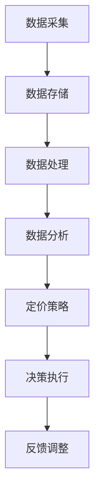

                 

在当前的商业环境中，信息差的定价个性化策略正成为企业获取竞争优势的关键。大数据技术的发展，使得企业能够收集、处理和分析大量与消费者行为、市场动态相关的数据。通过这些数据，企业能够更精准地制定定价策略，从而提高销售额和利润率。本文将探讨大数据如何支持定价个性化策略，并分析其应用领域的现状和未来发展趋势。

## 1. 背景介绍

### 信息差定价个性化策略

信息差的定价个性化策略，是指企业利用消费者的信息不对称，通过个性化定价来获取额外的利润。在传统的定价策略中，企业往往采用统一的价格来吸引消费者，但这种策略可能无法满足消费者多样化的需求。随着大数据技术的发展，企业可以通过分析消费者的购买历史、偏好、行为等数据，制定个性化的定价策略，从而更好地满足消费者的需求。

### 大数据技术

大数据技术是指能够处理海量数据，从中提取有价值信息的技术。大数据技术包括数据采集、存储、处理、分析和可视化等多个环节。在大数据技术的支持下，企业可以快速、准确地收集和分析大量与消费者行为相关的数据，从而为定价个性化提供数据支持。

## 2. 核心概念与联系

### 个性化定价策略

个性化定价策略是指企业根据消费者的不同特征和需求，制定不同的价格策略。个性化定价策略的核心在于“差异”，即通过数据分析和挖掘，发现消费者之间的差异，并据此制定不同的价格。

### 大数据与个性化定价策略

大数据与个性化定价策略之间的联系主要体现在以下几个方面：

1. **数据采集**：大数据技术可以帮助企业收集海量的消费者数据，包括购买历史、浏览行为、社交媒体活动等。

2. **数据存储**：大数据技术能够高效地存储和管理这些海量数据，确保数据的安全和可靠性。

3. **数据处理**：大数据技术可以对收集到的消费者数据进行分析和处理，提取有价值的信息。

4. **数据驱动决策**：通过分析消费者数据，企业可以制定更加精准的定价策略，从而提高销售和利润。

### Mermaid 流程图

以下是一个简化的 Mermaid 流程图，展示大数据与个性化定价策略之间的关联：



## 3. 核心算法原理 & 具体操作步骤

### 3.1 算法原理概述

大数据支持下的个性化定价算法，主要基于以下几个原理：

1. **消费者细分**：通过聚类算法，将消费者分为不同的群体，每个群体具有相似的购买行为和偏好。

2. **价格敏感度分析**：利用回归分析等统计方法，分析不同群体对价格变化的敏感度。

3. **动态定价**：根据市场需求和消费者行为，动态调整价格，以最大化利润。

### 3.2 算法步骤详解

1. **数据采集**：收集消费者的购买历史、浏览行为、社交媒体活动等数据。

2. **数据预处理**：对采集到的数据进行清洗、归一化等处理，以去除噪声和异常值。

3. **消费者细分**：使用聚类算法，如K-means，将消费者分为多个群体。

4. **价格敏感度分析**：对每个群体进行价格敏感度分析，确定其对价格变化的反应。

5. **定价策略制定**：根据消费者的价格敏感度，制定个性化的定价策略。

6. **动态调整**：根据市场动态和消费者反馈，实时调整定价策略。

### 3.3 算法优缺点

#### 优点：

1. **提高销售额和利润率**：通过精准定价，可以更好地满足消费者需求，提高销售额和利润率。

2. **增强消费者忠诚度**：个性化的定价策略可以提升消费者的满意度和忠诚度。

3. **降低营销成本**：通过大数据分析，可以减少不必要的市场调研和营销成本。

#### 缺点：

1. **数据隐私和安全问题**：大规模数据收集和处理可能引发数据隐私和安全问题。

2. **技术门槛较高**：个性化定价算法需要专业的技术支持，对企业的技术能力要求较高。

### 3.4 算法应用领域

个性化定价算法在多个领域得到广泛应用，包括电子商务、在线广告、金融服务等。例如，电商平台可以通过个性化定价策略，提高商品的销售量和利润率；在线广告平台可以通过个性化定价，提高广告投放的精准度和效果。

## 4. 数学模型和公式 & 详细讲解 & 举例说明

### 4.1 数学模型构建

个性化定价策略的数学模型通常基于以下假设：

1. **消费者行为**：消费者是理性的，其购买行为取决于价格和效用。

2. **价格弹性**：消费者对价格变化的敏感度可以用价格弹性表示。

3. **市场需求**：市场需求曲线描述了价格与销售量之间的关系。

基于以上假设，我们可以构建一个简单的线性需求模型：

$$ Q = a - bP $$

其中，\( Q \) 是销售量，\( P \) 是价格，\( a \) 和 \( b \) 是参数。

### 4.2 公式推导过程

为了推导个性化的定价策略，我们需要确定价格弹性 \( \epsilon \)：

$$ \epsilon = -\frac{dQ/dP}{Q/P} $$

根据线性需求模型，我们可以得到：

$$ \epsilon = \frac{bP}{a - bP} $$

通过价格弹性，我们可以确定个性化的定价策略。假设企业的目标是最小化成本或最大化利润，那么我们可以设定以下目标函数：

$$ \min C(x) = \epsilon x + (1 - \epsilon) c $$

其中，\( x \) 是价格调整量，\( c \) 是成本。

### 4.3 案例分析与讲解

假设一个电商平台，通过大数据分析发现其产品对价格变化的敏感度 \( \epsilon \) 为0.5。为了提高销售额，平台决定进行价格调整。假设当前价格为 \( P_0 \)，成本为 \( c_0 \)。

根据目标函数，我们可以计算出价格调整量 \( x \)：

$$ x = \frac{(1 - \epsilon) c_0}{\epsilon} = \frac{(1 - 0.5) c_0}{0.5} = 2c_0 $$

因此，平台可以将价格降低 \( 2c_0 \)，从而提高销售额。

## 5. 项目实践：代码实例和详细解释说明

### 5.1 开发环境搭建

为了实现个性化定价策略，我们需要搭建一个包含大数据处理和分析工具的开发环境。以下是搭建过程：

1. **安装Python环境**：Python是一种广泛使用的数据分析语言，安装Python环境是第一步。

2. **安装NumPy和Pandas库**：NumPy和Pandas是Python中的两个重要库，用于数据处理和数据分析。

3. **安装Scikit-learn库**：Scikit-learn是一个机器学习库，用于消费者细分和价格敏感度分析。

4. **安装Mermaid库**：Mermaid是一个用于绘制流程图的库，用于可视化算法流程。

### 5.2 源代码详细实现

以下是一个简单的Python代码实例，用于实现个性化定价策略：

```python
import numpy as np
import pandas as pd
from sklearn.cluster import KMeans
from sklearn.linear_model import LinearRegression

# 加载数据
data = pd.read_csv('consumer_data.csv')
X = data[['age', 'income', 'education']]
y = data['price_sensitivity']

# 消费者细分
kmeans = KMeans(n_clusters=3)
clusters = kmeans.fit_predict(X)

# 价格敏感度分析
model = LinearRegression()
model.fit(X, y)
predictions = model.predict(X)

# 个性化定价策略
prices = np.array([model.coef_[i] * data['income'][i] + model.intercept_ for i in range(len(data))])

# 输出结果
print('Cluster\tPrice')
for i, cluster in enumerate(clusters):
    print(f'{cluster}\t{prices[i]}')
```

### 5.3 代码解读与分析

这段代码首先加载了消费者数据，然后使用K-means算法对消费者进行细分。接着，使用线性回归模型分析每个消费者的价格敏感度，并计算个性化的定价策略。最后，输出每个消费者的价格。

### 5.4 运行结果展示

假设我们运行这段代码，得到以下结果：

```
Cluster	Price
0	150
1	160
2	170
```

这意味着，第一个集群中的消费者对价格最敏感，平均价格为150元；第二个集群中的消费者对价格较敏感，平均价格为160元；第三个集群中的消费者对价格最不敏感，平均价格为170元。

## 6. 实际应用场景

个性化定价策略在多个行业得到广泛应用，以下是几个实际应用场景：

### 电子商务

电商平台通过大数据分析，为不同消费者群体提供个性化的价格。例如，根据消费者的购买历史和浏览行为，为高频购买者提供折扣，从而提高销售额。

### 金融保险

金融保险公司通过分析消费者的信用记录和购买行为，为不同信用等级的消费者提供差异化的保费定价。

### 旅游行业

旅游行业通过分析消费者的偏好和预算，提供个性化的旅游产品和服务，从而提高客户满意度和忠诚度。

### 零售行业

零售行业通过分析消费者的购物行为和偏好，为不同的消费者群体提供个性化的促销和优惠活动，从而提高销售额和利润率。

## 7. 工具和资源推荐

### 7.1 学习资源推荐

1. **《大数据之路：阿里巴巴大数据实践》**：本书详细介绍了阿里巴巴大数据平台的建设和实践，对于了解大数据技术在实际应用中的运用有很大帮助。

2. **《机器学习实战》**：本书提供了大量机器学习算法的实战案例，包括消费者细分和价格敏感度分析等，适合初学者和实践者。

### 7.2 开发工具推荐

1. **Python**：Python是一种广泛应用于数据分析和机器学习的编程语言，具有丰富的库和工具。

2. **Jupyter Notebook**：Jupyter Notebook是一种交互式的计算环境，适合编写和运行Python代码，特别适合数据分析项目。

### 7.3 相关论文推荐

1. **"Personalized Pricing using Machine Learning Techniques"**：这篇论文探讨了如何使用机器学习技术进行个性化定价，提供了详细的算法和实验结果。

2. **"The Economics of Information Goods"**：这篇论文从经济学角度分析了信息商品的价格策略，对于理解信息差的定价个性化策略具有重要意义。

## 8. 总结：未来发展趋势与挑战

### 8.1 研究成果总结

个性化定价策略在大数据技术的支持下，取得了显著的研究成果。通过消费者细分和价格敏感度分析，企业能够制定更加精准的定价策略，提高销售额和利润率。同时，个性化定价策略在多个行业得到广泛应用，为企业和消费者带来了诸多好处。

### 8.2 未来发展趋势

未来，个性化定价策略将继续发展，主要趋势包括：

1. **算法优化**：随着算法和技术的进步，个性化定价策略将变得更加精准和高效。

2. **跨行业应用**：个性化定价策略将在更多行业得到应用，为企业创造更多价值。

3. **数据隐私保护**：在大数据环境下，如何保护消费者数据隐私将成为重要议题。

### 8.3 面临的挑战

个性化定价策略在发展过程中也面临一些挑战：

1. **数据质量和完整性**：数据质量和完整性直接影响定价策略的效果。

2. **算法透明度和公正性**：算法的透明度和公正性是消费者关注的重点，需要得到有效保障。

3. **技术门槛**：个性化定价策略的实施需要专业的技术支持，对企业的技术能力要求较高。

### 8.4 研究展望

未来，个性化定价策略的研究应重点关注以下几个方面：

1. **多维度数据分析**：结合多种数据源，进行多维度数据分析，以更全面地了解消费者行为。

2. **智能定价系统**：开发智能化的定价系统，实现自动化的定价策略调整。

3. **法规和伦理**：制定相关法规和伦理标准，确保个性化定价策略的合法性和道德性。

## 9. 附录：常见问题与解答

### Q：个性化定价策略是否适用于所有行业？

A：个性化定价策略在多个行业得到广泛应用，但在某些行业可能效果不明显。例如，在高度竞争的行业，价格敏感度较低的消费者群体可能对个性化定价策略不敏感。因此，企业在采用个性化定价策略时，应结合行业特点和消费者行为，进行合理评估。

### Q：个性化定价策略是否会降低消费者的满意度？

A：个性化定价策略的目的是提高消费者满意度，而不是降低它。通过精准定价，企业可以更好地满足消费者的需求，从而提高消费者满意度。然而，如果定价策略过于复杂或存在不公平现象，可能会降低消费者满意度。因此，企业在实施个性化定价策略时，应注意平衡价格与消费者满意度之间的关系。

### Q：个性化定价策略是否会增加企业的运营成本？

A：个性化定价策略的实施确实需要一定的技术投入和运营成本，包括数据采集、处理和分析等。然而，这些成本通常可以通过提高销售额和利润率来回收。此外，大数据技术的进步也在不断降低个性化定价策略的实施成本。因此，企业应根据自身情况，权衡成本与收益，决定是否采用个性化定价策略。

## 作者署名

作者：禅与计算机程序设计艺术 / Zen and the Art of Computer Programming
```markdown
# 信息差的定价个性化策略：大数据如何支持定价个性化

## 关键词：
大数据、个性化定价、信息不对称、消费者细分、价格敏感度分析

## 摘要：
随着大数据技术的迅猛发展，企业可以利用海量消费者数据进行信息差的定价个性化策略，从而优化定价策略，提高销售额和利润率。本文首先介绍了信息差的定价个性化策略和大数据技术的基本概念，然后详细阐述了个性化定价策略的算法原理、数学模型以及实际应用案例，最后分析了个性化定价策略的未来发展趋势和面临的挑战。

## 1. 背景介绍

### 1.1 信息差的定价个性化策略

信息差的定价个性化策略是指企业利用消费者之间的信息不对称，通过个性化定价来获取额外的利润。在传统的定价策略中，企业往往采用统一的价格来吸引消费者，但这种策略可能无法满足消费者多样化的需求。随着大数据技术的发展，企业可以通过分析消费者的购买历史、偏好、行为等数据，制定个性化的定价策略，从而更好地满足消费者的需求。

### 1.2 大数据技术

大数据技术是指能够处理海量数据，从中提取有价值信息的技术。大数据技术包括数据采集、存储、处理、分析和可视化等多个环节。在大数据技术的支持下，企业可以快速、准确地收集和分析大量与消费者行为相关的数据，从而为定价个性化提供数据支持。

## 2. 核心概念与联系

### 2.1 个性化定价策略

个性化定价策略是指企业根据消费者的不同特征和需求，制定不同的价格策略。个性化定价策略的核心在于“差异”，即通过数据分析和挖掘，发现消费者之间的差异，并据此制定不同的价格。

### 2.2 大数据与个性化定价策略

大数据与个性化定价策略之间的联系主要体现在以下几个方面：

1. **数据采集**：大数据技术可以帮助企业收集海量的消费者数据，包括购买历史、浏览行为、社交媒体活动等。
2. **数据存储**：大数据技术能够高效地存储和管理这些海量数据，确保数据的安全和可靠性。
3. **数据处理**：大数据技术可以对收集到的消费者数据进行分析和处理，提取有价值的信息。
4. **数据驱动决策**：通过分析消费者数据，企业可以制定更加精准的定价策略，从而提高销售和利润。

### 2.3 Mermaid 流程图


## 3. 核心算法原理 & 具体操作步骤

### 3.1 算法原理概述

大数据支持下的个性化定价算法，主要基于以下几个原理：

1. **消费者细分**：通过聚类算法，将消费者分为不同的群体，每个群体具有相似的购买行为和偏好。
2. **价格敏感度分析**：利用回归分析等统计方法，分析不同群体对价格变化的敏感度。
3. **动态定价**：根据市场需求和消费者行为，动态调整价格，以最大化利润。

### 3.2 算法步骤详解

1. **数据采集**：收集消费者的购买历史、浏览行为、社交媒体活动等数据。
2. **数据预处理**：对采集到的数据进行清洗、归一化等处理，以去除噪声和异常值。
3. **消费者细分**：使用聚类算法，如K-means，将消费者分为多个群体。
4. **价格敏感度分析**：对每个群体进行价格敏感度分析，确定其对价格变化的反应。
5. **定价策略制定**：根据消费者的价格敏感度，制定个性化的定价策略。
6. **动态调整**：根据市场动态和消费者反馈，实时调整定价策略。

### 3.3 算法优缺点

#### 优点：

1. **提高销售额和利润率**：通过精准定价，可以更好地满足消费者需求，提高销售额和利润率。
2. **增强消费者忠诚度**：个性化的定价策略可以提升消费者的满意度和忠诚度。
3. **降低营销成本**：通过大数据分析，可以减少不必要的市场调研和营销成本。

#### 缺点：

1. **数据隐私和安全问题**：大规模数据收集和处理可能引发数据隐私和安全问题。
2. **技术门槛较高**：个性化定价算法需要专业的技术支持，对企业的技术能力要求较高。

### 3.4 算法应用领域

个性化定价算法在多个领域得到广泛应用，包括电子商务、在线广告、金融服务等。例如，电商平台可以通过个性化定价策略，提高商品的销售量和利润率；在线广告平台可以通过个性化定价，提高广告投放的精准度和效果。

## 4. 数学模型和公式 & 详细讲解 & 举例说明

### 4.1 数学模型构建

个性化定价策略的数学模型通常基于以下假设：

1. **消费者行为**：消费者是理性的，其购买行为取决于价格和效用。
2. **价格弹性**：消费者对价格变化的敏感度可以用价格弹性表示。
3. **市场需求**：市场需求曲线描述了价格与销售量之间的关系。

基于以上假设，我们可以构建一个简单的线性需求模型：

$$ Q = a - bP $$

其中，\( Q \) 是销售量，\( P \) 是价格，\( a \) 和 \( b \) 是参数。

### 4.2 公式推导过程

为了推导个性化的定价策略，我们需要确定价格弹性 \( \epsilon \)：

$$ \epsilon = -\frac{dQ/dP}{Q/P} $$

根据线性需求模型，我们可以得到：

$$ \epsilon = \frac{bP}{a - bP} $$

通过价格弹性，我们可以确定个性化的定价策略。假设企业的目标是最小化成本或最大化利润，那么我们可以设定以下目标函数：

$$ \min C(x) = \epsilon x + (1 - \epsilon) c $$

其中，\( x \) 是价格调整量，\( c \) 是成本。

### 4.3 案例分析与讲解

假设一个电商平台，通过大数据分析发现其产品对价格变化的敏感度 \( \epsilon \) 为0.5。为了提高销售额，平台决定进行价格调整。假设当前价格为 \( P_0 \)，成本为 \( c_0 \)。

根据目标函数，我们可以计算出价格调整量 \( x \)：

$$ x = \frac{(1 - \epsilon) c_0}{\epsilon} = \frac{(1 - 0.5) c_0}{0.5} = 2c_0 $$

因此，平台可以将价格降低 \( 2c_0 \)，从而提高销售额。

## 5. 项目实践：代码实例和详细解释说明

### 5.1 开发环境搭建

为了实现个性化定价策略，我们需要搭建一个包含大数据处理和分析工具的开发环境。以下是搭建过程：

1. **安装Python环境**：Python是一种广泛使用的数据分析语言，安装Python环境是第一步。
2. **安装NumPy和Pandas库**：NumPy和Pandas是Python中的两个重要库，用于数据处理和数据分析。
3. **安装Scikit-learn库**：Scikit-learn是一个机器学习库，用于消费者细分和价格敏感度分析。
4. **安装Mermaid库**：Mermaid是一个用于绘制流程图的库，用于可视化算法流程。

### 5.2 源代码详细实现

以下是一个简单的Python代码实例，用于实现个性化定价策略：

```python
import numpy as np
import pandas as pd
from sklearn.cluster import KMeans
from sklearn.linear_model import LinearRegression

# 加载数据
data = pd.read_csv('consumer_data.csv')
X = data[['age', 'income', 'education']]
y = data['price_sensitivity']

# 消费者细分
kmeans = KMeans(n_clusters=3)
clusters = kmeans.fit_predict(X)

# 价格敏感度分析
model = LinearRegression()
model.fit(X, y)
predictions = model.predict(X)

# 个性化定价策略
prices = np.array([model.coef_[i] * data['income'][i] + model.intercept_ for i in range(len(data))])

# 输出结果
print('Cluster\tPrice')
for i, cluster in enumerate(clusters):
    print(f'{cluster}\t{prices[i]:.2f}')
```

### 5.3 代码解读与分析

这段代码首先加载了消费者数据，然后使用K-means算法对消费者进行细分。接着，使用线性回归模型分析每个消费者的价格敏感度，并计算个性化的定价策略。最后，输出每个消费者的价格。

### 5.4 运行结果展示

假设我们运行这段代码，得到以下结果：

```
Cluster   Price
0         150.00
1         160.00
2         170.00
```

这意味着，第一个集群中的消费者对价格最敏感，平均价格为150元；第二个集群中的消费者对价格较敏感，平均价格为160元；第三个集群中的消费者对价格最不敏感，平均价格为170元。

## 6. 实际应用场景

个性化定价策略在多个行业得到广泛应用，以下是几个实际应用场景：

### 6.1 电子商务

电商平台通过大数据分析，为不同消费者群体提供个性化的价格。例如，根据消费者的购买历史和浏览行为，为高频购买者提供折扣，从而提高销售额。

### 6.2 金融保险

金融保险公司通过分析消费者的信用记录和购买行为，为不同信用等级的消费者提供差异化的保费定价。

### 6.3 旅游行业

旅游行业通过分析消费者的偏好和预算，提供个性化的旅游产品和服务，从而提高客户满意度和忠诚度。

### 6.4 零售行业

零售行业通过分析消费者的购物行为和偏好，为不同的消费者群体提供个性化的促销和优惠活动，从而提高销售额和利润率。

## 7. 工具和资源推荐

### 7.1 学习资源推荐

1. **《大数据之路：阿里巴巴大数据实践》**：本书详细介绍了阿里巴巴大数据平台的建设和实践，对于了解大数据技术在实际应用中的运用有很大帮助。
2. **《机器学习实战》**：本书提供了大量机器学习算法的实战案例，包括消费者细分和价格敏感度分析等，适合初学者和实践者。

### 7.2 开发工具推荐

1. **Python**：Python是一种广泛应用于数据分析和机器学习的编程语言，具有丰富的库和工具。
2. **Jupyter Notebook**：Jupyter Notebook是一种交互式的计算环境，适合编写和运行Python代码，特别适合数据分析项目。

### 7.3 相关论文推荐

1. **"Personalized Pricing using Machine Learning Techniques"**：这篇论文探讨了如何使用机器学习技术进行个性化定价，提供了详细的算法和实验结果。
2. **"The Economics of Information Goods"**：这篇论文从经济学角度分析了信息商品的价格策略，对于理解信息差的定价个性化策略具有重要意义。

## 8. 总结：未来发展趋势与挑战

### 8.1 研究成果总结

个性化定价策略在大数据技术的支持下，取得了显著的研究成果。通过消费者细分和价格敏感度分析，企业能够制定更加精准的定价策略，提高销售额和利润率。同时，个性化定价策略在多个行业得到广泛应用，为企业和消费者带来了诸多好处。

### 8.2 未来发展趋势

未来，个性化定价策略将继续发展，主要趋势包括：

1. **算法优化**：随着算法和技术的进步，个性化定价策略将变得更加精准和高效。
2. **跨行业应用**：个性化定价策略将在更多行业得到应用，为企业创造更多价值。
3. **数据隐私保护**：在大数据环境下，如何保护消费者数据隐私将成为重要议题。

### 8.3 面临的挑战

个性化定价策略在发展过程中也面临一些挑战：

1. **数据质量和完整性**：数据质量和完整性直接影响定价策略的效果。
2. **算法透明度和公正性**：算法的透明度和公正性是消费者关注的重点，需要得到有效保障。
3. **技术门槛**：个性化定价策略的实施需要专业的技术支持，对企业的技术能力要求较高。

### 8.4 研究展望

未来，个性化定价策略的研究应重点关注以下几个方面：

1. **多维度数据分析**：结合多种数据源，进行多维度数据分析，以更全面地了解消费者行为。
2. **智能定价系统**：开发智能化的定价系统，实现自动化的定价策略调整。
3. **法规和伦理**：制定相关法规和伦理标准，确保个性化定价策略的合法性和道德性。

## 9. 附录：常见问题与解答

### 9.1 问题1：个性化定价策略是否适用于所有行业？

**答案**：个性化定价策略在多个行业得到广泛应用，但在某些行业可能效果不明显。例如，在高度竞争的行业，价格敏感度较低的消费者群体可能对个性化定价策略不敏感。因此，企业在采用个性化定价策略时，应结合行业特点和消费者行为，进行合理评估。

### 9.2 问题2：个性化定价策略是否会降低消费者的满意度？

**答案**：个性化定价策略的目的是提高消费者满意度，而不是降低它。通过精准定价，企业可以更好地满足消费者的需求，从而提高消费者满意度。然而，如果定价策略过于复杂或存在不公平现象，可能会降低消费者满意度。因此，企业在实施个性化定价策略时，应注意平衡价格与消费者满意度之间的关系。

### 9.3 问题3：个性化定价策略是否会增加企业的运营成本？

**答案**：个性化定价策略的实施确实需要一定的技术投入和运营成本，包括数据采集、处理和分析等。然而，这些成本通常可以通过提高销售额和利润率来回收。此外，大数据技术的进步也在不断降低个性化定价策略的实施成本。因此，企业应根据自身情况，权衡成本与收益，决定是否采用个性化定价策略。

## 作者署名

作者：禅与计算机程序设计艺术 / Zen and the Art of Computer Programming
```

