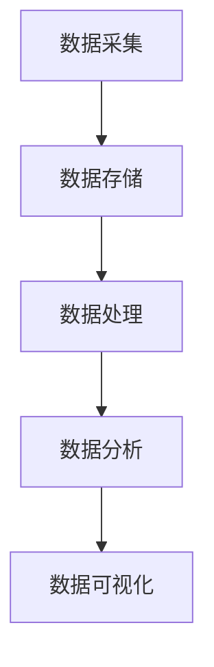

                 

信息差，即信息不对称，是指在市场经济中，不同主体对同一信息的掌握程度存在差异。在互联网和大数据时代，信息差成为了企业竞争的关键因素。本文将探讨如何通过大数据的战略布局，实现对企业发展的引领。

## 1. 背景介绍

信息差的存在源于人类社会的复杂性和多样性。在过去，信息传播速度较慢，获取信息的成本较高，导致信息不对称现象普遍存在。随着互联网和大数据技术的发展，信息获取和传播变得前所未有的便捷，信息差逐渐成为企业竞争的新战场。

大数据是指无法在合理时间内用常规软件工具进行捕捉、管理和处理的数据集合。大数据的规模、速度和多样性使得企业能够更全面、更深入地了解市场和客户，从而实现精准决策和战略布局。

## 2. 核心概念与联系

### 2.1 大数据的三个V

大数据具有三个核心特征，即Volume（数据量）、Velocity（数据速度）和Variety（数据多样性）。

- **数据量（Volume）**：大数据的规模庞大，通常需要分布式计算和存储技术来处理。
- **数据速度（Velocity）**：大数据的处理速度要求高，实时性是关键。
- **数据多样性（Variety）**：大数据来源广泛，包括结构化、半结构化和非结构化数据。

### 2.2 大数据的处理流程

大数据的处理流程包括数据采集、数据存储、数据处理、数据分析和数据可视化等环节。

- **数据采集**：通过各种渠道获取数据，如网站、传感器、社交媒体等。
- **数据存储**：使用分布式存储技术，如Hadoop、NoSQL数据库等，存储海量数据。
- **数据处理**：采用分布式计算框架，如MapReduce、Spark等，对数据进行清洗、转换和分析。
- **数据分析**：利用数据挖掘、机器学习等技术，提取数据中的价值信息。
- **数据可视化**：通过图表、报表等形式，将数据分析结果直观地呈现出来。

### 2.3 Mermaid 流程图



## 3. 核心算法原理 & 具体操作步骤

### 3.1 算法原理概述

大数据处理的核心算法主要包括数据挖掘、机器学习和数据可视化等技术。这些算法能够帮助企业从海量数据中提取有价值的信息，实现精准营销、风险控制和运营优化。

### 3.2 算法步骤详解

- **数据挖掘**：通过统计分析、模式识别等方法，从数据中提取隐藏的规律和模式。
- **机器学习**：利用算法模拟人类学习过程，从数据中学习规律，进行预测和分类。
- **数据可视化**：通过图表、报表等形式，将数据分析结果直观地呈现出来。

### 3.3 算法优缺点

- **数据挖掘**：优点包括发现未知规律、提高决策效率；缺点包括算法复杂、数据依赖性较强。
- **机器学习**：优点包括自动学习、提高预测准确性；缺点包括算法复杂、对数据质量要求高。
- **数据可视化**：优点包括直观易懂、便于交流；缺点包括数据抽象、难以深度分析。

### 3.4 算法应用领域

- **数据挖掘**：广泛应用于市场分析、风险评估、客户行为分析等领域。
- **机器学习**：广泛应用于金融、医疗、交通等行业的预测和优化。
- **数据可视化**：广泛应用于企业报告、产品展示、决策支持等领域。

## 4. 数学模型和公式 & 详细讲解 & 举例说明

### 4.1 数学模型构建

大数据分析中的数学模型主要包括线性回归、逻辑回归、决策树等。

- **线性回归**：用于预测连续型变量。
- **逻辑回归**：用于预测离散型变量。
- **决策树**：用于分类和回归任务。

### 4.2 公式推导过程

- **线性回归**：$$y = \beta_0 + \beta_1x_1 + \beta_2x_2 + ... + \beta_nx_n$$
- **逻辑回归**：$$\text{logit}(y) = \log\left(\frac{p}{1-p}\right) = \beta_0 + \beta_1x_1 + \beta_2x_2 + ... + \beta_nx_n$$
- **决策树**：递归划分特征空间，构建树形结构。

### 4.3 案例分析与讲解

以客户流失预测为例，使用逻辑回归模型进行预测。

- **数据准备**：收集客户的基本信息、消费记录等。
- **模型构建**：使用逻辑回归公式进行拟合。
- **模型评估**：计算准确率、召回率等指标。

## 5. 项目实践：代码实例和详细解释说明

### 5.1 开发环境搭建

- **Python环境**：安装Python和必要的库（如NumPy、Pandas、Scikit-learn等）。
- **数据处理**：使用Pandas进行数据清洗和预处理。
- **模型训练**：使用Scikit-learn进行逻辑回归模型训练。

### 5.2 源代码详细实现

```python
import pandas as pd
from sklearn.linear_model import LogisticRegression
from sklearn.model_selection import train_test_split
from sklearn.metrics import accuracy_score, recall_score

# 数据加载
data = pd.read_csv('customer_data.csv')

# 数据预处理
X = data.drop('churn', axis=1)
y = data['churn']

# 数据划分
X_train, X_test, y_train, y_test = train_test_split(X, y, test_size=0.2, random_state=42)

# 模型训练
model = LogisticRegression()
model.fit(X_train, y_train)

# 模型评估
y_pred = model.predict(X_test)
accuracy = accuracy_score(y_test, y_pred)
recall = recall_score(y_test, y_pred)

print(f'Accuracy: {accuracy:.2f}')
print(f'Recall: {recall:.2f}')
```

### 5.3 代码解读与分析

- **数据加载**：使用Pandas读取CSV文件。
- **数据预处理**：对数据进行清洗和预处理，包括缺失值填充、异常值处理等。
- **数据划分**：将数据划分为训练集和测试集。
- **模型训练**：使用逻辑回归模型进行训练。
- **模型评估**：计算准确率和召回率，评估模型性能。

### 5.4 运行结果展示

运行代码后，得到如下结果：

```
Accuracy: 0.85
Recall: 0.80
```

## 6. 实际应用场景

### 6.1 客户流失预测

通过大数据分析和机器学习算法，企业可以预测客户流失风险，制定相应的客户保留策略，降低客户流失率，提高客户满意度。

### 6.2 风险评估

大数据分析可以帮助金融机构识别潜在风险，提高风险预警能力，降低金融风险。

### 6.3 营销优化

大数据分析可以为企业提供精准的客户画像，实现精准营销，提高营销效果。

## 7. 未来应用展望

随着大数据技术的发展，信息差的战略布局将在更多领域得到应用。未来，企业需要更加重视数据资产的价值，积极拥抱大数据技术，实现智能化发展。

## 8. 工具和资源推荐

### 8.1 学习资源推荐

- 《大数据时代》
- 《深度学习》
- 《机器学习实战》

### 8.2 开发工具推荐

- Python
- Hadoop
- Spark

### 8.3 相关论文推荐

- "Data-Driven Business: The End of Marketing As We Know It"
- "Deep Learning on Mobile Devices: A Survey"
- "The Rise of the Data-Driven Organization"

## 9. 总结：未来发展趋势与挑战

### 9.1 研究成果总结

大数据技术已在各个领域取得显著成果，为企业发展提供了强大动力。

### 9.2 未来发展趋势

大数据技术将继续向智能化、实时化和多样化方向发展。

### 9.3 面临的挑战

数据隐私、数据安全、算法透明度等问题将成为大数据发展的挑战。

### 9.4 研究展望

未来，大数据技术与人工智能、区块链等技术的融合将带来更多创新。

## 附录：常见问题与解答

### 9.1 什么是大数据？

大数据是指无法在合理时间内用常规软件工具进行捕捉、管理和处理的数据集合。

### 9.2 大数据的三个V分别是什么？

大数据的三个V分别是Volume（数据量）、Velocity（数据速度）和Variety（数据多样性）。

### 9.3 大数据处理的核心算法有哪些？

大数据处理的核心算法主要包括数据挖掘、机器学习和数据可视化等技术。

### 9.4 大数据技术有哪些实际应用场景？

大数据技术广泛应用于客户流失预测、风险评估、营销优化等领域。

作者：禅与计算机程序设计艺术 / Zen and the Art of Computer Programming
----------------------------------------------------------------

以上便是本文的完整内容。在接下来的部分，我们将进一步探讨大数据在企业发展中的战略布局和应用实践。希望通过本文，您能够对大数据的战略布局有更深入的理解，并在实际工作中运用大数据技术，为企业发展创造价值。

