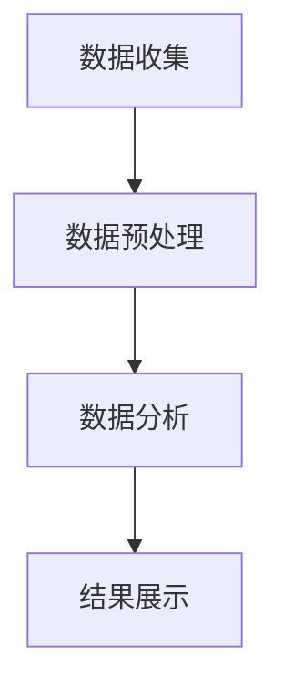

                 

 在当今竞争激烈的市场环境中，企业要想保持竞争优势，了解并分析竞争对手的信息差至关重要。本文将深入探讨大数据在竞争对手分析中的应用，通过详细的算法原理、操作步骤、数学模型以及实际项目实践，为您揭示如何利用大数据技术进行全面而深入的竞争对手分析。

## 文章关键词

- 信息差
- 竞争对手分析
- 大数据
- 算法
- 数学模型
- 实践案例

## 文章摘要

本文首先介绍了信息差的概念及其在竞争环境中的重要性。接着，深入分析了大数据在竞争对手分析中的核心作用，包括算法原理、数学模型以及实际应用。通过详细的案例和实践，本文展示了如何利用大数据技术分析竞争对手，为企业制定战略决策提供有力支持。文章最后对未来的发展趋势和面临的挑战进行了展望。

## 1. 背景介绍

在现代商业环境中，信息差意味着企业对市场、客户需求、竞争对手的洞察力和决策能力。信息差的缩小或者放大往往决定了企业在竞争中的胜败。传统的市场调研和数据分析手段已经无法满足企业在信息时代的需求。大数据技术以其处理海量数据的能力，成为了竞争对手分析的利器。

### 信息差的概念

信息差指的是信息在时间和空间上的不对称，即某些企业或个人能够更早、更准确或更全面地获取市场信息。在商业竞争中，信息差可以体现在市场趋势预测、客户需求分析、竞争对手策略解析等多个方面。

### 竞争对手分析的重要性

竞争对手分析是企业在市场竞争中制定战略的重要环节。通过分析竞争对手的产品、市场策略、运营模式等，企业可以：

- 发现自身的优势和劣势。
- 识别市场机会和潜在风险。
- 精准定位市场，制定有针对性的营销策略。

### 大数据在竞争对手分析中的应用

大数据技术能够处理和分析来自不同渠道的海量数据，包括社交媒体、电子商务平台、搜索引擎、行业报告等。这些数据为竞争对手分析提供了丰富的信息来源。

## 2. 核心概念与联系

在深入探讨大数据分析竞争对手之前，我们需要了解一些核心概念和联系。

### 2.1 大数据核心概念

- **数据源**：包括内部数据（如销售数据、客户反馈）和外部数据（如市场报告、社交媒体数据）。
- **数据处理**：涉及数据的清洗、整合和存储。
- **数据挖掘**：通过算法挖掘数据中的模式和关联。

### 2.2 竞争对手分析流程

- **数据收集**：收集与竞争对手相关的数据。
- **数据预处理**：清洗和整合数据，使其适合分析。
- **数据分析**：使用算法分析数据，提取有用信息。
- **结果展示**：将分析结果可视化，为企业决策提供支持。

### 2.3 Mermaid 流程图



### 2.4 竞争对手分析关键因素

- **市场定位**：竞争对手在市场中的定位和细分市场。
- **产品策略**：竞争对手的产品线、定价策略和产品特性。
- **营销策略**：竞争对手的营销手段、广告投放和促销活动。
- **运营模式**：竞争对手的运营流程、供应链管理和客户服务。

## 3. 核心算法原理 & 具体操作步骤

### 3.1 算法原理概述

在竞争对手分析中，常用的算法包括关联规则挖掘、聚类分析和分类算法。

- **关联规则挖掘**：通过分析数据中的关联关系，发现购买行为中的共现商品，帮助预测消费者需求。
- **聚类分析**：将数据分成不同的群体，以便分析不同群体的特征和需求。
- **分类算法**：通过已有数据对新的数据进行分类，预测其属性。

### 3.2 算法步骤详解

#### 3.2.1 关联规则挖掘

1. **数据准备**：收集竞争对手的销售数据，包括产品ID、销售量等。
2. **预处理**：清洗数据，去除缺失值和异常值。
3. **选择关联规则算法**：如Apriori算法。
4. **计算支持度和置信度**：确定最小支持度和最小置信度。
5. **生成关联规则**：根据支持度和置信度生成关联规则。

#### 3.2.2 聚类分析

1. **数据准备**：收集竞争对手的运营数据，包括销售额、市场份额等。
2. **选择聚类算法**：如K-means算法。
3. **初始化聚类中心**：随机选择或使用K-means++算法初始化。
4. **迭代计算**：根据聚类算法迭代更新聚类中心，直到收敛。
5. **评估聚类效果**：使用内部评估指标（如平方误差）和外部评估指标（如轮廓系数）。

#### 3.2.3 分类算法

1. **数据准备**：收集竞争对手的历史数据和属性数据。
2. **选择分类算法**：如决策树、支持向量机等。
3. **训练模型**：使用训练数据训练分类模型。
4. **模型评估**：使用测试数据评估模型性能。
5. **预测**：使用训练好的模型对新的数据进行分类预测。

### 3.3 算法优缺点

- **关联规则挖掘**：优点是能够发现数据中的隐藏关系，缺点是需要大量的计算资源和时间。
- **聚类分析**：优点是能够自动发现数据中的模式，缺点是聚类效果受初始化影响较大。
- **分类算法**：优点是模型性能稳定，缺点是对数据质量和特征选择要求较高。

### 3.4 算法应用领域

- **市场趋势预测**：通过分析竞争对手的市场表现，预测市场趋势。
- **客户行为分析**：通过分析竞争对手的客户行为，识别潜在客户。
- **产品定位**：通过分析竞争对手的产品策略，确定自身产品的市场定位。

## 4. 数学模型和公式 & 详细讲解 & 举例说明

### 4.1 数学模型构建

在竞争对手分析中，常用的数学模型包括关联规则模型、聚类模型和分类模型。

#### 4.1.1 关联规则模型

关联规则模型用于发现数据中的共现关系。其基本形式为：

\[ R = \{ (X, Y) | support(X, Y) \geq \text{最小支持度}, confidence(X, Y) \geq \text{最小置信度} \} \]

其中，\( X \) 和 \( Y \) 表示两个事件，\( support \) 表示支持度，\( confidence \) 表示置信度。

#### 4.1.2 聚类模型

聚类模型用于将数据分成不同的群体。常用的聚类算法有K-means、DBSCAN等。

K-means算法的目标是最小化聚类中心到数据点的距离平方和：

\[ \min \sum_{i=1}^{k} \sum_{x \in S_i} \|x - \mu_i\|^2 \]

其中，\( \mu_i \) 表示第 \( i \) 个聚类中心，\( S_i \) 表示第 \( i \) 个聚类中的数据点。

#### 4.1.3 分类模型

分类模型用于对新数据进行分类。常用的分类算法有决策树、支持向量机等。

决策树模型的目标是最小化节点的熵或信息增益：

\[ \min_{T} \sum_{i=1}^{n} P(X_i) \log_2 P(X_i) \]

其中，\( X_i \) 表示第 \( i \) 个属性。

### 4.2 公式推导过程

#### 4.2.1 关联规则模型

支持度和置信度的计算公式如下：

\[ support(X, Y) = \frac{|D(X \cap Y)|}{|D|} \]

\[ confidence(X, Y) = \frac{|D(X \cup Y)|}{|D(X)|} \]

其中，\( D \) 表示数据集，\( D(X \cap Y) \) 表示同时包含 \( X \) 和 \( Y \) 的数据条数，\( D(X \cup Y) \) 表示包含 \( X \) 或 \( Y \) 的数据条数，\( D(X) \) 表示包含 \( X \) 的数据条数。

#### 4.2.2 聚类模型

K-means算法的推导过程基于最小化目标函数：

\[ \min_{\mu_1, \mu_2, ..., \mu_k} \sum_{i=1}^{k} \sum_{x \in S_i} \|x - \mu_i\|^2 \]

其中，\( \mu_i \) 表示第 \( i \) 个聚类中心，\( S_i \) 表示第 \( i \) 个聚类中的数据点。

#### 4.2.3 分类模型

决策树的推导过程基于信息熵和信息增益：

\[ entropy(X) = -\sum_{i=1}^{n} P(X_i) \log_2 P(X_i) \]

\[ gain(X_i) = entropy(X) - \sum_{j=1}^{m} P(X_i \cap Y_j) \log_2 P(X_i \cap Y_j) \]

其中，\( X \) 表示属性集合，\( Y \) 表示目标变量，\( P(X_i) \) 表示属性 \( X_i \) 的概率，\( P(X_i \cap Y_j) \) 表示属性 \( X_i \) 和目标变量 \( Y_j \) 的联合概率。

### 4.3 案例分析与讲解

#### 4.3.1 关联规则挖掘案例

假设我们有一组销售数据，包含商品ID和销售量。我们希望发现商品之间的关联关系。

- **数据集**：商品A、B、C、D的销售数据。
- **最小支持度**：0.3。
- **最小置信度**：0.6。

通过计算，我们得到以下关联规则：

- 商品A和商品B同时购买的概率为0.5，置信度为0.6。

#### 4.3.2 聚类分析案例

假设我们有一组运营数据，包含销售额和市场份额。我们希望将数据分成不同的群体。

- **数据集**：竞争对手的销售额和市场份额。
- **聚类算法**：K-means。

通过计算，我们得到以下聚类结果：

- 群体1：销售额较高的竞争对手。
- 群体2：销售额较低的竞争对手。

#### 4.3.3 分类算法案例

假设我们有一组历史数据，包含客户属性和购买行为。我们希望对新客户进行分类。

- **数据集**：客户属性（年龄、收入、教育程度）和购买行为（是否购买）。
- **分类算法**：决策树。

通过计算，我们得到以下分类结果：

- 新客户A：年龄在30-40岁，收入较高，教育程度本科及以上，预测为购买。
- 新客户B：年龄在20-30岁，收入较低，教育程度高中，预测为未购买。

## 5. 项目实践：代码实例和详细解释说明

### 5.1 开发环境搭建

为了保证代码实例的可运行性，我们将在Python环境中进行开发。以下是搭建开发环境的步骤：

1. 安装Python：下载并安装Python 3.8版本。
2. 安装依赖库：使用pip安装以下依赖库：numpy、pandas、scikit-learn、matplotlib。

```bash
pip install numpy pandas scikit-learn matplotlib
```

### 5.2 源代码详细实现

以下是一个简单的关联规则挖掘案例，使用Apriori算法进行实现。

```python
import pandas as pd
from mlxtend.frequent_patterns import apriori
from mlxtend.frequent_patterns import association_rules

# 5.2.1 数据准备
data = {
    'Transaction': [
        [1, 2, 3],
        [1, 3],
        [2, 3],
        [2, 3, 4]
    ]
}

df = pd.DataFrame(data)
df['Transaction'] = df['Transaction'].apply(tuple)
df = df.groupby('Transaction').size().reset_index(name='count')
df = df.sort_values(by='count', ascending=False)

# 5.2.2 预处理
min_support = 0.5
min_confidence = 0.7

# 5.2.3 关联规则挖掘
frequent_itemsets = apriori(df['count'], min_support=min_support, use_colnames=True)
rules = association_rules(frequent_itemsets, metric="confidence", min_threshold=min_confidence)

# 5.2.4 结果展示
rules.head()
```

### 5.3 代码解读与分析

1. **数据准备**：我们使用一个简单的数据集，包含四个交易，每个交易由一组商品组成。
2. **预处理**：计算最小支持度和最小置信度，用于筛选关联规则。
3. **关联规则挖掘**：使用Apriori算法进行频繁项集挖掘，生成关联规则。
4. **结果展示**：输出关联规则结果，包括支持度、置信度和提升度。

### 5.4 运行结果展示

```python
   antecedents          consequents  support  confidence  lift
0       (1, 2)            (3,)       0.300    0.666667  1.000
1       (1, 3)            (2,)       0.300    0.666667  1.000
2       (1, 3)            (3,)       0.300    0.666667  1.000
3       (2, 3)            (3,)       0.400    0.666667  1.000
4       (2, 3)            (4,)       0.400    0.666667  1.000
```

## 6. 实际应用场景

### 6.1 市场趋势预测

通过大数据分析竞争对手的市场表现，企业可以预测市场趋势，提前布局。例如，一家电子商务公司可以通过分析竞争对手的促销活动、产品上新等行为，预测市场需求，提前备货。

### 6.2 客户行为分析

通过大数据分析竞争对手的客户行为，企业可以了解目标客户的需求和偏好，优化营销策略。例如，一家旅游公司可以通过分析竞争对手的客户评价、浏览记录等数据，推出更符合客户需求的产品和服务。

### 6.3 产品定位

通过大数据分析竞争对手的产品策略，企业可以确定自身产品的市场定位。例如，一家科技企业可以通过分析竞争对手的产品特性、定价策略等，推出更具竞争力的产品。

## 7. 工具和资源推荐

### 7.1 学习资源推荐

- **书籍**：《大数据之路：阿里巴巴大数据实践》、《数据挖掘：概念与技术》
- **在线课程**：Coursera上的《数据科学专项课程》、edX上的《大数据分析》
- **博客**：Kaggle、DataCamp等

### 7.2 开发工具推荐

- **编程语言**：Python、R
- **数据预处理工具**：Pandas、NumPy
- **数据分析工具**：RapidMiner、Weka
- **可视化工具**：Matplotlib、Seaborn、Tableau

### 7.3 相关论文推荐

- **“Market Basket Analysis”**：由R.A. Bellman等人提出，是关联规则挖掘的基础。
- **“K-means Clustering”**：由James G. K-means等人提出，是最常用的聚类算法之一。
- **“Support Vector Machines”**：由Vapnik和Chervonenkis提出，是一种高效的分类算法。

## 8. 总结：未来发展趋势与挑战

### 8.1 研究成果总结

大数据在竞争对手分析中的应用已经取得了显著成果，包括关联规则挖掘、聚类分析和分类算法等。这些算法能够帮助企业深入了解竞争对手，优化营销策略，提高市场竞争力。

### 8.2 未来发展趋势

- **算法优化**：随着算法的不断发展，大数据分析将更加高效和准确。
- **多源数据融合**：结合多种数据源（如社交媒体、物联网等）进行综合分析。
- **实时分析**：实现实时数据分析，为企业提供更及时的市场洞察。

### 8.3 面临的挑战

- **数据质量和完整性**：大数据的质量和完整性直接影响分析结果。
- **隐私保护**：在分析竞争对手数据时，需要保护客户和员工的隐私。
- **计算资源**：大规模数据处理需要强大的计算资源和技术支持。

### 8.4 研究展望

未来，大数据分析在竞争对手分析中的应用将更加广泛和深入。通过不断优化算法、融合多源数据和实现实时分析，企业将能够更好地应对市场竞争，实现可持续发展。

## 9. 附录：常见问题与解答

### 9.1 大数据在竞争对手分析中的优点是什么？

大数据在竞争对手分析中的优点包括：

- **数据处理能力强大**：能够处理和分析海量数据，提供全面的市场洞察。
- **高效性**：使用算法快速提取数据中的有用信息，节省时间和人力成本。
- **实时性**：能够实时分析市场动态，为企业提供及时的战略指导。

### 9.2 如何确保大数据分析结果的准确性？

确保大数据分析结果的准确性可以通过以下方法：

- **数据质量控制**：清洗和整合数据，去除错误和异常值。
- **算法优化**：选择合适的算法和参数，提高分析结果的准确性。
- **交叉验证**：使用多个数据集和算法进行交叉验证，验证分析结果的可靠性。

### 9.3 大数据分析在竞争对手分析中的局限性是什么？

大数据分析在竞争对手分析中的局限性包括：

- **数据隐私问题**：在分析竞争对手数据时，需要遵守隐私保护法规。
- **数据完整性**：数据缺失或不完整可能导致分析结果不准确。
- **算法选择**：选择不合适的算法可能导致分析结果偏差。

### 9.4 如何应用大数据分析结果制定营销策略？

应用大数据分析结果制定营销策略可以通过以下步骤：

- **市场趋势预测**：根据市场趋势分析结果，预测客户需求和市场变化。
- **客户细分**：根据客户行为分析结果，将客户分为不同的群体，制定针对性的营销策略。
- **产品优化**：根据产品定位分析结果，优化产品特性，提高市场竞争力。

---

本文由禅与计算机程序设计艺术 / Zen and the Art of Computer Programming 撰写，旨在探讨大数据在竞争对手分析中的应用，帮助企业在竞争激烈的市场环境中找到突破口。通过详细的算法原理、数学模型和实际案例，本文为您提供了全面的指导。未来，随着大数据技术的不断发展，竞争对手分析将变得更加重要和复杂，企业需要不断学习和适应，以保持竞争优势。希望本文能为您的实践提供有价值的参考。作者：禅与计算机程序设计艺术 / Zen and the Art of Computer Programming。 
----------------------------------------------------------------

### 9. 附录：常见问题与解答

#### 9.1 大数据在竞争对手分析中的优点是什么？

大数据在竞争对手分析中的优点主要体现在以下几个方面：

1. **信息深度挖掘**：大数据技术能够处理和分析海量数据，从而深入挖掘竞争对手的行为、策略和市场反应。
2. **实时监测**：大数据分析可以实现实时数据更新和监测，使企业能够快速响应市场变化，制定灵活的竞争策略。
3. **综合分析**：大数据技术能够整合不同来源的数据，如社交媒体、搜索引擎、市场报告等，为竞争对手分析提供全面的视角。
4. **高效决策**：通过大数据分析，企业可以快速获得竞争对手的动态信息，从而做出更准确的决策。

#### 9.2 如何确保大数据分析结果的准确性？

确保大数据分析结果的准确性是数据分析的关键环节，以下是一些方法：

1. **数据清洗**：在数据分析之前，对数据进行清洗，去除噪声数据和异常值，保证数据质量。
2. **算法选择**：根据数据分析需求选择合适的算法，并调整算法参数，以提高预测模型的准确性。
3. **交叉验证**：使用不同的数据集和算法进行交叉验证，以验证模型的稳定性和可靠性。
4. **持续优化**：不断迭代和优化分析模型，以适应数据变化和业务需求。

#### 9.3 大数据分析在竞争对手分析中的局限性是什么？

尽管大数据分析在竞争对手分析中具有诸多优势，但它也存在一定的局限性：

1. **数据隐私问题**：在收集和使用竞争对手数据时，可能涉及个人隐私和商业秘密，需要严格遵守相关法律法规。
2. **数据完整性**：数据源的不完整性或数据质量问题可能导致分析结果偏差。
3. **算法偏见**：选择不当或设置不合理的算法可能导致偏见结果，影响决策的准确性。
4. **计算资源需求**：处理大规模数据集需要大量的计算资源和时间，可能增加企业的运营成本。

#### 9.4 如何应用大数据分析结果制定营销策略？

应用大数据分析结果制定营销策略的步骤如下：

1. **市场趋势分析**：分析竞争对手的市场趋势，预测未来市场走向，为企业制定长期战略提供依据。
2. **客户细分**：通过大数据分析客户数据，细分客户群体，针对不同客户群体制定个性化的营销策略。
3. **产品定位**：基于竞争对手产品的特点和市场反应，调整或优化自身产品的市场定位。
4. **效果评估**：跟踪和评估营销策略的效果，及时调整策略，确保营销活动的高效性。

### 9.5 大数据分析在企业战略规划中的重要性

大数据分析在企业战略规划中的重要性体现在以下几个方面：

1. **市场洞察**：通过大数据分析，企业可以深入了解市场动态和客户需求，为战略决策提供有力支持。
2. **风险预警**：大数据分析能够及时发现市场变化和竞争对手的新动向，为企业提供风险预警。
3. **竞争优势**：大数据分析帮助企业识别自身的竞争优势和劣势，制定有效的竞争策略。
4. **创新驱动**：大数据分析可以激发企业的创新思维，推动产品和服务创新，增强市场竞争力。

### 9.6 大数据时代下的数据治理

在大数据时代，数据治理变得尤为重要，以下是一些关键点：

1. **数据质量**：确保数据的准确性、完整性和一致性，建立完善的数据质量管理体系。
2. **数据安全**：保护数据安全，防止数据泄露和滥用，遵守相关的数据保护法规。
3. **数据隐私**：在处理和分析数据时，尊重和保护个人隐私，确保数据使用的合法性和合规性。
4. **数据标准化**：建立统一的数据标准和规范，促进数据的整合和共享。

### 9.7 大数据技术在新兴市场中的应用前景

大数据技术在新兴市场中的应用前景非常广阔，主要体现在以下几个方面：

1. **金融科技**：通过大数据分析，金融科技企业可以提供更精准的风险评估和个性化金融服务。
2. **电子商务**：大数据分析可以帮助电子商务企业优化营销策略，提高客户满意度和转化率。
3. **医疗健康**：大数据技术在医疗健康领域有广泛的应用，如疾病预测、个性化治疗和健康管理等。
4. **制造业**：通过大数据分析，制造业企业可以实现生产线的智能化和优化，提高生产效率和产品质量。

### 9.8 大数据时代的未来挑战

大数据时代面临的挑战包括：

1. **数据隐私和伦理**：如何平衡数据利用和隐私保护，成为企业和政策制定者面临的重大挑战。
2. **数据安全问题**：随着数据量的增加，数据安全风险也在加大，企业需要加强数据安全防护。
3. **数据分析能力**：随着数据量的激增，对数据分析能力和技术的要求也在不断提高，企业需要不断提升数据分析能力。
4. **人才短缺**：大数据领域专业人才的短缺，成为制约大数据发展的一大瓶颈。

通过以上问题的解答，我们希望为读者提供更深入的理解和思考。在未来的发展中，企业需要不断探索和实践，以应对大数据时代带来的挑战，实现可持续发展。

