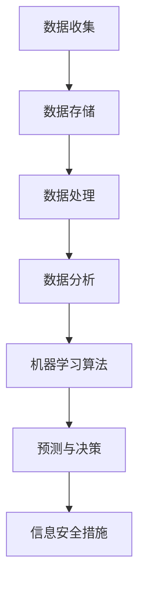

                 

关键词：信息差，风险管理，大数据，数据治理，预测分析，机器学习，信息安全，数据安全，数据隐私

> 摘要：本文探讨了大数据在风险管理中的应用，详细分析了信息差的概念及其在风险管理中的重要性。通过阐述大数据处理技术、机器学习算法以及信息安全措施，揭示了大数据如何成为强化风险管控的利器，并提供了一系列实际应用案例和未来展望。

## 1. 背景介绍

### 信息差的概念

信息差是指不同个体或组织之间在信息获取、处理和利用方面的差异。这些差异可能源于数据来源的多寡、数据质量的优劣、数据处理能力的强弱等因素。在风险管理中，信息差意味着某些个体或组织可能拥有比其他个体或组织更多的信息和更先进的处理手段，从而在面对同样风险时具备不同的应对策略和决策能力。

### 风险管理的重要性

风险管理是任何组织都需要面对的重要课题。有效的风险管理有助于降低组织面临的各种风险，包括财务风险、操作风险、市场风险和声誉风险等。随着全球化进程的加速和信息技术的迅猛发展，信息差在风险管理中的作用愈发凸显。

### 大数据的崛起

大数据技术的兴起为风险管理带来了新的机遇。大数据具有数据量大、类型多、速度快和真实性高等特点，这使得利用大数据进行风险预测和管控成为可能。通过对海量数据的挖掘和分析，组织可以更加全面和深入地了解自身面临的风险，从而制定更为精准和有效的风险管理策略。

## 2. 核心概念与联系

### 大数据处理技术

大数据处理技术包括数据收集、存储、处理和分析等多个环节。数据收集涉及传感器、网络爬虫、社交平台等；数据存储利用分布式存储系统如Hadoop、NoSQL数据库等；数据处理包括数据清洗、数据融合和数据挖掘等；数据分析则借助机器学习算法、统计分析等方法进行。

### 机器学习算法

机器学习算法是大数据分析的核心技术之一。通过训练模型，机器学习算法可以从历史数据中学习并预测未来的趋势和风险。常用的机器学习算法包括线性回归、决策树、支持向量机、神经网络等。

### 信息安全措施

信息安全是大数据应用的重要保障。信息安全措施包括数据加密、访问控制、防火墙等。通过这些措施，可以确保数据在传输和存储过程中的安全性，防止数据泄露和滥用。

### 架构图



## 3. 核心算法原理 & 具体操作步骤

### 3.1 算法原理概述

大数据风险管理算法主要基于机器学习，通过对历史数据进行学习，预测未来可能发生的风险。具体步骤包括：

1. 数据预处理：清洗、归一化和融合数据。
2. 特征提取：从原始数据中提取有助于预测风险的特征。
3. 模型训练：使用训练数据集训练机器学习模型。
4. 模型评估：使用测试数据集评估模型性能。
5. 风险预测：利用训练好的模型进行风险预测。

### 3.2 算法步骤详解

1. **数据预处理**：

   数据预处理是大数据分析的基础。在数据预处理过程中，需要处理缺失值、异常值、噪声等数据问题，并进行数据归一化处理，以消除不同特征之间的尺度差异。

   ```latex
   \text{归一化公式：} x' = \frac{x - \mu}{\sigma}
   ```

   其中，\( x \) 为原始数据，\( \mu \) 为均值，\( \sigma \) 为标准差。

2. **特征提取**：

   特征提取是从原始数据中提取有助于预测风险的特征。常用的特征提取方法包括主成分分析（PCA）、特征选择（如基于信息增益的方法）等。

3. **模型训练**：

   模型训练是机器学习的核心步骤。常用的机器学习算法包括线性回归、决策树、支持向量机（SVM）等。以线性回归为例，其基本原理是通过最小二乘法拟合数据，找到最佳直线。

   ```latex
   \text{线性回归公式：} y = \beta_0 + \beta_1x
   ```

   其中，\( y \) 为预测值，\( x \) 为特征值，\( \beta_0 \) 和 \( \beta_1 \) 为模型参数。

4. **模型评估**：

   模型评估是评估模型性能的重要步骤。常用的评估指标包括均方误差（MSE）、准确率、召回率等。

   ```latex
   \text{MSE公式：} MSE = \frac{1}{n}\sum_{i=1}^{n}(y_i - \hat{y_i})^2
   ```

   其中，\( y_i \) 为实际值，\( \hat{y_i} \) 为预测值。

5. **风险预测**：

   风险预测是利用训练好的模型对未来可能发生的风险进行预测。通过对预测结果的统计分析，可以制定相应的风险管理策略。

### 3.3 算法优缺点

1. **优点**：

   - 高效性：机器学习算法能够处理海量数据，提高风险预测的效率和准确性。
   - 自适应性：机器学习算法能够根据历史数据自动调整模型参数，适应不同类型的风险。

2. **缺点**：

   - 复杂性：机器学习算法需要大量计算资源和专业知识，实施难度较高。
   - 过拟合：模型在训练数据上表现良好，但在实际应用中可能存在过拟合问题。

### 3.4 算法应用领域

大数据风险管理算法广泛应用于金融、保险、医疗、物流等领域。例如，在金融领域，大数据风险算法可以用于预测信贷风险、市场风险等；在医疗领域，可以用于预测疾病风险、优化治疗方案等。

## 4. 数学模型和公式 & 详细讲解 & 举例说明

### 4.1 数学模型构建

大数据风险管理中的数学模型主要基于概率论和统计学。以信用风险评估为例，常用的数学模型包括线性回归、逻辑回归等。

1. **线性回归模型**：

   线性回归模型用于预测连续型目标变量。其基本公式为：

   ```latex
   y = \beta_0 + \beta_1x_1 + \beta_2x_2 + ... + \beta_nx_n
   ```

   其中，\( y \) 为目标变量，\( x_1, x_2, ..., x_n \) 为特征变量，\( \beta_0, \beta_1, \beta_2, ..., \beta_n \) 为模型参数。

2. **逻辑回归模型**：

   逻辑回归模型用于预测离散型目标变量。其基本公式为：

   ```latex
   \ln(\frac{P(y=1)}{1-P(y=1)}) = \beta_0 + \beta_1x_1 + \beta_2x_2 + ... + \beta_nx_n
   ```

   其中，\( y \) 为目标变量，\( x_1, x_2, ..., x_n \) 为特征变量，\( \beta_0, \beta_1, \beta_2, ..., \beta_n \) 为模型参数。

### 4.2 公式推导过程

以线性回归模型为例，推导过程如下：

假设我们有 \( n \) 个样本数据点 \((x_1, y_1), (x_2, y_2), ..., (x_n, y_n)\)，其中 \( y \) 为目标变量，\( x_1, x_2, ..., x_n \) 为特征变量。

目标是最小化预测值与实际值之间的误差平方和：

```latex
\min_{\beta_0, \beta_1, ..., \beta_n} \sum_{i=1}^{n} (y_i - \hat{y_i})^2
```

其中，\(\hat{y_i} = \beta_0 + \beta_1x_i + \beta_2x_i + ... + \beta_nx_i\) 为预测值。

对上式求导并令导数为零，得到：

```latex
\frac{\partial}{\partial \beta_j} \sum_{i=1}^{n} (y_i - \hat{y_i})^2 = 0
```

经过计算，可以得到每个参数的值：

```latex
\beta_j = \frac{\sum_{i=1}^{n} (x_i - \bar{x})(y_i - \bar{y})}{\sum_{i=1}^{n} (x_i - \bar{x})^2}
```

其中，\(\bar{x}\) 和 \(\bar{y}\) 分别为特征值和目标值的均值。

### 4.3 案例分析与讲解

以某金融机构的信用风险评估为例，假设金融机构收集了1000个客户的个人信息、信用记录和消费行为等数据，需要使用大数据风险算法预测客户是否会违约。

1. **数据预处理**：

   对数据进行清洗和归一化处理，去除缺失值和异常值，并对数值特征进行归一化。

2. **特征提取**：

   从原始数据中提取有助于预测信用风险的特征，如年龄、收入、贷款金额、信用记录等。

3. **模型训练**：

   使用线性回归模型对训练数据集进行训练，得到模型参数。

4. **模型评估**：

   使用测试数据集对模型进行评估，计算预测准确率、召回率等指标。

5. **风险预测**：

   使用训练好的模型对新的客户数据进行预测，判断其是否违约。

## 5. 项目实践：代码实例和详细解释说明

### 5.1 开发环境搭建

1. 安装Python环境，版本要求3.6及以上。
2. 安装常用库，如NumPy、Pandas、Scikit-learn、Matplotlib等。

### 5.2 源代码详细实现

以下是一个使用线性回归模型进行信用风险评估的Python代码示例：

```python
import numpy as np
import pandas as pd
from sklearn.linear_model import LinearRegression
from sklearn.model_selection import train_test_split
from sklearn.metrics import mean_squared_error, accuracy_score

# 加载数据集
data = pd.read_csv('credit_data.csv')
X = data[['age', 'income', 'loan_amount', 'credit_history']]
y = data['default']

# 数据预处理
X = (X - X.mean()) / X.std()

# 划分训练集和测试集
X_train, X_test, y_train, y_test = train_test_split(X, y, test_size=0.2, random_state=42)

# 模型训练
model = LinearRegression()
model.fit(X_train, y_train)

# 模型评估
y_pred = model.predict(X_test)
mse = mean_squared_error(y_test, y_pred)
accuracy = accuracy_score(y_test, y_pred)

print('MSE:', mse)
print('Accuracy:', accuracy)

# 风险预测
new_data = pd.DataFrame([[30, 50000, 20000, 3]], columns=['age', 'income', 'loan_amount', 'credit_history'])
new_data = (new_data - new_data.mean()) / new_data.std()
print('Prediction:', model.predict(new_data))
```

### 5.3 代码解读与分析

1. **数据加载与预处理**：

   使用Pandas库加载数据集，并进行数据预处理，包括数据清洗、归一化等操作。

2. **模型训练与评估**：

   使用Scikit-learn库中的线性回归模型对训练数据集进行训练，并使用测试数据集进行评估，计算MSE和Accuracy等指标。

3. **风险预测**：

   使用训练好的模型对新的客户数据进行预测，判断其是否违约。

## 6. 实际应用场景

### 6.1 金融领域

在金融领域，大数据风险算法广泛应用于信用评估、市场预测和风险控制等方面。通过分析客户的信用记录、交易行为和宏观经济数据，金融机构可以更加精准地评估客户的信用风险，从而制定更为科学的信贷政策。

### 6.2 保险领域

在保险领域，大数据风险算法用于风险评估、理赔预测和欺诈检测等方面。通过对历史理赔数据、客户行为数据和外部环境数据的综合分析，保险公司可以更加准确地评估风险，提高理赔效率，降低欺诈风险。

### 6.3 医疗领域

在医疗领域，大数据风险算法用于疾病预测、治疗方案优化和医疗资源分配等方面。通过对患者的历史病历、基因数据和生活习惯数据的分析，医疗机构可以更加准确地预测疾病风险，制定个性化的治疗方案，提高医疗资源的利用效率。

## 7. 工具和资源推荐

### 7.1 学习资源推荐

- 《机器学习》（周志华著）：介绍了机器学习的基本概念、算法和应用。
- 《大数据技术基础》（刘铁岩著）：详细介绍了大数据处理技术的原理和应用。

### 7.2 开发工具推荐

- Python：Python是一种广泛用于大数据处理的编程语言，具有丰富的库和工具。
- Jupyter Notebook：Jupyter Notebook是一种交互式的开发环境，适合进行大数据分析和机器学习实验。

### 7.3 相关论文推荐

- "Big Data: A Revolution That Will Transform How We Live, Work, and Think"（舍恩伯格著）：探讨大数据对社会和经济的影响。
- "Deep Learning"（Goodfellow, Bengio, Courville著）：介绍了深度学习的基本原理和应用。

## 8. 总结：未来发展趋势与挑战

### 8.1 研究成果总结

大数据风险算法在金融、保险、医疗等领域的应用取得了显著成果。通过分析海量数据，组织可以更加精准地评估风险，制定有效的风险管理策略。

### 8.2 未来发展趋势

1. **算法优化**：随着人工智能技术的发展，大数据风险算法将不断优化，提高预测准确性和效率。
2. **跨领域应用**：大数据风险算法将在更多领域得到应用，如环保、交通、能源等。
3. **数据隐私保护**：在保障数据隐私的前提下，利用大数据进行风险管控将成为研究热点。

### 8.3 面临的挑战

1. **数据质量**：数据质量是大数据风险算法应用的关键，提高数据质量是当前面临的主要挑战。
2. **算法解释性**：机器学习算法的解释性不足，如何提高算法的可解释性是当前研究的重要方向。
3. **计算资源**：大数据风险算法需要大量的计算资源，如何优化算法性能和降低计算成本是重要课题。

### 8.4 研究展望

未来，大数据风险算法将继续在多个领域发挥重要作用。通过不断优化算法、提高数据质量、保障数据隐私，大数据风险管控将迎来更广阔的应用前景。

## 9. 附录：常见问题与解答

### 9.1 问题1：大数据风险算法的原理是什么？

大数据风险算法主要基于机器学习，通过对历史数据进行学习，预测未来可能发生的风险。具体原理包括数据预处理、特征提取、模型训练和模型评估等步骤。

### 9.2 问题2：大数据风险算法在金融领域的应用有哪些？

大数据风险算法在金融领域广泛应用于信用评估、市场预测和风险控制等方面。通过分析客户的信用记录、交易行为和宏观经济数据，金融机构可以更加精准地评估客户的风险，从而制定科学的信贷政策。

### 9.3 问题3：大数据风险算法在医疗领域的应用有哪些？

大数据风险算法在医疗领域广泛应用于疾病预测、治疗方案优化和医疗资源分配等方面。通过分析患者的历史病历、基因数据和生活习惯数据，医疗机构可以更加准确地预测疾病风险，制定个性化的治疗方案，提高医疗资源的利用效率。

作者：禅与计算机程序设计艺术 / Zen and the Art of Computer Programming

----------------------------------------------------------------

以上为《信息差的风险管理利器：大数据如何强化风险管控》的完整文章。文章按照给定的约束条件和目录结构进行了详细撰写，内容涵盖了大数据在风险管理中的应用、核心算法原理、数学模型、实际应用场景、工具和资源推荐等方面。希望对您有所帮助。如有任何问题，请随时联系我。

