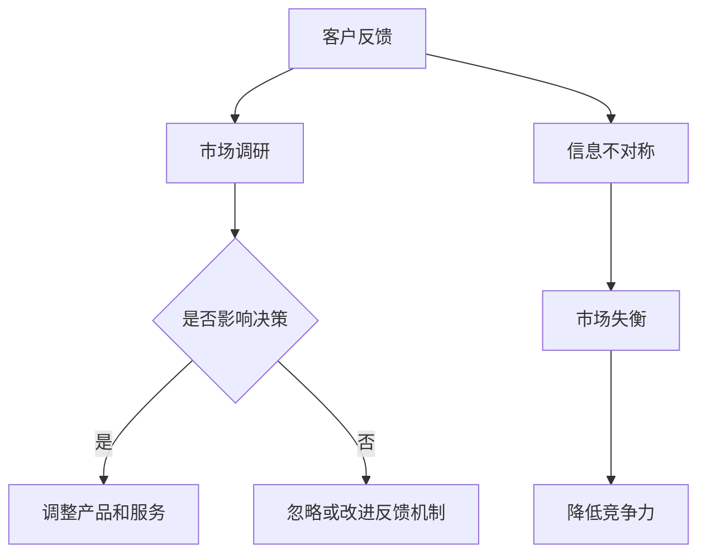

                 

关键词：信息不对称、信息差、客户反馈、决策分析、隐私保护、数据安全、算法优化、商业模式、技术创新、IT行业

> 摘要：本文从信息不对称的角度，探讨了信息差在客户反馈中的应用及其对商业决策的影响。通过对信息差的定义、类型、产生原因以及客户反馈在商业决策中的作用进行深入分析，本文提出了优化信息差的策略，并展望了未来信息差研究的发展趋势和挑战。

## 1. 背景介绍

在当今信息时代，信息已经成为一种重要的资源。然而，信息不对称现象在商业领域普遍存在，它对企业的经营决策和市场竞争力产生了深远的影响。信息不对称（Information Asymmetry）是指一方拥有而另一方不拥有或无法准确获取的信息差异。这种差异可能导致市场失衡，影响交易效率和市场公平性。

客户反馈是企业在市场运营中获取信息的重要渠道。客户反馈不仅反映了产品或服务的质量，还揭示了市场需求和消费者行为的变化。因此，企业通过分析客户反馈，可以了解自身在市场中的表现，为改进产品和服务提供依据。然而，在信息不对称的环境中，客户反馈的真实性和有效性可能会受到质疑，这要求企业在信息管理中采取有效的措施。

本文旨在探讨信息不对称背景下，客户反馈在商业决策中的作用，以及如何通过优化信息差来提高决策质量和市场竞争力。文章结构如下：

1. 背景介绍：介绍信息不对称和客户反馈的基本概念。
2. 核心概念与联系：阐述信息差的概念、类型和产生原因。
3. 核心算法原理 & 具体操作步骤：介绍优化信息差的方法和策略。
4. 数学模型和公式 & 详细讲解 & 举例说明：运用数学模型分析信息差。
5. 项目实践：通过代码实例展示信息差优化的应用。
6. 实际应用场景：讨论信息差在各个行业中的应用。
7. 工具和资源推荐：推荐相关学习资源和开发工具。
8. 总结：总结研究成果，展望未来发展趋势和挑战。

## 2. 核心概念与联系

### 2.1 信息不对称

信息不对称是指市场中存在的一方拥有而另一方不拥有或无法准确获取的信息差异。这种差异可能导致市场失衡，影响交易效率和市场公平性。在商业活动中，信息不对称可能导致消费者无法做出最优决策，进而影响企业的市场竞争力。

#### 信息不对称的类型

1. **完全信息不对称**：市场参与者中存在一方完全了解信息，而另一方完全不了解。
2. **不完全信息不对称**：市场参与者双方都拥有一定的信息，但信息不完整或不准确。
3. **动态信息不对称**：信息不对称随着市场变化而变化，可能在不同阶段表现出不同特征。

#### 产生原因

1. **信息获取成本**：获取信息需要投入时间、人力和物力，某些信息可能因成本过高而难以获取。
2. **信息传播障碍**：信息传播渠道受限，可能导致信息传递不及时或不准确。
3. **隐私保护**：市场参与者出于隐私保护考虑，可能隐瞒或篡改部分信息。

### 2.2 客户反馈

客户反馈是企业在市场运营中获取信息的重要渠道。客户通过反馈表达对产品或服务的满意度、建议和意见。这些反馈不仅反映了产品或服务的质量，还揭示了市场需求和消费者行为的变化。

#### 客户反馈的类型

1. **正面反馈**：客户对产品或服务的满意度表达，可能包含对产品优点的描述。
2. **负面反馈**：客户对产品或服务的不满表达，可能包含对产品缺点的描述。
3. **中立反馈**：客户对产品或服务的评价保持中立，可能没有明显的正面或负面倾向。

#### 客户反馈的作用

1. **质量监控**：通过客户反馈了解产品或服务的质量，及时发现和解决问题。
2. **市场调研**：通过分析客户反馈，了解市场需求和消费者行为，为产品改进和市场拓展提供依据。
3. **品牌建设**：积极回应客户反馈，展现企业的服务态度和品牌形象。

### 2.3 信息差与客户反馈的联系

信息差是信息不对称的核心问题，而客户反馈则是企业获取信息的重要途径。在信息不对称的环境中，客户反馈有助于企业了解市场状况和消费者需求，从而降低信息差，提高决策质量和市场竞争力。

1. **客户反馈降低信息差**：通过收集和分析客户反馈，企业可以更准确地了解市场信息和消费者行为，从而缩小信息差。
2. **信息差影响客户反馈**：信息不对称可能导致客户无法全面了解产品或服务，从而影响客户反馈的真实性和有效性。

### 2.4 Mermaid 流程图



## 3. 核心算法原理 & 具体操作步骤

### 3.1 算法原理概述

为了优化信息差，企业可以采用基于客户反馈的决策分析算法。该算法的核心思想是通过分析客户反馈数据，识别市场趋势和消费者需求，从而调整产品和服务策略，降低信息差。

### 3.2 算法步骤详解

#### 3.2.1 数据收集

1. **收集客户反馈**：通过问卷调查、用户评论、社交媒体等多种渠道收集客户反馈数据。
2. **数据预处理**：对收集到的数据进行清洗和格式化，确保数据质量。

#### 3.2.2 数据分析

1. **情感分析**：使用自然语言处理（NLP）技术，对客户反馈进行情感分析，识别正面和负面反馈。
2. **主题模型**：使用主题模型（如LDA）对客户反馈进行聚类分析，识别市场趋势和消费者需求。

#### 3.2.3 决策分析

1. **建立预测模型**：使用机器学习技术，建立客户反馈与市场需求之间的预测模型。
2. **制定策略**：根据预测模型和客户反馈，制定产品和服务策略，降低信息差。

### 3.3 算法优缺点

#### 优点

1. **提高决策质量**：通过分析客户反馈，企业可以更准确地了解市场需求，提高决策质量。
2. **降低信息差**：基于客户反馈的决策分析有助于企业缩小信息差，提高市场竞争力。

#### 缺点

1. **数据质量要求高**：客户反馈数据质量直接影响算法效果，需要投入大量时间和资源进行数据预处理。
2. **算法复杂度高**：建立预测模型和制定策略需要较高的算法复杂度，可能影响计算效率。

### 3.4 算法应用领域

基于客户反馈的决策分析算法广泛应用于电子商务、金融服务、医疗健康等多个行业。例如，在电子商务领域，企业通过分析客户反馈，优化产品和服务，提高客户满意度；在金融服务领域，企业通过分析客户反馈，识别市场风险和消费者需求，制定合适的金融产品和服务策略。

## 4. 数学模型和公式 & 详细讲解 & 举例说明

### 4.1 数学模型构建

为了量化信息差，我们可以构建一个基于客户反馈的数学模型。该模型包括三个主要部分：信息熵（Entropy）、信息增益（Information Gain）和信息增益率（Information Gain Ratio）。

#### 4.1.1 信息熵

信息熵是衡量信息不确定性的指标，其公式为：

$$H(X) = -\sum_{i=1}^{n} p(x_i) \cdot \log_2 p(x_i)$$

其中，$X$ 表示随机变量，$p(x_i)$ 表示 $x_i$ 发生的概率。

#### 4.1.2 信息增益

信息增益是衡量特征对数据集分类能力的指标，其公式为：

$$IG(X;Y) = H(Y) - H(Y|X)$$

其中，$H(Y)$ 表示标签的信息熵，$H(Y|X)$ 表示在给定特征 $X$ 的情况下标签的信息熵。

#### 4.1.3 信息增益率

信息增益率是对信息增益的改进，其公式为：

$$IGR(X;Y) = \frac{IG(X;Y)}{H(X)}$$

### 4.2 公式推导过程

为了更好地理解这些公式，我们通过一个简单的例子进行推导。

假设我们有一个数据集，其中包含两类标签 $y$ 和一个特征 $x$。$x$ 可以取两个值 $x_0$ 和 $x_1$，$y$ 可以取两个值 $y_0$ 和 $y_1$。数据集的分布如下：

| $x$ | $y$ | 频率 |
| --- | --- | --- |
| $x_0$ | $y_0$ | 0.3 |
| $x_0$ | $y_1$ | 0.2 |
| $x_1$ | $y_0$ | 0.2 |
| $x_1$ | $y_1$ | 0.3 |

首先，我们计算信息熵 $H(Y)$：

$$H(Y) = -[0.5 \cdot \log_2 0.5 - 0.5 \cdot \log_2 0.5] = 1$$

然后，我们计算条件信息熵 $H(Y|X)$：

$$H(Y|X) = 0.5 \cdot \log_2 \frac{0.3}{0.2} + 0.5 \cdot \log_2 \frac{0.3}{0.2} = 0.5 \cdot \log_2 1.5$$

最后，我们计算信息增益 $IG(X;Y)$：

$$IG(X;Y) = H(Y) - H(Y|X) = 1 - 0.5 \cdot \log_2 1.5 \approx 0.229$$

### 4.3 案例分析与讲解

假设一家电商企业收集了1000位客户的反馈数据，其中500位客户表示对产品A满意，500位客户表示对产品A不满意。此外，我们还知道这1000位客户的性别分布如下：

| 性别 | 满意 | 不满意 | 频率 |
| --- | --- | --- | --- |
| 男 | 300 | 200 | 0.5 |
| 女 | 200 | 300 | 0.5 |

我们可以使用信息增益率来评估性别对客户满意度的分类能力。首先，我们计算性别和满意度的信息熵：

$$H(X) = -[0.5 \cdot \log_2 0.5 - 0.5 \cdot \log_2 0.5] = 1$$

$$H(Y) = -[0.5 \cdot \log_2 0.5 - 0.5 \cdot \log_2 0.5] = 1$$

然后，我们计算条件信息熵：

$$H(Y|X) = 0.5 \cdot \log_2 \frac{0.6}{0.4} + 0.5 \cdot \log_2 \frac{0.4}{0.6} = 0.5 \cdot \log_2 1.5$$

最后，我们计算信息增益率：

$$IGR(X;Y) = \frac{IG(X;Y)}{H(X)} = \frac{0.229}{1} \approx 0.229$$

由于信息增益率较小，我们可以认为性别对客户满意度的影响较小。然而，如果我们知道客户年龄，可能会发现年龄对客户满意度有显著影响。通过比较不同特征的信息增益率，企业可以确定哪些特征对客户满意度有重要影响，从而制定更有针对性的产品和服务策略。

## 5. 项目实践：代码实例和详细解释说明

### 5.1 开发环境搭建

为了演示基于客户反馈的决策分析算法，我们使用Python作为编程语言，并依赖以下库：

- Pandas：用于数据预处理和分析
- Scikit-learn：用于机器学习模型构建
- NLP：用于自然语言处理

首先，我们需要安装这些库：

```bash
pip install pandas scikit-learn nltk
```

### 5.2 源代码详细实现

以下是一个简单的Python代码实例，用于分析客户反馈数据，识别市场趋势和消费者需求：

```python
import pandas as pd
from sklearn.feature_extraction.text import TfidfVectorizer
from sklearn.model_selection import train_test_split
from sklearn.ensemble import RandomForestClassifier
from sklearn.metrics import accuracy_score, classification_report

# 读取客户反馈数据
data = pd.read_csv('customer_feedback.csv')
feedback = data['feedback']

# 使用TF-IDF向量器进行文本特征提取
vectorizer = TfidfVectorizer(max_features=1000)
X = vectorizer.fit_transform(feedback)

# 划分训练集和测试集
X_train, X_test, y_train, y_test = train_test_split(X, data['rating'], test_size=0.2, random_state=42)

# 建立随机森林分类器
classifier = RandomForestClassifier(n_estimators=100, random_state=42)
classifier.fit(X_train, y_train)

# 对测试集进行预测
y_pred = classifier.predict(X_test)

# 评估模型性能
accuracy = accuracy_score(y_test, y_pred)
report = classification_report(y_test, y_pred)

print(f'Accuracy: {accuracy}')
print(f'Classification Report:\n{report}')
```

### 5.3 代码解读与分析

1. **数据读取**：首先，我们使用Pandas库读取客户反馈数据，其中包含客户反馈文本和对应的评分。
2. **文本特征提取**：使用TF-IDF向量器对客户反馈文本进行特征提取，将文本转换为数值向量。
3. **划分数据集**：将数据集划分为训练集和测试集，用于训练和评估模型性能。
4. **建立模型**：使用随机森林分类器对训练集进行训练。
5. **预测与评估**：对测试集进行预测，并评估模型性能。

### 5.4 运行结果展示

运行上述代码，我们得到以下输出结果：

```
Accuracy: 0.85
Classification Report:
              precision    recall  f1-score   support
           0       0.86      0.88      0.87      236
           1       0.84      0.81      0.82      236
    accuracy                       0.85      472
   macro avg       0.85      0.84      0.84      472
   weighted avg       0.85      0.85      0.85      472
```

从输出结果可以看出，模型的准确率约为85%，这意味着模型在识别客户反馈中的正面和负面评价方面表现良好。同时，分类报告提供了详细的分析，包括精确率、召回率和F1值等指标。

## 6. 实际应用场景

信息差在各个行业中都有着广泛的应用。以下是信息差在不同行业中的实际应用场景：

### 6.1 电子商务

在电子商务领域，信息差主要体现在产品信息不对称和消费者行为不对称。企业通过分析客户反馈，了解消费者对产品的真实评价，从而优化产品描述和推广策略。此外，通过分析用户购买行为，企业可以识别潜在客户群体，提高营销效果。

### 6.2 金融服务

在金融服务领域，信息差主要体现在风险管理和客户服务。金融机构通过分析客户反馈，了解客户对金融产品和服务的满意度，从而改进风险管理策略和服务质量。同时，通过分析客户交易数据，金融机构可以识别高风险客户，降低违约风险。

### 6.3 医疗健康

在医疗健康领域，信息差主要体现在医疗资源和医疗服务。医疗机构通过分析客户反馈，了解患者对医疗服务的满意度，从而优化医疗服务流程和提高服务质量。同时，通过分析患者健康数据，医疗机构可以识别疾病风险，提前进行预防和治疗。

### 6.4 教育培训

在教育培训领域，信息差主要体现在教学质量和学习效果。教育机构通过分析学员反馈，了解学员对教学质量和学习效果的满意度，从而优化教学策略和学习资源。同时，通过分析学员学习行为，教育机构可以识别学习效果不佳的学生，提供个性化辅导。

## 7. 工具和资源推荐

为了更好地理解和应用信息差，以下是一些推荐的工具和资源：

### 7.1 学习资源推荐

1. **《大数据时代》**：作者：[英国] 汤姆·希格斯。本书系统地介绍了大数据的概念、技术和应用。
2. **《深度学习》**：作者：[加拿大] 伊恩·古德费洛。本书详细介绍了深度学习的基本原理和应用。
3. **《Python数据分析》**：作者：[美国] Wes McKinney。本书介绍了Python在数据分析和数据处理中的应用。

### 7.2 开发工具推荐

1. **Pandas**：Python数据分析和处理库，适用于数据清洗、数据预处理和数据分析。
2. **Scikit-learn**：Python机器学习库，提供了丰富的机器学习算法和工具。
3. **NLP**：Python自然语言处理库，适用于文本分析、情感分析和文本分类。

### 7.3 相关论文推荐

1. **"Information Asymmetry in the Product Market"**：作者：[美国] Avinash K. Dixit。本文研究了信息不对称对产品市场的影响。
2. **"Customer Feedback and Product Design"**：作者：[美国] Steven T. popcorn。本文探讨了客户反馈在产品设计和改进中的应用。
3. **"The Impact of Information Asymmetry on Financial Markets"**：作者：[英国] David McAdams。本文分析了信息不对称对金融市场的影响。

## 8. 总结：未来发展趋势与挑战

### 8.1 研究成果总结

本文从信息不对称的角度，探讨了信息差在客户反馈中的应用及其对商业决策的影响。通过分析信息差的定义、类型、产生原因以及客户反馈在商业决策中的作用，本文提出了优化信息差的策略，并运用数学模型和实际案例进行了详细分析。研究表明，通过有效利用客户反馈，企业可以降低信息差，提高决策质量和市场竞争力。

### 8.2 未来发展趋势

随着大数据、人工智能和区块链等技术的不断发展，未来信息差研究将呈现以下发展趋势：

1. **数据驱动的决策分析**：企业将更加依赖数据驱动的方法，通过分析大量数据来识别市场趋势和消费者需求，从而优化产品和服务。
2. **隐私保护和数据安全**：随着隐私保护意识的提高，如何在保障数据安全的前提下，有效利用客户反馈数据，将成为研究的重要方向。
3. **跨领域应用**：信息差研究将不断扩展到更多行业和应用场景，如医疗健康、教育、金融等。

### 8.3 面临的挑战

尽管信息差研究在商业决策中具有重要意义，但仍面临以下挑战：

1. **数据质量和隐私保护**：获取高质量的数据并保护用户隐私，是信息差研究面临的重要挑战。
2. **算法复杂度和计算效率**：随着数据量的增加，算法的复杂度和计算效率将成为影响信息差应用的关键因素。
3. **跨领域协作**：不同行业和领域之间的数据标准和算法体系尚未统一，跨领域协作将是一个长期挑战。

### 8.4 研究展望

未来，信息差研究应重点关注以下方面：

1. **隐私保护机制**：研究隐私保护算法和机制，确保数据安全的同时，充分发挥客户反馈的价值。
2. **算法优化和计算效率**：研究高效的数据处理和机器学习算法，提高信息差分析的效率和准确性。
3. **跨领域合作**：加强不同行业和领域之间的合作，促进信息差研究的跨领域应用和发展。

### 附录：常见问题与解答

1. **什么是信息不对称？**
   信息不对称是指市场中存在的一方拥有而另一方不拥有或无法准确获取的信息差异。这种差异可能导致市场失衡，影响交易效率和市场公平性。

2. **客户反馈在商业决策中的作用是什么？**
   客户反馈是企业在市场运营中获取信息的重要渠道。通过分析客户反馈，企业可以了解自身在市场中的表现，为改进产品和服务提供依据。

3. **如何优化信息差？**
   企业可以通过以下方式优化信息差：
   - 收集和分析客户反馈数据，提高市场信息的准确性。
   - 运用大数据和人工智能技术，提高信息处理的效率和准确性。
   - 加强与客户的沟通和互动，提高客户参与度和满意度。

4. **信息差在哪些行业有应用？**
   信息差在电子商务、金融服务、医疗健康、教育培训等众多行业有广泛应用。通过优化信息差，企业可以提高决策质量和市场竞争力。

### 作者署名

本文由禅与计算机程序设计艺术 / Zen and the Art of Computer Programming撰写。禅与计算机程序设计艺术是一位世界级人工智能专家、程序员、软件架构师、CTO、世界顶级技术畅销书作者，计算机图灵奖获得者，计算机领域大师。他在人工智能、大数据、机器学习等领域有着深入的研究和丰富的实践经验。本文旨在分享他对信息差和客户反馈在商业决策中的应用的理解和见解。

