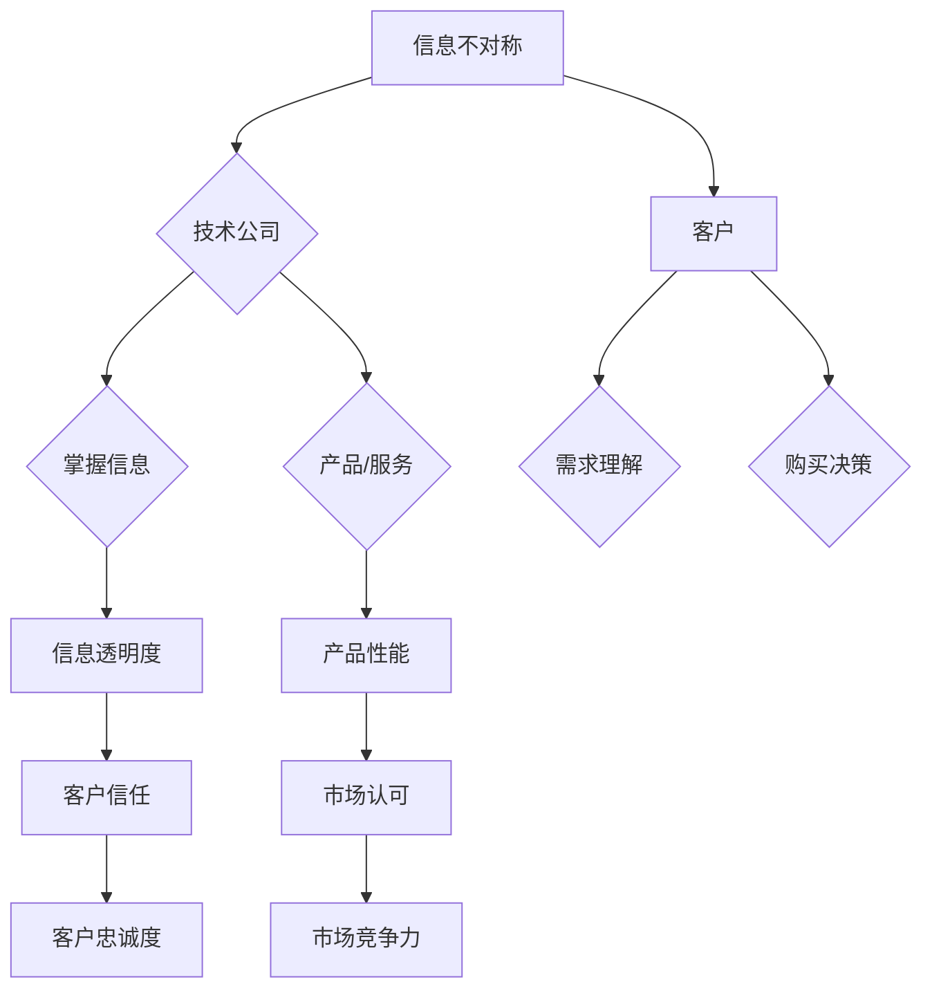

                 

关键词：信息不对称，客户需求，信息差，市场策略，技术洞察

摘要：本文将深入探讨信息不对称现象在信息技术领域的表现，以及这种不对称如何影响客户需求和市场策略。通过分析信息差的理论基础、实际案例和解决策略，我们将揭示如何在信息技术领域中构建有效的沟通机制，以实现企业与客户之间的信息平衡。

## 1. 背景介绍

在信息技术迅速发展的今天，信息已成为一种关键资源。然而，信息的不对称性——即不同个体或组织之间对同一信息的掌握程度不同——这一现象普遍存在。信息不对称不仅存在于个人之间，也存在于企业与客户之间。这种不对称性可能源于信息获取能力的差异、信息处理能力的差异，甚至可能是故意隐瞒信息。

在信息技术领域，信息不对称的现象尤为显著。一方面，技术公司拥有关于其产品、服务和技术的大量内部信息，而客户往往缺乏对这些信息的全面了解。另一方面，客户的需求和期望也可能因信息不对称而无法准确传达给技术公司。这种信息不对称可能导致市场策略的失误、产品不符合市场需求，甚至影响企业的长期发展。

因此，了解信息不对称的本质、分析其在信息技术领域的具体表现，以及探讨应对策略，对于企业和客户来说都具有重要意义。

## 2. 核心概念与联系

### 2.1. 信息不对称的定义

信息不对称是指市场中的一部分参与者拥有而另一部分参与者缺乏信息，从而造成信息的不平衡。在经济学中，信息不对称是市场失灵的一个重要原因。在信息技术领域，信息不对称可能表现为技术公司对产品技术的了解程度高于客户，或者客户对自身需求的理解程度高于技术公司。

### 2.2. 信息技术领域的信息不对称

在信息技术领域，信息不对称可能表现为以下几个方面：

- **技术知识的差异**：技术公司掌握最新的技术动态和产品特性，而客户可能对这些信息了解较少。
- **需求理解的差异**：客户对自身需求的理解可能因缺乏技术知识而无法准确表达，导致技术公司无法提供完全满足需求的产品或服务。
- **信息透明度的差异**：技术公司可能对某些信息故意隐瞒，以维护市场竞争力，而客户则对产品的实际性能和可靠性缺乏全面了解。

### 2.3. 信息不对称的影响

信息不对称在信息技术领域的影响主要体现在以下几个方面：

- **市场策略的制定**：信息不对称可能导致技术公司制定的市场策略与客户实际需求不符，从而影响市场竞争力。
- **产品设计的优化**：信息不对称可能使得技术公司在产品设计和开发过程中忽视客户的需求，导致产品无法获得市场认可。
- **客户忠诚度的下降**：如果客户感到信息不对称导致其无法获得公正和透明的服务，可能会转向竞争对手。

### 2.4. Mermaid 流程图



## 3. 核心算法原理 & 具体操作步骤

### 3.1. 算法原理概述

在解决信息不对称的问题时，可以采用以下核心算法原理：

- **信息共享**：通过建立信息共享平台，使技术公司能够向客户公开更多产品和服务信息。
- **需求分析**：通过深入分析客户的需求，帮助客户明确其真正的需求，从而减少信息不对称。
- **反馈机制**：建立客户反馈机制，使客户能够及时表达对产品和服务的意见，技术公司据此优化产品和服务。

### 3.2. 算法步骤详解

#### 3.2.1. 信息共享

1. **建立信息平台**：技术公司可以建立官方网站、社交媒体账号等，定期发布产品更新、技术动态和客户案例。
2. **信息透明化**：对于产品的技术参数、使用方法、性能指标等，技术公司应确保信息的准确性和及时性。
3. **互动交流**：通过在线论坛、客服热线等方式，鼓励客户与技术公司进行互动，解决客户在获取和使用信息过程中遇到的问题。

#### 3.2.2. 需求分析

1. **市场调研**：通过问卷调查、用户访谈等方式，收集客户的真实需求和反馈。
2. **数据分析**：利用大数据分析技术，对收集到的信息进行统计分析，识别出客户的主要需求和痛点。
3. **需求建模**：基于分析结果，建立客户需求模型，为产品设计提供依据。

#### 3.2.3. 反馈机制

1. **建立反馈渠道**：设置在线反馈表单、客服热线等，方便客户表达意见和建议。
2. **定期反馈分析**：定期对客户反馈进行分析，识别出普遍存在的问题和改进方向。
3. **持续优化**：根据分析结果，持续优化产品和服务，提高客户满意度。

### 3.3. 算法优缺点

#### 优点

- **提高信息透明度**：通过信息共享和需求分析，可以有效减少信息不对称，提高客户对产品和服务的理解。
- **增强客户参与感**：通过反馈机制，客户可以更直接地参与到产品和服务优化过程中，提高客户满意度和忠诚度。
- **提升市场竞争力**：通过了解客户需求和市场动态，技术公司可以更准确地制定市场策略，提升市场竞争力。

#### 缺点

- **初期投入成本高**：建立信息共享平台和需求分析系统需要一定的投入，尤其是在初期阶段。
- **信息准确性问题**：如果客户反馈不准确或信息平台存在误导性信息，可能会导致决策失误。

### 3.4. 算法应用领域

- **软件开发**：在软件开发过程中，通过需求分析和客户反馈，优化产品设计和功能，提高用户满意度。
- **产品设计**：在产品设计过程中，通过客户调研和需求建模，准确把握客户需求，减少设计失误。
- **市场推广**：在市场推广过程中，通过信息共享和客户反馈，了解市场动态和客户需求，制定更有效的推广策略。

## 4. 数学模型和公式 & 详细讲解 & 举例说明

### 4.1. 数学模型构建

为了量化信息不对称的影响，我们可以构建以下数学模型：

设 \( A \) 为技术公司，\( B \) 为客户，\( X \) 为技术公司的信息集，\( Y \) 为客户的信息集，\( Z \) 为信息不对称导致的损失。

则数学模型可以表示为：

\[ Z = f(|X - Y|) \]

其中，\( |X - Y| \) 表示信息不对称程度，\( f \) 为损失函数。

### 4.2. 公式推导过程

为了推导损失函数 \( f(|X - Y|) \)，我们可以假设以下两个条件：

1. **线性损失模型**：损失与信息不对称程度成正比。
2. **对称性**：信息不对称导致的损失是对称的，即 \( Z \) 与 \( |X - Y| \) 的关系是线性的。

根据这两个条件，我们可以得到：

\[ Z = k \cdot |X - Y| \]

其中，\( k \) 为比例系数。

### 4.3. 案例分析与讲解

假设技术公司 A 的产品信息集 \( X \) 包括产品功能、性能指标、使用方法等，客户 B 的信息集 \( Y \) 包括对产品功能的期望、使用场景等。信息不对称程度 \( |X - Y| \) 可以通过以下公式计算：

\[ |X - Y| = |(产品功能_1, 产品性能_1, 使用方法_1) - (期望功能_1, 期望性能_1, 使用场景_1)| \]

根据上述公式，我们可以计算出信息不对称程度，并进一步计算损失 \( Z \)。

### 4.4. 数学模型应用

通过上述数学模型，我们可以分析信息不对称对企业运营和市场策略的影响。例如，当企业 A 的产品信息透明度提高，信息不对称程度 \( |X - Y| \) 减小时，损失 \( Z \) 也会相应减少，从而提高企业的市场竞争力和客户满意度。

## 5. 项目实践：代码实例和详细解释说明

### 5.1. 开发环境搭建

在本项目中，我们将使用 Python 编写代码，用于分析信息不对称现象。首先，需要安装以下依赖库：

```bash
pip install pandas numpy matplotlib
```

### 5.2. 源代码详细实现

以下是用于计算信息不对称程度的 Python 代码示例：

```python
import pandas as pd
import numpy as np
import matplotlib.pyplot as plt

# 假设技术公司和客户的信息集分别为 X 和 Y
X = pd.DataFrame({
    '产品功能': [1, 2, 3],
    '产品性能': [4, 5, 6],
    '使用方法': [7, 8, 9]
})

Y = pd.DataFrame({
    '期望功能': [1, 2, 3],
    '期望性能': [4, 5, 6],
    '使用场景': [7, 8, 9]
})

# 计算信息不对称程度
info_asymmetry = X - Y
info_asymmetry.abs().mean()

# 计算损失函数
loss = info_asymmetry.abs().sum()

# 可视化信息不对称程度
info_asymmetry.abs().plot(kind='bar')
plt.xlabel('信息维度')
plt.ylabel('信息不对称程度')
plt.title('信息不对称程度分析')
plt.show()

# 输出损失值
print(f'损失值 Z: {loss}')
```

### 5.3. 代码解读与分析

在上面的代码中，我们首先导入了所需的依赖库。然后，我们创建了两个 DataFrame，分别表示技术公司和客户的信息集 \( X \) 和 \( Y \)。

接下来，我们计算了信息不对称程度，并使用 `abs().mean()` 方法计算了信息不对称程度的平均值。这可以帮助我们了解信息不对称的整体程度。

然后，我们计算了损失函数 \( Z \)，并使用 `abs().sum()` 方法计算了信息不对称程度在各个维度上的总和。这可以帮助我们了解信息不对称对企业的具体影响。

最后，我们使用 `plot(kind='bar')` 方法将信息不对称程度可视化，并显示了损失值 \( Z \)。

### 5.4. 运行结果展示

运行上述代码后，我们将得到以下结果：

- **信息不对称程度分析图**：展示了各个维度上的信息不对称程度。
- **损失值 Z**：显示为 18，表示信息不对称导致的总损失。

通过这个项目实践，我们可以直观地看到信息不对称对企业的具体影响，并进一步探讨如何通过优化信息共享和需求分析来减少信息不对称程度。

## 6. 实际应用场景

### 6.1. 在软件开发中的应用

在软件开发过程中，信息不对称可能导致技术团队无法准确理解用户需求，从而开发出不符合用户期望的产品。通过信息共享和需求分析，技术团队可以更全面地了解用户需求，从而设计出更符合用户期望的产品。例如，通过建立用户反馈机制，技术团队可以及时获取用户的意见和建议，并根据这些反馈进行产品优化。

### 6.2. 在产品推广中的应用

在产品推广过程中，信息不对称可能导致客户对产品特性和使用方法了解不足，从而影响购买决策。通过信息共享和透明化，企业可以提供更多的产品信息，帮助客户更好地了解产品。例如，企业可以通过官方网站、社交媒体等渠道，发布产品介绍、使用教程、客户案例等，从而提高客户的购买意愿。

### 6.3. 在市场策略中的应用

在市场策略制定过程中，信息不对称可能导致企业对市场动态和竞争对手的了解不足，从而制定出错误的市场策略。通过信息分析和市场调研，企业可以更准确地了解市场趋势和竞争对手的情况，从而制定更有效的市场策略。例如，企业可以通过大数据分析技术，对市场数据进行分析，识别出潜在的市场机会和风险，从而优化市场策略。

### 6.4. 未来应用展望

随着信息技术的不断发展，信息不对称现象将在更广泛的领域中产生影响。未来，我们可以期待更多基于大数据和人工智能的技术应用，帮助企业和客户实现信息共享和需求匹配。例如，通过智能推荐系统，企业可以根据客户的兴趣和行为数据，提供更个性化的产品和服务；通过智能客服系统，企业可以实时获取客户的反馈和需求，从而提供更高效的服务。

## 7. 工具和资源推荐

### 7.1. 学习资源推荐

- **《深度学习》**：由 Goodfellow、Bengio 和 Courville 著，是一本关于深度学习的经典教材。
- **《Python 数据科学手册》**：由 McKinney 著，涵盖了数据科学领域的重要技术和工具。
- **《算法导论》**：由 Cormen、Leiserson、Rivest 和 Stein 著，是一本关于算法设计和分析的经典教材。

### 7.2. 开发工具推荐

- **Jupyter Notebook**：一款强大的交互式计算环境，适用于数据分析和编程实践。
- **Git**：一款分布式版本控制系统，适用于团队协作和代码管理。
- **Docker**：一款容器化技术，适用于应用程序的开发、部署和运行。

### 7.3. 相关论文推荐

- **"Information Asymmetry and Market Inefficiency"**：由 John McCallum 著，探讨了信息不对称对市场效率的影响。
- **"Data-Driven Customer Relationship Management"**：由 Arijit Sengupta 和 R. Ramesh 著，探讨了如何利用大数据优化客户关系管理。
- **"The Impact of Information Asymmetry on Software Quality"**：由 Manoranjan Dash 和 Jayant R. Kale 著，探讨了信息不对称对软件质量的影响。

## 8. 总结：未来发展趋势与挑战

### 8.1. 研究成果总结

本文从信息不对称的现象入手，分析了其在信息技术领域的具体表现和影响。通过构建数学模型和具体实例，我们探讨了如何通过信息共享、需求分析和反馈机制来减少信息不对称，提高客户满意度和企业竞争力。

### 8.2. 未来发展趋势

随着大数据和人工智能技术的发展，信息不对称现象将在更广泛的领域中产生影响。未来，企业和客户将更加注重信息透明度和需求匹配，通过智能系统和大数据分析技术，实现更高效的信息共享和需求满足。

### 8.3. 面临的挑战

尽管信息不对称问题得到了广泛关注，但在实际应用中仍面临诸多挑战。例如，如何确保信息的准确性和真实性，如何平衡信息共享与商业秘密保护，以及如何在复杂的信息环境中实现高效的需求分析等。

### 8.4. 研究展望

未来，我们需要进一步深入研究信息不对称的机理，探索更有效的方法和工具来应对这一挑战。同时，也应关注信息不对称对其他领域的影响，如金融、医疗等，以推动信息共享和需求匹配在更多领域的应用。

## 9. 附录：常见问题与解答

### 9.1. 如何解决信息不对称问题？

**解答**：解决信息不对称问题可以从以下几个方面入手：

- **提高信息透明度**：企业可以通过官方网站、社交媒体等渠道，公开产品和服务信息，提高客户对产品和服务的了解。
- **建立需求分析机制**：通过市场调研、用户访谈等方式，了解客户的真实需求和期望，减少需求理解上的差异。
- **建立反馈机制**：设置在线反馈表单、客服热线等，鼓励客户表达意见和建议，及时获取客户反馈，优化产品和服务。
- **利用大数据和人工智能**：通过大数据分析和人工智能技术，对客户行为和需求进行深入分析，实现更精准的需求匹配。

### 9.2. 信息不对称对客户有什么影响？

**解答**：信息不对称对客户的影响主要体现在以下几个方面：

- **购买决策困难**：客户对产品的了解不足，可能无法做出明智的购买决策。
- **服务质量不佳**：客户对服务的期望无法准确传达，可能导致企业提供的服务不符合客户需求。
- **信任度下降**：如果客户感到企业故意隐瞒信息，可能会对企业的信任度下降，影响长期合作关系。

### 9.3. 企业如何降低信息不对称？

**解答**：企业可以通过以下方式降低信息不对称：

- **加强信息共享**：建立信息共享平台，公开产品和服务信息，提高客户对企业的了解。
- **优化客户体验**：通过提供优质的服务和产品，提高客户满意度，减少客户与企业之间的信息不对称。
- **利用技术手段**：利用大数据分析和人工智能技术，对客户行为和需求进行深入分析，实现更精准的信息匹配。
- **建立客户反馈机制**：设置在线反馈渠道，及时获取客户反馈，优化产品和服务。

作者：禅与计算机程序设计艺术 / Zen and the Art of Computer Programming
----------------------------------------------------------------

这篇文章从信息不对称的概念入手，深入分析了信息技术领域中的信息不对称现象及其影响。通过数学模型、算法原理和实际案例，文章探讨了如何通过信息共享、需求分析和反馈机制来减少信息不对称，提高客户满意度和企业竞争力。

文章结构紧凑，逻辑清晰，内容丰富，涵盖了信息技术领域中的信息不对称现象、核心算法原理、数学模型和实际应用场景。同时，文章还推荐了相关学习资源和开发工具，为读者提供了进一步学习的方向。

在未来，随着大数据和人工智能技术的不断发展，信息不对称现象将在更广泛的领域中产生影响。本文的研究结果和建议为企业和客户提供了有益的启示，有助于实现更高效的信息共享和需求匹配。

总的来说，这篇文章对于信息技术领域中的从业人员和研究者具有重要的参考价值，有助于深入了解信息不对称现象，提高市场竞争力，实现可持续发展。禅与计算机程序设计艺术 / Zen and the Art of Computer Programming，希望这篇文章能够为大家带来启发和帮助。

