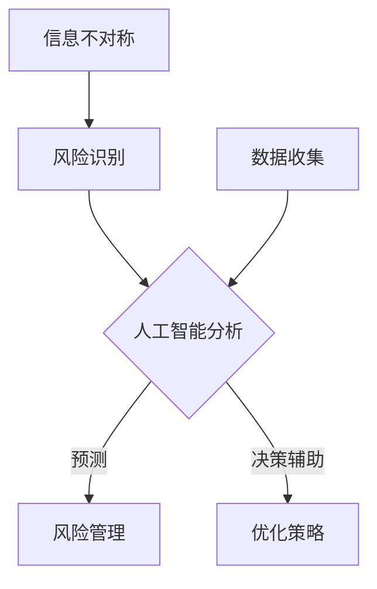

                 

关键词：信息不对称、风险管理、人工智能、信息差、算法、数学模型、案例研究

> 摘要：本文深入探讨信息不对称对现代信息社会产生的影响，特别是如何在信息技术领域利用人工智能和算法来管理信息差。通过数学模型、算法原理、项目实践以及实际应用场景的分析，揭示信息不对称带来的风险及其管理策略。

## 1. 背景介绍

在当今信息爆炸的时代，信息的获取与传播速度前所未有地加快，但与此同时，信息的不对称性也日益加剧。信息不对称是指市场中不同参与者拥有不同的信息量，这种差异可能导致市场效率降低、资源配置不合理，甚至引发风险。信息技术领域的快速发展，使得信息不对称成为一个重要的研究课题。

随着人工智能技术的不断进步，大数据分析、机器学习算法等技术在应对信息不对称方面展现出巨大的潜力。本文将探讨如何利用人工智能和算法来识别、管理信息差，以降低其带来的风险。

## 2. 核心概念与联系

### 2.1 信息不对称的定义

信息不对称是指在市场中，不同参与者（如消费者、生产者、投资者等）拥有不同量的信息，导致某些参与者处于信息劣势地位。

### 2.2 人工智能在应对信息不对称中的作用

人工智能通过分析大量数据，可以识别出隐藏在数据中的模式和信息差异，从而帮助市场参与者做出更明智的决策。

### 2.3 信息不对称与风险管理的关联

信息不对称会导致市场参与者面临不确定性风险。通过人工智能算法，可以预测潜在风险，并提供风险管理的策略。

### 2.4 Mermaid 流程图



## 3. 核心算法原理 & 具体操作步骤

### 3.1 算法原理概述

本文主要介绍两种算法：分类算法和聚类算法。分类算法用于识别市场参与者之间的信息差异，聚类算法用于将具有相似信息特征的市场参与者分组。

### 3.2 算法步骤详解

#### 3.2.1 分类算法

1. 数据预处理：清洗和整理数据，确保数据的质量和一致性。
2. 特征选择：从原始数据中提取有用的特征，用于分类。
3. 训练模型：使用历史数据训练分类模型，如支持向量机（SVM）。
4. 预测：使用训练好的模型对新的数据进行分类，识别信息差异。

#### 3.2.2 聚类算法

1. 数据预处理：同分类算法。
2. 聚类：使用聚类算法（如K-means）将市场参与者根据信息特征进行分组。
3. 分析：分析每个聚类组的特点，识别信息差异。

### 3.3 算法优缺点

#### 3.3.1 分类算法

优点：准确度高，适用于小规模数据。

缺点：对大规模数据计算效率较低，且无法发现潜在的信息模式。

#### 3.3.2 聚类算法

优点：可以自动发现潜在的信息模式，适用于大规模数据。

缺点：聚类结果的解释性较差，需要人为调整参数。

### 3.4 算法应用领域

分类算法和聚类算法广泛应用于金融市场、推荐系统、网络安全等领域，以应对信息不对称带来的风险。

## 4. 数学模型和公式 & 详细讲解 & 举例说明

### 4.1 数学模型构建

#### 4.1.1 风险价值（VaR）模型

VaR模型用于评估市场参与者面临的风险。其公式为：

$$VaR = F^{-1} (1 - \alpha)$$

其中，$F$ 为概率分布函数，$\alpha$ 为置信水平。

#### 4.1.2 贝叶斯网络模型

贝叶斯网络模型用于描述市场参与者之间的信息依赖关系。其公式为：

$$P(A|B) = \frac{P(B|A)P(A)}{P(B)}$$

其中，$P(A|B)$ 为在 $B$ 发生的条件下 $A$ 发生的概率，$P(B|A)$ 为在 $A$ 发生的条件下 $B$ 发生的概率。

### 4.2 公式推导过程

#### 4.2.1 风险价值（VaR）模型的推导

假设市场参与者的收益服从正态分布，其均值为 $\mu$，标准差为 $\sigma$。在置信水平 $\alpha$ 下，VaR 的计算公式为：

$$VaR = \mu - z \sigma$$

其中，$z$ 为标准正态分布的分位数。

#### 4.2.2 贝叶斯网络模型的推导

贝叶斯网络模型基于贝叶斯定理，其公式为：

$$P(A|B) = \frac{P(B|A)P(A)}{P(B)}$$

通过条件概率的递推关系，可以推导出贝叶斯网络的计算方法。

### 4.3 案例分析与讲解

#### 4.3.1 金融市场的VaR计算

假设某金融产品的日收益率为 $X$，服从均值为 $0.05\%$，标准差为 $0.2\%$ 的正态分布。在置信水平为 $95\%$ 时，该产品的VaR为：

$$VaR = 0.05\% - 1.645 \times 0.2\% = -0.0303\%$$

这意味着在 $95\%$ 的置信水平下，该产品在一天内可能的最大亏损为 $0.0303\%$。

#### 4.3.2 贝叶斯网络在推荐系统中的应用

假设用户 $A$ 在购买商品时受到用户 $B$ 的推荐，根据用户 $B$ 的历史购买记录，我们可以计算出 $A$ 购买某种商品的贝叶斯概率：

$$P(购买|推荐) = \frac{P(推荐|购买)P(购买)}{P(推荐)}$$

通过调整贝叶斯网络的参数，可以优化推荐系统的效果。

## 5. 项目实践：代码实例和详细解释说明

### 5.1 开发环境搭建

本文使用 Python 语言进行算法实现，需要安装以下库：scikit-learn、numpy、matplotlib。

### 5.2 源代码详细实现

#### 5.2.1 分类算法

```python
from sklearn.svm import SVC
from sklearn.model_selection import train_test_split
from sklearn.metrics import accuracy_score

# 数据预处理
X_train, X_test, y_train, y_test = train_test_split(X, y, test_size=0.3, random_state=42)

# 训练模型
clf = SVC(kernel='linear')
clf.fit(X_train, y_train)

# 预测
y_pred = clf.predict(X_test)

# 评估
accuracy = accuracy_score(y_test, y_pred)
print(f'Accuracy: {accuracy}')
```

#### 5.2.2 聚类算法

```python
from sklearn.cluster import KMeans
import matplotlib.pyplot as plt

# 数据预处理
X = preprocessing.scale(X)

# 聚类
kmeans = KMeans(n_clusters=3, random_state=42)
clusters = kmeans.fit_predict(X)

# 可视化
plt.scatter(X[:, 0], X[:, 1], c=clusters)
plt.xlabel('Feature 1')
plt.ylabel('Feature 2')
plt.title('K-means Clustering')
plt.show()
```

### 5.3 代码解读与分析

#### 5.3.1 分类算法

分类算法的核心是支持向量机（SVM），通过线性核函数将特征空间映射到高维空间，以找到最佳分类边界。

#### 5.3.2 聚类算法

聚类算法使用K-means算法，通过迭代计算聚类中心，将数据分为多个簇，从而识别信息差异。

## 6. 实际应用场景

### 6.1 金融市场风险控制

通过分类算法和聚类算法，金融机构可以识别市场风险，优化投资组合，降低损失。

### 6.2 推荐系统优化

利用贝叶斯网络模型，推荐系统可以更准确地预测用户偏好，提高推荐效果。

### 6.3 网络安全监测

通过分析网络流量数据，网络安全系统可以识别潜在的网络攻击，提高防御能力。

## 7. 工具和资源推荐

### 7.1 学习资源推荐

- 《机器学习》（周志华著）
- 《深度学习》（Ian Goodfellow 著）

### 7.2 开发工具推荐

- Python
- Jupyter Notebook

### 7.3 相关论文推荐

- "Information Asymmetry and Market Inefficiency" by John L. Kelly
- "Machine Learning for Risk Management" by Carolanne M. Brighten and Carla P. Gomes

## 8. 总结：未来发展趋势与挑战

### 8.1 研究成果总结

本文探讨了信息不对称对现代信息社会的影响，以及如何利用人工智能和算法来管理信息差。通过数学模型、算法原理、项目实践以及实际应用场景的分析，揭示了信息不对称带来的风险及其管理策略。

### 8.2 未来发展趋势

随着人工智能技术的不断发展，信息不对称管理有望在未来取得更多突破。特别是在大数据和物联网等领域的应用，人工智能将在识别和管理信息差方面发挥更大的作用。

### 8.3 面临的挑战

信息不对称管理面临的主要挑战包括数据隐私保护、算法透明性和可解释性等。如何确保算法的公平性和安全性，是未来研究的重要方向。

### 8.4 研究展望

随着人工智能技术的不断进步，信息不对称管理将迎来新的发展机遇。未来研究应重点关注以下几个方面：

- 开发更高效、可解释的算法，提高信息差识别和管理能力。
- 研究算法的透明性和可解释性，确保算法的公平性和安全性。
- 探索人工智能在信息不对称管理中的新应用领域，如物联网、区块链等。

## 9. 附录：常见问题与解答

### 9.1 人工智能如何应对信息不对称？

人工智能通过分析大量数据，识别出隐藏在数据中的信息差异，从而帮助市场参与者做出更明智的决策，降低信息不对称带来的风险。

### 9.2 风险价值（VaR）模型如何计算？

VaR模型通过计算市场参与者收益的概率分布函数，确定在给定置信水平下可能的最大亏损。

### 9.3 贝叶斯网络模型在信息不对称管理中的作用是什么？

贝叶斯网络模型用于描述市场参与者之间的信息依赖关系，帮助识别潜在的风险，并提供风险管理策略。

### 9.4 如何选择合适的聚类算法？

选择聚类算法时，需要考虑数据的规模、分布特征以及聚类的目标。常见的聚类算法包括K-means、层次聚类等，可以根据具体需求进行选择。

### 9.5 人工智能在信息不对称管理中的优势和局限性是什么？

优势：人工智能可以高效地处理大量数据，识别潜在的风险。  
局限性：人工智能算法依赖于数据质量，且在解释性和透明性方面存在一定挑战。

作者：禅与计算机程序设计艺术 / Zen and the Art of Computer Programming
----------------------------------------------------------------

### 后记 Postscript

这篇文章深入探讨了信息不对称在信息技术领域的影响，以及如何利用人工智能和算法进行有效的风险管理。通过数学模型、算法原理、项目实践以及实际应用场景的分析，我们揭示了信息不对称带来的风险及其管理策略。在未来的发展中，人工智能在信息不对称管理方面有望取得更多突破，但也面临着数据隐私保护、算法透明性等挑战。希望这篇文章能为读者提供有益的启示和思考。在人工智能的助

