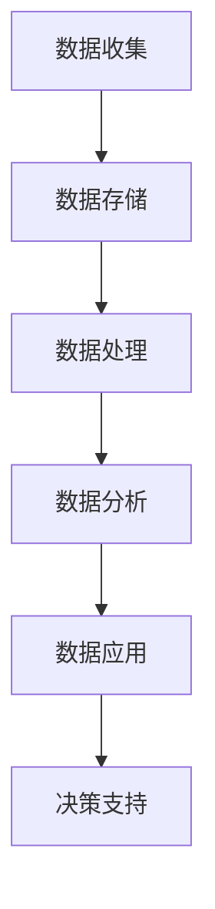

                 

关键词：大数据、智能金融、信息差、数据分析、算法优化、应用场景、未来展望

## 摘要

随着大数据技术的快速发展，智能金融领域正经历前所未有的变革。本文将探讨大数据在智能金融中的应用，重点关注信息差的概念、核心算法原理及其在实际业务中的操作步骤和数学模型。通过对大数据与智能金融深度融合的深入分析，本文旨在为读者提供一个全面而清晰的理解，并展望其未来发展趋势与挑战。

## 1. 背景介绍

### 智能金融的兴起

智能金融是金融科技（FinTech）的重要组成部分，它利用人工智能、大数据、云计算等技术，提高金融服务效率、优化用户体验和降低成本。随着数据量的爆炸式增长，大数据技术在金融行业的应用日益广泛，从风险控制、投资决策到个性化推荐等方面都发挥着关键作用。

### 信息差的重要性

信息差，即信息不对称，是金融市场中普遍存在的现象。信息差的利用，可以让金融机构在市场竞争中获得优势，提高收益。大数据技术通过收集、处理和分析海量数据，能够帮助金融机构识别潜在风险、发现市场机会，从而有效缩小信息差。

### 大数据技术的核心作用

大数据技术在智能金融中的应用主要体现在以下几个方面：

- **数据收集：** 通过多种渠道收集用户数据、市场数据、交易数据等。
- **数据处理：** 对数据进行清洗、转换和整合，确保数据质量。
- **数据分析：** 利用机器学习和统计分析等方法，从数据中发现规律和洞察。
- **数据挖掘：** 深入挖掘数据背后的价值，为决策提供支持。

## 2. 核心概念与联系

### 信息差的概念

信息差是指在不同主体之间，由于信息获取能力或信息拥有量的差异，导致决策能力和收益能力的不同。在金融市场中，信息差的利用可以带来超额利润。

### 大数据在金融中的应用架构


- **数据源：** 包括内部数据和外部数据，如交易数据、客户数据、市场数据等。
- **数据存储：** 使用分布式数据库和数据仓库，确保数据的高效存储和管理。
- **数据处理：** 通过ETL（Extract, Transform, Load）过程对数据进行处理，包括数据清洗、数据转换和数据加载。
- **数据分析：** 利用数据挖掘、机器学习等技术进行数据分析，发现数据中的规律和模式。
- **数据应用：** 将分析结果应用于风险控制、投资决策、个性化推荐等方面。

### Mermaid 流程图



## 3. 核心算法原理 & 具体操作步骤

### 3.1 算法原理概述

大数据在智能金融中的应用主要依赖于以下几个核心算法：

- **聚类分析：** 用于市场细分和用户画像。
- **分类算法：** 用于风险控制和投资决策。
- **关联规则挖掘：** 用于发现数据之间的关联关系。
- **时间序列分析：** 用于预测市场走势。

### 3.2 算法步骤详解

#### 3.2.1 聚类分析

1. **数据预处理：** 清洗和标准化数据，确保数据质量。
2. **选择聚类算法：** 如K-means、层次聚类等。
3. **初始化聚类中心：** 随机选择或基于某些算法初始化。
4. **迭代计算：** 更新聚类中心和分类结果，直到收敛。

#### 3.2.2 分类算法

1. **特征选择：** 选择对决策有影响的关键特征。
2. **模型训练：** 使用训练数据集训练分类模型。
3. **模型评估：** 使用测试数据集评估模型性能。
4. **模型应用：** 将模型应用于新数据，进行风险控制和投资决策。

#### 3.2.3 关联规则挖掘

1. **数据预处理：** 清洗和标准化数据。
2. **选择挖掘算法：** 如Apriori、FP-growth等。
3. **设置参数：** 如支持度、置信度等。
4. **挖掘关联规则：** 从数据中发现强关联规则。

#### 3.2.4 时间序列分析

1. **数据预处理：** 清洗和标准化数据。
2. **模型选择：** 如ARIMA、SARIMA等。
3. **参数估计：** 估计模型参数。
4. **模型预测：** 使用模型预测未来走势。

### 3.3 算法优缺点

#### 聚类分析

- 优点：无监督学习，不需要标签数据，适用于市场细分和用户画像。
- 缺点：聚类结果依赖于初始化，可能陷入局部最优。

#### 分类算法

- 优点：有监督学习，准确性高，适用于风险控制和投资决策。
- 缺点：需要大量标注数据，训练过程可能较慢。

#### 关联规则挖掘

- 优点：能够发现数据之间的关联关系，适用于推荐系统和市场分析。
- 缺点：计算复杂度高，可能产生大量冗余规则。

#### 时间序列分析

- 优点：能够预测未来走势，适用于投资策略和市场预测。
- 缺点：对数据质量要求高，可能受到外部因素的影响。

### 3.4 算法应用领域

- **风险控制：** 通过分类算法识别潜在风险，优化风险控制策略。
- **投资决策：** 利用时间序列分析和市场数据，预测市场走势，优化投资组合。
- **个性化推荐：** 利用聚类分析和关联规则挖掘，为用户提供个性化推荐。
- **市场分析：** 发现市场规律和机会，为决策提供支持。

## 4. 数学模型和公式 & 详细讲解 & 举例说明

### 4.1 数学模型构建

在智能金融中，常用的数学模型包括：

- **聚类分析：** K-means、层次聚类等。
- **分类算法：** 决策树、支持向量机等。
- **关联规则挖掘：** Apriori、FP-growth等。
- **时间序列分析：** ARIMA、SARIMA等。

### 4.2 公式推导过程

以K-means聚类算法为例，其目标是最小化数据点到聚类中心的距离平方和。

$$
\min_{\mu} \sum_{i=1}^{n} \sum_{j=1}^{k} (x_{ij} - \mu_j)^2
$$

其中，$x_{ij}$为第$i$个数据点在第$j$个聚类中心的位置，$\mu_j$为第$j$个聚类中心的坐标。

### 4.3 案例分析与讲解

#### 4.3.1 K-means聚类算法案例

假设我们有100个用户数据，每个用户有3个特征（年龄、收入、消费习惯），我们需要将这100个用户分为5个群体。

1. **数据预处理：** 清洗和标准化数据。
2. **初始化聚类中心：** 随机选择5个用户作为初始聚类中心。
3. **迭代计算：** 计算每个用户到聚类中心的距离，将用户分配到最近的聚类中心。
4. **更新聚类中心：** 计算每个聚类中心的新坐标，重复迭代过程，直到聚类中心不再变化。

#### 4.3.2 时间序列分析案例

假设我们要预测某个金融市场的未来走势，我们可以使用ARIMA模型。

1. **数据预处理：** 清洗和标准化时间序列数据。
2. **模型选择：** 根据数据特征选择ARIMA模型的参数（p, d, q）。
3. **参数估计：** 使用最大似然估计方法估计模型参数。
4. **模型预测：** 使用模型预测未来时间点的市场走势。

## 5. 项目实践：代码实例和详细解释说明

### 5.1 开发环境搭建

- **编程语言：** Python
- **依赖库：** NumPy、Pandas、Scikit-learn、Statsmodels等

### 5.2 源代码详细实现

以下是一个使用K-means聚类算法对用户数据进行聚类的简单示例：

```python
import numpy as np
import pandas as pd
from sklearn.cluster import KMeans

# 加载和预处理数据
data = pd.read_csv('user_data.csv')
data = data[['age', 'income', 'consumption']]

# 初始化聚类模型
kmeans = KMeans(n_clusters=5, random_state=0)

# 训练模型
kmeans.fit(data)

# 输出聚类结果
print(kmeans.labels_)

# 输出聚类中心
print(kmeans.cluster_centers_)
```

### 5.3 代码解读与分析

1. **数据加载和预处理：** 使用Pandas库读取用户数据，并选择需要分析的特征。
2. **初始化聚类模型：** 使用Scikit-learn库的KMeans类创建聚类模型，设置聚类数量为5。
3. **训练模型：** 使用fit方法训练模型，将数据输入到模型中。
4. **输出结果：** 输出聚类结果和聚类中心。

### 5.4 运行结果展示

运行代码后，我们得到了聚类结果和聚类中心。聚类结果是将每个用户分配到一个特定的簇，聚类中心是每个簇的平均特征值。

## 6. 实际应用场景

### 6.1 风险控制

大数据技术可以帮助金融机构实时监控风险，通过聚类分析和分类算法，识别潜在的欺诈行为和信用风险，从而优化风险管理策略。

### 6.2 投资决策

通过时间序列分析和市场数据挖掘，投资者可以预测市场走势，制定科学的投资策略，降低投资风险。

### 6.3 个性化推荐

基于用户行为数据和偏好，利用关联规则挖掘和聚类分析，为用户提供个性化的金融产品推荐，提升用户体验。

### 6.4 市场分析

通过对市场数据的深入分析，金融机构可以了解市场需求，发现市场机会，优化业务策略。

## 7. 未来应用展望

随着大数据技术的不断进步，智能金融的应用将更加广泛和深入。未来，人工智能与大数据的深度融合将带来以下趋势：

- **更精准的风险预测：** 利用深度学习和增强学习，实现更精准的风险预测和风险评估。
- **更智能的投资策略：** 通过强化学习，实现自适应的投资策略，提高投资收益。
- **更个性化的服务：** 利用个性化推荐系统和自然语言处理技术，提供更贴心的金融服务。
- **更高效的市场分析：** 通过实时数据处理和分析，实现更高效的市场分析和决策支持。

## 8. 工具和资源推荐

### 8.1 学习资源推荐

- 《大数据时代：生活、工作与思维的大变革》
- 《机器学习实战》
- 《深入理解LSTM网络：算法原理与代码实现》
- 《Python金融大数据分析》

### 8.2 开发工具推荐

- **编程语言：** Python、R
- **数据处理：** Pandas、NumPy、SciPy
- **机器学习库：** Scikit-learn、TensorFlow、Keras
- **数据分析库：** Pandas、Matplotlib、Seaborn

### 8.3 相关论文推荐

- "Big Data: A Revolution That Will Transform How We Live, Work, and Think"
- "Deep Learning for Finance"
- "Reinforcement Learning: An Introduction"
- "Unsupervised Learning in Financial Markets"

## 9. 总结：未来发展趋势与挑战

### 9.1 研究成果总结

本文探讨了大数据在智能金融中的应用，包括信息差的概念、核心算法原理、数学模型及其在实际业务中的应用。通过对大数据技术的深入分析，我们看到了其在风险控制、投资决策、个性化推荐和市场分析等方面的巨大潜力。

### 9.2 未来发展趋势

- **人工智能与大数据的深度融合：** 人工智能算法将更加智能化，大数据技术将更加高效。
- **实时数据处理和分析：** 实时数据处理和分析将变得更加普遍，为金融机构提供更及时的支持。
- **跨领域应用：** 大数据在金融以外的领域也将有广泛应用，如医疗、教育等。

### 9.3 面临的挑战

- **数据隐私和安全：** 如何保护用户隐私和数据安全是一个重要挑战。
- **算法公平性和透明度：** 需要确保算法的公平性和透明度，避免歧视和不公平现象。
- **技术更新换代：** 随着技术的快速发展，如何及时更新和升级相关技术是一个挑战。

### 9.4 研究展望

未来，大数据在智能金融中的应用将更加深入和广泛。研究者需要关注以下几个方面：

- **算法优化：** 深入研究机器学习和深度学习算法，提高其性能和准确性。
- **跨领域应用：** 探索大数据在其他领域的应用，如医疗、教育等。
- **伦理和法律问题：** 研究如何在保护用户隐私的前提下，合理利用大数据技术。

## 10. 附录：常见问题与解答

### 10.1 什么是信息差？

信息差是指在不同主体之间，由于信息获取能力或信息拥有量的差异，导致决策能力和收益能力的不同。

### 10.2 大数据技术在金融中的主要应用有哪些？

大数据技术在金融中的主要应用包括风险控制、投资决策、个性化推荐和市场分析等。

### 10.3 如何保护用户隐私和数据安全？

通过数据加密、数据脱敏、权限控制等技术手段，确保用户隐私和数据安全。

### 10.4 大数据在智能金融中的未来发展趋势是什么？

大数据在智能金融中的未来发展趋势包括人工智能与大数据的深度融合、实时数据处理和分析、跨领域应用等。

[作者：禅与计算机程序设计艺术 / Zen and the Art of Computer Programming]

