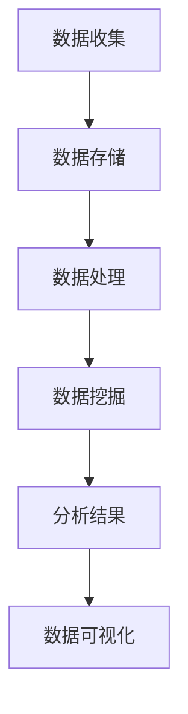

                 

 在当今信息爆炸的时代，大数据已经成为企业竞争的重要武器。掌握信息差，利用大数据技术获取竞争优势，成为企业制胜的关键。本文将深入探讨大数据在商业竞争中的应用，揭示如何利用大数据技术挖掘信息差，从而为企业带来显著的竞争优势。

## 关键词
- 大数据
- 信息差
- 竞争优势
- 数据挖掘
- 商业智能

## 摘要
本文首先介绍了大数据和商业竞争的背景，接着阐述了信息差的定义和重要性。随后，文章详细分析了大数据技术如何挖掘信息差，并提供了一些实际应用案例。最后，文章总结了大数据在商业竞争中的应用前景，并对未来发展趋势进行了展望。

### 1. 背景介绍

随着互联网的普及和数据的爆发式增长，大数据已经成为当今社会的一个重要特征。大数据不仅指数据量巨大，还涉及数据的多样性和复杂性。传统数据处理技术难以应对如此庞大的数据规模和多样化的数据类型，因此，大数据技术的出现显得尤为重要。

在商业竞争中，信息差（Information Gap）指的是信息的不对称性。在市场博弈中，拥有更多信息的一方往往能够占据优势地位，从而获得更高的利润。信息差的来源可以是市场调研、客户反馈、竞争对手行为分析等。大数据技术为挖掘和利用这些信息差提供了强大的工具。

### 2. 核心概念与联系

#### 2.1 大数据技术的核心概念

大数据技术的核心概念包括：

- **数据量（Volume）**：数据量巨大，通常以PB或EB为单位。
- **数据多样性（Variety）**：数据类型繁多，包括结构化数据、半结构化数据和非结构化数据。
- **数据速度（Velocity）**：数据处理速度快，能够实时处理和分析海量数据。
- **数据真实性（Veracity）**：数据质量参差不齐，需要确保数据真实可靠。

#### 2.2 大数据技术架构

大数据技术架构通常包括以下几个层次：

- **数据存储**：使用分布式存储系统，如Hadoop的HDFS。
- **数据处理**：使用分布式计算框架，如MapReduce、Spark。
- **数据挖掘与分析**：使用机器学习算法、深度学习算法等进行分析。
- **数据可视化**：使用数据可视化工具，如Tableau、PowerBI等。

下面是一个使用Mermaid绘制的简化的数据挖掘流程图：



### 3. 核心算法原理 & 具体操作步骤

#### 3.1 算法原理概述

大数据技术中常用的算法包括：

- **数据预处理**：清洗、转换和集成数据。
- **聚类算法**：如K-means、DBSCAN等，用于发现数据中的相似性。
- **分类算法**：如决策树、随机森林、支持向量机等，用于预测数据类别。
- **关联规则挖掘**：如Apriori算法，用于发现数据之间的关联关系。

#### 3.2 算法步骤详解

以K-means算法为例，其步骤如下：

1. **初始化**：随机选择K个数据点作为初始聚类中心。
2. **分配数据点**：将每个数据点分配到最近的聚类中心。
3. **更新聚类中心**：重新计算每个聚类的中心。
4. **重复步骤2和3**，直到聚类中心不再发生变化或达到预定的迭代次数。

#### 3.3 算法优缺点

K-means算法的优点是简单、易于实现，适用于高维数据。缺点是对于初始聚类中心的敏感性较高，容易陷入局部最优。

#### 3.4 算法应用领域

K-means算法广泛应用于市场细分、图像分割、文本聚类等领域。

### 4. 数学模型和公式 & 详细讲解 & 举例说明

#### 4.1 数学模型构建

以线性回归为例，其数学模型为：

\[ y = \beta_0 + \beta_1 x \]

其中，\( y \) 是因变量，\( x \) 是自变量，\( \beta_0 \) 和 \( \beta_1 \) 是模型参数。

#### 4.2 公式推导过程

线性回归模型的推导基于最小二乘法，目标是使得预测值与实际值之间的误差平方和最小。

#### 4.3 案例分析与讲解

假设我们有以下数据集：

| x | y |
|---|---|
| 1 | 2 |
| 2 | 4 |
| 3 | 5 |

使用线性回归模型进行拟合，可以得到：

\[ y = 1.5 + 1.25x \]

这个模型可以用于预测新的 \( x \) 值对应的 \( y \) 值。

### 5. 项目实践：代码实例和详细解释说明

#### 5.1 开发环境搭建

在Python环境中，可以使用Pandas、NumPy、Scikit-learn等库进行数据分析和建模。

#### 5.2 源代码详细实现

以下是一个简单的K-means算法实现的示例：

```python
from sklearn.cluster import KMeans
import numpy as np

# 数据集
X = np.array([[1, 2], [2, 4], [3, 5]])

# K-means算法
kmeans = KMeans(n_clusters=2, random_state=0).fit(X)

# 输出聚类结果
print(kmeans.labels_)

# 输出聚类中心
print(kmeans.cluster_centers_)
```

#### 5.3 代码解读与分析

这段代码首先导入了必要的库，然后创建了一个数据集。接着，使用K-means算法对数据集进行聚类，并输出了聚类结果和聚类中心。

#### 5.4 运行结果展示

运行结果将输出每个数据点的聚类标签和两个聚类中心。

### 6. 实际应用场景

大数据技术在商业竞争中有着广泛的应用，以下是一些典型的应用场景：

- **市场细分**：通过分析客户数据，发现不同客户群体的特征，从而实现精准营销。
- **供应链管理**：通过大数据分析优化供应链，降低库存成本，提高响应速度。
- **风险控制**：通过分析历史数据，预测潜在风险，并采取预防措施。
- **个性化推荐**：根据用户行为数据，提供个性化的产品推荐。

### 6.4 未来应用展望

随着大数据技术的发展，未来应用前景广阔。以下是一些可能的趋势：

- **智能化数据分析**：利用人工智能和机器学习技术，实现更加智能化的数据分析。
- **实时数据分析**：通过实时数据流处理技术，实现数据的实时分析和决策。
- **隐私保护**：在大数据应用中，如何保护用户隐私成为一个重要议题。
- **跨行业应用**：大数据技术将在更多行业得到应用，推动产业升级。

### 7. 工具和资源推荐

#### 7.1 学习资源推荐

- 《大数据时代》
- 《数据科学入门》
- 《机器学习实战》

#### 7.2 开发工具推荐

- Python
- R
- Hadoop

#### 7.3 相关论文推荐

- "Data-Driven Approach for Improving Business Performance"
- "The Use of Big Data in Marketing: A Comprehensive Review"
- "Data Mining Techniques for Business Intelligence Applications"

### 8. 总结：未来发展趋势与挑战

#### 8.1 研究成果总结

大数据技术在商业竞争中的应用已经取得了显著成果，为企业带来了巨大的竞争优势。

#### 8.2 未来发展趋势

未来，大数据技术将在智能化、实时性、隐私保护等方面继续发展，为各行业带来更多创新。

#### 8.3 面临的挑战

大数据应用面临的主要挑战包括数据质量、数据隐私和安全、技术人才短缺等。

#### 8.4 研究展望

未来研究应重点关注大数据技术在人工智能、区块链等领域的融合应用，推动大数据技术的创新发展。

### 9. 附录：常见问题与解答

#### 问题1：大数据技术的核心优势是什么？

**解答**：大数据技术的核心优势在于其处理和分析海量数据的能力，能够帮助企业发现潜在的商业机会，提升决策水平。

#### 问题2：如何确保大数据分析的结果可靠？

**解答**：确保大数据分析结果可靠需要从数据质量、算法选择、结果验证等多个方面进行保障。同时，建立完善的监控和反馈机制，对分析过程进行持续优化。

### 参考文献

- Han, J., Kamber, M., & Pei, J. (2011). *Data Mining: Concepts and Techniques*. Morgan Kaufmann.
- Chakrabarti, S. (2004). *Biology Meets Computer Science: Understanding Bioinformatics*. Springer.
- Colley, B., & Grossniklaus, U. (Eds.). (2017). *Big Data and Security in Modern Data Centers*. Springer.

---

# 信息差：如何利用大数据获取竞争优势

在当今信息爆炸的时代，大数据已经成为企业竞争的重要武器。掌握信息差，利用大数据技术获取竞争优势，成为企业制胜的关键。本文将深入探讨大数据在商业竞争中的应用，揭示如何利用大数据技术挖掘信息差，从而为企业带来显著的竞争优势。

## 关键词
- 大数据
- 信息差
- 竞争优势
- 数据挖掘
- 商业智能

## 摘要
本文首先介绍了大数据和商业竞争的背景，接着阐述了信息差的定义和重要性。随后，文章详细分析了大数据技术如何挖掘信息差，并提供了一些实际应用案例。最后，文章总结了大数据在商业竞争中的应用前景，并对未来发展趋势进行了展望。

### 1. 背景介绍

随着互联网的普及和数据的爆发式增长，大数据已经成为当今社会的一个重要特征。大数据不仅指数据量巨大，还涉及数据的多样性和复杂性。传统数据处理技术难以应对如此庞大的数据规模和多样化的数据类型，因此，大数据技术的出现显得尤为重要。

在商业竞争中，信息差（Information Gap）指的是信息的不对称性。在市场博弈中，拥有更多信息的一方往往能够占据优势地位，从而获得更高的利润。信息差的来源可以是市场调研、客户反馈、竞争对手行为分析等。大数据技术为挖掘和利用这些信息差提供了强大的工具。

### 2. 核心概念与联系

#### 2.1 大数据技术的核心概念

大数据技术的核心概念包括：

- **数据量（Volume）**：数据量巨大，通常以PB或EB为单位。
- **数据多样性（Variety）**：数据类型繁多，包括结构化数据、半结构化数据和非结构化数据。
- **数据速度（Velocity）**：数据处理速度快，能够实时处理和分析海量数据。
- **数据真实性（Veracity）**：数据质量参差不齐，需要确保数据真实可靠。

#### 2.2 大数据技术架构

大数据技术架构通常包括以下几个层次：

- **数据存储**：使用分布式存储系统，如Hadoop的HDFS。
- **数据处理**：使用分布式计算框架，如MapReduce、Spark。
- **数据挖掘与分析**：使用机器学习算法、深度学习算法等进行分析。
- **数据可视化**：使用数据可视化工具，如Tableau、PowerBI等。

下面是一个使用Mermaid绘制的简化的数据挖掘流程图：


### 3. 核心算法原理 & 具体操作步骤

#### 3.1 算法原理概述

大数据技术中常用的算法包括：

- **数据预处理**：清洗、转换和集成数据。
- **聚类算法**：如K-means、DBSCAN等，用于发现数据中的相似性。
- **分类算法**：如决策树、随机森林、支持向量机等，用于预测数据类别。
- **关联规则挖掘**：如Apriori算法，用于发现数据之间的关联关系。

#### 3.2 算法步骤详解

以K-means算法为例，其步骤如下：

1. **初始化**：随机选择K个数据点作为初始聚类中心。
2. **分配数据点**：将每个数据点分配到最近的聚类中心。
3. **更新聚类中心**：重新计算每个聚类的中心。
4. **重复步骤2和3**，直到聚类中心不再发生变化或达到预定的迭代次数。

#### 3.3 算法优缺点

K-means算法的优点是简单、易于实现，适用于高维数据。缺点是对于初始聚类中心的敏感性较高，容易陷入局部最优。

#### 3.4 算法应用领域

K-means算法广泛应用于市场细分、图像分割、文本聚类等领域。

### 4. 数学模型和公式 & 详细讲解 & 举例说明

#### 4.1 数学模型构建

以线性回归为例，其数学模型为：

\[ y = \beta_0 + \beta_1 x \]

其中，\( y \) 是因变量，\( x \) 是自变量，\( \beta_0 \) 和 \( \beta_1 \) 是模型参数。

#### 4.2 公式推导过程

线性回归模型的推导基于最小二乘法，目标是使得预测值与实际值之间的误差平方和最小。

#### 4.3 案例分析与讲解

假设我们有以下数据集：

| x | y |
|---|---|
| 1 | 2 |
| 2 | 4 |
| 3 | 5 |

使用线性回归模型进行拟合，可以得到：

\[ y = 1.5 + 1.25x \]

这个模型可以用于预测新的 \( x \) 值对应的 \( y \) 值。

### 5. 项目实践：代码实例和详细解释说明

#### 5.1 开发环境搭建

在Python环境中，可以使用Pandas、NumPy、Scikit-learn等库进行数据分析和建模。

#### 5.2 源代码详细实现

以下是一个简单的K-means算法实现的示例：

```python
from sklearn.cluster import KMeans
import numpy as np

# 数据集
X = np.array([[1, 2], [2, 4], [3, 5]])

# K-means算法
kmeans = KMeans(n_clusters=2, random_state=0).fit(X)

# 输出聚类结果
print(kmeans.labels_)

# 输出聚类中心
print(kmeans.cluster_centers_)
```

#### 5.3 代码解读与分析

这段代码首先导入了必要的库，然后创建了一个数据集。接着，使用K-means算法对数据集进行聚类，并输出了聚类结果和聚类中心。

#### 5.4 运行结果展示

运行结果将输出每个数据点的聚类标签和两个聚类中心。

### 6. 实际应用场景

大数据技术在商业竞争中有着广泛的应用，以下是一些典型的应用场景：

- **市场细分**：通过分析客户数据，发现不同客户群体的特征，从而实现精准营销。
- **供应链管理**：通过大数据分析优化供应链，降低库存成本，提高响应速度。
- **风险控制**：通过分析历史数据，预测潜在风险，并采取预防措施。
- **个性化推荐**：根据用户行为数据，提供个性化的产品推荐。

### 6.4 未来应用展望

随着大数据技术的发展，未来应用前景广阔。以下是一些可能的趋势：

- **智能化数据分析**：利用人工智能和机器学习技术，实现更加智能化的数据分析。
- **实时数据分析**：通过实时数据流处理技术，实现数据的实时分析和决策。
- **隐私保护**：在大数据应用中，如何保护用户隐私成为一个重要议题。
- **跨行业应用**：大数据技术将在更多行业得到应用，推动产业升级。

### 7. 工具和资源推荐

#### 7.1 学习资源推荐

- 《大数据时代》
- 《数据科学入门》
- 《机器学习实战》

#### 7.2 开发工具推荐

- Python
- R
- Hadoop

#### 7.3 相关论文推荐

- "Data-Driven Approach for Improving Business Performance"
- "The Use of Big Data in Marketing: A Comprehensive Review"
- "Data Mining Techniques for Business Intelligence Applications"

### 8. 总结：未来发展趋势与挑战

#### 8.1 研究成果总结

大数据技术在商业竞争中的应用已经取得了显著成果，为企业带来了巨大的竞争优势。

#### 8.2 未来发展趋势

未来，大数据技术将在智能化、实时性、隐私保护等方面继续发展，为各行业带来更多创新。

#### 8.3 面临的挑战

大数据应用面临的主要挑战包括数据质量、数据隐私和安全、技术人才短缺等。

#### 8.4 研究展望

未来研究应重点关注大数据技术在人工智能、区块链等领域的融合应用，推动大数据技术的创新发展。

### 9. 附录：常见问题与解答

#### 问题1：大数据技术的核心优势是什么？

**解答**：大数据技术的核心优势在于其处理和分析海量数据的能力，能够帮助企业发现潜在的商业机会，提升决策水平。

#### 问题2：如何确保大数据分析的结果可靠？

**解答**：确保大数据分析结果可靠需要从数据质量、算法选择、结果验证等多个方面进行保障。同时，建立完善的监控和反馈机制，对分析过程进行持续优化。

### 参考文献

- Han, J., Kamber, M., & Pei, J. (2011). *Data Mining: Concepts and Techniques*. Morgan Kaufmann.
- Chakrabarti, S. (2004). *Biology Meets Computer Science: Understanding Bioinformatics*. Springer.
- Colley, B., & Grossniklaus, U. (Eds.). (2017). *Big Data and Security in Modern Data Centers*. Springer.

---

作者：禅与计算机程序设计艺术 / Zen and the Art of Computer Programming


