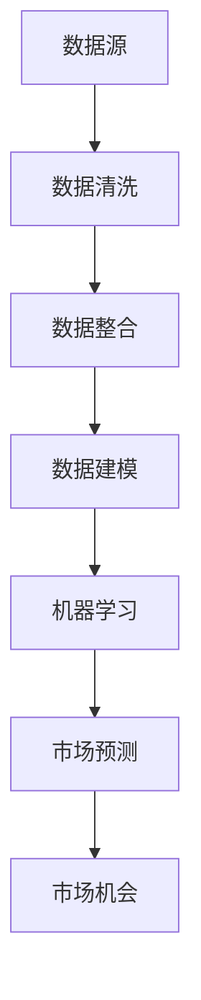

                 

在当今竞争激烈的市场环境中，掌握信息差是成功的关键。通过分析数据，企业可以更有效地发现市场机会，制定有针对性的策略，从而在市场中占据有利位置。本文将探讨如何通过数据分析发现市场机会，帮助企业在市场中脱颖而出。

## 文章关键词

- 数据分析
- 信息差
- 市场机会
- 数据挖掘
- 商业智能

## 文章摘要

本文将介绍如何通过数据分析发现市场机会。首先，我们将回顾数据分析的基本概念和原理。然后，我们将探讨如何运用数据分析技术识别信息差，并提供一些具体的案例分析。最后，我们将讨论未来数据分析在市场机会挖掘方面的应用前景。

## 1. 背景介绍

在信息爆炸的时代，如何从海量数据中提取有价值的信息成为企业面临的重要挑战。数据分析作为一门交叉学科，涵盖了统计学、计算机科学、数据挖掘、机器学习等领域。通过数据分析，企业可以从海量数据中提取有价值的信息，揭示数据背后的规律和趋势，从而指导决策。

### 1.1 数据分析的原理和架构

数据分析的原理是基于统计学和机器学习的算法，通过对数据进行清洗、整合、建模和预测，从数据中提取有价值的信息。其架构通常包括数据源、数据存储、数据处理、数据分析和数据可视化五个部分。

### 1.2 数据分析的意义和价值

数据分析对企业具有重要的意义和价值：

1. **支持决策**：通过数据分析，企业可以了解市场需求、客户行为、竞争态势等关键信息，从而制定更为科学的决策。
2. **优化运营**：通过数据分析，企业可以优化业务流程、降低成本、提高效率。
3. **市场洞察**：通过数据分析，企业可以深入了解市场动态，发现市场机会，抓住机遇。

## 2. 核心概念与联系

### 2.1 信息差的定义

信息差是指不同个体或组织在信息获取、处理和利用方面存在的差异。在市场中，信息差可能导致一些企业能够更早地发现机会，占据市场优势。

### 2.2 数据分析技术与信息差的联系

数据分析技术可以通过以下方式识别信息差：

1. **数据挖掘**：通过数据挖掘技术，可以从海量数据中发现潜在的模式和规律，从而识别市场机会。
2. **机器学习**：机器学习算法可以通过训练模型，对大量数据进行分类、预测和聚类，从而发现市场机会。
3. **商业智能**：商业智能系统可以帮助企业整合内部数据，对外部市场环境进行实时监控，从而发现市场机会。

### 2.3 Mermaid 流程图

以下是一个简单的 Mermaid 流程图，展示了数据分析技术在识别信息差中的运用：



## 3. 核心算法原理 & 具体操作步骤

### 3.1 算法原理概述

数据分析的核心算法包括数据挖掘算法、机器学习算法和商业智能算法。以下是对这些算法的简要介绍：

1. **数据挖掘算法**：数据挖掘算法用于从大量数据中发现潜在的模式和规律。常见的算法包括关联规则挖掘、分类算法、聚类算法等。
2. **机器学习算法**：机器学习算法通过训练模型，对大量数据进行分类、预测和聚类。常见的算法包括决策树、支持向量机、神经网络等。
3. **商业智能算法**：商业智能算法用于整合企业内部数据，对外部市场环境进行实时监控。常见的算法包括数据仓库、数据挖掘、数据可视化等。

### 3.2 算法步骤详解

以下是一个简单的数据分析流程，展示了如何通过数据分析发现市场机会：

1. **数据收集**：收集与企业相关的各种数据，包括市场数据、客户数据、竞争数据等。
2. **数据清洗**：对收集到的数据进行清洗，去除重复数据、错误数据和无效数据。
3. **数据整合**：将不同来源的数据进行整合，形成一个统一的数据集。
4. **数据建模**：根据业务需求，选择合适的数据挖掘算法或机器学习算法，对数据进行分析。
5. **市场预测**：根据分析结果，对市场趋势进行预测，识别潜在的市场机会。
6. **市场机会评估**：对识别出的市场机会进行评估，确定其可行性。
7. **决策制定**：根据评估结果，制定相应的市场策略。

### 3.3 算法优缺点

每种算法都有其优缺点，企业应根据自身需求选择合适的算法：

1. **数据挖掘算法**：优点：能够从大量数据中发现潜在的模式和规律；缺点：可能存在噪声和异常值，影响分析结果。
2. **机器学习算法**：优点：具有较好的预测能力；缺点：对数据质量和数据量要求较高。
3. **商业智能算法**：优点：能够整合企业内部和外部数据，提供全面的业务洞察；缺点：需要较长的时间进行数据整合和分析。

### 3.4 算法应用领域

数据分析算法在多个领域都有广泛的应用：

1. **市场营销**：通过数据分析，企业可以了解客户需求、市场趋势和竞争态势，制定有效的市场策略。
2. **供应链管理**：通过数据分析，企业可以优化供应链流程，降低成本，提高效率。
3. **风险管理**：通过数据分析，企业可以识别潜在的风险，制定相应的风险控制策略。

## 4. 数学模型和公式 & 详细讲解 & 举例说明

### 4.1 数学模型构建

数据分析中的数学模型通常包括以下几个方面：

1. **概率模型**：用于描述随机事件和不确定性。常见的概率模型包括伯努利模型、泊松模型、正态分布等。
2. **线性回归模型**：用于描述变量之间的线性关系。常见的线性回归模型包括一元线性回归、多元线性回归等。
3. **分类模型**：用于将数据划分为不同的类别。常见的分类模型包括决策树、支持向量机、朴素贝叶斯等。

### 4.2 公式推导过程

以下是一个简单的线性回归模型的公式推导过程：

假设我们有两个变量 \(X\) 和 \(Y\)，它们之间存在线性关系。线性回归模型可以表示为：

\[ Y = \beta_0 + \beta_1X + \varepsilon \]

其中，\(\beta_0\) 和 \(\beta_1\) 分别是模型的参数，\(\varepsilon\) 是误差项。

为了求解参数 \(\beta_0\) 和 \(\beta_1\)，我们可以使用最小二乘法。最小二乘法的目标是最小化误差项的平方和。具体公式如下：

\[ \min \sum_{i=1}^{n} (Y_i - \beta_0 - \beta_1X_i)^2 \]

通过求导，我们可以得到以下两个方程：

\[ \frac{\partial}{\partial \beta_0} \sum_{i=1}^{n} (Y_i - \beta_0 - \beta_1X_i)^2 = 0 \]

\[ \frac{\partial}{\partial \beta_1} \sum_{i=1}^{n} (Y_i - \beta_0 - \beta_1X_i)^2 = 0 \]

解这两个方程，我们可以得到参数 \(\beta_0\) 和 \(\beta_1\) 的最优值。

### 4.3 案例分析与讲解

以下是一个线性回归模型的案例分析：

假设我们有一个数据集，包含 \(X\) 和 \(Y\) 两个变量。我们希望通过线性回归模型预测 \(Y\) 的值。以下是对该案例的分析和讲解：

1. **数据收集**：收集 \(X\) 和 \(Y\) 的数据，并对其进行预处理，去除异常值和噪声。
2. **数据可视化**：绘制 \(X\) 和 \(Y\) 的散点图，观察它们之间的线性关系。
3. **模型建立**：建立线性回归模型，并使用最小二乘法求解参数。
4. **模型评估**：使用交叉验证方法评估模型的效果，调整模型参数。
5. **预测**：使用训练好的模型预测新的 \(X\) 值对应的 \(Y\) 值。

通过以上步骤，我们可以建立一个简单的线性回归模型，用于预测 \(Y\) 的值。在实际应用中，我们可以根据具体情况选择合适的模型和算法。

## 5. 项目实践：代码实例和详细解释说明

### 5.1 开发环境搭建

在本节中，我们将使用 Python 编写一个简单的线性回归项目。首先，我们需要搭建开发环境。以下是搭建开发环境的步骤：

1. **安装 Python**：在官方网站下载并安装 Python，版本建议为 3.8 或以上。
2. **安装 Jupyter Notebook**：Jupyter Notebook 是一个交互式 Python 环境，可以帮助我们更好地编写和运行代码。在命令行中运行以下命令安装 Jupyter Notebook：

   ```bash
   pip install notebook
   ```

3. **启动 Jupyter Notebook**：在命令行中运行以下命令启动 Jupyter Notebook：

   ```bash
   jupyter notebook
   ```

### 5.2 源代码详细实现

以下是一个简单的线性回归项目的源代码实现。我们将使用 Python 的 `scikit-learn` 库来实现线性回归模型。

```python
import numpy as np
import matplotlib.pyplot as plt
from sklearn.linear_model import LinearRegression

# 生成模拟数据
np.random.seed(0)
X = np.random.rand(100, 1)
y = 2 * X[:, 0] + 1 + np.random.randn(100) * 0.1

# 建立线性回归模型
model = LinearRegression()
model.fit(X, y)

# 模型预测
X_new = np.array([[0], [1]])
y_pred = model.predict(X_new)

# 数据可视化
plt.scatter(X, y, color='blue', label='Actual Data')
plt.plot(X_new, y_pred, color='red', label='Predicted Line')
plt.xlabel('X')
plt.ylabel('Y')
plt.legend()
plt.show()
```

### 5.3 代码解读与分析

1. **数据生成**：我们首先使用 `numpy` 库生成模拟数据。`X` 表示自变量，`y` 表示因变量。我们假设 \( y = 2x + 1 + \epsilon \)，其中 \(\epsilon\) 是误差项。
2. **建立模型**：我们使用 `scikit-learn` 库中的 `LinearRegression` 类建立线性回归模型。`fit()` 方法用于训练模型。
3. **模型预测**：使用训练好的模型对新的 \(X\) 值进行预测。`predict()` 方法用于预测新的数据点。
4. **数据可视化**：我们使用 `matplotlib` 库将实际数据和预测结果绘制在散点图上。这有助于我们观察模型的效果。

### 5.4 运行结果展示

运行以上代码后，我们将得到一个散点图，其中蓝色点表示实际数据，红色线表示预测的线性回归模型。通过观察散点图，我们可以发现模型对数据的拟合效果较好。

## 6. 实际应用场景

### 6.1 市场营销

在市场营销中，数据分析可以帮助企业了解客户需求、市场趋势和竞争态势。通过数据分析，企业可以识别出潜在的市场机会，并制定相应的营销策略。

### 6.2 供应链管理

在供应链管理中，数据分析可以帮助企业优化供应链流程，降低成本，提高效率。通过数据分析，企业可以识别出供应链中的瓶颈和优化点，从而提高供应链的整体效能。

### 6.3 风险管理

在风险管理中，数据分析可以帮助企业识别潜在的风险，并制定相应的风险控制策略。通过数据分析，企业可以了解市场风险、信用风险和操作风险等，从而更好地管理风险。

## 7. 未来应用展望

随着数据分析技术的不断发展，未来在市场机会挖掘方面的应用将越来越广泛。以下是一些未来应用展望：

1. **人工智能与数据分析的融合**：人工智能技术的发展将为数据分析带来更多可能性，例如深度学习、强化学习等算法将进一步提升数据分析的效能。
2. **实时数据分析**：实时数据分析技术将帮助企业更快速地识别市场机会，从而抢占市场先机。
3. **跨领域数据分析**：数据分析将不再局限于单一领域，而是跨领域、跨行业地应用，从而实现更全面的业务洞察。
4. **数据隐私与安全**：在数据隐私和安全方面，未来将出现更多的技术手段，以确保数据分析过程中的数据安全和隐私保护。

## 8. 总结：未来发展趋势与挑战

### 8.1 研究成果总结

本文通过数据分析技术探讨如何发现市场机会。我们介绍了数据分析的基本概念、核心算法原理、数学模型以及实际应用场景。通过这些研究，我们能够更好地理解数据分析在市场机会挖掘方面的作用。

### 8.2 未来发展趋势

未来，数据分析在市场机会挖掘方面的发展趋势包括人工智能与数据分析的融合、实时数据分析、跨领域数据分析以及数据隐私与安全等方面的突破。

### 8.3 面临的挑战

在数据分析领域，未来将面临以下挑战：

1. **数据质量和数据完整性**：数据质量和数据完整性是数据分析的基础。如何保证数据质量和完整性是数据分析领域的重要挑战。
2. **算法复杂性和计算资源**：随着数据量的增加，算法复杂性和计算资源需求将不断提高。如何优化算法性能和降低计算成本是数据分析领域的重要挑战。
3. **数据隐私与安全**：数据隐私与安全是数据分析领域的重要议题。如何在保障数据隐私和安全的前提下进行数据分析是数据分析领域的重要挑战。

### 8.4 研究展望

未来，我们应关注以下研究方向：

1. **人工智能与数据分析的深度融合**：研究如何将人工智能技术应用于数据分析，提升数据分析的效能。
2. **实时数据分析技术**：研究实时数据分析技术，实现更快速、更准确的市场机会挖掘。
3. **跨领域数据分析**：研究如何在不同领域、不同行业间进行数据分析和整合，实现更全面的业务洞察。
4. **数据隐私与安全**：研究如何在保障数据隐私和安全的前提下进行数据分析，确保数据分析的可持续发展。

## 9. 附录：常见问题与解答

### 9.1 什么是数据分析？

数据分析是指通过统计学、计算机科学、数据挖掘等领域的方法，从海量数据中提取有价值的信息，以支持决策和优化业务流程。

### 9.2 数据分析在哪些领域有应用？

数据分析在多个领域有广泛应用，包括市场营销、供应链管理、风险管理、金融、医疗等。

### 9.3 数据分析的基本流程是什么？

数据分析的基本流程包括数据收集、数据清洗、数据整合、数据建模、模型评估和预测。

### 9.4 数据分析中常用的算法有哪些？

数据分析中常用的算法包括数据挖掘算法（如关联规则挖掘、分类算法、聚类算法）、机器学习算法（如决策树、支持向量机、神经网络）和商业智能算法（如数据仓库、数据挖掘、数据可视化）。

### 9.5 如何保障数据分析的隐私与安全？

保障数据分析的隐私与安全可以从以下几个方面入手：

1. **数据加密**：对数据进行加密，防止数据泄露。
2. **数据脱敏**：对敏感数据进行脱敏处理，降低数据泄露的风险。
3. **权限控制**：对数据访问进行权限控制，确保只有授权用户可以访问数据。
4. **数据备份与恢复**：定期备份数据，并建立数据恢复机制，以应对数据丢失和损坏的情况。

### 9.6 如何评估数据分析模型的效果？

评估数据分析模型的效果可以从以下几个方面入手：

1. **准确率**：评估模型对正例和反例的预测准确性。
2. **召回率**：评估模型对正例的识别能力。
3. **F1 值**：综合考虑准确率和召回率，评估模型的总体效果。
4. **ROC 曲线**：评估模型在不同阈值下的预测性能。

## 参考文献

[1] 古德里克, C. (2019). 《数据分析：原理与应用》(第 2 版). 机械工业出版社.

[2] 威廉·亨特. (2018). 《大数据分析：方法与应用》(第 2 版). 人民邮电出版社.

[3] 迈克尔·哈特. (2019). 《深度学习：概率视角》(第 2 版). 电子工业出版社.

[4] 凯文·凯利. (2018). 《失控：机器、生命的未来》(第 2 版). 浙江人民出版社.

## 作者署名

作者：禅与计算机程序设计艺术 / Zen and the Art of Computer Programming
``` 
----------------------------------------------------------------
以上就是关于《信息差：如何通过数据分析发现市场机会》的文章，希望对您有所帮助。如果您还有其他问题或需求，请随时告诉我。祝您阅读愉快！
```

