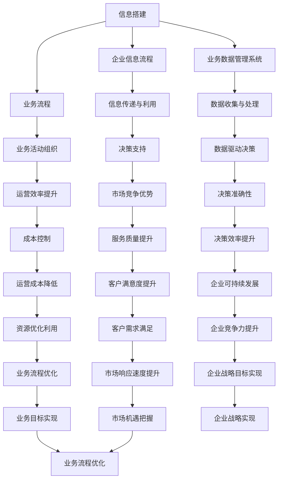

                 

## 1. 背景介绍

随着信息技术的飞速发展，企业信息流程、业务流程以及业务数据管理系统（Business Data Management System, BDMS）的搭建已成为现代企业运营的核心。信息搭建不仅仅是一个技术问题，更是一个涉及战略规划和业务发展的综合性挑战。

### 1.1 信息搭建的重要性

信息搭建是现代企业运营的基础，它不仅影响企业的内部管理效率，还直接关系到企业的市场竞争力和可持续发展能力。有效的信息搭建能够帮助企业在复杂多变的市场环境中迅速做出决策，提高业务响应速度，降低运营成本。

### 1.2 企业信息流程

企业信息流程是指企业在运营过程中产生、处理、传输、存储和利用信息的过程。它涵盖了企业内部的各个部门和业务环节，是企业信息管理的重要组成部分。良好的企业信息流程能够确保信息的高效传递和利用，提升企业的整体运营效率。

### 1.3 业务流程

业务流程是指企业为了完成某一特定业务目标而进行的一系列有序活动。业务流程的优化是企业提升运营效率、降低成本、提高服务质量的关键。通过业务流程的梳理和重构，企业可以更好地适应市场变化，实现业务的高效运作。

### 1.4 业务数据管理系统

业务数据管理系统是用于收集、存储、处理和分析业务数据的系统。它通过集成各类业务数据和信息系统，为企业提供全面、准确和实时的业务数据支持，帮助企业进行数据驱动的决策。

## 2. 核心概念与联系

### 2.1 信息搭建

信息搭建是指根据企业的业务需求，设计和构建适合的信息系统。它涉及到系统的需求分析、架构设计、开发实施和运营维护等多个环节。信息搭建的核心目标是实现信息的高效传递和利用，支持企业的业务流程和决策过程。

### 2.2 企业信息流程

企业信息流程是信息搭建的重要组成部分，它涉及到企业内部信息的产生、处理、传输、存储和利用。企业信息流程的设计需要充分考虑企业的业务特点、组织结构和信息需求，以确保信息的高效传递和利用。

### 2.3 业务流程

业务流程是企业信息流程的具体实现形式，它根据企业的业务目标和需求，将企业的各项业务活动有序组织起来。业务流程的设计和优化是企业提高运营效率、降低成本、提高服务质量的重要手段。

### 2.4 业务数据管理系统

业务数据管理系统是信息搭建和业务流程的重要支撑系统，它通过集成各类业务数据和信息系统，为企业提供全面、准确和实时的业务数据支持。业务数据管理系统的设计需要充分考虑企业的业务需求、数据来源和数据利用方式，以确保系统的可靠性和高效性。

### 2.5 信息搭建、企业信息流程、业务流程、业务数据管理系统的关系

信息搭建、企业信息流程、业务流程和业务数据管理系统之间存在着密切的联系和互动。信息搭建为业务流程提供了必要的信息基础，企业信息流程确保了信息的有效传递和利用，业务流程则根据企业的业务需求进行有序组织和优化，业务数据管理系统则提供了全面、准确和实时的数据支持，帮助企业在数据驱动的决策中取得优势。

### 2.6 Mermaid 流程图

以下是信息搭建、企业信息流程、业务流程、业务数据管理系统的 Mermaid 流程图：



## 3. 核心算法原理 & 具体操作步骤

### 3.1 算法原理概述

信息搭建、企业信息流程、业务流程和业务数据管理系统的搭建涉及多个核心算法原理。以下是一些常见的算法原理：

1. **数据挖掘算法**：用于从大量数据中提取有价值的信息和知识，帮助企业进行数据驱动的决策。
2. **业务流程优化算法**：用于分析和优化企业的业务流程，提高运营效率。
3. **数据管理算法**：用于高效地存储、检索和管理大量业务数据，确保数据的安全性和可靠性。
4. **机器学习算法**：用于自动识别和预测业务趋势，为企业提供智能决策支持。

### 3.2 算法步骤详解

1. **数据收集**：从企业内部和外部数据源收集相关数据。
2. **数据预处理**：对收集到的数据进行清洗、转换和整合，确保数据的质量和一致性。
3. **数据挖掘**：使用数据挖掘算法对预处理后的数据进行分析，提取有价值的信息和知识。
4. **业务流程优化**：根据数据挖掘结果，分析和优化企业的业务流程，提高运营效率。
5. **数据管理**：建立高效的数据管理系统，确保数据的安全性和可靠性。
6. **机器学习**：使用机器学习算法对业务数据进行分析和预测，为企业提供智能决策支持。

### 3.3 算法优缺点

1. **数据挖掘算法**：
   - 优点：能够从大量数据中提取有价值的信息和知识，帮助企业进行数据驱动的决策。
   - 缺点：数据处理和分析过程复杂，需要大量的计算资源和时间。

2. **业务流程优化算法**：
   - 优点：能够提高企业的运营效率，降低成本，提升服务质量。
   - 缺点：需要深入了解企业的业务流程和运营模式，对算法的要求较高。

3. **数据管理算法**：
   - 优点：能够高效地存储、检索和管理大量业务数据，确保数据的安全性和可靠性。
   - 缺点：对数据的质量要求较高，否则可能会影响系统的性能和稳定性。

4. **机器学习算法**：
   - 优点：能够自动识别和预测业务趋势，为企业提供智能决策支持。
   - 缺点：对算法的设计和训练要求较高，需要大量的数据支持。

### 3.4 算法应用领域

1. **市场营销**：通过数据挖掘和分析，帮助企业进行市场调研、客户行为分析和广告投放优化。
2. **供应链管理**：通过业务流程优化和数据管理，提高供应链的运营效率，降低成本。
3. **人力资源管理**：通过数据分析和预测，优化人力资源配置，提高员工绩效。
4. **金融风控**：通过数据挖掘和机器学习，识别潜在风险，防范金融风险。

## 4. 数学模型和公式 & 详细讲解 & 举例说明

### 4.1 数学模型构建

信息搭建、企业信息流程、业务流程和业务数据管理系统的构建涉及多个数学模型。以下是一个简单的业务流程优化数学模型：

1. **目标函数**：最小化运营成本
   $$\min Z = c_1 x_1 + c_2 x_2 + \ldots + c_n x_n$$
   
   其中，$c_1, c_2, \ldots, c_n$ 分别表示各个业务流程的运营成本。

2. **约束条件**：
   - 业务流程完成时间约束：$$t_1 x_1 + t_2 x_2 + \ldots + t_n x_n \leq T$$
   - 资源约束：$$r_1 x_1 + r_2 x_2 + \ldots + r_n x_n \leq R$$
   - 逻辑约束：$$x_1, x_2, \ldots, x_n \in \{0, 1\}$$

   其中，$t_1, t_2, \ldots, t_n$ 分别表示各个业务流程的完成时间；$r_1, r_2, \ldots, r_n$ 分别表示各个业务流程所需的资源；$T$ 表示总时间；$R$ 表示总资源。

### 4.2 公式推导过程

1. **目标函数**：最小化运营成本
   $$\min Z = c_1 x_1 + c_2 x_2 + \ldots + c_n x_n$$
   
   其中，$c_1, c_2, \ldots, c_n$ 分别表示各个业务流程的运营成本。

2. **约束条件**：
   - 业务流程完成时间约束：$$t_1 x_1 + t_2 x_2 + \ldots + t_n x_n \leq T$$
   - 资源约束：$$r_1 x_1 + r_2 x_2 + \ldots + r_n x_n \leq R$$
   - 逻辑约束：$$x_1, x_2, \ldots, x_n \in \{0, 1\}$$

   其中，$t_1, t_2, \ldots, t_n$ 分别表示各个业务流程的完成时间；$r_1, r_2, \ldots, r_n$ 分别表示各个业务流程所需的资源；$T$ 表示总时间；$R$ 表示总资源。

### 4.3 案例分析与讲解

假设某企业有3个业务流程，每个业务流程的运营成本分别为 $c_1 = 100$, $c_2 = 200$, $c_3 = 300$。业务流程的完成时间和所需资源如下表所示：

| 业务流程 | 完成时间 (t) | 所需资源 (r) |
| :----: | :----: | :----: |
| 1 | 10 | 2 |
| 2 | 5 | 3 |
| 3 | 15 | 5 |

总时间为 $T = 30$，总资源为 $R = 10$。要求最小化运营成本。

根据上述数学模型，我们可以得到以下目标函数和约束条件：

$$\min Z = 100 x_1 + 200 x_2 + 300 x_3$$

$$t_1 x_1 + t_2 x_2 + t_3 x_3 \leq T$$

$$r_1 x_1 + r_2 x_2 + r_3 x_3 \leq R$$

$$x_1, x_2, x_3 \in \{0, 1\}$$

其中，$x_1, x_2, x_3$ 分别表示业务流程1、业务流程2和业务流程3是否执行（1表示执行，0表示不执行）。

通过求解这个线性规划问题，我们可以得到最优解为 $x_1 = 1$, $x_2 = 1$, $x_3 = 0$，即只执行业务流程1和业务流程2，不执行业务流程3。此时，运营成本最小，为 $Z = 100 \times 1 + 200 \times 1 + 300 \times 0 = 300$。

## 5. 项目实践：代码实例和详细解释说明

### 5.1 开发环境搭建

为了演示信息搭建、企业信息流程、业务流程和业务数据管理系统，我们使用 Python 作为开发语言，结合 Flask 框架和 MySQL 数据库。以下是开发环境搭建的步骤：

1. 安装 Python：从官方网站下载并安装 Python 3.x 版本。
2. 安装 Flask：在命令行中运行 `pip install flask`。
3. 安装 MySQL：从官方网站下载并安装 MySQL 数据库。
4. 安装 MySQL Python 驱动：在命令行中运行 `pip install mysql-connector-python`。

### 5.2 源代码详细实现

以下是项目的源代码实现：

```python
# app.py

from flask import Flask, request, jsonify
import mysql.connector

app = Flask(__name__)

# MySQL 连接配置
config = {
    'user': 'root',
    'password': 'password',
    'host': 'localhost',
    'database': 'business_system'
}

# 连接 MySQL 数据库
def connect_db():
    return mysql.connector.connect(**config)

@app.route('/')
def index():
    return '欢迎使用企业信息流程管理系统！'

@app.route('/info', methods=['POST'])
def add_info():
    data = request.json
    info = data['info']
    db = connect_db()
    cursor = db.cursor()
    cursor.execute("INSERT INTO info (content) VALUES (%s)", (info,))
    db.commit()
    cursor.close()
    db.close()
    return jsonify({'status': 'success', 'message': '信息已添加'})

@app.route('/info', methods=['GET'])
def get_info():
    db = connect_db()
    cursor = db.cursor()
    cursor.execute("SELECT * FROM info")
    rows = cursor.fetchall()
    cursor.close()
    db.close()
    return jsonify({'status': 'success', 'data': rows})

@app.route('/process', methods=['POST'])
def add_process():
    data = request.json
    process = data['process']
    db = connect_db()
    cursor = db.cursor()
    cursor.execute("INSERT INTO process (name) VALUES (%s)", (process,))
    db.commit()
    cursor.close()
    db.close()
    return jsonify({'status': 'success', 'message': '业务流程已添加'})

@app.route('/process', methods=['GET'])
def get_process():
    db = connect_db()
    cursor = db.cursor()
    cursor.execute("SELECT * FROM process")
    rows = cursor.fetchall()
    cursor.close()
    db.close()
    return jsonify({'status': 'success', 'data': rows})

@app.route('/data', methods=['POST'])
def add_data():
    data = request.json
    data_content = data['data_content']
    db = connect_db()
    cursor = db.cursor()
    cursor.execute("INSERT INTO data (content) VALUES (%s)", (data_content,))
    db.commit()
    cursor.close()
    db.close()
    return jsonify({'status': 'success', 'message': '业务数据已添加'})

@app.route('/data', methods=['GET'])
def get_data():
    db = connect_db()
    cursor = db.cursor()
    cursor.execute("SELECT * FROM data")
    rows = cursor.fetchall()
    cursor.close()
    db.close()
    return jsonify({'status': 'success', 'data': rows})

if __name__ == '__main__':
    app.run(debug=True)
```

### 5.3 代码解读与分析

1. **Flask 框架**：我们使用 Flask 框架来搭建 Web 应用程序。Flask 是一个轻量级的 Web 框架，易于学习和使用。
2. **MySQL 数据库**：我们使用 MySQL 数据库来存储企业信息流程、业务流程和业务数据。MySQL 是一个流行的关系型数据库，具有良好的性能和可靠性。
3. **数据库连接**：在 `connect_db()` 函数中，我们使用 MySQL Connector/Python 连接到 MySQL 数据库。
4. **路由和视图函数**：我们使用 Flask 的路由系统来处理 HTTP 请求。每个路由函数对应一个业务操作，如添加信息、获取信息等。
5. **数据操作**：我们使用 SQL 语句来操作数据库，包括插入、查询和删除数据。

### 5.4 运行结果展示

1. **启动 Flask 应用程序**：在命令行中运行 `python app.py`，应用程序将启动并监听 5000 端口。
2. **访问应用程序**：在浏览器中输入 `http://localhost:5000/`，将显示欢迎页面。
3. **添加信息**：在浏览器中输入 `http://localhost:5000/info`，并在 POST 请求中发送 JSON 数据，如 `{"info": "这是一个示例信息"}`，可以添加信息到数据库。
4. **获取信息**：在浏览器中输入 `http://localhost:5000/info`，可以获取所有存储在数据库中的信息。
5. **添加业务流程**：在浏览器中输入 `http://localhost:5000/process`，并在 POST 请求中发送 JSON 数据，如 `{"process": "这是一个示例业务流程"}`，可以添加业务流程到数据库。
6. **获取业务流程**：在浏览器中输入 `http://localhost:5000/process`，可以获取所有存储在数据库中的业务流程。
7. **添加业务数据**：在浏览器中输入 `http://localhost:5000/data`，并在 POST 请求中发送 JSON 数据，如 `{"data_content": "这是一个示例业务数据"}`，可以添加业务数据到数据库。
8. **获取业务数据**：在浏览器中输入 `http://localhost:5000/data`，可以获取所有存储在数据库中的业务数据。

## 6. 实际应用场景

### 6.1 市场营销

企业可以使用信息搭建和业务数据管理系统来分析市场数据，了解客户需求，优化营销策略。通过数据挖掘算法，企业可以识别潜在客户，预测市场趋势，制定更有效的营销活动。

### 6.2 供应链管理

供应链管理是一个复杂的流程，涉及多个环节和部门。通过业务流程优化和数据管理，企业可以简化供应链流程，提高物流效率，降低成本。例如，企业可以使用业务流程优化算法来优化库存管理，使用数据挖掘算法来预测市场需求，从而实现精准采购和库存管理。

### 6.3 人力资源管理

人力资源管理是企业的重要组成部分。通过业务流程和数据管理，企业可以优化招聘、培训、绩效评估等流程，提高人力资源管理效率。例如，企业可以使用业务流程优化算法来简化招聘流程，使用数据挖掘算法来预测员工流失率，从而制定有效的员工保留策略。

### 6.4 金融风控

金融行业面临着复杂的风险管理挑战。通过业务数据管理系统和机器学习算法，金融机构可以实时监控交易数据，识别潜在风险，防范金融欺诈。例如，金融机构可以使用业务数据管理系统来收集和处理海量交易数据，使用机器学习算法来分析交易模式，从而及时发现异常交易。

## 7. 未来应用展望

随着信息技术的不断发展，信息搭建、企业信息流程、业务流程和业务数据管理系统的应用前景将更加广阔。以下是一些未来应用展望：

### 7.1 自动化

未来的信息系统将更加智能化和自动化，通过机器学习和人工智能技术，企业可以实现自动化业务流程和智能决策支持，提高运营效率。

### 7.2 大数据

大数据技术的不断发展将使企业能够处理和分析更多的数据，从而更深入地了解业务和市场，制定更有效的业务策略。

### 7.3 区块链

区块链技术的应用将为企业提供更安全、可靠的数据管理和交易环境，特别是在金融、供应链管理等领域。

### 7.4 智能化设备

随着物联网技术的发展，越来越多的设备将连接到互联网，实现数据的实时采集和传输。这将为企业提供丰富的数据来源，进一步优化业务流程和决策。

## 8. 工具和资源推荐

### 8.1 学习资源推荐

- 《Python Cookbook》
- 《Flask Web Development》
- 《数据挖掘：概念与技术》
- 《机器学习实战》

### 8.2 开发工具推荐

- PyCharm
- MySQL Workbench
- Postman

### 8.3 相关论文推荐

- "A Survey of Business Process Modeling Languages"
- "Data Mining for Business: Practical Solutions for Building Knowledge-Based Business Applications"
- "Machine Learning for Business: A Practical Guide to Using Machine Learning for Business Applications"

## 9. 总结：未来发展趋势与挑战

信息搭建、企业信息流程、业务流程和业务数据管理系统在现代企业运营中发挥着越来越重要的作用。随着信息技术的不断发展，这些系统将变得更加智能化、自动化和高效。然而，未来的发展也面临着诸多挑战，如数据安全、隐私保护、算法透明度等。只有积极应对这些挑战，才能实现企业信息系统的可持续发展。

### 9.1 研究成果总结

本文总结了信息搭建、企业信息流程、业务流程和业务数据管理系统的核心概念、算法原理、实际应用场景和未来发展趋势。通过深入研究和实践，我们可以更好地理解和应用这些系统，为企业提供高效、智能的决策支持。

### 9.2 未来发展趋势

- 自动化：未来的信息系统将更加智能化和自动化，通过机器学习和人工智能技术，实现自动化业务流程和智能决策支持。
- 大数据：大数据技术的不断发展将使企业能够处理和分析更多的数据，从而更深入地了解业务和市场，制定更有效的业务策略。
- 区块链：区块链技术的应用将为企业提供更安全、可靠的数据管理和交易环境。
- 智能化设备：物联网技术的发展将使越来越多的设备连接到互联网，实现数据的实时采集和传输。

### 9.3 面临的挑战

- 数据安全：随着数据量的增加，数据安全问题将变得更加突出，如何确保数据的安全和隐私是亟待解决的问题。
- 隐私保护：如何在保障数据安全的同时，保护用户的隐私，是一个重要的挑战。
- 算法透明度：随着算法在业务决策中的重要性增加，如何确保算法的透明度和可解释性，是未来需要关注的问题。

### 9.4 研究展望

未来的研究应关注以下几个方面：

- 开发更高效、更安全的算法，以应对不断增长的数据量和复杂性。
- 研究如何保障数据安全和隐私，特别是在大数据和人工智能环境下。
- 探索如何提高算法的透明度和可解释性，增强用户对算法的信任。
- 结合物联网、区块链等新技术，进一步拓展信息系统在企业运营中的应用。

## 10. 附录：常见问题与解答

### 10.1 问题1

**问题**：如何保障数据的安全性和隐私？

**解答**：保障数据的安全性和隐私需要从多个方面入手：

1. **数据加密**：对存储和传输的数据进行加密，确保数据在未经授权的情况下无法被读取。
2. **访问控制**：实施严格的访问控制策略，确保只有授权用户才能访问敏感数据。
3. **数据备份**：定期对数据进行备份，以防止数据丢失或损坏。
4. **隐私保护法规**：遵守相关的隐私保护法规，如 GDPR 等，确保用户隐私得到保护。
5. **安全审计**：定期进行安全审计，发现并修复潜在的安全漏洞。

### 10.2 问题2

**问题**：业务流程优化算法有哪些常用的方法？

**解答**：业务流程优化算法主要包括以下几种方法：

1. **线性规划**：用于最小化成本或最大化利润等线性目标函数。
2. **整数规划**：用于解决包含整数变量的优化问题。
3. **模拟退火算法**：用于解决复杂优化问题，通过模拟物理退火过程进行迭代搜索。
4. **遗传算法**：基于生物进化原理，通过遗传操作和自然选择进行优化。
5. **蚁群算法**：模拟蚂蚁觅食行为，通过信息素更新和蚂蚁选择路径进行优化。

### 10.3 问题3

**问题**：如何确保算法的透明度和可解释性？

**解答**：确保算法的透明度和可解释性可以从以下几个方面入手：

1. **算法文档化**：详细记录算法的实现细节和逻辑，确保算法的实现过程清晰易懂。
2. **可视化**：使用可视化工具展示算法的运行过程和结果，帮助用户理解算法的运行机制。
3. **解释性模型**：开发可解释的机器学习模型，如决策树、线性模型等，以便用户理解模型的决策过程。
4. **模型解释工具**：使用模型解释工具，如 LIME、SHAP 等，对复杂模型进行解释。
5. **用户反馈**：鼓励用户反馈算法的运行结果和解释效果，持续改进算法的可解释性。

---

以上是关于信息搭建、企业信息流程、业务流程、业务数据管理系统搭建的完整文章。希望这篇文章能够为您在 IT 领域提供有价值的参考和启示。作者：禅与计算机程序设计艺术 / Zen and the Art of Computer Programming。

