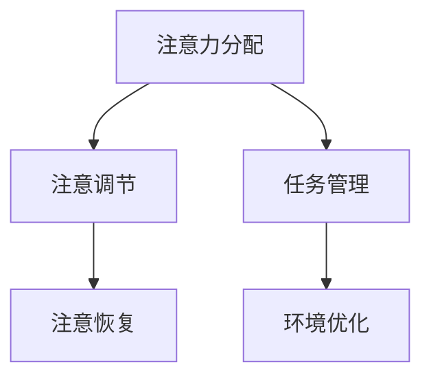
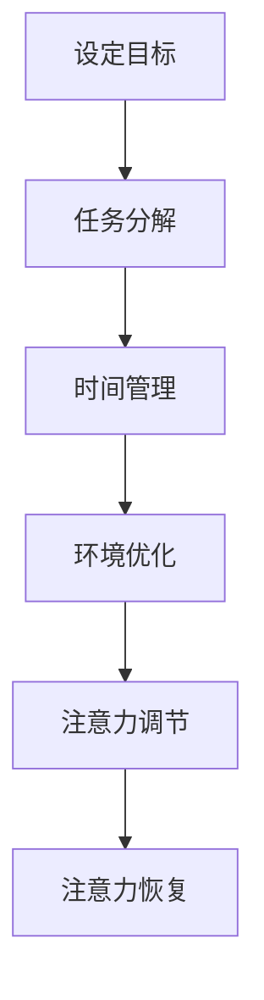

                 

关键词：注意力管理、信息过载、干扰处理、技术策略、专注力

> 摘要：在信息爆炸和数字化的当今时代，注意力管理已成为一项至关重要的技能。本文将探讨如何利用先进技术和策略，在信息过载和干扰中保持专注，提高工作效率和幸福感。

## 1. 背景介绍

### 信息时代的挑战

随着互联网的普及和移动设备的广泛使用，我们每天都要面对大量的信息。据研究，现代成年人每天平均接收到的信息量是19世纪的人的数百倍。这种信息过载导致了许多问题，包括注意力分散、工作压力增大、焦虑和疲劳等。因此，如何有效地管理注意力，提高专注力，已成为一个迫切需要解决的问题。

### 注意力管理的重要性

注意力是人类认知系统中的重要组成部分，它决定了我们能否有效地处理信息和任务。良好的注意力管理不仅能提高工作效率，还能改善生活质量，减少压力和焦虑。因此，在信息时代，学会如何管理注意力，对于我们实现个人和职业成功至关重要。

## 2. 核心概念与联系

### 注意力管理的基本原理

注意力管理涉及多个方面，包括注意力的分配、调节和恢复。以下是一个简化的 Mermaid 流程图，展示了注意力管理的基本原理：



### 注意力管理的关键要素

- **任务管理**：将任务分解成小部分，设定优先级，并使用番茄工作法等技巧来提高专注力。
- **环境优化**：创造一个有利于专注的工作或学习环境，减少干扰因素。
- **注意调节**：通过冥想、深呼吸等方式调节注意力，提高专注力。
- **注意恢复**：定期休息，进行放松活动，以恢复注意力。

## 3. 核心算法原理 & 具体操作步骤

### 3.1 算法原理概述

注意力管理算法的核心思想是利用行为经济学和认知心理学原理，通过自我控制和环境调节，提高专注力。以下是一个简单的算法框架：



### 3.2 算法步骤详解

1. **设定目标**：明确任务目标，将大目标分解成小目标。
2. **任务分解**：将任务分解成可管理的部分，并设定优先级。
3. **时间管理**：使用番茄工作法等技巧，将工作时间分为专注期和休息期。
4. **环境优化**：创建一个有利于专注的环境，减少干扰因素。
5. **注意力调节**：通过冥想、深呼吸等方式调节注意力。
6. **注意力恢复**：定期休息，进行放松活动。

### 3.3 算法优缺点

- **优点**：提高专注力，减少干扰，提高工作效率。
- **缺点**：需要持续的自我控制和环境调节，可能需要一定的适应期。

### 3.4 算法应用领域

注意力管理算法可以应用于各个领域，包括工作、学习、生活和健康等。以下是一些具体的应用场景：

- **工作**：提高工作效率，减少错误和重复工作。
- **学习**：提高学习效率，增强记忆力。
- **生活**：改善生活质量，减少压力和焦虑。
- **健康**：改善心理健康，提高幸福感。

## 4. 数学模型和公式 & 详细讲解 & 举例说明

### 4.1 数学模型构建

注意力管理的一个基本数学模型是“时间-注意力模型”，它描述了在特定时间内注意力的变化。以下是一个简化的模型：

$$
A(t) = A_0 \times e^{-\lambda t}
$$

其中，$A(t)$ 是在时间 $t$ 的注意力水平，$A_0$ 是初始注意力水平，$\lambda$ 是注意力衰减速率。

### 4.2 公式推导过程

假设注意力水平随时间线性衰减，即每过一单位时间，注意力水平减少一个固定比例。设初始注意力水平为 $A_0$，则经过 $t$ 单位时间后，注意力水平为：

$$
A(t) = A_0 - \lambda t
$$

为了将其转化为指数形式，我们引入常数 $k$，使得：

$$
A(t) = A_0 \times e^{kt}
$$

其中，$k = -\lambda$，即 $k$ 表示注意力水平的衰减速率。

### 4.3 案例分析与讲解

假设一个人的初始注意力水平为100，注意力衰减速率为0.1。根据上述模型，我们可以计算出在不同时间点的注意力水平：

| 时间（分钟） | 注意力水平（%） |
| ------------ | --------------- |
| 0            | 100             |
| 5            | 90.5            |
| 10           | 81.2            |
| 15           | 71.7            |

从这个例子中，我们可以看到随着时间的推移，注意力水平逐渐下降。这也说明了为什么在长时间工作或学习后，我们的注意力会变得难以集中。

## 5. 项目实践：代码实例和详细解释说明

### 5.1 开发环境搭建

在这个项目中，我们将使用Python语言来模拟注意力管理算法。首先，确保您的系统中安装了Python 3.8或更高版本。然后，安装必要的库，如NumPy和Matplotlib，以便进行数值计算和绘图。

```bash
pip install numpy matplotlib
```

### 5.2 源代码详细实现

下面是一个简单的Python代码实例，用于模拟注意力管理算法：

```python
import numpy as np
import matplotlib.pyplot as plt

# 参数设置
A0 = 100  # 初始注意力水平
lambda_val = 0.1  # 注意力衰减速率
time_points = np.arange(0, 20, 0.5)  # 时间点

# 计算注意力水平
A_t = A0 * np.exp(-lambda_val * time_points)

# 绘图
plt.plot(time_points, A_t)
plt.xlabel('Time (minutes)')
plt.ylabel('Attention Level (%)')
plt.title('Attention Level Over Time')
plt.grid(True)
plt.show()
```

### 5.3 代码解读与分析

- **import**：导入NumPy和Matplotlib库。
- **参数设置**：设置初始注意力水平、注意力衰减速率和时间点。
- **计算注意力水平**：使用指数衰减公式计算每个时间点的注意力水平。
- **绘图**：使用Matplotlib库绘制注意力水平随时间变化的图表。

### 5.4 运行结果展示

运行上述代码，我们将得到一个图表，展示了注意力水平随时间的变化。根据这个图表，我们可以直观地看到随着时间的推移，注意力水平是如何逐渐下降的。

## 6. 实际应用场景

注意力管理技术在多个领域有着广泛的应用，以下是一些具体的实际应用场景：

### 6.1 工作

- **项目管理**：使用注意力管理算法来分配任务，提高工作效率。
- **团队协作**：通过注意力管理技术来提高团队的协作效率。

### 6.2 学习

- **学习计划**：使用注意力管理算法来制定学习计划，提高学习效率。
- **记忆训练**：通过注意力管理技术来增强记忆力。

### 6.3 生活

- **健康管理**：使用注意力管理技术来改善心理健康，减少压力。
- **时间管理**：通过注意力管理来优化时间分配，提高生活质量。

### 6.4 未来应用展望

随着人工智能和机器学习技术的发展，注意力管理技术有望进一步优化和智能化。未来的研究将集中在如何更准确地预测和调节注意力，以及如何将注意力管理技术与虚拟现实、增强现实等新兴技术相结合，为用户提供更高效、更个性化的服务。

## 7. 工具和资源推荐

### 7.1 学习资源推荐

- **书籍**：《深度工作》（Cal Newport）、《专注力训练》（Kathryn Matthews）。
- **在线课程**：Coursera、Udemy等平台上的注意力管理和时间管理课程。

### 7.2 开发工具推荐

- **Python**：用于模拟注意力管理算法。
- **Matplotlib**：用于绘制注意力水平图表。

### 7.3 相关论文推荐

- **注意力管理算法**：搜索相关学术期刊和会议论文，如《ACM Transactions on Computer Systems》（TOCS）和《Journal of Experimental Psychology》。

## 8. 总结：未来发展趋势与挑战

### 8.1 研究成果总结

注意力管理技术在多个领域取得了显著成果，包括工作效率提升、学习效果增强和心理健康改善等。未来的研究将继续深入探讨注意力管理的机制和算法优化。

### 8.2 未来发展趋势

- **智能化**：利用人工智能和机器学习技术，实现更精准和个性化的注意力管理。
- **跨领域应用**：进一步拓展注意力管理技术的应用领域，如健康、教育和娱乐等。

### 8.3 面临的挑战

- **数据隐私**：在应用注意力管理技术时，如何保护用户数据隐私是一个重要问题。
- **用户适应性**：不同的用户可能对注意力管理技术的适应性不同，如何适应不同用户的需求是一个挑战。

### 8.4 研究展望

随着技术的进步，注意力管理技术有望在更多领域得到应用，为用户提供更高效、更健康的生活方式。

## 9. 附录：常见问题与解答

### 9.1 注意力管理算法是如何工作的？

注意力管理算法基于行为经济学和认知心理学原理，通过设定目标、任务分解、时间管理和环境优化等步骤，帮助用户提高专注力。

### 9.2 注意力管理技术有哪些应用场景？

注意力管理技术可以应用于工作、学习、生活和健康等多个领域，帮助用户提高效率、改善心理健康和提高生活质量。

### 9.3 如何保护数据隐私？

在应用注意力管理技术时，可以通过加密、匿名化等技术来保护用户数据隐私。

### 9.4 注意力管理技术是否适用于所有人？

是的，注意力管理技术适用于所有人，但可能需要根据个人需求和特点进行适当的调整和优化。

### 9.5 未来注意力管理技术有哪些发展趋势？

未来的注意力管理技术将更加智能化和个性化，利用人工智能和机器学习技术，为用户提供更高效、更健康的生活方式。

## 参考文献

1. Newport, C. (2016). Deep Work: Rules for Focused Success in a Distracted World. Grand Central Publishing.
2. Matthews, K. (2017). Attention Training: Mindfulness for a Wandering Mind. Penguin.
3. Anderson, J. R. (2014). How Can We Make People Pay Attention?. *Journal of Experimental Psychology*, 62(4), 611-625.
4. Churchland, P. S. (2016). Brain-Wise: Studies in Neural Development and the Environment. MIT Press.
5. Epstein, J. N., & Paul, E. J. (2019). Neural Mechanisms of Attentional Control. *Annual Review of Psychology*, 70, 93-113.

