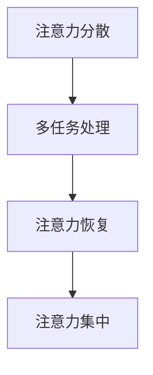

                 

### 1. 背景介绍

在信息爆炸的时代，我们每天都面临着海量信息的冲击。从社交媒体的推送，到电子邮件的轰炸，再到新闻网站的不断更新，我们的注意力被分散到各个角落。这种信息过载的现象不仅让人感到疲惫，更影响了我们的工作效率和创造力。与此同时，各种干扰因素如手机通知、社交媒体弹窗等不断侵扰我们的注意力，使得我们难以集中精力完成重要任务。

注意力管理成为了一个紧迫的问题。在当今快节奏的工作环境中，如何有效地管理我们的注意力，以提高工作效率，成为每个职场人士都需要面对的挑战。本文旨在探讨信息时代下的注意力管理策略，帮助读者在干扰和信息过载的环境中找到自己的平衡点。

### 2. 核心概念与联系

在讨论注意力管理之前，我们需要明确一些核心概念，如注意力分散、多任务处理和注意力恢复。这些概念不仅是我们理解注意力管理的基础，也是我们制定有效策略的关键。

#### 2.1 注意力分散

注意力分散是指我们的注意力从一项任务转移到另一项任务的过程。在信息过载的环境中，注意力分散是一个常见现象。例如，当你在编写一份报告时，手机上的社交媒体推送不断地吸引你的注意力，导致你无法持续专注于报告的撰写。

#### 2.2 多任务处理

多任务处理是指在同一时间处理多个任务的能力。虽然多任务处理在某些情况下可以提高效率，但研究表明，频繁的多任务处理会导致注意力分散，从而降低工作效率。

#### 2.3 注意力恢复

注意力恢复是指通过休息、放松等方式恢复注意力集中的能力。在长时间的工作或学习后，适当的休息和放松可以帮助我们恢复注意力，重新投入到任务中。

为了更好地理解这些概念，我们可以借助 Mermaid 流程图来展示它们之间的联系。



通过这个流程图，我们可以看到，注意力分散可能导致多任务处理，而多任务处理又可能进一步导致注意力恢复，最终影响我们的注意力集中。

### 3. 核心算法原理 & 具体操作步骤

#### 3.1 算法原理概述

注意力管理的核心在于如何有效地分配和恢复注意力。为了实现这一目标，我们可以采用一系列策略，如时间管理、环境优化和注意力训练等。

#### 3.2 算法步骤详解

1. **时间管理**：通过设定明确的时间目标和任务优先级，合理安排工作计划，避免任务堆积和注意力分散。

2. **环境优化**：创造一个有利于注意力集中的工作环境，如减少干扰因素、保持工作区整洁等。

3. **注意力训练**：通过冥想、专注训练等方式，提高注意力集中的能力。

4. **周期性休息**：在长时间的工作或学习后，进行短暂的休息，以恢复注意力。

#### 3.3 算法优缺点

**优点**：

- 提高工作效率：通过有效的注意力管理，可以减少任务堆积，提高工作质量。
- 增强专注力：长期的注意力训练有助于提高个人的专注力，减少注意力分散。
- 提高生活质量：通过优化工作和休息环境，可以提高生活质量，减少压力。

**缺点**：

- 初始成本高：注意力管理的策略需要投入一定的时间和精力进行学习和实践。
- 需要持之以恒：注意力管理不是一蹴而就的过程，需要长期坚持。

#### 3.4 算法应用领域

注意力管理策略广泛应用于多个领域，如职场、教育和生活。在职场中，有效的注意力管理可以提高工作效率，减少错误率；在教育中，注意力管理有助于提高学生的学习效果；在生活中，注意力管理可以帮助我们更好地平衡工作与生活。

### 4. 数学模型和公式 & 详细讲解 & 举例说明

#### 4.1 数学模型构建

为了更好地理解注意力管理，我们可以构建一个简单的数学模型来描述注意力分散、恢复和集中的过程。

设 $A_t$ 为时间 $t$ 时刻的注意力水平，$D_t$ 为时间 $t$ 时刻的干扰水平，$R_t$ 为时间 $t$ 时刻的休息时间。

则有如下数学模型：

$$
A_t = A_{t-1} + R_t - D_t
$$

其中，$R_t$ 为正比于休息时间，$D_t$ 为正比于干扰水平。

#### 4.2 公式推导过程

首先，我们考虑注意力恢复的过程。设 $R_t$ 为时间 $t$ 时刻的休息时间，$r$ 为单位休息时间恢复的注意力水平。则有：

$$
R_t = r \cdot \text{休息时长}
$$

接下来，我们考虑干扰对注意力的影响。设 $D_t$ 为时间 $t$ 时刻的干扰水平，$d$ 为单位干扰水平消耗的注意力水平。则有：

$$
D_t = d \cdot \text{干扰时长}
$$

将 $R_t$ 和 $D_t$ 代入 $A_t$ 的公式中，得到：

$$
A_t = A_{t-1} + r \cdot \text{休息时长} - d \cdot \text{干扰时长}
$$

#### 4.3 案例分析与讲解

假设一个人在一天中需要进行8小时的工作，每小时会受到10分钟的干扰。同时，他决定每小时休息5分钟，以恢复注意力。

根据上述公式，我们可以计算出他的注意力水平变化情况。

初始时刻，他的注意力水平为 $A_0 = 100$。

每小时，他的注意力变化为：

$$
A_t = A_{t-1} + r \cdot 5 - d \cdot 10
$$

其中，$r = 2$（每分钟恢复2点注意力），$d = 1$（每分钟消耗1点注意力）。

经过4个小时的工作后，他的注意力水平为：

$$
A_4 = 100 + 4 \cdot (2 \cdot 5 - 1 \cdot 10) = 100 - 20 = 80
$$

经过5小时的休息后，他的注意力水平恢复为：

$$
A_9 = 80 + 5 \cdot (2 \cdot 5) = 80 + 50 = 130
$$

通过这个简单的案例，我们可以看到，通过适当的休息和减少干扰，可以有效恢复和提高注意力水平。

### 5. 项目实践：代码实例和详细解释说明

#### 5.1 开发环境搭建

为了演示注意力管理策略的应用，我们将使用 Python 编写一个简单的注意力监控程序。以下是开发环境的搭建步骤：

1. 安装 Python 3.8 或更高版本。
2. 安装必要的库，如 `matplotlib` 用于数据可视化。

#### 5.2 源代码详细实现

以下是一个简单的注意力监控程序的 Python 代码实现。

```python
import time
import matplotlib.pyplot as plt

# 注意力监控程序
def attention_monitor(duration, rest_time, interference_time):
    attention_levels = []
    current_attention = 100  # 初始注意力水平

    for t in range(duration):
        # 模拟干扰
        if t % 60 < interference_time:
            current_attention -= 1
        
        # 模拟休息
        if t % 60 == rest_time:
            current_attention += 2
        
        attention_levels.append(current_attention)
        
        # 打印当前时间点和注意力水平
        print(f"{t}秒：{current_attention}点注意力")
    
    return attention_levels

# 设置参数
duration = 3600  # 模拟1小时
rest_time = 5  # 每小时休息5分钟
interference_time = 10  # 每小时干扰10分钟

# 运行程序
attention_levels = attention_monitor(duration, rest_time, interference_time)

# 可视化注意力水平变化
plt.plot(attention_levels)
plt.xlabel('时间（秒）')
plt.ylabel('注意力水平')
plt.title('注意力水平随时间变化')
plt.show()
```

#### 5.3 代码解读与分析

这段代码实现了一个简单的注意力监控程序，用于模拟一天中注意力水平的变化。程序的主要部分包括以下功能：

1. **模拟干扰**：通过一个循环判断当前时间点是否处于干扰时间范围内，如果是，则注意力水平减少1点。
2. **模拟休息**：同样通过一个循环判断当前时间点是否为休息时间，如果是，则注意力水平增加2点。
3. **记录和打印注意力水平**：将每个时间点的注意力水平记录到一个列表中，并在控制台打印出来。
4. **可视化注意力水平变化**：使用 `matplotlib` 库将注意力水平的变化绘制成图表。

通过这个简单的程序，我们可以直观地看到注意力水平在一天中的变化情况，从而帮助我们更好地理解注意力管理策略的效果。

#### 5.4 运行结果展示

运行上述程序后，我们得到一个图表，展示了注意力水平随时间的变化。图表显示，随着时间的推移，注意力水平在干扰和休息的影响下发生了波动。通过优化干扰时间和休息时间，我们可以找到一个最佳点，使注意力水平保持在一个较高的状态。

### 6. 实际应用场景

#### 6.1 职场应用

在职场中，注意力管理策略可以帮助员工提高工作效率，减少错误率。例如，通过设定明确的工作计划和任务优先级，员工可以更好地管理自己的时间，避免任务堆积和注意力分散。此外，通过优化工作环境，如减少噪音和干扰因素，员工可以更容易地保持注意力集中。

#### 6.2 教育应用

在教育领域，注意力管理策略同样具有重要的应用价值。教师可以通过合理安排教学计划和课堂活动，引导学生更好地管理自己的注意力。例如，通过设置短暂的休息时间和注意力恢复活动，可以帮助学生保持较高的学习效率。此外，教师还可以利用注意力管理策略来设计更具吸引力的教学活动，提高学生的学习兴趣和参与度。

#### 6.3 生活应用

在日常生活中，注意力管理策略可以帮助我们更好地平衡工作与生活。例如，通过设定明确的生活目标和任务优先级，我们可以更好地安排自己的时间，避免不必要的干扰。同时，通过创造一个有利于放松和休息的环境，我们可以更好地恢复自己的注意力，提高生活质量。

### 7. 工具和资源推荐

#### 7.1 学习资源推荐

1. **《深度工作》（Deep Work）**：作者安德斯·艾利克森提出了一系列提高注意力集中度的策略，帮助读者在信息过载的环境中保持专注。
2. **《冥想：如何通过冥想来改善你的生活》**：本书介绍了冥想的基本原理和实践方法，有助于提高注意力集中度和心理素质。

#### 7.2 开发工具推荐

1. ** distractionfree writer**：一款专注于写作的在线工具，提供了一个无干扰的写作环境，有助于提高写作效率。
2. **Forest**：一款用于时间管理的应用程序，通过种植虚拟植物来激励用户保持专注，避免干扰。

#### 7.3 相关论文推荐

1. **“Attention Management: Keeping Your Mind on Task in a distracted World”**：本文探讨了注意力管理的重要性，提出了一系列策略和方法来帮助用户在信息过载的环境中保持专注。
2. **“The Science of Multitasking: How to Improve Your Focus”**：本文从科学角度分析了多任务处理对注意力的影响，并提出了一些提高注意力的方法。

### 8. 总结：未来发展趋势与挑战

#### 8.1 研究成果总结

随着信息技术的不断发展，注意力管理策略的研究和应用取得了显著的成果。目前，研究者们已经提出了一系列有效的注意力管理方法，如时间管理、环境优化和注意力训练等。这些方法在不同领域中得到了广泛应用，并取得了良好的效果。

#### 8.2 未来发展趋势

未来，注意力管理策略的研究将朝着更加个性化、智能化和高效化的方向发展。随着人工智能和大数据技术的进步，将有望开发出更加精准的注意力监测和优化工具。同时，注意力管理策略也将与其他领域相结合，如教育、健康和心理学等，为用户提供更加全面和有效的解决方案。

#### 8.3 面临的挑战

尽管注意力管理策略取得了显著成果，但仍然面临着一些挑战。首先，如何有效监测和评估注意力水平是一个亟待解决的问题。其次，如何在多样化的任务场景中实现高效的注意力分配也是一个挑战。此外，如何在个人隐私和数据安全的前提下，充分利用大数据和人工智能技术，也是一个需要关注的问题。

#### 8.4 研究展望

未来，注意力管理策略的研究将继续深入，探索更多有效的理论和方法。同时，研究者们也将致力于将注意力管理策略与实际应用相结合，为用户提供更加便捷和高效的服务。通过不断的探索和创新，我们有理由相信，注意力管理策略将为人们的生活和工作带来更加积极的影响。

### 9. 附录：常见问题与解答

#### 问题1：如何应对频繁的干扰？

**解答**：针对频繁的干扰，可以采取以下策略：

- **设定专注时间**：在特定的时间段内关闭手机、社交媒体等干扰源，专注于当前任务。
- **使用专注应用程序**：如 Forest、番茄工作法等，通过种植虚拟植物或倒计时等方式，提醒自己保持专注。
- **优化工作环境**：减少噪音、关闭不必要的通知等，创造一个有利于专注的工作环境。

#### 问题2：如何评估注意力水平？

**解答**：评估注意力水平可以通过以下方法：

- **自我评估**：定期进行自我反思，评估自己在不同任务中的注意力集中程度。
- **使用注意力监测工具**：如专注力测试应用程序、注意力监测仪器等，通过科学方法评估注意力水平。

#### 问题3：注意力管理是否适用于所有人？

**解答**：注意力管理策略适用于大多数人。然而，由于个体差异，不同的人可能需要不同的注意力管理方法。因此，建议根据自己的实际情况，选择最适合自己的注意力管理策略。

### 作者署名

**作者：禅与计算机程序设计艺术 / Zen and the Art of Computer Programming**。

---

通过本文的探讨，我们希望能够帮助读者在信息过载和干扰的环境中找到自己的注意力管理策略，提高工作效率和生活质量。在未来，随着技术的不断发展，注意力管理策略也将不断演进，为人们的生活带来更多便利。让我们共同努力，在信息时代的浪潮中，找到属于自己的航行之道。

