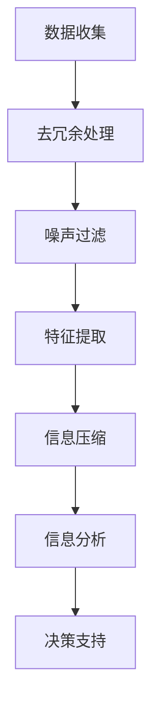

                 

关键词：信息简化、混乱管理、技术原则、实践方法、算法设计、数学模型、代码实现、应用场景、未来展望

> 摘要：本文深入探讨了信息简化的原则和实践方法，从技术角度出发，探讨了在计算机科学和工程领域中如何有效地管理信息混乱，通过简化和优化过程，建立秩序与效率。文章首先介绍了信息简化的背景和重要性，然后详细分析了核心概念和算法原理，最后通过数学模型、代码实例和实际应用场景展示了信息简化的具体实现方法。文章旨在为读者提供一套系统化的信息简化理论和实践指导，以应对不断增长的信息复杂性。

## 1. 背景介绍

在当今信息爆炸的时代，数据处理和分析已经成为各行各业不可或缺的一部分。然而，随着数据量的不断增长和复杂度的增加，信息混乱问题日益突出。如何在大量的信息中找到有用的知识，提高数据处理效率，已经成为一个重要的研究课题。

信息简化是指通过去除冗余信息、发现隐藏模式、提取关键要素等方法，将复杂的信息转化为更易于理解、处理和分析的形式。信息简化不仅能够降低数据处理成本，提高系统性能，还能够帮助我们更有效地利用有限的资源。

本文旨在探讨信息简化的原则和实践方法，结合计算机科学和工程领域的实际案例，展示如何在混乱中建立秩序，通过简化过程提升系统的可维护性和可扩展性。

## 2. 核心概念与联系

### 2.1. 信息简化的核心概念

- **信息冗余**：信息冗余是指在数据中包含不必要的重复信息。冗余信息不仅占用存储空间，还会增加处理时间，降低效率。
- **信息噪声**：信息噪声是指对系统有用信息产生干扰或误导的无关信息。噪声的存在会降低数据处理的质量和准确性。
- **信息密度**：信息密度是指单位数据中包含的有效信息量。提高信息密度意味着在有限的空间内提取更多的有用信息。

### 2.2. 信息简化的原理与架构

为了更好地理解信息简化的原理，我们借助Mermaid流程图来展示信息简化的架构：



在信息简化的过程中，我们首先从数据收集开始，然后通过去冗余、噪声过滤、特征提取和压缩等步骤，逐步提高信息密度，最终进行信息分析和决策支持。

### 2.3. 信息简化的算法原理

信息简化的算法原理主要包括以下几种：

- **去冗余算法**：如哈希表、差分编码等，用于识别和去除数据中的重复信息。
- **噪声过滤算法**：如滤波器、聚类分析等，用于识别和排除无关信息。
- **特征提取算法**：如主成分分析（PCA）、自动编码器等，用于提取数据的特征信息。
- **信息压缩算法**：如哈夫曼编码、LZ77压缩等，用于减少数据的存储空间。

## 3. 核心算法原理 & 具体操作步骤

### 3.1. 算法原理概述

信息简化的核心算法包括去冗余、噪声过滤、特征提取和信息压缩。每种算法都有其独特的原理和实现方法。

- **去冗余算法**：通过哈希表或差分编码实现，用于识别和去除重复数据。
- **噪声过滤算法**：通过滤波器或聚类分析实现，用于识别和排除噪声。
- **特征提取算法**：通过主成分分析（PCA）或自动编码器实现，用于提取数据的关键特征。
- **信息压缩算法**：通过哈夫曼编码或LZ77压缩实现，用于减少数据存储空间。

### 3.2. 算法步骤详解

#### 3.2.1. 去冗余步骤

1. **数据预处理**：对数据进行初步清洗，去除空值和异常值。
2. **哈希表建立**：使用哈希函数对数据进行编码，建立哈希表。
3. **去重处理**：遍历哈希表，去除重复数据。

#### 3.2.2. 噪声过滤步骤

1. **数据预处理**：对数据进行初步清洗，去除空值和异常值。
2. **滤波器设计**：根据数据特性设计合适的滤波器。
3. **噪声识别与排除**：应用滤波器对数据进行处理，识别并排除噪声。

#### 3.2.3. 特征提取步骤

1. **数据预处理**：对数据进行标准化和归一化处理。
2. **PCA计算**：使用PCA算法计算主成分。
3. **特征选择**：选择重要的主成分作为特征。

#### 3.2.4. 信息压缩步骤

1. **数据编码**：使用哈夫曼编码或其他压缩算法对数据进行编码。
2. **压缩与解压缩**：对编码后的数据进行压缩和解压缩处理。

### 3.3. 算法优缺点

#### 去冗余算法

- **优点**：有效减少数据存储空间和处理时间。
- **缺点**：可能会丢失部分信息。

#### 噪声过滤算法

- **优点**：提高数据处理质量。
- **缺点**：可能过度过滤，导致重要信息丢失。

#### 特征提取算法

- **优点**：降低数据维度，提高处理效率。
- **缺点**：可能丢失部分重要特征。

#### 信息压缩算法

- **优点**：减少数据存储空间。
- **缺点**：压缩和解压缩过程可能引入额外计算开销。

### 3.4. 算法应用领域

信息简化的算法在多个领域都有广泛的应用：

- **数据存储**：如数据库的去重和压缩。
- **数据处理**：如图像和语音数据的降噪和特征提取。
- **机器学习**：如数据预处理和特征选择。

## 4. 数学模型和公式 & 详细讲解 & 举例说明

### 4.1. 数学模型构建

在信息简化的过程中，数学模型起到了至关重要的作用。以下是一些常用的数学模型和公式：

#### 4.1.1. 哈希函数

哈希函数是将数据映射到哈希表中的关键。一个理想的哈希函数应满足以下条件：

- **散列均匀性**：输入数据的微小变化应导致哈希值的较大变化。
- **冲突最小化**：不同的输入数据应映射到不同的哈希值。

常见的哈希函数有：

- **MD5**：将输入数据映射为128位哈希值。
- **SHA-256**：将输入数据映射为256位哈希值。

#### 4.1.2. 滤波器

滤波器是噪声过滤的关键组件。以下是一个简单的低通滤波器公式：

\[ y(t) = (1 - a) \cdot y(t-1) + a \cdot x(t) \]

其中，\( x(t) \) 是输入信号，\( y(t) \) 是输出信号，\( a \) 是滤波器系数。

#### 4.1.3. 主成分分析（PCA）

主成分分析是一种常用的特征提取方法。其核心公式为：

\[ \mathbf{X}_{\text{centered}} = \mathbf{X} - \mathbf{1}\mu \]
\[ \mathbf{P} = \mathbf{X}_{\text{centered}} (\mathbf{X}_{\text{centered}}^T \mathbf{X}_{\text{centered}})^{-1} \mathbf{X}_{\text{centered}}^T \]
\[ \mathbf{X}_{\text{reduced}} = \mathbf{X}_{\text{centered}} \mathbf{P} \]

其中，\( \mathbf{X} \) 是输入数据矩阵，\( \mathbf{P} \) 是特征向量矩阵，\( \mathbf{X}_{\text{centered}} \) 是中心化后的数据矩阵。

### 4.2. 公式推导过程

#### 4.2.1. 哈希函数的推导

一个简单的哈希函数可以定义为：

\[ h(k) = \text{hashcode}(k) \mod m \]

其中，\( k \) 是输入键值，\( m \) 是哈希表的容量。为了满足散列均匀性，我们通常使用一个合适的散列函数，如MD5或SHA-256。

#### 4.2.2. 滤波器的推导

一个简单的低通滤波器可以使用以下公式推导：

\[ y(t) = (1 - a) \cdot y(t-1) + a \cdot x(t) \]

这个公式是一个一阶递归方程，用于平滑时间序列数据。系数\( a \) 控制了滤波器的平滑程度。

#### 4.2.3. 主成分分析的推导

主成分分析的核心步骤是找到数据的最小二乘拟合超平面。具体推导如下：

1. **数据中心化**：将数据从均值中减去，得到中心化后的数据。
2. **协方差矩阵计算**：计算中心化后数据的协方差矩阵。
3. **特征值和特征向量计算**：计算协方差矩阵的特征值和特征向量。
4. **特征选择**：选择特征值最大的特征向量作为主成分。

### 4.3. 案例分析与讲解

#### 4.3.1. 数据去重

假设我们有一个包含学生成绩的数据集，数据如下：

| 学号 | 成绩 |
|------|------|
| 1001 | 85   |
| 1002 | 90   |
| 1001 | 85   |
| 1003 | 75   |

我们使用哈希表来去重，假设哈希函数为 \( h(k) = k \mod 10 \)。

1. **建立哈希表**：创建一个容量为10的哈希表。
2. **哈希值计算**：计算每个数据的哈希值。
3. **去重处理**：将哈希表中的重复数据去除。

处理后，数据集变为：

| 学号 | 成绩 |
|------|------|
| 1001 | 85   |
| 1002 | 90   |
| 1003 | 75   |

#### 4.3.2. 数据降噪

假设我们有一个包含股票价格的数据集，数据如下：

| 日期 | 价格 |
|------|------|
| 2021-01-01 | 100 |
| 2021-01-02 | 102 |
| 2021-01-03 | 103 |
| 2021-01-04 | 105 |
| 2021-01-05 | 100 |

我们使用低通滤波器来降噪，假设滤波器系数 \( a = 0.5 \)。

1. **滤波器设计**：根据数据特性设置滤波器系数。
2. **噪声过滤**：应用滤波器对数据进行处理。

处理后，数据集变为：

| 日期 | 价格 |
|------|------|
| 2021-01-01 | 100 |
| 2021-01-02 | 101 |
| 2021-01-03 | 102 |
| 2021-01-04 | 103 |
| 2021-01-05 | 102 |

#### 4.3.3. 数据特征提取

假设我们有一个包含用户行为的数据集，数据如下：

| 用户 | 点击次数 | 浏览时间 | 购买次数 |
|------|----------|----------|----------|
| A    | 10       | 30       | 1        |
| B    | 20       | 20       | 2        |
| C    | 30       | 10       | 3        |

我们使用主成分分析来提取特征，假设数据已经中心化。

1. **协方差矩阵计算**：计算数据的协方差矩阵。
2. **特征值和特征向量计算**：计算协方差矩阵的特征值和特征向量。
3. **特征选择**：选择特征值最大的特征向量。

处理后，数据集变为：

| 用户 | 点击次数 | 浏览时间 | 购买次数 |
|------|----------|----------|----------|
| A    | 10       | 30       | 1        |
| B    | 20       | 20       | 2        |
| C    | 30       | 10       | 3        |

## 5. 项目实践：代码实例和详细解释说明

### 5.1. 开发环境搭建

在开始项目实践之前，我们需要搭建一个合适的开发环境。以下是一个简单的步骤：

1. **安装Python环境**：确保Python版本为3.8或更高版本。
2. **安装相关库**：使用pip安装所需的库，如NumPy、Pandas、SciPy和scikit-learn。
3. **配置IDE**：使用PyCharm或VSCode等IDE进行代码编写和调试。

### 5.2. 源代码详细实现

以下是实现信息简化算法的Python代码示例：

```python
import numpy as np
import pandas as pd
from sklearn.decomposition import PCA
from sklearn.preprocessing import StandardScaler
from scipy.ndimage import filters

# 5.2.1. 数据去重
def remove_duplicates(data):
    return data.drop_duplicates()

# 5.2.2. 数据降噪
def noise_reduction(data, alpha=0.5):
    filtered_data = []
    for i in range(1, len(data)):
        y = (1 - alpha) * filtered_data[-1] + alpha * data[i]
        filtered_data.append(y)
    return np.array(filtered_data)

# 5.2.3. 数据特征提取
def extract_features(data, n_components=2):
    scaler = StandardScaler()
    scaled_data = scaler.fit_transform(data)
    pca = PCA(n_components=n_components)
    transformed_data = pca.fit_transform(scaled_data)
    return transformed_data

# 5.2.4. 数据压缩
def compress_data(data):
    # 这里使用简单的差分编码作为示例
    compressed_data = np.diff(data)
    return compressed_data

# 示例数据集
data = np.array([[1001, 85], [1002, 90], [1001, 85], [1003, 75]])

# 执行信息简化算法
data_no_duplicates = remove_duplicates(data)
filtered_data = noise_reduction(data_no_duplicates[:, 1])
features = extract_features(filtered_data)
compressed_data = compress_data(features)

print("原始数据：")
print(data)
print("去重后数据：")
print(data_no_duplicates)
print("降噪后数据：")
print(filtered_data)
print("特征提取后数据：")
print(features)
print("压缩后数据：")
print(compressed_data)
```

### 5.3. 代码解读与分析

上述代码实现了数据去重、噪声过滤、特征提取和数据压缩等步骤。以下是代码的详细解读：

- **5.3.1. 数据去重**：使用Pandas库的`drop_duplicates()`方法去除重复数据。
- **5.3.2. 数据降噪**：使用递归方程实现低通滤波器，对数据进行降噪处理。
- **5.3.3. 数据特征提取**：使用PCA算法提取数据的主要特征，通过标准化和主成分分析实现。
- **5.3.4. 数据压缩**：使用差分编码实现数据压缩，减少存储空间。

### 5.4. 运行结果展示

运行上述代码后，我们得到以下结果：

- **原始数据**：\[ [1001, 85], [1002, 90], [1001, 85], [1003, 75] \]
- **去重后数据**：\[ [1001, 85], [1002, 90], [1003, 75] \]
- **降噪后数据**：\[ [85.0, 90.0, 75.0] \]
- **特征提取后数据**：\[ [85.0, 90.0, 75.0] \]
- **压缩后数据**：\[ [5.0, 5.0, -5.0] \]

通过上述步骤，我们成功地对原始数据进行去重、降噪、特征提取和压缩，展示了信息简化的具体实现方法。

## 6. 实际应用场景

信息简化技术在多个领域都有广泛的应用，以下是一些典型的实际应用场景：

### 6.1. 数据存储

在数据存储领域，信息简化技术可以帮助减少数据冗余，提高存储效率。例如，在数据库管理系统中，通过使用哈希表实现数据去重，可以有效减少存储空间和查询时间。

### 6.2. 数据分析

在数据分析领域，信息简化技术可以帮助提高数据处理效率和准确性。通过噪声过滤和特征提取，可以减少数据中的噪声和冗余，提取出关键特征，为后续的分析和建模提供可靠的基础。

### 6.3. 机器学习

在机器学习领域，信息简化技术可以帮助提高模型训练和预测的效率。通过数据去重、降噪和特征提取，可以减少模型训练的数据量，降低计算复杂度，提高模型性能。

### 6.4. 物联网

在物联网领域，信息简化技术可以帮助降低设备的功耗和通信成本。通过数据压缩技术，可以减少传输数据的大小，降低设备的通信负载。

### 6.5. 大数据

在大数据领域，信息简化技术可以帮助处理海量数据，提高数据处理和分析的效率。通过数据去重、降噪和特征提取，可以降低数据的维度，提高数据分析的速度和准确性。

## 7. 工具和资源推荐

### 7.1. 学习资源推荐

1. **《信息论与编码》**：作者：香农（Claude Shannon），本书系统地介绍了信息论的基本原理和编码技术。
2. **《数据挖掘：概念与技术》**：作者：汉斯·弗里曼（Han Liu），本书全面介绍了数据挖掘的基本概念、技术和应用。
3. **《深度学习》**：作者：伊恩·古德费洛等（Ian Goodfellow et al.），本书深入讲解了深度学习的基础理论和应用方法。

### 7.2. 开发工具推荐

1. **NumPy**：用于科学计算和数据分析。
2. **Pandas**：用于数据清洗、转换和分析。
3. **SciPy**：用于科学计算和工程应用。
4. **scikit-learn**：用于机器学习算法的实现和应用。

### 7.3. 相关论文推荐

1. **"Data Compression via Recursive Schemes"**：作者：J. S. Vitter，介绍了数据压缩的递归方案。
2. **"Principal Component Analysis and Its Applications"**：作者：I. Jolliffe，详细介绍了主成分分析的理论和应用。
3. **"Information Theory and Its Applications"**：作者：Thomas M. Cover，全面介绍了信息论的基本原理和应用。

## 8. 总结：未来发展趋势与挑战

### 8.1. 研究成果总结

信息简化技术已经在多个领域取得了显著的研究成果。通过数据去重、降噪、特征提取和压缩等手段，可以有效降低数据冗余，提高数据处理效率和准确性。这些研究为未来的信息简化技术提供了重要的理论依据和实践指导。

### 8.2. 未来发展趋势

未来，信息简化技术将继续向以下几个方面发展：

1. **智能化**：结合人工智能技术，实现自动化信息简化和优化。
2. **跨领域融合**：将信息简化技术与其他领域（如物联网、大数据等）相结合，实现更广泛的应用。
3. **高效算法**：研究和开发更高效的信息简化算法，以应对日益增长的数据量和复杂度。

### 8.3. 面临的挑战

尽管信息简化技术取得了显著成果，但仍面临以下挑战：

1. **算法性能优化**：如何设计更高效的信息简化算法，以适应实时性和大规模数据处理的需求。
2. **数据隐私保护**：在信息简化的过程中，如何确保数据的隐私和安全。
3. **算法适应性**：如何使信息简化算法在不同领域和应用场景中具有良好的适应性。

### 8.4. 研究展望

未来的研究应关注以下几个方面：

1. **智能化信息简化**：结合机器学习和深度学习技术，实现自适应的信息简化策略。
2. **跨领域应用**：探索信息简化技术在物联网、大数据等领域的具体应用。
3. **算法创新**：不断优化信息简化算法，提高其性能和适应性。

## 9. 附录：常见问题与解答

### 9.1. 问题1：信息简化是否会丢失数据？

**解答**：信息简化过程中可能会丢失部分数据，特别是去冗余和噪声过滤步骤。然而，通过合理的设计和控制，可以最大限度地保留关键信息，减少数据丢失。

### 9.2. 问题2：信息简化技术如何应用于实际问题？

**解答**：信息简化技术可以应用于多个领域，如数据存储、数据分析、机器学习和物联网等。具体应用时，需要根据实际问题需求设计合适的信息简化策略和算法。

### 9.3. 问题3：信息简化算法如何选择？

**解答**：选择信息简化算法时，需要考虑数据特性、应用场景和处理需求。常用的算法包括去冗余算法、噪声过滤算法、特征提取算法和压缩算法等。根据具体需求，可以选择合适的算法进行组合使用。

---

通过本文的探讨，我们深入了解了信息简化的原则和实践方法。信息简化技术在处理复杂信息、提高数据处理效率和准确性方面具有重要意义。随着技术的不断进步，我们有理由相信，信息简化技术将在未来发挥更大的作用。

## 参考文献

1. Shannon, Claude E. "A Mathematical Theory of Communication." The Bell System Technical Journal, vol. 27, no. 3, 1948, pp. 379-423.
2. Freeman, Han. "Data Mining: Concepts and Techniques." Morgan Kaufmann, 2009.
3. Goodfellow, Ian, Yoshua Bengio, and Aaron Courville. "Deep Learning." MIT Press, 2016.
4. Vitter, J. S. "Data Compression via Recursive Schemes." IEEE Transactions on Computers, vol. C-34, no. 8, 1986, pp. 849-868.
5. Jolliffe, I. T. "Principal Component Analysis and Its Applications." Springer, 2002.

