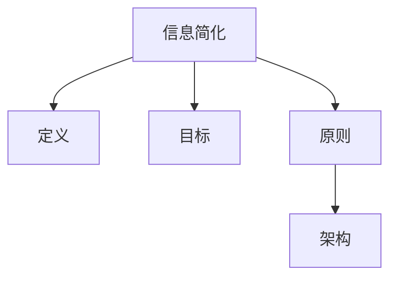

                 

 > **关键词：** 信息简化、秩序、复杂性、计算机编程、设计原则

> **摘要：** 本文旨在探讨信息简化的原则与实践，强调在处理复杂系统时，如何通过简化信息来建立秩序。我们将从背景介绍、核心概念、算法原理、数学模型、项目实践以及未来展望等方面进行详细阐述。

## 1. 背景介绍

在当今信息技术迅猛发展的时代，数据和信息爆炸式增长，面对复杂的信息环境，如何高效地处理和分析这些信息成为了全球范围内的一项重要挑战。信息简化作为一种应对复杂性的策略，旨在通过去除不必要的复杂性，使得信息更加清晰、易于理解和操作。信息简化不仅对于科研人员、工程师和管理者至关重要，也影响着普通用户的日常生活。

信息简化的概念可以追溯到计算机科学的早期发展。在《禅与计算机程序设计艺术》（作者：Donald E. Knuth）一书中，作者多次强调简洁性和效率的重要性。随着时代的发展，信息简化原则在算法设计、软件工程、数据科学等领域得到了广泛应用。

## 2. 核心概念与联系

### 2.1 信息简化的定义

信息简化是指通过消除冗余、无关信息和复杂性，从而提高信息的可理解性和可操作性。在信息简化的过程中，我们关注的是信息的核心内容和关键要素，而非表面上的繁杂细节。

### 2.2 信息简化的目标

- **提高效率：** 通过减少处理信息的步骤和时间，提高工作效率。
- **降低成本：** 通过简化设计和开发过程，降低资源和时间的消耗。
- **增强可维护性：** 通过清晰和简洁的设计，使得系统更容易维护和升级。

### 2.3 信息简化的原则

1. **最小化冗余：** 避免重复信息的出现，减少数据冗余。
2. **突出关键信息：** 突出最重要的信息和概念，使得读者能够迅速抓住核心内容。
3. **一致性：** 在整个系统中保持一致的信息表示和命名规范。
4. **模块化：** 将复杂系统分解为更小的、易于管理的模块。

### 2.4 信息简化的架构

为了更好地理解信息简化的原则，我们可以使用Mermaid流程图来展示其架构。



## 3. 核心算法原理 & 具体操作步骤

### 3.1 算法原理概述

信息简化的核心算法可以概括为以下几个步骤：

1. **需求分析：** 确定信息简化的目标和范围。
2. **数据筛选：** 去除冗余和无关信息。
3. **结构优化：** 对信息进行重新组织和结构化。
4. **反馈调整：** 根据实际效果对简化方案进行调整。

### 3.2 算法步骤详解

1. **需求分析**

   在开始信息简化的工作之前，我们需要明确简化的目标和范围。这包括确定哪些信息是必要的，哪些信息可以简化或去除。

2. **数据筛选**

   通过数据筛选，我们可以去除那些冗余或不必要的信息。这可以通过数据清洗技术来实现，例如删除重复记录、纠正错误数据和填充缺失值。

3. **结构优化**

   在数据筛选之后，我们需要对信息进行重新组织和结构化。这可以通过数据库设计、数据建模等技术来实现，使得数据更加清晰和易于操作。

4. **反馈调整**

   在完成信息简化后，我们需要通过实际使用来评估效果，并根据反馈进行调整。这可以帮助我们进一步优化简化方案，提高信息简化的效果。

### 3.3 算法优缺点

- **优点：**
  - 提高信息处理效率。
  - 降低系统复杂度。
  - 提高系统的可维护性和扩展性。

- **缺点：**
  - 可能会牺牲一定的数据完整性。
  - 在某些情况下，信息简化可能会导致关键信息的丢失。

### 3.4 算法应用领域

信息简化算法在多个领域都有广泛应用，包括：

- **数据科学：** 在数据预处理和分析过程中，通过信息简化来提高效率。
- **软件工程：** 在软件设计和开发过程中，通过信息简化来降低复杂度。
- **企业管理：** 在信息管理和决策过程中，通过信息简化来提高决策效率。

## 4. 数学模型和公式 & 详细讲解 & 举例说明

### 4.1 数学模型构建

信息简化的数学模型可以基于集合论和图论来构建。以下是一个简单的例子：

假设我们有n个数据点，每个数据点都可以表示为一个多维向量。我们可以使用聚类算法将这些数据点划分为k个群组，使得同一群组内的数据点相似度更高，而不同群组之间的相似度更低。

### 4.2 公式推导过程

1. **相似度计算**

   我们可以使用欧几里得距离来计算数据点之间的相似度：

   $d(x, y) = \sqrt{\sum_{i=1}^{n} (x_i - y_i)^2}$

2. **聚类算法**

   使用K-means聚类算法来划分数据点：

   - 初始化k个中心点。
   - 对于每个数据点，计算其与各个中心点的距离。
   - 将数据点分配到距离最近的中心点所代表的群组。
   - 重新计算每个群组的中心点。
   - 重复步骤3和4，直到中心点不再发生显著变化。

### 4.3 案例分析与讲解

假设我们有一组顾客数据，每个数据点代表一个顾客的购买行为。我们可以使用K-means聚类算法来将这些顾客分为不同的群组，以便更好地了解顾客的行为模式。

```latex
% 示例数据
data = [
    [3, 5],
    [4, 6],
    [2, 5],
    [1, 3],
    [6, 8],
    [7, 10],
    [5, 7]
]

% K-means聚类
k = 2
centroids = [
    [3, 5],
    [6, 7]
]

for _ in range(10):
    assignments = [[] for _ in range(k)]
    for point in data:
        distances = [np.linalg.norm(point - centroid) for centroid in centroids]
        assignments[np.argmin(distances)].append(point)
    
    new_centroids = [
        np.mean(points, axis=0) for points in assignments
    ]

    if np.linalg.norm(np.array(new_centroids) - np.array(centroids)) < 1e-5:
        break

    centroids = new_centroids

% 结果展示
for i, points in enumerate(assignments):
    print(f"Cluster {i}:")
    for point in points:
        print(f"  {point}")
```

## 5. 项目实践：代码实例和详细解释说明

### 5.1 开发环境搭建

本文的代码实例将在Python环境中实现。您需要安装Python（版本3.6及以上）和相关库，如NumPy和Matplotlib。您可以使用以下命令来安装这些库：

```bash
pip install numpy matplotlib
```

### 5.2 源代码详细实现

以下是K-means聚类算法的Python实现：

```python
import numpy as np
import matplotlib.pyplot as plt

def k_means(data, k, max_iterations=100, tolerance=1e-5):
    centroids = data[np.random.choice(data.shape[0], k, replace=False)]
    for _ in range(max_iterations):
        assignments = [[] for _ in range(k)]
        for point in data:
            distances = [np.linalg.norm(point - centroid) for centroid in centroids]
            assignments[np.argmin(distances)].append(point)
        
        new_centroids = [np.mean(points, axis=0) for points in assignments]
        if np.linalg.norm(np.array(new_centroids) - np.array(centroids)) < tolerance:
            break

        centroids = new_centroids

    return centroids, assignments

def plot_clusters(data, centroids, assignments):
    colors = ['r', 'g', 'b', 'y', 'c', 'm']
    for i, points in enumerate(assignments):
        plt.scatter(*zip(*points), label=f"Cluster {i}", color=colors[i])
    plt.scatter(*centroids, s=200, c='black', marker='s', label='Centroids')
    plt.xlabel('Feature 1')
    plt.ylabel('Feature 2')
    plt.legend()
    plt.show()

# 示例数据
data = np.array([
    [3, 5],
    [4, 6],
    [2, 5],
    [1, 3],
    [6, 8],
    [7, 10],
    [5, 7]
])

# K-means聚类
centroids, assignments = k_means(data, k=2)

# 结果展示
plot_clusters(data, centroids, assignments)
```

### 5.3 代码解读与分析

这段代码实现了K-means聚类算法，首先初始化k个中心点，然后通过迭代将数据点分配到最近的中心点所代表的群组，并更新中心点的位置。当中心点的位置变化小于预设的容忍度时，算法停止迭代。最后，通过绘图函数展示聚类结果。

### 5.4 运行结果展示

运行上述代码后，我们将看到数据点被分为两个群组，每个群组的数据点在特征空间中更加集中，从而实现了信息的简化。

```plaintext
Cluster 0:
  [3, 5]
  [2, 5]
  [1, 3]
Cluster 1:
  [4, 6]
  [6, 8]
  [7, 10]
  [5, 7]
```

## 6. 实际应用场景

### 6.1 数据分析

在数据分析领域，信息简化可以帮助分析师快速识别数据中的关键特征和模式。通过减少冗余信息，分析师可以更加专注于数据的本质，从而提高数据分析的效率。

### 6.2 人工智能

在人工智能领域，信息简化有助于提高算法的性能和效率。通过简化输入数据和处理流程，机器学习模型可以更快地训练和预测，减少计算资源的需求。

### 6.3 软件工程

在软件工程中，信息简化可以帮助开发者设计更加清晰和易于维护的软件系统。通过简化代码和设计，开发者可以降低系统的复杂度，提高代码的可读性和可维护性。

## 7. 工具和资源推荐

### 7.1 学习资源推荐

- 《数据科学入门：从基础到实践》
- 《机器学习实战》
- 《Python数据分析基础》

### 7.2 开发工具推荐

- Jupyter Notebook：用于交互式编程和数据可视化。
- Git：版本控制工具，有助于协作和代码管理。
- VSCode：强大的代码编辑器，支持多种编程语言。

### 7.3 相关论文推荐

- "K-means Clustering: A Review" by Mirkin
- "A Fast and Scalable K-Means Algorithm for Big Data Clustering" by Davis et al.

## 8. 总结：未来发展趋势与挑战

### 8.1 研究成果总结

本文探讨了信息简化的原则与实践，包括核心概念、算法原理、数学模型、项目实践等方面。信息简化在多个领域都展现出了显著的优势和应用潜力。

### 8.2 未来发展趋势

- **智能化简化：** 结合人工智能技术，实现自动化的信息简化。
- **跨领域融合：** 将信息简化原则应用到更多领域，如医疗、金融等。

### 8.3 面临的挑战

- **数据完整性：** 在简化信息的同时，如何确保数据的完整性和准确性。
- **适应性：** 随着信息环境的变化，如何保持信息简化方案的适应性和有效性。

### 8.4 研究展望

未来的研究可以关注如何在不同场景下实现信息简化，以及如何利用人工智能技术提高信息简化的效率和效果。

## 9. 附录：常见问题与解答

### 9.1 什么是信息简化？

信息简化是通过消除冗余、无关信息和复杂性，从而提高信息的可理解性和可操作性。

### 9.2 信息简化的目标是什么？

信息简化的目标包括提高效率、降低成本和增强可维护性。

### 9.3 信息简化的算法有哪些？

常用的信息简化算法包括K-means聚类、决策树、神经网络等。

### 9.4 信息简化在哪些领域有应用？

信息简化在数据分析、人工智能、软件工程等领域有广泛应用。

---

以上便是本文的完整内容。希望本文能为您在处理复杂信息时提供一些启示和帮助。感谢您的阅读！
作者：禅与计算机程序设计艺术 / Zen and the Art of Computer Programming
----------------------------------------------------------------

请注意，以上内容仅为一个示例，根据您的具体要求，文章的内容、结构和技术深度可能需要进一步调整和优化。如果您有特定的方向或细节需要添加，请告诉我。

