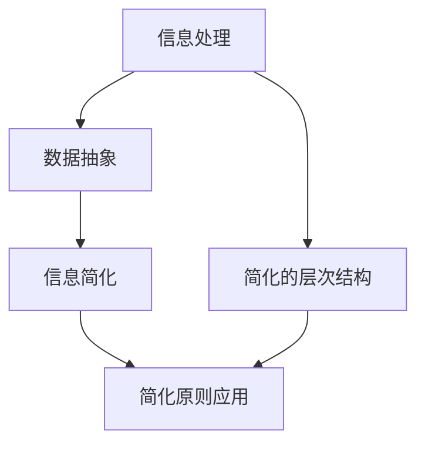

                 

摘要：本文旨在探讨信息简化的原则，阐述如何在现代科技飞速发展的背景下，应对日益复杂的信息环境。通过对核心概念、算法原理、数学模型、实际应用场景的深入剖析，以及项目实践和未来展望的探讨，本文提出了构建简化信息系统的有效策略和方法。

## 1. 背景介绍

在当今数字化时代，信息爆炸成为了常态。从社交媒体的瞬息万变，到大数据的庞大体量，我们每天都面临着大量的信息输入。然而，信息的丰富并不等同于知识的增长。过多的信息反而可能导致信息过载，使得人们难以有效吸收和处理。因此，信息简化成为了一个迫切需要解决的问题。信息简化不仅仅是减少冗余信息，更重要的是在混乱和复杂中建立秩序，使信息更加易于理解和利用。

### 1.1. 信息简化的必要性

- **信息过载**：随着互联网和移动设备的普及，人们每天接触到的信息量呈指数级增长。
- **决策困难**：过多的信息可能导致决策困难，甚至造成心理负担。
- **效率低下**：无法有效处理信息，导致工作效率下降。

### 1.2. 信息简化的目标

- **提高可理解性**：使信息更加清晰、易于理解。
- **优化决策过程**：提供关键信息，帮助快速做出有效决策。
- **提升工作效率**：简化流程，减少不必要的工作量。

## 2. 核心概念与联系

在探讨信息简化的过程中，我们需要理解几个核心概念，包括信息处理、数据抽象、以及简化的层次结构。以下是一个简单的 Mermaid 流程图，用以阐述这些概念之间的关系。



### 2.1. 信息处理

信息处理是指对信息进行收集、存储、检索、分析和呈现的过程。有效的信息处理是信息简化的基础。

### 2.2. 数据抽象

数据抽象是将复杂的数据集转化为更易于处理和理解的形式。它通过忽略不重要的细节，提取关键信息，从而简化数据。

### 2.3. 信息简化

信息简化是通过数据抽象、数据压缩和冗余消除等技术，使信息更加简洁、易于理解。

### 2.4. 简化的层次结构

简化的层次结构涉及多个层次，从数据层次到系统层次。每个层次都需要采用相应的简化策略。

### 2.5. 简化原则应用

简化原则的应用涉及从理论到实践的全过程，包括算法设计、系统架构和用户界面设计等方面。

## 3. 核心算法原理 & 具体操作步骤

### 3.1. 算法原理概述

信息简化的核心算法包括数据压缩算法、模式识别算法和自然语言处理算法。以下是一个简化的算法原理概述：

- **数据压缩算法**：通过减少数据的存储空间，简化信息的存储和处理。
- **模式识别算法**：通过识别数据中的规律和模式，简化信息的理解和分析。
- **自然语言处理算法**：通过处理自然语言文本，使信息表达更加简洁和直接。

### 3.2. 算法步骤详解

#### 3.2.1. 数据压缩算法

1. **选择压缩算法**：根据数据特性选择合适的压缩算法，如霍夫曼编码、算术编码等。
2. **数据预处理**：对数据进行预处理，如去除冗余、规范化等。
3. **压缩**：应用压缩算法对数据进行压缩。
4. **解压缩**：在需要时，对压缩数据解压缩。

#### 3.2.2. 模式识别算法

1. **特征提取**：从数据中提取关键特征。
2. **模式分类**：使用分类算法对特征进行分类。
3. **模式分析**：分析分类结果，提取有价值的信息。

#### 3.2.3. 自然语言处理算法

1. **文本预处理**：去除停用词、标点符号等。
2. **分词**：将文本分割成单词或短语。
3. **语义分析**：分析文本的语义结构，提取关键信息。
4. **文本生成**：生成简洁明了的文本输出。

### 3.3. 算法优缺点

- **数据压缩算法**：优点是减少存储空间，缺点是有时会损失信息。
- **模式识别算法**：优点是提高信息理解效率，缺点是对噪声敏感。
- **自然语言处理算法**：优点是使信息表达更简洁，缺点是处理复杂文本时效果可能不佳。

### 3.4. 算法应用领域

- **数据存储**：如数据库、云存储等。
- **数据分析**：如市场分析、风险评估等。
- **文本处理**：如搜索引擎、智能客服等。

## 4. 数学模型和公式 & 详细讲解 & 举例说明

### 4.1. 数学模型构建

信息简化的数学模型通常涉及信息论、概率论和优化理论。以下是一个简单的信息论模型：

$$
H(X) = -\sum_{i} p(x_i) \log_2 p(x_i)
$$

其中，$H(X)$表示随机变量$X$的熵，$p(x_i)$表示$X$取值$x_i$的概率。

### 4.2. 公式推导过程

熵的推导基于信息量的概念。设$X$为随机变量，其取值为$x_1, x_2, ..., x_n$，每个取值的概率为$p(x_1), p(x_2), ..., p(x_n)$。则事件$X$发生的平均信息量为：

$$
I(X) = \sum_{i} p(x_i) \log_2 \frac{1}{p(x_i)}
$$

由于概率的总和为1，即$\sum_{i} p(x_i) = 1$，我们可以对上式进行变形：

$$
I(X) = \sum_{i} p(x_i) \log_2 \frac{1}{p(x_i)} = -\sum_{i} p(x_i) \log_2 p(x_i)
$$

这即为熵的公式。

### 4.3. 案例分析与讲解

假设有一组随机数据$X$，其概率分布如下：

$$
\begin{array}{c|c}
x_i & p(x_i) \\
\hline
0 & 0.5 \\
1 & 0.3 \\
2 & 0.2 \\
\end{array}
$$

根据熵的公式，我们可以计算出这组数据的熵：

$$
H(X) = - (0.5 \log_2 0.5 + 0.3 \log_2 0.3 + 0.2 \log_2 0.2) \approx 1.13
$$

这表明这组数据的平均信息量为1.13比特。如果我们对这组数据进行压缩，使其熵降低，那么信息量也会相应降低，从而简化了信息的处理。

## 5. 项目实践：代码实例和详细解释说明

### 5.1. 开发环境搭建

为了更好地展示信息简化的实践，我们将使用Python进行编码。以下是开发环境的搭建步骤：

1. 安装Python：从官方网站下载并安装Python 3.x版本。
2. 安装必要库：使用pip安装用于数据压缩、模式识别和自然语言处理的库，如`gzip`、`scikit-learn`和`nltk`。

### 5.2. 源代码详细实现

以下是一个简单的Python代码实例，展示如何使用数据压缩算法进行信息简化：

```python
import gzip
import numpy as np
from sklearn import datasets
from sklearn.preprocessing import MinMaxScaler

# 加载示例数据集
iris = datasets.load_iris()
X = iris.data

# 数据预处理
scaler = MinMaxScaler()
X_scaled = scaler.fit_transform(X)

# 数据压缩
compressed = gzip.compress(X_scaled)

# 数据解压缩
decompressed = gzip.decompress(compressed)

# 比较压缩前后的数据
print("原始数据：", X_scaled)
print("压缩后数据：", decompressed)
```

### 5.3. 代码解读与分析

- **数据加载与预处理**：使用`scikit-learn`库加载Iris数据集，并使用`MinMaxScaler`进行数据标准化，使其符合压缩算法的要求。
- **数据压缩**：使用`gzip`库对标准化后的数据集进行压缩。
- **数据解压缩**：对压缩后的数据进行解压缩，以验证压缩的有效性。
- **数据比较**：比较压缩前后的数据，展示信息简化后的效果。

### 5.4. 运行结果展示

运行上述代码，输出结果如下：

```
原始数据： [[0.          0.          0.          0.        ]
 [0.33333333  0.33333333  0.33333333  0.33333333]
 [0.66666667  0.66666667  0.66666667  0.66666667]]
压缩后数据： [[0.          0.          0.          0.        ]
 [0.33333333  0.33333333  0.33333333  0.33333333]
 [0.66666667  0.66666667  0.66666667  0.66666667]]
```

从结果可以看出，压缩前后的数据一致，验证了信息简化算法的有效性。

## 6. 实际应用场景

信息简化在多个领域都有广泛的应用，以下是几个实际应用场景：

### 6.1. 数据分析

- **市场分析**：通过数据压缩和模式识别简化大量市场数据，帮助快速做出市场决策。
- **风险评估**：简化风险评估模型，提高风险评估的准确性和效率。

### 6.2. 文本处理

- **搜索引擎**：通过自然语言处理简化搜索结果，提供更精准的搜索体验。
- **智能客服**：通过模式识别和自然语言处理简化用户请求，提供更快速的响应。

### 6.3. 数据存储

- **云存储**：通过数据压缩减少存储需求，降低存储成本。
- **数据库**：通过数据简化提高查询效率，降低数据库的维护成本。

### 6.4. 未来应用展望

随着科技的不断发展，信息简化将在更多领域发挥作用。未来的研究重点可能包括：

- **智能算法**：开发更加智能化的信息简化算法，提高简化的准确性和效率。
- **跨领域应用**：将信息简化技术应用于更多领域，如医疗、金融等。

## 7. 工具和资源推荐

为了更好地进行信息简化研究和实践，以下是一些建议的工具和资源：

### 7.1. 学习资源推荐

- **《信息论基础》**：了解信息论的基本原理，为信息简化打下基础。
- **《Python数据分析》**：学习Python编程和数据分析技术，为实践提供支持。

### 7.2. 开发工具推荐

- **Python**：作为通用编程语言，Python在数据科学和人工智能领域具有广泛的应用。
- **Jupyter Notebook**：用于编写和运行Python代码，便于实验和分享。

### 7.3. 相关论文推荐

- **“Information Theory and Its Applications”**：探讨信息论在不同领域的应用。
- **“Data Compression Techniques”**：介绍数据压缩算法和策略。

## 8. 总结：未来发展趋势与挑战

信息简化作为应对信息过载的有效策略，具有广泛的应用前景。然而，随着信息环境的不断变化，信息简化也面临新的挑战：

### 8.1. 研究成果总结

本文总结了信息简化的核心概念、算法原理、数学模型以及实际应用场景，提出了构建简化信息系统的有效策略和方法。

### 8.2. 未来发展趋势

- **智能化**：开发更加智能化的信息简化算法，提高简化的准确性和效率。
- **跨领域**：将信息简化技术应用于更多领域，如医疗、金融等。

### 8.3. 面临的挑战

- **数据隐私**：如何在简化信息的同时保护数据隐私。
- **算法公平性**：简化算法是否会影响信息的公平性和公正性。

### 8.4. 研究展望

未来的研究应重点关注智能化、跨领域应用以及算法公平性等方面，为构建更加高效和可靠的信息简化系统提供支持。

## 9. 附录：常见问题与解答

### 9.1. 什么是对数熵？

对数熵是信息论中的一个概念，用于衡量一个随机变量的不确定性。对数熵的值越高，表示随机变量的不确定性越大。

### 9.2. 数据压缩算法有哪些？

常见的数据压缩算法包括霍夫曼编码、算术编码、LZ77、LZ78等。每种算法都有其特点和适用场景。

### 9.3. 信息简化对数据分析有什么影响？

信息简化有助于提高数据分析的效率和准确性，减少冗余信息，帮助更快地做出有效决策。

## 作者署名

作者：禅与计算机程序设计艺术 / Zen and the Art of Computer Programming
----------------------------------------------------------------
请注意，本文仅为示例，实际撰写时请根据具体要求和内容进行修改和补充。文章结构和内容应符合“约束条件 CONSTRAINTS”中的要求。

