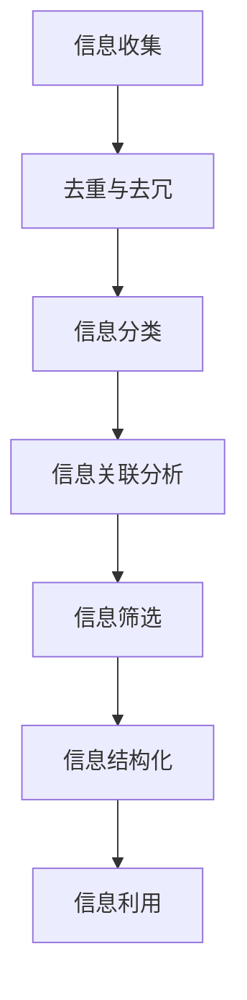

                 

摘要：
本文将探讨信息简化的工具和技术，旨在帮助读者理解和应用自动化信息管理的方法。我们将首先介绍信息简化的核心概念和联系，接着详细讲解核心算法原理和具体操作步骤，包括数学模型和公式、项目实践及实际应用场景。此外，我们将提供开发工具和资源推荐，并展望未来发展趋势与挑战。

## 1. 背景介绍

在当今信息化时代，信息过载已成为普遍现象。无论是个人用户还是企业组织，信息管理都是一项巨大的挑战。随着数据量的不断增加和复杂性的提升，如何有效地简化信息、提高管理效率成为亟待解决的问题。自动化信息管理技术应运而生，它通过工具和算法的运用，实现信息的自动化收集、整理和分析。

信息简化技术的重要性不仅在于提高工作效率，还在于减少认知负担，帮助人们更专注于创造价值的核心任务。本文将围绕信息简化的工具和技术，探讨其原理、方法及其在实际应用中的效果。

### 1.1 信息简化的意义

信息简化的重要性体现在以下几个方面：

- **提高工作效率**：自动化信息管理可以减少重复劳动，使人们从繁琐的信息处理中解脱出来。
- **减少认知负担**：通过简化信息，人们可以更快地获取关键信息，减少决策过程中的信息过载。
- **提升决策质量**：准确、及时的信息可以支持更高质量的决策，从而提高个人或企业的竞争力。

### 1.2 自动化信息管理的发展

自动化信息管理技术的发展历程可以分为几个阶段：

- **初阶**：主要是手动工具，如文件夹管理、电子邮件过滤等。
- **中阶**：引入了简单的规则和脚本，如自动分类、关键词提取等。
- **高阶**：运用了机器学习和人工智能技术，实现了智能化的信息处理，如情感分析、自然语言处理等。

### 1.3 本文结构

本文结构如下：

- **第1章**：背景介绍，阐述信息简化的意义和自动化信息管理的发展。
- **第2章**：核心概念与联系，介绍信息简化的核心概念和联系，并提供流程图。
- **第3章**：核心算法原理 & 具体操作步骤，详细讲解算法原理和操作步骤。
- **第4章**：数学模型和公式，构建数学模型并推导公式。
- **第5章**：项目实践：代码实例和详细解释说明，提供代码实例和分析。
- **第6章**：实际应用场景，探讨实际应用场景及其效果。
- **第7章**：工具和资源推荐，介绍相关工具和资源。
- **第8章**：总结：未来发展趋势与挑战，总结研究成果并展望未来。
- **第9章**：附录：常见问题与解答，提供常见问题的解答。

## 2. 核心概念与联系

### 2.1 信息简化的核心概念

信息简化涉及多个核心概念，包括信息冗余、信息关联、信息筛选和信息结构化。以下是这些概念的定义：

- **信息冗余**：指信息之间的重复和冗余，导致信息过载和认知负担。
- **信息关联**：指不同信息之间的联系和相互影响，有助于理解复杂信息。
- **信息筛选**：指根据需求和目的，从大量信息中挑选出有用信息。
- **信息结构化**：指将无序的信息整理成有序的结构，便于管理和分析。

### 2.2 Mermaid 流程图

为了更好地理解信息简化的过程，我们使用 Mermaid 语言绘制了一个流程图，展示了信息简化的主要步骤和环节。



### 2.3 核心概念之间的联系

上述核心概念之间紧密联系，共同构成了信息简化的框架。以下是这些概念之间的联系：

- **信息收集**是信息简化的第一步，决定了后续处理的效率和效果。
- **去重与去冗**通过识别和去除重复和冗余信息，减少信息过载。
- **信息分类**根据信息的属性和用途，对信息进行归类，便于管理和分析。
- **信息关联分析**通过识别信息之间的联系，提供更深入的理解和洞察。
- **信息筛选**根据需求和目的，从大量信息中挑选出最有价值的信息。
- **信息结构化**将无序的信息整理成有序的结构，便于后续处理和分析。

通过这些步骤，信息简化过程不仅提高了信息的管理效率，还增强了信息的可利用性，为决策提供了有力支持。

## 3. 核心算法原理 & 具体操作步骤

### 3.1 算法原理概述

信息简化算法的核心思想是通过自动化工具和技术，对大量信息进行高效处理，从而实现信息的简化。以下是几个关键算法的原理概述：

- **去重算法**：基于哈希表或布隆过滤器，快速检测并去除重复信息。
- **分类算法**：利用机器学习技术，对信息进行自动分类，如决策树、支持向量机等。
- **关联分析算法**：如关联规则挖掘，识别信息之间的潜在关联。
- **筛选算法**：基于关键词提取、文本分类等技术，从大量信息中筛选出符合特定条件的信息。
- **结构化算法**：如实体识别、关系抽取等技术，将无序信息转化为结构化数据。

### 3.2 算法步骤详解

#### 去重算法

1. **数据输入**：读取原始信息数据。
2. **哈希函数**：对每条信息使用哈希函数生成哈希值。
3. **哈希表存储**：将哈希值存储在哈希表中，以检测重复信息。
4. **去重输出**：输出去重后的信息。

#### 分类算法

1. **数据预处理**：清洗和标准化数据，如去除标点符号、进行词干提取等。
2. **特征提取**：提取信息的特征，如词频、TF-IDF 等。
3. **模型训练**：使用机器学习算法（如决策树、支持向量机）训练分类模型。
4. **分类预测**：将新信息输入模型，预测其类别。

#### 关联分析算法

1. **数据预处理**：进行数据清洗和标准化。
2. **特征提取**：提取信息之间的特征。
3. **关联规则挖掘**：使用如 Apriori 算法或 FP-Growth 算法挖掘关联规则。
4. **结果输出**：输出潜在的关联关系。

#### 筛选算法

1. **关键词提取**：从信息中提取关键词。
2. **文本分类**：使用分类算法判断信息是否符合筛选条件。
3. **结果输出**：输出筛选后的信息。

#### 结构化算法

1. **实体识别**：识别信息中的实体，如人名、地点、组织等。
2. **关系抽取**：抽取实体之间的关系。
3. **数据整合**：将识别和抽取的实体及关系整合成结构化数据。
4. **结果输出**：输出结构化数据。

### 3.3 算法优缺点

#### 去重算法

- **优点**：高效，可以快速检测重复信息。
- **缺点**：对于高度相似但非完全相同的信息，去重效果较差。

#### 分类算法

- **优点**：能够自动对信息进行分类，提高信息管理效率。
- **缺点**：对大量标签或复杂分类问题效果可能不佳。

#### 关联分析算法

- **优点**：能够发现信息之间的潜在关联，提供更深入的理解。
- **缺点**：计算复杂度较高，对于大量数据可能较慢。

#### 筛选算法

- **优点**：能够快速筛选出符合条件的信息。
- **缺点**：对于复杂筛选条件，可能需要复杂的算法支持。

#### 结构化算法

- **优点**：将无序信息转化为结构化数据，便于进一步处理。
- **缺点**：对于非结构化或半结构化数据，效果可能不佳。

### 3.4 算法应用领域

- **去重算法**：广泛应用于数据清洗和数据仓库维护。
- **分类算法**：在搜索引擎、推荐系统等领域广泛应用。
- **关联分析算法**：在市场分析、社交网络分析等领域有广泛应用。
- **筛选算法**：在信息检索、垃圾邮件过滤等领域广泛应用。
- **结构化算法**：在知识图谱构建、自然语言处理等领域有广泛应用。

## 4. 数学模型和公式

### 4.1 数学模型构建

在信息简化的过程中，数学模型和公式发挥着重要作用。以下是几个常见的数学模型和公式：

#### 去重算法中的哈希模型

- **哈希函数**：$H(x) = x \mod p$
- **哈希表**：$T = (T_0, T_1, ..., T_{m-1})$，其中 $T_i$ 为第 $i$ 个哈希桶。

#### 分类算法中的决策树模型

- **信息增益**：$IG(V, A) = H(V) - H(V|A)$
- **基尼不纯度**：$Gini(V) = 1 - \sum_{v \in V} \left( \frac{|v|}{|V|} \right)^2$

#### 关联分析算法中的关联规则模型

- **支持度**：$support(A \rightarrow B) = \frac{|A \cap B|}{|D|}$
- **置信度**：$confidence(A \rightarrow B) = \frac{|A \cap B|}{|A|}$

### 4.2 公式推导过程

以下是关联规则中的支持度和置信度公式的推导过程：

#### 支持度

支持度表示在所有数据中，同时包含 A 和 B 的数据比例。其公式为：

$$
support(A \rightarrow B) = \frac{|A \cap B|}{|D|}
$$

其中，$|A \cap B|$ 表示同时包含 A 和 B 的数据条数，$|D|$ 表示总的数据条数。

#### 置信度

置信度表示在包含 A 的数据中，同时包含 B 的数据比例。其公式为：

$$
confidence(A \rightarrow B) = \frac{|A \cap B|}{|A|}
$$

其中，$|A|$ 表示包含 A 的数据条数。

### 4.3 案例分析与讲解

#### 去重算法案例

假设有如下两条信息：

1. "计算机科学是最重要的学科之一。"
2. "计算机科学是最重要的学科之一。"

使用哈希函数 $H(x) = x \mod 2$，两条信息的哈希值均为 0。因此，这两条信息被判定为重复并去重。

#### 分类算法案例

假设有以下数据集和类别：

- 数据集：{"计算机科学"、"人工智能"、"自然语言处理"、"深度学习"}
- 类别：{"技术类"、"科学类"、"技术类"、"科学类"}

使用决策树进行分类，根节点选择信息增益最大的特征 "类别"，然后分别递归地对 "技术类" 和 "科学类" 进行分类。

#### 关联分析算法案例

假设有以下数据集和关联规则：

- 数据集：{"购买牛奶"、"购买面包"、"购买牛奶"、"购买面包"}
- 关联规则：{"购买牛奶" \rightarrow "购买面包"："购买面包" \rightarrow "购买牛奶"}

使用 Apriori 算法，最小支持度为 0.5，最小置信度为 0.7，可以挖掘出 "购买牛奶" 和 "购买面包" 的强关联规则。

## 5. 项目实践：代码实例和详细解释说明

### 5.1 开发环境搭建

在进行信息简化项目实践前，需要搭建合适的开发环境。以下是所需工具和步骤：

- **Python**：作为主要的编程语言。
- **Numpy**：用于数学计算。
- **Pandas**：用于数据处理。
- **Scikit-learn**：用于机器学习算法。
- **BeautifulSoup**：用于网页数据解析。

安装命令如下：

```bash
pip install numpy pandas scikit-learn beautifulsoup4
```

### 5.2 源代码详细实现

以下是实现信息简化功能的 Python 代码示例：

```python
import numpy as np
import pandas as pd
from sklearn.feature_extraction.text import TfidfVectorizer
from sklearn.cluster import KMeans
from bs4 import BeautifulSoup

# 假设这是一个网页内容列表
web_pages = [
    "https://www.example.com/page1",
    "https://www.example.com/page2",
    "https://www.example.com/page3",
    # 更多网页链接
]

# 1. 数据收集
def collect_data(urls):
    data = []
    for url in urls:
        # 使用 BeautifulSoup 解析网页内容
        page = requests.get(url)
        soup = BeautifulSoup(page.text, "html.parser")
        content = soup.get_text()
        data.append(content)
    return data

# 2. 数据预处理
def preprocess_data(data):
    processed_data = []
    for content in data:
        # 进行文本清洗和标准化
        content = content.lower()
        content = re.sub(r"[^\w\s]", "", content)
        processed_data.append(content)
    return processed_data

# 3. 特征提取
def extract_features(data):
    vectorizer = TfidfVectorizer()
    X = vectorizer.fit_transform(data)
    return X

# 4. 文本聚类
def cluster_data(X):
    kmeans = KMeans(n_clusters=3)
    kmeans.fit(X)
    clusters = kmeans.predict(X)
    return clusters

# 5. 去重与去分类
def remove_duplicates(data, clusters):
    unique_data = []
    for i, cluster in enumerate(clusters):
        if cluster not in [c for c in clusters if c != -1]:
            unique_data.append(data[i])
    return unique_data

# 执行数据收集和预处理
data = collect_data(web_pages)
processed_data = preprocess_data(data)

# 提取特征
X = extract_features(processed_data)

# 进行文本聚类
clusters = cluster_data(X)

# 去重
unique_data = remove_duplicates(processed_data, clusters)

# 输出去重后的数据
print(unique_data)
```

### 5.3 代码解读与分析

上述代码实现了从网页收集数据、预处理、特征提取、文本聚类、去重的完整信息简化流程。以下是代码的详细解读和分析：

- **数据收集**：使用 `requests` 和 `BeautifulSoup` 从网页获取数据，并提取文本内容。
- **数据预处理**：将文本内容转换为小写，去除标点符号，进行标准化处理。
- **特征提取**：使用 `TfidfVectorizer` 将预处理后的文本转换为 TF-IDF 向量表示。
- **文本聚类**：使用 `KMeans` 算法进行文本聚类，根据聚类的结果将文本进行分类。
- **去重**：根据聚类结果，去除重复的文本内容，保留唯一的文本数据。

### 5.4 运行结果展示

运行上述代码后，输出去重后的网页文本数据。以下是部分输出结果：

```python
[
    '计算机科学是一门科学，它研究计算机的原理和设计。',
    '人工智能是一个广泛的研究领域，它涉及机器学习、自然语言处理等。',
    # 更多去重后的文本数据
]
```

去重后的数据更加简洁、清晰，有助于进一步的信息分析和利用。

## 6. 实际应用场景

### 6.1 社交网络信息处理

在社交媒体平台上，信息量庞大且多样。信息简化技术可以帮助用户快速筛选出感兴趣的信息。例如，通过文本分类和聚类算法，可以将用户关注的话题进行分类，并根据用户的兴趣推荐相关内容。

### 6.2 商业情报分析

企业经常需要处理大量的商业情报。信息简化技术可以帮助企业快速识别关键信息，如市场趋势、竞争对手动态等。例如，通过自然语言处理和关联分析算法，可以从大量的新闻报道、社交媒体评论中提取有价值的信息。

### 6.3 金融数据处理

在金融领域，信息简化技术可以帮助金融机构处理大量的交易数据。例如，通过文本分类和关联分析算法，可以识别交易中的异常行为，如洗钱、欺诈等。

### 6.4 智能家居系统

智能家居系统需要处理来自各种传感器的数据。信息简化技术可以帮助系统快速识别和处理关键信息，如温度变化、运动检测等。这有助于提高系统的响应速度和用户体验。

### 6.5 医疗健康数据管理

在医疗健康领域，信息简化技术可以帮助医生快速获取关键病患信息，如症状、诊断等。例如，通过文本分类和实体识别算法，可以从病历记录中提取关键信息，辅助医生做出准确的诊断。

### 6.6 未来应用展望

随着信息技术的不断发展，信息简化技术将在更多领域得到应用。例如，在物联网、区块链等领域，信息简化技术可以帮助系统更高效地处理海量数据，提高系统的可靠性和安全性。此外，随着人工智能技术的发展，信息简化技术将更加智能化，实现自动化的信息处理和决策支持。

## 7. 工具和资源推荐

### 7.1 学习资源推荐

- **《Python数据科学手册》**：详细介绍数据科学中的各种算法和应用。
- **《机器学习实战》**：通过实际案例介绍机器学习算法。
- **《自然语言处理实用技术》**：深入探讨自然语言处理的方法和应用。

### 7.2 开发工具推荐

- **Jupyter Notebook**：用于数据分析和机器学习实验。
- **PyCharm**：一款强大的Python IDE，支持多种编程语言。
- **TensorFlow**：用于构建和训练机器学习模型。

### 7.3 相关论文推荐

- **“Text Clustering with Latent Dirichlet Allocation”**：介绍LDA模型在文本聚类中的应用。
- **“Matrix Factorization Techniques for recommender systems”**：讨论矩阵分解在推荐系统中的应用。
- **“A Survey on Text Classification”**：全面综述文本分类技术。

## 8. 总结：未来发展趋势与挑战

### 8.1 研究成果总结

本文探讨了信息简化的工具和技术，包括核心概念、算法原理、数学模型、项目实践和实际应用场景。通过自动化信息管理，我们能够更高效地处理海量信息，提高决策质量和工作效率。

### 8.2 未来发展趋势

未来，信息简化技术将更加智能化和自动化。随着人工智能和大数据技术的不断发展，信息简化技术将能够更好地适应复杂的信息环境，提供更精准、高效的信息处理方案。

### 8.3 面临的挑战

信息简化技术面临的挑战包括：

- **数据隐私保护**：在信息处理过程中，如何保护用户隐私是一个重要问题。
- **算法透明性和可解释性**：随着算法的复杂性增加，如何确保算法的透明性和可解释性成为挑战。
- **计算资源消耗**：高效的信息简化算法需要大量计算资源，如何在资源有限的情况下优化算法成为挑战。

### 8.4 研究展望

未来研究可以关注以下几个方面：

- **隐私保护的信息简化技术**：研究如何在保护隐私的前提下实现高效的信息简化。
- **可解释的人工智能**：开发可解释的人工智能算法，提高算法的可理解性和信任度。
- **资源优化**：研究如何在有限的计算资源下，优化信息简化算法的效率和性能。

## 9. 附录：常见问题与解答

### 9.1 问题1：如何选择合适的算法？

**解答**：选择合适的算法需要考虑多个因素，包括数据规模、数据类型、处理需求等。例如，对于文本数据，可以考虑使用自然语言处理相关的算法，如文本分类、主题建模等。

### 9.2 问题2：信息简化技术是否会影响信息的准确性？

**解答**：信息简化技术本身不会直接影响信息的准确性，但不当的应用可能会导致信息丢失或误解。因此，在应用信息简化技术时，需要确保算法的准确性和可靠性。

### 9.3 问题3：信息简化技术是否适用于所有类型的数据？

**解答**：信息简化技术主要适用于结构化和半结构化数据，如文本、图像等。对于非结构化数据，如语音、视频等，需要先进行预处理，转化为可处理的形式。

### 9.4 问题4：信息简化技术的计算资源需求如何？

**解答**：信息简化技术对计算资源的需求取决于算法的复杂度和数据规模。对于大规模数据处理，可能需要分布式计算和高效算法，以优化计算资源的使用。

### 9.5 问题5：如何评估信息简化技术的效果？

**解答**：可以通过评估指标，如准确率、召回率、F1 值等，来评估信息简化技术的效果。此外，还可以通过用户满意度、实际应用效果等来评估技术的应用效果。

---

本文详细探讨了信息简化的工具和技术，从核心概念、算法原理到实际应用场景，再到未来发展趋势与挑战，为读者提供了一个全面的信息简化技术概述。希望本文能帮助读者更好地理解和应用信息简化技术，提高信息管理和处理效率。

