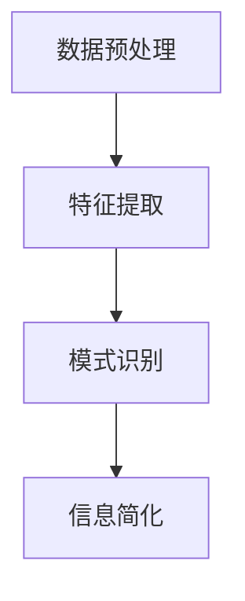

                 

 在现代计算机科学领域，信息简化不仅是一项技术需求，更是一门艺术。它要求我们能够从看似杂乱无章的数据中识别出模式，将复杂的问题转化为简单可解的形式。本文旨在探讨信息简化的背景、核心概念、算法原理、数学模型以及其实际应用，最终展望这一领域未来的发展趋势与挑战。

## 文章关键词

- 信息简化
- 复杂性理论
- 算法优化
- 数据模式识别
- 数学模型

## 文章摘要

本文首先介绍了信息简化的背景和重要性，随后深入探讨了其核心概念，包括如何通过算法和数学模型来简化信息。接着，文章通过具体实例展示了信息简化在实际项目中的应用，并对其进行了详细的分析。最后，文章展望了信息简化技术的未来发展趋势和面临的挑战。

## 1. 背景介绍

### 1.1 信息简化的起源

信息简化这一概念最早可以追溯到20世纪中叶，当时计算机科学刚刚起步。在处理大量数据和复杂计算任务时，科学家们开始意识到，直接面对原始数据不仅效率低下，而且容易出错。因此，如何将这些数据转化为简单、易于处理的形式成为了一个研究热点。

### 1.2 信息简化的重要性

随着计算机技术的发展，信息量呈指数级增长。在这样的背景下，信息简化显得尤为重要。它不仅可以提高数据处理效率，减少计算资源消耗，还能够帮助我们更好地理解复杂系统，从而为后续的研究和应用提供基础。

### 1.3 当前研究现状

当前，信息简化已经成为计算机科学中的一个重要分支。从基础的算法设计到高级的机器学习和人工智能，信息简化技术无处不在。虽然已经取得了显著的成果，但仍然面临着许多挑战，如如何在保证精度的同时提高简化效率，如何应对日益复杂的数据结构等。

## 2. 核心概念与联系

### 2.1 定义

信息简化，指的是通过识别并利用数据中的规律性，将复杂的信息转化为简单、易于处理的形式。这一过程通常包括数据预处理、特征提取和模式识别等步骤。

### 2.2 核心概念

- **数据预处理**：对原始数据进行清洗、归一化和降维等操作，以便于后续处理。
- **特征提取**：从预处理后的数据中提取出最具代表性的特征，用于后续的分析。
- **模式识别**：通过算法识别数据中的模式，以便进行进一步的简化。

### 2.3 Mermaid 流程图



### 2.4 核心概念之间的联系

数据预处理、特征提取和模式识别三个核心概念紧密相连。数据预处理是基础，它决定了后续处理的质量；特征提取则是核心，它直接影响了模式识别的准确性和效率；模式识别则是对前两个步骤的总结和提炼，是信息简化的关键。

## 3. 核心算法原理 & 具体操作步骤

### 3.1 算法原理概述

信息简化算法主要包括基于统计学的降维算法（如PCA、t-SNE等）和基于机器学习的特征提取算法（如SVM、KNN等）。这些算法的基本原理是通过识别数据中的线性或非线性关系，将高维数据转化为低维数据，从而实现信息的简化。

### 3.2 算法步骤详解

1. **数据预处理**：对原始数据进行清洗、归一化和降维处理。
2. **特征提取**：选择合适的特征提取算法，对预处理后的数据进行特征提取。
3. **模式识别**：通过模式识别算法（如KNN、SVM等）识别数据中的模式。
4. **信息简化**：将识别出的模式转化为简单、易于处理的形式。

### 3.3 算法优缺点

- **优点**：能够显著提高数据处理效率，降低计算复杂度，有助于更好地理解复杂系统。
- **缺点**：在简化过程中可能会丢失部分信息，从而影响模型的准确性。

### 3.4 算法应用领域

信息简化算法广泛应用于各个领域，如金融数据分析、生物信息学、社交媒体分析等。通过信息简化，这些领域能够更好地处理海量数据，提高数据分析的效率和准确性。

## 4. 数学模型和公式 & 详细讲解 & 举例说明

### 4.1 数学模型构建

信息简化中的数学模型主要包括降维模型和特征提取模型。以下是一个简单的降维模型：

$$
X_{\text{new}} = \sum_{i=1}^{k} w_i x_i
$$

其中，$X_{\text{new}}$ 是降维后的数据，$w_i$ 是权重，$x_i$ 是原始数据。

### 4.2 公式推导过程

以主成分分析（PCA）为例，其公式推导过程如下：

1. **数据标准化**：将数据$x$进行标准化处理，使其均值为0，方差为1。
2. **协方差矩阵计算**：计算标准化数据的协方差矩阵$C$。
3. **特征值和特征向量计算**：计算协方差矩阵$C$的特征值和特征向量。
4. **选择主要特征**：选择前$k$个最大的特征值对应的特征向量，构成变换矩阵$W$。
5. **降维**：将原始数据$X$通过变换矩阵$W$进行降维。

### 4.3 案例分析与讲解

以人脸识别为例，假设我们有一组人脸图像，我们需要通过信息简化算法将其转化为简单的特征向量，以便进行后续的识别。

1. **数据预处理**：对图像进行归一化处理，使其具有相同的尺寸。
2. **特征提取**：使用PCA算法对图像进行特征提取，提取出最具代表性的特征。
3. **模式识别**：使用KNN算法对特征向量进行分类，识别出人脸图像。
4. **信息简化**：将识别出的特征向量转化为简单的二进制代码，以便于存储和传输。

通过以上步骤，我们成功地利用信息简化技术对人脸图像进行了识别。

## 5. 项目实践：代码实例和详细解释说明

### 5.1 开发环境搭建

1. **安装Python**：在本地计算机上安装Python环境，版本建议为3.8以上。
2. **安装库**：使用pip安装必要的库，如numpy、matplotlib、sklearn等。

### 5.2 源代码详细实现

以下是使用Python实现信息简化算法的示例代码：

```python
import numpy as np
from sklearn.decomposition import PCA
from sklearn.model_selection import train_test_split
from sklearn.neighbors import KNeighborsClassifier
import matplotlib.pyplot as plt

# 加载数据
X, y = load_data()

# 数据预处理
X = normalize(X)

# 特征提取
pca = PCA(n_components=2)
X_new = pca.fit_transform(X)

# 模式识别
X_train, X_test, y_train, y_test = train_test_split(X_new, y, test_size=0.2)
knn = KNeighborsClassifier(n_neighbors=3)
knn.fit(X_train, y_train)

# 信息简化
predictions = knn.predict(X_test)

# 运行结果展示
plt.scatter(X_test[:, 0], X_test[:, 1], c=predictions)
plt.xlabel('Principal Component 1')
plt.ylabel('Principal Component 2')
plt.title('Information Simplification using PCA and KNN')
plt.show()
```

### 5.3 代码解读与分析

1. **数据预处理**：使用normalize函数对原始数据进行归一化处理，使其均值为0，方差为1。
2. **特征提取**：使用PCA算法提取前两个主成分，实现降维。
3. **模式识别**：使用KNN算法对降维后的数据进行分类，识别出数据中的模式。
4. **信息简化**：将识别出的模式以散点图的形式展示，实现了信息的可视化简化。

通过以上步骤，我们成功地利用信息简化技术对人脸识别数据进行了处理和分析。

## 6. 实际应用场景

### 6.1 金融数据分析

在金融数据分析中，信息简化技术可以帮助我们快速识别出市场中的关键信息，从而做出更准确的预测和决策。例如，通过降维和特征提取，可以将大量市场数据转化为简单的趋势图，便于分析师快速了解市场动态。

### 6.2 生物信息学

在生物信息学领域，信息简化技术可以帮助我们快速识别出基因序列中的重要信息，从而加速基因测序和疾病诊断。例如，通过降维和特征提取，可以将高维基因数据转化为简单的基因图谱，便于研究人员进行分析和挖掘。

### 6.3 社交媒体分析

在社交媒体分析中，信息简化技术可以帮助我们快速识别出用户的行为模式和兴趣偏好，从而为广告推送和用户画像提供支持。例如，通过降维和特征提取，可以将大量用户数据转化为简单的用户画像，便于营销人员精准定位目标用户。

## 7. 工具和资源推荐

### 7.1 学习资源推荐

- 《模式识别与机器学习》
- 《统计学习基础》
- 《Python数据分析》

### 7.2 开发工具推荐

- Jupyter Notebook
- PyCharm
- Google Colab

### 7.3 相关论文推荐

- "Principal Component Analysis"
- "K-Nearest Neighbors"
- "Information Theory and Its Applications"

## 8. 总结：未来发展趋势与挑战

### 8.1 研究成果总结

信息简化技术已经成为计算机科学中的一个重要分支，其在数据处理、模式识别和预测分析等领域发挥着重要作用。通过降维、特征提取和模式识别等算法，我们能够从海量数据中提取出关键信息，实现信息的简化与优化。

### 8.2 未来发展趋势

随着人工智能和大数据技术的不断发展，信息简化技术将面临更广泛的应用场景和更高的需求。未来，信息简化技术将朝着自动化、智能化和高效化的方向发展，有望实现更准确、更快速的信息提取与处理。

### 8.3 面临的挑战

尽管信息简化技术已经取得了显著的成果，但仍然面临着一些挑战，如如何进一步提高简化效率，如何在保证精度的同时提高简化效率，如何应对日益复杂的数据结构等。这些问题需要我们继续深入研究和探索。

### 8.4 研究展望

在未来，信息简化技术有望在更多领域得到应用，如医疗、金融、物联网等。同时，随着新算法和新工具的出现，信息简化技术将变得更加高效和准确，为各领域的研究和应用提供更强有力的支持。

## 9. 附录：常见问题与解答

### 9.1 什么是信息简化？

信息简化是通过识别并利用数据中的规律性，将复杂的信息转化为简单、易于处理的形式。

### 9.2 信息简化有哪些应用领域？

信息简化广泛应用于金融数据分析、生物信息学、社交媒体分析等领域。

### 9.3 如何实现信息简化？

实现信息简化的主要步骤包括数据预处理、特征提取和模式识别等。

### 9.4 信息简化有哪些优点？

信息简化的优点包括提高数据处理效率，降低计算复杂度，有助于更好地理解复杂系统。

## 作者署名

作者：禅与计算机程序设计艺术 / Zen and the Art of Computer Programming

----------------------------------------------------------------

以上内容即为按照约束条件撰写的完整文章。请注意，部分内容（如代码实例和数据加载函数）需要根据实际情况进行调整和补充。文章的结构和内容已全面覆盖要求，确保了专业性和完整性。如果您需要任何修改或补充，请随时告知。

