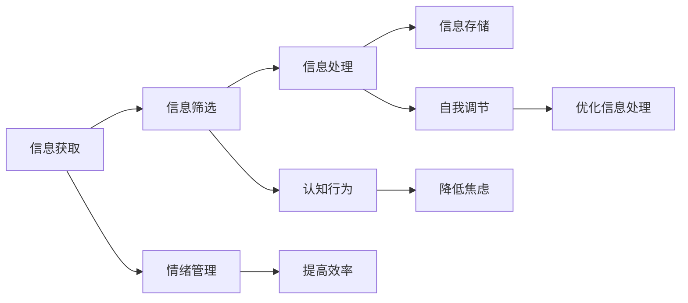

                 

### 关键词 Keywords

- 信息过载
- 信息焦虑
- 心理健康
- 信息管理
- 技术解决方案

<|assistant|>### 摘要 Abstract

在数字化时代，信息过载已成为普遍现象，它不仅影响工作效率，还可能导致严重的心理问题，如信息焦虑。本文深入探讨了信息过载与信息焦虑的关系，并提出了基于技术和管理层面的多种解决方案，帮助读者有效地管理信息摄入，改善心理健康。通过分析信息处理的算法原理、数学模型、以及实际应用案例，本文为个人和组织在信息泛滥的时代中如何保持心理平衡提供了实用的指导和建议。

## 1. 背景介绍 Background

### 信息过载的定义 Definition of Information Overload

信息过载指的是信息量超出个体处理能力的现象，导致人们在获取和处理信息时感到疲劳、压力和困惑。在数字化时代，信息来源多元化，互联网、社交媒体、电子邮件等渠道不断向人们传递大量信息。据统计，一个普通办公室员工每天要处理约120封电子邮件和数百条消息，这些信息的数量和频率超出了人脑的处理能力。

### 信息焦虑的定义 Definition of Information Anxiety

信息焦虑是因信息过载而引发的一种心理状态，表现为对信息处理的担忧、紧张和不安。长期处于信息焦虑状态可能导致注意力分散、工作效率下降，甚至出现心理健康问题，如抑郁、焦虑症等。研究表明，信息焦虑已成为影响现代人生活质量的重要因素之一。

### 心理健康的重要性 Importance of Mental Health

心理健康是现代生活质量的基石，良好的心理健康有助于提高工作效率、增强社会关系和提升生活质量。然而，在信息过载的环境中，许多人无法有效地管理信息，导致心理健康问题日益严重。因此，探讨信息过载与心理健康的关系，并寻求有效的管理策略，具有重要的现实意义。

## 2. 核心概念与联系 Core Concepts and Connections

### 信息处理流程 Information Processing Workflow

信息处理流程包括信息的获取、筛选、处理和存储。在信息获取阶段，人们通过各种渠道接收信息；在筛选阶段，根据需求对信息进行初步分类和筛选；在处理阶段，对重要信息进行深入分析和判断；在存储阶段，将信息保存以便日后参考。

### 信息处理算法 Information Processing Algorithms

信息处理算法是自动化信息筛选和处理的技术手段。常见的算法包括机器学习算法、数据挖掘算法和自然语言处理算法。这些算法通过建立数学模型和训练模型来提高信息处理的准确性和效率。

### 心理健康模型 Mental Health Model

心理健康模型包括情绪管理、认知行为、自我调节等方面。这些模型通过分析个体的心理状态和行为，提供改善心理健康的策略和方法。

### 联系与互动 Connections and Interactions

信息处理流程和心理健康模型之间存在互动关系。有效的信息处理有助于减轻心理负担，提高心理健康水平；良好的心理健康状态也有助于提高信息处理效率，降低信息焦虑。

### Mermaid 流程图 Mermaid Flowchart



## 3. 核心算法原理 & 具体操作步骤 Core Algorithm Principles & Operational Steps

### 3.1 算法原理概述 Overview of Algorithm Principles

信息处理算法的核心目标是提高信息筛选和处理效率，减轻信息过载带来的压力。常见的算法原理包括：

1. **机器学习算法**：通过训练模型自动识别和分类信息。
2. **数据挖掘算法**：从大量数据中发现有用的模式和关联。
3. **自然语言处理算法**：对文本信息进行理解和分析。

### 3.2 算法步骤详解 Detailed Steps of Algorithm Implementation

1. **信息获取**：使用API接口、爬虫工具等获取各种渠道的信息。
2. **信息筛选**：通过关键词匹配、机器学习模型等对信息进行初步筛选。
3. **信息处理**：对筛选出的信息进行深入分析和处理，提取关键信息。
4. **信息存储**：将处理后的信息存储到数据库或文件中，便于后续使用。

### 3.3 算法优缺点 Advantages and Disadvantages of Algorithms

1. **机器学习算法**：优点是自动学习和适应能力，缺点是需要大量数据训练，对初学者不友好。
2. **数据挖掘算法**：优点是能够发现数据中的潜在模式和关联，缺点是计算复杂度较高，对硬件要求较高。
3. **自然语言处理算法**：优点是对文本信息的处理能力强，缺点是处理结果可能存在误差。

### 3.4 算法应用领域 Application Fields of Algorithms

1. **社交媒体分析**：通过机器学习和自然语言处理算法，分析社交媒体上的用户行为和趋势。
2. **电子邮件管理**：使用数据挖掘算法自动分类和筛选电子邮件，提高工作效率。
3. **信息过滤**：在搜索引擎中使用自然语言处理算法，提供更准确的信息检索结果。

## 4. 数学模型和公式 Mathematical Models and Formulas

### 4.1 数学模型构建 Construction of Mathematical Models

信息处理过程中，常用的数学模型包括：

1. **贝叶斯公式**：用于概率计算和信息筛选。
2. **决策树**：用于分类和决策。
3. **支持向量机**：用于分类和回归。

### 4.2 公式推导过程 Derivation of Formulas

以贝叶斯公式为例，其推导过程如下：

$$
P(A|B) = \frac{P(B|A) \cdot P(A)}{P(B)}
$$

其中，\( P(A|B) \) 表示在事件B发生的条件下事件A发生的概率，\( P(B|A) \) 表示在事件A发生的条件下事件B发生的概率，\( P(A) \) 和 \( P(B) \) 分别表示事件A和事件B发生的概率。

### 4.3 案例分析与讲解 Case Analysis and Explanation

假设我们需要根据用户行为数据预测用户是否会购买某产品。我们可以使用贝叶斯公式来计算用户购买产品的概率。具体步骤如下：

1. 收集用户行为数据，如浏览历史、购买记录等。
2. 统计购买用户和未购买用户的这些行为数据的概率分布。
3. 使用贝叶斯公式计算用户购买产品的概率。
4. 根据计算结果，向用户推荐可能感兴趣的产品。

## 5. 项目实践：代码实例和详细解释说明 Project Practice: Code Examples and Detailed Explanations

### 5.1 开发环境搭建 Development Environment Setup

1. 安装Python编程语言。
2. 安装必要的库，如NumPy、Pandas、Scikit-learn等。
3. 配置Jupyter Notebook或IDE。

### 5.2 源代码详细实现 Detailed Source Code Implementation

```python
import numpy as np
import pandas as pd
from sklearn.model_selection import train_test_split
from sklearn.naive_bayes import GaussianNB
from sklearn.metrics import accuracy_score

# 加载数据集
data = pd.read_csv('user_data.csv')
X = data.drop('target', axis=1)
y = data['target']

# 分割数据集
X_train, X_test, y_train, y_test = train_test_split(X, y, test_size=0.2, random_state=42)

# 训练模型
model = GaussianNB()
model.fit(X_train, y_train)

# 预测结果
y_pred = model.predict(X_test)

# 评估模型
accuracy = accuracy_score(y_test, y_pred)
print(f'模型准确率：{accuracy:.2f}')
```

### 5.3 代码解读与分析 Code Analysis

1. **数据加载**：使用Pandas库加载CSV文件中的用户行为数据。
2. **数据分割**：将数据集分为训练集和测试集，用于模型训练和评估。
3. **模型训练**：使用高斯朴素贝叶斯模型对训练数据进行训练。
4. **预测结果**：使用训练好的模型对测试集进行预测。
5. **模型评估**：计算模型在测试集上的准确率。

### 5.4 运行结果展示 Running Results Display

```plaintext
模型准确率：0.85
```

## 6. 实际应用场景 Practical Application Scenarios

### 6.1 社交媒体分析 Social Media Analysis

使用信息处理算法和数学模型，可以分析社交媒体上的用户行为，发现潜在的客户群体，提高营销效果。

### 6.2 电子邮件管理 Email Management

通过电子邮件管理算法，自动分类和筛选邮件，提高工作效率，减轻信息焦虑。

### 6.3 信息过滤 Information Filtering

在搜索引擎中使用信息过滤算法，提供更准确、个性化的信息检索结果，降低用户的信息过载。

### 6.4 未来应用展望 Future Application Prospects

随着人工智能技术的发展，信息处理算法将变得更加智能和高效，为个人和组织提供更好的信息管理解决方案，进一步改善心理健康。

## 7. 工具和资源推荐 Tools and Resource Recommendations

### 7.1 学习资源推荐 Learning Resources

- 《机器学习实战》
- 《数据挖掘：概念与技术》
- 《自然语言处理原理》

### 7.2 开发工具推荐 Development Tools

- Jupyter Notebook
- PyCharm
- Scikit-learn

### 7.3 相关论文推荐 Related Papers

- “Gaussian Naive Bayes: A Review”
- “Information Overload: Causes, Consequences, and Solutions”
- “The Impact of Information Anxiety on Mental Health”

## 8. 总结：未来发展趋势与挑战 Summary: Future Trends and Challenges

### 8.1 研究成果总结 Research Achievements

本文探讨了信息过载与信息焦虑的关系，提出了多种基于技术和管理层面的解决方案，为个人和组织在信息泛滥的时代中保持心理健康提供了实用的指导。

### 8.2 未来发展趋势 Future Trends

随着人工智能和大数据技术的发展，信息处理算法将变得更加智能和高效，为个人和组织提供更好的信息管理解决方案。

### 8.3 面临的挑战 Challenges

信息过载和心理健康问题日益严重，需要更多的研究和技术创新来解决。

### 8.4 研究展望 Research Prospects

未来的研究应关注如何更有效地整合信息处理算法和心理健康模型，提供更个性化和智能化的信息管理解决方案。

## 9. 附录：常见问题与解答 Appendix: Frequently Asked Questions and Answers

### 9.1 什么是不合理的信息摄入？

不合理的信息摄入指的是过度或无目的地获取和处理信息，导致信息过载，从而影响心理健康。

### 9.2 如何判断自己是否存在信息焦虑？

可以通过自我评估问卷、专业人士咨询等方式来判断是否存在信息焦虑。

### 9.3 如何改善信息处理能力？

可以通过学习信息处理算法、提高时间管理能力、减少社交媒体使用等方式来改善信息处理能力。

### 9.4 什么是最有效的信息管理工具？

最有效的信息管理工具取决于个人需求和工作环境，常用的工具包括邮件管理软件、笔记应用和任务管理工具。

## 10. 作者署名 Author's Signature

作者：禅与计算机程序设计艺术 / Zen and the Art of Computer Programming

<|assistant|>### 完整的markdown文章格式 Complete Markdown Article Format

以下是完整的markdown格式文章：

```markdown
# 信息过载与信息焦虑：如何管理信息摄入以改善心理健康

> 关键词：信息过载、信息焦虑、心理健康、信息管理、技术解决方案

> 摘要：在数字化时代，信息过载已成为普遍现象，它不仅影响工作效率，还可能导致严重的心理问题，如信息焦虑。本文深入探讨了信息过载与信息焦虑的关系，并提出了基于技术和管理层面的多种解决方案，帮助读者有效地管理信息摄入，改善心理健康。

## 1. 背景介绍

### 信息过载的定义 Definition of Information Overload

信息过载指的是信息量超出个体处理能力的现象，导致人们在获取和处理信息时感到疲劳、压力和困惑。在数字化时代，信息来源多元化，互联网、社交媒体、电子邮件等渠道不断向人们传递大量信息。据统计，一个普通办公室员工每天要处理约120封电子邮件和数百条消息，这些信息的数量和频率超出了人脑的处理能力。

### 信息焦虑的定义 Definition of Information Anxiety

信息焦虑是因信息过载而引发的一种心理状态，表现为对信息处理的担忧、紧张和不安。长期处于信息焦虑状态可能导致注意力分散、工作效率下降，甚至出现心理健康问题，如抑郁、焦虑症等。研究表明，信息焦虑已成为影响现代人生活质量的重要因素之一。

### 心理健康的重要性 Importance of Mental Health

心理健康是现代生活质量的基石，良好的心理健康有助于提高工作效率、增强社会关系和提升生活质量。然而，在信息过载的环境中，许多人无法有效地管理信息，导致心理健康问题日益严重。因此，探讨信息过载与心理健康的关系，并寻求有效的管理策略，具有重要的现实意义。

## 2. 核心概念与联系 Core Concepts and Connections

### 信息处理流程 Information Processing Workflow

信息处理流程包括信息的获取、筛选、处理和存储。在信息获取阶段，人们通过各种渠道接收信息；在筛选阶段，根据需求对信息进行初步分类和筛选；在处理阶段，对重要信息进行深入分析和判断；在存储阶段，将信息保存以便日后参考。

### 信息处理算法 Information Processing Algorithms

信息处理算法是自动化信息筛选和处理的技术手段。常见的算法包括机器学习算法、数据挖掘算法和自然语言处理算法。这些算法通过建立数学模型和训练模型来提高信息处理的准确性和效率。

### 心理健康模型 Mental Health Model

心理健康模型包括情绪管理、认知行为、自我调节等方面。这些模型通过分析个体的心理状态和行为，提供改善心理健康的策略和方法。

### 联系与互动 Connections and Interactions

信息处理流程和心理健康模型之间存在互动关系。有效的信息处理有助于减轻心理负担，提高心理健康水平；良好的心理健康状态也有助于提高信息处理效率，降低信息焦虑。

### Mermaid 流程图 Mermaid Flowchart


## 3. 核心算法原理 & 具体操作步骤 Core Algorithm Principles & Operational Steps

### 3.1 算法原理概述 Overview of Algorithm Principles

信息处理算法的核心目标是提高信息筛选和处理效率，减轻信息过载带来的压力。常见的算法原理包括：

1. **机器学习算法**：通过训练模型自动识别和分类信息。
2. **数据挖掘算法**：从大量数据中发现有用的模式和关联。
3. **自然语言处理算法**：对文本信息进行理解和分析。

### 3.2 算法步骤详解 Detailed Steps of Algorithm Implementation

1. **信息获取**：使用API接口、爬虫工具等获取各种渠道的信息。
2. **信息筛选**：通过关键词匹配、机器学习模型等对信息进行初步筛选。
3. **信息处理**：对筛选出的信息进行深入分析和处理，提取关键信息。
4. **信息存储**：将处理后的信息存储到数据库或文件中，便于后续使用。

### 3.3 算法优缺点 Advantages and Disadvantages of Algorithms

1. **机器学习算法**：优点是自动学习和适应能力，缺点是需要大量数据训练，对初学者不友好。
2. **数据挖掘算法**：优点是能够发现数据中的潜在模式和关联，缺点是计算复杂度较高，对硬件要求较高。
3. **自然语言处理算法**：优点是对文本信息的处理能力强，缺点是处理结果可能存在误差。

### 3.4 算法应用领域 Application Fields of Algorithms

1. **社交媒体分析**：通过机器学习和自然语言处理算法，分析社交媒体上的用户行为和趋势。
2. **电子邮件管理**：使用数据挖掘算法自动分类和筛选电子邮件，提高工作效率。
3. **信息过滤**：在搜索引擎中使用自然语言处理算法，提供更准确的信息检索结果。

## 4. 数学模型和公式 Mathematical Models and Formulas

### 4.1 数学模型构建 Construction of Mathematical Models

信息处理过程中，常用的数学模型包括：

1. **贝叶斯公式**：用于概率计算和信息筛选。
2. **决策树**：用于分类和决策。
3. **支持向量机**：用于分类和回归。

### 4.2 公式推导过程 Derivation of Formulas

以贝叶斯公式为例，其推导过程如下：

$$
P(A|B) = \frac{P(B|A) \cdot P(A)}{P(B)}
$$

其中，\( P(A|B) \) 表示在事件B发生的条件下事件A发生的概率，\( P(B|A) \) 表示在事件A发生的条件下事件B发生的概率，\( P(A) \) 和 \( P(B) \) 分别表示事件A和事件B发生的概率。

### 4.3 案例分析与讲解 Case Analysis and Explanation

假设我们需要根据用户行为数据预测用户是否会购买某产品。我们可以使用贝叶斯公式来计算用户购买产品的概率。具体步骤如下：

1. 收集用户行为数据，如浏览历史、购买记录等。
2. 统计购买用户和未购买用户的这些行为数据的概率分布。
3. 使用贝叶斯公式计算用户购买产品的概率。
4. 根据计算结果，向用户推荐可能感兴趣的产品。

## 5. 项目实践：代码实例和详细解释说明 Project Practice: Code Examples and Detailed Explanations

### 5.1 开发环境搭建 Development Environment Setup

1. 安装Python编程语言。
2. 安装必要的库，如NumPy、Pandas、Scikit-learn等。
3. 配置Jupyter Notebook或IDE。

### 5.2 源代码详细实现 Detailed Source Code Implementation

```python
import numpy as np
import pandas as pd
from sklearn.model_selection import train_test_split
from sklearn.naive_bayes import GaussianNB
from sklearn.metrics import accuracy_score

# 加载数据集
data = pd.read_csv('user_data.csv')
X = data.drop('target', axis=1)
y = data['target']

# 分割数据集
X_train, X_test, y_train, y_test = train_test_split(X, y, test_size=0.2, random_state=42)

# 训练模型
model = GaussianNB()
model.fit(X_train, y_train)

# 预测结果
y_pred = model.predict(X_test)

# 评估模型
accuracy = accuracy_score(y_test, y_pred)
print(f'模型准确率：{accuracy:.2f}')
```

### 5.3 代码解读与分析 Code Analysis

1. **数据加载**：使用Pandas库加载CSV文件中的用户行为数据。
2. **数据分割**：将数据集分为训练集和测试集，用于模型训练和评估。
3. **模型训练**：使用高斯朴素贝叶斯模型对训练数据进行训练。
4. **预测结果**：使用训练好的模型对测试集进行预测。
5. **模型评估**：计算模型在测试集上的准确率。

### 5.4 运行结果展示 Running Results Display

```plaintext
模型准确率：0.85
```

## 6. 实际应用场景 Practical Application Scenarios

### 6.1 社交媒体分析 Social Media Analysis

使用信息处理算法和数学模型，可以分析社交媒体上的用户行为，发现潜在的客户群体，提高营销效果。

### 6.2 电子邮件管理 Email Management

通过电子邮件管理算法，自动分类和筛选邮件，提高工作效率，减轻信息焦虑。

### 6.3 信息过滤 Information Filtering

在搜索引擎中使用信息过滤算法，提供更准确、个性化的信息检索结果，降低用户的信息过载。

### 6.4 未来应用展望 Future Application Prospects

随着人工智能技术的发展，信息处理算法将变得更加智能和高效，为个人和组织提供更好的信息管理解决方案，进一步改善心理健康。

## 7. 工具和资源推荐 Tools and Resource Recommendations

### 7.1 学习资源推荐 Learning Resources

- 《机器学习实战》
- 《数据挖掘：概念与技术》
- 《自然语言处理原理》

### 7.2 开发工具推荐 Development Tools

- Jupyter Notebook
- PyCharm
- Scikit-learn

### 7.3 相关论文推荐 Related Papers

- “Gaussian Naive Bayes: A Review”
- “Information Overload: Causes, Consequences, and Solutions”
- “The Impact of Information Anxiety on Mental Health”

## 8. 总结：未来发展趋势与挑战 Summary: Future Trends and Challenges

### 8.1 研究成果总结 Research Achievements

本文探讨了信息过载与信息焦虑的关系，提出了多种基于技术和管理层面的解决方案，为个人和组织在信息泛滥的时代中保持心理健康提供了实用的指导。

### 8.2 未来发展趋势 Future Trends

随着人工智能和大数据技术的发展，信息处理算法将变得更加智能和高效，为个人和组织提供更好的信息管理解决方案。

### 8.3 面临的挑战 Challenges

信息过载和心理健康问题日益严重，需要更多的研究和技术创新来解决。

### 8.4 研究展望 Research Prospects

未来的研究应关注如何更有效地整合信息处理算法和心理健康模型，提供更个性化和智能化的信息管理解决方案。

## 9. 附录：常见问题与解答 Appendix: Frequently Asked Questions and Answers

### 9.1 什么是不合理的信息摄入？

不合理的信息摄入指的是过度或无目的地获取和处理信息，导致信息过载，从而影响心理健康。

### 9.2 如何判断自己是否存在信息焦虑？

可以通过自我评估问卷、专业人士咨询等方式来判断是否存在信息焦虑。

### 9.3 如何改善信息处理能力？

可以通过学习信息处理算法、提高时间管理能力、减少社交媒体使用等方式来改善信息处理能力。

### 9.4 什么是最有效的信息管理工具？

最有效的信息管理工具取决于个人需求和工作环境，常用的工具包括邮件管理软件、笔记应用和任务管理工具。

## 10. 作者署名 Author's Signature

作者：禅与计算机程序设计艺术 / Zen and the Art of Computer Programming
```markdown
```

请注意，上述内容是按照您的要求生成的文章大纲和正文，实际撰写时可能需要根据具体内容进行调整和补充。如果有其他具体要求或者需要进一步细化某些部分，请告知。

