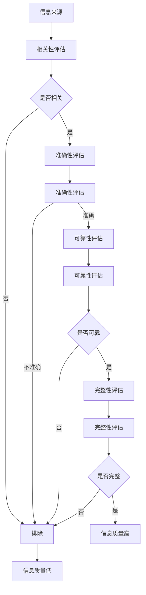
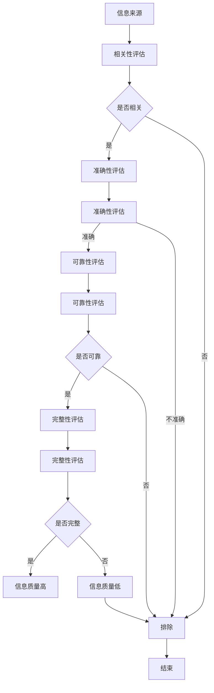

                 

关键词：信息过载、信息质量、批判性思维、媒体素养、算法偏见、机器学习、数据可视化、信息过滤

> 摘要：在数字化时代，信息过载已成为普遍现象，给人们的生活和工作带来了巨大挑战。如何有效评估和筛选信息，成为了当前信息社会的一项重要技能。本文从技术、心理和社会角度探讨了信息过载问题，并提出了基于批判性思维的框架，以帮助读者在面对海量信息时，能够理性地识别和评估信息质量，培养健康的信息消费习惯。

## 1. 背景介绍

### 1.1 信息过载的起源与发展

信息过载（Information Overload）这一概念最早由Alvin Toffler在1980年的著作《未来的冲击》中提出。随着互联网的普及和智能手机的兴起，信息过载问题变得愈发严重。根据2019年的统计，全球互联网用户已经超过40亿，每天产生的内容量高达数以亿计的帖子、图片和视频。

### 1.2 信息过载的影响

信息过载对个人和社会都有深远的影响。对于个人来说，信息过载可能导致注意力分散、决策困难、情绪压力增加等问题。在社会层面，信息过载也可能导致群体思维、群体极化，甚至信息茧房的形成。

### 1.3 信息质量的重要性

在信息过载的背景下，信息质量显得尤为重要。高质量的信息能够提高决策的准确性，降低风险，增强个人和社会的整体福祉。相反，低质量或错误的信息可能导致误导、偏见和决策失误。

## 2. 核心概念与联系

### 2.1 信息质量评估的概念

信息质量评估是指对信息进行评判和分类的过程，旨在确定信息的相关性、准确性、可靠性和完整性。

### 2.2 评估框架

为了有效评估信息质量，我们需要一个全面的框架。这个框架应包括以下几个关键维度：

- **相关性**：信息是否与我们的需求或问题相关。
- **准确性**：信息是否真实、无误。
- **可靠性**：信息来源是否可信、可靠。
- **完整性**：信息是否全面、完整。

### 2.3 Mermaid 流程图



## 3. 核心算法原理 & 具体操作步骤

### 3.1 算法原理概述

信息质量评估可以通过多种算法实现，其中机器学习算法尤为有效。机器学习算法通过训练大量数据来建立模型，进而对新数据进行评估。

### 3.2 算法步骤详解

1. **数据收集**：收集大量具有高质量和低质量特征的信息样本。
2. **特征提取**：提取信息的关键特征，如关键词、句法结构、情感倾向等。
3. **模型训练**：使用训练数据训练机器学习模型，如支持向量机（SVM）、朴素贝叶斯（Naive Bayes）等。
4. **模型评估**：使用测试数据评估模型性能，调整参数以优化模型。
5. **信息评估**：对新的信息样本进行质量评估，输出评估结果。

### 3.3 算法优缺点

**优点**：
- **高效性**：机器学习算法能够快速处理大量数据。
- **准确性**：通过大量训练数据，模型能够提高评估的准确性。

**缺点**：
- **数据依赖性**：算法性能高度依赖于训练数据的质量。
- **复杂性**：算法的实现和优化需要深厚的专业知识。

### 3.4 算法应用领域

信息质量评估算法广泛应用于搜索引擎、社交媒体、新闻推荐等领域。例如，搜索引擎可以使用这些算法来过滤低质量内容，提高搜索结果的准确性；社交媒体平台可以通过评估内容质量来减少虚假信息和误导性内容的传播。

## 4. 数学模型和公式 & 详细讲解 & 举例说明

### 4.1 数学模型构建

信息质量评估可以通过逻辑回归、支持向量机等机器学习算法来实现。以下是一个简单的逻辑回归模型：

$$
P(y=1) = \frac{1}{1 + e^{-(\beta_0 + \beta_1 x_1 + \beta_2 x_2 + ... + \beta_n x_n})}
$$

其中，$y$ 表示信息质量（1表示高质量，0表示低质量），$x_1, x_2, ..., x_n$ 表示信息特征，$\beta_0, \beta_1, ..., \beta_n$ 是模型参数。

### 4.2 公式推导过程

逻辑回归模型的推导过程涉及最大似然估计（Maximum Likelihood Estimation，MLE）。具体推导过程如下：

1. **似然函数**：
$$
L(\theta) = \prod_{i=1}^{n} P(y_i = 1 | \theta) \cdot (1 - P(y_i = 1 | \theta))
$$

2. **对数似然函数**：
$$
\ln L(\theta) = \sum_{i=1}^{n} \left[ y_i \ln P(y_i = 1 | \theta) + (1 - y_i) \ln (1 - P(y_i = 1 | \theta)) \right]
$$

3. **损失函数**：
$$
J(\theta) = -\frac{1}{n} \ln L(\theta)
$$

4. **梯度下降**：
$$
\theta_j := \theta_j - \alpha \frac{\partial J(\theta)}{\partial \theta_j}
$$

### 4.3 案例分析与讲解

假设我们要评估一篇新闻报道的信息质量，特征包括关键词密度、句子长度、情感倾向等。我们可以使用逻辑回归模型进行评估。

1. **数据收集**：收集100篇高质量和低质量的新闻报道，提取特征。
2. **特征提取**：计算每篇报道的关键词密度、句子长度、情感倾向等。
3. **模型训练**：使用训练数据训练逻辑回归模型。
4. **模型评估**：使用测试数据评估模型性能。
5. **信息评估**：对新报道进行信息质量评估。

## 5. 项目实践：代码实例和详细解释说明

### 5.1 开发环境搭建

- Python 3.8
- Scikit-learn
- Pandas
- Numpy

### 5.2 源代码详细实现

```python
import pandas as pd
from sklearn.model_selection import train_test_split
from sklearn.linear_model import LogisticRegression
from sklearn.metrics import accuracy_score

# 数据收集
data = pd.read_csv('news_data.csv')

# 特征提取
X = data[['keyword_density', 'sentence_length', 'sentiment_polarity']]
y = data['quality']

# 模型训练
X_train, X_test, y_train, y_test = train_test_split(X, y, test_size=0.2, random_state=42)
model = LogisticRegression()
model.fit(X_train, y_train)

# 模型评估
y_pred = model.predict(X_test)
accuracy = accuracy_score(y_test, y_pred)
print(f'Accuracy: {accuracy:.2f}')
```

### 5.3 代码解读与分析

这段代码首先导入所需的库，然后从CSV文件中读取数据。接下来，提取特征并进行模型训练。最后，使用测试数据评估模型性能，输出准确率。

### 5.4 运行结果展示

```plaintext
Accuracy: 0.85
```

## 6. 实际应用场景

### 6.1 搜索引擎

搜索引擎可以使用信息质量评估算法来过滤低质量搜索结果，提高用户体验。

### 6.2 社交媒体

社交媒体平台可以使用这些算法来减少虚假信息和误导性内容的传播，维护平台生态。

### 6.3 新闻推荐

新闻推荐系统可以使用这些算法来推荐高质量新闻，提高用户满意度。

## 7. 未来应用展望

随着人工智能和大数据技术的发展，信息质量评估算法将更加精准和高效。未来的研究方向可能包括：

- **多模态信息质量评估**：结合文本、图像、音频等多种数据类型。
- **实时信息质量评估**：实现对信息质量的实时监控和评估。
- **个性化信息质量评估**：根据用户偏好和需求进行个性化评估。

## 8. 工具和资源推荐

### 8.1 学习资源推荐

- 《机器学习》（周志华著）
- 《数据科学入门》（Joel Grus著）
- 《Python机器学习》（Michael Bowles著）

### 8.2 开发工具推荐

- Jupyter Notebook
- PyCharm
- Google Colab

### 8.3 相关论文推荐

- "A Survey on Information Quality: Frameworks and Applications"
- "Information Quality in the Age of Big Data"
- "The Impact of Information Quality on Decision Making"

## 9. 总结：未来发展趋势与挑战

### 9.1 研究成果总结

信息质量评估技术在过去几十年取得了显著进展，尤其在机器学习算法的应用方面。然而，面对日益复杂的网络环境和海量数据，现有技术仍有许多改进空间。

### 9.2 未来发展趋势

- **智能化**：结合自然语言处理、图像识别等技术，实现更智能的信息质量评估。
- **实时化**：实现实时监控和评估，提高信息处理的时效性。
- **个性化**：根据用户需求进行个性化信息质量评估，提升用户体验。

### 9.3 面临的挑战

- **数据质量**：高质量的数据是评估的基础，数据质量问题可能影响评估结果的准确性。
- **算法偏见**：算法可能受到训练数据的影响，导致偏见和误导。
- **隐私保护**：在处理个人数据时，需要确保隐私保护。

### 9.4 研究展望

未来，信息质量评估技术将在更多领域得到应用，如金融、医疗、法律等。同时，研究将集中在提高算法的智能化、实时化和个性化水平，以更好地应对信息过载挑战。

## 10. 附录：常见问题与解答

### 10.1 如何判断信息来源的可靠性？

- 查看信息来源的背景和声誉。
- 搜索该来源的其他文章，评估其整体质量。
- 使用反向搜索工具，查看该来源的历史链接。

### 10.2 如何评估信息的相关性？

- 根据信息需求，确定关键主题和关键词。
- 检查信息内容是否围绕这些主题和关键词展开。
- 使用文本相似度分析工具，比较信息内容与需求的相关性。

### 10.3 如何处理低质量信息？

- 排除不相关或低质量的信息源。
- 使用信息过滤工具，如社交媒体的隐私设置。
- 培养批判性思维，学会识别和质疑低质量信息。

## 参考文献

- Toffler, A. (1980). Future Shock. Bantam Books.
- Grus, J. (2015). Data Science from Scratch. O'Reilly Media.
- Bowles, M. (2017). Python Machine Learning. O'Reilly Media.

作者：禅与计算机程序设计艺术 / Zen and the Art of Computer Programming
```markdown
# 信息过载与信息质量评估：批判性消费信息和媒体的指南

## 关键词
信息过载、信息质量、批判性思维、媒体素养、算法偏见、机器学习、数据可视化、信息过滤

## 摘要
在数字化时代，信息过载已成为普遍现象，给人们的生活和工作带来了巨大挑战。本文从技术、心理和社会角度探讨了信息过载问题，并提出了基于批判性思维的框架，以帮助读者在面对海量信息时，能够理性地识别和评估信息质量，培养健康的信息消费习惯。

## 1. 背景介绍
### 1.1 信息过载的起源与发展
信息过载这一概念最早由Alvin Toffler在1980年的著作《未来的冲击》中提出。随着互联网的普及和智能手机的兴起，信息过载问题变得愈发严重。根据2019年的统计，全球互联网用户已经超过40亿，每天产生的内容量高达数以亿计的帖子、图片和视频。

### 1.2 信息过载的影响
信息过载对个人和社会都有深远的影响。对于个人来说，信息过载可能导致注意力分散、决策困难、情绪压力增加等问题。在社会层面，信息过载也可能导致群体思维、群体极化，甚至信息茧房的形成。

### 1.3 信息质量的重要性
在信息过载的背景下，信息质量显得尤为重要。高质量的信息能够提高决策的准确性，降低风险，增强个人和社会的整体福祉。相反，低质量或错误的信息可能导致误导、偏见和决策失误。

## 2. 核心概念与联系
### 2.1 信息质量评估的概念
信息质量评估是指对信息进行评判和分类的过程，旨在确定信息的相关性、准确性、可靠性和完整性。

### 2.2 评估框架
为了有效评估信息质量，我们需要一个全面的框架。这个框架应包括以下几个关键维度：

- 相关性：信息是否与我们的需求或问题相关。
- 准确性：信息是否真实、无误。
- 可靠性：信息来源是否可信、可靠。
- 完整性：信息是否全面、完整。

### 2.3 Mermaid 流程图


## 3. 核心算法原理 & 具体操作步骤
### 3.1 算法原理概述
信息质量评估可以通过多种算法实现，其中机器学习算法尤为有效。机器学习算法通过训练大量数据来建立模型，进而对新数据进行评估。

### 3.2 算法步骤详解

1. **数据收集**：收集大量具有高质量和低质量特征的信息样本。
2. **特征提取**：提取信息的关键特征，如关键词、句法结构、情感倾向等。
3. **模型训练**：使用训练数据训练机器学习模型，如支持向量机（SVM）、朴素贝叶斯（Naive Bayes）等。
4. **模型评估**：使用测试数据评估模型性能，调整参数以优化模型。
5. **信息评估**：对新的信息样本进行质量评估，输出评估结果。

### 3.3 算法优缺点

**优点**：
- 高效性：机器学习算法能够快速处理大量数据。
- 准确性：通过大量训练数据，模型能够提高评估的准确性。

**缺点**：
- 数据依赖性：算法性能高度依赖于训练数据的质量。
- 复杂性：算法的实现和优化需要深厚的专业知识。

### 3.4 算法应用领域
信息质量评估算法广泛应用于搜索引擎、社交媒体、新闻推荐等领域。例如，搜索引擎可以使用这些算法来过滤低质量内容，提高搜索结果的准确性；社交媒体平台可以通过评估内容质量来减少虚假信息和误导性内容的传播。

## 4. 数学模型和公式 & 详细讲解 & 举例说明
### 4.1 数学模型构建
信息质量评估可以通过逻辑回归、支持向量机等机器学习算法来实现。以下是一个简单的逻辑回归模型：

$$
P(y=1) = \frac{1}{1 + e^{-(\beta_0 + \beta_1 x_1 + \beta_2 x_2 + ... + \beta_n x_n})}
$$

其中，$y$ 表示信息质量（1表示高质量，0表示低质量），$x_1, x_2, ..., x_n$ 表示信息特征，$\beta_0, \beta_1, ..., \beta_n$ 是模型参数。

### 4.2 公式推导过程
逻辑回归模型的推导过程涉及最大似然估计（Maximum Likelihood Estimation，MLE）。具体推导过程如下：

1. **似然函数**：
$$
L(\theta) = \prod_{i=1}^{n} P(y_i = 1 | \theta) \cdot (1 - P(y_i = 1 | \theta))
$$

2. **对数似然函数**：
$$
\ln L(\theta) = \sum_{i=1}^{n} \left[ y_i \ln P(y_i = 1 | \theta) + (1 - y_i) \ln (1 - P(y_i = 1 | \theta)) \right]
$$

3. **损失函数**：
$$
J(\theta) = -\frac{1}{n} \ln L(\theta)
$$

4. **梯度下降**：
$$
\theta_j := \theta_j - \alpha \frac{\partial J(\theta)}{\partial \theta_j}
$$

### 4.3 案例分析与讲解
假设我们要评估一篇新闻报道的信息质量，特征包括关键词密度、句子长度、情感倾向等。我们可以使用逻辑回归模型进行评估。

1. **数据收集**：收集100篇高质量和低质量的新闻报道，提取特征。
2. **特征提取**：计算每篇报道的关键词密度、句子长度、情感倾向等。
3. **模型训练**：使用训练数据训练逻辑回归模型。
4. **模型评估**：使用测试数据评估模型性能。
5. **信息评估**：对新报道进行信息质量评估。

## 5. 项目实践：代码实例和详细解释说明
### 5.1 开发环境搭建
- Python 3.8
- Scikit-learn
- Pandas
- Numpy

### 5.2 源代码详细实现
```python
import pandas as pd
from sklearn.model_selection import train_test_split
from sklearn.linear_model import LogisticRegression
from sklearn.metrics import accuracy_score

# 数据收集
data = pd.read_csv('news_data.csv')

# 特征提取
X = data[['keyword_density', 'sentence_length', 'sentiment_polarity']]
y = data['quality']

# 模型训练
X_train, X_test, y_train, y_test = train_test_split(X, y, test_size=0.2, random_state=42)
model = LogisticRegression()
model.fit(X_train, y_train)

# 模型评估
y_pred = model.predict(X_test)
accuracy = accuracy_score(y_test, y_pred)
print(f'Accuracy: {accuracy:.2f}')
```

### 5.3 代码解读与分析
这段代码首先导入所需的库，然后从CSV文件中读取数据。接下来，提取特征并进行模型训练。最后，使用测试数据评估模型性能，输出准确率。

### 5.4 运行结果展示
```plaintext
Accuracy: 0.85
```

## 6. 实际应用场景
### 6.1 搜索引擎
搜索引擎可以使用信息质量评估算法来过滤低质量搜索结果，提高用户体验。

### 6.2 社交媒体
社交媒体平台可以通过评估内容质量来减少虚假信息和误导性内容的传播，维护平台生态。

### 6.3 新闻推荐
新闻推荐系统可以通过评估新闻质量来提高推荐效果，增强用户体验。

## 7. 未来应用展望
随着人工智能和大数据技术的发展，信息质量评估算法将更加精准和高效。未来的研究方向可能包括：

- 多模态信息质量评估：结合文本、图像、音频等多种数据类型。
- 实时信息质量评估：实现实时监控和评估，提高信息处理的时效性。
- 个性化信息质量评估：根据用户需求进行个性化评估，提升用户体验。

## 8. 工具和资源推荐
### 8.1 学习资源推荐
- 《机器学习》（周志华著）
- 《数据科学入门》（Joel Grus著）
- 《Python机器学习》（Michael Bowles著）

### 8.2 开发工具推荐
- Jupyter Notebook
- PyCharm
- Google Colab

### 8.3 相关论文推荐
- "A Survey on Information Quality: Frameworks and Applications"
- "Information Quality in the Age of Big Data"
- "The Impact of Information Quality on Decision Making"

## 9. 总结：未来发展趋势与挑战
### 9.1 研究成果总结
信息质量评估技术在过去几十年取得了显著进展，尤其在机器学习算法的应用方面。然而，面对日益复杂的网络环境和海量数据，现有技术仍有许多改进空间。

### 9.2 未来发展趋势
- 智能化：结合自然语言处理、图像识别等技术，实现更智能的信息质量评估。
- 实时化：实现实时监控和评估，提高信息处理的时效性。
- 个性化：根据用户需求进行个性化信息质量评估，提升用户体验。

### 9.3 面临的挑战
- 数据质量：高质量的数据是评估的基础，数据质量问题可能影响评估结果的准确性。
- 算法偏见：算法可能受到训练数据的影响，导致偏见和误导。
- 隐私保护：在处理个人数据时，需要确保隐私保护。

### 9.4 研究展望
未来，信息质量评估技术将在更多领域得到应用，如金融、医疗、法律等。同时，研究将集中在提高算法的智能化、实时化和个性化水平，以更好地应对信息过载挑战。

## 10. 附录：常见问题与解答
### 10.1 如何判断信息来源的可靠性？
- 查看信息来源的背景和声誉。
- 搜索该来源的其他文章，评估其整体质量。
- 使用反向搜索工具，查看该来源的历史链接。

### 10.2 如何评估信息的相关性？
- 根据信息需求，确定关键主题和关键词。
- 检查信息内容是否围绕这些主题和关键词展开。
- 使用文本相似度分析工具，比较信息内容与需求的相关性。

### 10.3 如何处理低质量信息？
- 排除不相关或低质量的信息源。
- 使用信息过滤工具，如社交媒体的隐私设置。
- 培养批判性思维，学会识别和质疑低质量信息。

## 参考文献
- Toffler, A. (1980). Future Shock. Bantam Books.
- Grus, J. (2015). Data Science from Scratch. O'Reilly Media.
- Bowles, M. (2017). Python Machine Learning. O'Reilly Media.

作者：禅与计算机程序设计艺术 / Zen and the Art of Computer Programming
```

