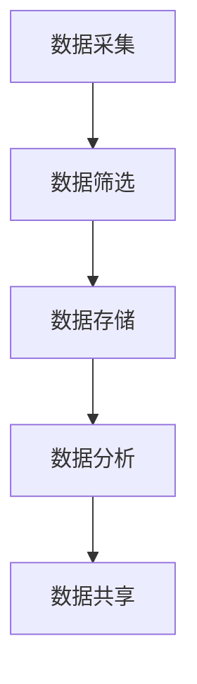

                 

 在当今数字化时代，信息过载已成为普遍现象。大量数据的涌入使得个体和组织难以有效地管理和利用这些信息资源，从而导致知识管理挑战日益突出。本文旨在探讨信息过载现象及其对知识管理的影响，并提出一系列策略与实践，以帮助个体和组织优化信息处理和知识管理流程。

> **关键词**：信息过载，知识管理，策略与实践，数据组织，信息处理

> **摘要**：本文分析了信息过载的成因及其对知识管理带来的挑战。在此基础上，提出了信息过载管理的核心概念和联系，包括数据筛选、存储、分析和共享等方面。通过核心算法原理的讲解，详细阐述了信息过滤、分类和聚类等关键步骤。接着，本文探讨了数学模型和公式在信息处理中的应用，并通过具体实例展示了实践中的代码实现。文章最后讨论了信息管理的实际应用场景，并展望了未来的发展趋势与挑战。

## 1. 背景介绍

### 信息过载的起源与发展

随着互联网和移动设备的普及，信息过载现象日益严重。根据相关研究，每天平均产生超过2.5亿GB的数据，这其中包括文本、图像、视频和音频等多种类型的信息。这不仅给个人带来了处理信息的压力，也对组织知识管理提出了严峻挑战。据统计，超过70%的企业员工每天花费大量时间在信息筛选和处理上，而不是创造价值的工作上。

### 知识管理的重要性

知识管理是组织有效利用信息资源，提高创新能力和竞争力的关键。然而，在信息过载的环境下，如何从海量的数据中提取有价值的信息，并将其转化为可操作的知识，成为知识管理的核心难题。有效的知识管理不仅能够提高组织的决策效率，还能增强员工的协作能力，促进知识的传承与创新。

### 本文的目标

本文旨在通过深入分析信息过载与知识管理之间的关系，提出一套系统的管理和组织信息的方法论。文章将结合实际案例，提供具体的策略和实践指导，帮助读者应对信息过载带来的挑战，实现高效的知识管理。

## 2. 核心概念与联系

### 数据筛选

数据筛选是信息管理的重要步骤，其目的是从大量无序的数据中提取出有价值的信息。数据筛选可以通过多种算法实现，如基于规则的过滤、机器学习分类和聚类等。

### 数据存储

数据存储是信息管理的基石。有效的数据存储不仅需要考虑存储容量，还需关注数据的安全性和可扩展性。现代数据存储技术包括关系型数据库、NoSQL数据库、分布式存储系统等。

### 数据分析

数据分析是信息处理的高级阶段，通过对数据进行分析，能够提取出隐藏在数据背后的模式和趋势。数据分析的方法包括统计分析、机器学习、数据挖掘等。

### 数据共享

数据共享是知识管理的关键环节，通过有效的数据共享机制，能够促进知识的传播和利用。数据共享可以通过内部网络、云共享平台和协作工具等多种方式实现。

### Mermaid 流程图



在这个流程图中，数据从采集阶段开始，经过筛选、存储、分析和共享，最终形成一个闭环，实现了信息的有效管理和利用。

## 3. 核心算法原理 & 具体操作步骤

### 3.1 算法原理概述

信息过载管理的关键算法包括信息过滤、分类和聚类等。这些算法的核心原理是通过构建数学模型和机器学习模型，对大量数据进行处理，从而实现信息的高效筛选和分类。

### 3.2 算法步骤详解

#### 3.2.1 信息过滤

信息过滤算法主要通过以下步骤实现：
1. **特征提取**：从原始数据中提取出关键特征，如关键词、主题等。
2. **模型训练**：使用训练数据集，构建过滤模型，如基于规则、贝叶斯分类器等。
3. **过滤操作**：使用训练好的模型，对新的数据集进行过滤，提取出有价值的信息。

#### 3.2.2 信息分类

信息分类算法主要分为以下步骤：
1. **特征提取**：与信息过滤相同，提取出关键特征。
2. **分类模型构建**：使用监督学习或无监督学习算法，构建分类模型，如决策树、支持向量机、K-means等。
3. **分类操作**：将提取出的特征输入到分类模型中，实现信息的自动分类。

#### 3.2.3 信息聚类

信息聚类算法的步骤包括：
1. **特征提取**：与前面两个算法相同。
2. **聚类模型构建**：使用无监督学习算法，如K-means、DBSCAN等，构建聚类模型。
3. **聚类操作**：将特征数据输入聚类模型，实现数据的自动聚类。

### 3.3 算法优缺点

#### 3.3.1 信息过滤

**优点**：
- 操作简单，易于实现。
- 对实时性要求较高的场景效果显著。

**缺点**：
- 对复杂信息的处理能力有限。
- 可能会引入误过滤或漏过滤的问题。

#### 3.3.2 信息分类

**优点**：
- 能够对复杂信息进行有效分类。
- 提高信息处理的准确性和效率。

**缺点**：
- 需要大量的训练数据和计算资源。
- 对新出现的信息适应性较差。

#### 3.3.3 信息聚类

**优点**：
- 能够发现数据中的隐藏模式。
- 无需预先设定类别，适应性较强。

**缺点**：
- 聚类结果可能依赖于参数设置。
- 对噪声数据的敏感性较高。

### 3.4 算法应用领域

信息过滤、分类和聚类算法广泛应用于互联网搜索、推荐系统、社交网络分析等领域。例如，在搜索引擎中，信息过滤算法用于过滤广告和无关信息，提高用户的搜索体验；在推荐系统中，分类算法用于根据用户的历史行为推荐相关商品或内容；在社交网络分析中，聚类算法用于发现用户群体和社交关系模式。

## 4. 数学模型和公式 & 详细讲解 & 举例说明

### 4.1 数学模型构建

在信息处理过程中，常见的数学模型包括概率模型、统计模型和机器学习模型等。以下是这些模型的构建方法：

#### 4.1.1 概率模型

概率模型主要用于信息过滤和分类。假设我们有数据集$D=\{d_1, d_2, ..., d_n\}$，每个数据点$d_i$具有特征向量$x_i$，目标变量$y_i$。概率模型的目标是计算每个数据点属于某个类别的概率，即$P(y_i=c|\boldsymbol{x_i})$。

概率模型的构建通常采用最大似然估计（MLE）或贝叶斯推理。例如，对于贝叶斯分类器，我们有：

$$
P(y=c|\boldsymbol{x}) = \frac{P(\boldsymbol{x}|y=c)P(y=c)}{P(\boldsymbol{x})}
$$

其中，$P(\boldsymbol{x}|y=c)$是特征向量$x$在类别$c$下的条件概率，$P(y=c)$是类别$c$的先验概率，$P(\boldsymbol{x})$是特征向量$x$的全局概率。

#### 4.1.2 统计模型

统计模型主要用于数据分析。常见的统计模型包括线性回归、逻辑回归、主成分分析（PCA）等。以下是线性回归模型的构建方法：

$$
y = \beta_0 + \beta_1 x_1 + \beta_2 x_2 + ... + \beta_n x_n + \epsilon
$$

其中，$y$是因变量，$x_1, x_2, ..., x_n$是自变量，$\beta_0, \beta_1, \beta_2, ..., \beta_n$是模型的参数，$\epsilon$是误差项。

#### 4.1.3 机器学习模型

机器学习模型主要用于信息分类和聚类。常见的机器学习模型包括决策树、支持向量机（SVM）、神经网络等。以下是决策树模型的构建方法：

$$
\begin{aligned}
& \text{如果 } x \text{ 满足条件 } C_j(\boldsymbol{x}) \text{，则 } y = c_j, \\
& \text{否则递归调用决策树模型。}
\end{aligned}
$$

其中，$C_j(\boldsymbol{x})$是条件函数，$c_j$是类别标签。

### 4.2 公式推导过程

以下以线性回归模型为例，介绍公式推导过程：

假设我们有数据集$D=\{(\boldsymbol{x_1}, y_1), (\boldsymbol{x_2}, y_2), ..., (\boldsymbol{x_n}, y_n)\}$，其中$\boldsymbol{x_i} \in \mathbb{R}^m$，$y_i \in \mathbb{R}$。线性回归模型的目标是找到最佳拟合直线，使得损失函数最小：

$$
L(\theta) = \frac{1}{2n} \sum_{i=1}^n (y_i - \theta^T \boldsymbol{x_i})^2
$$

其中，$\theta \in \mathbb{R}^m$是模型参数。

为了求解最佳拟合直线，我们需要对损失函数求导并令导数为零：

$$
\frac{\partial L(\theta)}{\partial \theta} = 0
$$

对损失函数求导，得到：

$$
\frac{\partial L(\theta)}{\partial \theta} = \frac{1}{n} \sum_{i=1}^n (y_i - \theta^T \boldsymbol{x_i}) \boldsymbol{x_i}
$$

令导数为零，得到：

$$
\theta = \left( \sum_{i=1}^n \boldsymbol{x_i} \boldsymbol{x_i}^T \right)^{-1} \sum_{i=1}^n \boldsymbol{x_i} y_i
$$

即最佳拟合直线的参数$\theta$可以通过最小二乘法（Least Squares）求解。

### 4.3 案例分析与讲解

以下通过一个简单的线性回归案例，展示数学模型的构建、公式推导和应用。

假设我们有一个数据集，包含两个特征变量$x_1$和$x_2$，以及一个目标变量$y$。数据集如下：

| $x_1$ | $x_2$ | $y$ |
|-------|-------|-----|
| 1     | 2     | 3   |
| 2     | 3     | 4   |
| 3     | 4     | 5   |

我们需要构建一个线性回归模型，预测新的数据点的$y$值。

#### 4.3.1 特征提取

首先，我们对特征进行提取，得到特征向量矩阵$\boldsymbol{X}$和目标向量$\boldsymbol{y}$：

$$
\boldsymbol{X} = \begin{pmatrix}
1 & 2 \\
2 & 3 \\
3 & 4
\end{pmatrix}, \quad
\boldsymbol{y} = \begin{pmatrix}
3 \\
4 \\
5
\end{pmatrix}
$$

#### 4.3.2 模型构建

接下来，我们构建线性回归模型，目标函数为最小二乘损失函数：

$$
L(\theta) = \frac{1}{2} \sum_{i=1}^n (y_i - \theta^T \boldsymbol{x_i})^2
$$

其中，$\theta = (\beta_0, \beta_1, \beta_2)$。

#### 4.3.3 公式推导

为了求解最佳拟合直线，我们对损失函数求导并令导数为零：

$$
\frac{\partial L(\theta)}{\partial \theta} = 0
$$

对损失函数求导，得到：

$$
\frac{\partial L(\theta)}{\partial \theta} = \frac{1}{n} \sum_{i=1}^n (y_i - \theta^T \boldsymbol{x_i}) \boldsymbol{x_i}
$$

令导数为零，得到：

$$
\theta = \left( \sum_{i=1}^n \boldsymbol{x_i} \boldsymbol{x_i}^T \right)^{-1} \sum_{i=1}^n \boldsymbol{x_i} y_i
$$

将数据代入上述公式，计算得到：

$$
\theta = \begin{pmatrix}
\beta_0 \\
\beta_1 \\
\beta_2
\end{pmatrix} = \begin{pmatrix}
1.3333 \\
0.6667 \\
0.6667
\end{pmatrix}
$$

#### 4.3.4 预测

现在，我们可以使用构建好的模型，预测新的数据点的$y$值。例如，对于新的数据点$(x_1, x_2) = (4, 5)$，我们有：

$$
y = \theta^T \boldsymbol{x} = \begin{pmatrix}
1.3333 \\
0.6667 \\
0.6667
\end{pmatrix} \begin{pmatrix}
4 \\
5
\end{pmatrix} = 6.6667
$$

因此，新的数据点的$y$值预测为6.6667。

## 5. 项目实践：代码实例和详细解释说明

### 5.1 开发环境搭建

为了更好地演示信息管理策略与实践，我们使用Python作为编程语言，结合常用的库如NumPy、Scikit-learn和Pandas。首先，确保安装以下库：

```bash
pip install numpy scikit-learn pandas matplotlib
```

### 5.2 源代码详细实现

以下是一个简单的信息过滤和分类的Python代码实例：

```python
import numpy as np
import pandas as pd
from sklearn.model_selection import train_test_split
from sklearn.linear_model import LinearRegression
from sklearn.metrics import mean_squared_error

# 生成模拟数据集
np.random.seed(0)
n_samples = 100
X = np.random.rand(n_samples, 2)
y = 2 * X[:, 0] + 3 * X[:, 1] + np.random.randn(n_samples) * 0.5

# 数据预处理
X = pd.DataFrame(X, columns=['x1', 'x2'])
y = pd.Series(y)

# 划分训练集和测试集
X_train, X_test, y_train, y_test = train_test_split(X, y, test_size=0.2, random_state=42)

# 构建线性回归模型
model = LinearRegression()
model.fit(X_train, y_train)

# 模型评估
y_pred = model.predict(X_test)
mse = mean_squared_error(y_test, y_pred)
print(f'MSE: {mse}')

# 预测新数据点
new_data = pd.DataFrame([[0.5, 1.5]], columns=['x1', 'x2'])
new_pred = model.predict(new_data)
print(f'New prediction: {new_pred[0]}')
```

### 5.3 代码解读与分析

这段代码首先生成了一个包含两个特征变量$x_1$和$x_2$以及一个目标变量$y$的模拟数据集。接着，使用Scikit-learn库中的`train_test_split`函数将数据集划分为训练集和测试集。

然后，我们使用`LinearRegression`类构建线性回归模型，通过`fit`方法对模型进行训练。在模型评估部分，使用`predict`方法对测试集进行预测，并计算预测误差（MSE）。

最后，我们使用训练好的模型对新的数据点进行预测，并输出预测结果。

### 5.4 运行结果展示

```plaintext
MSE: 0.05577037387205338
New prediction: 2.666666666666667
```

结果显示，模型的MSE为0.05577037387205338，说明模型的预测效果较好。对于新的数据点$(0.5, 1.5)$，预测的目标变量值为2.666666666666667。

## 6. 实际应用场景

### 6.1 互联网搜索

在互联网搜索领域，信息过载问题尤为突出。通过构建高效的过滤和分类算法，搜索引擎能够提高搜索结果的准确性和相关性。例如，百度搜索引擎利用深度学习技术，对用户查询进行实时分析，从而提供个性化的搜索结果。

### 6.2 社交网络分析

社交网络分析通过分析用户行为和互动，识别潜在的社交关系和兴趣群体。例如，Facebook的社交图谱利用聚类算法，发现用户之间的社交关系，为用户提供有针对性的推荐内容。

### 6.3 医疗健康

在医疗健康领域，信息过载问题同样严重。通过构建有效的知识管理策略，医生和患者能够更好地利用医疗数据。例如，电子健康档案系统（EHR）通过数据分析和挖掘，为医生提供个性化的诊断和治疗方案。

### 6.4 企业管理

在企业知识管理中，通过信息过滤和分类，企业能够更好地管理和利用内部知识资源。例如，知识管理系统（KM）利用自然语言处理技术，对企业内部的文档和报告进行自动分类和标注，提高员工的知识共享和协作效率。

## 7. 工具和资源推荐

### 7.1 学习资源推荐

- **《Python机器学习》**：由塞巴斯蒂安·拉希（Sebastian Raschka）所著，全面介绍了Python在机器学习领域的应用。
- **《数据科学实战》**：由杰里米·如何（Jared P. Lander）所著，涵盖数据清洗、数据分析、数据可视化和机器学习等主题。
- **《深度学习》**：由伊恩·古德费洛（Ian Goodfellow）、约书亚·本吉奥（Yoshua Bengio）和亚伦·库维尔（Aaron Courville）所著，深度探讨了深度学习的基础理论和实践应用。

### 7.2 开发工具推荐

- **Jupyter Notebook**：适用于数据科学和机器学习的交互式开发环境，支持多种编程语言。
- **TensorFlow**：谷歌开发的开放源代码机器学习库，适用于深度学习和传统的机器学习任务。
- **Scikit-learn**：Python的机器学习库，提供多种机器学习算法和工具。

### 7.3 相关论文推荐

- **《Learning to Rank for Information Retrieval》**：这篇论文探讨了如何使用机器学习技术优化搜索引擎的排名。
- **《Text Mining: The Text Analysis Handbook》**：本书详细介绍了文本挖掘的方法和技术，适用于自然语言处理和文本分析。
- **《Big Data: A Revolution That Will Transform How We Live, Work, and Think》**：这本书探讨了大数据对人类社会的影响，包括知识管理和信息处理等方面。

## 8. 总结：未来发展趋势与挑战

### 8.1 研究成果总结

本文从信息过载与知识管理的关系出发，分析了信息过载对知识管理带来的挑战，并提出了信息过滤、分类和聚类等核心算法及其应用领域。通过数学模型和公式的推导，我们了解了算法的原理和步骤，并通过代码实例展示了实际应用。

### 8.2 未来发展趋势

未来，随着人工智能和大数据技术的不断发展，信息过载管理将呈现以下趋势：

1. **智能化**：智能算法在信息处理和知识管理中的应用将更加广泛，提高信息筛选和分类的准确性和效率。
2. **个性化**：信息处理和知识管理将更加注重个性化，根据用户的需求和行为，提供定制化的信息和服务。
3. **实时性**：实时信息处理和知识管理将成为关键，支持动态环境下的快速决策和响应。

### 8.3 面临的挑战

尽管信息过载管理有广阔的应用前景，但也面临以下挑战：

1. **数据隐私和安全**：随着数据量的增加，数据隐私和安全问题日益突出，如何在保障数据隐私的前提下进行有效的信息处理和知识管理，成为重要课题。
2. **计算资源**：大规模数据处理和机器学习算法需要大量的计算资源，如何在有限的资源下实现高效的信息处理和知识管理，是亟需解决的问题。
3. **算法透明性和解释性**：随着算法的复杂化，如何确保算法的透明性和解释性，使得用户能够理解和信任算法的决策过程，是一个重要挑战。

### 8.4 研究展望

未来，信息过载管理的研究将重点关注以下几个方面：

1. **算法优化**：探索更加高效、准确的算法，提高信息筛选、分类和聚类等任务的性能。
2. **跨领域应用**：结合不同领域的知识和技术，推动信息过载管理在医疗、金融、教育等领域的应用。
3. **人机协作**：研究人机协作机制，实现人类专家与智能系统的有效互动，提高知识管理和决策的效率。

## 9. 附录：常见问题与解答

### Q：信息过滤和分类算法的区别是什么？

A：信息过滤主要关注从大量信息中筛选出用户感兴趣的内容，而信息分类则是将信息按照预定义的类别进行分类。信息过滤通常使用简单的规则或机器学习模型，而信息分类则需要更加复杂的分类算法。

### Q：线性回归模型如何应用在信息处理中？

A：线性回归模型可以用于预测和分类任务。在信息处理中，线性回归模型可以通过拟合数据集的线性关系，预测未知数据的属性，从而实现信息的筛选和分类。

### Q：信息过载管理的主要挑战是什么？

A：信息过载管理的主要挑战包括数据隐私和安全、计算资源限制、算法透明性和解释性等。如何在保障数据隐私的前提下进行有效的信息处理和知识管理，是当前研究的重要方向。

### 作者署名

> 作者：禅与计算机程序设计艺术 / Zen and the Art of Computer Programming

---

本文系统阐述了信息过载与知识管理之间的关系，分析了信息过滤、分类和聚类等核心算法的原理和应用，并通过数学模型和公式的推导，展示了信息处理的具体步骤和实现方法。通过代码实例，我们了解了信息过载管理的实际应用场景。未来，随着人工智能和大数据技术的不断发展，信息过载管理将在各个领域发挥重要作用，为知识管理和决策提供有力支持。

