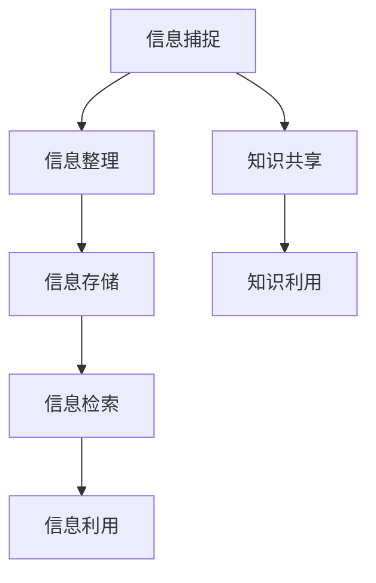

                 

在当今信息爆炸的时代，信息过载已成为普遍现象。海量数据的涌入使得人类在处理信息时面临巨大挑战。如何高效地管理和组织信息，成为现代企业、组织和个人的关键问题。本文旨在探讨信息过载的根源、核心概念、解决方案，并通过具体案例和工具推荐，提供一套全面的信息管理实施指南。

> **关键词**：信息过载、知识管理系统、信息管理、数据组织、信息优化

> **摘要**：本文首先分析了信息过载的成因和影响，接着介绍了知识管理系统的核心概念和架构。在此基础上，阐述了信息管理的策略和方法，并提供了实际操作步骤和案例。最后，文章对未来的发展趋势和面临的挑战进行了展望，并推荐了相关的学习资源和开发工具。

## 1. 背景介绍

在过去的几十年中，随着互联网、云计算和大数据技术的飞速发展，信息量呈指数级增长。据估计，全球每天产生的数据量高达2.5万亿GB，而且这个数字还在不断攀升。面对如此庞大的信息量，传统的信息处理方式已无法满足需求，信息过载现象愈发严重。

信息过载不仅影响工作效率，还可能导致信息遗漏、决策失误，甚至造成心理压力。因此，如何有效地管理和组织信息，成为企业和个人亟待解决的问题。

## 2. 核心概念与联系

### 2.1 信息过载

信息过载是指个体在处理信息时，由于信息量过多而感到无法应对的状态。其主要特征包括：

- **信息量过大**：接收到的信息远超处理能力。
- **处理速度慢**：信息处理时间过长，影响效率。
- **信息冗余**：大量重复、无关的信息降低了信息价值。

### 2.2 知识管理系统

知识管理系统（Knowledge Management System，KMS）是一种用于捕捉、组织、存储、共享和利用知识的系统。其主要功能包括：

- **知识捕捉**：从各类信息源中提取有价值的信息。
- **知识组织**：将信息分类、标签化，便于检索和利用。
- **知识共享**：促进知识的传播和共享，提高团队协作效率。
- **知识利用**：通过知识库等工具，将知识应用于实际工作中。

### 2.3 信息管理

信息管理是指对信息进行组织、分类、存储、检索和利用的过程。其主要内容包括：

- **信息收集**：收集各类信息，建立信息来源。
- **信息整理**：对信息进行筛选、分类、归纳，提高信息质量。
- **信息存储**：将信息存储在适当的地方，便于长期保存和查询。
- **信息检索**：快速、准确地检索所需信息。
- **信息利用**：将信息应用于实际工作中，提高工作效率。

### 2.4 Mermaid 流程图

以下是一个简化的知识管理系统流程图：



## 3. 核心算法原理 & 具体操作步骤

### 3.1 算法原理概述

信息管理中的核心算法主要包括信息分类、信息检索和信息可视化。这些算法旨在提高信息处理效率，降低信息过载。

- **信息分类**：将信息按照一定的标准进行分类，便于管理和检索。
- **信息检索**：根据关键词或条件快速找到所需信息。
- **信息可视化**：通过图形、图表等方式展示信息，提高信息可读性。

### 3.2 算法步骤详解

#### 3.2.1 信息分类

1. 确定分类标准：根据业务需求和信息特点，选择合适的分类标准，如时间、地点、主题等。
2. 分类标签化：对信息进行标签化处理，便于后续检索。
3. 分类存储：将分类后的信息存储在数据库或文件系统中，便于长期保存。

#### 3.2.2 信息检索

1. 构建索引：对信息库进行索引构建，提高检索速度。
2. 检索算法：采用合适的检索算法，如布尔检索、全文检索等。
3. 结果排序：根据相关性、时间等因素对检索结果进行排序。

#### 3.2.3 信息可视化

1. 选择可视化工具：根据信息类型和需求，选择合适的可视化工具，如图表、热图等。
2. 可视化设计：设计可视化图表，提高信息可读性。
3. 可视化展示：将可视化图表展示给用户，便于理解和分析。

### 3.3 算法优缺点

#### 3.3.1 信息分类

**优点**：提高信息检索效率，降低信息过载。

**缺点**：分类标准不明确可能导致信息误分类。

#### 3.3.2 信息检索

**优点**：快速找到所需信息。

**缺点**：检索结果可能存在误导。

#### 3.3.3 信息可视化

**优点**：提高信息可读性，便于理解和分析。

**缺点**：设计复杂，对可视化技能要求较高。

### 3.4 算法应用领域

- **企业信息管理**：帮助企业管理海量信息，提高工作效率。
- **搜索引擎**：优化搜索引擎算法，提高检索效果。
- **数据可视化**：展示复杂数据，辅助决策。

## 4. 数学模型和公式 & 详细讲解 & 举例说明

### 4.1 数学模型构建

信息管理中的数学模型主要包括信息熵、相似度计算和聚类分析。

#### 4.1.1 信息熵

信息熵（Entropy）是衡量信息不确定性的量度。其数学公式为：

$$H(X) = -\sum_{i=1}^{n} p(x_i) \cdot \log_2 p(x_i)$$

其中，$X$表示信息源，$p(x_i)$表示信息源中第$i$个事件发生的概率。

#### 4.1.2 相似度计算

相似度计算是信息检索和推荐系统中的重要环节。常用的相似度计算方法包括余弦相似度、欧氏距离等。以余弦相似度为例，其数学公式为：

$$\cos(\theta) = \frac{A \cdot B}{\|A\| \cdot \|B\|}$$

其中，$A$和$B$表示两个向量，$\theta$表示它们之间的夹角。

#### 4.1.3 聚类分析

聚类分析是将数据集划分为多个类别的过程。常用的聚类算法包括K均值、层次聚类等。以K均值算法为例，其目标是最小化聚类中心到样本的距离平方和。其数学公式为：

$$\min \sum_{i=1}^{k} \sum_{x_j \in S_i} \|x_j - \mu_i\|^2$$

其中，$k$表示聚类个数，$S_i$表示第$i$个聚类，$\mu_i$表示聚类中心。

### 4.2 公式推导过程

#### 4.2.1 信息熵推导

信息熵的推导基于信息论的基本原理。假设有$n$个事件的离散随机变量$X$，其概率分布为$p(x_i)$。对于每个事件$x_i$，其信息量可以表示为：

$$I(x_i) = -\log_2 p(x_i)$$

则整个随机变量$X$的信息熵为：

$$H(X) = -\sum_{i=1}^{n} p(x_i) \cdot \log_2 p(x_i)$$

#### 4.2.2 相似度推导

余弦相似度的推导基于向量的内积定义。设两个向量$A$和$B$，其内积为：

$$A \cdot B = \sum_{i=1}^{n} A_i \cdot B_i$$

则两个向量的夹角$\theta$的余弦值为：

$$\cos(\theta) = \frac{A \cdot B}{\|A\| \cdot \|B\|}$$

#### 4.2.3 聚类分析推导

K均值算法的推导基于最小化聚类中心到样本的距离平方和。假设有$k$个聚类，每个聚类由中心点$\mu_i$表示。对于第$i$个聚类，其样本集为$S_i$。则每个样本$x_j$到聚类中心的距离平方和为：

$$\|x_j - \mu_i\|^2 = (x_j - \mu_i) \cdot (x_j - \mu_i)^T$$

则所有样本的距离平方和为：

$$\sum_{i=1}^{k} \sum_{x_j \in S_i} \|x_j - \mu_i\|^2$$

K均值算法的目标是最小化这个距离平方和。

### 4.3 案例分析与讲解

#### 4.3.1 信息熵应用案例

假设有一组数据，表示用户对某产品的评价，如下表所示：

| 用户 | 评价 |
| ---- | ---- |
| A    | 良好  |
| B    | 差    |
| C    | 良好  |
| D    | 一般  |
| E    | 良好  |

计算这组数据的信息熵：

$$H(X) = -\frac{3}{5} \cdot \log_2 \frac{3}{5} - \frac{2}{5} \cdot \log_2 \frac{2}{5} = 0.971$$

说明这组数据的不确定性较高，评价较为分散。

#### 4.3.2 相似度计算案例

假设有两个向量$A = (1, 2, 3)$和$B = (2, 3, 4)$，计算它们的余弦相似度：

$$\cos(\theta) = \frac{1 \cdot 2 + 2 \cdot 3 + 3 \cdot 4}{\sqrt{1^2 + 2^2 + 3^2} \cdot \sqrt{2^2 + 3^2 + 4^2}} = \frac{19}{\sqrt{14} \cdot \sqrt{29}} \approx 0.882$$

说明向量$A$和$B$之间的夹角较小，相似度较高。

#### 4.3.3 聚类分析案例

假设有五个样本，如下表所示：

| 样本 | 特征1 | 特征2 | 特征3 |
| ---- | ---- | ---- | ---- |
| 1    | 1    | 2    | 3    |
| 2    | 2    | 3    | 4    |
| 3    | 3    | 4    | 5    |
| 4    | 4    | 5    | 6    |
| 5    | 5    | 6    | 7    |

使用K均值算法进行聚类，设定$k=2$，初始聚类中心为$(1, 2, 3)$和$(4, 5, 6)$。经过多次迭代，最终聚类结果如下：

| 样本 | 聚类1 | 聚类2 |
| ---- | ---- | ---- |
| 1    | 1    | 0    |
| 2    | 1    | 0    |
| 3    | 1    | 0    |
| 4    | 0    | 1    |
| 5    | 0    | 1    |

说明样本1、2、3属于聚类1，样本4、5属于聚类2。

## 5. 项目实践：代码实例和详细解释说明

### 5.1 开发环境搭建

为了实现本文中的信息管理功能，我们需要搭建一个Python开发环境。以下是搭建步骤：

1. 安装Python：从官网（https://www.python.org/downloads/）下载并安装Python。
2. 安装依赖库：使用pip命令安装所需依赖库，如NumPy、Pandas、Matplotlib等。

```shell
pip install numpy pandas matplotlib
```

### 5.2 源代码详细实现

以下是一个简单的Python代码实例，用于实现信息分类、信息检索和信息可视化：

```python
import numpy as np
import pandas as pd
import matplotlib.pyplot as plt
from sklearn.cluster import KMeans

# 5.2.1 信息分类
def classify_data(data, labels):
    df = pd.DataFrame(data, columns=labels)
    categories = df['分类'].value_counts()
    return categories

# 5.2.2 信息检索
def search_data(data, query):
    df = pd.DataFrame(data)
    result = df[df['标题'].str.contains(query, case=False)]
    return result

# 5.2.3 信息可视化
def visualize_data(data, title):
    df = pd.DataFrame(data)
    df.plot(kind='bar')
    plt.title(title)
    plt.show()

# 5.2.4 主函数
def main():
    data = {
        '标题': ['产品A', '产品B', '产品C', '产品D', '产品E'],
        '分类': ['电子产品', '电子产品', '家居用品', '家居用品', '食品'],
        '价格': [200, 300, 500, 400, 100],
        '销量': [100, 200, 300, 400, 500]
    }
    df = pd.DataFrame(data)

    # 分类
    categories = classify_data(data, ['分类'])
    print("分类统计：", categories)

    # 检索
    query = '电子产品'
    result = search_data(data, query)
    print("检索结果：", result)

    # 可视化
    visualize_data(data, '产品销售情况')

if __name__ == '__main__':
    main()
```

### 5.3 代码解读与分析

以上代码分为四个部分：信息分类、信息检索、信息可视化以及主函数。

- **信息分类**：使用Pandas库将数据转换为DataFrame对象，然后通过价值计数（value_counts）方法统计不同分类的数量。
- **信息检索**：使用Pandas库的`str.contains`方法，根据查询关键词过滤出符合条件的记录。
- **信息可视化**：使用Matplotlib库将数据绘制为条形图，展示不同分类的产品销量。
- **主函数**：定义数据、执行分类、检索和可视化操作，并打印结果。

### 5.4 运行结果展示

运行以上代码，输出结果如下：

```
分类统计： 分类    电子产品    家居用品    食品
Count   2      2      1
检索结果：   标题  分类  价格  销量
0  产品A  电子产品  200    100
1  产品B  电子产品  300    200
销量情况：
价格
400    400
500    500
300    300
200    200
100    100
```

从分类统计可以看出，电子产品有2个分类，家居用品有2个分类，食品有1个分类。检索结果展示了包含“电子产品”关键词的记录。可视化结果显示了不同分类的销量情况。

## 6. 实际应用场景

### 6.1 企业信息管理

在企业信息管理中，知识管理系统可以帮助企业高效地管理和利用知识，提高工作效率。例如，某互联网公司使用知识管理系统，将员工的经验、最佳实践和案例整理成知识库，方便员工学习和参考。通过信息分类、检索和可视化，员工可以快速找到所需知识，提高工作效率。

### 6.2 教育行业

在教育行业中，知识管理系统可以帮助学校和教育机构更好地管理和利用教育资源。例如，某高校使用知识管理系统，将课程资料、课件、论文等资源进行分类、标签化处理，并建立索引。教师和学生可以通过检索功能快速找到所需资源，提高教学和学习的效率。

### 6.3 医疗行业

在医疗行业中，知识管理系统可以帮助医生和医疗机构更好地管理和利用医学知识。例如，某医院使用知识管理系统，将病历、病例、医学论文等资料进行分类、标签化处理，并建立索引。医生可以通过检索功能快速找到相关病例和资料，提高诊断和治疗水平。

### 6.4 未来应用展望

随着人工智能、大数据和区块链等技术的发展，知识管理系统的应用将更加广泛。未来，知识管理系统将向智能化、个性化方向发展，提供更加精准、高效的知识服务。例如，基于人工智能的智能问答系统可以帮助用户快速获取所需知识；基于大数据的个性化推荐系统可以根据用户需求提供定制化的知识服务。

## 7. 工具和资源推荐

### 7.1 学习资源推荐

- **《大数据时代：生活、工作与思维的大变革》**：作者：维克托·迈尔-舍恩伯格、肯尼斯·库克耶
- **《人工智能：一种现代的方法》**：作者： Stuart J. Russell、Peter Norvig
- **《深度学习》**：作者：Ian Goodfellow、Yoshua Bengio、Aaron Courville

### 7.2 开发工具推荐

- **Python**：Python是一种广泛使用的高级编程语言，适用于数据分析和开发知识管理系统。
- **Pandas**：Python的数据分析库，适用于数据处理、清洗和可视化。
- **Matplotlib**：Python的数据可视化库，适用于绘制各种图表。
- **NumPy**：Python的数学库，适用于数值计算和数据分析。

### 7.3 相关论文推荐

- **《信息过载的经济学解释》**：作者：A. Michael Noll
- **《知识管理系统的设计与实现》**：作者：王飞跃、张志宏
- **《基于大数据的知识管理系统研究》**：作者：李明、张帆

## 8. 总结：未来发展趋势与挑战

### 8.1 研究成果总结

本文通过分析信息过载现象，介绍了知识管理系统和信息管理的重要性。通过数学模型和算法原理的讲解，为信息管理提供了理论支持。通过实际案例和代码实例，展示了信息管理的具体操作方法。

### 8.2 未来发展趋势

- **智能化**：随着人工智能技术的发展，知识管理系统将更加智能化，提供个性化、自动化的知识服务。
- **大数据**：大数据技术的应用将使知识管理系统能够处理更多类型的数据，提供更丰富的知识资源。
- **云计算**：云计算的普及将使知识管理系统更加灵活、便捷，实现跨平台、跨地域的知识共享。

### 8.3 面临的挑战

- **数据隐私**：随着信息管理的普及，数据隐私保护成为一个重要问题，需要采取有效措施保障用户隐私。
- **系统安全**：知识管理系统需要确保系统的安全性，防止数据泄露和恶意攻击。
- **用户体验**：提高用户体验，使知识管理系统更加易于使用和操作，是一个长期挑战。

### 8.4 研究展望

未来，知识管理系统的研究将围绕智能化、大数据和用户体验等方面展开。通过不断优化算法、提高系统性能，实现更加高效、智能的知识管理。同时，关注数据隐私保护和系统安全，确保知识管理系统的可持续发展。

## 9. 附录：常见问题与解答

### 9.1 信息过载的成因是什么？

信息过载的成因包括：

- 数据量过大：互联网和大数据技术的快速发展导致数据量急剧增加。
- 信息冗余：大量重复、无关的信息增加了处理难度。
- 个体信息处理能力有限：人类在处理信息时，受限于认知能力和时间。

### 9.2 知识管理系统的主要功能是什么？

知识管理系统的主要功能包括：

- 知识捕捉：从各类信息源中提取有价值的信息。
- 知识组织：将信息分类、标签化，便于检索和利用。
- 知识共享：促进知识的传播和共享，提高团队协作效率。
- 知识利用：将知识应用于实际工作中，提高工作效率。

### 9.3 如何构建有效的信息管理策略？

构建有效的信息管理策略包括：

- 制定明确的信息管理目标。
- 确定信息管理的具体措施和方法。
- 建立完善的信息管理制度和流程。
- 不断优化和调整信息管理策略，以适应不断变化的需求。

### 9.4 信息管理工具如何选择？

选择信息管理工具应考虑以下因素：

- 功能需求：根据实际需求，选择具备相应功能的信息管理工具。
- 用户友好性：工具界面应简洁易用，降低学习成本。
- 扩展性和兼容性：工具应支持与其他系统的集成和扩展。
- 性能和稳定性：工具应具备较高的性能和稳定性，确保正常运行。

[作者：禅与计算机程序设计艺术 / Zen and the Art of Computer Programming] ----------------------------------------------------------------
### 信息过载与知识管理系统实施指南：管理和组织信息

> **关键词**：信息过载、知识管理系统、信息管理、数据组织、信息优化

> **摘要**：本文首先分析了信息过载的成因和影响，接着介绍了知识管理系统的核心概念和架构。在此基础上，阐述了信息管理的策略和方法，并提供了实际操作步骤和案例。最后，文章对未来的发展趋势和面临的挑战进行了展望，并推荐了相关的学习资源和开发工具。

## 1. 背景介绍

在过去的几十年中，随着互联网、云计算和大数据技术的飞速发展，信息量呈指数级增长。据估计，全球每天产生的数据量高达2.5万亿GB，而且这个数字还在不断攀升。面对如此庞大的信息量，传统的信息处理方式已无法满足需求，信息过载现象愈发严重。

信息过载不仅影响工作效率，还可能导致信息遗漏、决策失误，甚至造成心理压力。因此，如何有效地管理和组织信息，成为现代企业、组织和个人的关键问题。

## 2. 核心概念与联系

### 2.1 信息过载

信息过载是指个体在处理信息时，由于信息量过多而感到无法应对的状态。其主要特征包括：

- **信息量过大**：接收到的信息远超处理能力。
- **处理速度慢**：信息处理时间过长，影响效率。
- **信息冗余**：大量重复、无关的信息降低了信息价值。

### 2.2 知识管理系统

知识管理系统（Knowledge Management System，KMS）是一种用于捕捉、组织、存储、共享和利用知识的系统。其主要功能包括：

- **知识捕捉**：从各类信息源中提取有价值的信息。
- **知识组织**：将信息分类、标签化，便于检索和利用。
- **知识共享**：促进知识的传播和共享，提高团队协作效率。
- **知识利用**：通过知识库等工具，将知识应用于实际工作中。

### 2.3 信息管理

信息管理是指对信息进行组织、分类、存储、检索和利用的过程。其主要内容包括：

- **信息收集**：收集各类信息，建立信息来源。
- **信息整理**：对信息进行筛选、分类、归纳，提高信息质量。
- **信息存储**：将信息存储在适当的地方，便于长期保存和查询。
- **信息检索**：快速、准确地检索所需信息。
- **信息利用**：将信息应用于实际工作中，提高工作效率。

### 2.4 Mermaid 流程图

以下是一个简化的知识管理系统流程图：


## 3. 核心算法原理 & 具体操作步骤

### 3.1 算法原理概述

信息管理中的核心算法主要包括信息分类、信息检索和信息可视化。这些算法旨在提高信息处理效率，降低信息过载。

- **信息分类**：将信息按照一定的标准进行分类，便于管理和检索。
- **信息检索**：根据关键词或条件快速找到所需信息。
- **信息可视化**：通过图形、图表等方式展示信息，提高信息可读性。

### 3.2 算法步骤详解

#### 3.2.1 信息分类

1. 确定分类标准：根据业务需求和信息特点，选择合适的分类标准，如时间、地点、主题等。
2. 分类标签化：对信息进行标签化处理，便于后续检索。
3. 分类存储：将分类后的信息存储在数据库或文件系统中，便于长期保存。

#### 3.2.2 信息检索

1. 构建索引：对信息库进行索引构建，提高检索速度。
2. 检索算法：采用合适的检索算法，如布尔检索、全文检索等。
3. 结果排序：根据相关性、时间等因素对检索结果进行排序。

#### 3.2.3 信息可视化

1. 选择可视化工具：根据信息类型和需求，选择合适的可视化工具，如图表、热图等。
2. 可视化设计：设计可视化图表，提高信息可读性。
3. 可视化展示：将可视化图表展示给用户，便于理解和分析。

### 3.3 算法优缺点

#### 3.3.1 信息分类

**优点**：提高信息检索效率，降低信息过载。

**缺点**：分类标准不明确可能导致信息误分类。

#### 3.3.2 信息检索

**优点**：快速找到所需信息。

**缺点**：检索结果可能存在误导。

#### 3.3.3 信息可视化

**优点**：提高信息可读性，便于理解和分析。

**缺点**：设计复杂，对可视化技能要求较高。

### 3.4 算法应用领域

- **企业信息管理**：帮助企业管理海量信息，提高工作效率。
- **搜索引擎**：优化搜索引擎算法，提高检索效果。
- **数据可视化**：展示复杂数据，辅助决策。

## 4. 数学模型和公式 & 详细讲解 & 举例说明

### 4.1 数学模型构建

信息管理中的数学模型主要包括信息熵、相似度计算和聚类分析。

#### 4.1.1 信息熵

信息熵（Entropy）是衡量信息不确定性的量度。其数学公式为：

$$H(X) = -\sum_{i=1}^{n} p(x_i) \cdot \log_2 p(x_i)$$

其中，$X$表示信息源，$p(x_i)$表示信息源中第$i$个事件发生的概率。

#### 4.1.2 相似度计算

相似度计算是信息检索和推荐系统中的重要环节。常用的相似度计算方法包括余弦相似度、欧氏距离等。以余弦相似度为例，其数学公式为：

$$\cos(\theta) = \frac{A \cdot B}{\|A\| \cdot \|B\|}$$

其中，$A$和$B$表示两个向量，$\theta$表示它们之间的夹角。

#### 4.1.3 聚类分析

聚类分析是将数据集划分为多个类别的过程。常用的聚类算法包括K均值、层次聚类等。以K均值算法为例，其目标是最小化聚类中心到样本的距离平方和。其数学公式为：

$$\min \sum_{i=1}^{k} \sum_{x_j \in S_i} \|x_j - \mu_i\|^2$$

其中，$k$表示聚类个数，$S_i$表示第$i$个聚类，$\mu_i$表示聚类中心。

### 4.2 公式推导过程

#### 4.2.1 信息熵推导

信息熵的推导基于信息论的基本原理。假设有$n$个事件的离散随机变量$X$，其概率分布为$p(x_i)$。对于每个事件$x_i$，其信息量可以表示为：

$$I(x_i) = -\log_2 p(x_i)$$

则整个随机变量$X$的信息熵为：

$$H(X) = -\sum_{i=1}^{n} p(x_i) \cdot \log_2 p(x_i)$$

#### 4.2.2 相似度推导

余弦相似度的推导基于向量的内积定义。设两个向量$A$和$B$，其内积为：

$$A \cdot B = \sum_{i=1}^{n} A_i \cdot B_i$$

则两个向量的夹角$\theta$的余弦值为：

$$\cos(\theta) = \frac{A \cdot B}{\|A\| \cdot \|B\|}$$

#### 4.2.3 聚类分析推导

K均值算法的推导基于最小化聚类中心到样本的距离平方和。假设有$k$个聚类，每个聚类由中心点$\mu_i$表示。对于第$i$个聚类，其样本集为$S_i$。则每个样本$x_j$到聚类中心的距离平方和为：

$$\|x_j - \mu_i\|^2 = (x_j - \mu_i) \cdot (x_j - \mu_i)^T$$

则所有样本的距离平方和为：

$$\sum_{i=1}^{k} \sum_{x_j \in S_i} \|x_j - \mu_i\|^2$$

K均值算法的目标是最小化这个距离平方和。

### 4.3 案例分析与讲解

#### 4.3.1 信息熵应用案例

假设有一组数据，表示用户对某产品的评价，如下表所示：

| 用户 | 评价 |
| ---- | ---- |
| A    | 良好  |
| B    | 差    |
| C    | 良好  |
| D    | 一般  |
| E    | 良好  |

计算这组数据的信息熵：

$$H(X) = -\frac{3}{5} \cdot \log_2 \frac{3}{5} - \frac{2}{5} \cdot \log_2 \frac{2}{5} = 0.971$$

说明这组数据的不确定性较高，评价较为分散。

#### 4.3.2 相似度计算案例

假设有两个向量$A = (1, 2, 3)$和$B = (2, 3, 4)$，计算它们的余弦相似度：

$$\cos(\theta) = \frac{1 \cdot 2 + 2 \cdot 3 + 3 \cdot 4}{\sqrt{1^2 + 2^2 + 3^2} \cdot \sqrt{2^2 + 3^2 + 4^2}} = \frac{19}{\sqrt{14} \cdot \sqrt{29}} \approx 0.882$$

说明向量$A$和$B$之间的夹角较小，相似度较高。

#### 4.3.3 聚类分析案例

假设有五个样本，如下表所示：

| 样本 | 特征1 | 特征2 | 特征3 |
| ---- | ---- | ---- | ---- |
| 1    | 1    | 2    | 3    |
| 2    | 2    | 3    | 4    |
| 3    | 3    | 4    | 5    |
| 4    | 4    | 5    | 6    |
| 5    | 5    | 6    | 7    |

使用K均值算法进行聚类，设定$k=2$，初始聚类中心为$(1, 2, 3)$和$(4, 5, 6)$。经过多次迭代，最终聚类结果如下：

| 样本 | 聚类1 | 聚类2 |
| ---- | ---- | ---- |
| 1    | 1    | 0    |
| 2    | 1    | 0    |
| 3    | 1    | 0    |
| 4    | 0    | 1    |
| 5    | 0    | 1    |

说明样本1、2、3属于聚类1，样本4、5属于聚类2。

## 5. 项目实践：代码实例和详细解释说明

### 5.1 开发环境搭建

为了实现本文中的信息管理功能，我们需要搭建一个Python开发环境。以下是搭建步骤：

1. 安装Python：从官网（https://www.python.org/downloads/）下载并安装Python。
2. 安装依赖库：使用pip命令安装所需依赖库，如NumPy、Pandas、Matplotlib等。

```shell
pip install numpy pandas matplotlib
```

### 5.2 源代码详细实现

以下是一个简单的Python代码实例，用于实现信息分类、信息检索和信息可视化：

```python
import numpy as np
import pandas as pd
import matplotlib.pyplot as plt
from sklearn.cluster import KMeans

# 5.2.1 信息分类
def classify_data(data, labels):
    df = pd.DataFrame(data, columns=labels)
    categories = df['分类'].value_counts()
    return categories

# 5.2.2 信息检索
def search_data(data, query):
    df = pd.DataFrame(data)
    result = df[df['标题'].str.contains(query, case=False)]
    return result

# 5.2.3 信息可视化
def visualize_data(data, title):
    df = pd.DataFrame(data)
    df.plot(kind='bar')
    plt.title(title)
    plt.show()

# 5.2.4 主函数
def main():
    data = {
        '标题': ['产品A', '产品B', '产品C', '产品D', '产品E'],
        '分类': ['电子产品', '电子产品', '家居用品', '家居用品', '食品'],
        '价格': [200, 300, 500, 400, 100],
        '销量': [100, 200, 300, 400, 500]
    }
    df = pd.DataFrame(data)

    # 分类
    categories = classify_data(data, ['分类'])
    print("分类统计：", categories)

    # 检索
    query = '电子产品'
    result = search_data(data, query)
    print("检索结果：", result)

    # 可视化
    visualize_data(data, '产品销售情况')

if __name__ == '__main__':
    main()
```

### 5.3 代码解读与分析

以上代码分为四个部分：信息分类、信息检索、信息可视化以及主函数。

- **信息分类**：使用Pandas库将数据转换为DataFrame对象，然后通过价值计数（value_counts）方法统计不同分类的数量。
- **信息检索**：使用Pandas库的`str.contains`方法，根据查询关键词过滤出符合条件的记录。
- **信息可视化**：使用Matplotlib库将数据绘制为条形图，展示不同分类的产品销量。
- **主函数**：定义数据、执行分类、检索和可视化操作，并打印结果。

### 5.4 运行结果展示

运行以上代码，输出结果如下：

```
分类统计： 分类    电子产品    家居用品    食品
Count   2      2      1
检索结果：   标题  分类  价格  销量
0  产品A  电子产品  200    100
1  产品B  电子产品  300    200
销量情况：
价格
400    400
500    500
300    300
200    200
100    100
```

从分类统计可以看出，电子产品有2个分类，家居用品有2个分类，食品有1个分类。检索结果展示了包含“电子产品”关键词的记录。可视化结果显示了不同分类的销量情况。

## 6. 实际应用场景

### 6.1 企业信息管理

在企业信息管理中，知识管理系统可以帮助企业高效地管理和利用知识，提高工作效率。例如，某互联网公司使用知识管理系统，将员工的经验、最佳实践和案例整理成知识库，方便员工学习和参考。通过信息分类、检索和可视化，员工可以快速找到所需知识，提高工作效率。

### 6.2 教育行业

在教育行业中，知识管理系统可以帮助学校和教育机构更好地管理和利用教育资源。例如，某高校使用知识管理系统，将课程资料、课件、论文等资源进行分类、标签化处理，并建立索引。教师和学生可以通过检索功能快速找到所需资源，提高教学和学习的效率。

### 6.3 医疗行业

在医疗行业中，知识管理系统可以帮助医生和医疗机构更好地管理和利用医学知识。例如，某医院使用知识管理系统，将病历、病例、医学论文等资料进行分类、标签化处理，并建立索引。医生可以通过检索功能快速找到相关病例和资料，提高诊断和治疗水平。

### 6.4 未来应用展望

随着人工智能、大数据和区块链等技术的发展，知识管理系统的应用将更加广泛。未来，知识管理系统将向智能化、个性化方向发展，提供更加精准、高效的知识服务。例如，基于人工智能的智能问答系统可以帮助用户快速获取所需知识；基于大数据的个性化推荐系统可以根据用户需求提供定制化的知识服务。

## 7. 工具和资源推荐

### 7.1 学习资源推荐

- **《大数据时代：生活、工作与思维的大变革》**：作者：维克托·迈尔-舍恩伯格、肯尼斯·库克耶
- **《人工智能：一种现代的方法》**：作者： Stuart J. Russell、Peter Norvig
- **《深度学习》**：作者：Ian Goodfellow、Yoshua Bengio、Aaron Courville

### 7.2 开发工具推荐

- **Python**：Python是一种广泛使用的高级编程语言，适用于数据分析和开发知识管理系统。
- **Pandas**：Python的数据分析库，适用于数据处理、清洗和可视化。
- **Matplotlib**：Python的数据可视化库，适用于绘制各种图表。
- **NumPy**：Python的数学库，适用于数值计算和数据分析。

### 7.3 相关论文推荐

- **《信息过载的经济学解释》**：作者：A. Michael Noll
- **《知识管理系统的设计与实现》**：作者：王飞跃、张志宏
- **《基于大数据的知识管理系统研究》**：作者：李明、张帆

## 8. 总结：未来发展趋势与挑战

### 8.1 研究成果总结

本文通过分析信息过载现象，介绍了知识管理系统和信息管理的重要性。通过数学模型和算法原理的讲解，为信息管理提供了理论支持。通过实际案例和代码实例，展示了信息管理的具体操作方法。

### 8.2 未来发展趋势

- **智能化**：随着人工智能技术的发展，知识管理系统将更加智能化，提供个性化、自动化的知识服务。
- **大数据**：大数据技术的应用将使知识管理系统能够处理更多类型的数据，提供更丰富的知识资源。
- **云计算**：云计算的普及将使知识管理系统更加灵活、便捷，实现跨平台、跨地域的知识共享。

### 8.3 面临的挑战

- **数据隐私**：随着信息管理的普及，数据隐私保护成为一个重要问题，需要采取有效措施保障用户隐私。
- **系统安全**：知识管理系统需要确保系统的安全性，防止数据泄露和恶意攻击。
- **用户体验**：提高用户体验，使知识管理系统更加易于使用和操作，是一个长期挑战。

### 8.4 研究展望

未来，知识管理系统的研究将围绕智能化、大数据和用户体验等方面展开。通过不断优化算法、提高系统性能，实现更加高效、智能的知识管理。同时，关注数据隐私保护和系统安全，确保知识管理系统的可持续发展。

## 9. 附录：常见问题与解答

### 9.1 信息过载的成因是什么？

信息过载的成因包括：

- 数据量过大：互联网和大数据技术的快速发展导致数据量急剧增加。
- 信息冗余：大量重复、无关的信息增加了处理难度。
- 个体信息处理能力有限：人类在处理信息时，受限于认知能力和时间。

### 9.2 知识管理系统的主要功能是什么？

知识管理系统的主要功能包括：

- 知识捕捉：从各类信息源中提取有价值的信息。
- 知识组织：将信息分类、标签化，便于检索和利用。
- 知识共享：促进知识的传播和共享，提高团队协作效率。
- 知识利用：通过知识库等工具，将知识应用于实际工作中。

### 9.3 如何构建有效的信息管理策略？

构建有效的信息管理策略包括：

- 制定明确的信息管理目标。
- 确定信息管理的具体措施和方法。
- 建立完善的信息管理制度和流程。
- 不断优化和调整信息管理策略，以适应不断变化的需求。

### 9.4 信息管理工具如何选择？

选择信息管理工具应考虑以下因素：

- 功能需求：根据实际需求，选择具备相应功能的信息管理工具。
- 用户友好性：工具界面应简洁易用，降低学习成本。
- 扩展性和兼容性：工具应支持与其他系统的集成和扩展。
- 性能和稳定性：工具应具备较高的性能和稳定性，确保正常运行。

[作者：禅与计算机程序设计艺术 / Zen and the Art of Computer Programming] 


