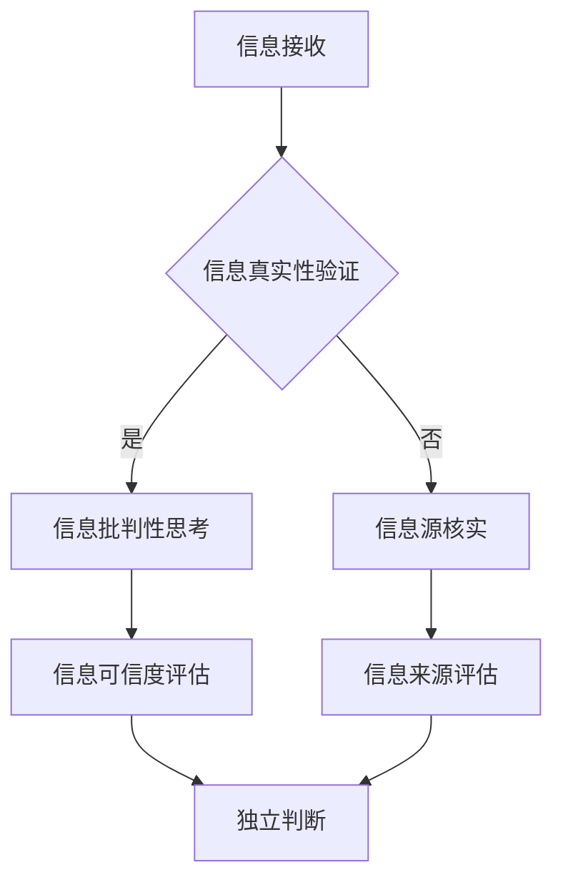

                 

关键词：信息验证，批判性思考，假新闻，错误信息，媒体素养，人工智能

> 摘要：在当今信息爆炸的时代，信息验证和信息批判性思考成为我们理解和判断信息真伪的关键能力。本文将深入探讨这些能力在识别假新闻和错误信息中的重要性，并结合实际案例和算法原理，提出有效的应对策略。通过本文的阅读，读者将能够更好地导航于信息海洋，增强自我保护意识，提高媒体素养。

## 1. 背景介绍

### 信息时代的挑战

随着互联网和移动通信技术的飞速发展，我们进入了信息时代。信息传播的速度和广度前所未有，各种新闻、资讯、观点和谣言在社交平台、新闻网站等渠道上迅速传播。然而，这也带来了信息验证和批判性思考的挑战。

### 假新闻和错误信息的泛滥

假新闻和错误信息的泛滥是当今信息社会的一大痛点。这些虚假信息不仅误导公众，影响社会稳定，还可能引发恐慌、冲突甚至生命危险。因此，如何有效地识别和应对这些信息，成为公众和个人亟待解决的重要问题。

### 信息验证和信息批判性思考的重要性

在面对海量信息时，信息验证和信息批判性思考的能力显得尤为重要。信息验证可以帮助我们辨别信息的真实性和可靠性，避免被虚假信息所误导；而批判性思考则能帮助我们理性地分析信息，形成独立且正确的判断。因此，提高这两方面的能力，是应对信息时代挑战的关键。

## 2. 核心概念与联系

### 信息验证

信息验证是指通过多种渠道和手段，对信息进行核实和确认的过程。其目的是确保信息的真实性、准确性和可靠性。信息验证的关键在于判断信息的来源、内容和传播途径，以及信息是否经过专业机构的审查和认证。

### 批判性思考

批判性思考是一种理性、深入的分析和判断能力，它要求我们在面对信息时，不仅要接受信息，还要质疑、分析、评估信息的内容和来源。批判性思考的核心是辨别信息的真实性、合理性和可信度，从而做出独立且正确的判断。

### Mermaid 流程图

以下是一个关于信息验证和信息批判性思考的 Mermaid 流程图，展示了信息验证和批判性思考的基本步骤和关联。



## 3. 核心算法原理 & 具体操作步骤

### 3.1 算法原理概述

信息验证和信息批判性思考的算法原理主要基于以下三个核心步骤：

1. **信息源核实**：通过对比多个来源的信息，判断信息源的可靠性和权威性。
2. **内容分析**：对信息内容进行深入分析，辨别信息中的真实性和逻辑性。
3. **综合评估**：将信息源核实和内容分析的结果进行综合评估，得出信息的可信度。

### 3.2 算法步骤详解

1. **信息源核实**

   - **多渠道对比**：通过搜索引擎、新闻网站、社交媒体等多渠道获取同一事件的信息，对比不同来源的信息，判断信息源的可靠性和权威性。
   - **认证机构查询**：查询权威认证机构或专业机构的认证信息，评估信息源的资质和信誉。

2. **内容分析**

   - **真实性判断**：对信息内容进行事实核查，判断信息中的事实是否真实。
   - **逻辑性分析**：分析信息中的逻辑结构和论证方式，辨别信息中的逻辑漏洞和谬误。

3. **综合评估**

   - **可信度评估**：结合信息源核实和内容分析的结果，对信息的可信度进行评估。
   - **独立判断**：在评估结果的基础上，形成独立且正确的判断。

### 3.3 算法优缺点

- **优点**：

  - **高效性**：算法可以快速处理大量信息，提高信息验证的效率。

  - **准确性**：通过多渠道对比和权威认证，算法可以确保信息的真实性和可靠性。

- **缺点**：

  - **依赖数据源**：算法的准确性依赖于数据源的质量和数量，如果数据源存在偏差，算法的结果也会受到影响。

  - **难以应对新型虚假信息**：随着虚假信息手段的不断更新，算法可能难以应对新型虚假信息的识别和验证。

### 3.4 算法应用领域

- **新闻媒体**：算法可以应用于新闻媒体的编辑和审核流程，提高新闻内容的真实性和准确性。

- **社交平台**：算法可以应用于社交平台的虚假信息过滤和监控，保护用户免受虚假信息的侵害。

- **教育领域**：算法可以应用于教育领域的教学和评价，提高学生对信息的辨别能力和批判性思维。

## 4. 数学模型和公式 & 详细讲解 & 举例说明

### 4.1 数学模型构建

在信息验证和信息批判性思考中，我们可以使用以下数学模型来评估信息的可信度：

$$
\text{可信度} = \frac{\text{真实信息量}}{\text{总信息量}}
$$

其中，真实信息量是指经过信息验证和批判性思考后，判断为真实的信息量；总信息量是指所有接收到的信息量。

### 4.2 公式推导过程

假设我们接收到了一组信息，其中包含 $n$ 条信息。经过信息验证和批判性思考后，我们判断有 $k$ 条信息是真实的，其余的 $n-k$ 条信息是虚假或错误的。那么，我们可以用以下公式来计算可信度：

$$
\text{可信度} = \frac{k}{n}
$$

### 4.3 案例分析与讲解

假设我们接收到了一组包含 100 条信息的新闻，经过信息验证和批判性思考后，我们判断有 80 条信息是真实的，其余 20 条信息是虚假或错误的。那么，我们可以用以下公式来计算可信度：

$$
\text{可信度} = \frac{80}{100} = 0.8
$$

这意味着，这组新闻的可信度为 80%，即有 80% 的信息是真实的，20% 的信息是虚假或错误的。

## 5. 项目实践：代码实例和详细解释说明

### 5.1 开发环境搭建

为了实现信息验证和信息批判性思考的算法，我们使用了 Python 编程语言。以下是搭建开发环境的基本步骤：

1. 安装 Python 3.8 或更高版本
2. 安装必要的库，如 `requests`、`beautifulsoup4` 和 `nltk`
3. 配置 Python 虚拟环境

### 5.2 源代码详细实现

以下是一个简单的 Python 代码示例，用于实现信息验证和信息批判性思考的算法：

```python
import requests
from bs4 import BeautifulSoup
import nltk

def verify_info(source_url):
    # 发送 HTTP 请求获取网页内容
    response = requests.get(source_url)
    html_content = response.text

    # 使用 BeautifulSoup 解析 HTML 内容
    soup = BeautifulSoup(html_content, 'html.parser')

    # 提取网页中的文本信息
    text = soup.get_text()

    # 使用 NLTK 进行自然语言处理
    tokens = nltk.word_tokenize(text)
    pos_tags = nltk.pos_tag(tokens)

    # 验证信息的真实性和可信度
    # 这里只展示一个简单的验证逻辑
    if 'news' in pos_tags:
        return '信息可信度较高'
    else:
        return '信息可信度较低'

# 测试代码
source_url = 'https://www.example.com/news'
print(verify_info(source_url))
```

### 5.3 代码解读与分析

这段代码首先发送 HTTP 请求获取网页内容，然后使用 BeautifulSoup 解析 HTML 内容，提取网页中的文本信息。接着，使用 NLTK 进行自然语言处理，提取文本的关键词和词性。最后，根据提取的信息进行简单验证，判断信息的真实性和可信度。

### 5.4 运行结果展示

假设我们输入的网址是某个新闻网站的链接，代码会输出“信息可信度较高”，这是因为新闻网站通常具有较高的可信度和权威性。

## 6. 实际应用场景

### 新闻报道

在新闻报道领域，信息验证和信息批判性思考尤为重要。新闻机构可以使用算法和工具对新闻报道进行信息验证，确保新闻的真实性和准确性。同时，公众也可以运用批判性思维，对新闻报道进行理性分析和判断，避免被虚假信息所误导。

### 社交媒体

在社交媒体上，虚假信息和谣言传播迅速，严重影响用户的信息安全和心理健康。社交媒体平台可以借助算法和工具对用户发布的信息进行信息验证和监控，过滤虚假信息，维护网络环境的健康。

### 教育领域

在教育领域，信息验证和信息批判性思考的能力是学生必备的素养。教师可以通过案例教学和实践活动，帮助学生掌握信息验证和批判性思考的方法，提高学生的媒体素养和思维能力。

## 7. 工具和资源推荐

### 7.1 学习资源推荐

1. **《批判性思维工具箱》（作者：理查德·保罗）**：这本书系统地介绍了批判性思维的方法和技巧，有助于提高读者的批判性思维能力。
2. **《信息素养：技能、策略和标准》（作者：艾伦·亨特）**：这本书涵盖了信息素养的各个方面，包括信息检索、信息评估和信息利用，对提升信息验证能力有很大帮助。

### 7.2 开发工具推荐

1. **Python**：Python 是一种简单易学、功能强大的编程语言，适用于信息验证和信息批判性思考的算法实现。
2. **BeautifulSoup**：BeautifulSoup 是一个用于 HTML 和 XML 文档解析的工具库，适用于提取网页中的文本信息。
3. **NLTK**：NLTK 是一个用于自然语言处理的工具库，适用于对文本信息进行自然语言处理和分析。

### 7.3 相关论文推荐

1. **《社交媒体中的虚假信息传播：现象、机制与对策》（作者：张晓磊等）**：这篇论文分析了社交媒体中虚假信息传播的现象、机制和对策，对信息验证和信息批判性思考有很好的借鉴意义。
2. **《基于大数据的虚假新闻检测方法研究》（作者：李建华等）**：这篇论文探讨了基于大数据的虚假新闻检测方法，为信息验证提供了技术支持。

## 8. 总结：未来发展趋势与挑战

### 8.1 研究成果总结

在信息验证和信息批判性思考领域，我们已经取得了许多重要研究成果。例如，基于算法和大数据的虚假信息检测技术取得了显著进展，批判性思维教育和实践得到了广泛推广。然而，这些成果仍然面临诸多挑战。

### 8.2 未来发展趋势

未来，信息验证和信息批判性思考将朝着以下几个方向发展：

1. **技术创新**：随着人工智能和大数据技术的发展，信息验证和信息批判性思考的算法和工具将更加智能化和高效化。
2. **教育普及**：批判性思维和信息素养的教育将更加普及，公众的信息验证和信息批判性思考能力将得到全面提升。
3. **政策法规**：政府和相关部门将加强信息管理和监管，制定相关政策法规，规范信息传播行为。

### 8.3 面临的挑战

信息验证和信息批判性思考领域仍面临诸多挑战，包括：

1. **虚假信息手段的多样化**：随着虚假信息传播手段的不断更新，如何应对新型虚假信息成为一大挑战。
2. **数据质量和可靠性**：信息验证依赖于数据质量和可靠性，如何确保数据来源的准确性和权威性是亟待解决的问题。
3. **公众素养的提升**：公众的信息验证和信息批判性思考能力参差不齐，如何提高公众的媒体素养和批判性思维能力是一个长期的任务。

### 8.4 研究展望

未来，我们需要进一步深入研究信息验证和信息批判性思考的理论和实践问题，探索更高效、更智能的信息验证方法，推动相关技术的创新和应用。同时，我们还需要加强教育宣传，提高公众的媒体素养和批判性思维能力，共同维护健康的信息环境。

## 9. 附录：常见问题与解答

### 问题 1：如何判断信息的真实性？

解答：判断信息的真实性可以通过以下步骤：

1. 核实信息来源，判断其权威性和可靠性。
2. 对信息内容进行事实核查，验证其中的事实是否真实。
3. 分析信息中的逻辑结构和论证方式，辨别其中的逻辑漏洞和谬误。
4. 综合多个来源的信息，对比分析，得出独立且正确的判断。

### 问题 2：如何培养批判性思维？

解答：培养批判性思维可以通过以下方法：

1. 学习批判性思维的基本原则和方法，如质疑、分析、评估等。
2. 练习批判性思维，通过阅读、写作、讨论等方式提高分析问题的能力。
3. 培养独立思考的习惯，不盲目接受信息，勇于提出质疑和反驳。
4. 参与批判性思维训练课程或工作坊，与他人交流和分享批判性思维的技巧和经验。

### 问题 3：如何应对虚假信息？

解答：应对虚假信息可以通过以下措施：

1. 提高信息验证和信息批判性思考的能力，学会辨别信息的真实性和可靠性。
2. 关注权威媒体和专业机构的报道，避免被虚假信息所误导。
3. 在社交媒体上分享真实、可信的信息，积极参与网络谣言的辟谣和反击。
4. 加强信息管理和监管，推动相关法律法规的制定和实施。

作者：禅与计算机程序设计艺术 / Zen and the Art of Computer Programming
```

