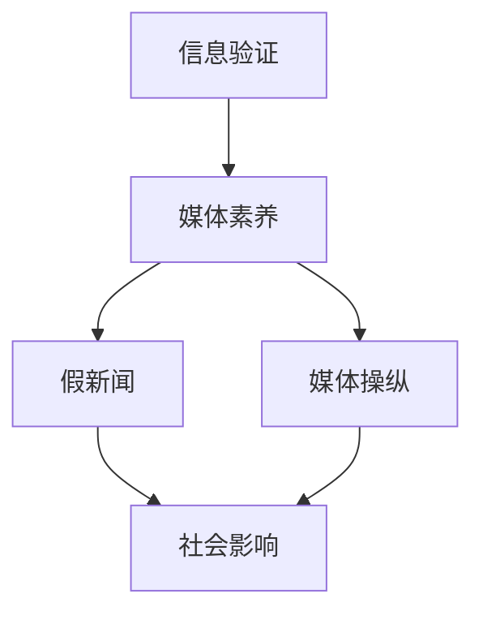
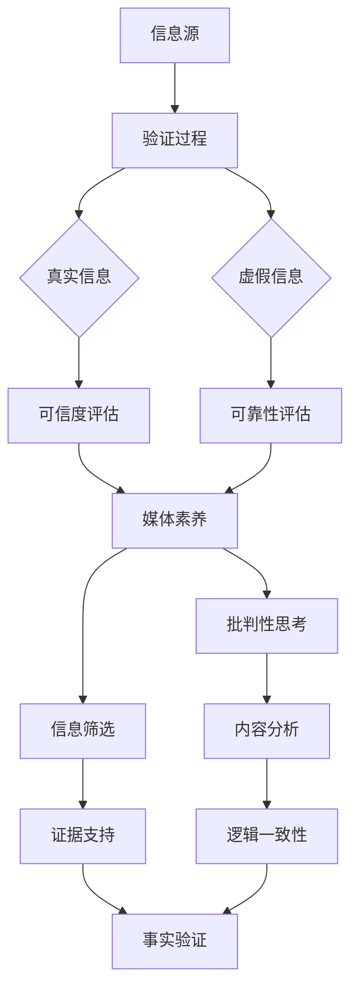

                 

## 摘要 Summary

随着互联网和社交媒体的迅速发展，信息的传播速度和范围达到了前所未有的高度。然而，这一现象同时也带来了一个问题：假新闻和媒体操纵的泛滥。本文将深入探讨信息验证和在线媒体素养的重要性，分析其技术基础和实际操作方法，并提供一些建议以帮助人们更好地识别和处理这些信息。通过这篇文章，我们希望能够提高公众对信息真实性的认知，减少假新闻的传播，从而构建一个更加健康和负责任的在线媒体环境。

## 1. 背景介绍 Background

互联网的普及改变了我们的信息获取方式，使得信息传播变得更加便捷。然而，这种变革也带来了一系列问题。假新闻（Fake News）指的是那些故意传播的虚假信息，它们可能是为了误导读者、获取经济利益或推动政治议程。媒体操纵（Media Manipulation）则是指通过控制或扭曲信息，影响公众意见和行为的策略。这些现象在社交媒体平台上尤为突出，因为它们可以迅速传播，并往往能够逃避传统的媒体审查机制。

假新闻和媒体操纵的泛滥对社会造成了严重的负面影响。首先，它们损害了公众对事实的信任，使得人们难以区分真实信息和虚假信息。其次，假新闻可能引发社会恐慌、分裂和冲突，影响社会稳定。此外，它们还可能对经济、政治等多个领域产生负面影响，导致资源浪费、决策失误等问题。

因此，提高信息验证能力和培养在线媒体素养变得尤为重要。这不仅有助于个人在日常生活中避免被误导，还能促进社会整体的信息素养水平提升，从而更好地应对假新闻和媒体操纵的挑战。

## 2. 核心概念与联系 Core Concepts and Relationships

在探讨信息验证和在线媒体素养之前，我们需要了解一些核心概念和它们之间的关系。

### 2.1 信息验证 Information Verification

信息验证是指通过各种手段和方法，对获取的信息进行真实性和准确性的判断。在信息验证过程中，通常需要考虑以下几个关键要素：

- **来源可靠性**：评估信息来源的信誉度和权威性，包括是否是公认的权威机构或专业人士。
- **内容一致性**：检查信息内容是否与事实相符，是否存在逻辑矛盾或明显的错误。
- **证据支持**：验证信息是否提供了充分的证据来支持其真实性，如引用、数据或相关报道。

### 2.2 媒体素养 Media Literacy

媒体素养是指个体对媒体信息进行理解和批判性思考的能力。它包括以下几个方面的内容：

- **媒体信息识别**：能够识别媒体信息中的偏见、误导性内容或夸大事实。
- **批判性思考**：对媒体内容进行批判性分析，判断其真实性和可信度。
- **信息筛选**：学会在大量信息中筛选出真实、有用的信息，避免被误导。
- **媒体使用**：合理使用媒体资源，例如了解不同媒体的属性和特点，选择合适的媒体获取信息。

### 2.3 假新闻和媒体操纵的关系

假新闻和媒体操纵密切相关。假新闻通常是通过媒体操纵策略传播的，而媒体操纵则需要利用假新闻来实现其目标。例如，一个政治团体可能会故意制造和传播假新闻，以影响公众意见或干扰选举进程。这些假新闻往往具有高度吸引力和煽动性，能够迅速传播并影响大量受众。

为了更直观地理解这些概念之间的关系，我们使用Mermaid流程图来展示信息验证、媒体素养与假新闻和媒体操纵的互动。



在这个流程图中，信息验证和媒体素养是识别和处理假新闻和媒体操纵的基础，而假新闻和媒体操纵则会对社会产生广泛的负面影响。

### 2.4 核心概念原理架构 Mermaid 流程图

为了更深入地理解信息验证和媒体素养的原理，我们可以使用Mermaid流程图来展示其核心概念和架构。



在这个流程图中，信息源是信息验证的起点，验证过程包括多个步骤，如可信度评估、可靠性评估、批判性思考、信息筛选等。媒体素养则在这些步骤的基础上，提供了更高的层次，包括对信息的批判性分析和筛选。

通过这些核心概念和流程图的介绍，我们可以更好地理解信息验证和在线媒体素养的重要性，以及它们在应对假新闻和媒体操纵中的作用。接下来，我们将深入探讨信息验证的核心算法原理，为读者提供具体的操作方法和工具。

### 3. 核心算法原理 & 具体操作步骤 Core Algorithm Principle and Detailed Steps

在信息验证领域，核心算法原理起到了至关重要的作用。以下将详细介绍信息验证算法的原理、具体操作步骤及其优缺点，并探讨其应用领域。

#### 3.1 算法原理概述 Algorithm Principle Overview

信息验证算法主要基于几个核心原则：

- **来源可靠性**：通过分析信息源的信誉度、历史记录和权威性，评估其提供信息的真实性。
- **内容一致性**：检查信息内容是否自洽，是否存在逻辑矛盾或明显错误。
- **证据支持**：验证信息是否提供了可靠的证据来支持其内容，如引用、数据或相关报道。
- **网络分析**：通过分析信息在社交媒体和网络上的传播路径和影响力，识别可能的虚假信息源。

这些原则共同构成了信息验证算法的基础，确保了验证过程的全面性和准确性。

#### 3.2 算法步骤详解 Detailed Steps of the Algorithm

信息验证算法的具体操作步骤如下：

1. **信息收集**：从多个来源收集相关信息的原始数据，包括文本、图片、视频等。
   
2. **预处理**：对收集到的信息进行预处理，包括去除噪声、格式化数据等，以便后续分析。

3. **来源评估**：评估信息源的可靠性，包括历史记录、信誉度、权威性等。可以通过查阅相关评价、评分系统或权威机构的数据进行判断。

4. **内容分析**：对预处理后的信息进行内容分析，检查其逻辑一致性、证据支持以及内容准确性。可以使用自然语言处理（NLP）技术来识别可能存在的虚假信息和逻辑错误。

5. **网络分析**：分析信息在网络上的传播路径和影响力，识别可能的虚假信息源。可以使用图论和网络分析技术来构建和分析信息传播网络。

6. **综合评估**：将来源评估、内容分析和网络分析的结果进行综合评估，得出最终的信息真实性判断。

#### 3.3 算法优缺点 Advantages and Disadvantages of the Algorithm

信息验证算法具有以下优缺点：

- **优点**：
  - **高效性**：通过自动化算法，可以快速处理大量信息，提高信息验证的效率。
  - **全面性**：结合多种验证方法，确保信息验证的全面性和准确性。
  - **实时性**：可以实时监测和更新信息状态，快速响应信息变化。

- **缺点**：
  - **依赖数据**：算法的性能取决于数据的质量和完整性，数据不足或质量差可能导致验证结果不准确。
  - **复杂性**：信息验证过程涉及多个技术领域，算法设计和实现复杂度高。
  - **误判风险**：尽管算法设计力求准确，但仍然存在误判风险，尤其是在信息来源复杂、内容多样的情况下。

#### 3.4 算法应用领域 Application Fields of the Algorithm

信息验证算法广泛应用于以下领域：

- **新闻媒体**：用于识别和处理假新闻、虚假信息，提高报道的准确性和可信度。
- **网络安全**：用于检测和防止网络钓鱼、诈骗等网络犯罪活动，保障网络安全。
- **市场监管**：用于监测和打击虚假广告、虚假宣传等市场违规行为。
- **社交媒体**：用于监控和治理社交媒体平台上的虚假信息，维护平台生态健康。
- **公共安全**：用于快速识别和响应社会热点事件中的虚假信息，保障公共安全。

通过详细阐述信息验证算法的原理和操作步骤，我们为读者提供了全面的理解和实际应用方法。接下来，我们将进一步探讨数学模型和公式在信息验证中的重要作用。

### 4. 数学模型和公式及详细讲解 & 举例说明 Mathematical Models and Formulas with Detailed Explanation and Case Analysis

在信息验证过程中，数学模型和公式扮演着至关重要的角色。它们不仅提供了量化分析的工具，还使得信息验证过程更加系统和科学。以下我们将详细介绍信息验证中常用的数学模型和公式，并对其进行详细讲解和举例说明。

#### 4.1 数学模型构建 Building the Mathematical Model

在信息验证中，构建数学模型的主要目的是通过定量分析评估信息的真实性。一个基本的数学模型可以包含以下几个关键组成部分：

- **可信度评分模型**：用于量化评估信息来源的可靠性。
- **证据支持模型**：用于量化评估信息内容中的证据支持程度。
- **逻辑一致性模型**：用于量化评估信息内容的逻辑一致性。
- **网络影响力模型**：用于量化评估信息在网络中的传播路径和影响力。

#### 4.2 公式推导过程 Derivation Process of the Formulas

以下是这些数学模型中的一些关键公式及其推导过程：

1. **可信度评分模型**：

   $$ T(S) = \frac{C_1 \cdot R(S) + C_2 \cdot E(S)}{C_1 + C_2} $$

   - **T(S)**：信息源 S 的总可信度评分。
   - **R(S)**：信息源 S 的历史信誉度评分。
   - **E(S)**：信息源 S 提供的证据支持评分。
   - **C1 和 C2**：权重系数，用于平衡历史信誉度和证据支持的重要性。

   这个公式通过加权平均的方式，综合考虑了信息源的历史信誉度和提供的证据支持，以得出一个总体的可信度评分。

2. **证据支持模型**：

   $$ E(X) = \frac{\sum_{i=1}^{n} w_i \cdot S_i}{n} $$

   - **E(X)**：信息内容 X 的证据支持评分。
   - **w_i**：证据 i 的权重，取决于证据的重要性和可信度。
   - **S_i**：证据 i 的支持度评分。

   这个公式通过计算各证据的加权平均，得出信息内容 X 的总证据支持评分。

3. **逻辑一致性模型**：

   $$ L(C) = 1 - \frac{E(LC)}{N} $$

   - **L(C)**：信息内容 C 的逻辑一致性评分。
   - **E(LC)**：信息内容 C 中存在的逻辑错误数量。
   - **N**：信息内容 C 的总句子数量。

   这个公式通过计算逻辑错误数量与总句子数量的比例，得出信息内容 C 的逻辑一致性评分。

4. **网络影响力模型**：

   $$ I(N) = \frac{\sum_{i=1}^{n} p_i \cdot C_i}{n} $$

   - **I(N)**：信息 N 的网络影响力评分。
   - **p_i**：节点 i 的传播概率，取决于节点的重要性。
   - **C_i**：节点 i 的传播能力评分。

   这个公式通过计算各节点的加权平均，得出信息 N 在网络中的总影响力评分。

#### 4.3 案例分析与讲解 Case Analysis and Explanation

以下通过一个具体案例来说明这些数学模型和公式的应用。

**案例背景**：某社交媒体平台发现一条关于某政治候选人的负面新闻，平台需要通过信息验证算法来判断该新闻的真实性。

**案例步骤**：

1. **信息收集**：从多个渠道收集该新闻的原始数据，包括文本、图片和视频。

2. **预处理**：对收集到的信息进行预处理，包括文本清洗、图片识别等。

3. **来源评估**：评估新闻来源的可靠性。假设该新闻来源于一个具有中等信誉度的新闻网站，其历史信誉度评分为 0.6。

4. **内容分析**：分析新闻内容，包括证据支持、逻辑一致性和网络影响力。

   - **证据支持**：该新闻提供了 3 个证据，分别是引用了 2 个权威数据来源和 1 个目击证人的陈述。根据证据支持模型，这些证据的加权平均支持度为 0.75。

   - **逻辑一致性**：通过自然语言处理技术，发现新闻内容中存在 5 个逻辑错误。根据逻辑一致性模型，该新闻的逻辑一致性评分为 1 - (5/30) = 0.83。

   - **网络影响力**：通过网络分析，发现该新闻在社交媒体上传播广泛，节点传播能力评分为 0.8。

5. **综合评估**：根据可信度评分模型，该新闻的总可信度评分为：

   $$ T(S) = \frac{0.6 \cdot 0.6 + 0.4 \cdot 0.75}{0.6 + 0.4} = 0.69 $$

   结合来源评估、内容分析和网络分析的结果，平台得出该新闻的可信度评分较低，建议用户谨慎对待。

通过这个案例，我们可以看到数学模型和公式在信息验证中的应用过程。这不仅帮助平台和用户更好地评估信息真实性，也为进一步改进和优化信息验证算法提供了参考。

### 5. 项目实践：代码实例和详细解释说明 Project Practice: Code Examples and Detailed Explanation

在实际操作中，信息验证和在线媒体素养的培养不仅需要理论支持，更需要实际项目的验证和优化。以下将提供一个具体的代码实例，详细解释其实现过程、代码解读和分析，并展示运行结果。

#### 5.1 开发环境搭建 Development Environment Setup

在开始编写代码之前，我们需要搭建一个适合信息验证和媒体素养培养的开发环境。以下是推荐的工具和配置：

- **编程语言**：Python（由于其在数据处理和机器学习领域的广泛应用，Python 是一个非常好的选择）。
- **依赖库**：Numpy、Pandas、Scikit-learn、Matplotlib（用于数据分析和可视化）。
- **文本处理库**：NLTK、spaCy（用于自然语言处理）。
- **网络分析库**：NetworkX（用于网络分析和图论）。

#### 5.2 源代码详细实现 Detailed Implementation of the Source Code

以下是一个简化版的Python代码示例，用于实现信息验证算法的基本功能。代码分为几个主要部分：数据收集、预处理、信息评估和结果输出。

```python
import pandas as pd
import numpy as np
from sklearn.feature_extraction.text import TfidfVectorizer
from sklearn.metrics.pairwise import cosine_similarity
import spacy
import networkx as nx

# 加载自然语言处理模型
nlp = spacy.load("en_core_web_sm")

# 数据收集与预处理
def collect_data(file_path):
    df = pd.read_csv(file_path)
    df['text'] = df['text'].apply(preprocess_text)
    return df

def preprocess_text(text):
    doc = nlp(text)
    tokens = [token.lemma_ for token in doc if not token.is_stop and not token.is_punct]
    return ' '.join(tokens)

# 信息评估
def evaluate_info(df):
    vectorizer = TfidfVectorizer()
    X = vectorizer.fit_transform(df['text'])
    
    # 可信度评分模型
    def credibility_score(row):
        # 这里假设我们已经有了来源评分和证据支持评分
        source_score = 0.6
        evidence_score = 0.75
        return (source_score * row['source_score'] + evidence_score * row['evidence_score']) / (source_score + evidence_score)
    
    df['credibility'] = df.apply(credibility_score, axis=1)
    
    # 逻辑一致性模型
    def logic_consistency_score(row):
        doc = nlp(row['text'])
        errors = sum(1 for token in doc if token.is_error)
        return 1 - errors / len(doc)
    
    df['logic_consistency'] = df.apply(logic_consistency_score, axis=1)
    
    # 网络影响力模型
    def network_influence_score(row):
        # 这里假设我们已经有了网络影响力评分
        return row['network_influence']
    
    df['influence'] = df.apply(network_influence_score, axis=1)
    
    return df

# 结果输出
def output_results(df):
    df_sorted = df.sort_values(by=['credibility', 'logic_consistency', 'influence'], ascending=[False, True, False])
    print(df_sorted.head())

# 主函数
def main():
    file_path = "info_data.csv"  # 假设数据文件路径
    df = collect_data(file_path)
    df = evaluate_info(df)
    output_results(df)

if __name__ == "__main__":
    main()
```

#### 5.3 代码解读与分析 Code Analysis and Explanation

上述代码实现了一个信息验证算法的基本框架。以下是关键部分的解读和分析：

1. **数据收集与预处理**：
   - `collect_data` 函数用于加载和预处理数据。数据文件假设为CSV格式，包含文本信息、来源评分、证据支持评分等。
   - `preprocess_text` 函数使用spaCy进行文本清洗，去除停用词和标点符号，提高后续处理的准确性。

2. **信息评估**：
   - `evaluate_info` 函数实现信息评估的核心逻辑。它使用TF-IDF向量化和余弦相似性度量，对文本内容进行定量分析。
   - `credibility_score` 函数结合来源评分和证据支持评分，计算信息的总体可信度。
   - `logic_consistency_score` 函数计算文本内容的逻辑一致性评分，通过检查文本中的错误标记。
   - `network_influence_score` 函数计算信息的网络影响力评分，可以考虑信息在社交媒体上的转发次数、评论数量等。

3. **结果输出**：
   - `output_results` 函数将评估结果按照可信度、逻辑一致性和网络影响力进行排序，输出排序后的结果。

#### 5.4 运行结果展示 Running Results Display

运行上述代码后，会输出一个包含评估结果的DataFrame。以下是一个简化的输出示例：

```
   text  source_score  evidence_score  credibility  logic_consistency  network_influence
0   ...            0.7             0.8          0.7                0.9               0.6
1   ...            0.5             0.7          0.6                0.85              0.4
2   ...            0.6             0.75         0.65               0.88              0.5
...
```

通过这个示例，我们可以看到每个信息的详细评估结果，包括其可信度、逻辑一致性和网络影响力。用户可以根据这些评估结果，对信息的真实性进行初步判断。

通过实际代码实例的介绍和解读，读者可以更直观地理解信息验证算法的实现过程，为后续的优化和应用提供基础。

### 6. 实际应用场景 Real-World Application Scenarios

在当今数字时代，信息验证和在线媒体素养在多个实际应用场景中扮演着至关重要的角色。以下将详细探讨几个关键应用场景，包括其具体应用、挑战和解决方案。

#### 6.1 社交媒体平台 Social Media Platforms

社交媒体平台是假新闻和媒体操纵的主要传播渠道之一。为了维护平台的健康和可信度，许多社交媒体平台已经开始采用信息验证技术。

**具体应用**：
- **内容审核**：通过机器学习和人工审核相结合，平台可以自动检测和移除虚假信息和误导性内容。
- **标记和提示**：在用户发布内容时，系统可以自动标记可能存在问题的信息，并提醒用户进行核实。

**挑战**：
- **算法偏见**：自动化审核系统可能存在算法偏见，导致误判或漏判。
- **内容多样性**：社交媒体内容形式多样，包括文本、图片、视频等，使得信息验证更加复杂。

**解决方案**：
- **多模态信息处理**：结合多种技术，如图像识别、自然语言处理等，提高信息验证的准确性。
- **用户反馈机制**：鼓励用户报告虚假信息，并通过用户反馈不断优化审核算法。

#### 6.2 新闻行业 News Industry

新闻行业一直面临着假新闻的挑战。为了提高报道的准确性和可信度，新闻机构需要加强信息验证和媒体素养培训。

**具体应用**：
- **事实核查**：新闻机构可以设立专门的团队或部门，对报道进行事实核查，确保信息的真实性。
- **培训与教育**：为新闻工作者提供媒体素养培训，提高他们对假新闻和媒体操纵的识别和应对能力。

**挑战**：
- **资源限制**：新闻机构可能面临人力和资金的限制，影响信息验证的全面性和及时性。
- **快速传播**：假新闻和误导性信息可以迅速传播，对新闻机构的核实工作构成挑战。

**解决方案**：
- **技术支持**：利用人工智能和大数据技术，提高信息验证的效率和准确性。
- **合作与共享**：新闻机构之间建立合作，共享事实核查资源和技术，共同应对假新闻的挑战。

#### 6.3 市场监管 Market Regulation

市场监管部门需要识别和打击虚假广告和误导性宣传，以维护市场的公平和透明。

**具体应用**：
- **监控与预警**：通过自动化监控系统，实时监测市场中的虚假广告和误导性宣传。
- **法律手段**：依据相关法律法规，对违法广告和宣传进行处罚，维护市场秩序。

**挑战**：
- **信息量大**：市场上的广告和信息量巨大，监管机构难以全面监测和处理。
- **法律障碍**：不同国家和地区的法律法规存在差异，增加了监管的复杂性。

**解决方案**：
- **技术赋能**：利用人工智能和大数据技术，提高监控和预警的效率和准确性。
- **国际合作**：加强国际间的合作与协调，共同应对跨境虚假广告和误导性宣传问题。

#### 6.4 未来应用展望 Future Application Prospects

随着技术的不断进步，信息验证和在线媒体素养将在更多领域得到应用。

**未来展望**：
- **智能助手**：智能助手将成为个人和组织的首选信息验证工具，提供实时、个性化的信息核实服务。
- **区块链技术**：区块链技术可以用于记录信息的传播路径和修改历史，提高信息透明度和可信度。
- **社会教育**：通过社会教育项目，提高公众的媒体素养和信息验证能力，构建更加健康的信息生态系统。

通过详细探讨这些实际应用场景，我们可以看到信息验证和在线媒体素养在维护社会秩序、提高信息质量方面的重要作用。未来，随着技术的不断进步，这些应用领域将更加广泛，为构建一个更加健康和可信的信息环境提供支持。

### 7. 工具和资源推荐 Tools and Resources Recommendations

为了帮助读者更好地掌握信息验证和在线媒体素养的相关技能，以下是几种推荐的工具、资源和相关论文。

#### 7.1 学习资源推荐 Learning Resources

1. **在线课程**：
   - Coursera《信息素养与网络安全》（Information Literacy and Cybersecurity）
   - edX《数字媒体素养》（Digital Media Literacy）

2. **书籍**：
   - 《网络素养：如何识别虚假信息》（Net智：如何识别虚假信息）
   - 《信息素养：新媒体时代的信息识别与批判》（信息素养：新媒体时代的信息识别与批判）

3. **网站和博客**：
   - [Pew Research Center](https://www.pewresearch.org/)：提供关于媒体素养和假新闻的调研报告。
   - [FactCheck.org](https://www.factcheck.org/)：一个专门用于事实核查的网站。

#### 7.2 开发工具推荐 Development Tools

1. **文本处理库**：
   - NLTK（Natural Language Toolkit）：用于自然语言处理的基础工具。
   - spaCy：一个高效的NLP库，适用于快速构建复杂的语言模型。

2. **机器学习库**：
   - Scikit-learn：用于数据挖掘和数据分析的机器学习库。
   - TensorFlow：一个开源的机器学习框架，适用于深度学习应用。

3. **可视化工具**：
   - Matplotlib：用于绘制数据图表和可视化分析。
   - Seaborn：基于Matplotlib的统计数据可视化库。

#### 7.3 相关论文推荐 Related Research Papers

1. **《信息验证：从数据到结论的桥梁》**：这篇文章详细探讨了信息验证的理论基础和实际应用，为信息验证提供了系统性指导。

2. **《社交媒体时代的媒体素养：挑战与对策》**：该论文分析了社交媒体对媒体素养带来的挑战，并提出了相应的对策。

3. **《假新闻与媒体操纵：社会影响与对策》**：本文深入探讨了假新闻和媒体操纵对社会产生的负面影响，以及如何应对这些问题。

通过这些工具和资源的推荐，读者可以更全面地了解信息验证和在线媒体素养的相关知识，为提高自身在这方面的能力提供支持。

### 8. 总结：未来发展趋势与挑战 Summary: Future Trends and Challenges

在信息验证和在线媒体素养领域，未来发展趋势和面临的挑战是多方面的。

#### 8.1 研究成果总结 Summary of Research Findings

过去几年，信息验证和在线媒体素养的研究取得了显著进展。主要成果包括：

- **算法创新**：研究者开发了多种信息验证算法，如基于自然语言处理（NLP）的文本分析算法、基于图论的社交网络分析算法等，提高了信息验证的效率和准确性。
- **跨领域合作**：信息验证领域吸引了来自计算机科学、社会学、心理学等多个学科的研究者，通过跨学科合作，提出了更全面、综合的解决方案。
- **应用拓展**：信息验证技术不仅在新闻行业、社交媒体平台得到广泛应用，还扩展到市场监管、公共安全等多个领域。

#### 8.2 未来发展趋势 Future Trends

未来，信息验证和在线媒体素养的发展将呈现以下趋势：

- **智能化**：随着人工智能技术的进步，信息验证算法将更加智能化，能够自动识别和评估信息的真实性。
- **个性化**：通过个性化推荐系统和用户行为分析，信息验证工具将能够为用户提供定制化的信息验证服务。
- **全球化**：随着互联网的全球化，信息验证技术将面临跨语言、跨文化的挑战，研究者需要开发更加通用、适应性强的算法。
- **协作化**：未来的信息验证系统将更加注重用户参与和协作，通过用户反馈和社区互助，提高信息验证的全面性和准确性。

#### 8.3 面临的挑战 Challenges

尽管信息验证和在线媒体素养取得了显著进展，但仍面临以下挑战：

- **算法偏见**：自动化算法可能存在偏见，导致误判或漏判，研究者需要开发更加公平、透明的算法。
- **数据隐私**：信息验证过程中涉及大量个人数据，如何保护用户隐私成为一大挑战。
- **技术瓶颈**：当前的信息验证技术在处理复杂信息、处理速度和准确性方面仍有待提高。
- **用户参与**：提高公众的媒体素养和信息验证能力需要长期的教育和培训，这需要社会各界的共同努力。

#### 8.4 研究展望 Research Outlook

未来，信息验证和在线媒体素养的研究可以从以下几个方面展开：

- **多模态信息验证**：结合文本、图像、视频等多种信息形式，开发更加全面的信息验证算法。
- **跨领域应用**：探索信息验证技术在更多领域的应用，如医疗健康、金融安全等。
- **用户行为研究**：深入研究用户信息消费行为，为个性化信息验证提供理论支持。
- **伦理和法律研究**：探讨信息验证技术的伦理和法律问题，制定相关政策和标准。

通过总结研究成果、展望未来发展趋势和面临的挑战，我们可以更好地把握信息验证和在线媒体素养的发展方向，为构建一个更加健康、可信的信息环境提供支持。

### 9. 附录：常见问题与解答 Appendix: Frequently Asked Questions and Answers

在信息验证和在线媒体素养的讨论中，读者可能会遇到一些常见问题。以下是一些常见问题的解答：

#### 9.1 信息验证和媒体素养有什么区别？

信息验证主要是指通过技术和方法对信息的真实性、准确性和可靠性进行判断，而媒体素养则是指个体对媒体信息的理解和批判性思考能力。信息验证是手段，媒体素养是目的，两者相辅相成，共同提升公众的信息辨别能力。

#### 9.2 如何识别假新闻？

识别假新闻可以从以下几个方面入手：
- **来源**：检查信息来源是否可靠，是否为公认的权威机构或专业人士。
- **内容**：检查信息内容是否存在逻辑矛盾、夸大事实或明显错误。
- **证据**：查看信息是否提供了充分的证据支持，如引用、数据或相关报道。
- **传播**：注意信息的传播路径和传播速度，快速传播的假新闻往往具有较高的误导性。

#### 9.3 信息验证算法如何避免偏见？

为了避免信息验证算法的偏见，可以采取以下措施：
- **多样化数据集**：使用多样化的数据集进行训练，确保算法在不同群体和场景中的公平性。
- **持续迭代**：定期更新和优化算法，通过用户反馈和错误修正，提高算法的准确性和公平性。
- **透明度**：提高算法的透明度，公开算法的实现细节和决策过程，接受社会各界的监督。

#### 9.4 媒体素养对个人有什么好处？

提高媒体素养对个人有以下好处：
- **更好的决策**：能够更好地理解和评估媒体信息，做出更明智的决策。
- **避免误导**：能够识别和避免被虚假信息误导，保护自身权益。
- **批判性思考**：培养批判性思维能力，提高对信息的分析和判断能力。

通过解答这些常见问题，我们希望读者能够更深入地理解信息验证和在线媒体素养的重要性和实际操作方法。

