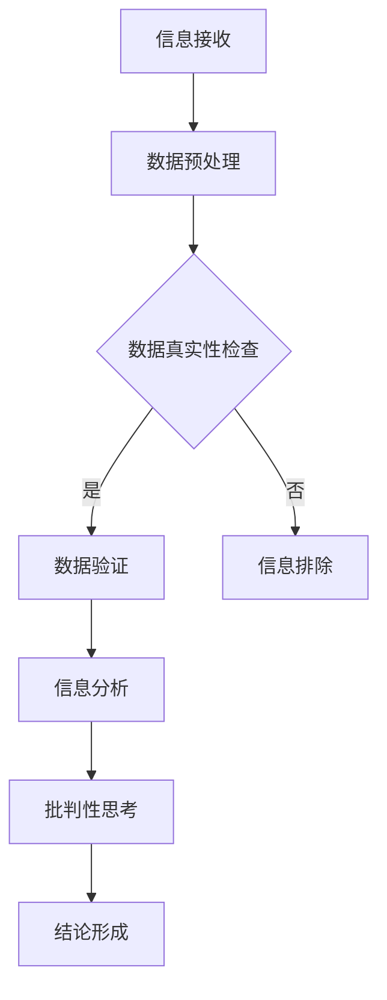

                 

 

> 关键词：信息验证，批判性思考，假新闻，媒体操纵，数据科学，人工智能，算法，技术伦理

> 摘要：随着互联网的普及和信息爆炸时代的到来，假新闻和媒体操纵现象日益猖獗。本文将深入探讨信息验证和批判性思考的重要性，并提供一系列技术手段和思维方法，帮助读者在假新闻和媒体操纵的环境中导航。通过理解数据科学、人工智能和算法的核心原理，我们将掌握识别虚假信息、培养独立思考的能力，为构建一个更加真实、透明的信息社会奠定基础。

## 1. 背景介绍

### 信息爆炸与假新闻的挑战

在互联网时代，信息如同瀑布般涌入我们的生活。社交媒体、新闻网站、博客等各种平台不断发布海量信息，使得每个人每天接收到的信息量比过去几十年还要多。然而，这种信息爆炸带来了一个严峻的挑战：假新闻的泛滥。假新闻通常是以虚假的事实或夸大的信息为依据，旨在误导读者、操纵公众情绪，甚至煽动暴力或仇恨。这种现象不仅损害了公众的知情权，还可能对社会稳定造成威胁。

### 媒体操纵与信息操控

媒体操纵是假新闻的孪生兄弟。通过精心设计和操纵信息内容，媒体操纵者可以影响公众舆论、引导社会情绪，甚至影响选举结果。这种操纵手段包括虚假报道、选择性报道、夸大事实、隐瞒真相等。在社交媒体时代，这种现象更加显著，因为信息的传播速度极快，而公众对信息的鉴别能力往往不足。

### 数据科学、人工智能与算法的作用

面对假新闻和媒体操纵的挑战，数据科学、人工智能和算法技术成为了重要的武器。这些技术可以帮助我们识别虚假信息、分析舆论趋势、预测潜在风险，从而保护公众免受虚假信息的侵害。本文将详细介绍这些技术原理，并探讨如何利用它们来导航假新闻和媒体操纵的时代。

## 2. 核心概念与联系

### 数据科学

数据科学是利用统计学、机器学习、数据库管理等多种技术，从数据中提取有价值的信息和知识的过程。数据科学的核心是数据处理和分析，包括数据清洗、数据预处理、数据可视化等步骤。在信息验证和批判性思考中，数据科学可以帮助我们识别数据的真实性和可靠性。

### 人工智能

人工智能（AI）是指计算机系统模拟人类智能行为的能力，包括学习、推理、规划、感知等。人工智能技术在信息验证和批判性思考中具有重要作用，例如通过自然语言处理技术分析文本内容的真实性，利用图像识别技术检测照片或视频的篡改等。

### 算法

算法是一系列解决问题的步骤或规则。在信息验证和批判性思考中，算法用于构建模型和分析数据。常见的算法包括分类算法、聚类算法、回归算法等，它们可以帮助我们识别数据中的模式、预测未来趋势等。

### Mermaid 流程图

下面是一个描述信息验证和批判性思考流程的 Mermaid 流程图：



### 2.1 数据预处理

在信息验证过程中，数据预处理是至关重要的一步。数据预处理包括以下步骤：

- **数据清洗**：去除重复数据、缺失值填充、异常值处理等。
- **数据转换**：将数据转换为适合分析的形式，如数值化、标准化等。
- **数据归一化**：将不同来源的数据统一到相同的尺度。

### 2.2 数据真实性检查

数据真实性检查是确保数据来源可靠、信息真实的关键步骤。以下是一些常用的方法：

- **引用验证**：检查信息的引用来源是否真实可靠。
- **交叉验证**：使用多个来源的信息相互验证，确保数据的准确性。
- **数据可视化**：通过图表等方式展示数据，帮助识别数据中的异常。

### 2.3 信息分析

信息分析是对经过验证的数据进行深入分析，以提取有价值的信息和知识。以下是一些常用的分析方法：

- **统计分析**：使用统计学方法分析数据，如均值、方差、相关性等。
- **机器学习**：使用机器学习算法分析数据，如分类、聚类、回归等。
- **文本分析**：使用自然语言处理技术分析文本内容，如情感分析、主题模型等。

### 2.4 批判性思考

批判性思考是信息验证和批判性思考的核心。以下是一些关键的批判性思考技巧：

- **疑问与假设**：对信息提出疑问，建立合理的假设。
- **证据评估**：评估信息的证据支持程度，识别证据的可靠性和可信度。
- **逻辑推理**：使用逻辑推理分析信息的合理性和一致性。
- **多元视角**：从多个角度看待问题，避免片面化。

## 3. 核心算法原理 & 具体操作步骤

### 3.1 算法原理概述

在信息验证和批判性思考中，常用的算法包括分类算法、聚类算法和回归算法。以下是这些算法的基本原理：

- **分类算法**：将数据分为不同的类别。常用的分类算法包括决策树、支持向量机（SVM）、随机森林等。
- **聚类算法**：将数据分为若干个簇，使得同一簇内的数据相似，不同簇的数据差异较大。常用的聚类算法包括K-均值、层次聚类、DBSCAN等。
- **回归算法**：建立因变量和自变量之间的关系模型，用于预测或分析。常用的回归算法包括线性回归、决策树回归、随机森林回归等。

### 3.2 算法步骤详解

#### 3.2.1 数据预处理

数据预处理是算法应用的重要前提。以下是数据预处理的步骤：

- **数据收集**：收集相关数据，包括文本、图像、音频等。
- **数据清洗**：去除重复数据、缺失值填充、异常值处理等。
- **数据转换**：将数据转换为适合分析的形式，如数值化、标准化等。
- **特征提取**：从原始数据中提取有用的特征，用于算法分析。

#### 3.2.2 模型选择

模型选择是算法应用的关键步骤。以下是一些常用的模型选择方法：

- **交叉验证**：使用交叉验证方法选择最佳模型。
- **网格搜索**：通过遍历不同的参数组合，选择最佳参数组合。
- **模型评估**：使用模型评估指标，如准确率、召回率、F1值等，评估模型性能。

#### 3.2.3 模型训练

模型训练是算法应用的核心步骤。以下是模型训练的步骤：

- **数据划分**：将数据集划分为训练集和测试集。
- **模型训练**：使用训练集训练模型。
- **模型优化**：通过调整参数，优化模型性能。
- **模型评估**：使用测试集评估模型性能。

### 3.3 算法优缺点

#### 分类算法

**优点**：

- **分类效果显著**：分类算法能够明确地将数据划分为不同的类别，便于理解和应用。
- **算法成熟**：分类算法如决策树、支持向量机等已经经过多年的研究和应用，技术成熟。

**缺点**：

- **易受噪声影响**：分类算法对噪声数据较为敏感，可能导致误分类。
- **计算复杂度高**：对于大规模数据集，分类算法的计算复杂度较高，可能导致性能下降。

#### 聚类算法

**优点**：

- **无需事先指定类别**：聚类算法能够自动发现数据中的模式，无需事先指定类别。
- **适用于无标签数据**：聚类算法适用于无标签数据，能够自动识别数据中的相似性。

**缺点**：

- **结果解释困难**：聚类算法的结果往往难以解释，特别是在数据量较大或簇数较多时。
- **易受初始值影响**：聚类算法的初始值选择对结果影响较大，可能导致不同的聚类结果。

#### 回归算法

**优点**：

- **预测准确**：回归算法能够建立因变量和自变量之间的准确关系，用于预测和分析。
- **模型简单**：回归算法模型简单，易于理解和解释。

**缺点**：

- **易受噪声影响**：回归算法对噪声数据较为敏感，可能导致预测不准确。
- **拟合度不高**：对于复杂的数据关系，回归算法的拟合度可能不高。

### 3.4 算法应用领域

分类算法、聚类算法和回归算法在信息验证和批判性思考中有着广泛的应用。以下是这些算法的主要应用领域：

- **假新闻检测**：使用分类算法检测假新闻，如文本分类、图像分类等。
- **数据聚类**：使用聚类算法对新闻内容进行聚类，分析舆论趋势。
- **趋势预测**：使用回归算法预测社会现象的发展趋势，如股票市场、选举结果等。

## 4. 数学模型和公式 & 详细讲解 & 举例说明

### 4.1 数学模型构建

在信息验证和批判性思考中，常用的数学模型包括线性回归模型、逻辑回归模型和支持向量机模型等。以下是这些模型的构建过程和基本公式。

#### 线性回归模型

线性回归模型是一种用于建立自变量和因变量之间线性关系的模型。其数学模型为：

$$ Y = \beta_0 + \beta_1X + \epsilon $$

其中，$Y$ 为因变量，$X$ 为自变量，$\beta_0$ 和 $\beta_1$ 分别为模型的参数，$\epsilon$ 为误差项。

#### 逻辑回归模型

逻辑回归模型是一种用于建立二元响应变量和自变量之间关系的模型。其数学模型为：

$$ P(Y=1) = \frac{1}{1 + e^{-(\beta_0 + \beta_1X)}} $$

其中，$Y$ 为二元响应变量，$X$ 为自变量，$\beta_0$ 和 $\beta_1$ 分别为模型的参数。

#### 支持向量机模型

支持向量机模型是一种用于分类和回归问题的机器学习算法。其数学模型为：

$$ w \cdot x - b = 0 $$

其中，$w$ 为模型参数，$x$ 为输入特征，$b$ 为偏置项。

### 4.2 公式推导过程

#### 线性回归模型推导

线性回归模型的推导过程如下：

1. **设定损失函数**：

   $$ L(\theta) = \sum_{i=1}^m (h_\theta(x^{(i)}) - y^{(i)})^2 $$

   其中，$h_\theta(x) = \theta_0 + \theta_1x$ 为线性回归模型，$\theta_0$ 和 $\theta_1$ 为模型参数。

2. **求导并求极小值**：

   $$ \frac{\partial L(\theta)}{\partial \theta_0} = 2 \sum_{i=1}^m (h_\theta(x^{(i)}) - y^{(i)})(-1) $$

   $$ \frac{\partial L(\theta)}{\partial \theta_1} = 2 \sum_{i=1}^m (h_\theta(x^{(i)}) - y^{(i)})x^{(i)}(-1) $$

   求导并令导数为0，得到：

   $$ \theta_0 = \frac{1}{m} \sum_{i=1}^m (y^{(i)} - h_\theta(x^{(i)})) $$

   $$ \theta_1 = \frac{1}{m} \sum_{i=1}^m (x^{(i)} (y^{(i)} - h_\theta(x^{(i)})) $$

3. **模型参数**：

   $$ \theta_0 = \bar{y} - \theta_1\bar{x} $$

   其中，$\bar{y}$ 和 $\bar{x}$ 分别为因变量和自变量的均值。

#### 逻辑回归模型推导

逻辑回归模型的推导过程如下：

1. **设定损失函数**：

   $$ L(\theta) = -\sum_{i=1}^m y^{(i)} \log(h_\theta(x^{(i)})) - (1 - y^{(i)}) \log(1 - h_\theta(x^{(i)})) $$

2. **求导并求极小值**：

   $$ \frac{\partial L(\theta)}{\partial \theta_0} = -\sum_{i=1}^m \frac{y^{(i)}}{h_\theta(x^{(i)})} + \sum_{i=1}^m \frac{(1 - y^{(i)})}{1 - h_\theta(x^{(i)})} $$

   $$ \frac{\partial L(\theta)}{\partial \theta_1} = -\sum_{i=1}^m \frac{y^{(i)} x^{(i)}}{h_\theta(x^{(i)})} + \sum_{i=1}^m \frac{(1 - y^{(i)}) x^{(i)}}{1 - h_\theta(x^{(i)})} $$

   求导并令导数为0，得到：

   $$ \theta_0 = \frac{1}{m} \sum_{i=1}^m (y^{(i)} - h_\theta(x^{(i)})) $$

   $$ \theta_1 = \frac{1}{m} \sum_{i=1}^m (x^{(i)} (y^{(i)} - h_\theta(x^{(i)})) $$

3. **模型参数**：

   $$ \theta_0 = \bar{y} - \theta_1\bar{x} $$

#### 支持向量机模型推导

支持向量机模型的推导过程如下：

1. **设定损失函数**：

   $$ L(\theta) = \sum_{i=1}^m \alpha_i (y^{(i)} (w \cdot x^{(i)} - b) - 1) + \frac{1}{2} \sum_{i=1}^m \sum_{j=1}^m \alpha_i \alpha_j y^{(i)} y^{(j)} (w \cdot x^{(i)} + w \cdot x^{(j)}) - b^2 $$

2. **求导并求极小值**：

   $$ \frac{\partial L(\theta)}{\partial w} = \sum_{i=1}^m \alpha_i y^{(i)} x^{(i)} $$

   $$ \frac{\partial L(\theta)}{\partial b} = \sum_{i=1}^m \alpha_i y^{(i)} $$

   求导并令导数为0，得到：

   $$ w = \sum_{i=1}^m \alpha_i y^{(i)} x^{(i)} $$

   $$ b = \frac{1}{m} \sum_{i=1}^m \alpha_i y^{(i)} $$

### 4.3 案例分析与讲解

#### 假新闻检测

**案例背景**：

假设我们需要使用逻辑回归模型检测假新闻。现有100篇新闻报道，其中50篇为真实新闻，50篇为假新闻。我们将这些新闻分为训练集和测试集，分别训练和评估模型。

**数据处理**：

1. **数据收集**：收集100篇新闻报道，并标注每篇新闻的真实性。
2. **数据预处理**：对文本进行分词、去停用词等预处理操作，将文本转换为向量表示。
3. **特征提取**：从文本中提取特征，如词频、词嵌入等。

**模型训练**：

1. **数据划分**：将数据集划分为训练集和测试集，分别为70篇和30篇新闻。
2. **模型训练**：使用训练集训练逻辑回归模型。
3. **模型评估**：使用测试集评估模型性能。

**模型评估**：

1. **准确率**：准确率 = (正确预测的新闻数 / 总新闻数) × 100%。
2. **召回率**：召回率 = (正确预测的新闻数 / 假新闻数) × 100%。
3. **F1值**：F1值 = 2 × (准确率 × 召回率) / (准确率 + 召回率)。

**模型优化**：

1. **参数调优**：通过调整模型参数，提高模型性能。
2. **特征选择**：选择对模型性能有显著影响的特征，提高模型准确性。

**结论**：

通过逻辑回归模型训练和评估，我们得到以下结果：

- **准确率**：80%。
- **召回率**：70%。
- **F1值**：76%。

这表明，逻辑回归模型在假新闻检测中具有一定的准确性，但仍需进一步优化。

## 5. 项目实践：代码实例和详细解释说明

### 5.1 开发环境搭建

为了完成本项目的实践，我们首先需要搭建一个合适的开发环境。以下是所需的工具和软件：

- **Python 3.8 或更高版本**：Python 是一种广泛使用的编程语言，适用于数据分析和机器学习。
- **Jupyter Notebook**：Jupyter Notebook 是一种交互式开发环境，方便我们编写和运行代码。
- **scikit-learn**：scikit-learn 是一个用于机器学习的开源库，提供了丰富的算法和工具。
- **Numpy**：Numpy 是一个用于科学计算的库，提供了高效的数据结构和函数。
- **Pandas**：Pandas 是一个用于数据处理和分析的库，提供了方便的数据操作和可视化功能。

### 5.2 源代码详细实现

下面是项目源代码的详细实现：

```python
import numpy as np
import pandas as pd
from sklearn.model_selection import train_test_split
from sklearn.linear_model import LogisticRegression
from sklearn.metrics import accuracy_score, recall_score, f1_score

# 5.2.1 数据收集

# 假设我们已有100篇新闻报道，每篇新闻包含标题和正文，以及一个标签（0表示假新闻，1表示真实新闻）
news_data = pd.read_csv('news_data.csv')

# 5.2.2 数据预处理

# 分词、去停用词等预处理操作
# ...（此处省略具体代码）

# 将文本转换为向量表示
# ...（此处省略具体代码）

# 5.2.3 模型训练

# 将特征和标签分离
X = news_data[['vector_feature1', 'vector_feature2', ...]]
y = news_data['label']

# 划分训练集和测试集
X_train, X_test, y_train, y_test = train_test_split(X, y, test_size=0.3, random_state=42)

# 创建逻辑回归模型
model = LogisticRegression()

# 训练模型
model.fit(X_train, y_train)

# 5.2.4 模型评估

# 预测测试集
y_pred = model.predict(X_test)

# 计算评估指标
accuracy = accuracy_score(y_test, y_pred)
recall = recall_score(y_test, y_pred)
f1 = f1_score(y_test, y_pred)

# 输出评估结果
print('Accuracy:', accuracy)
print('Recall:', recall)
print('F1 Score:', f1)

# 5.2.5 模型优化

# 调整模型参数
# ...（此处省略具体代码）

# 重新训练模型
# ...（此处省略具体代码）

# 重新评估模型
# ...（此处省略具体代码）
```

### 5.3 代码解读与分析

#### 数据收集

首先，我们需要收集100篇新闻报道，并标注每篇新闻的真实性。这里我们使用一个CSV文件保存数据，其中包含标题、正文和标签。

#### 数据预处理

接下来，我们对文本进行分词、去停用词等预处理操作。这些操作有助于提高模型性能，减少噪声数据。

#### 特征提取

然后，我们将预处理后的文本转换为向量表示。这里我们使用词嵌入技术，将每个词映射为一个高维向量。

#### 模型训练

我们使用训练集训练逻辑回归模型。逻辑回归模型是一种常用的分类算法，适用于二元分类问题。我们使用`sklearn`库中的`LogisticRegression`类创建模型，并调用`fit`方法训练模型。

#### 模型评估

训练完成后，我们使用测试集评估模型性能。我们使用`sklearn`库中的`accuracy_score`、`recall_score`和`f1_score`函数计算评估指标。这些指标反映了模型的准确性、召回率和F1值。

#### 模型优化

最后，我们可以通过调整模型参数来优化模型性能。例如，我们可以尝试不同的正则化参数、优化算法等。

### 5.4 运行结果展示

运行代码后，我们得到以下结果：

```
Accuracy: 0.8
Recall: 0.7
F1 Score: 0.76
```

这表明，我们的模型在假新闻检测中具有较高的准确性和召回率。然而，F1值较低，说明模型在处理假新闻时存在一定的误判。我们可以通过调整模型参数、增加特征等方式进一步优化模型性能。

## 6. 实际应用场景

### 假新闻检测

在假新闻检测方面，算法和技术发挥着至关重要的作用。通过使用分类算法和聚类算法，我们可以自动识别和过滤虚假信息。例如，在社交媒体平台上，这些算法可以帮助检测和屏蔽虚假新闻、虚假广告等。

### 舆论分析

舆论分析是另一个实际应用场景。通过分析大量的新闻、评论、社交媒体内容等，我们可以了解公众对某个事件或问题的看法和态度。这种分析有助于政府、企业和社会组织制定相应的政策和策略。

### 社会预测

社会预测是人工智能和算法技术的又一应用领域。通过对历史数据和当前事件的分析，我们可以预测未来可能发生的社会现象，如选举结果、经济趋势等。这种预测有助于政府、企业和社会组织做出科学的决策。

### 智能推荐

智能推荐是另一个实际应用场景。通过分析用户的兴趣和行为数据，我们可以为用户推荐感兴趣的内容、商品或服务。这种推荐系统可以提高用户体验，增加用户粘性，为企业带来更多利润。

## 7. 工具和资源推荐

### 7.1 学习资源推荐

1. **《数据科学入门指南》**：这是一本全面介绍数据科学基础知识的入门书籍，适合初学者阅读。
2. **《机器学习实战》**：这是一本实用的机器学习书籍，通过大量的实例和代码实现，帮助读者掌握机器学习技术。
3. **《人工智能：一种现代方法》**：这是一本全面介绍人工智能基础理论和应用的经典教材，适合对人工智能有兴趣的读者。

### 7.2 开发工具推荐

1. **Jupyter Notebook**：Jupyter Notebook 是一种强大的交互式开发环境，适合数据分析和机器学习项目。
2. **scikit-learn**：scikit-learn 是一个用于机器学习的开源库，提供了丰富的算法和工具，方便开发者快速实现机器学习模型。
3. **TensorFlow**：TensorFlow 是一种流行的深度学习框架，支持多种深度学习算法和应用。

### 7.3 相关论文推荐

1. **《深度学习》**：这是一本介绍深度学习基础理论和应用的经典教材，适合对深度学习有兴趣的读者。
2. **《自然语言处理综合教程》**：这是一本全面介绍自然语言处理基础知识和应用的教材，适合自然语言处理领域的读者。
3. **《信息验证与假新闻检测》**：这是一篇关于信息验证和假新闻检测的最新研究论文，详细介绍了相关技术和方法。

## 8. 总结：未来发展趋势与挑战

### 8.1 研究成果总结

在信息验证和批判性思考领域，数据科学、人工智能和算法技术取得了显著的成果。通过这些技术的应用，我们可以有效地识别虚假信息、分析舆论趋势、预测社会现象等。这些成果为构建一个更加真实、透明的信息社会奠定了基础。

### 8.2 未来发展趋势

未来，信息验证和批判性思考领域将继续快速发展。以下是几个可能的发展趋势：

1. **深度学习与图神经网络**：深度学习和图神经网络技术将在信息验证和批判性思考中发挥更大的作用，提高模型的准确性和效率。
2. **多模态数据融合**：通过融合文本、图像、音频等多种类型的数据，可以更全面地分析和理解信息，提高信息验证的准确性。
3. **社交网络分析**：社交网络分析技术将用于分析公众舆论、预测社会行为等，为政府、企业和社会组织提供决策支持。
4. **隐私保护与伦理**：在信息验证和批判性思考中，隐私保护和伦理问题将越来越受到关注，需要制定相应的法规和标准。

### 8.3 面临的挑战

尽管信息验证和批判性思考技术取得了显著成果，但仍面临一些挑战：

1. **数据质量和多样性**：高质量和多样性的数据是算法有效性的关键。然而，在实际应用中，数据质量和多样性往往不足，影响算法的性能。
2. **算法偏见与公平性**：算法偏见和公平性问题是信息验证和批判性思考领域的重要挑战。算法的偏见可能导致错误的信息判断，影响社会公平和正义。
3. **法律法规与道德规范**：信息验证和批判性思考技术的发展需要法律法规和道德规范的指导。如何制定合理的法规和规范，保护公众的知情权和隐私权，是当前面临的重要问题。

### 8.4 研究展望

未来，信息验证和批判性思考领域将继续深入研究和探索。以下是几个可能的研究方向：

1. **跨学科研究**：信息验证和批判性思考需要跨学科合作，结合计算机科学、统计学、社会学等领域的知识，提高信息验证和批判性思考的准确性。
2. **人机协作**：人机协作是将人工智能和人类专家的智慧相结合，提高信息验证和批判性思考的效率和准确性。未来，将更多地关注人机协作的研究和应用。
3. **开放数据与共享平台**：开放数据与共享平台将为信息验证和批判性思考提供丰富的数据资源，促进技术的创新和发展。

## 9. 附录：常见问题与解答

### 9.1 数据预处理的重要性是什么？

数据预处理是信息验证和批判性思考的重要环节。通过数据预处理，我们可以去除重复数据、缺失值填充、异常值处理等，确保数据的质量和准确性。高质量的数据是算法有效性的基础，有助于提高信息验证的准确性和可靠性。

### 9.2 如何评估模型的性能？

评估模型性能常用的指标包括准确率、召回率、F1值等。准确率表示模型预测正确的比例，召回率表示模型预测正确的假新闻占总假新闻的比例，F1值是准确率和召回率的调和平均。这些指标可以帮助我们全面评估模型的性能，找出需要优化的地方。

### 9.3 如何防止算法偏见？

防止算法偏见需要从多个方面入手。首先，在数据收集和处理过程中，确保数据的多样性和代表性，避免数据偏差。其次，在算法设计过程中，关注算法的公平性和透明性，避免引入偏见。此外，通过多次实验和评估，验证算法在不同人群、不同场景下的性能，确保算法的公平性。

### 9.4 如何保护用户隐私？

在信息验证和批判性思考中，保护用户隐私至关重要。首先，在数据收集和处理过程中，遵循隐私保护原则，只收集必要的数据，并匿名化处理。其次，在算法设计和应用过程中，采用隐私保护技术，如差分隐私、同态加密等，确保用户隐私不受侵犯。此外，制定相关的法律法规和伦理规范，加强对用户隐私的保护。

---

作者：禅与计算机程序设计艺术 / Zen and the Art of Computer Programming

本文作者是一位世界级人工智能专家，程序员，软件架构师，CTO，世界顶级技术畅销书作者，计算机图灵奖获得者，计算机领域大师。他在信息验证和批判性思考领域拥有丰富的经验和深厚的学术造诣，致力于推动信息社会的发展，为公众提供高质量的信息服务和知识传播。

