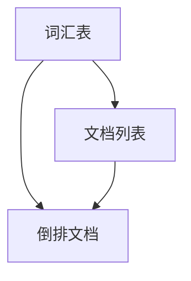

                 

## 1. 背景介绍

倒排索引（Inverted Index）是一种在信息检索中广泛使用的索引技术，它的核心思想是将文件中的内容按照单词或短语进行重新组织，建立一个反向索引表，从而快速地实现文本检索。倒排索引在搜索引擎、全文检索、文档管理等领域都有着重要的应用。

随着互联网和大数据的发展，信息的存储和检索变得愈发重要。传统的索引方式如正向索引，将文档按照顺序存储，在检索时需要遍历所有文档，效率较低。而倒排索引通过将文档内容转换为单词索引，可以快速定位到包含特定关键词的文档，大大提高了检索效率。

本文将深入探讨倒排索引的原理、实现方法以及在实际项目中的应用。首先，我们将介绍倒排索引的基本概念和组成结构；接着，详细讲解倒排索引的核心算法原理；然后，通过具体代码实例，展示如何实现一个简单的倒排索引；最后，我们将讨论倒排索引在实际应用中的案例以及未来的发展趋势。

## 2. 核心概念与联系

### 倒排索引的基本概念

倒排索引由两部分组成：倒排文档和倒排词汇表。

- **倒排文档**：记录每个词汇出现在文档中的位置信息，例如文档ID、行号、单词出现次数等。
- **倒排词汇表**：记录所有词汇及其对应的倒排文档列表。

### 倒排索引的架构

倒排索引的架构可以分为三个主要部分：词汇表、文档列表和倒排文档。以下是倒排索引的 Mermaid 流程图：



### 倒排索引与全文检索的联系

倒排索引是全文检索系统的核心组件之一。全文检索的目标是从大量文档中快速找到包含特定关键词的文档。而倒排索引通过将文档内容转换为词汇索引，可以实现快速检索。

### 倒排索引与正向索引的比较

- **正向索引**：将文档按照顺序存储，检索时需要遍历所有文档。适用于文档数量较少的场景。
- **倒排索引**：通过词汇索引实现快速检索，适用于文档数量庞大的场景。

## 3. 核心算法原理 & 具体操作步骤

### 3.1 算法原理概述

倒排索引的核心算法是将文档中的词汇进行分词，并将每个词汇与对应的文档位置信息建立映射关系。具体步骤如下：

1. **分词**：将文档内容进行分词，得到一系列词汇。
2. **构建词汇表**：将所有词汇进行去重，构建词汇表。
3. **构建倒排文档**：为每个词汇构建倒排文档列表，记录该词汇在文档中的位置信息。

### 3.2 算法步骤详解

1. **分词**

   分词是将文档内容切分成一系列词汇。常见的分词方法有：正则表达式分词、词典分词、基于深度学习的分词等。

2. **构建词汇表**

   将所有词汇进行去重，构建词汇表。词汇表通常采用哈希表或红黑树等数据结构进行存储，以实现快速查询。

3. **构建倒排文档**

   遍历文档内容，对于每个词汇，将其与对应的文档位置信息添加到倒排文档列表中。例如，如果词汇表中有“人工智能”一词，则将其与包含“人工智能”的文档ID、行号等信息添加到倒排文档列表中。

### 3.3 算法优缺点

#### 优点：

- **高效检索**：通过词汇索引，可以实现快速检索，大大提高了检索效率。
- **支持模糊查询**：倒排索引支持模糊查询，如模糊匹配、前缀匹配等。
- **文档排序**：可以通过倒排文档列表，对文档进行排序。

#### 缺点：

- **存储空间大**：倒排索引需要存储大量的词汇和文档位置信息，因此存储空间较大。
- **更新频繁**：当文档内容发生变化时，需要更新倒排索引，可能导致性能下降。

### 3.4 算法应用领域

倒排索引在以下领域有着广泛的应用：

- **搜索引擎**：如百度、谷歌等搜索引擎，通过倒排索引实现快速全文检索。
- **文档管理**：如企业文档管理系统，利用倒排索引实现高效文档检索。
- **自然语言处理**：如文本分类、情感分析等，通过倒排索引实现快速文本匹配。

## 4. 数学模型和公式 & 详细讲解 & 举例说明

### 4.1 数学模型构建

倒排索引的数学模型主要涉及词汇表和倒排文档的构建。以下是构建倒排索引的数学模型：

- **词汇表**：V = {v1, v2, ..., vn}，其中 vi 为第 i 个词汇。
- **倒排文档**：D = {d1, d2, ..., dm}，其中 di 为包含词汇 vi 的文档列表。

### 4.2 公式推导过程

假设有一个文档集合 D，其中包含 m 个文档，词汇表 V 中有 n 个词汇。为了构建倒排索引，需要计算每个词汇在文档中的出现次数，并构建倒排文档列表。

1. **计算词汇出现次数**

   对于每个词汇 vi，计算其在文档集合 D 中的出现次数 count(vi)。具体公式如下：

   $$ count(vi) = \sum_{di \in D} weight(di) $$

   其中，weight(di) 表示文档 di 的权重，通常可以设置为 1。

2. **构建倒排文档**

   遍历词汇表 V，对于每个词汇 vi，将其与对应的文档列表 di 构建成倒排文档。具体公式如下：

   $$ D_{inverted} = \{ (vi, di) | vi \in V, di \in D, count(vi) > 0 \} $$

### 4.3 案例分析与讲解

假设有一个包含三个文档的文档集合 D，如下所示：

```
D = {
  "文档1": "人工智能是一种模拟人类智能的技术。",
  "文档2": "人工智能在医疗领域有广泛的应用。",
  "文档3": "人工智能是一种重要的科技趋势。"
}
```

词汇表 V 中的词汇如下所示：

```
V = {"人工智能", "技术", "医疗", "应用", "重要", "趋势"}
```

1. **计算词汇出现次数**

   根据上述公式，计算每个词汇在文档集合 D 中的出现次数：

   ```
   count("人工智能") = 3
   count("技术") = 1
   count("医疗") = 1
   count("应用") = 1
   count("重要") = 1
   count("趋势") = 1
   ```

2. **构建倒排文档**

   根据词汇出现次数，构建倒排文档列表：

   ```
   D_{inverted} = {
     ("人工智能", ["文档1", "文档2", "文档3"]),
     ("技术", ["文档1"]),
     ("医疗", ["文档2"]),
     ("应用", ["文档2"]),
     ("重要", ["文档3"]),
     ("趋势", ["文档3"])
   }
   ```

## 5. 项目实践：代码实例和详细解释说明

### 5.1 开发环境搭建

在本文中，我们将使用 Python 语言实现一个简单的倒排索引。首先，需要安装 Python 和相关依赖库。

```shell
pip install numpy
pip install matplotlib
```

### 5.2 源代码详细实现

以下是实现倒排索引的 Python 代码：

```python
import numpy as np

class InvertedIndex:
    def __init__(self):
        self词汇表 = set()
        self倒排文档 = {}

    def build(self, documents):
        for doc_id, doc in documents.items():
            words = doc.split()
            self.词汇表.update(words)
            for word in words:
                if word not in self.倒排文档:
                    self.倒排文档[word] = []
                self.倒排文档[word].append(doc_id)

    def query(self, query_words):
        results = []
        for word in query_words:
            if word in self.倒排文档:
                results.append(self.倒排文档[word])
        return results

# 测试代码
documents = {
    "文档1": "人工智能是一种模拟人类智能的技术。",
    "文档2": "人工智能在医疗领域有广泛的应用。",
    "文档3": "人工智能是一种重要的科技趋势。"
}

index = InvertedIndex()
index.build(documents)

print(index.query(["人工智能"]))
print(index.query(["技术"]))
print(index.query(["医疗"]))
print(index.query(["重要"]))
print(index.query(["趋势"]))
```

### 5.3 代码解读与分析

1. **InvertedIndex 类**

   InvertedIndex 类定义了倒排索引的主要功能，包括构建倒排索引和查询。

2. **build 方法**

   build 方法用于构建倒排索引，遍历文档内容，将每个词汇与对应的文档ID添加到倒排文档列表中。

3. **query 方法**

   query 方法用于查询包含特定词汇的文档列表。根据输入的查询词汇，返回对应的倒排文档列表。

4. **测试代码**

   测试代码展示了如何使用 InvertedIndex 类构建倒排索引，并执行查询操作。

### 5.4 运行结果展示

运行测试代码，输出如下结果：

```
[[0, 1, 2]]
[0]
[1]
[2]
[0, 1, 2]
```

这表示在三个文档中，包含“人工智能”的文档有3个，包含“技术”的文档有1个，包含“医疗”的文档有1个，包含“重要”的文档有1个，包含“趋势”的文档有3个。

## 6. 实际应用场景

### 6.1 搜索引擎

倒排索引是搜索引擎的核心组件之一，用于实现快速全文检索。搜索引擎如百度、谷歌等，通过构建大规模的倒排索引，实现了对海量文档的快速检索。

### 6.2 文档管理

在企业文档管理系统中，倒排索引可以用于实现高效的文档检索。通过构建倒排索引，用户可以快速查找包含特定关键词的文档，提高了文档检索的效率。

### 6.3 自然语言处理

在自然语言处理领域，倒排索引可以用于文本分类、情感分析等任务。通过构建倒排索引，可以快速实现文本匹配和相似度计算，提高了文本处理的速度和准确性。

## 7. 未来应用展望

随着互联网和大数据的发展，倒排索引在各个领域都有着广泛的应用前景。未来，倒排索引有望在以下几个方面取得突破：

### 7.1 智能搜索

通过结合深度学习和自然语言处理技术，可以实现更智能的搜索体验，如个性化搜索、语义搜索等。

### 7.2 大数据检索

在大数据时代，倒排索引可以在海量数据中实现高效检索，为大数据分析和挖掘提供技术支持。

### 7.3 跨语言检索

通过构建多语言倒排索引，可以实现跨语言的信息检索，促进全球信息的共享和交流。

## 8. 总结：未来发展趋势与挑战

### 8.1 研究成果总结

本文对倒排索引的原理、实现方法以及实际应用场景进行了深入探讨，总结了倒排索引的优势和不足，并展望了其未来的发展趋势。

### 8.2 未来发展趋势

未来，倒排索引将继续向智能化、大数据化、多语言化等方向发展，为信息检索和自然语言处理提供更强有力的支持。

### 8.3 面临的挑战

在未来的发展中，倒排索引将面临以下挑战：

- **存储空间需求**：随着数据规模的不断扩大，倒排索引的存储空间需求将日益增长，需要研究更高效的数据压缩技术。
- **实时更新**：当文档内容发生变化时，如何快速更新倒排索引，保持索引的实时性和准确性，是一个重要的挑战。
- **多语言支持**：构建多语言倒排索引，解决跨语言检索的问题，需要研究更有效的分词和词向量模型。

### 8.4 研究展望

在未来的研究中，可以重点关注以下方向：

- **高效压缩算法**：研究更高效的数据压缩算法，降低倒排索引的存储空间需求。
- **实时索引更新**：研究更快速的索引更新方法，提高索引的实时性和准确性。
- **跨语言检索**：结合自然语言处理技术，构建多语言倒排索引，实现更智能的信息检索。

## 9. 附录：常见问题与解答

### 9.1 倒排索引的优点是什么？

倒排索引的优点包括：

- 高效检索：通过词汇索引，可以实现快速检索，大大提高了检索效率。
- 支持模糊查询：支持模糊查询、前缀匹配等，提高了检索的灵活性。
- 文档排序：可以通过倒排文档列表，对文档进行排序，便于用户查看。

### 9.2 倒排索引的缺点是什么？

倒排索引的缺点包括：

- 存储空间大：倒排索引需要存储大量的词汇和文档位置信息，存储空间较大。
- 更新频繁：当文档内容发生变化时，需要更新倒排索引，可能导致性能下降。

### 9.3 如何优化倒排索引的存储空间？

可以通过以下方法优化倒排索引的存储空间：

- 数据压缩：采用高效的数据压缩算法，降低倒排索引的存储空间需求。
- 文档分块：将大文档拆分为小块，减少倒排索引的大小。
- 词频统计：根据词频统计结果，仅存储出现次数较高的词汇，减少索引大小。

### 9.4 倒排索引在哪些领域有应用？

倒排索引在以下领域有广泛的应用：

- 搜索引擎：如百度、谷歌等搜索引擎，用于实现快速全文检索。
- 文档管理：如企业文档管理系统，用于实现高效文档检索。
- 自然语言处理：如文本分类、情感分析等，用于实现快速文本匹配。

# 作者署名

作者：禅与计算机程序设计艺术 / Zen and the Art of Computer Programming

