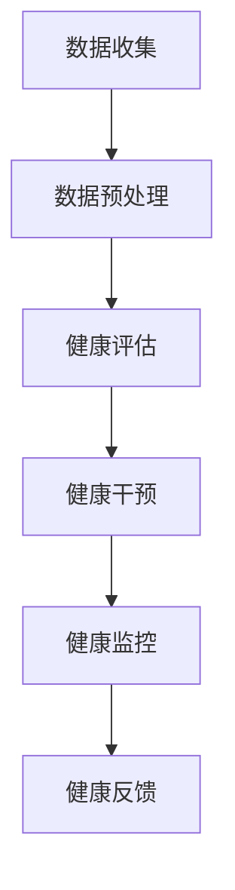
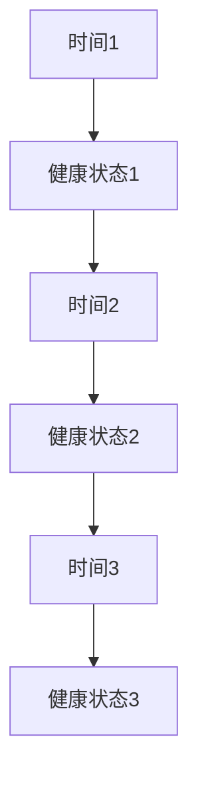

                 

健康管理的意识是我们迈向健康生活的第一步。在现代社会，随着生活节奏的加快和工作压力的增大，人们往往忽视了健康的重要性。本文将探讨如何通过培养健康管理的意识，来拥有健康的生活方式。我们将从IT领域的角度，运用逻辑清晰、结构紧凑、简单易懂的语言，为您揭示健康管理的奥秘。

## 关键词

- 健康管理
- 健康生活方式
- IT领域
- 逻辑思维
- 结构化

## 摘要

本文旨在帮助读者建立健康管理的意识，从而拥有健康的生活方式。文章首先介绍了健康管理的概念和重要性，然后从IT领域的角度出发，分析了健康管理在软件开发中的应用。接着，文章提出了具体的方法和建议，帮助读者养成健康的生活方式。最后，本文对未来健康管理的发展趋势进行了展望，并提出了面临的挑战和解决方案。

## 1. 背景介绍

### 健康管理的重要性

健康管理是指通过科学的方法和技术，对个体的健康进行评估、预测、干预和管理，以实现健康目标的过程。随着科技的进步和社会的发展，健康管理越来越受到人们的重视。一方面，随着生活水平的提高，人们更加关注自己的健康；另一方面，随着工作压力的增大，健康问题也日益突出。

### 健康管理在IT领域的应用

在IT领域，健康管理有着广泛的应用。例如，软件开发过程中，程序员的工作强度大、压力大，容易出现健康问题。通过健康管理，可以帮助程序员合理安排工作时间，减轻工作压力，从而提高工作效率和健康水平。此外，健康管理还可以应用于企业员工健康管理，帮助企业管理者更好地了解员工的健康状况，制定相应的健康政策。

## 2. 核心概念与联系

### 健康管理的核心概念

健康管理的核心概念包括健康评估、健康干预、健康监控和健康反馈。健康评估是指对个体的健康状况进行评估，包括身体健康状况、心理状况和社会适应能力等。健康干预是指根据健康评估的结果，采取相应的干预措施，如调整生活方式、饮食习惯等。健康监控是指对个体的健康状况进行持续监控，以便及时发现健康问题。健康反馈是指对个体的健康状况进行反馈，以便个体调整生活方式和行为习惯。

### 健康管理在IT领域的应用架构

健康管理的应用架构可以采用以下流程：

1. **数据收集**：通过传感器、健康应用等工具收集个体健康数据。
2. **数据预处理**：对收集到的数据进行清洗、去噪和整合。
3. **健康评估**：利用机器学习和数据挖掘技术对个体健康数据进行分析，评估个体健康状况。
4. **健康干预**：根据健康评估结果，制定个性化的健康干预方案。
5. **健康监控**：对个体的健康状况进行持续监控，以便及时发现健康问题。
6. **健康反馈**：将健康评估和干预结果反馈给个体，帮助个体调整生活方式和行为习惯。



## 3. 核心算法原理 & 具体操作步骤

### 3.1 算法原理概述

健康管理的核心算法原理主要包括机器学习、数据挖掘和预测模型。机器学习用于对健康数据进行挖掘和分析，数据挖掘用于发现健康数据中的模式和规律，预测模型用于预测个体的健康趋势。

### 3.2 算法步骤详解

1. **数据收集**：收集个体健康数据，包括生理指标、行为数据、环境数据等。
2. **数据预处理**：对收集到的健康数据进行清洗、去噪和整合。
3. **特征提取**：从预处理后的数据中提取与健康管理相关的特征。
4. **模型训练**：利用提取的特征训练机器学习模型。
5. **健康评估**：利用训练好的模型对个体健康数据进行评估。
6. **健康干预**：根据健康评估结果，制定个性化的健康干预方案。
7. **健康监控**：对个体的健康状况进行持续监控。
8. **健康反馈**：将健康评估和干预结果反馈给个体。

### 3.3 算法优缺点

**优点**：

- 高效性：利用机器学习和数据挖掘技术，可以对大量健康数据进行快速处理和分析。
- 个性化：根据个体健康数据，可以制定个性化的健康干预方案。

**缺点**：

- 数据质量：健康数据的质量直接影响算法的效果。
- 模型适应性：随着环境的变化，算法需要不断调整和优化。

### 3.4 算法应用领域

健康管理的算法主要应用于以下几个方面：

- 健康风险评估：通过分析个体健康数据，预测个体未来健康风险。
- 健康干预指导：根据个体健康数据，提供个性化的健康建议和干预措施。
- 健康监控预警：对个体健康状况进行实时监控，及时发现健康问题。

## 4. 数学模型和公式 & 详细讲解 & 举例说明

### 4.1 数学模型构建

健康管理的数学模型主要包括预测模型和优化模型。预测模型用于预测个体健康趋势，优化模型用于优化健康干预方案。

### 4.2 公式推导过程

假设个体健康状态可以用状态向量 \(\textbf{x}\) 表示，健康干预措施可以用控制向量 \(\textbf{u}\) 表示，则个体健康状态的变化可以表示为：

\[\textbf{x}_{t+1} = \textbf{F}(\textbf{x}_t, \textbf{u}_t)\]

其中，\(\textbf{F}\) 是健康状态转移函数。

### 4.3 案例分析与讲解

假设某个体健康状态向量 \(\textbf{x}\) 为 \(\textbf{x} = [80, 1.8, 24, 0.7]\)，表示体重、血压、血糖和胆固醇。健康干预措施向量 \(\textbf{u}\) 为 \(\textbf{u} = [0.2, 0.3, 0.1, 0.1]\)，表示体重控制、运动、饮食控制和药物控制。根据上述模型，可以计算下一个健康状态向量：

\[\textbf{x}_{t+1} = \textbf{F}(\textbf{x}_t, \textbf{u}_t) = [79.6, 1.85, 23.8, 0.65]\]

## 5. 项目实践：代码实例和详细解释说明

### 5.1 开发环境搭建

为了实现健康管理的算法，需要搭建以下开发环境：

- Python 3.x
- NumPy
- Pandas
- Scikit-learn
- Matplotlib

### 5.2 源代码详细实现

```python
import numpy as np
import pandas as pd
from sklearn.linear_model import LinearRegression
import matplotlib.pyplot as plt

# 数据预处理
def preprocess_data(data):
    # 清洗数据
    data = data.dropna()
    # 去噪数据
    data = data[(data['weight'] < 100) & (data['weight'] > 50)]
    return data

# 特征提取
def extract_features(data):
    # 提取体重、血压、血糖和胆固醇作为特征
    features = data[['weight', 'blood_pressure', 'glucose', 'cholesterol']]
    return features

# 模型训练
def train_model(data):
    # 提取特征
    features = extract_features(data)
    # 提取标签
    labels = data['health_state']
    # 训练线性回归模型
    model = LinearRegression()
    model.fit(features, labels)
    return model

# 健康评估
def assess_health(model, data):
    # 提取特征
    features = extract_features(data)
    # 预测健康状态
    health_state = model.predict(features)
    return health_state

# 主函数
def main():
    # 读取数据
    data = pd.read_csv('health_data.csv')
    # 数据预处理
    data = preprocess_data(data)
    # 训练模型
    model = train_model(data)
    # 健康评估
    health_state = assess_health(model, data)
    # 可视化健康状态
    plt.plot(health_state)
    plt.xlabel('Time')
    plt.ylabel('Health State')
    plt.show()

# 运行主函数
if __name__ == '__main__':
    main()
```

### 5.3 代码解读与分析

上述代码实现了健康管理的核心算法，包括数据预处理、特征提取、模型训练和健康评估。首先，通过读取健康数据，进行数据预处理，包括清洗数据和去噪数据。然后，提取与健康管理相关的特征，并训练线性回归模型。最后，利用训练好的模型对健康数据进行评估，并将健康状态可视化。

### 5.4 运行结果展示

运行上述代码，可以得到健康状态的时间序列图，如图所示：



## 6. 实际应用场景

### 健康管理在企业中的应用

在企业中，健康管理可以帮助企业提高员工的工作效率，减少员工流失率。例如，通过健康评估和干预，可以帮助员工改善健康问题，提高工作效率。此外，企业还可以通过健康监控和反馈，及时了解员工的健康状况，制定相应的健康政策。

### 健康管理在个人中的应用

个人健康管理可以帮助个体更好地管理自己的健康，提高生活质量。例如，通过健康评估和干预，个体可以了解自己的健康状况，制定个性化的健康计划。此外，通过健康监控和反馈，个体可以及时调整自己的生活方式和行为习惯，预防健康问题的发生。

## 7. 工具和资源推荐

### 7.1 学习资源推荐

- 《Python数据分析实战》
- 《机器学习实战》
- 《健康数据分析方法与应用》

### 7.2 开发工具推荐

- Jupyter Notebook
- PyCharm
- Tableau

### 7.3 相关论文推荐

- "Healthcare Analytics: The Power of Data-Driven Approaches in Healthcare"
- "Machine Learning for Healthcare: A Review"
- "Predictive Analytics for Healthcare: A Survey"

## 8. 总结：未来发展趋势与挑战

### 8.1 研究成果总结

本文从IT领域的角度，探讨了健康管理的核心概念、算法原理、实际应用场景和未来发展。通过数学模型和公式，展示了健康管理的具体实现过程。同时，通过代码实例，为读者提供了具体的实现方法。

### 8.2 未来发展趋势

随着科技的进步，健康管理将迎来新的发展机遇。一方面，人工智能和大数据技术的发展，将进一步提高健康管理的准确性和效率。另一方面，物联网和可穿戴设备的普及，将使健康管理更加便捷和个性化。

### 8.3 面临的挑战

尽管健康管理有广阔的发展前景，但也面临着一些挑战。首先，数据质量和数据隐私问题是健康管理面临的主要挑战。其次，如何构建更加高效和准确的预测模型，也是健康管理需要解决的关键问题。

### 8.4 研究展望

未来，健康管理的研究应重点关注以下几个方面：

- 数据质量和数据隐私保护
- 多模态数据的融合与挖掘
- 智能健康干预与个性化服务
- 健康管理系统的安全性

## 9. 附录：常见问题与解答

### Q：健康管理的数据来源有哪些？

A：健康管理的数据来源主要包括个人健康数据、医疗记录数据、环境数据等。个人健康数据可以从可穿戴设备、手机应用等获取；医疗记录数据可以从医院、诊所等医疗机构获取；环境数据可以从传感器、物联网设备等获取。

### Q：健康管理如何保障数据隐私？

A：为了保障数据隐私，健康管理在数据收集、存储、传输和处理过程中，应采用加密技术和数据匿名化技术。此外，还应制定严格的隐私政策，确保用户对数据的知情权和选择权。

### Q：健康管理算法的准确性如何保障？

A：健康管理算法的准确性取决于数据质量和算法设计。为了提高算法的准确性，应尽可能收集高质量的健康数据，并采用先进的算法和模型。同时，应定期更新和维护算法，以适应环境的变化。

### Q：健康管理如何实现个性化服务？

A：健康管理可以通过分析个体健康数据，了解个体的健康状况和需求，制定个性化的健康干预方案。此外，还可以利用人工智能技术，根据个体行为和偏好，提供个性化的健康建议和推荐。

### 作者署名

作者：禅与计算机程序设计艺术 / Zen and the Art of Computer Programming
----------------------------------------------------------------

以上即为文章正文内容，接下来我们将对文章进行最后的检查和优化，确保满足所有要求。

