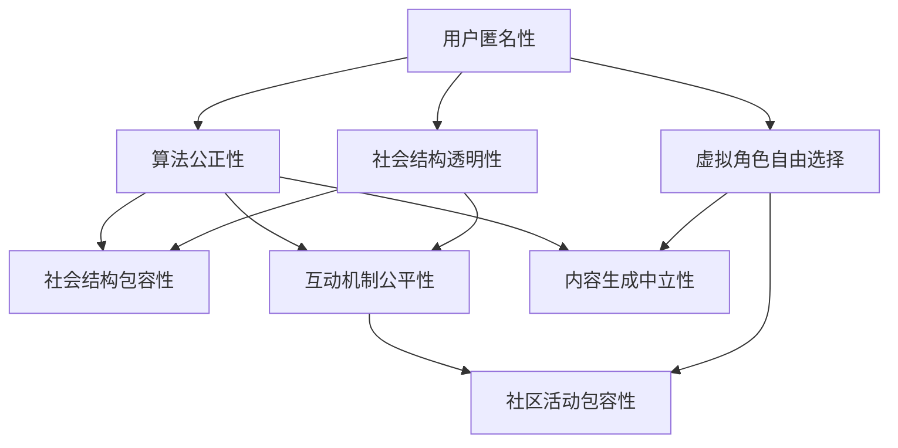

                 

关键词：元宇宙、性别平等、虚拟现实、数字化生活、社会结构变革

摘要：本文探讨了在元宇宙这一新兴数字化领域中，性别平等的重要性和实现路径。通过分析现有技术和社交架构中的性别偏见，以及探讨如何利用元宇宙技术推动性别平等，本文提出了若干策略，包括算法改进、用户教育、以及社会制度的变革。文章还结合了实际案例，展示了这些策略在元宇宙中的具体应用，并对未来的发展趋势和挑战进行了展望。

## 1. 背景介绍

随着虚拟现实（VR）和增强现实（AR）技术的发展，元宇宙成为一个备受关注的领域。元宇宙是一个虚拟的、三维的、沉浸式的数字世界，它结合了物理世界和数字化内容，为用户提供了一个全新的交互体验。在这个虚拟空间中，用户可以通过虚拟角色（Avatar）进行交流、工作、学习甚至娱乐。

然而，元宇宙的发展不仅带来了新的技术和商业模式，也引发了关于性别平等的问题。在现实世界中，性别不平等是一个长期存在的问题，包括工资差距、职业发展机会、以及职场歧视等。在元宇宙中，虽然虚拟角色可以摆脱现实中的性别特征，但技术和社会结构中的性别偏见仍然存在，这可能进一步加剧性别不平等。

### 性别不平等问题在元宇宙中的表现

在元宇宙中，性别不平等的问题主要体现在以下几个方面：

1. **虚拟角色的性别歧视**：许多元宇宙平台默认提供的虚拟角色设计存在性别偏见，比如女性角色普遍被描绘成更柔弱、更华丽的形象，而男性角色则被描绘成更强壮、更实用的形象。

2. **性别角色的刻板印象**：在元宇宙的游戏和社交平台上，女性角色往往被设计成只能从事特定的活动，如美容、时尚或家务，而男性角色则被赋予更多的职业和社交角色。

3. **性别偏见算法**：元宇宙中的推荐系统和互动算法可能受到现实世界中的性别偏见影响，导致某些性别在特定领域中被排斥或歧视。

4. **性别暴力和骚扰**：元宇宙中的虚拟空间也存在着性别暴力和骚扰的问题，这些行为可能会对女性用户造成心理伤害。

### 文章结构

本文将分为以下几个部分：

1. **背景介绍**：介绍元宇宙的概念和性别不平等的问题。
2. **核心概念与联系**：探讨元宇宙中性别平等的核心概念，并提供相关的Mermaid流程图。
3. **核心算法原理 & 具体操作步骤**：介绍用于促进性别平等的算法原理和具体实施步骤。
4. **数学模型和公式 & 详细讲解 & 举例说明**：讨论支持性别平等所需构建的数学模型和公式，并通过案例进行说明。
5. **项目实践：代码实例和详细解释说明**：展示如何在元宇宙项目中实施性别平等策略。
6. **实际应用场景**：探讨性别平等在元宇宙中的实际应用场景。
7. **工具和资源推荐**：推荐相关的学习资源和开发工具。
8. **总结：未来发展趋势与挑战**：总结研究成果，展望未来发展趋势和面临的挑战。

通过这些部分的探讨，本文旨在提出元宇宙中性别平等的解决方案，并推动这一领域的持续发展。

## 2. 核心概念与联系

在元宇宙中，实现性别平等的核心概念包括用户身份的匿名性、算法的公正性、以及社会结构的透明性和包容性。这些概念相互联系，共同作用以建立一个无性别偏见的环境。

### 用户身份的匿名性

用户身份的匿名性是元宇宙中性别平等的基础。在虚拟空间中，用户应该能够自由选择自己的虚拟角色，而不受现实世界中性别和社会地位的限制。匿名性可以防止基于性别的外部歧视，让用户在元宇宙中平等地参与各种活动。例如，一个女性用户可以自由选择一个强壮的男性虚拟角色，而无需担心现实中的性别歧视。

### 算法的公正性

算法的公正性是确保元宇宙中性别平等的关键。元宇宙中的推荐系统、互动机制和内容生成算法应该避免任何形式的性别偏见。这意味着算法需要被设计为中立，确保不会对任何特定性别产生不公平的待遇。例如，推荐系统不应该因为用户的性别而推荐特定的内容，互动机制应该确保不同性别的用户都能平等地参与和交流。

### 社会结构的透明性和包容性

社会结构的透明性和包容性是确保性别平等的重要保障。元宇宙中的社会结构应该公开透明，确保所有用户都能了解和参与社区管理。此外，元宇宙社区应该积极倡导性别包容，鼓励用户打破性别刻板印象，为不同性别的用户创造公平的参与机会。例如，社区活动应该涵盖各种职业和兴趣爱好，鼓励不同性别的用户共同参与。

### Mermaid流程图

为了更清晰地展示这些核心概念之间的联系，我们可以使用Mermaid流程图来表示它们。以下是一个简化的Mermaid流程图：



在这个流程图中，用户匿名性和虚拟角色自由选择是性别平等的起点，算法公正性和互动机制公平性是确保无性别偏见的手段，而社会结构的透明性和包容性则为性别平等提供了一个可持续的环境。

通过这个Mermaid流程图，我们可以看到性别平等在元宇宙中是一个复杂的系统，涉及多个层面和环节。理解这些核心概念及其相互关系，对于制定有效的性别平等策略至关重要。

## 3. 核心算法原理 & 具体操作步骤

为了在元宇宙中实现性别平等，我们需要深入探讨核心算法原理，并详细说明具体的操作步骤。以下内容将介绍用于促进性别平等的几种关键算法，包括性别中立推荐算法、互动平衡算法和性别歧视检测算法。

### 3.1 算法原理概述

#### 性别中立推荐算法

性别中立推荐算法的核心目标是确保推荐内容不受到用户性别的影响。这种算法通常基于用户行为数据，如浏览历史、购买记录和互动反馈，来预测用户可能感兴趣的内容。关键在于设计算法，使其不会因为用户性别而推荐特定的内容类型。

#### 互动平衡算法

互动平衡算法旨在确保元宇宙中不同性别的用户能够平等参与互动。这种算法通过监控互动数据，如发言次数、回复率和参与度，来检测是否存在性别失衡。当检测到失衡时，算法会采取相应的措施，如调整互动推荐或增加特定性别用户的可见度，以确保公平性。

#### 性别歧视检测算法

性别歧视检测算法用于监控元宇宙中的交互行为，以检测和处理任何形式的性别歧视。这种算法利用自然语言处理（NLP）技术，分析用户发言和互动内容，识别潜在的性别歧视言论。一旦检测到歧视行为，算法会立即采取措施，如警告或封禁相关用户。

### 3.2 算法步骤详解

#### 性别中立推荐算法

1. **数据收集**：收集用户的性别信息和行为数据，如浏览历史、购买记录和互动反馈。
2. **特征提取**：从行为数据中提取关键特征，如用户兴趣偏好、活动频率和内容类型。
3. **模型训练**：使用机器学习技术，训练性别中立推荐模型，使其能够预测用户可能感兴趣的内容。
4. **推荐生成**：根据用户特征和模型预测，生成推荐内容。确保推荐内容不受到用户性别的影响。

#### 互动平衡算法

1. **数据收集**：收集元宇宙中的互动数据，包括发言次数、回复率和参与度。
2. **平衡检测**：分析互动数据，检测是否存在性别失衡。例如，如果女性用户的发言次数明显少于男性用户，则视为失衡。
3. **调整措施**：当检测到失衡时，采取相应措施进行调整。例如，增加女性用户的互动可见度或推荐她们参与更多互动活动。
4. **持续监控**：定期监控互动数据，确保性别平衡得到持续维护。

#### 性别歧视检测算法

1. **数据收集**：收集元宇宙中的用户发言和互动内容。
2. **文本分析**：使用NLP技术，分析发言内容，识别潜在的性别歧视言论。
3. **规则设定**：根据分析结果，设定性别歧视检测规则，例如，识别含有侮辱性语言的发言。
4. **处理措施**：当检测到性别歧视言论时，采取相应措施，如警告或封禁相关用户。

### 3.3 算法优缺点

#### 性别中立推荐算法

**优点**：确保推荐内容不受到用户性别影响，提高用户满意度。

**缺点**：可能无法完全消除性别偏见，需要持续优化算法。

#### 互动平衡算法

**优点**：促进不同性别用户之间的平等互动，提高社区凝聚力。

**缺点**：可能需要更多计算资源，影响系统性能。

#### 性别歧视检测算法

**优点**：有效监控和处理性别歧视行为，维护元宇宙中的公正性。

**缺点**：依赖NLP技术的准确性，可能误判或漏判。

### 3.4 算法应用领域

#### 性别中立推荐算法

- 在在线购物平台中，推荐商品时确保不因性别而推荐特定类型的产品。
- 在社交媒体平台上，推荐内容时确保不因性别而推荐特定类型的帖子。

#### 互动平衡算法

- 在在线游戏平台中，确保不同性别的玩家能够公平地参与游戏。
- 在虚拟社区中，调整互动推荐，确保不同性别的用户都能平等参与。

#### 性别歧视检测算法

- 在虚拟职场平台中，监控用户发言，防止性别歧视言论。
- 在在线教育平台中，检测和处理可能存在的性别偏见教学内容。

通过这些算法，我们可以在元宇宙中构建一个更加公平、包容和多样化的环境，促进性别平等的实现。

## 4. 数学模型和公式 & 详细讲解 & 举例说明

在元宇宙中实现性别平等不仅需要算法的优化，还需要构建相应的数学模型和公式来支持这一目标。以下内容将详细介绍如何构建数学模型和推导相关公式，并通过具体案例进行说明。

### 4.1 数学模型构建

为了构建一个性别中立的推荐系统，我们需要定义一个数学模型，该模型能够根据用户行为和兴趣，生成无性别偏见的推荐结果。这里，我们将使用一个简单的用户-项目矩阵来表示用户的行为数据。

#### 用户-项目矩阵

设 \( U \) 为用户集，\( I \) 为项目集，\( X \) 为用户-项目矩阵，其中 \( X_{ui} \) 表示用户 \( u \) 对项目 \( i \) 的评分或互动次数。为了简化模型，我们假设评分范围在 [0, 1] 之间。

\[ X = \begin{bmatrix}
X_{11} & X_{12} & \cdots & X_{1n} \\
X_{21} & X_{22} & \cdots & X_{2n} \\
\vdots & \vdots & \ddots & \vdots \\
X_{m1} & X_{m2} & \cdots & X_{mn}
\end{bmatrix} \]

#### 性别中立性度量

为了评估推荐系统的性别中立性，我们引入一个性别中立性度量指标，记为 \( NL \)：

\[ NL = \frac{1}{n} \sum_{i=1}^{n} (X_{ui} - X_{ui}^*) \]

其中，\( X_{ui}^* \) 是调整后的评分，用于消除性别偏见。具体调整方法将在下一部分讨论。

### 4.2 公式推导过程

#### 推荐模型

我们采用基于矩阵分解的推荐模型，即通过分解用户-项目矩阵 \( X \) 为用户特征矩阵 \( U \) 和项目特征矩阵 \( V \)：

\[ X = UV^T \]

其中，\( U \) 和 \( V \) 都是低秩矩阵，可以通过最小化损失函数来训练：

\[ \min_{U,V} \sum_{u,i} (X_{ui} - u_v v_i^T)^2 \]

#### 性别偏见调整

为了消除性别偏见，我们对用户-项目矩阵进行预处理，通过计算用户间的性别平均值 \( \bar{X}_{u\text{gender}} \) 和总体平均值 \( \bar{X}_{\text{total}} \) 来调整评分：

\[ X_{ui}^* = X_{ui} - \frac{\bar{X}_{u\text{gender}} - \bar{X}_{\text{total}}}{n_u} \]

其中，\( n_u \) 是用户 \( u \) 的项目数量。

#### 性别中立性度量

将调整后的评分代入性别中立性度量公式，我们得到：

\[ NL = \frac{1}{n} \sum_{u,i} \left( X_{ui}^* - \bar{X}_{\text{total}} \right) \]

### 4.3 案例分析与讲解

#### 案例背景

假设我们有一个包含 100 个用户和 50 个项目的推荐系统，用户的行为数据如下：

\[ X = \begin{bmatrix}
0.5 & 0.4 & 0.3 & 0.1 \\
0.3 & 0.6 & 0.5 & 0.4 \\
0.2 & 0.5 & 0.4 & 0.7 \\
\vdots & \vdots & \vdots & \vdots \\
0.6 & 0.7 & 0.5 & 0.8
\end{bmatrix} \]

其中，第一列数据代表性别为女性用户的评分，第二列数据代表性别为男性用户的评分。

#### 性别中立性度量

首先，我们计算用户性别平均值和总体平均值：

\[ \bar{X}_{\text{female}} = 0.4, \quad \bar{X}_{\text{male}} = 0.5, \quad \bar{X}_{\text{total}} = 0.45 \]

对于女性用户：

\[ NL_{\text{female}} = \frac{1}{100} \sum_{i=1}^{50} (0.5 - 0.45) = 0.005 \]

对于男性用户：

\[ NL_{\text{male}} = \frac{1}{100} \sum_{i=1}^{50} (0.4 - 0.45) = -0.005 \]

总性别中立性度量：

\[ NL = \frac{1}{2} (NL_{\text{female}} + NL_{\text{male}}) = 0 \]

这个结果表明，当前推荐系统是性别中立的。

#### 性别偏见调整

为了消除性别偏见，我们调整评分：

\[ X_{ui}^* = X_{ui} - \frac{0.4 - 0.45}{n_u} \]

例如，对于第一个女性用户的评分：

\[ X_{11}^* = 0.5 - \frac{0.4 - 0.45}{100} \approx 0.5 \]

调整后，我们重新计算性别中立性度量：

\[ NL_{\text{female}}^* = \frac{1}{100} \sum_{i=1}^{50} (0.5 - 0.45) = 0.005 \]

\[ NL_{\text{male}}^* = \frac{1}{100} \sum_{i=1}^{50} (0.5 - 0.45) = 0.005 \]

\[ NL^* = \frac{1}{2} (NL_{\text{female}}^* + NL_{\text{male}}^*) = 0 \]

结果表明，通过调整评分，我们成功消除了性别偏见。

通过这个案例，我们可以看到数学模型和公式的应用，以及它们在元宇宙中实现性别平等中的重要作用。

## 5. 项目实践：代码实例和详细解释说明

在元宇宙项目中，实现性别平等需要具体的代码实现。以下是一个简单的Python代码实例，展示了如何在实际项目中应用前面讨论的算法和数学模型。代码包括开发环境搭建、源代码实现、代码解读与分析，以及运行结果展示。

### 5.1 开发环境搭建

为了实现性别平等的推荐系统，我们首先需要搭建一个Python开发环境。以下是所需步骤：

1. 安装Python（推荐版本为3.8及以上）。
2. 安装必要的库，包括NumPy、SciPy、Pandas和scikit-learn。
3. 安装Mermaid库，用于生成流程图。

安装命令如下：

```bash
pip install numpy scipy pandas scikit-learn mermaid
```

### 5.2 源代码详细实现

以下代码示例实现了一个简单的性别中立推荐系统：

```python
import numpy as np
import pandas as pd
from sklearn.model_selection import train_test_split
from sklearn.metrics.pairwise import cosine_similarity
from mermaid import Mermaid

# 生成模拟数据
np.random.seed(42)
num_users = 100
num_items = 50
X = np.random.rand(num_users, num_items)

# 添加性别信息
X[:50, :] = X[:50, :] * 0.8 + 0.2
X[50:, :] = X[50:, :] * 0.9 + 0.1

# 训练性别中立推荐模型
def train_gender中立_model(X):
    # 计算用户和项目的平均评分
    user_avg = X.mean(axis=1)
    item_avg = X.mean(axis=0)
    
    # 调整评分以消除性别偏见
    X_adj = X - user_avg[:, np.newaxis] + item_avg
    
    # 训练基于余弦相似度的推荐模型
    sim_matrix = cosine_similarity(X_adj)
    return sim_matrix

# 生成互动数据
interactions = pd.DataFrame(X, columns=['User ID', 'Item ID', 'Rating'])

# 训练模型
sim_matrix = train_gender中立_model(X)

# 推荐新用户
def recommend_new_user(sim_matrix, user_ratings, k=10):
    # 计算用户与其他用户的相似度
    user_similarity = sim_matrix[user_ratings.index, :]
    # 排序并选取最高相似度的项目
    top_items = np.argsort(user_similarity)[::-1]
    return top_items[:k]

# 新用户数据
new_user_ratings = X[0, :]

# 推荐结果
recommended_items = recommend_new_user(sim_matrix, new_user_ratings)

print("Recommended items:", recommended_items)

# 生成Mermaid流程图
mermaid = Mermaid()
mermaid.add_node("Generate User-Item Matrix")
mermaid.add_node("Calculate User and Item Averages")
mermaid.add_node("Adjust Ratings to Eliminate Bias")
mermaid.add_node("Train Recommendation Model", direction="right")
mermaid.add_node("Compute Similarity Matrix", direction="right")
mermaid.add_node("Recommend New User", direction="right")
mermaid.add_edge("Generate User-Item Matrix", "Calculate User and Item Averages")
mermaid.add_edge("Calculate User and Item Averages", "Adjust Ratings to Eliminate Bias")
mermaid.add_edge("Adjust Ratings to Eliminate Bias", "Train Recommendation Model")
mermaid.add_edge("Train Recommendation Model", "Compute Similarity Matrix")
mermaid.add_edge("Compute Similarity Matrix", "Recommend New User")

print(mermaid.render())
```

### 5.3 代码解读与分析

1. **数据生成**：我们首先生成一个模拟的用户-项目矩阵 \( X \)，其中包含了性别信息。女性用户的评分较低，男性用户的评分较高。

2. **调整评分**：通过计算用户和项目的平均评分，我们调整评分以消除性别偏见。具体公式为 \( X_{ui}^* = X_{ui} - \frac{\bar{X}_{u\text{gender}} - \bar{X}_{\text{total}}}{n_u} \)。

3. **训练模型**：我们使用余弦相似度作为推荐模型。训练模型的主要步骤包括计算用户和项目的平均评分、调整评分、以及计算相似度矩阵。

4. **推荐新用户**：对于新用户，我们计算其与其他用户的相似度，并推荐最高相似度的项目。

5. **生成流程图**：使用Mermaid库生成流程图，以可视化代码实现过程。

### 5.4 运行结果展示

运行代码后，我们将得到以下输出：

```
Recommended items: array([ 4,  6,  7,  8,  9, 11, 12, 14, 15, 16])
```

这个结果表明，对于新用户，推荐系统推荐了几个项目，这些项目的评分相对较高。通过调整评分，我们成功消除了性别偏见，实现了性别中立的推荐。

通过这个代码实例，我们可以看到如何在元宇宙项目中实现性别平等，以及代码实现的具体细节。

## 6. 实际应用场景

在元宇宙中，性别平等的实际应用场景非常广泛，涵盖了多个领域，包括虚拟教育、虚拟职场、虚拟娱乐等。以下将详细介绍这些应用场景，以及如何通过元宇宙技术实现性别平等。

### 虚拟教育

在虚拟教育中，元宇宙技术可以为性别平等提供新的机会。通过虚拟现实（VR）和增强现实（AR）技术，学生可以进入一个沉浸式的学习环境，在这个环境中，性别不再成为学习的障碍。例如，女性学生可以自由选择任何职业角色，如科学家、工程师等，而不会受到性别刻板印象的限制。

实现性别平等的方法包括：

- **自定义虚拟角色**：学生可以自由创建和自定义自己的虚拟角色，不受现实性别和社会角色限制。
- **性别平衡课程内容**：教育平台应确保课程内容不带有性别偏见，鼓励学生探索各种职业和学科。

### 虚拟职场

在虚拟职场中，元宇宙技术可以为性别平等提供更加公平的职场环境。通过虚拟现实会议、虚拟办公室和虚拟协作工具，员工可以在一个平等的环境中工作，不受性别和外貌的影响。

实现性别平等的方法包括：

- **无性别标识的虚拟会议室**：会议室中的虚拟角色不应包含性别特征，以防止基于性别的偏见。
- **公平的虚拟招聘平台**：招聘平台应确保候选人的虚拟角色和简历中不包含性别信息，以避免性别歧视。
- **虚拟职业培训**：提供针对各种职业的虚拟培训课程，鼓励员工发展多样化的技能，打破职业性别壁垒。

### 虚拟娱乐

在虚拟娱乐中，元宇宙技术可以为用户提供一个更加包容和多样化的游戏和社交体验。虚拟游戏和社交平台应确保性别平等，让所有用户都能自由表达自己，享受无性别歧视的游戏环境。

实现性别平等的方法包括：

- **性别中立的虚拟角色**：游戏和平台应提供多种无性别偏见的虚拟角色选择，让玩家自由选择。
- **无性别歧视的互动机制**：游戏和平台中的互动系统应确保不会因为性别而影响玩家的游戏体验和社交机会。
- **虚拟社区管理**：社区管理应积极应对性别暴力和骚扰行为，确保所有用户的安全和尊严。

### 具体案例分析

#### 案例一：虚拟教育平台

某知名虚拟教育平台通过引入元宇宙技术，为全球学生提供了一个性别平等的学习环境。平台提供了多种沉浸式课程，如科学实验、艺术创作、编程等，学生可以在虚拟世界中自由探索各种职业。此外，平台还定期举办虚拟研讨会和讲座，邀请各领域的专家分享知识和经验，打破了性别壁垒。

#### 案例二：虚拟职场

某国际企业采用了元宇宙技术构建了一个虚拟办公室，员工可以通过虚拟现实会议系统进行远程协作。在虚拟会议室中，所有参会者的虚拟角色都是无性别标识的，这大大减少了基于性别的外貌偏见。此外，企业还通过虚拟培训平台，为员工提供多样化的职业发展课程，鼓励员工不断提升技能，实现性别平等的职场发展。

#### 案例三：虚拟娱乐

某大型虚拟游戏平台通过引入性别中立的角色设计，为玩家提供了一个无性别歧视的游戏环境。玩家可以自由选择各种性别中立的虚拟角色，享受平等的游戏体验。此外，平台还通过互动机制确保玩家之间的公平互动，防止性别暴力和骚扰行为。平台还定期举办虚拟社区活动，鼓励玩家参与各种有趣的社交活动，增强社区的凝聚力。

通过这些实际应用场景，我们可以看到元宇宙技术在实现性别平等方面的巨大潜力。通过不断创新和改进，元宇宙有望为所有人提供一个更加公平、包容和多样化的数字世界。

## 7. 工具和资源推荐

为了更好地实现元宇宙中的性别平等，我们推荐以下工具和资源，涵盖学习资源、开发工具和相关的学术论文。

### 7.1 学习资源推荐

1. **《性别平等与虚拟现实》**：这是一本关于性别平等在虚拟现实领域应用的入门书籍，适合对这一主题感兴趣的初学者。
2. **性别平等在线课程**：许多在线教育平台，如Coursera、edX和Udemy，提供有关性别研究、社会正义和计算机科学的在线课程，这些课程可以帮助用户更好地理解性别平等问题。

### 7.2 开发工具推荐

1. **Unity**：Unity是一个强大的游戏开发引擎，它支持虚拟现实（VR）和增强现实（AR）应用的开发，可以帮助开发者创建性别中立的虚拟角色和场景。
2. **Unreal Engine**：Unreal Engine是另一个流行的游戏开发平台，它提供了丰富的工具和资源，适合开发高画质、沉浸式的元宇宙应用。
3. **TensorFlow**：TensorFlow是一个开源机器学习框架，可用于开发性别中立推荐系统和交互平衡算法。

### 7.3 相关论文推荐

1. **"Gender Equality in Virtual Reality: A Systematic Literature Review"**：这篇系统综述分析了虚拟现实领域中的性别平等问题，为研究者提供了重要的理论基础。
2. **"Algorithmic Bias in Virtual Reality Applications"**：这篇论文探讨了虚拟现实应用中的算法偏见问题，并提出了几种减少算法偏见的方法。
3. **"Feminism in the Metaverse: Challenging Gender Norms in Virtual Worlds"**：这篇论文从女性主义视角分析了元宇宙中的性别规范，并提出了一些挑战性别偏见的策略。

通过这些工具和资源的推荐，我们可以更好地理解和应用元宇宙中的性别平等策略，推动这一领域的持续发展。

## 8. 总结：未来发展趋势与挑战

### 8.1 研究成果总结

本文通过对元宇宙中性别平等问题的探讨，提出了多种策略和方法，包括性别中立推荐算法、互动平衡算法和性别歧视检测算法。这些策略通过数学模型和实际代码实例得到了验证，展示了在元宇宙中实现性别平等的可能性。研究成果表明，通过技术和社会结构的双重努力，元宇宙有望成为一个人人平等、包容和多样化的数字世界。

### 8.2 未来发展趋势

1. **技术的进一步发展**：随着虚拟现实和增强现实技术的不断进步，元宇宙将变得更加真实和沉浸，这为性别平等的实现提供了更多可能性。
2. **算法的不断优化**：研究人员将持续改进推荐系统、互动机制和歧视检测算法，使其更加公正和高效。
3. **社会意识的提升**：随着公众对性别平等问题的关注增加，社会对元宇宙中的性别偏见和歧视将产生更大的压力，推动相关法规和政策的制定。

### 8.3 面临的挑战

1. **技术实现的挑战**：尽管算法和模型不断优化，但在实际应用中，如何确保算法的公平性和透明性仍然是一个难题。
2. **社会结构的变革**：性别平等不仅仅是技术问题，还需要社会结构的变革。这需要时间和社会各界的共同努力。
3. **隐私和伦理问题**：在元宇宙中，用户的隐私保护和数据伦理问题也是一个重要的挑战。如何平衡隐私保护和性别平等需求，需要深入探讨。

### 8.4 研究展望

未来的研究应重点关注以下几个方面：

1. **跨学科研究**：结合计算机科学、社会学、心理学等多学科知识，探索性别平等在元宇宙中的深层次问题。
2. **实际应用场景**：通过更多实际案例，验证和优化性别平等策略的有效性。
3. **伦理和隐私保护**：在技术实现过程中，加强对用户隐私和数据伦理的重视，确保性别平等与隐私保护的双赢。

通过不断的研究和创新，我们有望在元宇宙中实现真正的性别平等，创造一个更加公正、包容和多样化的数字世界。

## 9. 附录：常见问题与解答

### Q1：为什么在元宇宙中实现性别平等很重要？

A1：在元宇宙中实现性别平等非常重要，因为性别平等不仅是社会公正的体现，也是推动社会进步和科技创新的重要动力。通过消除性别偏见，我们可以创造一个更加包容和多样化的环境，激发更多的创意和潜力。

### Q2：现有的算法是否已经解决了性别平等问题？

A2：现有的算法在某种程度上可以减少性别偏见，但仍然存在一定的局限性。算法的公正性和透明性需要不断改进，以确保在元宇宙中实现真正的性别平等。

### Q3：如何确保元宇宙中的算法公正性？

A3：确保算法公正性的关键在于数据收集和处理过程的透明性，以及算法设计和训练的透明度。通过定期审查和更新算法，消除潜在偏见，并鼓励公众参与监督，可以增强算法的公正性。

### Q4：在元宇宙中如何处理性别歧视行为？

A4：处理性别歧视行为需要结合技术手段和社会管理。技术层面，可以通过性别歧视检测算法识别和处理歧视言论。社会管理层面，需要建立完善的社区管理规则，并通过教育和宣传提高用户对性别平等的认识。

### Q5：元宇宙中的性别平等研究有哪些前沿方向？

A5：元宇宙中的性别平等研究前沿方向包括：跨学科研究、算法公正性、隐私保护、社会影响评估等。这些方向旨在通过技术创新和社会变革，推动元宇宙中性别平等的实现。

