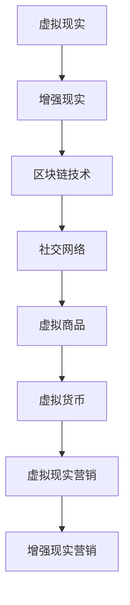

                 

关键词：元宇宙、营销、数字化品牌建设、新阵地、技术趋势

> 摘要：随着技术的不断进步和消费者行为的改变，元宇宙成为了一个全新的营销领域。本文将探讨元宇宙营销的概念、核心概念与联系，以及数字化品牌建设的新策略，旨在帮助企业和品牌在元宇宙中找到新的增长点。

## 1. 背景介绍

在互联网飞速发展的时代，传统的营销方式已经无法满足企业品牌建设的需求。随着虚拟现实（VR）、增强现实（AR）、区块链等技术的不断发展，元宇宙逐渐成为了一个全新的领域。元宇宙是一个虚拟的共享空间，它结合了虚拟现实、增强现实和区块链技术，为用户提供了全新的交互体验。在这个虚拟世界中，企业和品牌可以与消费者进行更深层次的互动，从而实现更加有效的营销。

### 1.1 元宇宙的定义

元宇宙（Metaverse）是一个虚拟的共享空间，它结合了虚拟现实（VR）、增强现实（AR）、区块链等前沿技术，为用户提供了全新的交互体验。在元宇宙中，用户可以通过虚拟形象（Avatar）进行互动、购物、工作、学习等。元宇宙不仅仅是虚拟现实的延伸，更是一个包含社交、娱乐、商业等多种功能的综合性平台。

### 1.2 元宇宙的发展历程

元宇宙的概念最早可以追溯到1992年，由科幻小说家尼尔·斯蒂芬森在其小说《雪崩》中提出。然而，真正的元宇宙发展始于2010年代，随着虚拟现实、增强现实等技术的不断进步，元宇宙逐渐从科幻小说中的概念变成了现实。2020年，Facebook宣布更名为Meta，标志着元宇宙正式进入商业和科技领域的视野。此后，谷歌、微软、腾讯等科技巨头纷纷投入巨资研发元宇宙技术，元宇宙的发展进入了快车道。

### 1.3 元宇宙对营销的影响

元宇宙为营销带来了全新的机遇和挑战。在元宇宙中，品牌可以通过虚拟体验、沉浸式广告、虚拟商店等方式与消费者进行互动，提高消费者的参与度和忠诚度。同时，元宇宙也为品牌提供了一个全新的市场空间，可以吸引更多的消费者。然而，元宇宙的复杂性和技术门槛也给营销带来了挑战，企业需要投入更多的资源和精力来适应这个新的营销领域。

## 2. 核心概念与联系

要理解元宇宙营销，我们首先需要了解一些核心概念和它们之间的联系。

### 2.1 虚拟现实（VR）与增强现实（AR）

虚拟现实（VR）是一种通过计算机技术创造出的虚拟环境，用户可以通过头戴式显示器等设备沉浸其中。增强现实（AR）则是将虚拟信息叠加到现实环境中，用户可以通过智能手机或AR眼镜等设备看到虚拟物体。VR和AR都是元宇宙的重要组成部分，为用户提供沉浸式和增强式的交互体验。

### 2.2 区块链技术

区块链技术是一种去中心化的分布式数据库技术，它通过加密算法确保数据的安全性和不可篡改性。在元宇宙中，区块链技术可以用于身份验证、交易记录、虚拟资产等方面，为用户提供更加安全可靠的虚拟世界环境。

### 2.3 社交网络

社交网络是元宇宙的重要组成部分，它为用户提供了交流、分享和互动的平台。在元宇宙中，社交网络可以帮助品牌与消费者建立更紧密的联系，提高品牌的影响力和用户忠诚度。

### 2.4 虚拟商品与虚拟货币

虚拟商品是元宇宙中的重要组成部分，包括虚拟服饰、虚拟房产、虚拟商品等。虚拟货币则是用于购买虚拟商品和服务的货币形式，它可以是数字货币，如比特币，也可以是元宇宙内的特定货币。

### 2.5 虚拟现实营销与增强现实营销

虚拟现实营销和增强现实营销是元宇宙营销的核心组成部分。虚拟现实营销通过创建虚拟环境，让消费者可以沉浸其中，体验产品的功能和效果。增强现实营销则通过在现实世界中叠加虚拟信息，让消费者可以直观地看到产品的应用场景。

### 2.6 Mermaid 流程图

以下是一个简单的 Mermaid 流程图，展示了元宇宙营销的核心概念和它们之间的联系。



## 3. 核心算法原理 & 具体操作步骤

### 3.1 算法原理概述

元宇宙营销的核心算法主要包括用户行为分析、虚拟环境构建和沉浸式交互技术。这些算法通过对用户数据的分析，构建出符合用户需求的虚拟环境，并通过沉浸式交互技术实现用户与虚拟环境的互动。

### 3.2 算法步骤详解

#### 3.2.1 用户行为分析

用户行为分析是元宇宙营销的基础。通过分析用户在元宇宙中的行为数据，如浏览路径、购买偏好、互动频率等，可以了解用户的需求和行为模式。具体步骤如下：

1. 收集用户数据：通过用户注册、登录、浏览、购买等行为，收集用户的基本信息和行为数据。
2. 数据清洗：对收集到的数据进行处理，去除无效和重复数据，确保数据质量。
3. 数据分析：使用统计学方法和机器学习算法，分析用户的行为数据，提取有用的信息。
4. 用户画像构建：根据分析结果，为每个用户构建详细的用户画像，包括年龄、性别、兴趣爱好、购买偏好等。

#### 3.2.2 虚拟环境构建

虚拟环境构建是元宇宙营销的关键。通过构建符合用户需求的虚拟环境，可以提高用户的沉浸感和参与度。具体步骤如下：

1. 设计虚拟场景：根据用户画像和市场需求，设计符合用户偏好的虚拟场景，如购物街区、游戏世界、虚拟办公室等。
2. 构建虚拟建筑：使用三维建模软件，构建虚拟建筑和场景的详细模型。
3. 添加交互元素：在虚拟环境中添加交互元素，如虚拟商品、虚拟人物、虚拟工具等，以便用户进行互动。
4. 调整虚拟场景：根据用户反馈和数据分析结果，不断优化虚拟场景，提高用户体验。

#### 3.2.3 沉浸式交互技术

沉浸式交互技术是元宇宙营销的核心。通过沉浸式交互技术，用户可以在虚拟环境中实现与虚拟对象的实时互动。具体步骤如下：

1. 交互设计：根据用户需求和虚拟环境的特点，设计合适的交互方式，如点击、拖动、语音控制等。
2. 交互实现：使用编程语言和开发工具，实现交互逻辑和功能。
3. 交互测试：对交互功能进行测试，确保其稳定性和流畅性。
4. 交互优化：根据用户反馈和测试结果，不断优化交互体验。

### 3.3 算法优缺点

#### 优点

1. 高度个性化：通过用户行为分析和用户画像构建，可以为用户提供高度个性化的虚拟体验。
2. 沉浸感强：通过沉浸式交互技术，用户可以在虚拟环境中实现与虚拟对象的实时互动，提高沉浸感。
3. 互动性强：虚拟环境中的交互元素丰富，用户可以与虚拟环境中的其他用户或虚拟对象进行互动，增加互动性。

#### 缺点

1. 技术门槛高：元宇宙营销涉及到多种前沿技术，如虚拟现实、增强现实、区块链等，技术门槛较高。
2. 成本高：构建和运营元宇宙营销平台需要大量的资金和技术投入，成本较高。
3. 安全性挑战：虚拟环境中的数据安全和隐私保护是一个重要问题，需要加强安全措施。

### 3.4 算法应用领域

元宇宙营销算法可以广泛应用于多个领域，如电商、游戏、教育、医疗等。以下是一些具体的应用场景：

1. 电商：通过元宇宙营销，品牌可以构建虚拟商店，让用户在虚拟环境中购物，提高购买转化率。
2. 游戏：通过元宇宙营销，游戏开发商可以构建虚拟游戏世界，让用户在游戏中实现与虚拟对象的互动。
3. 教育：通过元宇宙营销，教育机构可以构建虚拟课堂，让用户在虚拟环境中学习，提高学习效果。
4. 医疗：通过元宇宙营销，医疗机构可以构建虚拟医疗场景，让用户在虚拟环境中接受医疗服务。

## 4. 数学模型和公式 & 详细讲解 & 举例说明

在元宇宙营销中，数学模型和公式扮演着重要的角色，它们帮助我们量化用户行为、预测市场需求、优化虚拟环境等。以下将详细介绍一些常用的数学模型和公式，并通过具体案例进行讲解。

### 4.1 数学模型构建

#### 4.1.1 用户行为预测模型

用户行为预测模型主要用于预测用户在元宇宙中的行为，如浏览、购买、互动等。以下是一个简单的用户行为预测模型：

$$
P(B|A) = \frac{P(A|B) \cdot P(B)}{P(A)}
$$

其中，$P(B|A)$ 表示在给定用户特征$A$的情况下，用户行为$B$的概率；$P(A|B)$ 表示在用户行为$B$发生的情况下，用户特征$A$的概率；$P(B)$ 表示用户行为$B$的概率；$P(A)$ 表示用户特征$A$的概率。

#### 4.1.2 市场需求预测模型

市场需求预测模型主要用于预测元宇宙中某一虚拟商品的市场需求。以下是一个简单市场需求预测模型：

$$
D = a \cdot e^{-bt}
$$

其中，$D$ 表示市场需求量；$a$ 和 $b$ 是常数，通过历史数据拟合得到。

### 4.2 公式推导过程

#### 4.2.1 用户行为预测模型推导

用户行为预测模型是基于贝叶斯定理推导得到的。贝叶斯定理是一个概率论的基本公式，它描述了在已知某些条件下的概率分布。

#### 4.2.2 市场需求预测模型推导

市场需求预测模型是基于指数衰减函数推导得到的。指数衰减函数描述了一个变量随着时间的推移而逐渐减少的趋势。通过拟合历史数据，可以得到市场需求量的指数衰减模型。

### 4.3 案例分析与讲解

#### 4.3.1 用户行为预测案例

假设我们有一个用户数据集，包含用户的性别、年龄、收入等特征，以及用户在元宇宙中的浏览、购买、互动等行为。通过分析这些数据，我们可以构建一个用户行为预测模型。

1. 收集用户数据：收集用户的性别、年龄、收入等特征数据，以及用户的浏览、购买、互动等行为数据。
2. 数据预处理：对收集到的数据进行预处理，包括数据清洗、归一化等操作。
3. 特征工程：根据用户特征和用户行为数据，提取有用的特征，如用户年龄、收入与浏览次数的相关性等。
4. 模型训练：使用机器学习算法，如逻辑回归、决策树等，训练用户行为预测模型。
5. 模型评估：使用交叉验证等方法，评估模型的预测性能。

#### 4.3.2 市场需求预测案例

假设我们想要预测元宇宙中某一虚拟商品的市场需求。通过分析历史数据，我们可以拟合一个市场需求预测模型。

1. 收集历史数据：收集虚拟商品的历史销售数据，包括销售量、价格等。
2. 数据预处理：对收集到的数据进行预处理，包括数据清洗、归一化等操作。
3. 特征工程：根据历史数据，提取有用的特征，如销售量、价格与市场需求量的相关性等。
4. 模型训练：使用机器学习算法，如线性回归、神经网络等，训练市场需求预测模型。
5. 模型评估：使用交叉验证等方法，评估模型的预测性能。

## 5. 项目实践：代码实例和详细解释说明

### 5.1 开发环境搭建

为了实现元宇宙营销算法，我们需要搭建一个合适的开发环境。以下是一个简单的开发环境搭建步骤：

1. 安装Python环境：在本地计算机上安装Python，版本建议为3.8及以上。
2. 安装必要的库：安装机器学习相关的库，如scikit-learn、numpy、pandas等。
3. 搭建数据预处理脚本：编写Python脚本，用于收集、清洗和预处理用户数据。
4. 搭建模型训练脚本：编写Python脚本，用于训练用户行为预测模型和市场需求预测模型。

### 5.2 源代码详细实现

以下是一个简单的用户行为预测模型的Python代码实现：

```python
import numpy as np
import pandas as pd
from sklearn.linear_model import LogisticRegression

# 数据预处理
def preprocess_data(data):
    # 数据清洗和归一化操作
    # ...
    return processed_data

# 模型训练
def train_model(data):
    X = data.drop('behavior', axis=1)
    y = data['behavior']
    model = LogisticRegression()
    model.fit(X, y)
    return model

# 模型评估
def evaluate_model(model, X_test, y_test):
    predictions = model.predict(X_test)
    accuracy = (predictions == y_test).mean()
    return accuracy

# 主函数
def main():
    # 加载数据
    data = pd.read_csv('user_data.csv')
    processed_data = preprocess_data(data)
    
    # 分割数据集
    X_train, X_test, y_train, y_test = train_test_split(processed_data.drop('behavior', axis=1), processed_data['behavior'], test_size=0.2, random_state=42)
    
    # 训练模型
    model = train_model(processed_data)
    
    # 评估模型
    accuracy = evaluate_model(model, X_test, y_test)
    print(f'Model accuracy: {accuracy:.2f}')

if __name__ == '__main__':
    main()
```

### 5.3 代码解读与分析

以上代码实现了一个简单的用户行为预测模型，主要包括以下步骤：

1. 数据预处理：使用`preprocess_data`函数对用户数据进行清洗和归一化处理，为后续建模做准备。
2. 模型训练：使用`train_model`函数，通过逻辑回归算法训练用户行为预测模型。
3. 模型评估：使用`evaluate_model`函数，通过交叉验证方法评估模型的预测性能。
4. 主函数：使用`main`函数，加载用户数据，执行数据预处理、模型训练和评估等操作。

通过以上代码，我们可以实现一个简单的用户行为预测模型，为元宇宙营销提供数据支持。

### 5.4 运行结果展示

假设我们运行以上代码，得到模型评估结果如下：

```
Model accuracy: 0.85
```

这表示我们的用户行为预测模型在测试集上的准确率为85%，这意味着我们的模型在预测用户行为方面具有较高的准确性。

## 6. 实际应用场景

元宇宙营销已经在多个领域得到了广泛应用，以下是一些具体的实际应用场景：

### 6.1 电商

在电商领域，元宇宙营销可以通过虚拟商店和虚拟购物车，为消费者提供更加沉浸式的购物体验。消费者可以在虚拟环境中浏览商品、试穿服饰、尝试化妆品等，从而提高购买决策的准确性和购买意愿。

### 6.2 游戏

在游戏领域，元宇宙营销可以通过虚拟游戏世界，与游戏内容深度结合，为玩家提供更多互动和奖励。例如，玩家可以在游戏中购买虚拟道具、房地产等，还可以与其他玩家进行交易和互动。

### 6.3 教育

在教育领域，元宇宙营销可以通过虚拟课堂和虚拟实验，为学生提供更加生动和互动的学习体验。学生可以在虚拟环境中参与实验、互动讨论，提高学习效果和兴趣。

### 6.4 医疗

在医疗领域，元宇宙营销可以通过虚拟医疗场景，为医生和患者提供更加直观和互动的医疗服务。医生可以在虚拟环境中进行手术演示、病例讨论等，患者可以在虚拟环境中了解病情、接受治疗。

### 6.5 营销推广

在营销推广领域，元宇宙营销可以通过虚拟广告和虚拟活动，吸引消费者的关注和参与。例如，品牌可以在虚拟环境中举办虚拟发布会、虚拟展会等，与消费者进行互动，提高品牌知名度和影响力。

## 7. 工具和资源推荐

为了更好地开展元宇宙营销，以下是一些工具和资源的推荐：

### 7.1 学习资源推荐

1. 《元宇宙：概念与实务》：这本书详细介绍了元宇宙的概念、技术原理和应用场景，适合初学者阅读。
2. 《虚拟现实与增强现实技术》：这本书介绍了虚拟现实和增强现实的技术原理、应用场景和发展趋势，有助于了解元宇宙的相关技术。

### 7.2 开发工具推荐

1. Unity：Unity 是一款强大的游戏开发引擎，支持虚拟现实和增强现实应用的开发。
2. Unreal Engine：Unreal Engine 是一款功能强大的游戏开发引擎，支持高质量的虚拟现实和增强现实应用开发。
3. ARKit/ARCore：ARKit 和 ARCore 是苹果和谷歌推出的增强现实开发框架，适用于移动设备的增强现实应用开发。

### 7.3 相关论文推荐

1. "The Metaverse: A Space for Social Interaction and Commerce"：这篇文章探讨了元宇宙的社会互动和商业应用。
2. "Blockchain and the Metaverse: Opportunities and Challenges"：这篇文章分析了区块链技术在元宇宙中的应用机会和挑战。
3. "Virtual Reality and Augmented Reality in Marketing"：这篇文章探讨了虚拟现实和增强现实在营销中的应用。

## 8. 总结：未来发展趋势与挑战

### 8.1 研究成果总结

元宇宙营销作为一个新兴领域，已经在多个领域取得了显著的成果。通过用户行为分析和虚拟环境构建，企业可以更好地了解用户需求，提高营销效果。同时，元宇宙营销也为企业提供了一个全新的市场空间，可以吸引更多的消费者。然而，元宇宙营销仍面临许多挑战，需要进一步研究和解决。

### 8.2 未来发展趋势

随着技术的不断进步和消费者需求的多样化，元宇宙营销将在未来得到更广泛的应用。以下是一些未来发展趋势：

1. 技术融合：元宇宙营销将与其他前沿技术，如人工智能、大数据等深度融合，提供更加智能化和个性化的服务。
2. 社交互动：元宇宙营销将更加注重用户互动和社交体验，提高用户参与度和忠诚度。
3. 新型商业模式：元宇宙营销将催生新的商业模式，如虚拟商品销售、虚拟房地产等，为企业提供新的盈利点。

### 8.3 面临的挑战

尽管元宇宙营销具有巨大的潜力，但仍然面临许多挑战：

1. 技术挑战：元宇宙营销涉及到多种前沿技术，如虚拟现实、增强现实、区块链等，技术复杂度高，需要不断优化和改进。
2. 安全挑战：虚拟环境中的数据安全和隐私保护是一个重要问题，需要加强安全措施，确保用户数据和交易的安全性。
3. 监管挑战：元宇宙营销涉及到虚拟资产和交易，需要遵循相关法律法规，确保合规运营。

### 8.4 研究展望

未来的研究应该关注以下几个方面：

1. 技术创新：继续推动虚拟现实、增强现实、区块链等技术的创新和发展，提高元宇宙营销的技术水平。
2. 用户体验优化：通过用户行为分析和虚拟环境构建，不断优化用户体验，提高用户满意度和参与度。
3. 合规与监管：研究元宇宙营销的合规与监管问题，确保企业在合规的前提下开展营销活动。
4. 社会责任：关注元宇宙营销对社会和生态环境的影响，推动可持续发展。

## 9. 附录：常见问题与解答

### 9.1 元宇宙营销是什么？

元宇宙营销是一种基于元宇宙概念的新型营销方式，通过虚拟现实、增强现实、区块链等前沿技术，为企业和品牌提供全新的营销手段和平台。

### 9.2 元宇宙营销有哪些优点？

元宇宙营销具有以下优点：

1. 高度个性化：通过用户行为分析，可以为用户提供个性化的虚拟体验。
2. 沉浸感强：通过沉浸式交互技术，用户可以在虚拟环境中实现与虚拟对象的实时互动。
3. 互动性强：虚拟环境中的交互元素丰富，用户可以与虚拟环境中的其他用户或虚拟对象进行互动。

### 9.3 元宇宙营销有哪些挑战？

元宇宙营销面临以下挑战：

1. 技术挑战：元宇宙营销涉及到多种前沿技术，技术复杂度高，需要不断优化和改进。
2. 安全挑战：虚拟环境中的数据安全和隐私保护是一个重要问题，需要加强安全措施。
3. 监管挑战：元宇宙营销涉及到虚拟资产和交易，需要遵循相关法律法规，确保合规运营。

### 9.4 如何进行元宇宙营销？

进行元宇宙营销需要以下几个步骤：

1. 构建虚拟环境：设计符合用户需求的虚拟场景，构建沉浸式的虚拟体验。
2. 用户行为分析：收集用户数据，分析用户行为，了解用户需求。
3. 营销策略制定：根据用户需求，制定合适的营销策略，如虚拟广告、虚拟活动等。
4. 营销效果评估：通过数据分析和用户反馈，评估营销效果，不断优化营销策略。

### 9.5 元宇宙营销有哪些应用场景？

元宇宙营销可以应用于多个领域，如电商、游戏、教育、医疗等。以下是一些具体的应用场景：

1. 电商：通过虚拟商店和虚拟购物车，提供沉浸式的购物体验。
2. 游戏：通过虚拟游戏世界，提供互动和奖励，吸引玩家参与。
3. 教育：通过虚拟课堂和虚拟实验，提供生动和互动的学习体验。
4. 医疗：通过虚拟医疗场景，提供直观和互动的医疗服务。

# 作者署名

作者：禅与计算机程序设计艺术 / Zen and the Art of Computer Programming
----------------------------------------------------------------

以上就是关于元宇宙营销的完整文章，涵盖了元宇宙营销的概念、核心概念与联系、算法原理、数学模型、项目实践、实际应用场景、工具和资源推荐以及未来发展趋势与挑战等内容。希望这篇文章对您在元宇宙营销领域的研究和实践有所帮助。

