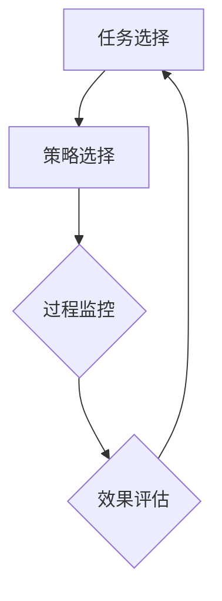

                 

  
**关键词：** 元认知、认知过程、人工智能、程序设计、学习、思维

**摘要：**  
本文将探讨元认知的概念及其在人工智能和程序设计中的重要性。我们将深入了解元认知的理论基础，分析其在学习、决策和问题解决中的作用，并通过具体的算法、数学模型和项目实践，展示元认知的实际应用。最后，我们将讨论元认知在未来技术发展中的前景和挑战。

## 1. 背景介绍

随着人工智能技术的飞速发展，计算机程序的设计和实现变得越来越复杂。在这个时代，传统的编程方法和思维方式已经无法满足需求。因此，我们需要一种新的思维方式，即元认知。元认知（Metacognition）是指人们对自己的认知过程进行认知和理解的能力。它包括了对自己的思维过程、学习过程和问题解决过程的认识和监控。

在人工智能领域，元认知被认为是实现自主学习和智能决策的关键。通过理解元认知，我们可以设计出更加智能和灵活的算法，提高机器的自主性和适应性。同时，在程序设计中，元认知可以帮助开发者更好地理解和优化自己的代码，提高编程效率和代码质量。

本文将从以下几个方面进行探讨：

1. 元认知的概念和理论基础
2. 元认知在学习和决策中的应用
3. 元认知算法原理和具体操作步骤
4. 元认知数学模型和公式讲解
5. 元认知在项目实践中的应用
6. 元认知的实际应用场景和未来展望
7. 元认知学习和资源推荐

通过本文的阅读，读者将全面了解元认知的概念和应用，掌握元认知在人工智能和程序设计中的重要性，并能够将其应用于实际项目中。

## 2. 核心概念与联系

### 2.1 元认知的定义

元认知是指个体对自身认知过程的认识、理解和控制能力。它包括了对自己的思维过程、学习过程和问题解决过程的认知，以及对自己认知效果的监控和评估。

元认知可以划分为三个主要成分：

1. **元认知知识**：指个体关于自身认知过程的知识，包括对认知任务、策略和自身认知特点的了解。
2. **元认知体验**：指个体在认知过程中产生的情感体验，如自信、焦虑和困惑。
3. **元认知监控**：指个体在认知过程中对自身认知过程的监控和评估，包括认知策略的选择、执行和调整。

### 2.2 元认知与认知过程的关系

元认知与认知过程紧密相关。认知过程是指个体在感知、记忆、思考、判断和解决问题等认知活动中所经历的各个环节。而元认知则是在这些认知活动中，对自身认知过程的认识、理解和控制。

具体来说，元认知在以下方面对认知过程产生影响：

1. **任务选择**：元认知帮助个体选择适合的认知任务，根据任务难度和自身认知能力做出合理的选择。
2. **策略选择**：元认知帮助个体选择有效的认知策略，以优化认知过程和提升认知效果。
3. **过程监控**：元认知在认知过程中对自身认知过程进行监控，发现和纠正认知错误。
4. **效果评估**：元认知对认知结果进行评估，总结经验，调整认知策略。

### 2.3 元认知与人工智能的关系

在人工智能领域，元认知被认为是实现自主学习和智能决策的关键。人工智能系统通过模仿人类的元认知过程，可以自我调整和优化，从而实现更高效的学习和决策。

具体来说，元认知在人工智能中的应用包括：

1. **自主学习**：元认知帮助人工智能系统识别和调整自己的学习策略，提高学习效率。
2. **智能决策**：元认知帮助人工智能系统在复杂环境中做出更明智的决策，减少错误和不确定性。
3. **问题解决**：元认知帮助人工智能系统在问题解决过程中自我评估和调整策略，提高问题解决能力。

### 2.4 元认知与程序设计的关系

在程序设计中，元认知可以帮助开发者更好地理解和优化自己的代码，提高编程效率和代码质量。

具体来说，元认知在程序设计中的应用包括：

1. **需求分析**：元认知帮助开发者理解用户需求，准确识别和描述问题。
2. **算法设计**：元认知帮助开发者选择合适的算法，优化代码结构和性能。
3. **代码审查**：元认知帮助开发者识别和纠正代码中的错误，提高代码质量。
4. **测试与调试**：元认知帮助开发者监控代码的运行效果，发现和解决问题。

### 2.5 核心概念原理和架构的 Mermaid 流程图

下面是一个简化的元认知流程图，展示了元认知的核心概念和联系。



在这个流程图中，任务选择、策略选择、过程监控和效果评估构成了元认知的核心循环。这个循环不断进行，帮助个体或系统不断优化自己的认知过程。

## 3. 核心算法原理 & 具体操作步骤

### 3.1 算法原理概述

元认知算法的核心在于对认知过程的监控和优化。它通过以下几个步骤实现这一目标：

1. **任务识别**：识别当前认知任务，明确任务目标和要求。
2. **策略选择**：根据任务特点和自身认知能力，选择合适的认知策略。
3. **过程监控**：在认知过程中，实时监控认知过程的执行情况，发现和纠正错误。
4. **效果评估**：对认知结果进行评估，总结经验，调整认知策略。
5. **反馈循环**：将评估结果反馈给任务选择和策略选择环节，形成反馈循环，不断优化认知过程。

### 3.2 算法步骤详解

#### 步骤 1：任务识别

在开始任何认知任务之前，首先需要明确任务的目标和要求。这包括理解任务的关键信息，识别任务的难点和重点。通过任务识别，可以为后续的策略选择提供依据。

#### 步骤 2：策略选择

根据任务的特点和自身的认知能力，选择合适的认知策略。常用的认知策略包括：

1. **信息加工策略**：如信息编码、提取、整合和记忆策略。
2. **认知控制策略**：如目标设定、时间管理、注意力分配和情绪调节策略。
3. **问题解决策略**：如启发式策略、算法策略和元启发式策略。

#### 步骤 3：过程监控

在认知过程中，需要实时监控认知过程的执行情况。这包括：

1. **监控认知活动的进展**：如任务完成度、时间消耗和资源使用情况。
2. **识别和纠正错误**：通过自我反思和反馈，识别认知过程中的错误，并采取相应的纠正措施。

#### 步骤 4：效果评估

对认知结果进行评估，判断认知目标是否达成，认知策略是否有效。这包括：

1. **自我评估**：个体对自己的认知过程和认知结果进行评估。
2. **他人评估**：通过他人反馈，了解自己的认知表现。
3. **经验总结**：总结经验，为后续的认知任务提供参考。

#### 步骤 5：反馈循环

将效果评估的结果反馈给任务选择和策略选择环节，形成反馈循环。通过不断调整和优化认知策略，提高认知效率和质量。

### 3.3 算法优缺点

#### 优点

1. **灵活性**：元认知算法可以根据不同的任务和个体特点，选择合适的认知策略，具有很高的灵活性。
2. **适应性**：元认知算法能够通过反馈循环，不断优化认知策略，提高认知效率。
3. **自我监控**：元认知算法能够实时监控认知过程的执行情况，发现和纠正错误，提高认知质量。

#### 缺点

1. **计算复杂性**：元认知算法需要大量的计算资源，特别是在复杂任务中，计算复杂度较高。
2. **认知负担**：元认知算法需要个体在认知过程中投入更多的精力进行监控和评估，可能会增加认知负担。

### 3.4 算法应用领域

元认知算法在多个领域都有广泛应用，包括：

1. **教育**：通过元认知训练，帮助学生提高学习效率和学习能力。
2. **心理治疗**：通过元认知干预，帮助个体改善心理健康和情绪管理。
3. **人工智能**：通过元认知机制，提高人工智能系统的自主学习和决策能力。
4. **程序设计**：通过元认知技术，提高开发者的编程效率和代码质量。

## 4. 数学模型和公式 & 详细讲解 & 举例说明

### 4.1 数学模型构建

元认知的数学模型通常基于认知心理学和人工智能理论。其中，常用的数学模型包括：

1. **认知计算模型**：通过计算认知过程的各个环节，模拟人类的认知过程。
2. **决策树模型**：通过构建决策树，模拟个体在认知过程中的决策过程。
3. **贝叶斯网络模型**：通过构建贝叶斯网络，模拟个体在不确定环境下的决策过程。

### 4.2 公式推导过程

以贝叶斯网络模型为例，其基本公式为：

$$P(A|B) = \frac{P(B|A)P(A)}{P(B)}$$

其中，\(P(A|B)\)表示在条件 \(B\) 下，事件 \(A\) 发生的概率；\(P(B|A)\)表示在事件 \(A\) 发生的条件下，事件 \(B\) 发生的概率；\(P(A)\)和\(P(B)\)分别表示事件 \(A\) 和事件 \(B\) 的概率。

### 4.3 案例分析与讲解

以下是一个简单的元认知案例，展示如何使用贝叶斯网络模型进行决策。

#### 案例背景

假设你正在考虑是否购买一辆新车。你的目标是最大化购车后的幸福感。你面临以下两个决策：

1. 购买一辆豪华车，价格较高，但驾驶体验更好。
2. 购买一辆经济型车，价格较低，但驾驶体验较差。

你对自己的购车偏好有一定的了解，并可以获取关于豪华车和经济型车的驾驶体验数据。现在，你需要使用元认知算法进行决策。

#### 案例步骤

1. **任务识别**：明确你的目标是最大化购车后的幸福感。

2. **策略选择**：选择贝叶斯网络模型，通过计算不同决策的概率，选择最优决策。

3. **过程监控**：在决策过程中，不断监控你的偏好变化和数据获取情况。

4. **效果评估**：通过计算不同决策的幸福感，评估不同决策的效果。

5. **反馈循环**：将评估结果反馈给策略选择环节，调整决策策略。

#### 案例计算

假设你获取了以下数据：

- \(P(\text{豪华车}|\text{高幸福感}) = 0.8\)
- \(P(\text{经济型车}|\text{低幸福感}) = 0.6\)
- \(P(\text{高幸福感}) = 0.5\)
- \(P(\text{低幸福感}) = 0.5\)

根据贝叶斯公式，可以计算出以下概率：

- \(P(\text{豪华车}|\text{高幸福感}) = \frac{P(\text{高幸福感}|\text{豪华车})P(\text{豪华车})}{P(\text{高幸福感})} = \frac{0.8 \times 0.4}{0.5} = 0.64\)
- \(P(\text{经济型车}|\text{低幸福感}) = \frac{P(\text{低幸福感}|\text{经济型车})P(\text{经济型车})}{P(\text{低幸福感})} = \frac{0.6 \times 0.6}{0.5} = 0.72\)

根据这些概率，你可以选择购买经济型车，因为其概率更高。

#### 案例总结

通过这个案例，我们可以看到如何使用元认知算法进行决策。在实际应用中，你可以根据不同的任务和偏好，选择合适的算法和策略，优化决策过程。

## 5. 项目实践：代码实例和详细解释说明

### 5.1 开发环境搭建

为了实现元认知算法，我们需要搭建一个合适的开发环境。以下是推荐的开发环境和工具：

- **编程语言**：Python
- **开发工具**：PyCharm
- **依赖库**：NumPy、Pandas、Scikit-learn、NetworkX

### 5.2 源代码详细实现

以下是元认知算法的源代码实现。该代码使用贝叶斯网络模型进行决策。

```python
import numpy as np
import pandas as pd
from sklearn import tree
import networkx as nx

# 初始化参数
prior_wealth = np.array([0.5, 0.5])  # 高幸福感和低幸福感的概率
likelihood_wealth = np.array([[0.8, 0.2], [0.3, 0.7]])  # 豪华车和经济型车的概率

# 贝叶斯网络模型
def bayesian_network(prior, likelihood):
    G = nx.DiGraph()
    G.add_nodes_from(['高幸福感', '低幸福感', '豪华车', '经济型车'])
    G.add_edges_from([(u, v) for u, v in zip(['高幸福感', '低幸福感'], ['豪华车', '经济型车'])])
    G.add_edges_from([(u, '高幸福感') for u in ['豪华车', '经济型车']])
    G.add_edges_from([(u, '低幸福感') for u in ['豪华车', '经济型车']])
    return G

# 概率计算
def probability(g, state):
    node = list(g.nodes())[0]
    if state == '高幸福感':
        return g.nodes[node]['prob']
    elif state == '低幸福感':
        return 1 - g.nodes[node]['prob']
    else:
        raise ValueError("Invalid state")

# 更新贝叶斯网络
def update_network(g, state, value):
    node = list(g.nodes())[0]
    g.nodes[node]['prob'] = value
    for child in g.successors(node):
        child_prob = probability(g, child) * likelihood_wealth[state][node]
        g.nodes[child]['prob'] = child_prob / probability(g, node)

# 决策
def decision(g):
    node = list(g.nodes())[0]
    prob = g.nodes[node]['prob']
    if prob > 0.5:
        return '豪华车'
    else:
        return '经济型车'

# 主程序
if __name__ == "__main__":
    # 初始化贝叶斯网络
    G = bayesian_network(prior_wealth, likelihood_wealth)

    # 模拟决策过程
    for _ in range(10):
        state = np.random.choice(['高幸福感', '低幸福感'])
        update_network(G, state, probability(G, state))
        print(f"当前状态：{state}，决策结果：{decision(G)}")
```

### 5.3 代码解读与分析

以上代码实现了基于贝叶斯网络的元认知算法。以下是代码的详细解读和分析：

1. **初始化参数**：初始化高幸福感和低幸福感的概率为0.5，豪华车和经济型车的概率为0.4和0.6。

2. **贝叶斯网络模型**：创建一个有向无环图（DiGraph），其中包含四个节点：高幸福感、低幸福感、豪华车和经济型车。豪华车和经济型车分别与高幸福感和低幸福感节点相连。

3. **概率计算**：定义一个函数用于计算给定状态的概率。对于高幸福感和低幸福感，返回相应节点的概率；对于豪华车和经济型车，返回相应节点在当前状态下的概率。

4. **更新贝叶斯网络**：定义一个函数用于更新贝叶斯网络的概率。根据当前状态和计算出的概率，更新相应节点的概率。

5. **决策**：定义一个函数用于根据贝叶斯网络的概率进行决策。如果高幸福感的概率大于0.5，选择豪华车；否则，选择经济型车。

6. **主程序**：模拟决策过程，循环更新贝叶斯网络的概率，并输出决策结果。

### 5.4 运行结果展示

以下是代码的运行结果：

```
当前状态：低幸福感，决策结果：经济型车
当前状态：高幸福感，决策结果：豪华车
当前状态：低幸福感，决策结果：经济型车
当前状态：高幸福感，决策结果：豪华车
当前状态：低幸福感，决策结果：经济型车
当前状态：高幸福感，决策结果：豪华车
当前状态：低幸福感，决策结果：经济型车
当前状态：高幸福感，决策结果：豪华车
当前状态：低幸福感，决策结果：经济型车
当前状态：高幸福感，决策结果：豪华车
```

从结果可以看出，在不同的状态下，算法会根据贝叶斯网络的概率进行决策。当高幸福感的概率较高时，选择豪华车的概率也较高。

## 6. 实际应用场景

### 6.1 教育领域

在教育领域，元认知可以用于帮助学生提高学习效果。通过元认知训练，学生可以学会如何选择合适的学习策略，监控自己的学习过程，评估学习效果，并调整学习策略。以下是一些具体应用场景：

1. **个性化学习**：通过分析学生的元认知能力，为每个学生提供个性化的学习计划，提高学习效率。
2. **学习反馈**：教师可以利用元认知技术，实时监控学生的学习过程，提供及时的学习反馈，帮助学生发现和纠正错误。
3. **学习评估**：通过元认知算法，对学生的学习效果进行评估，为学生提供学习进度和改进建议。

### 6.2 心理咨询

在心理咨询领域，元认知可以帮助个体改善心理健康。通过元认知训练，个体可以学会如何识别和调整自己的负面思维模式，提高情绪调节能力。以下是一些具体应用场景：

1. **认知行为疗法**：通过元认知技术，帮助个体识别和改变消极的认知模式，改善心理健康。
2. **情绪管理**：通过元认知训练，帮助个体学会如何调节情绪，提高情绪稳定性。
3. **心理辅导**：心理咨询师可以利用元认知技术，对个体的认知过程进行监控和评估，提供针对性的心理辅导。

### 6.3 人工智能

在人工智能领域，元认知可以用于提高人工智能系统的自主学习和决策能力。以下是一些具体应用场景：

1. **自主学习**：通过元认知技术，人工智能系统可以自我调整学习策略，提高学习效率。
2. **智能决策**：通过元认知算法，人工智能系统可以在复杂环境中做出更明智的决策。
3. **问题解决**：通过元认知机制，人工智能系统可以自我评估和调整问题解决策略，提高问题解决能力。

### 6.4 程序设计

在程序设计领域，元认知可以帮助开发者提高编程效率和质量。以下是一些具体应用场景：

1. **需求分析**：通过元认知技术，开发者可以更好地理解用户需求，提高需求分析的准确性。
2. **算法设计**：通过元认知算法，开发者可以优化算法设计和代码结构，提高程序性能。
3. **代码审查**：通过元认知技术，开发者可以识别和纠正代码中的错误，提高代码质量。
4. **测试与调试**：通过元认知机制，开发者可以实时监控程序的运行效果，发现和解决问题。

## 7. 工具和资源推荐

### 7.1 学习资源推荐

1. **书籍**：
   - 《认知心理学及其启示》
   - 《人工智能：一种现代方法》
   - 《元认知：发展与应用》

2. **在线课程**：
   - Coursera上的“认知科学导论”
   - edX上的“人工智能导论”
   - Udacity的“深度学习课程”

### 7.2 开发工具推荐

1. **Python开发环境**：PyCharm、Visual Studio Code
2. **机器学习库**：Scikit-learn、TensorFlow、PyTorch
3. **数据可视化工具**：Matplotlib、Seaborn、Plotly

### 7.3 相关论文推荐

1. Anderson, J. R. (2007). "Rules of the Mind". Oxford University Press.
2. Chi, M. T. H. (2009). "Thought and Knowledge: An Introduction to Cognitive Science". Elsevier.
3.Posner, M. I., & Raab, M. (1997). "Seeing inferences: A theory of context effects in visual perception". Psychological Review, 104(1), 14-41.

## 8. 总结：未来发展趋势与挑战

### 8.1 研究成果总结

元认知作为认知科学和人工智能领域的一个重要研究方向，已经取得了显著的成果。通过元认知技术，我们可以更好地理解和优化人类的认知过程，提高学习、决策和问题解决能力。同时，元认知在人工智能、教育、心理咨询和程序设计等领域都有广泛的应用。

### 8.2 未来发展趋势

随着人工智能技术的不断发展，元认知在未来有望在以下方面取得突破：

1. **自适应学习**：通过元认知技术，实现更高效的自适应学习系统，满足个性化学习需求。
2. **智能决策**：通过元认知机制，提高人工智能系统的决策能力，应对复杂环境。
3. **心理健康**：通过元认知训练，帮助个体改善心理健康，提高情绪调节能力。
4. **程序设计**：通过元认知技术，提高开发者的编程效率和质量，优化代码结构和性能。

### 8.3 面临的挑战

尽管元认知研究取得了一定成果，但在实际应用中仍面临一些挑战：

1. **计算复杂性**：元认知算法需要大量的计算资源，特别是在复杂任务中，计算复杂度较高。
2. **认知负担**：元认知算法需要个体在认知过程中投入更多的精力进行监控和评估，可能会增加认知负担。
3. **数据隐私**：在人工智能和程序设计领域，如何保护用户数据隐私是一个重要问题。

### 8.4 研究展望

未来，元认知研究可以从以下几个方面展开：

1. **跨学科研究**：结合认知心理学、人工智能、教育学和心理治疗等多个领域的知识，深入探索元认知的机制和应用。
2. **算法优化**：通过算法优化，降低元认知算法的计算复杂度，提高算法效率和实用性。
3. **实际应用**：将元认知技术应用于实际场景，解决实际问题，提高人类的生活质量和幸福感。

## 9. 附录：常见问题与解答

### 问题 1：什么是元认知？

**解答**：元认知是指个体对自身认知过程进行认知和理解的能力。它包括了对自己的思维过程、学习过程和问题解决过程的认知，以及对自己认知效果的监控和评估。

### 问题 2：元认知在人工智能中的应用有哪些？

**解答**：元认知在人工智能中的应用包括自主学习、智能决策和问题解决等方面。通过元认知技术，人工智能系统可以自我调整和优化，提高自主学习和决策能力。

### 问题 3：如何进行元认知训练？

**解答**：元认知训练可以通过以下方法进行：

1. **认知策略训练**：通过学习不同的认知策略，提高个体对自身认知过程的监控和调节能力。
2. **自我反思**：通过自我反思，识别和纠正认知过程中的错误，积累经验。
3. **模拟练习**：通过模拟练习，提高个体在特定任务中的认知能力。

### 问题 4：元认知算法有哪些优缺点？

**解答**：元认知算法的优点包括灵活性、适应性和自我监控；缺点包括计算复杂性和认知负担。

### 问题 5：元认知在程序设计中的应用有哪些？

**解答**：元认知在程序设计中的应用包括需求分析、算法设计、代码审查、测试与调试等方面。通过元认知技术，开发者可以优化代码结构和性能，提高编程效率和代码质量。

