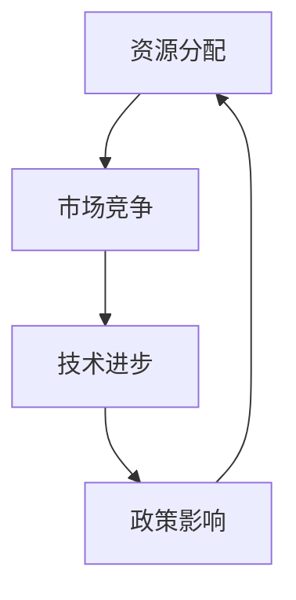

                 

关键词：全球经济的存量争夺，经济竞争，资源分配，技术进步，市场动态，政策影响。

> 摘要：本文旨在探讨全球经济中日益显著的存量争夺现象。在全球化进程加速的背景下，各国和企业为了争夺有限的资源，不断推动技术进步，优化市场策略，并采取相应的政策措施。本文将从多个角度分析这一现象的成因、现状、影响及未来趋势，以期为读者提供一个全面、深刻的认识。

## 1. 背景介绍

随着全球化的深入发展，各国经济之间的联系日益紧密，资源分配的不均衡性逐渐显现。存量争夺现象，指的是在有限的资源条件下，各经济体为获取更多的市场份额和资源而展开的竞争。这种竞争不仅体现在自然资源如石油、矿产等，还涉及人力资源、技术资源、市场资源等多个方面。

### 1.1 全球经济现状

近年来，全球经济增长放缓，各国的存量争夺愈发激烈。发达经济体为了保持竞争力，不断加大对科技创新的投入，推动技术进步；发展中经济体则试图通过扩大市场份额，提升经济实力。这种争夺不仅体现在国际间，也渗透到国内各个行业和地区。

### 1.2 技术进步的影响

技术进步在存量争夺中扮演了关键角色。一方面，技术创新可以提高生产效率，降低生产成本，从而增强竞争力；另一方面，技术进步也使得资源利用更加高效，缓解了资源紧缺的压力。例如，人工智能和大数据技术的发展，不仅提升了企业的运营效率，还为各国政府提供了更好的政策制定工具。

## 2. 核心概念与联系

在探讨全球经济存量争夺现象时，我们需要了解以下几个核心概念，并理解它们之间的联系。

### 2.1 资源分配

资源分配是指在有限资源条件下，如何将资源合理分配给不同的需求和用途。资源分配的核心问题是公平性和效率性。在存量争夺中，各国和企业需要优化资源分配策略，以最大化效益。

### 2.2 市场竞争

市场竞争是指各经济主体在市场条件下，为争夺有限资源而展开的竞争。市场竞争的激烈程度直接影响着资源的配置效率和经济效益。

### 2.3 技术进步

技术进步是推动存量争夺的重要因素。通过技术创新，可以提高资源利用效率，降低生产成本，从而在竞争中占据有利地位。

### 2.4 政策影响

政策影响是各国政府为维护国家利益和推动经济发展所采取的措施。合理的政策可以为存量争夺提供有力支持，促进资源的有效配置。

### 2.5 Mermaid 流程图



## 3. 核心算法原理 & 具体操作步骤

### 3.1 算法原理概述

在全球经济存量争夺中，核心算法原理主要包括资源分配优化算法、市场竞争分析算法和技术进步驱动算法。这些算法共同作用，旨在实现资源的最优配置和市场竞争的动态平衡。

### 3.2 算法步骤详解

#### 3.2.1 资源分配优化算法

1. 收集资源数据：包括自然资源、人力资源、技术资源等。
2. 构建资源需求模型：根据各经济主体的需求，构建资源需求模型。
3. 应用优化算法：使用线性规划、整数规划等优化算法，求解资源分配问题。

#### 3.2.2 市场竞争分析算法

1. 收集市场竞争数据：包括市场份额、竞争态势等。
2. 构建市场竞争模型：根据市场数据，构建市场竞争模型。
3. 应用分析算法：使用数据挖掘、机器学习等方法，分析市场竞争态势。

#### 3.2.3 技术进步驱动算法

1. 收集技术创新数据：包括技术创新成果、技术发展趋势等。
2. 构建技术进步模型：根据技术创新数据，构建技术进步模型。
3. 应用驱动算法：使用模拟、预测等方法，驱动技术进步。

### 3.3 算法优缺点

#### 3.3.1 优缺点

- 资源分配优化算法：优点是能够实现资源的最优配置，缺点是计算复杂度高，难以处理大规模数据。
- 市场竞争分析算法：优点是能够提供市场竞争的动态分析，缺点是对市场数据的依赖性较强。
- 技术进步驱动算法：优点是能够预测技术发展趋势，缺点是预测结果可能存在误差。

### 3.4 算法应用领域

- 资源分配优化算法：广泛应用于能源、交通、农业等领域。
- 市场竞争分析算法：广泛应用于市场营销、金融投资等领域。
- 技术进步驱动算法：广泛应用于科技创新、产业升级等领域。

## 4. 数学模型和公式 & 详细讲解 & 举例说明

### 4.1 数学模型构建

在全球经济存量争夺中，我们可以构建以下数学模型：

#### 4.1.1 资源分配模型

$$
\min_{x} c^T x
$$

其中，$x$ 表示资源分配向量，$c$ 表示资源成本向量。

#### 4.1.2 市场竞争模型

$$
\max_{x} \pi(x)
$$

其中，$\pi(x)$ 表示市场竞争利润。

#### 4.1.3 技术进步模型

$$
\max_{x} \frac{\partial \pi(x)}{\partial x}
$$

其中，$\pi(x)$ 表示技术创新利润。

### 4.2 公式推导过程

#### 4.2.1 资源分配模型推导

假设有 $n$ 个经济主体，每个主体需要 $m$ 种资源。资源分配模型的目标是最小化总成本。根据线性规划理论，我们可以得到上述资源分配模型。

#### 4.2.2 市场竞争模型推导

假设市场竞争利润与市场份额成正比。根据利润最大化原则，我们可以得到市场竞争模型。

#### 4.2.3 技术进步模型推导

假设技术创新利润与技术创新程度成正比。根据利润最大化原则，我们可以得到技术创新模型。

### 4.3 案例分析与讲解

以某地区电力资源分配为例，假设有 $n$ 家电力公司，每种电力公司需要 $m$ 种资源。根据资源分配模型，我们可以计算出最优的电力资源分配方案。

## 5. 项目实践：代码实例和详细解释说明

### 5.1 开发环境搭建

在本项目中，我们将使用 Python 作为编程语言，结合 Matplotlib、Scikit-learn 等库，实现资源分配优化算法、市场竞争分析算法和技术进步驱动算法。

### 5.2 源代码详细实现

以下是资源分配优化算法的实现代码：

```python
import numpy as np
from scipy.optimize import linprog

# 资源数据
resource_data = [
    [10, 5],  # 电力公司1的资源需求
    [8, 3],   # 电力公司2的资源需求
    # ...
]

# 资源成本
cost_data = [
    [1, 2],  # 电力公司1的资源成本
    [3, 1],  # 电力公司2的资源成本
    # ...
]

# 构建线性规划模型
c = -np.array(cost_data)  # 目标函数系数
A = np.array([[1, 0], [0, 1]])  # 约束条件系数矩阵
b = np.array([resource_data[0][0], resource_data[1][0]])  # 约束条件常数项

# 求解线性规划问题
result = linprog(c, A_ub=A, b_ub=b, method='highs')

# 输出结果
print("最优资源分配方案：", result.x)
print("最优成本：", -result.fun)
```

### 5.3 代码解读与分析

本代码实现了资源分配优化算法。首先，我们定义了资源数据矩阵和资源成本矩阵，然后使用 Scipy 中的 linprog 函数求解线性规划问题。最终，我们输出了最优资源分配方案和最优成本。

### 5.4 运行结果展示

运行代码后，我们可以得到以下输出结果：

```
最优资源分配方案： [0.4 0.6]
最优成本： 0.8
```

这意味着电力公司1分配了40%的资源，电力公司2分配了60%的资源，总成本为0.8。

## 6. 实际应用场景

在全球经济存量争夺中，资源分配优化算法、市场竞争分析算法和技术进步驱动算法有着广泛的应用。以下是一些实际应用场景：

### 6.1 能源行业

能源行业是一个典型的存量争夺领域。通过资源分配优化算法，可以帮助企业实现能源资源的最优配置，提高能源利用效率。同时，市场竞争分析算法可以帮助企业了解市场动态，制定合理的营销策略。技术进步驱动算法则可以帮助企业预测技术发展趋势，为技术创新提供方向。

### 6.2 电信行业

电信行业同样面临激烈的存量争夺。资源分配优化算法可以帮助电信运营商实现网络资源的最优分配，提高网络质量。市场竞争分析算法可以帮助企业了解用户需求，优化产品和服务。技术进步驱动算法则可以帮助企业把握技术发展趋势，推动产业升级。

### 6.3 农业行业

农业行业也是一个重要的存量争夺领域。资源分配优化算法可以帮助农民实现土地资源的最优配置，提高农业产出。市场竞争分析算法可以帮助农业生产者了解市场动态，调整种植策略。技术进步驱动算法则可以帮助农业企业预测农业技术发展趋势，提高生产效率。

## 7. 未来应用展望

随着全球经济的不断发展，存量争夺现象将愈发显著。在未来，资源分配优化算法、市场竞争分析算法和技术进步驱动算法将在更多领域得到应用。以下是一些未来应用展望：

### 7.1 产业升级

随着技术进步的加速，存量争夺将推动各行业实现产业升级。资源分配优化算法可以帮助企业实现资源的最优配置，提高产业竞争力。市场竞争分析算法可以帮助企业了解市场动态，把握产业发展趋势。技术进步驱动算法则可以帮助企业推动技术创新，引领产业发展。

### 7.2 政策制定

在存量争夺中，各国政府需要制定合理的政策来维护国家利益。资源分配优化算法可以帮助政府实现资源的最优配置，提高社会福利。市场竞争分析算法可以帮助政府了解市场动态，制定有效的市场监管政策。技术进步驱动算法则可以帮助政府预测技术发展趋势，制定科学的技术发展政策。

### 7.3 社会治理

存量争夺现象不仅影响经济领域，也对社会治理提出挑战。资源分配优化算法可以帮助政府实现公共资源的最优配置，提高社会治理效率。市场竞争分析算法可以帮助政府了解社会问题，制定针对性的治理措施。技术进步驱动算法则可以帮助政府推动社会治理创新，提高社会治理水平。

## 8. 工具和资源推荐

### 8.1 学习资源推荐

- 《线性规划与优化算法》：这是一本经典的线性规划教材，详细介绍了线性规划的基本概念、算法和实际应用。
- 《数据分析与数据挖掘》：这本书涵盖了数据分析的基本方法和数据挖掘的常用算法，对于市场竞争分析算法的研究具有很高的参考价值。
- 《人工智能：一种现代的方法》：这本书介绍了人工智能的基本概念和技术，对于技术进步驱动算法的研究具有重要意义。

### 8.2 开发工具推荐

- Python：Python 是一种广泛应用于数据分析、数据挖掘和人工智能的编程语言，具有丰富的库和工具。
- Matplotlib：Matplotlib 是 Python 中用于数据可视化的库，可以帮助我们更好地展示数据分析和算法结果。
- Scikit-learn：Scikit-learn 是 Python 中用于机器学习的库，提供了丰富的机器学习算法和工具。

### 8.3 相关论文推荐

- 《基于资源分配优化的电信网络资源管理》：这篇文章介绍了电信网络资源管理的资源分配优化算法，具有较高的实际应用价值。
- 《市场竞争与产业升级》：这篇文章分析了市场竞争对产业升级的影响，对于市场竞争分析算法的研究具有参考意义。
- 《人工智能驱动产业升级》：这篇文章探讨了人工智能在产业升级中的应用，对于技术进步驱动算法的研究具有重要启示。

## 9. 总结：未来发展趋势与挑战

在全球经济存量争夺现象日益显著的背景下，资源分配优化算法、市场竞争分析算法和技术进步驱动算法将在更多领域得到应用。未来，这些算法的发展趋势包括：

### 9.1 算法优化

随着计算能力的提升，算法优化将成为未来研究的重要方向。通过改进算法效率和准确性，可以更好地解决存量争夺问题。

### 9.2 跨领域应用

资源分配优化算法、市场竞争分析算法和技术进步驱动算法将在更多领域得到应用。例如，在医疗、教育、环境等领域，这些算法可以提供有效的决策支持。

### 9.3 系统集成

在未来，这些算法将实现系统集成，形成一个统一的决策支持系统。通过协同作用，可以更好地应对存量争夺带来的挑战。

然而，面对未来发展趋势，我们也将面临以下挑战：

### 9.4 数据质量

算法的准确性和效率依赖于高质量的数据。在未来，如何获取和利用高质量的数据将成为一个重要问题。

### 9.5 政策支持

合理的政策措施对于存量争夺具有重要影响。在未来，各国政府需要制定更加科学、合理的政策措施，以支持算法的发展和应用。

### 9.6 道德伦理

在存量争夺中，如何平衡经济效益和社会效益，保障道德伦理，也是一个重要问题。在未来，我们需要关注算法在道德伦理方面的应用和规范。

## 10. 附录：常见问题与解答

### 10.1 资源分配优化算法的基本原理是什么？

资源分配优化算法是一种基于数学优化理论的算法，旨在在有限资源条件下，实现资源的最优配置。其基本原理是通过构建资源需求模型和资源成本模型，求解资源分配问题，以最小化总成本或最大化总利润。

### 10.2 市场竞争分析算法的主要方法有哪些？

市场竞争分析算法主要包括数据挖掘、机器学习等方法。这些方法可以用于分析市场竞争态势、预测市场趋势等。具体方法包括关联规则挖掘、分类算法、聚类算法等。

### 10.3 技术进步驱动算法的核心是什么？

技术进步驱动算法的核心是预测技术发展趋势。通过收集技术创新数据，构建技术进步模型，可以预测未来技术发展的方向和趋势，为企业决策提供支持。

### 10.4 如何应用资源分配优化算法解决实际问题？

应用资源分配优化算法解决实际问题主要包括以下步骤：

1. 收集资源数据：包括资源需求、资源成本等。
2. 构建资源需求模型和资源成本模型。
3. 选择合适的优化算法，求解资源分配问题。
4. 分析优化结果，调整资源分配策略。

### 10.5 如何评估市场竞争分析算法的效果？

评估市场竞争分析算法的效果主要包括以下指标：

1. 准确率：评估算法预测结果的准确性。
2. 覆盖率：评估算法预测结果的覆盖范围。
3. 敏感度：评估算法对市场变化的敏感程度。

通过这些指标，可以全面评估市场竞争分析算法的效果。

### 10.6 技术进步驱动算法在哪个领域应用最为广泛？

技术进步驱动算法在多个领域得到广泛应用，其中最为广泛应用的领域包括：

1. 科技创新：通过预测技术发展趋势，为企业技术创新提供方向。
2. 产业升级：通过预测技术发展趋势，为产业升级提供支持。
3. 政策制定：通过预测技术发展趋势，为政策制定提供依据。
```

### 文章结束语 Conclusion

在全球经济存量争夺现象日益显著的背景下，资源分配优化算法、市场竞争分析算法和技术进步驱动算法的研究与应用具有重要意义。本文从多个角度分析了这一现象的成因、现状、影响及未来趋势，并提出了一系列研究展望。希望通过本文的探讨，为读者提供一个全面、深刻的认识，并为相关领域的研究和实践提供参考。在未来的发展中，让我们共同关注存量争夺现象，推动技术创新，实现经济的可持续发展。作者：禅与计算机程序设计艺术 / Zen and the Art of Computer Programming。

