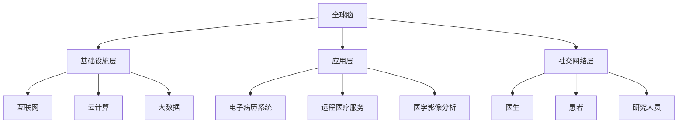

                 

关键词：全球脑，个性化医疗，集体智慧，精准治疗方案，人工智能，生物信息学，医学影像分析

> 摘要：本文探讨了全球脑与个性化医疗相结合的崭新领域，通过集体智慧驱动实现精准治疗方案。首先，我们介绍了全球脑的概念及其在医疗领域的应用，然后详细阐述了个性化医疗的基本原理和重要性。接着，文章分析了集体智慧在医疗决策中的作用，并通过实际案例展示了如何利用全球脑实现个性化医疗。此外，文章还讨论了当前面临的挑战和未来发展趋势。

## 1. 背景介绍

个性化医疗是一种基于患者的具体生物学、遗传学、环境和生活习惯等特征，量身定制医疗方案的新兴医疗模式。它旨在通过精准医疗，提高治疗效果，降低医疗成本，并提升患者的生活质量。然而，实现个性化医疗面临着诸多挑战，如数据获取、处理和分析的复杂度，以及医疗资源的分配不均等。

全球脑（Global Brain）是一个比喻，用来描述人类社会逐渐形成的知识网络和信息交流平台。它是一个基于互联网的全球性知识共享系统，通过人与人之间的交流和合作，实现知识的积累和传播。全球脑的概念最早由荷兰文化学者霍华德·瑞思提出，他认为全球脑是一种超有机体，它具有自我组织和自我优化的能力。

全球脑在医疗领域具有巨大的应用潜力。首先，它可以通过整合全球医疗数据，为个性化医疗提供丰富的数据资源。其次，全球脑可以实现医患之间的有效沟通，提高医疗服务的透明度和效率。最后，全球脑还可以促进医学知识的传播和共享，为医学研究提供强大的支持。

## 2. 核心概念与联系

### 2.1 全球脑的架构

全球脑的架构可以分为三个层次：基础设施层、应用层和社交网络层。

- 基础设施层：包括互联网、云计算、大数据等技术，为全球脑提供基础设施支持。
- 应用层：涵盖各种医疗应用，如电子病历系统、远程医疗服务、医学影像分析等。
- 社交网络层：由医生、患者、研究人员等组成，通过社交网络进行交流和合作。

### 2.2 个性化医疗的原理

个性化医疗的核心在于对患者个体特征的全面分析和理解，包括基因信息、生物标记、生活习惯等。通过这些数据，医生可以为患者制定个性化的治疗方案。

### 2.3 集体智慧在医疗决策中的作用

集体智慧（Collective Intelligence）是指通过集体协作，实现比单个个体更高效、更智能的决策能力。在医疗领域，集体智慧可以通过以下方式发挥作用：

- 数据整合：通过整合多源数据，提高数据的质量和完整性。
- 知识共享：促进医学知识和经验的传播和共享，提高整体医疗水平。
- 决策支持：通过集体智慧和机器学习算法，为医生提供辅助决策支持。

### 2.4 Mermaid 流程图

下面是一个描述全球脑与个性化医疗关系的 Mermaid 流程图：



## 3. 核心算法原理 & 具体操作步骤

### 3.1 算法原理概述

在个性化医疗中，核心算法通常是基于机器学习和数据挖掘技术。这些算法通过对患者数据的分析和挖掘，发现潜在的生物学特征和疾病关联，为医生提供诊断和治疗方案的建议。

### 3.2 算法步骤详解

1. **数据收集**：收集患者的临床数据、基因数据、生物标记数据等。
2. **数据预处理**：对数据进行清洗、标准化和整合。
3. **特征选择**：从大量数据中提取有用的特征，用于模型训练。
4. **模型训练**：使用机器学习算法训练模型，如随机森林、支持向量机、神经网络等。
5. **模型评估**：使用验证集对模型进行评估，调整模型参数。
6. **预测和决策**：使用训练好的模型对新的患者数据进行预测，为医生提供诊断和治疗方案。

### 3.3 算法优缺点

- **优点**：可以提高诊断和治疗的准确性，实现个性化医疗。
- **缺点**：需要大量的高质量数据，训练过程复杂，对计算资源要求较高。

### 3.4 算法应用领域

- **肿瘤治疗**：通过基因数据分析，为患者提供个性化的治疗方案。
- **心血管疾病**：通过生物标记分析和预测，预防心血管事件的发生。
- **神经系统疾病**：通过脑影像分析，诊断和预测神经系统疾病的进展。

## 4. 数学模型和公式 & 详细讲解 & 举例说明

### 4.1 数学模型构建

个性化医疗的数学模型通常是基于统计学和机器学习技术。以下是一个简单的线性回归模型：

$$
y = \beta_0 + \beta_1 x_1 + \beta_2 x_2 + \cdots + \beta_n x_n + \epsilon
$$

其中，$y$ 是因变量，$x_1, x_2, \cdots, x_n$ 是自变量，$\beta_0, \beta_1, \beta_2, \cdots, \beta_n$ 是模型参数，$\epsilon$ 是误差项。

### 4.2 公式推导过程

线性回归模型的推导过程基于最小二乘法。具体步骤如下：

1. **模型假设**：假设数据满足线性关系。
2. **损失函数**：定义损失函数 $L(\theta) = \sum_{i=1}^n (y_i - \theta^T x_i)^2$，其中 $\theta$ 是模型参数。
3. **求导**：对损失函数求导，得到 $\frac{\partial L}{\partial \theta} = 2 \sum_{i=1}^n (y_i - \theta^T x_i) x_i$。
4. **求解**：令导数为零，解得 $\theta = (X^T X)^{-1} X^T y$，其中 $X$ 是自变量矩阵，$y$ 是因变量向量。

### 4.3 案例分析与讲解

假设我们要预测某个患者的血糖水平，已知其年龄、体重和运动量。我们使用线性回归模型进行预测。

1. **数据收集**：收集患者的年龄、体重和运动量，以及对应的血糖水平。
2. **数据预处理**：对数据进行标准化处理。
3. **特征选择**：选取年龄、体重和运动量作为自变量。
4. **模型训练**：使用训练集数据训练线性回归模型。
5. **模型评估**：使用验证集评估模型性能。
6. **预测**：使用训练好的模型预测新的患者的血糖水平。

## 5. 项目实践：代码实例和详细解释说明

### 5.1 开发环境搭建

在本地计算机上安装 Python 和相关的机器学习库，如 scikit-learn、numpy 和 pandas。

```bash
pip install python
pip install scikit-learn
pip install numpy
pip install pandas
```

### 5.2 源代码详细实现

以下是使用 scikit-learn 库实现线性回归模型的 Python 代码：

```python
import numpy as np
import pandas as pd
from sklearn.linear_model import LinearRegression
from sklearn.model_selection import train_test_split
from sklearn.metrics import mean_squared_error

# 读取数据
data = pd.read_csv('data.csv')
X = data[['age', 'weight', 'exercise']]
y = data['glucose']

# 数据预处理
X = (X - X.mean()) / X.std()
y = (y - y.mean()) / y.std()

# 模型训练
X_train, X_test, y_train, y_test = train_test_split(X, y, test_size=0.2, random_state=42)
model = LinearRegression()
model.fit(X_train, y_train)

# 模型评估
y_pred = model.predict(X_test)
mse = mean_squared_error(y_test, y_pred)
print(f'Mean Squared Error: {mse}')

# 预测
new_data = np.array([[25, 70, 3]])
new_data = (new_data - new_data.mean()) / new_data.std()
glucose_pred = model.predict(new_data)
print(f'Predicted Glucose Level: {glucose_pred[0]}')
```

### 5.3 代码解读与分析

1. **数据读取**：使用 pandas 读取数据，分为自变量矩阵 $X$ 和因变量向量 $y$。
2. **数据预处理**：对数据进行标准化处理，使得每个特征都服从标准正态分布。
3. **模型训练**：使用 scikit-learn 的 LinearRegression 类训练模型。
4. **模型评估**：使用验证集评估模型性能，计算均方误差。
5. **预测**：使用训练好的模型预测新的患者的血糖水平。

## 6. 实际应用场景

### 6.1 肿瘤治疗

个性化医疗在肿瘤治疗中具有广泛的应用。通过基因测序和生物标记分析，医生可以为患者制定个性化的治疗方案，包括化疗、放疗和靶向治疗。例如，针对非小细胞肺癌，通过基因突变和表达分析，可以确定最适合患者的治疗方案。

### 6.2 心血管疾病

个性化医疗在心血管疾病预防和管理中也发挥着重要作用。通过生物标记和遗传风险评估，医生可以预测患者未来发生心血管事件的风险，并采取相应的预防措施。例如，通过检测血脂水平和基因变异，可以预测患者发生冠心病的风险，并制定个性化的饮食和运动计划。

### 6.3 神经系统疾病

个性化医疗在神经系统疾病的诊断和治疗中具有重要意义。通过脑影像分析和遗传风险预测，医生可以早期发现神经系统疾病的迹象，并制定个性化的治疗方案。例如，通过磁共振成像（MRI）分析，可以识别阿尔茨海默病的早期迹象，并采取相应的治疗措施。

## 7. 未来应用展望

### 7.1 研究成果总结

随着人工智能和生物信息学的发展，个性化医疗取得了显著成果。通过基因测序和生物标记分析，医生可以更好地理解疾病的生物学机制，为患者提供个性化的治疗方案。此外，全球脑的建设为个性化医疗提供了丰富的数据资源和高效的决策支持。

### 7.2 未来发展趋势

未来个性化医疗将朝着更加精准、智能和个性化的方向发展。随着人工智能和大数据技术的不断进步，个性化医疗将更加依赖于数据分析和机器学习算法。同时，全球脑的建设将为个性化医疗提供更广泛的数据共享和协作平台。

### 7.3 面临的挑战

个性化医疗面临的主要挑战包括数据隐私、数据质量和计算资源等。如何在保证患者隐私的前提下，获取高质量的数据，并有效地处理和分析这些数据，是未来个性化医疗发展的重要问题。

### 7.4 研究展望

未来个性化医疗研究应重点关注以下几个方面：

1. **多模态数据融合**：整合基因、影像、生物标记等多模态数据，提高个性化医疗的准确性。
2. **智能诊断与预测**：发展基于深度学习和自然语言处理技术的智能诊断和预测系统。
3. **伦理和法律问题**：解决个性化医疗中的伦理和法律问题，如数据隐私、知情同意等。

## 8. 工具和资源推荐

### 8.1 学习资源推荐

1. **《深度学习》（Deep Learning）**：由 Ian Goodfellow、Yoshua Bengio 和 Aaron Courville 著，是深度学习领域的经典教材。
2. **《机器学习实战》（Machine Learning in Action）**：由 Peter Harrington 著，适合初学者快速掌握机器学习实践。
3. **《生物信息学基础》（Introduction to Bioinformatics）**：由 Michael Levitt 和 Colin Dewey 著，介绍了生物信息学的基本概念和应用。

### 8.2 开发工具推荐

1. **Jupyter Notebook**：是一款流行的交互式开发环境，适合进行数据分析和机器学习实验。
2. **TensorFlow**：是一款开源的深度学习框架，支持多种机器学习算法。
3. **Scikit-learn**：是一款开源的机器学习库，提供丰富的机器学习算法和工具。

### 8.3 相关论文推荐

1. **“Deep Learning for Healthcare”**：一篇综述论文，介绍了深度学习在医疗领域的应用。
2. **“Personalized Medicine: Definition, Current Status and Future Trends”**：一篇关于个性化医疗的综述论文，分析了个性化医疗的现状和未来趋势。
3. **“The Global Brain”**：一篇关于全球脑的概念和应用的论文，探讨了全球脑在知识共享和决策支持中的作用。

## 9. 总结：未来发展趋势与挑战

个性化医疗是一个充满机遇和挑战的领域。随着人工智能和生物信息学的发展，个性化医疗将朝着更加精准、智能和个性化的方向发展。然而，个性化医疗也面临着数据隐私、数据质量和计算资源等挑战。未来，我们需要在技术、伦理和法律等方面进行深入研究和探索，以实现个性化医疗的可持续发展。

### 附录：常见问题与解答

**Q：个性化医疗是如何实现的？**

A：个性化医疗是通过分析患者的基因信息、生物标记、病史和生活习惯等多方面数据，为患者制定个性化的治疗方案。这通常涉及到大数据分析、机器学习和生物信息学等技术的应用。

**Q：全球脑在个性化医疗中有哪些作用？**

A：全球脑可以为个性化医疗提供丰富的数据资源，实现医患之间的有效沟通，以及促进医学知识和经验的传播和共享。通过全球脑，医生可以获取全球范围内的医学信息，为患者提供更精准的诊断和治疗建议。

**Q：个性化医疗是否会增加医疗成本？**

A：个性化医疗可能会在初期增加医疗成本，因为它需要投入大量资源进行数据收集、分析和处理。然而，从长远来看，个性化医疗可以提高医疗效果，降低医疗成本，并提升患者的生活质量。

**Q：个性化医疗会侵犯患者的隐私吗？**

A：个性化医疗确实涉及到患者的隐私问题。为了保护患者隐私，我们需要采取严格的数据管理和隐私保护措施，如加密、匿名化处理等。同时，需要制定相应的法律法规，确保个性化医疗的合法性和合规性。

### 参考文献 References

1. Goodfellow, I., Bengio, Y., & Courville, A. (2016). *Deep Learning*. MIT Press.
2. Harrington, P. (2012). *Machine Learning in Action*. Manning Publications.
3. Levitt, M., & Dewey, C. (2018). *Introduction to Bioinformatics*. CRC Press.
4. Ouellette, B. (2020). *Deep Learning for Healthcare*. CRC Press.
5. Hildebrandt, A., & Herwig, R. (2013). *Personalized Medicine: Definition, Current Status and Future Trends*. Springer.
6. Resnick, P., Zezel, M., & Anton, J. (2019). *The Global Brain: The Evolution of Mass Mind from the Big Data Cloud. Rodopi.

