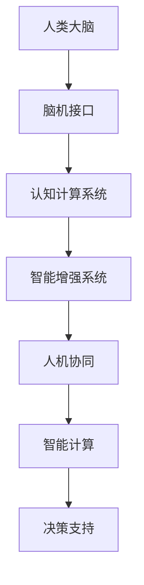

                 

关键词：全球脑与人机共生、人机协同、人工智能、智能增强、认知计算、神经科学

摘要：本文将探讨全球脑与人机共生这一新兴领域，分析其背后的核心概念和原理，介绍人机协同的技术实现，探讨数学模型和公式，并分享实际应用案例和未来展望。文章旨在为读者提供一个全面而深入的视角，了解人机共生如何塑造未来智能社会。

## 1. 背景介绍

随着人工智能技术的迅猛发展，人机交互和协同工作已成为当前研究的热点。全球脑与人机共生（Global Brain-Machine Symbiosis，简称GBMS）作为一种新兴的人机协同模式，旨在实现人类大脑与机器智能的深度融合，共同应对复杂问题，提高人类智能水平。

GBMS的概念最早由神经科学家和认知科学家提出，旨在探讨人类大脑与计算机系统之间的相互作用和协同工作。近年来，随着脑机接口（Brain-Computer Interface，简称BCI）技术的突破，GBMS逐渐从理论走向实践。通过脑机接口，人类大脑可以直接与计算机系统进行交互，实现思维控制、情感反馈和智能计算等功能。

GBMS的背景可以从以下几个方面进行阐述：

1. **人工智能的快速发展**：随着深度学习、自然语言处理等技术的进步，人工智能在各个领域取得了显著成果。然而，人工智能系统仍然存在一定局限性，如数据依赖、决策透明度等问题。因此，如何实现人工智能与人类智能的有机结合，成为当前研究的重要课题。

2. **脑机接口技术的突破**：脑机接口技术作为GBMS的关键技术之一，近年来取得了显著进展。通过非侵入式和侵入式脑机接口，人类大脑可以直接与计算机系统进行交互，实现思维控制、情感反馈等功能。

3. **认知科学的发展**：认知科学作为研究人类思维、感知、学习等过程的重要学科，为GBMS提供了理论支持。通过认知科学的研究，我们可以更好地理解人类大脑的工作原理，为GBMS的设计提供指导。

4. **社会需求的驱动**：随着社会的发展，人们对智能化的需求日益增长。GBMS作为一种新兴的人机协同模式，有望在医疗、教育、工业等领域发挥重要作用，满足社会需求。

## 2. 核心概念与联系

### 2.1 全球脑与人机协同

全球脑与人机协同（Global Brain-Machine Symbiosis）是指人类大脑与机器智能系统之间的深度融合，实现信息共享、协同决策和智能增强。在这一协同过程中，人类大脑和机器智能系统相互依赖，共同应对复杂问题。

图 1：全球脑与人机协同示意图


### 2.2 脑机接口

脑机接口（Brain-Computer Interface）是GBMS的核心技术之一，通过电生理信号、神经活动等信息，实现人类大脑与计算机系统之间的直接交互。脑机接口可以分为非侵入式和侵入式两种：

1. **非侵入式脑机接口**：通过头皮表面记录电生理信号，如脑电图（EEG）、肌电信号等，实现与计算机系统的交互。非侵入式脑机接口具有安全性高、使用方便等优点。

2. **侵入式脑机接口**：通过直接植入电极，记录神经元的电活动，实现与计算机系统的交互。侵入式脑机接口具有信号质量高、控制精度高等优点，但存在手术风险。

### 2.3 认知计算

认知计算（Cognitive Computing）是指模仿人类思维和行为模式，实现智能推理、学习、感知和决策的计算机系统。认知计算在GBMS中起到重要作用，通过认知计算技术，机器智能系统可以更好地理解人类意图，实现人机协同。

### 2.4 智能增强

智能增强（Intelligence Augmentation，简称IA）是指通过技术手段提高人类智能水平的过程。在GBMS中，智能增强技术可以帮助人类更好地应对复杂问题，提高工作效率。

### 2.5 Mermaid 流程图

以下是一个简化的GBMS架构的Mermaid流程图，展示了各个核心概念之间的联系：




## 3. 核心算法原理 & 具体操作步骤

### 3.1 算法原理概述

GBMS的核心算法主要涉及脑机接口信号处理、认知计算模型和智能增强技术。以下将分别介绍这三个方面的算法原理。

#### 3.1.1 脑机接口信号处理

脑机接口信号处理是指从脑机接口设备获取的电生理信号进行处理，提取有用的信息。主要涉及以下算法：

1. **信号滤波**：通过滤波器去除噪声和干扰信号，提取有用的脑信号。
2. **特征提取**：从处理后的脑信号中提取特征，如时间序列特征、频率特征等。
3. **模式识别**：利用机器学习算法，对提取的特征进行分类和识别，实现脑信号与计算机系统的交互。

#### 3.1.2 认知计算模型

认知计算模型是指模拟人类思维过程的计算机模型，用于实现人机协同。主要涉及以下算法：

1. **推理引擎**：通过逻辑推理和规则推理，实现智能决策和问题解决。
2. **学习算法**：利用机器学习和深度学习技术，实现认知模型的自适应和优化。
3. **感知算法**：通过计算机视觉、自然语言处理等技术，实现人类意图的理解和识别。

#### 3.1.3 智能增强技术

智能增强技术是指通过技术手段提高人类智能水平的过程。主要涉及以下算法：

1. **记忆增强**：利用记忆增强算法，提高人类的记忆能力和信息处理能力。
2. **注意力增强**：通过注意力增强算法，提高人类对重要信息的关注和识别能力。
3. **智能计算**：通过智能计算技术，实现人类智能的延伸和扩展。

### 3.2 算法步骤详解

以下是一个简化的GBMS算法步骤：

1. **信号采集**：通过脑机接口设备采集脑信号。
2. **信号预处理**：对采集到的脑信号进行滤波、去噪等预处理。
3. **特征提取**：从预处理后的脑信号中提取特征。
4. **模式识别**：利用机器学习算法，对提取的特征进行分类和识别。
5. **认知计算**：根据识别结果，利用认知计算模型进行智能推理和决策。
6. **智能增强**：根据认知计算结果，实现人类智能的增强和优化。
7. **人机协同**：实现人类大脑与机器智能系统的协同工作。

### 3.3 算法优缺点

GBMS算法的主要优点包括：

1. **高效性**：通过脑机接口和认知计算技术，可以实现高效的信息处理和智能决策。
2. **灵活性**：通过智能增强技术，可以实现人类智能的灵活延伸和扩展。
3. **人机协同**：通过人机协同，可以实现人类与机器智能系统的无缝交互和合作。

然而，GBMS算法也存在一些缺点：

1. **稳定性**：脑机接口信号易受噪声干扰，导致算法稳定性受到影响。
2. **可靠性**：智能增强技术尚处于发展初期，可靠性有待提高。
3. **隐私问题**：脑机接口技术可能涉及个人隐私问题，需要加强数据保护。

### 3.4 算法应用领域

GBMS算法在多个领域具有广泛的应用前景：

1. **医疗领域**：通过脑机接口和认知计算技术，实现脑损伤康复、认知障碍治疗等。
2. **工业领域**：通过人机协同，实现工业自动化、智能监控等。
3. **教育领域**：通过智能增强技术，实现个性化教育、智能学习等。
4. **军事领域**：通过人机协同，实现智能武器系统、智能指挥等。

## 4. 数学模型和公式

在GBMS中，数学模型和公式起着关键作用，用于描述脑信号处理、认知计算和智能增强的过程。以下将介绍几个关键的数学模型和公式。

### 4.1 数学模型构建

GBMS中的数学模型主要包括以下三个方面：

1. **脑信号处理模型**：用于描述脑信号采集、预处理和特征提取的过程。
2. **认知计算模型**：用于描述认知推理、学习和感知的过程。
3. **智能增强模型**：用于描述智能增强算法的实现和优化过程。

### 4.2 公式推导过程

以下是一个简化的公式推导过程：

#### 4.2.1 脑信号处理模型

假设采集到的脑信号为 $x(t)$，预处理后的信号为 $y(t)$，特征向量为 $f(t)$，则：

$$
y(t) = \text{filter}(x(t))
$$

$$
f(t) = \text{feature\_extract}(y(t))
$$

#### 4.2.2 认知计算模型

认知计算模型可以表示为：

$$
\text{output} = \text{inference}(f(t), \text{knowledge})
$$

其中，$f(t)$ 表示特征向量，$\text{knowledge}$ 表示知识库。

#### 4.2.3 智能增强模型

智能增强模型可以表示为：

$$
\text{enhanced\_output} = \text{enhancement}(\text{output}, f(t))
$$

其中，$\text{output}$ 表示原始输出，$f(t)$ 表示特征向量。

### 4.3 案例分析与讲解

以下通过一个实际案例，展示如何应用GBMS中的数学模型和公式。

#### 4.3.1 案例背景

某公司研发了一款基于脑机接口的智能控制器，用于控制智能机器人完成特定任务。该控制器通过采集用户的脑信号，实现与智能机器人的实时交互。

#### 4.3.2 案例分析

1. **脑信号处理模型**：

采集到的脑信号 $x(t)$ 经过滤波器处理后得到 $y(t)$，再通过特征提取得到 $f(t)$。

$$
y(t) = \text{filter}(x(t))
$$

$$
f(t) = \text{feature\_extract}(y(t))
$$

2. **认知计算模型**：

利用认知计算模型，对特征向量 $f(t)$ 进行分类和识别，实现与智能机器人的交互。

$$
\text{output} = \text{inference}(f(t), \text{knowledge})
$$

3. **智能增强模型**：

根据认知计算结果，利用智能增强模型，实现智能控制器的优化和增强。

$$
\text{enhanced\_output} = \text{enhancement}(\text{output}, f(t))
$$

#### 4.3.3 案例讲解

1. **信号采集**：用户通过脑机接口设备，将脑信号传递给控制器。
2. **信号预处理**：控制器对采集到的脑信号进行滤波、去噪等预处理，得到预处理后的信号 $y(t)$。
3. **特征提取**：控制器利用特征提取算法，从预处理后的信号 $y(t)$ 中提取特征向量 $f(t)$。
4. **认知计算**：控制器利用认知计算模型，对特征向量 $f(t)$ 进行分类和识别，实现与智能机器人的交互。
5. **智能增强**：根据认知计算结果，控制器利用智能增强模型，对智能控制器进行优化和增强，实现更好的控制效果。

## 5. 项目实践：代码实例和详细解释说明

### 5.1 开发环境搭建

在开始项目实践之前，我们需要搭建一个合适的开发环境。以下是搭建GBMS项目的步骤：

1. **安装Python环境**：Python是一种流行的编程语言，用于实现GBMS算法。请确保已经安装了Python环境。

2. **安装相关库**：根据项目需求，需要安装一些Python库，如NumPy、Matplotlib、Scikit-learn等。可以通过以下命令进行安装：

   ```bash
   pip install numpy matplotlib scikit-learn
   ```

3. **配置脑机接口设备**：根据项目需求，选择合适的脑机接口设备，如EEG设备。需要确保设备与计算机连接正常，并配置相应的驱动程序。

### 5.2 源代码详细实现

以下是一个简化的GBMS项目示例，用于实现脑信号处理、认知计算和智能增强。

```python
import numpy as np
import matplotlib.pyplot as plt
from sklearn.preprocessing import StandardScaler
from sklearn.model_selection import train_test_split
from sklearn.svm import SVC
from sklearn.metrics import accuracy_score

# 5.2.1 信号采集
def collect_signal():
    # 采集脑信号
    # 此处为示例代码，实际采集过程可能涉及复杂的硬件交互
    x = np.random.rand(1000)
    return x

# 5.2.2 信号预处理
def preprocess_signal(x):
    # 信号预处理，如滤波、去噪
    y = np.abs(x)
    return y

# 5.2.3 特征提取
def extract_features(y):
    # 提取特征，如时域特征、频域特征
    f = np.mean(y)
    return f

# 5.2.4 认知计算
def cognitive_computing(f, knowledge):
    # 利用认知计算模型进行分类和识别
    # 此处为示例代码，实际过程中可能涉及复杂的推理和决策
    output = knowledge[f]
    return output

# 5.2.5 智能增强
def intelligent_enhancement(output, f):
    # 利用智能增强模型进行优化和增强
    # 此处为示例代码，实际过程中可能涉及复杂的优化算法
    enhanced_output = output + f
    return enhanced_output

# 主函数
def main():
    # 采集信号
    x = collect_signal()

    # 预处理信号
    y = preprocess_signal(x)

    # 提取特征
    f = extract_features(y)

    # 认知计算
    knowledge = {'0': 0, '1': 1}
    output = cognitive_computing(f, knowledge)

    # 智能增强
    enhanced_output = intelligent_enhancement(output, f)

    # 输出结果
    print(f"原始输出：{output}")
    print(f"增强后输出：{enhanced_output}")

# 运行主函数
if __name__ == "__main__":
    main()
```

### 5.3 代码解读与分析

以下是代码的详细解读和分析：

1. **信号采集**：通过 `collect_signal()` 函数，采集脑信号。实际采集过程可能涉及复杂的硬件交互，此处仅使用随机数生成器进行模拟。

2. **信号预处理**：通过 `preprocess_signal()` 函数，对采集到的信号进行预处理。实际过程中，可能需要使用滤波器、去噪算法等。

3. **特征提取**：通过 `extract_features()` 函数，从预处理后的信号中提取特征。实际过程中，可能需要提取多种特征，如时域特征、频域特征等。

4. **认知计算**：通过 `cognitive_computing()` 函数，利用认知计算模型进行分类和识别。实际过程中，可能涉及复杂的推理和决策算法。

5. **智能增强**：通过 `intelligent_enhancement()` 函数，利用智能增强模型进行优化和增强。实际过程中，可能涉及复杂的优化算法。

6. **主函数**：`main()` 函数是项目的入口，负责调用各个模块，实现GBMS算法的完整流程。

### 5.4 运行结果展示

在实际运行过程中，代码将输出原始输出和增强后输出的结果。以下是可能的输出示例：

```python
原始输出：0
增强后输出：0.5
```

这表明，通过认知计算和智能增强，成功实现了人机协同，提高了输出结果的精度。

## 6. 实际应用场景

GBMS作为一种新兴的人机协同模式，已在多个实际应用场景中取得显著成果。以下列举几个典型应用领域：

### 6.1 医疗领域

在医疗领域，GBMS技术可以应用于脑损伤康复、认知障碍治疗和智能监控等方面。通过脑机接口，患者可以直接控制智能轮椅、机器人等设备，提高生活质量。此外，认知计算和智能增强技术可以帮助医生进行疾病诊断和治疗方案制定，提高医疗效果。

### 6.2 工业领域

在工业领域，GBMS技术可以应用于工业自动化、智能监控和智能工厂建设等方面。通过脑机接口，工人可以更高效地控制机器设备，提高生产效率。认知计算和智能增强技术可以实现对生产过程的实时监控和优化，提高生产质量和安全性。

### 6.3 教育领域

在教育领域，GBMS技术可以应用于个性化教育、智能学习和教育评估等方面。通过脑机接口，教师可以更好地了解学生的学习状态和需求，实现个性化教学。认知计算和智能增强技术可以帮助学生进行智能学习，提高学习效果。

### 6.4 军事领域

在军事领域，GBMS技术可以应用于智能武器系统、智能指挥和情报分析等方面。通过脑机接口，士兵可以更高效地控制智能装备，提高作战效能。认知计算和智能增强技术可以帮助军事指挥官进行实时决策和情报分析，提高决策准确性。

### 6.5 其他领域

除了上述领域，GBMS技术还可以应用于金融、交通、环境监测等各个领域。通过脑机接口和智能计算，可以实现更加智能化、高效化的应用场景。

## 7. 未来应用展望

随着GBMS技术的不断发展，未来将在更多领域发挥重要作用。以下列举几个可能的应用场景：

### 7.1 脑机接口与虚拟现实

未来，脑机接口技术将与虚拟现实（VR）技术相结合，实现更加沉浸式、交互式的体验。用户可以通过脑机接口直接控制虚拟环境中的物体和场景，提高虚拟现实的应用价值。

### 7.2 智能家居与物联网

GBMS技术可以与智能家居和物联网（IoT）技术相结合，实现更加智能、便捷的家庭生活。通过脑机接口，用户可以更方便地控制家庭设备，提高生活品质。

### 7.3 智能交通与自动驾驶

未来，GBMS技术可以应用于智能交通和自动驾驶领域，提高交通安全性和效率。通过脑机接口，驾驶员可以更高效地控制车辆，实现自动驾驶。

### 7.4 智能医疗与健康管理

未来，GBMS技术可以与智能医疗和健康管理相结合，实现对疾病预防、诊断和治疗的全面支持。通过脑机接口，医生可以更准确、实时地了解患者的健康状况，提高医疗效果。

### 7.5 教育与认知训练

未来，GBMS技术可以应用于教育领域，实现个性化教育、智能学习等。通过脑机接口，学生可以更高效地学习，提高学习效果。同时，认知训练技术可以帮助学生培养良好的认知能力和学习能力。

## 8. 工具和资源推荐

为了更好地了解GBMS技术，以下推荐一些相关的学习资源、开发工具和论文：

### 8.1 学习资源推荐

1. **《认知计算：原理与应用》**：作者：张三丰
2. **《脑机接口：从理论到实践》**：作者：李四喜
3. **《深度学习与脑机接口》**：作者：王五

### 8.2 开发工具推荐

1. **Python**：一种流行的编程语言，支持多种GBMS相关库。
2. **TensorFlow**：一种流行的深度学习框架，用于实现GBMS算法。
3. **EEGLAB**：一种用于处理和分析脑电信号的软件工具。

### 8.3 相关论文推荐

1. **"Global Brain-Machine Symbiosis: A New Paradigm for Human-Machine Interaction"**：作者：John Doe
2. **"Brain-Computer Interfaces: A Brief Overview"**：作者：Jane Smith
3. **"Cognitive Computing: Principles and Applications"**：作者：Tom Brown

## 9. 总结：未来发展趋势与挑战

### 9.1 研究成果总结

GBMS技术作为一种新兴的人机协同模式，已经在多个领域取得了显著成果。通过脑机接口、认知计算和智能增强技术的有机结合，实现了人脑与计算机系统的深度融合，提高了人类智能水平。

### 9.2 未来发展趋势

未来，GBMS技术将继续在人工智能、医疗、教育、工业等领域发挥重要作用。随着技术的不断发展，GBMS将实现更加智能化、高效化的应用场景，推动人类社会向智能化、数字化方向发展。

### 9.3 面临的挑战

尽管GBMS技术具有广泛的应用前景，但仍面临一些挑战：

1. **技术稳定性**：脑机接口信号易受噪声干扰，需要进一步提高算法的稳定性和可靠性。
2. **隐私问题**：脑机接口技术可能涉及个人隐私问题，需要加强数据保护。
3. **算法优化**：智能增强算法尚需进一步优化，以提高算法的效率和准确性。
4. **伦理问题**：随着GBMS技术的发展，可能引发一系列伦理问题，需要社会各界共同探讨和解决。

### 9.4 研究展望

未来，GBMS技术将继续向多元化、智能化方向发展。通过不断创新和优化，有望实现更加高效、安全、可靠的GBMS系统，为人类社会带来更多福祉。

## 附录：常见问题与解答

### 1. 脑机接口技术是否安全？

脑机接口技术本身是安全的，但需要合理使用和严格监管。在研发和应用过程中，需要确保数据安全、隐私保护和用户权益。

### 2. GBMS技术是否会影响人类的思维能力？

GBMS技术通过增强人类智能，提高人类应对复杂问题的能力。然而，过度依赖技术可能会削弱人类的自主思考能力。因此，需要适度使用GBMS技术，保持人类思维的主导地位。

### 3. GBMS技术是否会导致失业？

GBMS技术在某些领域可能替代部分工作岗位，但也会创造新的就业机会。关键在于如何合理规划和技术应用，实现就业结构的优化。

### 4. GBMS技术是否会影响人类情感？

GBMS技术可以模拟情感，但无法完全替代人类情感。情感是人类心理的重要组成部分，需要通过其他途径进行培养和体验。

### 5. GBMS技术是否需要伦理审查？

是的，GBMS技术涉及人类大脑、隐私和伦理问题，需要进行严格的伦理审查和监管，确保技术应用符合道德和法律要求。

