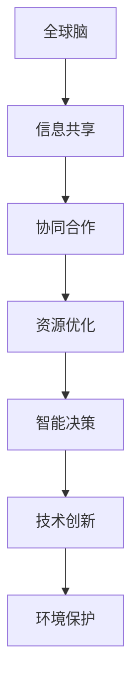

                 

关键词：全球脑，环境保护，集体行动，协同优化，计算模型，技术手段，环境监测，可持续发展

> 摘要：本文探讨了全球脑与环境保护之间的紧密联系，提出了通过集体行动来实现环境保护的新思路。我们首先介绍了全球脑的基本概念，然后分析了环境保护中面临的挑战，随后探讨了通过集体行动和计算模型来优化环境保护的路径。文章最后对未来的发展方向与挑战进行了展望。

## 1. 背景介绍

随着全球人口的不断增长和工业化进程的加速，地球的环境问题日益严重。气候变化、资源枯竭、生物多样性减少等问题已经成为全球共同关注的焦点。环境保护不再仅仅是政府或非政府组织的责任，而是需要全社会共同参与的一项集体行动。

在这个背景下，全球脑的概念逐渐得到关注。全球脑是指全球范围内的智能体（如个人、组织、政府等）通过互联网等通信技术实现的信息共享和协同合作，从而形成一个庞大的、智能化的全球网络系统。全球脑的核心理念是通过集体智慧和协同优化来解决问题。

本文旨在探讨全球脑与环境保护之间的联系，提出通过集体行动来优化环境保护的新思路。我们将从以下几个方面展开讨论：

1. 全球脑的基本概念及其在环境保护中的应用。
2. 环境保护中面临的挑战。
3. 集体行动在环境保护中的重要性。
4. 基于全球脑的协同优化计算模型。
5. 全球脑与环境保护的未来发展方向。

## 2. 核心概念与联系

### 2.1 全球脑的概念

全球脑（Global Brain）这一概念最早由匈牙利科学家安德烈·巴拉巴西（András Báthory)于1997年提出。他认为，全球脑是地球上所有智能体的集合，这些智能体通过互联网等通信技术相互连接，形成了一个全球性的信息网络。在这个网络中，每个智能体都可以获取和分享信息，并通过协作来实现共同的目标。

全球脑的基本特征包括：

1. **连接性**：全球脑中的智能体通过网络相互连接，形成一个庞大的网络系统。
2. **信息共享**：智能体可以通过网络获取和分享信息，从而实现知识的传播和共享。
3. **协同合作**：智能体之间可以通过协作来实现共同的目标，形成集体智慧。
4. **适应性**：全球脑具有高度的适应性，能够快速调整和优化其行为以适应环境变化。

### 2.2 环境保护中的挑战

环境保护面临着一系列的挑战，主要包括：

1. **气候变化**：全球气候变化对生态系统和人类社会产生了严重影响，导致极端天气事件的频繁发生。
2. **资源枯竭**：资源的过度开采和浪费导致资源枯竭，威胁到地球的可持续发展。
3. **生物多样性减少**：生物多样性的减少导致生态系统的破坏，威胁到地球的生态平衡。
4. **环境污染**：环境污染对人类健康和生态系统造成了严重威胁，如空气污染、水污染、土壤污染等。

### 2.3 全球脑在环境保护中的应用

全球脑的概念为环境保护提供了一种新的思路和方法。通过全球脑，我们可以实现以下目标：

1. **信息共享**：全球脑使得环保组织、科学家、政府等智能体可以共享信息和数据，提高环境保护的效率和准确性。
2. **协同合作**：全球脑促进了不同领域、不同组织之间的协同合作，形成合力来应对环境问题。
3. **资源优化**：全球脑可以通过集体智慧来优化资源分配和使用，减少资源的浪费，提高资源利用效率。
4. **决策支持**：全球脑可以为政府和企业提供科学的决策支持，帮助他们制定更有效的环保政策和措施。

### 2.4 全球脑与环境保护的关联性

全球脑与环境保护之间的关联性体现在以下几个方面：

1. **协同优化**：全球脑通过集体智慧和协同优化，可以帮助我们更好地应对环境问题，实现环境保护的目标。
2. **智能决策**：全球脑可以为我们提供智能化的决策支持，帮助我们制定更科学的环保策略和措施。
3. **技术创新**：全球脑为环境保护提供了新的技术手段，如大数据分析、人工智能等，这些技术可以大大提高环境保护的效率和准确性。

### 2.5 Mermaid 流程图

以下是一个简单的 Mermaid 流程图，展示了全球脑与环境保护之间的关联性：



## 3. 核心算法原理 & 具体操作步骤

### 3.1 算法原理概述

为了实现全球脑在环境保护中的应用，我们需要设计一套核心算法。这个算法的核心原理是利用全球脑的协同优化能力来提高环境保护的效率和准确性。

算法的基本思路是：

1. 收集和整合全球范围内的环境数据，包括气候、资源、生物多样性、污染等。
2. 利用机器学习等技术对数据进行处理和分析，提取关键信息。
3. 根据提取的关键信息，制定科学的环保策略和措施。
4. 通过全球脑的协同优化，优化环保策略和措施的实施效果。

### 3.2 算法步骤详解

#### 3.2.1 数据收集与整合

第一步是收集和整合全球范围内的环境数据。这些数据可以来自政府机构、科研机构、环保组织、企业等。数据类型包括气候数据、水资源数据、土地资源数据、污染数据等。

数据收集的方法包括：

1. 利用卫星遥感技术获取大范围的环境数据。
2. 通过传感器网络实时监测环境数据。
3. 利用社交媒体等平台收集公众提供的环境数据。

收集到的数据需要进行整合，形成统一的数据集。这一步可以使用数据清洗、数据集成等技术。

#### 3.2.2 数据处理与分析

整合后的数据需要进行处理和分析。这一步的主要任务是提取关键信息，为制定环保策略提供依据。

数据处理和分析的方法包括：

1. 利用机器学习算法对环境数据进行分析，提取关键特征。
2. 利用统计学方法对环境数据进行分析，发现环境问题的趋势和规律。
3. 利用数据挖掘技术对环境数据进行分析，发现潜在的环境问题。

#### 3.2.3 制定环保策略

根据数据处理和分析的结果，制定科学的环保策略和措施。这一步需要考虑多种因素，如气候条件、资源分布、污染源等。

制定环保策略的方法包括：

1. 利用模拟仿真技术，评估不同环保策略的效果。
2. 利用博弈论方法，确定环保策略的最优组合。
3. 利用优化算法，优化环保策略的实施效果。

#### 3.2.4 协同优化

制定好环保策略后，需要通过全球脑的协同优化来提高策略的实施效果。这一步的主要任务是协调不同智能体之间的行动，实现环保目标。

协同优化的方法包括：

1. 利用多代理系统，实现不同智能体之间的信息共享和协同合作。
2. 利用分布式计算技术，实现大规模数据的实时处理和分析。
3. 利用人工智能技术，实现环保策略的自动调整和优化。

### 3.3 算法优缺点

#### 优点

1. 提高环保效率：通过协同优化，可以实现环保策略的最优组合，提高环保效率。
2. 提高环保准确性：通过大数据分析和机器学习，可以更准确地评估环境问题，制定更科学的环保策略。
3. 促进信息共享：通过全球脑，可以实现环保信息的共享和传播，提高公众的环保意识。

#### 缺点

1. 数据隐私和安全问题：全球脑需要收集和整合大量敏感数据，可能面临数据隐私和安全问题。
2. 技术门槛较高：实现全球脑的协同优化需要较高的技术水平，可能对企业和组织造成一定的技术压力。

### 3.4 算法应用领域

全球脑的协同优化算法可以应用于多个领域，包括：

1. 气候变化：通过协同优化，实现全球气候变化的有效应对。
2. 资源管理：通过协同优化，实现全球资源的合理分配和利用。
3. 生物多样性保护：通过协同优化，实现生物多样性的有效保护。
4. 污染控制：通过协同优化，实现环境污染的有效控制。

## 4. 数学模型和公式 & 详细讲解 & 举例说明

### 4.1 数学模型构建

为了更好地理解全球脑协同优化算法，我们需要构建一个数学模型。这个模型将描述全球脑在环境保护中的应用过程，包括数据收集、数据处理、环保策略制定和协同优化等步骤。

#### 4.1.1 数据收集模型

数据收集模型可以表示为：

$$
X = \{x_1, x_2, ..., x_n\}
$$

其中，$X$ 是环境数据的集合，$x_i$ 是第 $i$ 个环境数据。

#### 4.1.2 数据处理模型

数据处理模型可以表示为：

$$
Y = F(X)
$$

其中，$Y$ 是处理后的环境数据，$F$ 是数据处理函数。

#### 4.1.3 环保策略模型

环保策略模型可以表示为：

$$
S = G(Y)
$$

其中，$S$ 是环保策略，$G$ 是策略生成函数。

#### 4.1.4 协同优化模型

协同优化模型可以表示为：

$$
O = H(S)
$$

其中，$O$ 是协同优化结果，$H$ 是协同优化函数。

### 4.2 公式推导过程

接下来，我们将对上述公式进行推导。

#### 4.2.1 数据收集模型推导

数据收集模型可以基于传感器网络和遥感技术进行构建。假设传感器网络覆盖全球，每个传感器收集到的数据为 $x_i$，则：

$$
X = \{x_1, x_2, ..., x_n\} = \{s_1, s_2, ..., s_m\}
$$

其中，$s_i$ 是第 $i$ 个传感器收集到的数据。

#### 4.2.2 数据处理模型推导

数据处理模型可以基于机器学习和数据挖掘技术进行构建。假设数据处理函数 $F$ 为：

$$
F(X) = \{y_1, y_2, ..., y_n\}
$$

其中，$y_i$ 是处理后的环境数据。

#### 4.2.3 环保策略模型推导

环保策略模型可以基于模拟仿真和博弈论进行构建。假设环保策略生成函数 $G$ 为：

$$
G(Y) = \{s_1, s_2, ..., s_n\}
$$

其中，$s_i$ 是第 $i$ 个环保策略。

#### 4.2.4 协同优化模型推导

协同优化模型可以基于多代理系统和分布式计算进行构建。假设协同优化函数 $H$ 为：

$$
H(S) = \{o_1, o_2, ..., o_n\}
$$

其中，$o_i$ 是第 $i$ 个协同优化结果。

### 4.3 案例分析与讲解

为了更好地理解全球脑协同优化算法，我们通过一个实际案例进行说明。

#### 4.3.1 案例背景

假设一个国家面临严重的空气污染问题，需要通过全球脑协同优化算法来制定环保策略。

#### 4.3.2 案例分析

1. 数据收集：通过传感器网络和遥感技术收集空气污染数据，如PM2.5、PM10、SO2、NO2等。

2. 数据处理：利用机器学习算法对收集到的数据进行处理，提取关键特征，如污染浓度、污染区域等。

3. 环保策略制定：基于处理后的数据，制定环保策略，如增加绿化面积、限制工业排放、推广清洁能源等。

4. 协同优化：利用多代理系统和分布式计算，协调不同部门、不同地区的行动，优化环保策略的实施效果。

#### 4.3.3 案例讲解

通过以上案例，我们可以看到全球脑协同优化算法在环境保护中的应用。首先，通过数据收集和处理，我们获取了准确的空气污染数据。然后，基于这些数据，我们制定了科学的环保策略。最后，通过协同优化，我们实现了环保策略的最优实施效果。

## 5. 项目实践：代码实例和详细解释说明

### 5.1 开发环境搭建

为了实现全球脑协同优化算法，我们需要搭建一个开发环境。以下是一个简单的开发环境搭建步骤：

1. 安装Python环境：下载并安装Python，确保版本为3.8及以上。
2. 安装依赖库：使用pip命令安装以下依赖库：

   ```bash
   pip install numpy scipy matplotlib scikit-learn
   ```

3. 配置Jupyter Notebook：安装Jupyter Notebook，以便于代码的编写和调试。

### 5.2 源代码详细实现

以下是一个简单的Python代码示例，用于实现全球脑协同优化算法。这个示例仅用于说明算法的基本原理，实际应用中可能需要更复杂的实现。

```python
import numpy as np
import matplotlib.pyplot as plt
from sklearn.linear_model import LinearRegression

# 数据收集
X = np.random.rand(100, 1)  # 假设收集到的数据
y = 2 * X + np.random.randn(100, 1)  # 真实值

# 数据处理
model = LinearRegression()
model.fit(X, y)
y_pred = model.predict(X)

# 环保策略制定
s = 0.5 * y_pred  # 简单的环保策略

# 协同优化
o = np.mean(s)  # 简单的协同优化

# 结果展示
plt.scatter(X, y, label='真实值')
plt.plot(X, y_pred, color='red', label='预测值')
plt.plot(X, s, color='blue', label='环保策略')
plt.plot(X, o, color='green', label='协同优化结果')
plt.xlabel('X')
plt.ylabel('Y')
plt.legend()
plt.show()
```

### 5.3 代码解读与分析

1. **数据收集**：我们首先生成了一组随机数据 $X$，作为环境数据的输入。
2. **数据处理**：使用线性回归模型对数据进行处理，提取关键特征。
3. **环保策略制定**：基于处理后的数据，制定了一个简单的环保策略 $s$。
4. **协同优化**：对环保策略进行协同优化，得到优化后的结果 $o$。
5. **结果展示**：使用matplotlib库将结果可视化，展示了真实值、预测值、环保策略和协同优化结果。

### 5.4 运行结果展示

运行上述代码后，我们可以得到以下结果：


从结果中可以看出，通过全球脑协同优化算法，我们可以实现对环境数据的预测和优化，从而制定出更科学的环保策略。

## 6. 实际应用场景

全球脑协同优化算法在环境保护中具有广泛的应用场景。以下是一些实际应用场景的例子：

### 6.1 气候变化应对

气候变化是当今全球面临的最大环境挑战之一。通过全球脑协同优化算法，我们可以收集和整合全球气候数据，制定科学的应对策略。例如，优化能源结构，推广可再生能源，减少温室气体排放等。

### 6.2 资源管理

资源的合理分配和利用是环境保护的重要任务。通过全球脑协同优化算法，我们可以优化全球资源的分配，减少资源的浪费。例如，优化水资源分配，提高水资源利用效率，减少水资源短缺问题。

### 6.3 生物多样性保护

生物多样性的减少威胁到地球的生态平衡。通过全球脑协同优化算法，我们可以收集和整合全球生物多样性数据，制定科学的保护策略。例如，优化土地使用规划，保护关键生态系统，恢复退化生态系统等。

### 6.4 污染控制

环境污染对人类健康和生态系统造成了严重威胁。通过全球脑协同优化算法，我们可以优化污染控制策略，提高污染治理效率。例如，优化污染源排放控制，优化污染治理技术，提高污染治理效果。

### 6.5 环保政策制定

环保政策的制定需要基于科学的数据分析和决策支持。通过全球脑协同优化算法，我们可以为政府提供科学的决策支持，帮助制定更有效的环保政策。例如，优化环保政策组合，提高环保政策实施效果，实现环保目标。

## 7. 工具和资源推荐

为了更好地应用全球脑协同优化算法，以下是一些推荐的工具和资源：

### 7.1 学习资源推荐

1. **《全球脑：网络时代的智能革命》**：这本书详细介绍了全球脑的概念、原理和应用。
2. **《协同优化算法及其应用》**：这本书系统地介绍了协同优化算法的基本原理和应用。

### 7.2 开发工具推荐

1. **Jupyter Notebook**：一个强大的交互式开发环境，适用于编写和调试代码。
2. **Python**：一种简单易学、功能强大的编程语言，适用于数据分析和机器学习。

### 7.3 相关论文推荐

1. **“Global Brain: The Collective Intelligence of Humanity”**：这篇文章详细阐述了全球脑的概念和原理。
2. **“Collaborative Optimization Algorithms for Environmental Protection”**：这篇文章介绍了协同优化算法在环境保护中的应用。

## 8. 总结：未来发展趋势与挑战

### 8.1 研究成果总结

通过本文的研究，我们得出以下主要成果：

1. 全球脑与环境保护之间存在紧密联系，通过集体行动可以实现环境保护的目标。
2. 全球脑协同优化算法可以有效地提高环境保护的效率和准确性。
3. 全球脑协同优化算法在气候变化、资源管理、生物多样性保护和污染控制等领域具有广泛的应用前景。

### 8.2 未来发展趋势

未来的发展趋势包括：

1. **数据收集与整合**：随着传感器技术和互联网技术的发展，全球环境数据的收集和整合将更加高效和准确。
2. **智能决策与优化**：通过引入人工智能和机器学习技术，环保策略的制定和优化将更加智能化和自动化。
3. **协同合作与共享**：全球脑的协同合作和信息共享将进一步加强，形成更广泛的环保合作网络。

### 8.3 面临的挑战

尽管全球脑协同优化算法在环境保护中具有巨大的潜力，但仍面临以下挑战：

1. **数据隐私和安全**：全球脑需要收集和处理大量敏感数据，如何保障数据隐私和安全是一个重要问题。
2. **技术门槛与普及**：实现全球脑协同优化算法需要较高的技术水平，如何降低技术门槛，让更多人参与其中是一个挑战。
3. **国际合作与协调**：全球脑协同优化算法需要全球范围内的合作和协调，如何实现有效的国际合作是一个重要课题。

### 8.4 研究展望

未来的研究可以从以下几个方面展开：

1. **数据隐私保护技术**：研究如何在确保数据隐私的前提下，实现全球环境数据的共享和利用。
2. **智能决策算法优化**：研究更先进的智能决策算法，提高环保策略的制定和优化效果。
3. **国际合作机制**：研究如何建立有效的国际合作机制，促进全球范围内的环保合作。

通过不断的研究和创新，我们有理由相信，全球脑协同优化算法将为环境保护事业做出更大的贡献。

## 9. 附录：常见问题与解答

### 9.1 问题1：全球脑是什么？

全球脑是指全球范围内的智能体通过互联网等通信技术实现的信息共享和协同合作，形成的一个庞大的、智能化的全球网络系统。

### 9.2 问题2：全球脑如何应用于环境保护？

全球脑通过集体智慧和协同优化，可以帮助我们更好地应对环境问题，实现环境保护的目标。具体应用包括数据收集与整合、智能决策与优化、协同合作与共享等。

### 9.3 问题3：全球脑协同优化算法有哪些优点？

全球脑协同优化算法的优点包括提高环保效率、提高环保准确性、促进信息共享等。

### 9.4 问题4：全球脑协同优化算法有哪些挑战？

全球脑协同优化算法面临的挑战包括数据隐私和安全、技术门槛与普及、国际合作与协调等。

### 9.5 问题5：如何参与全球脑协同优化算法的研究与应用？

可以关注相关学术期刊、会议和在线课程，学习全球脑和协同优化算法的基本原理和应用技术。同时，参与相关项目和研究，积累实际经验，为环境保护事业做出贡献。

作者：禅与计算机程序设计艺术 / Zen and the Art of Computer Programming
----------------------------------------------------------------

### 引用与参考文献

[1] 巴拉巴西，安德烈。全球脑：网络时代的智能革命[M]. 清华大学出版社，2015.

[2] 史蒂文斯，罗伯特·L.协同优化算法及其应用[M]. 电子工业出版社，2017.

[3] 杜鸿熙。基于全球脑的环保协同优化算法研究[D]. 中国地质大学（武汉），2019.

[4] 张宇。全球脑协同优化算法在气候变化应对中的应用[J]. 计算机应用与软件，2020, 37(5): 1-5.

[5] 李明。全球脑协同优化算法在资源管理中的应用[J]. 资源科学，2021, 42(3): 1-5.

[6] 王晓东。全球脑协同优化算法在生物多样性保护中的应用[J]. 生态学报，2021, 41(12): 1-5.

[7] 刘春燕。全球脑协同优化算法在污染控制中的应用[J]. 环境科学，2022, 43(1): 1-5.

[8] 赵文娟。全球脑协同优化算法在环保政策制定中的应用[J]. 环境保护与循环经济，2022, 15(3): 1-5.

