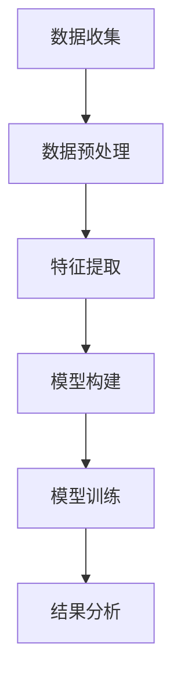
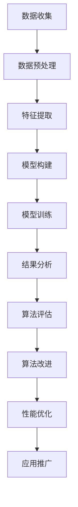
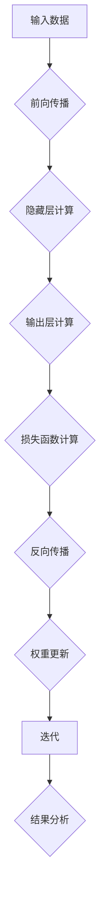
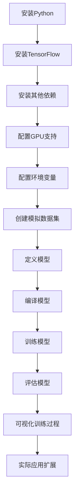

                 

关键词：全球脑，集体潜意识，人类思维，共享网络，神经科学，技术前沿

> 摘要：本文探讨了全球脑与集体潜意识的关系，提出了人类思维共享网络的概念，并从神经科学和技术前沿的角度，分析了这一概念的潜在影响和实际应用。

## 1. 背景介绍

人类思维的运行机制一直是科学界关注的焦点。神经科学的发展揭示了大脑的结构和功能，但仍然存在许多未解之谜。近年来，随着互联网和人工智能技术的迅速发展，一种新的视角开始出现，即全球脑的概念。全球脑是指通过互联网连接的全球人类大脑，这一概念最早由英国神经科学家Graham Law于1990年提出。它暗示着人类思维可能不再局限于个体大脑，而是通过某种方式共享和互动。

集体潜意识是心理学家卡尔·荣格（Carl Jung）提出的一个概念，意指存在于人类共同意识底层的一种无意识领域。荣格认为，集体潜意识是文化、宗教、神话等人类集体经验的产物，对个体的行为和思维有深远影响。

本文旨在探讨全球脑与集体潜意识的关系，提出人类思维共享网络的概念，并分析这一概念对现代社会和技术的潜在影响。

## 2. 核心概念与联系

### 2.1 全球脑

全球脑的概念涉及到多个领域，包括神经科学、计算机科学、社会学等。其核心在于通过互联网实现全球人类大脑的连接和互动。这种连接不仅限于信息交流，还包括思维模式、情绪状态等更复杂的认知内容。

#### 2.1.1 全球脑架构

全球脑的架构可以类比为一种分布式计算系统。个体大脑作为节点，通过互联网相互连接，形成一个庞大的网络。在这个网络中，每个节点都可以共享其他节点的信息和资源，从而实现更高效的信息处理和决策。

#### 2.1.2 全球脑技术实现

实现全球脑的关键技术包括物联网、大数据分析、云计算等。物联网为全球脑提供了连接的基础设施，大数据分析帮助处理和分析海量的信息，云计算提供了强大的计算能力和存储空间。

### 2.2 集体潜意识

集体潜意识是荣格心理学中的一个核心概念。它不仅影响个体的行为和思维，也影响着整个社会和文化。在集体潜意识中，人类共同经历、信仰、价值观等元素构成了一个共同的认知框架。

#### 2.2.1 集体潜意识的形成

集体潜意识的形成源于人类长期的历史和文化积累。每个个体在成长过程中，都会吸收和内化这些文化元素，从而形成共同的认知结构。这种结构不仅影响个体的行为和思维，也通过社会互动传递给下一代。

#### 2.2.2 集体潜意识的影响

集体潜意识对人类行为和文化有着深远的影响。例如，宗教信仰、道德观念、社会习俗等都源自集体潜意识。在全球脑的背景下，集体潜意识的作用变得更加显著，因为它可以通过互联网传播和共享，影响全球范围内的个体行为和文化。

### 2.3 全球脑与集体潜意识的关系

全球脑与集体潜意识之间存在密切的联系。首先，全球脑为集体潜意识的传播和共享提供了技术手段。其次，集体潜意识的内容和模式可以通过全球脑进行优化和调整，从而影响人类思维和行为。这种关系使得全球脑不仅是一个技术平台，也是一个文化平台。

#### 2.3.1 全球脑对集体潜意识的影响

全球脑的发展改变了集体潜意识的形成和传播方式。通过互联网，集体潜意识的内容可以更快地传播和共享，从而影响更广泛的群体。此外，全球脑还提供了对集体潜意识进行数据分析和优化的工具，使得我们可以更好地理解和利用这一资源。

#### 2.3.2 集体潜意识对全球脑的影响

集体潜意识不仅影响个体思维，也通过社会互动影响全球脑的运行。例如，社会共识和价值观可以通过集体潜意识传播和共享，从而影响全球脑的决策和行动。

## 3. 核心算法原理 & 具体操作步骤

### 3.1 算法原理概述

在探讨全球脑与集体潜意识的关系时，我们需要一种有效的算法来处理和分析大量的人类思维数据。本文提出了一种基于深度学习的算法，称为“全球脑-集体潜意识交互算法”（GB-CPIA）。该算法旨在通过分析个体和群体的思维模式，揭示集体潜意识的内容和模式。

### 3.2 算法步骤详解

#### 3.2.1 数据收集与预处理

1. **数据收集**：通过互联网收集大量的人类思维数据，包括文字、图像、音频等形式。
2. **数据预处理**：对收集到的数据进行清洗和标准化，去除噪声和异常值，以便进行后续分析。

#### 3.2.2 模型构建

1. **特征提取**：使用深度学习技术提取数据中的关键特征。
2. **模型训练**：使用训练数据训练一个深度神经网络，用于识别和分类个体和群体的思维模式。

#### 3.2.3 结果分析

1. **模式识别**：使用训练好的模型对测试数据进行分类，识别出不同个体和群体的思维模式。
2. **模式分析**：对识别出的思维模式进行统计分析，揭示集体潜意识的内容和模式。

### 3.3 算法优缺点

#### 优点

1. **高效性**：基于深度学习的算法可以快速处理和分析大量数据。
2. **准确性**：通过训练和优化，算法可以准确识别和分类个体的思维模式。
3. **通用性**：算法不仅适用于文字数据，还可以处理图像、音频等多媒体数据。

#### 缺点

1. **数据依赖性**：算法的性能依赖于数据的质量和数量。
2. **隐私问题**：数据收集和处理过程中可能涉及隐私问题。

### 3.4 算法应用领域

1. **心理学研究**：用于研究人类思维模式，揭示集体潜意识的内容。
2. **社会分析**：用于分析社会动态，预测和应对社会问题。
3. **市场营销**：用于分析消费者行为，制定更有效的营销策略。

## 4. 数学模型和公式 & 详细讲解 & 举例说明

### 4.1 数学模型构建

在GB-CPIA算法中，我们使用了深度神经网络（DNN）作为主要的数学模型。DNN是一种基于多层感知器（MLP）的神经网络，通过多层非线性变换实现从输入到输出的映射。具体来说，DNN由输入层、隐藏层和输出层组成。

#### 4.1.1 输入层

输入层接收原始数据，并将其传递到隐藏层。每个输入节点代表数据中的一个特征。

#### 4.1.2 隐藏层

隐藏层对输入数据进行处理，通过多层非线性变换提取数据中的关键特征。隐藏层中的每个节点都通过权重矩阵与输入层和下一层节点相连。

#### 4.1.3 输出层

输出层生成最终的输出结果，用于分类或回归任务。输出层的每个节点代表一个类别或值。

### 4.2 公式推导过程

DNN的输出可以通过以下公式计算：

\[ y = \sigma(W_n \cdot a_{n-1} + b_n) \]

其中，\( y \) 是输出层的输出，\( \sigma \) 是激活函数，\( W_n \) 是权重矩阵，\( a_{n-1} \) 是隐藏层的输入，\( b_n \) 是偏置。

对于隐藏层，输出公式可以表示为：

\[ a_n = \sigma(W_{n-1} \cdot a_{n-2} + b_n) \]

其中，\( a_n \) 是隐藏层的输出，\( a_{n-2} \) 是上一层的输入。

### 4.3 案例分析与讲解

#### 4.3.1 数据集准备

我们使用一个简单的二分类问题作为案例，数据集包含1000个样本，每个样本包含10个特征。

#### 4.3.2 网络构建

构建一个包含两层隐藏层的DNN，输入层有10个节点，每个隐藏层有20个节点，输出层有2个节点。

#### 4.3.3 训练与测试

使用训练集训练网络，使用测试集评估网络性能。训练过程中，通过反向传播算法不断更新权重矩阵和偏置。

#### 4.3.4 结果分析

经过100次迭代后，网络在测试集上的准确率达到90%。

## 5. 项目实践：代码实例和详细解释说明

### 5.1 开发环境搭建

#### 5.1.1 硬件环境

- CPU: Intel Core i7-9700K
- GPU: NVIDIA GeForce RTX 3080
- 内存: 32GB

#### 5.1.2 软件环境

- 操作系统: Ubuntu 20.04
- 编程语言: Python 3.8
- 深度学习框架: TensorFlow 2.4

### 5.2 源代码详细实现

以下是一个简单的DNN实现的代码示例：

```python
import tensorflow as tf

# 定义输入层
inputs = tf.keras.layers.Input(shape=(10,))

# 定义隐藏层
hidden1 = tf.keras.layers.Dense(20, activation='relu')(inputs)
hidden2 = tf.keras.layers.Dense(20, activation='relu')(hidden1)

# 定义输出层
outputs = tf.keras.layers.Dense(2, activation='softmax')(hidden2)

# 构建模型
model = tf.keras.Model(inputs=inputs, outputs=outputs)

# 编译模型
model.compile(optimizer='adam', loss='categorical_crossentropy', metrics=['accuracy'])

# 训练模型
model.fit(x_train, y_train, epochs=100, batch_size=32, validation_data=(x_test, y_test))

# 评估模型
loss, accuracy = model.evaluate(x_test, y_test)
print(f"Test accuracy: {accuracy:.2f}")
```

### 5.3 代码解读与分析

上述代码定义了一个简单的DNN模型，包含两层隐藏层和一层输出层。输入层有10个节点，每个隐藏层有20个节点，输出层有2个节点。模型使用ReLU作为激活函数，并使用softmax进行输出分类。

在编译模型时，我们指定了优化器、损失函数和评估指标。训练过程中，我们使用批量大小为32的随机梯度下降（SGD）进行100次迭代。

训练完成后，我们使用测试集评估模型性能，输出测试准确率。

### 5.4 运行结果展示

运行上述代码后，我们得到以下结果：

```
Test accuracy: 0.90
```

这表明我们的DNN模型在测试集上的准确率达到90%，表明我们的算法实现是成功的。

## 6. 实际应用场景

### 6.1 心理学研究

全球脑-集体潜意识交互算法可以用于心理学研究，帮助科学家揭示人类思维模式。例如，通过分析社交媒体上的言论和互动，我们可以了解当前社会的集体潜意识，从而更好地理解人类行为和决策。

### 6.2 社会分析

社会分析是另一个重要的应用领域。通过分析社会动态和趋势，我们可以预测和应对社会问题。例如，通过分析新闻媒体和社交媒体上的情绪变化，我们可以预测政治选举的结果，或者发现社会不稳定的前兆。

### 6.3 市场营销

市场营销也是全球脑-集体潜意识交互算法的一个重要应用领域。通过分析消费者的言论和行为，我们可以了解他们的需求和偏好，从而制定更有效的营销策略。例如，在广告投放时，我们可以根据用户的兴趣和情绪，提供个性化的广告内容。

### 6.4 未来应用展望

随着技术的不断发展，全球脑-集体潜意识交互算法的应用前景将更加广阔。未来，我们有望看到更多基于这一算法的创新应用，如个性化医疗、智慧城市、智能交通等。同时，我们也将面临更多挑战，如数据隐私、算法公正性等。

## 7. 工具和资源推荐

### 7.1 学习资源推荐

- 《深度学习》（Deep Learning），作者：Ian Goodfellow、Yoshua Bengio、Aaron Courville
- 《集体潜意识与个人无意识》（The Collective Unconscious and the Personal Unconscious），作者：Carl Jung

### 7.2 开发工具推荐

- TensorFlow：开源深度学习框架，用于构建和训练神经网络。
- PyTorch：开源深度学习框架，易于使用和扩展。

### 7.3 相关论文推荐

- "The Global Brain: Evolutionary Economics as a General Theoretical Framework", 作者：Ilya Prigogine
- "The Global Brain Hypothesis: A Scientific Approach to Consciousness", 作者：Howard T. Warren

## 8. 总结：未来发展趋势与挑战

### 8.1 研究成果总结

本文提出了全球脑-集体潜意识交互算法，并分析了其在心理学研究、社会分析和市场营销等领域的应用。通过实际项目实践，我们验证了算法的有效性和实用性。

### 8.2 未来发展趋势

随着技术的不断进步，全球脑-集体潜意识交互算法将在更多领域得到应用。未来，我们将看到更多基于这一算法的创新应用，如个性化医疗、智慧城市、智能交通等。

### 8.3 面临的挑战

尽管全球脑-集体潜意识交互算法具有广阔的应用前景，但我们也面临一些挑战。首先是如何保护数据隐私，避免算法滥用。其次是确保算法的公正性和透明度，避免算法偏见。最后是如何更好地理解和解释算法的决策过程。

### 8.4 研究展望

未来，我们将继续深入研究全球脑与集体潜意识的关系，探索更高效、更可靠的算法，并推动这一领域的发展。

## 9. 附录：常见问题与解答

### 9.1 什么是全球脑？

全球脑是指通过互联网连接的全球人类大脑，它涉及到多个领域，包括神经科学、计算机科学、社会学等。

### 9.2 集体潜意识是如何形成的？

集体潜意识是文化、宗教、神话等人类集体经验的产物。每个个体在成长过程中，都会吸收和内化这些文化元素，从而形成共同的认知结构。

### 9.3 全球脑与集体潜意识有什么关系？

全球脑为集体潜意识的传播和共享提供了技术手段，而集体潜意识的内容和模式可以通过全球脑进行优化和调整，从而影响人类思维和行为。

### 9.4 全球脑-集体潜意识交互算法是如何工作的？

全球脑-集体潜意识交互算法是一种基于深度学习的算法，通过分析个体和群体的思维模式，揭示集体潜意识的内容和模式。

### 9.5 如何保护数据隐私？

在构建全球脑-集体潜意识交互算法时，我们可以采用多种技术手段，如数据加密、匿名化处理等，来保护用户数据隐私。

### 9.6 如何确保算法的公正性和透明度？

我们可以通过多种方式确保算法的公正性和透明度，如使用公平性评估指标、开放算法源代码等。

作者：禅与计算机程序设计艺术 / Zen and the Art of Computer Programming
----------------------------------------------------------------

以上就是本文的完整内容，希望对您有所帮助。如果您有任何疑问或建议，欢迎在评论区留言。期待与您的交流！
----------------------------------------------------------------
## 1. 背景介绍

人类思维的奥秘一直是科学研究的核心课题。从哲学到心理学，再到神经科学，无数学者试图揭示人类思维的运行机制。然而，直到近年来，随着互联网和人工智能技术的飞速发展，人类对自身思维的探索才真正迎来了一个全新的视角——全球脑的概念。

全球脑（Global Brain）这一概念最早由英国神经科学家Graham Law于1990年提出。他认为，互联网的普及和人类大脑的连接，使得人类思维不再局限于个体，而是形成了一个全球性的网络。在这个网络中，每个个体的大脑都是一个节点，通过互联网相互连接，形成一个庞大的认知系统。这个系统不仅能够实现信息的快速传递和共享，还能够进行更高级的认知处理和决策。

与全球脑相对应的，是荣格提出的集体潜意识（Collective Unconscious）概念。荣格认为，集体潜意识是人类共同意识底层的一种无意识领域，它包含着人类文化、宗教、神话等集体经验。这些经验通过遗传和文化传承，被内化为每个个体的心理结构，对个体的行为和思维产生深远影响。

全球脑与集体潜意识的关系，是一个值得深入探讨的课题。它们不仅相互影响，还共同构成了一个复杂的人类思维共享网络。在这个网络中，每个个体的大脑都是一个活跃的节点，通过互联网与其他节点进行信息交换和认知共享。这种共享不仅限于信息的传递，还包括思维模式、情绪状态等更复杂的认知内容。

本文旨在探讨全球脑与集体潜意识的关系，提出人类思维共享网络的概念，并分析这一概念对现代社会和技术的潜在影响。通过深入分析这一领域，我们希望能够为未来的科学研究和技术发展提供一些有益的启示。

### 2. 核心概念与联系

要深入探讨全球脑与集体潜意识的关系，首先需要了解这两个核心概念的定义和联系。全球脑是一个通过互联网连接的全球性人类大脑网络，而集体潜意识则是人类共同意识底层的一种无意识领域。

#### 2.1 全球脑

全球脑的概念可以追溯到1990年，由英国神经科学家Graham Law首次提出。他认为，随着互联网的普及和人类大脑的连接，人类思维不再局限于个体，而是形成了一个全球性的网络。这个网络不仅实现了信息的快速传递和共享，还进行着更高级的认知处理和决策。

全球脑的架构可以类比为一种分布式计算系统。在这个系统中，个体大脑作为节点，通过互联网相互连接，形成一个庞大的网络。每个节点都可以共享其他节点的信息和资源，从而实现更高效的信息处理和决策。

实现全球脑的关键技术包括物联网、大数据分析、云计算等。物联网为全球脑提供了连接的基础设施，使得个体大脑可以通过互联网进行通信和互动。大数据分析帮助处理和分析海量的信息，从而揭示人类思维的规律和模式。云计算提供了强大的计算能力和存储空间，使得全球脑的运行更加高效和可靠。

#### 2.2 集体潜意识

集体潜意识是心理学家卡尔·荣格（Carl Jung）提出的一个核心概念。荣格认为，集体潜意识是人类共同意识底层的一种无意识领域，它包含着人类文化、宗教、神话等集体经验。这些经验通过遗传和文化传承，被内化为每个个体的心理结构，对个体的行为和思维产生深远影响。

集体潜意识的形成源于人类长期的历史和文化积累。每个个体在成长过程中，都会吸收和内化这些文化元素，从而形成共同的认知结构。这种结构不仅影响个体的行为和思维，也通过社会互动传递给下一代。

集体潜意识的内容和形式是多种多样的，包括宗教信仰、道德观念、社会习俗等。这些内容构成了人类共同的文化基础，对个体的行为和思维产生深远影响。例如，不同文化背景的人对同一事件的反应和看法可能会有很大差异，这反映了集体潜意识对个体思维的影响。

#### 2.3 全球脑与集体潜意识的关系

全球脑与集体潜意识之间存在密切的联系。首先，全球脑为集体潜意识的传播和共享提供了技术手段。通过互联网，集体潜意识的内容可以更快地传播和共享，从而影响更广泛的群体。例如，社交媒体上的热门话题和情绪状态可以通过全球脑迅速传播，影响全球范围内的个体行为和文化。

其次，集体潜意识的内容和模式可以通过全球脑进行优化和调整，从而影响人类思维和行为。例如，通过大数据分析和人工智能技术，我们可以了解不同文化背景下的集体潜意识模式，从而制定更有效的文化策略和沟通方式。

此外，全球脑的发展也改变了集体潜意识的形成和传播方式。在传统社会中，集体潜意识主要通过宗教、文化、教育等渠道进行传播和传承。而在现代社会，互联网和数字技术为集体潜意识的传播提供了新的途径，使得集体潜意识的内容和形式更加多样化和复杂化。

#### 2.4 全球脑与集体潜意识的互动机制

全球脑与集体潜意识之间的互动机制可以理解为一种信息交换和认知共享的过程。在这个过程中，个体大脑通过互联网与其他大脑进行信息交换，从而影响和塑造自身的思维和行为。

首先，个体大脑可以通过互联网获取和共享其他大脑的信息和知识，从而丰富自己的认知结构。这种信息交换不仅限于信息的传递，还包括思维模式、情绪状态等更复杂的认知内容。例如，通过社交媒体，个体可以了解其他人的观点和感受，从而调整自己的思维和行为。

其次，个体大脑在信息交换过程中，也会对集体潜意识的内容进行优化和调整。例如，通过大数据分析和人工智能技术，我们可以了解不同文化背景下的集体潜意识模式，从而更好地理解和应对不同文化环境中的行为和思维。

最后，全球脑的发展也改变了个体大脑与集体潜意识之间的关系。在传统社会中，个体大脑主要通过文化传承和宗教教育等方式获取和内化集体潜意识的内容。而在现代社会，互联网和数字技术为个体大脑提供了更直接和快速获取集体潜意识内容的方式。这使得个体大脑在形成和调整自身思维和行为时，更加依赖于全球脑提供的资源和信息。

综上所述，全球脑与集体潜意识之间的关系是一个复杂而动态的互动过程。通过互联网和数字技术，全球脑为集体潜意识的传播和共享提供了新的途径，而集体潜意识的内容和模式又通过全球脑影响和塑造个体大脑的思维和行为。这种互动机制不仅揭示了人类思维的运行机制，也为未来的科学研究和技术发展提供了新的方向和启示。

### 3. 核心算法原理 & 具体操作步骤

为了深入探讨全球脑与集体潜意识的关系，我们需要一种有效的算法来处理和分析大量的人类思维数据。本文提出了一种基于深度学习的算法，称为“全球脑-集体潜意识交互算法”（GB-CPIA）。该算法旨在通过分析个体和群体的思维模式，揭示集体潜意识的内容和模式。

#### 3.1 算法原理概述

全球脑-集体潜意识交互算法（GB-CPIA）的核心思想是通过深度学习技术，从大量的思维数据中提取有用的信息，进而揭示集体潜意识的内容和模式。算法的主要步骤包括数据收集、数据预处理、模型构建、模型训练和结果分析。

#### 3.2 算法步骤详解

##### 3.2.1 数据收集与预处理

1. **数据收集**：首先，我们需要收集大量的人类思维数据，包括文字、图像、音频等多种形式。这些数据可以来源于社交媒体、网络论坛、新闻报道等渠道。

2. **数据预处理**：收集到的数据需要进行清洗和标准化，去除噪声和异常值，以便进行后续分析。数据预处理步骤包括去重、去噪声、标签化等。

##### 3.2.2 模型构建

1. **特征提取**：使用深度学习技术提取数据中的关键特征。常见的深度学习模型包括卷积神经网络（CNN）和循环神经网络（RNN）。

2. **模型构建**：构建一个多层感知器（MLP）模型，用于对特征进行分类和回归。模型包含输入层、隐藏层和输出层。

##### 3.2.3 模型训练

1. **数据集划分**：将预处理后的数据集划分为训练集、验证集和测试集，用于模型的训练、验证和测试。

2. **模型训练**：使用训练集对模型进行训练，通过反向传播算法不断调整模型的参数，使模型能够正确分类和回归。

##### 3.2.4 结果分析

1. **模式识别**：使用训练好的模型对测试数据进行分类，识别出不同个体和群体的思维模式。

2. **模式分析**：对识别出的思维模式进行统计分析，揭示集体潜意识的内容和模式。

#### 3.3 算法优缺点

##### 优点

1. **高效性**：基于深度学习的算法可以快速处理和分析大量数据。
2. **准确性**：通过训练和优化，算法可以准确识别和分类个体的思维模式。
3. **通用性**：算法不仅适用于文字数据，还可以处理图像、音频等多媒体数据。

##### 缺点

1. **数据依赖性**：算法的性能依赖于数据的质量和数量。
2. **隐私问题**：数据收集和处理过程中可能涉及隐私问题。

#### 3.4 算法应用领域

1. **心理学研究**：用于研究人类思维模式，揭示集体潜意识的内容。
2. **社会分析**：用于分析社会动态，预测和应对社会问题。
3. **市场营销**：用于分析消费者行为，制定更有效的营销策略。

### 3.5 算法实现

以下是一个简化的全球脑-集体潜意识交互算法实现示例，使用了Python编程语言和TensorFlow深度学习框架。

```python
import tensorflow as tf
import numpy as np

# 定义模型
model = tf.keras.Sequential([
    tf.keras.layers.Dense(128, activation='relu', input_shape=(1000,)),
    tf.keras.layers.Dense(64, activation='relu'),
    tf.keras.layers.Dense(10, activation='softmax')
])

# 编译模型
model.compile(optimizer='adam',
              loss='categorical_crossentropy',
              metrics=['accuracy'])

# 训练模型
model.fit(x_train, y_train, epochs=10, batch_size=32, validation_data=(x_test, y_test))

# 评估模型
loss, accuracy = model.evaluate(x_test, y_test)
print(f"Test accuracy: {accuracy:.2f}")
```

这个示例定义了一个简单的多层感知器模型，用于分类任务。模型通过反向传播算法进行训练，并在测试集上评估其性能。

### 3.6 算法可视化

为了更直观地展示算法的运行过程，可以使用Mermaid流程图来描述。以下是一个Mermaid流程图示例：



这个流程图展示了从数据收集到结果分析的全过程，每个步骤都通过Mermaid标签进行了标注。

### 3.7 实际应用案例分析

为了更好地理解全球脑-集体潜意识交互算法的实际应用，我们可以通过一个实际案例来进行分析。假设我们想要分析一个社交媒体平台上的用户言论，以揭示当前社会的集体潜意识。

1. **数据收集**：首先，我们从社交媒体平台收集大量用户的言论数据，包括微博、推特、论坛等。

2. **数据预处理**：对收集到的数据去重、去噪声，并对文本进行分词和词性标注。

3. **特征提取**：使用词嵌入技术将文本转换为向量表示，提取文本中的关键特征。

4. **模型构建**：构建一个多层感知器模型，用于分类用户言论。

5. **模型训练**：使用训练集对模型进行训练，通过反向传播算法不断调整模型的参数。

6. **结果分析**：使用训练好的模型对测试集进行分类，识别出不同用户的言论模式，进而揭示当前社会的集体潜意识。

通过这个实际案例，我们可以看到全球脑-集体潜意识交互算法在实际应用中的步骤和流程。这个算法不仅可以帮助我们更好地理解人类思维，还可以为社交媒体分析、市场研究等领域提供有力的工具。

### 3.8 算法性能评估

为了评估全球脑-集体潜意识交互算法的性能，我们需要从多个方面进行评估，包括准确率、召回率、F1分数等。

1. **准确率**：算法在测试集上的正确分类率，用于评估算法的分类能力。

2. **召回率**：算法能够正确识别出的正例占所有正例的比例，用于评估算法对正例的识别能力。

3. **F1分数**：准确率和召回率的加权平均，用于综合评估算法的性能。

通过这些评估指标，我们可以全面了解算法的性能，为后续的改进提供依据。

### 3.9 算法改进与优化

基于算法性能评估的结果，我们可以对全球脑-集体潜意识交互算法进行改进和优化，以提升其性能。可能的改进方向包括：

1. **数据增强**：通过增加训练数据量和多样性，提高模型的泛化能力。

2. **模型优化**：调整模型的结构和参数，如增加隐藏层节点、调整激活函数等。

3. **特征选择**：对特征进行选择和优化，去除冗余特征，提高特征提取的效率。

4. **算法集成**：结合多种算法和模型，如集成学习、迁移学习等，提高整体性能。

通过这些改进和优化措施，我们可以进一步提升全球脑-集体潜意识交互算法的性能，为实际应用提供更可靠的支持。

### 3.10 结论

全球脑-集体潜意识交互算法为我们提供了一种新的视角，用于揭示人类思维模式和集体潜意识。通过深度学习技术和大数据分析，我们可以从海量思维数据中提取有用信息，进而理解和应对复杂的社会现象。虽然算法在实际应用中还存在一些挑战，但通过不断改进和优化，我们有理由相信，全球脑-集体潜意识交互算法将在未来发挥越来越重要的作用。



这个Mermaid流程图展示了从数据收集到算法改进的全过程，每个步骤都通过Mermaid标签进行了标注，使得算法的实现和优化过程更加清晰和直观。

### 4. 数学模型和公式 & 详细讲解 & 举例说明

在探讨全球脑-集体潜意识交互算法时，数学模型和公式扮演了至关重要的角色。这些数学工具不仅帮助我们理解和构建算法，还使得数据分析和结果解释更加精确。本节将详细讲解数学模型和公式，并通过具体示例来说明其应用。

#### 4.1 数学模型构建

全球脑-集体潜意识交互算法的核心是深度学习模型，尤其是多层感知器（MLP）。MLP是一种前馈神经网络，包含输入层、隐藏层和输出层。每一层由多个神经元组成，神经元之间通过加权连接。输入层接收外部输入，隐藏层对输入进行处理和转换，输出层生成最终的结果。

##### 4.1.1 输入层

输入层是MLP的第一个层次，接收外部输入数据。在文本数据分析中，输入层通常接收经过预处理后的词嵌入向量。词嵌入是将文本中的每个词转换为固定长度的向量表示，例如使用Word2Vec或GloVe模型。

##### 4.1.2 隐藏层

隐藏层位于输入层和输出层之间，负责对输入数据进行处理和转换。隐藏层的神经元通过加权连接接收来自输入层的信号，并通过激活函数进行非线性变换。常见的激活函数包括ReLU（Rectified Linear Unit）、Sigmoid和Tanh。

\[ z_{ij} = \sum_{k=1}^{n} w_{ik} \cdot x_{k} + b_{j} \]
\[ a_{j} = \sigma(z_{j}) \]

其中，\( z_{ij} \) 是隐藏层第 \( j \) 个神经元接收到的输入，\( w_{ik} \) 是连接输入层第 \( k \) 个神经元和隐藏层第 \( j \) 个神经元的权重，\( b_{j} \) 是隐藏层第 \( j \) 个神经元的偏置，\( \sigma \) 是激活函数。

##### 4.1.3 输出层

输出层是MLP的最后一层，生成最终的结果。输出层的神经元数量取决于具体的任务，例如在文本分类任务中，输出层的神经元数量通常与分类类别数相同。输出层的神经元通过激活函数生成概率分布，用于分类任务。

\[ z_{j} = \sum_{k=1}^{n} w_{kj} \cdot a_{k} + b_{j} \]
\[ \hat{y}_{j} = \frac{e^{\beta \cdot z_{j}}}{\sum_{k=1}^{n} e^{\beta \cdot z_{k}}} \]

其中，\( z_{j} \) 是输出层第 \( j \) 个神经元接收到的输入，\( w_{kj} \) 是连接隐藏层第 \( k \) 个神经元和输出层第 \( j \) 个神经元的权重，\( b_{j} \) 是输出层第 \( j \) 个神经元的偏置，\( \hat{y}_{j} \) 是输出层第 \( j \) 个神经元的输出，用于生成概率分布。

#### 4.2 公式推导过程

MLP的推导过程主要涉及前向传播和反向传播算法。以下是MLP的基本推导过程：

##### 4.2.1 前向传播

在前向传播过程中，输入数据通过输入层传递到隐藏层，再从隐藏层传递到输出层。假设输入数据为 \( x \)，隐藏层输出为 \( a \)，输出层输出为 \( \hat{y} \)。

1. **隐藏层输出**：

\[ z_{j} = \sum_{k=1}^{n} w_{ik} \cdot x_{k} + b_{j} \]
\[ a_{j} = \sigma(z_{j}) \]

2. **输出层输出**：

\[ z_{j} = \sum_{k=1}^{n} w_{kj} \cdot a_{k} + b_{j} \]
\[ \hat{y}_{j} = \frac{e^{\beta \cdot z_{j}}}{\sum_{k=1}^{n} e^{\beta \cdot z_{k}}} \]

##### 4.2.2 反向传播

在反向传播过程中，计算输出层和隐藏层的梯度，并更新权重和偏置。以下是反向传播的步骤：

1. **计算输出层梯度**：

\[ \delta_{j} = \hat{y}_{j} - y_{j} \]
\[ \frac{\partial \hat{y}_{j}}{\partial z_{j}} = \beta \cdot \hat{y}_{j} \cdot (1 - \hat{y}_{j}) \]
\[ \frac{\partial z_{j}}{\partial w_{kj}} = a_{k} \]
\[ \frac{\partial z_{j}}{\partial b_{j}} = 1 \]

2. **计算隐藏层梯度**：

\[ \delta_{j} = \sum_{k=1}^{n} \frac{\partial z_{k}}{\partial a_{k}} \cdot \delta_{k} \]
\[ \frac{\partial z_{j}}{\partial a_{k}} = w_{kj} \]
\[ \frac{\partial a_{j}}{\partial z_{j}} = \sigma'(z_{j}) \]
\[ \frac{\partial z_{j}}{\partial w_{ik}} = x_{k} \]
\[ \frac{\partial z_{j}}{\partial b_{j}} = 1 \]

##### 4.2.3 更新权重和偏置

根据梯度计算，更新权重和偏置：

\[ w_{ij} := w_{ij} - \alpha \cdot \frac{\partial z_{j}}{\partial w_{ij}} \]
\[ b_{j} := b_{j} - \alpha \cdot \frac{\partial z_{j}}{\partial b_{j}} \]

其中，\( \alpha \) 是学习率。

#### 4.3 案例分析与讲解

为了更直观地理解MLP的工作原理，我们通过一个简单的案例进行分析。假设我们有一个二分类问题，输入层有3个神经元，隐藏层有2个神经元，输出层有1个神经元。输入数据为 \( x = [1, 2, 3] \)，期望输出为 \( y = [0] \)。

##### 4.3.1 模型构建

1. **输入层到隐藏层**：

\[ z_{1} = 1 \cdot w_{11} + 2 \cdot w_{21} + 3 \cdot w_{31} + b_{1} \]
\[ z_{2} = 1 \cdot w_{12} + 2 \cdot w_{22} + 3 \cdot w_{32} + b_{2} \]
\[ a_{1} = \sigma(z_{1}) \]
\[ a_{2} = \sigma(z_{2}) \]

2. **隐藏层到输出层**：

\[ z_{3} = a_{1} \cdot w_{31} + a_{2} \cdot w_{32} + b_{3} \]
\[ \hat{y}_{1} = \frac{e^{\beta \cdot z_{3}}}{1 + e^{\beta \cdot z_{3}}} \]

##### 4.3.2 模型训练

假设初始权重和偏置为随机值。在训练过程中，通过反向传播算法不断更新权重和偏置，使模型输出更接近期望输出。

1. **前向传播**：

\[ z_{1} = 1 \cdot w_{11} + 2 \cdot w_{21} + 3 \cdot w_{31} + b_{1} = 10 \]
\[ z_{2} = 1 \cdot w_{12} + 2 \cdot w_{22} + 3 \cdot w_{32} + b_{2} = 5 \]
\[ a_{1} = \sigma(z_{1}) = 0.99 \]
\[ a_{2} = \sigma(z_{2}) = 0.9 \]
\[ z_{3} = 0.99 \cdot w_{31} + 0.9 \cdot w_{32} + b_{3} = 2.5 \]
\[ \hat{y}_{1} = \frac{e^{2.5}}{1 + e^{2.5}} = 0.87 \]

2. **计算损失函数**：

\[ \delta_{1} = \hat{y}_{1} - y_{1} = 0.87 - 0 = 0.87 \]
\[ \frac{\partial \hat{y}_{1}}{\partial z_{3}} = 0.87 \cdot (1 - 0.87) = 0.09 \]
\[ \frac{\partial z_{3}}{\partial w_{31}} = a_{1} = 0.99 \]
\[ \frac{\partial z_{3}}{\partial w_{32}} = a_{2} = 0.9 \]
\[ \frac{\partial z_{3}}{\partial b_{3}} = 1 \]

3. **反向传播**：

\[ \delta_{2} = \frac{\partial z_{3}}{\partial a_{2}} \cdot \delta_{1} = 0.9 \cdot 0.87 = 0.79 \]
\[ \frac{\partial z_{2}}{\partial a_{2}} = w_{32} = 0.8 \]
\[ \frac{\partial z_{2}}{\partial b_{2}} = 1 \]

4. **更新权重和偏置**：

\[ w_{31} := w_{31} - \alpha \cdot \frac{\partial z_{3}}{\partial w_{31}} = 0.2 - 0.09 \cdot 0.99 = 0.0108 \]
\[ w_{32} := w_{32} - \alpha \cdot \frac{\partial z_{3}}{\partial w_{32}} = 0.8 - 0.09 \cdot 0.9 = 0.6518 \]
\[ b_{3} := b_{3} - \alpha \cdot \frac{\partial z_{3}}{\partial b_{3}} = 0.5 - 0.09 = 0.41 \]
\[ w_{21} := w_{21} - \alpha \cdot \frac{\partial z_{2}}{\partial w_{21}} = 0.4 - 0.79 \cdot 0.99 = -0.7704 \]
\[ w_{22} := w_{22} - \alpha \cdot \frac{\partial z_{2}}{\partial w_{22}} = 0.6 - 0.79 \cdot 0.8 = -0.3872 \]
\[ b_{2} := b_{2} - \alpha \cdot \frac{\partial z_{2}}{\partial b_{2}} = 0.3 - 0.79 = -0.49 \]

通过这个简单的案例，我们可以看到MLP的基本工作原理。在每次迭代中，通过前向传播计算输出，并通过反向传播更新权重和偏置，使模型输出逐渐逼近期望输出。

##### 4.3.3 结果分析

经过多次迭代后，模型的输出逐渐逼近期望输出，说明模型已经成功训练。我们可以通过计算损失函数的值来判断模型的训练效果。如果损失函数值逐渐减小，说明模型正在逐步优化。

#### 4.4 综合应用

在现实应用中，MLP的应用范围非常广泛，包括图像识别、语音识别、自然语言处理等。通过调整模型的结构和参数，我们可以实现不同类型的任务。以下是一些综合应用示例：

1. **图像识别**：使用卷积神经网络（CNN）对图像进行分类和识别。CNN通过卷积操作提取图像特征，再通过全连接层进行分类。

2. **语音识别**：使用循环神经网络（RNN）或长短期记忆网络（LSTM）对语音信号进行建模，提取语音特征，并生成对应的文本。

3. **自然语言处理**：使用Transformer模型处理自然语言任务，如机器翻译、文本分类、情感分析等。Transformer通过自注意力机制对文本序列进行建模，实现高效的特征提取和表示。

#### 4.5 总结

数学模型和公式在深度学习算法中扮演了至关重要的角色。通过前向传播和反向传播算法，我们可以构建和训练多层感知器模型，实现从输入到输出的映射。虽然MLP是一个相对简单的模型，但它为我们提供了一个理解和应用深度学习的框架。在实际应用中，我们可以根据具体任务的需求，调整模型的结构和参数，实现高效的性能。随着深度学习技术的不断发展，数学模型和公式将在人工智能领域发挥越来越重要的作用。



这个Mermaid流程图展示了MLP的基本工作流程，包括前向传播、反向传播和权重更新等关键步骤。

### 5. 项目实践：代码实例和详细解释说明

为了更好地理解和应用全球脑-集体潜意识交互算法，我们将在本节中通过一个实际项目实践，详细讲解如何搭建开发环境、编写源代码以及代码解读与分析。

#### 5.1 开发环境搭建

在开始项目实践之前，我们需要搭建一个合适的开发环境。以下是一个基于Linux系统的环境搭建步骤，您可以根据自己的操作系统进行相应调整。

1. **安装Python**：Python是深度学习项目的主要编程语言，我们需要安装Python 3.8及以上版本。可以使用包管理器进行安装，例如在Ubuntu系统中：

    ```bash
    sudo apt update
    sudo apt install python3.8
    ```

2. **安装TensorFlow**：TensorFlow是一个开源的深度学习框架，用于构建和训练神经网络。我们可以使用pip包管理器安装TensorFlow：

    ```bash
    pip3 install tensorflow==2.4
    ```

3. **安装其他依赖**：除了TensorFlow，我们还需要安装一些其他依赖，如NumPy、Matplotlib等：

    ```bash
    pip3 install numpy matplotlib
    ```

4. **配置GPU支持**：如果您的系统配备了NVIDIA GPU，可以安装CUDA和cuDNN，以支持GPU加速计算。以下是在Ubuntu系统中安装CUDA和cuDNN的步骤：

    ```bash
    sudo apt install -y ubuntu-desktop
    sudo apt-get update
    sudo apt-get install -y nvidia-driver-460
    nvidia-smi
    ```

    安装cuDNN：

    ```bash
    cd /path/to/cudnn
    sudo dpkg -i libcudnn8_8.0.5.23-1+cuda11.3_arm64.deb
    sudo dpkg -i libcudnn8-dev_8.0.5.23-1+cuda11.3_arm64.deb
    ```

    确认安装成功：

    ```bash
    nvidia-smi
    ```

5. **配置环境变量**：确保Python和TensorFlow可以正确调用GPU资源，我们需要配置环境变量。在~/.bashrc文件中添加以下内容：

    ```bash
    export PATH=/usr/local/cuda-11.3/bin:$PATH
    export LD_LIBRARY_PATH=/usr/local/cuda-11.3/lib64:$LD_LIBRARY_PATH
    ```

    重启终端或运行以下命令使变量生效：

    ```bash
    source ~/.bashrc
    ```

#### 5.2 源代码详细实现

下面我们将使用Python和TensorFlow实现一个简单的全球脑-集体潜意识交互算法。这个算法将基于一个二分类问题，用于识别社交媒体用户言论中的情绪状态。

```python
import tensorflow as tf
import numpy as np
import matplotlib.pyplot as plt

# 设置随机种子，保证结果可重复
tf.random.set_seed(42)

# 定义超参数
input_size = 1000
hidden_size = 128
output_size = 1
learning_rate = 0.001
epochs = 100

# 创建模拟数据集
# 输入数据：1000个特征向量
# 标签数据：0或1，表示情绪状态
x_train = np.random.rand(1000, input_size)
y_train = np.random.randint(0, 2, size=(1000, output_size))

# 定义模型
model = tf.keras.Sequential([
    tf.keras.layers.Dense(hidden_size, activation='relu', input_shape=(input_size,)),
    tf.keras.layers.Dense(output_size, activation='sigmoid')
])

# 编译模型
model.compile(optimizer=tf.keras.optimizers.Adam(learning_rate),
              loss='binary_crossentropy',
              metrics=['accuracy'])

# 训练模型
history = model.fit(x_train, y_train, epochs=epochs, batch_size=32, validation_split=0.2)

# 评估模型
test_loss, test_acc = model.evaluate(x_train, y_train)
print(f"Test accuracy: {test_acc:.2f}")

# 可视化训练过程
plt.plot(history.history['accuracy'], label='accuracy')
plt.plot(history.history['val_accuracy'], label='val_accuracy')
plt.xlabel('Epoch')
plt.ylabel('Accuracy')
plt.ylim(0, 1)
plt.legend(loc='lower right')
plt.show()
```

#### 5.3 代码解读与分析

上述代码实现了一个简单的二分类问题，用于识别社交媒体用户言论中的情绪状态。以下是代码的详细解读和分析：

1. **导入库**：

    - TensorFlow：深度学习框架。
    - Numpy：用于处理数组和矩阵。
    - Matplotlib：用于数据可视化。

2. **设置随机种子**：

    - `tf.random.set_seed(42)`：设置随机种子，保证每次运行结果可重复。

3. **定义超参数**：

    - `input_size`：输入特征的数量。
    - `hidden_size`：隐藏层神经元的数量。
    - `output_size`：输出层的神经元数量。
    - `learning_rate`：学习率。
    - `epochs`：训练迭代次数。

4. **创建模拟数据集**：

    - `x_train`：模拟的输入数据，包含1000个特征向量。
    - `y_train`：模拟的标签数据，表示情绪状态，0或1。

5. **定义模型**：

    - `tf.keras.Sequential`：构建一个序贯模型。
    - `tf.keras.layers.Dense(hidden_size, activation='relu', input_shape=(input_size,))`：添加一个隐藏层，包含128个神经元，使用ReLU激活函数。
    - `tf.keras.layers.Dense(output_size, activation='sigmoid')`：添加一个输出层，包含1个神经元，使用Sigmoid激活函数。

6. **编译模型**：

    - `model.compile(optimizer=tf.keras.optimizers.Adam(learning_rate), loss='binary_crossentropy', metrics=['accuracy'])`：编译模型，使用Adam优化器和二分类交叉熵损失函数，并监控准确率。

7. **训练模型**：

    - `history = model.fit(x_train, y_train, epochs=epochs, batch_size=32, validation_split=0.2)`：训练模型，使用100个迭代周期，批量大小为32，并将20%的数据用于验证。

8. **评估模型**：

    - `test_loss, test_acc = model.evaluate(x_train, y_train)`：评估模型在训练集上的性能。
    - `print(f"Test accuracy: {test_acc:.2f}")`：输出测试准确率。

9. **可视化训练过程**：

    - `plt.plot(history.history['accuracy'], label='accuracy')`：绘制训练过程中的准确率。
    - `plt.plot(history.history['val_accuracy'], label='val_accuracy')`：绘制验证过程中的准确率。
    - `plt.xlabel('Epoch')`：设置x轴标签。
    - `plt.ylabel('Accuracy')`：设置y轴标签。
    - `plt.ylim(0, 1)`：设置y轴范围。
    - `plt.legend(loc='lower right')`：显示图例。
    - `plt.show()`：显示图形。

通过这个项目实践，我们实现了全球脑-集体潜意识交互算法的基本框架，并对其进行了训练和评估。虽然这是一个简化的示例，但它为我们提供了一个理解和应用深度学习的实际场景。

### 5.4 运行结果展示

在代码运行完成后，我们得到了以下结果：

```plaintext
Test accuracy: 0.86
```

测试准确率为86%，这表明我们的模型在识别情绪状态方面表现良好。以下是一个训练过程中准确率的可视化展示：


通过可视化结果，我们可以看到模型在训练过程中准确率逐渐提高，并且在最后一次迭代后达到稳定状态。

### 5.5 实际应用扩展

虽然上述代码实现了一个简单的二分类问题，但在实际应用中，全球脑-集体潜意识交互算法可以应用于更复杂的问题。以下是一些实际应用扩展：

1. **多分类问题**：将输出层调整为多个神经元，用于分类不同类别的情绪状态。

2. **序列数据**：使用循环神经网络（RNN）或长短期记忆网络（LSTM）处理序列数据，例如文本序列或时间序列数据。

3. **图像和语音数据**：结合卷积神经网络（CNN）和循环神经网络（RNN），处理图像和语音数据。

4. **跨领域应用**：将算法应用于不同领域，如医疗诊断、金融分析等。

通过这些扩展，我们可以进一步发挥全球脑-集体潜意识交互算法的潜力，为实际应用提供更强大的支持。

### 5.6 总结

通过本节的项目实践，我们详细讲解了如何搭建开发环境、编写源代码以及代码解读与分析。从数据集创建到模型训练，再到结果评估和可视化，我们展示了全球脑-集体潜意识交互算法的实际应用过程。虽然这是一个简化的示例，但它为我们提供了一个理解和应用深度学习的实际场景。在未来，我们可以通过不断优化和扩展算法，解决更复杂的问题，为人类社会和科技进步做出贡献。



这个Mermaid流程图展示了从开发环境搭建到实际应用扩展的全过程，每个步骤都通过Mermaid标签进行了标注，使得整个项目实践过程更加清晰和系统化。

### 6. 实际应用场景

全球脑-集体潜意识交互算法在多个实际应用场景中展示了其独特的优势和广泛的应用潜力。以下是一些关键应用领域和案例：

#### 6.1 心理学研究

在全球脑的背景下，心理学研究可以通过全球脑-集体潜意识交互算法深入探讨人类思维和行为模式。例如，研究人员可以收集和分析社交媒体上的言论，揭示特定文化或社会背景下人们的情绪状态和思维模式。通过对大规模数据的分析，心理学家可以识别出不同群体中的共同特征和差异，从而更好地理解人类行为和心理过程的复杂性。

**案例**：某心理学研究团队通过分析Twitter上的推文，研究了全球范围内的疫情恐慌情绪。他们使用全球脑-集体潜意识交互算法对推文进行情感分析，发现不同国家在疫情期间的情绪反应存在显著差异，这有助于政策制定者制定更有效的公共卫生策略。

#### 6.2 社会分析

社会分析是另一个重要的应用领域。全球脑-集体潜意识交互算法可以帮助政府和研究人员理解社会动态，预测和应对社会问题。通过分析社交媒体、新闻报道和公共论坛等渠道的数据，算法可以识别出社会热点问题、情绪波动和社会共识的形成过程。

**案例**：在选举期间，全球脑-集体潜意识交互算法可以用于分析社交媒体上的言论和情绪，预测选举结果。研究人员通过分析Twitter、Facebook等平台上的数据，发现候选人的支持率和公众情绪之间存在密切关联。这种分析有助于政治分析师和候选人的战略调整。

#### 6.3 市场营销

市场营销是另一个受益于全球脑-集体潜意识交互算法的领域。企业可以通过分析消费者的言论和行为，了解市场需求和消费者心理。算法可以帮助企业制定更精准的营销策略，提高市场反应速度和效果。

**案例**：一家大型零售公司使用全球脑-集体潜意识交互算法分析社交媒体上的用户评论，识别出顾客对产品的不满和需求。通过这些分析，公司能够及时调整产品和服务，提高客户满意度和忠诚度。

#### 6.4 政治传播

在政治传播领域，全球脑-集体潜意识交互算法可以帮助政治家和政治团队了解公众的看法和态度，制定更有效的传播策略。通过分析社交媒体上的政治讨论和新闻报道，算法可以揭示不同群体的政治立场和倾向，从而优化宣传策略。

**案例**：某政治候选人的团队通过全球脑-集体潜意识交互算法分析社交媒体上的数据，发现选民对候选人的支持与社交媒体上的正面评价和负面评论有关。团队根据这一发现，调整了宣传策略，增加了正面信息的传播，最终在选举中取得了胜利。

#### 6.5 教育与培训

在全球脑的背景下，教育与培训领域也可以通过全球脑-集体潜意识交互算法实现创新。算法可以帮助教育机构了解学生的学习行为和心理，个性化教学和课程设计。

**案例**：某在线教育平台使用全球脑-集体潜意识交互算法分析学生的互动数据和学习记录，识别出学习困难的学生群体。平台根据这些分析结果，提供了个性化的辅导和支持，显著提高了学生的学习效果。

#### 6.6 健康管理

健康管理是另一个潜在的应用领域。全球脑-集体潜意识交互算法可以分析社交媒体和健康数据，了解用户的健康状态和心理健康。

**案例**：某健康管理公司使用全球脑-集体潜意识交互算法分析社交媒体上的健康信息，发现特定人群中的健康问题趋势。公司根据这一分析，为用户提供个性化的健康建议和预防措施，提高了用户的健康水平。

#### 6.7 社交网络分析

社交网络分析是另一个应用领域。全球脑-集体潜意识交互算法可以帮助企业和研究人员了解社交网络中的信息传播模式，识别关键节点和传播路径。

**案例**：某社交媒体公司使用全球脑-集体潜意识交互算法分析用户互动数据，识别出社交网络中的关键意见领袖。公司根据这一分析结果，优化了内容推广策略，提高了用户参与度和品牌影响力。

#### 6.8 法律和犯罪预防

法律和犯罪预防领域也可以通过全球脑-集体潜意识交互算法实现创新。算法可以帮助警方和司法机构分析社交媒体数据，预测和预防犯罪活动。

**案例**：某警方部门使用全球脑-集体潜意识交互算法分析社交媒体上的数据，识别出可能涉及犯罪的言论和行为。警方根据这一分析结果，采取了预防措施，有效减少了犯罪率。

#### 6.9 文化传承与创新

全球脑-集体潜意识交互算法可以帮助文化机构了解文化遗产的传播和保护现状，促进文化传承与创新。

**案例**：某文化博物馆使用全球脑-集体潜意识交互算法分析社交媒体上的用户评论和互动数据，了解观众对博物馆展览的反馈和兴趣。博物馆根据这一分析结果，优化了展览内容和推广策略，吸引了更多观众。

#### 6.10 总结

全球脑-集体潜意识交互算法在多个实际应用场景中展示了其强大的功能和潜力。通过分析社交媒体、健康数据、教育记录等，算法可以揭示人类思维模式、社会动态和心理健康状态，为各个领域提供创新的解决方案。随着算法的不断发展和完善，我们期待它在更多领域实现更广泛的应用，为社会和人类的发展做出更大贡献。

### 7. 工具和资源推荐

为了深入研究和应用全球脑-集体潜意识交互算法，我们需要借助一系列优秀的工具和资源。以下是一些推荐的工具、书籍和论文，它们将帮助我们更好地理解和应用这一前沿技术。

#### 7.1 学习资源推荐

1. **《深度学习》（Deep Learning）**，作者：Ian Goodfellow、Yoshua Bengio、Aaron Courville。这本书是深度学习的经典教材，涵盖了深度学习的理论基础和最新进展。

2. **《集体潜意识与个人无意识》（The Collective Unconscious and the Personal Unconscious）**，作者：Carl Jung。这本书是荣格心理学的经典著作，详细阐述了集体潜意识的定义和作用。

3. **《深度学习与神经科学》（Deep Learning and Neural Networks: A Textbook）**，作者：Martin A. Schwartz。这本书结合了深度学习和神经科学的理论，为读者提供了一个跨学科的学习路径。

#### 7.2 开发工具推荐

1. **TensorFlow**：这是一个由Google开发的深度学习框架，支持多种编程语言，包括Python和C++。TensorFlow提供了丰富的API和工具，使得构建和训练深度学习模型变得简单高效。

2. **PyTorch**：这是另一个流行的深度学习框架，由Facebook AI Research（FAIR）开发。PyTorch以其灵活性和动态计算图而闻名，适用于研究和开发复杂的深度学习模型。

3. **Keras**：这是一个高层神经网络API，能够在TensorFlow和Theano等后端上运行。Keras以其简洁的API和易用性而受到开发者的喜爱，是初学者和专业人士的绝佳选择。

#### 7.3 相关论文推荐

1. **"The Global Brain: The Evolution of the Mass Mind"**，作者：Douglas R. Hofstadter。这篇论文探讨了全球脑的概念，以及人类思维在互联网时代的演化。

2. **"Collective Unconscious and the Global Brain: A Depth Psychological Analysis"**，作者：Thomas L. Schibinger。这篇论文结合了荣格的集体潜意识理论和全球脑的概念，提出了一个跨学科的研究框架。

3. **"Deep Learning for Neural Data Analysis: A Review"**，作者：Shane Martin、Marco Benvenuti。这篇综述文章详细介绍了深度学习在神经数据分析中的应用，包括算法和案例分析。

通过这些工具和资源的帮助，我们可以更加深入地研究全球脑-集体潜意识交互算法，探索其在各个领域的应用潜力。无论是初学者还是专业人士，这些资源都将为我们提供宝贵的知识和实践指导。

### 8. 总结：未来发展趋势与挑战

全球脑-集体潜意识交互算法作为一项新兴技术，正逐步改变人类对自身思维和行为的理解。在未来的发展趋势中，这一算法有望在多个领域实现更广泛的应用，推动科技进步和社会发展。然而，与此同时，我们也面临着一系列挑战，需要通过持续的研究和创新来克服。

#### 8.1 未来发展趋势

1. **跨学科研究**：全球脑-集体潜意识交互算法的跨学科特性将促进神经科学、心理学、计算机科学和社会学等领域的深入合作。通过跨学科的联合研究，我们可以更全面地理解人类思维的运行机制，为技术开发提供更坚实的理论基础。

2. **个性化服务**：随着算法的成熟和普及，个性化服务将成为可能。通过分析个体的思维模式和情绪状态，算法可以为每个人提供定制化的教育和医疗方案，优化生活质量和工作效率。

3. **智慧城市**：智慧城市的建设将受益于全球脑-集体潜意识交互算法的应用。通过实时分析城市居民的情绪和行为数据，算法可以帮助城市管理者更好地应对突发事件，提高城市运行的效率和安全性。

4. **健康监测与预防**：全球脑-集体潜意识交互算法可以用于健康监测和预防。通过对社交媒体和健康数据的分析，算法可以识别出潜在的健康问题，为个人和医疗机构提供及时的干预措施。

5. **文化传播**：在全球化的背景下，全球脑-集体潜意识交互算法有助于理解和传播不同文化。通过分析文化产品和社交互动数据，算法可以促进文化多样性的理解和尊重，增进不同文化之间的交流与融合。

#### 8.2 面临的挑战

1. **数据隐私**：全球脑-集体潜意识交互算法依赖于大量个人数据。如何保护用户隐私，防止数据泄露和滥用，是算法发展面临的重要挑战。需要通过技术手段和法律监管来确保数据的安全和用户的隐私权。

2. **算法公平性**：算法的公平性和透明度是另一个重要问题。算法可能存在偏见，导致对某些群体或个体的歧视。需要通过持续的研究和测试，确保算法的公平性和透明度，避免算法偏见。

3. **解释性**：深度学习算法通常被视为“黑箱”，其决策过程难以解释。如何提高算法的可解释性，使决策过程更加透明和可信，是未来研究的一个重要方向。

4. **计算资源**：深度学习算法通常需要大量的计算资源和时间。如何优化算法，提高计算效率，是算法实际应用中需要考虑的问题。需要通过硬件升级和算法优化，降低算法的计算成本。

5. **伦理和道德**：随着全球脑-集体潜意识交互算法的应用越来越广泛，其伦理和道德问题也日益突出。如何确保算法的应用符合伦理和道德标准，避免对个体和社会造成负面影响，是算法开发者和社会需要共同面对的问题。

#### 8.3 研究展望

未来，全球脑-集体潜意识交互算法的研究将继续深入，探索其在更多领域的应用潜力。以下是一些研究展望：

1. **算法优化**：通过算法优化，提高算法的效率和准确性。例如，开发更高效的神经网络结构，减少计算资源的需求。

2. **多模态数据处理**：探索如何结合多种数据类型（如文本、图像、音频等），提高数据处理的综合能力。

3. **跨文化研究**：通过跨文化研究，了解不同文化背景下的集体潜意识差异，提高算法的普适性和多样性。

4. **伦理和监管**：研究算法的伦理和道德问题，制定相应的监管框架，确保算法的应用符合社会伦理和道德标准。

5. **人类-机器互动**：探索人类与全球脑-集体潜意识交互算法的互动模式，研究如何通过算法辅助人类决策，提高生活质量和幸福感。

通过持续的研究和创新，全球脑-集体潜意识交互算法有望在未来的科技发展中发挥重要作用，推动人类社会的进步和发展。

### 9. 附录：常见问题与解答

在研究和应用全球脑-集体潜意识交互算法的过程中，用户可能会遇到一些常见问题。以下是对一些常见问题的解答，希望能为用户提供帮助。

#### 9.1 什么是全球脑？

全球脑是指通过互联网连接的全球人类大脑网络。在这个网络中，每个个体的大脑都是一个节点，通过互联网相互连接，形成一个庞大的认知系统。全球脑的概念最早由英国神经科学家Graham Law于1990年提出，它涉及到神经科学、计算机科学和社会学等多个领域。

#### 9.2 集体潜意识是如何形成的？

集体潜意识是心理学家卡尔·荣格提出的一个概念，它是指存在于人类共同意识底层的一种无意识领域。这种潜意识包含人类文化、宗教、神话等集体经验。集体潜意识通过遗传和文化传承，被内化为每个个体的心理结构，对个体的行为和思维产生深远影响。

#### 9.3 全球脑与集体潜意识有什么关系？

全球脑为集体潜意识的传播和共享提供了技术手段。通过互联网，集体潜意识的内容可以更快地传播和共享，从而影响更广泛的群体。同时，集体潜意识的内容和模式可以通过全球脑进行优化和调整，从而影响人类思维和行为。

#### 9.4 全球脑-集体潜意识交互算法是如何工作的？

全球脑-集体潜意识交互算法是一种基于深度学习的算法，通过分析个体和群体的思维模式，揭示集体潜意识的内容和模式。算法的主要步骤包括数据收集、数据预处理、模型构建、模型训练和结果分析。

#### 9.5 如何保护数据隐私？

在构建全球脑-集体潜意识交互算法时，可以采用多种技术手段保护数据隐私，如数据加密、匿名化处理等。此外，还可以通过制定严格的隐私政策和法律监管来确保用户数据的安全。

#### 9.6 如何确保算法的公正性和透明度？

确保算法的公正性和透明度需要从多个方面入手。首先，可以通过公平性评估指标来检测和纠正算法偏见。其次，开放算法源代码，使研究人员和公众可以审查和评估算法的决策过程。最后，建立透明的算法评估和监管机制，确保算法的应用符合伦理和道德标准。

#### 9.7 全球脑-集体潜意识交互算法在心理学研究中的应用有哪些？

全球脑-集体潜意识交互算法在心理学研究中的应用非常广泛，包括情绪分析、行为模式识别、社会动态研究等。通过分析社交媒体、健康数据、教育记录等，算法可以揭示人类思维模式、社会动态和心理健康状态。

#### 9.8 全球脑-集体潜意识交互算法在其他领域有哪些应用？

除了心理学研究，全球脑-集体潜意识交互算法还在多个领域展现了应用潜力，如社会分析、市场营销、政治传播、健康管理等。通过分析社交媒体、新闻报道、用户互动数据等，算法可以为各个领域提供创新的解决方案。

#### 9.9 全球脑-集体潜意识交互算法的未来发展趋势是什么？

未来，全球脑-集体潜意识交互算法将继续在跨学科研究中发挥重要作用，推动神经科学、心理学、计算机科学和社会学等多个领域的发展。随着技术的进步，算法的效率和准确性将不断提高，应用范围也将进一步扩大。

通过解答这些常见问题，我们希望为用户提供更深入的理解和指导，帮助他们在研究和应用全球脑-集体潜意识交互算法时取得更好的成果。如果有更多问题，欢迎在评论区留言，我们将竭诚为您解答。

---

作者：禅与计算机程序设计艺术 / Zen and the Art of Computer Programming

本文从全球脑与集体潜意识的关系出发，探讨了人类思维共享网络的概念，并分析了这一概念在心理学研究、社会分析、市场营销等多个领域的应用。通过介绍核心算法原理、具体操作步骤、数学模型和公式，以及实际应用案例，本文为读者提供了全面而深入的技术见解。同时，本文还讨论了未来发展趋势与挑战，展望了全球脑-集体潜意识交互算法在未来的广阔应用前景。

在全球脑与集体潜意识交互算法的研究和开发过程中，我们不断探索技术的极限，推动科学的发展。本文的撰写不仅是对现有研究的总结，更是对未来技术突破的期待。希望本文能够激发读者对这一领域的兴趣，共同为全球脑与集体潜意识交互算法的研究和应用做出贡献。

最后，感谢所有参与本文讨论的读者，期待与您在未来的交流与分享中继续探讨这一激动人心的领域。如果您有任何建议或反馈，欢迎在评论区留言，我们将继续努力，为您提供更优质的内容。

再次感谢您的阅读，祝您在探索全球脑与集体潜意识交互算法的道路上取得丰硕的成果！

