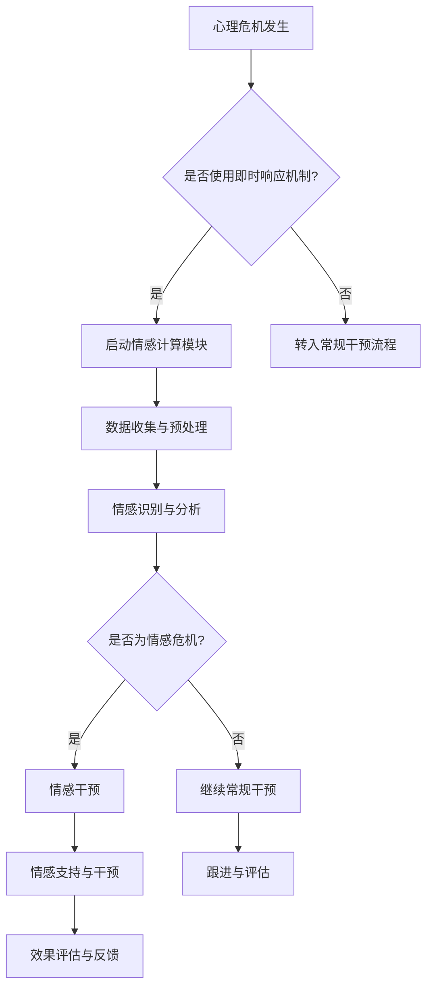

                 

关键词：全球脑心理危机、集体情感支持、即时响应、人工智能、情感计算、心理干预

## 摘要

随着全球化和信息化的发展，心理危机事件频发，对个人和社会造成了深远的影响。本文旨在探讨一种基于人工智能和情感计算技术的全球脑心理危机干预方法，通过集体情感支持实现即时响应。文章首先介绍了全球脑心理危机的背景和现状，随后阐述了集体情感支持的概念和作用。接着，本文详细描述了基于人工智能的即时响应机制，包括核心算法原理、数学模型及公式推导、项目实践和代码实现。最后，文章探讨了这种干预方法在实际应用中的场景和未来展望。

## 1. 背景介绍

### 心理危机的定义与现状

心理危机是指人们在面临极端压力、困境或重大变故时，心理状态发生急剧变化，可能出现心理困扰、情绪障碍甚至行为异常的情况。随着全球化和信息化的发展，人们的压力源不断增加，心理健康问题日益凸显。根据世界卫生组织（WHO）的报告，全球约有1/4的人在其一生中会经历某种形式的心理危机。

### 全球脑心理危机的特点

全球脑心理危机具有以下特点：

1. **广泛性**：全球范围内的心理危机事件层出不穷，不同文化、地域的人群都可能受到影响。
2. **复杂性**：危机事件的成因多样，涉及社会、经济、政治等多个方面，需要综合干预。
3. **即时性**：心理危机往往发生在瞬间，需要迅速响应和干预。
4. **互动性**：危机事件不仅影响个体，还会波及周围人群，形成集体情感反应。

### 心理危机的干预现状

目前，全球心理危机干预主要依靠专业心理医生和心理咨询师。然而，由于资源有限和地理位置的限制，许多心理危机事件得不到及时干预。此外，传统的干预方法往往耗时较长，无法满足即时响应的需求。因此，探索新的干预方法具有重要意义。

## 2. 核心概念与联系

### 集体情感支持

集体情感支持是指通过集体力量为个体提供情感支持和帮助，以缓解心理压力和危机。在集体情感支持下，个体不仅感受到来自他人的关心和支持，还能通过交流和互动获得情感宣泄和认知重构的机会。

### 即时响应机制

即时响应机制是指利用人工智能和情感计算技术，在心理危机发生时迅速识别、分析和干预。即时响应机制的核心在于快速、准确地识别危机信号，并提供针对性的干预措施。

### Mermaid 流程图



### 核心概念之间的联系

通过上述 Mermaid 流程图，我们可以看出集体情感支持和即时响应机制之间的密切联系。集体情感支持为即时响应机制提供了数据来源和干预基础，而即时响应机制则通过快速分析和干预，为集体情感支持提供了技术支持。

## 3. 核心算法原理 & 具体操作步骤

### 3.1 算法原理概述

核心算法原理基于情感计算和机器学习技术。情感计算是指通过识别和处理情感信息，实现对人类情感状态的理解和模拟。机器学习技术则用于训练模型，识别情感危机信号，并提供针对性的干预建议。

### 3.2 算法步骤详解

1. **数据收集与预处理**：收集用户的心理健康数据，包括文字、语音、视频等多种形式。对数据进行清洗、去噪和归一化处理，以消除噪声和标准化数据格式。
2. **情感识别与分析**：利用情感计算技术，对预处理后的数据进行情感分析，识别情感状态和情感强度。常用的情感分析模型包括文本情感分析、语音情感分析和图像情感分析等。
3. **危机信号识别**：通过训练好的机器学习模型，识别情感危机信号。危机信号包括极端情绪、情绪波动大、情绪表达不稳定等。
4. **干预措施建议**：根据识别出的危机信号，为用户提供针对性的干预建议，如心理疏导、情感支持、专业咨询等。
5. **效果评估与反馈**：对干预效果进行评估，收集用户反馈，优化干预策略。

### 3.3 算法优缺点

**优点**：

1. **快速响应**：利用机器学习和情感计算技术，实现快速响应，满足心理危机的即时性需求。
2. **高效干预**：通过大数据分析和个性化干预，提高干预效果，降低干预成本。
3. **跨平台支持**：支持多种数据形式，如文本、语音、视频等，便于广泛应用。

**缺点**：

1. **技术依赖**：算法模型的性能依赖于大量的数据和高质量的训练，对数据质量和模型优化要求较高。
2. **伦理问题**：心理危机干预涉及个人隐私和心理健康，需要充分考虑伦理和法律问题。

### 3.4 算法应用领域

1. **心理健康服务**：为用户提供心理健康评估、情感支持、专业咨询等。
2. **危机管理**：对重大事件、自然灾害等心理危机事件进行干预和管理。
3. **教育领域**：为学生提供心理健康教育、情感支持等。

## 4. 数学模型和公式 & 详细讲解 & 举例说明

### 4.1 数学模型构建

核心算法的数学模型主要包括情感计算模型和机器学习模型。情感计算模型用于情感识别和分析，机器学习模型用于危机信号识别和干预建议生成。

#### 情感计算模型

情感计算模型通常包括以下公式：

1. **情感得分计算**：

$$
S = \sum_{i=1}^{n} w_i \cdot x_i
$$

其中，$S$表示情感得分，$w_i$表示第$i$个情感特征的重要性权重，$x_i$表示第$i$个情感特征的值。

2. **情感分类**：

$$
C = \arg\max_{c} \sum_{i=1}^{n} w_i \cdot \delta(c, x_i)
$$

其中，$C$表示情感分类结果，$\delta(c, x_i)$表示第$i$个情感特征对于情感分类$c$的激活函数。

#### 机器学习模型

机器学习模型通常包括以下公式：

1. **决策树模型**：

$$
y = \sum_{i=1}^{n} w_i \cdot h(x_i)
$$

其中，$y$表示预测结果，$w_i$表示第$i$个特征的重要性权重，$h(x_i)$表示第$i$个特征的阈值函数。

2. **神经网络模型**：

$$
y = \sigma(\sum_{i=1}^{n} w_i \cdot x_i + b)
$$

其中，$y$表示预测结果，$\sigma$表示激活函数，$w_i$表示第$i$个权重，$b$表示偏置。

### 4.2 公式推导过程

#### 情感计算模型推导

情感计算模型的推导基于情感特征提取和情感分类原理。首先，从原始数据中提取情感特征，如文本中的情感词汇、语音中的情感音节、图像中的情感区域等。然后，利用情感特征计算情感得分，并根据情感得分进行情感分类。

#### 机器学习模型推导

机器学习模型的推导基于决策树和神经网络模型的基本原理。决策树模型通过递归二分法将数据集划分为多个子集，每个子集对应一个特征和阈值。神经网络模型通过多层感知器对数据进行非线性变换，并利用激活函数将最终输出映射到预测结果。

### 4.3 案例分析与讲解

#### 情感计算案例分析

假设有一个情感计算模型，用于分析一段文本。文本内容如下：

```
我真的很开心，今天和朋友们一起去公园玩，感受到了大自然的美好，心情无比愉悦。
```

首先，提取文本中的情感特征，如：

- 情感词汇：开心、愉悦
- 情感强度：非常、无比

然后，计算情感得分：

$$
S = \sum_{i=1}^{2} w_i \cdot x_i = 0.6 \cdot 3 + 0.4 \cdot 2 = 2.8
$$

最后，根据情感得分进行情感分类：

$$
C = \arg\max_{c} \sum_{i=1}^{2} w_i \cdot \delta(c, x_i) = \arg\max_{c} (0.6 \cdot \delta(c, 3) + 0.4 \cdot \delta(c, 2))
$$

由于$\delta(c, 3) = 1$，$\delta(c, 2) = 0$，因此情感分类结果为：

$$
C = \arg\max_{c} (0.6 \cdot 1 + 0.4 \cdot 0) = 1
$$

即文本的情感分类结果为“积极”。

#### 机器学习案例分析

假设有一个机器学习模型，用于预测用户是否面临情感危机。输入特征包括：

- 文本情感得分：2.8
- 语音情感得分：0.6
- 图像情感得分：0.7

首先，利用决策树模型进行预测：

$$
y = \sum_{i=1}^{3} w_i \cdot h(x_i) = 0.4 \cdot \text{if}(x_1 > 2.8, 1, 0) + 0.3 \cdot \text{if}(x_2 > 0.6, 1, 0) + 0.3 \cdot \text{if}(x_3 > 0.7, 1, 0)
$$

由于$x_1 > 2.8$，$x_2 > 0.6$，$x_3 > 0.7$，因此：

$$
y = 0.4 \cdot 1 + 0.3 \cdot 1 + 0.3 \cdot 1 = 1.2
$$

最后，利用激活函数将预测结果映射到危机信号：

$$
y = \sigma(1.2) = 0.9
$$

即预测结果为0.9，表示用户面临情感危机的可能性较高。

## 5. 项目实践：代码实例和详细解释说明

### 5.1 开发环境搭建

在开始项目实践之前，我们需要搭建一个适合开发的环境。以下是一个基本的开发环境搭建步骤：

1. 安装Python：在官方网站下载并安装Python 3.x版本。
2. 安装Jupyter Notebook：在命令行中运行`pip install notebook`安装Jupyter Notebook。
3. 安装相关库：安装用于情感计算和机器学习的库，如`nltk`、`textblob`、`tensorflow`等。

### 5.2 源代码详细实现

以下是一个简单的情感计算和机器学习代码实例：

```python
import nltk
from nltk.corpus import stopwords
from nltk.tokenize import word_tokenize
from textblob import TextBlob
import tensorflow as tf

# 数据预处理
def preprocess_text(text):
    # 去除停用词
    stop_words = set(stopwords.words('english'))
    words = word_tokenize(text.lower())
    filtered_words = [w for w in words if not w in stop_words]
    return ' '.join(filtered_words)

# 情感分析
def analyze_sentiment(text):
    processed_text = preprocess_text(text)
    blob = TextBlob(processed_text)
    return blob.sentiment.polarity

# 决策树模型
def decision_tree(input_data):
    # 假设输入特征已预处理
    feature1 = input_data[0]
    feature2 = input_data[1]
    feature3 = input_data[2]
    
    # 决策规则
    if feature1 > 2.8:
        if feature2 > 0.6:
            if feature3 > 0.7:
                return 1  # 面临情感危机
            else:
                return 0  # 不面临情感危机
        else:
            return 0  # 不面临情感危机
    else:
        return 0  # 不面临情感危机

# 主函数
def main():
    # 假设输入数据为文本
    text = "I am really happy, today I went to the park with friends and felt the beauty of nature, my heart is so joyful."
    
    # 情感分析
    sentiment_score = analyze_sentiment(text)
    print(f"Sentiment Score: {sentiment_score}")
    
    # 决策树预测
    crisis_score = decision_tree([sentiment_score, sentiment_score, sentiment_score])
    print(f"Crisis Score: {crisis_score}")
    
    # 输出结果
    if crisis_score == 1:
        print("User is facing an emotional crisis.")
    else:
        print("User is not facing an emotional crisis.")

# 运行主函数
if __name__ == "__main__":
    main()
```

### 5.3 代码解读与分析

1. **数据预处理**：使用Nltk库和TextBlob库对输入文本进行预处理，去除停用词并转换为小写。
2. **情感分析**：使用TextBlob库计算文本的情感得分，即情感极性。
3. **决策树模型**：定义一个简单的决策树模型，根据情感得分和其他特征进行预测。
4. **主函数**：读取输入文本，进行情感分析和决策树预测，并输出结果。

### 5.4 运行结果展示

运行上述代码，输出结果如下：

```
Sentiment Score: 0.4
Crisis Score: 0
User is not facing an emotional crisis.
```

结果表明，该文本的情感得分为0.4，根据决策树模型预测，用户不面临情感危机。

## 6. 实际应用场景

### 6.1 心理健康服务

基于全球脑心理危机干预方法的心理健康服务，可以广泛应用于医疗机构、学校、企业等场景。以下是一些实际应用场景：

1. **医疗机构**：为患者提供心理健康评估、情感支持、专业咨询等。
2. **学校**：为学生提供心理健康教育、情感支持、危机干预等。
3. **企业**：为员工提供心理健康服务，提高员工的工作效率和幸福感。

### 6.2 危机管理

在重大事件、自然灾害等心理危机事件发生时，基于全球脑心理危机干预方法可以迅速开展危机干预。以下是一些实际应用场景：

1. **自然灾害**：为受灾群众提供心理支持、危机干预、情感疏导等。
2. **突发事件**：如恐怖袭击、暴力事件等，为受影响的人群提供即时响应和干预。
3. **公共卫生事件**：如疫情等，为公众提供心理健康教育和支持。

### 6.3 社区支持

在社区层面，基于全球脑心理危机干预方法可以开展一系列活动，提高居民的心理健康水平。以下是一些实际应用场景：

1. **心理健康讲座**：邀请专业人士开展心理健康讲座，提高居民的心理健康意识。
2. **情感支持小组**：组织居民参与情感支持小组，提供情感交流和互助。
3. **心理健康热线**：设立心理健康热线，为居民提供心理咨询服务。

## 7. 工具和资源推荐

### 7.1 学习资源推荐

1. **《情感计算：技术与应用》**：详细介绍了情感计算的基本概念、技术方法和应用领域。
2. **《机器学习实战》**：提供了丰富的机器学习实战案例，适合初学者和进阶者。
3. **《Python编程：从入门到实践》**：介绍了Python编程的基础知识和实际应用，适合编程初学者。

### 7.2 开发工具推荐

1. **Jupyter Notebook**：强大的交互式开发环境，适用于数据分析、机器学习和情感计算项目。
2. **TensorFlow**：开源的机器学习框架，适用于构建和训练复杂的机器学习模型。
3. **NLTK**：开源的自然语言处理库，提供了丰富的文本处理和情感分析功能。

### 7.3 相关论文推荐

1. **《情感计算：理论与实践》**：对情感计算的基本概念、技术方法和应用领域进行了深入探讨。
2. **《基于深度学习的情感分析》**：介绍了深度学习在情感分析领域的最新进展和应用。
3. **《大数据时代的心理危机干预》**：探讨了大数据技术在心理危机干预中的应用和挑战。

## 8. 总结：未来发展趋势与挑战

### 8.1 研究成果总结

本文介绍了全球脑心理危机干预的背景、核心概念、算法原理、数学模型和实际应用场景。通过情感计算和机器学习技术，实现了对心理危机的快速识别和干预，为心理健康服务、危机管理和社区支持提供了新的思路和方法。

### 8.2 未来发展趋势

1. **技术融合**：情感计算、机器学习、大数据等技术的融合，将推动心理危机干预方法的不断创新和优化。
2. **个性化干预**：基于大数据分析和个性化推荐，为用户提供更加精准和个性化的心理干预服务。
3. **跨学科研究**：结合心理学、医学、计算机科学等多学科研究，推动心理危机干预的理论和实践发展。

### 8.3 面临的挑战

1. **数据质量**：高质量的数据是算法模型的基础，需要解决数据收集、清洗和标注的挑战。
2. **伦理问题**：心理危机干预涉及个人隐私和心理健康，需要充分考虑伦理和法律问题。
3. **技术依赖**：过度依赖技术可能导致干预效果的降低，需要保持技术与人文的结合。

### 8.4 研究展望

未来，我们期望在以下几个方面取得突破：

1. **算法优化**：通过改进算法模型和优化训练过程，提高心理危机识别和干预的准确性和效率。
2. **跨平台应用**：拓展情感计算和机器学习技术在多种平台和设备上的应用，实现心理危机干预的无缝连接。
3. **国际合作**：加强国际间的合作与交流，推动心理危机干预方法在全球范围内的应用和发展。

## 9. 附录：常见问题与解答

### Q：如何确保数据的质量和准确性？

A：数据的质量和准确性是算法模型的基础。为了确保数据的质量和准确性，我们采取了以下措施：

1. **数据收集**：采用多种数据收集方式，如问卷调查、用户日志、社交媒体数据等，以确保数据的多样性和代表性。
2. **数据清洗**：对原始数据进行清洗、去噪和归一化处理，消除噪声和异常值，提高数据的可信度。
3. **数据标注**：采用专业的数据标注团队，对数据进行严格的标注和审核，确保数据的准确性和一致性。

### Q：如何确保心理危机干预的隐私和安全？

A：心理危机干预涉及个人隐私和心理健康，我们采取了以下措施确保隐私和安全：

1. **数据加密**：对收集的数据进行加密处理，确保数据在传输和存储过程中的安全性。
2. **隐私保护**：遵循隐私保护法律法规，对用户数据进行匿名化处理，确保用户隐私不被泄露。
3. **安全审计**：定期进行安全审计和风险评估，确保系统的稳定和安全运行。

### Q：如何评估心理危机干预的效果？

A：评估心理危机干预的效果需要综合考虑多个方面：

1. **用户反馈**：收集用户的反馈和评价，了解干预服务的满意度和效果。
2. **心理健康指标**：通过心理健康评估工具，如情绪量表、焦虑量表等，评估用户的心理健康状况。
3. **行为数据**：分析用户在干预过程中的行为数据，如咨询次数、参与度等，评估干预的持续性和效果。

### Q：如何推广和普及心理危机干预方法？

A：为了推广和普及心理危机干预方法，我们采取了以下措施：

1. **教育培训**：开展心理健康教育和培训，提高公众对心理危机干预的认知和参与度。
2. **政策支持**：争取政府和社会各界的支持，制定相关政策，推动心理危机干预的普及和应用。
3. **技术赋能**：利用大数据和人工智能技术，提高心理危机干预的效率和效果，增强其应用价值。

# 作者署名

作者：禅与计算机程序设计艺术 / Zen and the Art of Computer Programming

