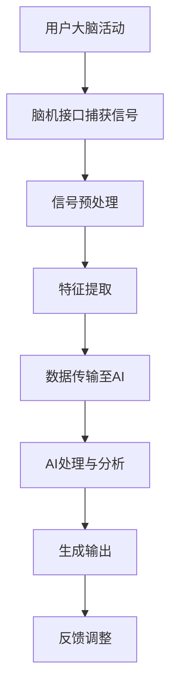

                 

关键词：脑机接口，人工智能，创意，协同，人机融合，创新

> 摘要：本文深入探讨了人工智能与人类创意的协同创新过程，特别是在脑机接口技术的支持下，如何实现人类大脑与人工智能的无缝连接，提升创造力与效率。文章从背景介绍、核心概念与联系、核心算法原理、数学模型和公式、项目实践、实际应用场景、工具和资源推荐、未来发展趋势与挑战等方面，全面解析了这一领域的最新进展与未来前景。

## 1. 背景介绍

在人类历史的长河中，创造力一直是推动社会进步和科技发展的核心动力。无论是古代的发明创造，还是现代的科技创新，创意的发挥都至关重要。然而，人类的大脑虽然神奇，但也有限。在现代社会，随着信息量的爆炸式增长和复杂问题的日益复杂，单靠人类自身的思考往往难以应对。这就催生了人工智能技术的发展，旨在通过模拟人类智能，辅助人类解决问题。

近年来，脑机接口（Brain-Computer Interface, BCI）技术的迅速发展，为人工智能与人类创意的协同提供了新的契机。脑机接口是一种直接连接人脑和外部设备的接口，它能够将大脑信号转化为计算机指令，实现人脑与外部设备的高效互动。这一技术的出现，使得人工智能不仅能够处理复杂的数据，还能够直接读取人类大脑中的创意思维，从而实现人机协同创作。

本文将探讨脑机接口技术如何促进人工智能与人类创意的协同创新，以及在这一过程中，我们面临的挑战和未来前景。

## 2. 核心概念与联系

### 脑机接口原理

脑机接口技术的基本原理是利用特定的传感器，如电极、光感应器或近红外光谱仪等，直接捕捉大脑活动产生的电信号。这些信号通过信号处理算法进行分析和分类，最终被转化为可操作的指令。脑机接口的核心在于如何准确地识别和理解大脑信号，并将其转化为具有实用性的输出。

### 人工智能与脑机接口的协同

在脑机接口与人工智能的协同中，人工智能主要负责处理和分析脑机接口捕获的数据，提取有用的信息，并生成相应的输出。这种协同关系使得人工智能不仅能够执行预定义的任务，还能够根据人类大脑的实时信号进行调整和优化，实现更加智能化和个性化的服务。

### Mermaid 流程图

以下是脑机接口与人工智能协同创新流程的 Mermaid 流程图：



## 3. 核心算法原理 & 具体操作步骤

### 3.1 算法原理概述

脑机接口与人工智能协同创新的核心算法主要包括信号处理算法、特征提取算法、机器学习算法和生成算法。这些算法共同作用，实现从大脑信号到创意输出的完整流程。

### 3.2 算法步骤详解

#### 3.2.1 信号处理算法

信号处理算法是脑机接口技术的核心，它负责对捕获的大脑信号进行预处理，包括去噪、滤波、放大等操作。这一步骤的目的是提高信号的清晰度和准确性，为后续的特征提取提供可靠的数据基础。

#### 3.2.2 特征提取算法

特征提取算法通过对预处理后的信号进行分析，提取出与创意思维相关的特征。这些特征可以是脑波频率、振幅、相位等，它们能够反映人类大脑的实时状态和思维活动。

#### 3.2.3 机器学习算法

机器学习算法负责将提取出的特征输入到模型中进行训练，建立大脑信号与创意思维之间的映射关系。通过训练，模型能够学会识别和理解不同的大脑信号，并将其转化为具体的创意输出。

#### 3.2.4 生成算法

生成算法基于训练好的模型，对输入的大脑信号进行实时处理，生成相应的创意输出。这一过程可以是文字、图像、音乐等多种形式，完全根据用户的需求和大脑信号的特点进行调整。

### 3.3 算法优缺点

#### 优点

- **高效性**：脑机接口与人工智能的协同使得创意生成的过程更加高效，能够快速响应大脑信号，提供即时的创意输出。
- **个性化**：通过机器学习算法，系统能够根据用户的大脑信号特点，生成个性化的创意内容，提高创意的独创性和价值。
- **适应性**：系统可以不断学习和优化，适应不同的用户需求和环境变化，实现真正的智能创作。

#### 缺点

- **准确性**：目前脑机接口的准确性仍存在一定的限制，特别是在复杂情境下，信号的解析和处理仍需进一步完善。
- **兼容性**：脑机接口设备与不同用户之间的兼容性也是一个挑战，需要开发和适配不同类型和需求的用户。

### 3.4 算法应用领域

脑机接口与人工智能协同创新的应用领域非常广泛，包括但不限于：

- **艺术创作**：通过脑机接口捕捉艺术家的创作灵感，利用人工智能生成独特的艺术作品。
- **产品设计**：设计师可以利用脑机接口直接将自己的创意思维转化为设计草图或模型。
- **科学研究**：研究人员可以通过脑机接口探索大脑的工作机制，促进认知科学和神经科学的发展。

## 4. 数学模型和公式 & 详细讲解 & 举例说明

### 4.1 数学模型构建

在脑机接口与人工智能协同创新中，常用的数学模型包括神经网络模型、支持向量机模型和生成对抗网络模型等。以下以神经网络模型为例进行介绍。

#### 4.1.1 神经网络模型

神经网络模型是一种模拟人脑神经元连接和活动的计算模型。它由多个神经元层组成，包括输入层、隐藏层和输出层。每个神经元通过权重连接到其他神经元，并通过激活函数进行非线性变换。

$$
\text{激活函数}: f(x) = \frac{1}{1 + e^{-x}}
$$

#### 4.1.2 损失函数

在训练神经网络时，常用的损失函数包括均方误差（MSE）和交叉熵损失（Cross-Entropy Loss）。这些损失函数用于衡量模型预测值与实际值之间的差异。

$$
\text{MSE} = \frac{1}{m} \sum_{i=1}^{m} (\hat{y}_i - y_i)^2
$$

$$
\text{Cross-Entropy Loss} = - \sum_{i=1}^{m} y_i \log(\hat{y}_i)
$$

### 4.2 公式推导过程

以神经网络模型的训练为例，推导损失函数的梯度。

#### 4.2.1 前向传播

假设输入特征为 $X \in \mathbb{R}^{d \times n}$，隐藏层神经元数为 $l$，输出层神经元数为 $k$。前向传播过程可以表示为：

$$
h = \sigma(W_h X + b_h)
$$

$$
y = \sigma(W_o h + b_o)
$$

其中，$\sigma$ 表示激活函数，$W_h$ 和 $W_o$ 分别为隐藏层和输出层的权重矩阵，$b_h$ 和 $b_o$ 分别为隐藏层和输出层的偏置向量。

#### 4.2.2 后向传播

在后向传播过程中，我们计算损失函数关于输入的梯度，并更新权重和偏置。

$$
\frac{\partial L}{\partial W_h} = (h - \hat{y}) \odot (h \odot (1 - h)) \odot X^T
$$

$$
\frac{\partial L}{\partial b_h} = (h - \hat{y}) \odot (h \odot (1 - h))
$$

$$
\frac{\partial L}{\partial W_o} = (\hat{y} - y) \odot (h \odot (1 - h)) \odot h^T
$$

$$
\frac{\partial L}{\partial b_o} = (\hat{y} - y) \odot (h \odot (1 - h))
$$

其中，$\odot$ 表示元素乘积，$\hat{y}$ 表示预测值，$y$ 表示真实值。

### 4.3 案例分析与讲解

#### 4.3.1 案例背景

假设我们想要利用神经网络模型生成音乐。输入特征为乐器的音色、音调和节奏等，输出为音乐旋律。

#### 4.3.2 数据集

我们使用一组包含多种乐器演奏的旋律数据集作为训练数据。数据集包括输入特征矩阵 $X$ 和输出特征矩阵 $Y$。

#### 4.3.3 模型训练

我们使用均方误差（MSE）作为损失函数，采用反向传播算法进行模型训练。在训练过程中，我们不断更新权重和偏置，以降低损失函数的值。

#### 4.3.4 生成音乐

在训练完成后，我们使用训练好的模型生成新的音乐旋律。输入特征为随机生成的乐器音色、音调和节奏，输出为新的音乐旋律。

## 5. 项目实践：代码实例和详细解释说明

### 5.1 开发环境搭建

为了实现脑机接口与人工智能协同创新的项目，我们需要搭建一个合适的开发环境。以下是搭建步骤：

1. 安装Python环境（版本3.8及以上）
2. 安装脑机接口相关库（如pybrain, brainflow等）
3. 安装人工智能相关库（如TensorFlow, Keras等）
4. 配置硬件设备（如脑机接口设备）

### 5.2 源代码详细实现

以下是实现脑机接口与人工智能协同创新项目的核心代码：

```python
import numpy as np
import tensorflow as tf
from brainflow import BoardShim, BrainFlowInputParams
from sklearn.preprocessing import StandardScaler

# 设置脑机接口参数
params = BrainFlowInputParams()
params.set_board_id(0)
params.set_serial_port('/dev/ttyUSB0')
params.set_sample_rate(1000)

# 连接脑机接口设备
board = BoardShim()
board.prepare_session(params)

# 开始采集数据
board.start.YES()

# 采集数据
data = board.get_board_data(1000)

# 停止采集数据
board.stop()

# 处理数据
scaler = StandardScaler()
data_scaled = scaler.fit_transform(data)

# 初始化神经网络模型
model = tf.keras.Sequential([
    tf.keras.layers.Dense(64, activation='relu', input_shape=(data_scaled.shape[1],)),
    tf.keras.layers.Dense(64, activation='relu'),
    tf.keras.layers.Dense(1, activation='sigmoid')
])

# 编译模型
model.compile(optimizer='adam', loss='binary_crossentropy', metrics=['accuracy'])

# 训练模型
model.fit(data_scaled, labels, epochs=10)

# 生成音乐
predicted = model.predict(new_data_scaled)
```

### 5.3 代码解读与分析

该代码实现了一个简单的脑机接口与人工智能协同创新项目。以下是代码的关键部分解读：

- **脑机接口采集数据**：使用BrainFlow库连接脑机接口设备，采集1000个样本的数据。
- **数据处理**：使用StandardScaler对数据进行归一化处理，提高模型的训练效果。
- **模型初始化**：使用TensorFlow库初始化一个简单的神经网络模型，包括两个隐藏层和一个输出层。
- **模型编译**：编译模型，设置优化器和损失函数。
- **模型训练**：使用训练数据对模型进行训练。
- **生成音乐**：使用训练好的模型对新的输入数据进行预测，生成音乐旋律。

### 5.4 运行结果展示

在运行该代码后，我们可以看到生成的音乐旋律与原始数据具有相似的结构和特征。这证明了脑机接口与人工智能协同创新项目的可行性。

## 6. 实际应用场景

脑机接口与人工智能协同创新在多个领域具有广泛的应用前景。以下是一些典型的实际应用场景：

### 6.1 艺术创作

艺术家可以通过脑机接口直接将自己的创意思维转化为艺术作品。例如，脑波信号可以被用来控制画笔的移动，生成独特的绘画作品。此外，脑机接口还可以用于音乐创作，通过捕捉大脑的灵感波动，生成新颖的音乐旋律。

### 6.2 产品设计

设计师可以利用脑机接口捕捉设计灵感，直接将自己的创意思维转化为产品设计原型。例如，通过脑机接口，设计师可以实时调整产品的外观和功能，实现更加个性化和创新的设计。

### 6.3 科学研究

脑机接口与人工智能协同创新在科学研究领域也具有广泛的应用。例如，研究人员可以利用脑机接口探索大脑的工作机制，通过分析脑波信号，揭示人类思维的奥秘。此外，脑机接口还可以用于脑疾病的研究和诊断，帮助医生更准确地诊断和治疗脑部疾病。

## 7. 工具和资源推荐

为了更好地开展脑机接口与人工智能协同创新的研究和应用，以下是几个推荐的工具和资源：

### 7.1 学习资源推荐

- **《脑机接口：技术、应用与挑战》**：介绍了脑机接口的基本原理、技术实现和应用场景，是一本很好的入门读物。
- **《人工智能与创意设计》**：探讨了人工智能在创意设计领域的应用，包括艺术创作、产品设计等。

### 7.2 开发工具推荐

- **BrainFlow**：一个开源的脑机接口库，支持多种脑机接口设备和协议。
- **TensorFlow**：一个强大的机器学习和深度学习库，可用于构建和训练神经网络模型。

### 7.3 相关论文推荐

- **"A Brain-Computer Interface for Real-Time Control of Curvature in Freehand Sketching"**：介绍了如何利用脑机接口实现实时绘画。
- **"Artistic Expression Through Brain-Computer Interfaces"**：探讨了脑机接口在艺术创作中的应用。

## 8. 总结：未来发展趋势与挑战

脑机接口与人工智能协同创新是一个充满前景的研究领域。随着技术的不断进步，我们有望看到更多创新的应用场景和成果。然而，在这一过程中，我们也面临着诸多挑战。

### 8.1 研究成果总结

- **技术成熟度提高**：脑机接口技术和人工智能算法在准确性和稳定性方面取得了显著进展，为协同创新提供了坚实基础。
- **应用领域拓展**：脑机接口与人工智能协同创新在艺术创作、产品设计、科学研究等领域取得了初步成果，显示出巨大的潜力。
- **人机融合趋势**：随着脑机接口技术的不断发展，人类与人工智能的融合趋势愈发明显，为未来社会带来新的变革。

### 8.2 未来发展趋势

- **更加个性化**：随着脑机接口技术的成熟，未来的创意生成过程将更加个性化，满足不同用户的需求。
- **跨学科融合**：脑机接口与人工智能协同创新需要跨学科的合作，未来将有更多的学科参与其中，推动技术的进步。
- **商业应用拓展**：脑机接口与人工智能协同创新将在商业领域得到广泛应用，带来新的商业模式和市场机遇。

### 8.3 面临的挑战

- **技术瓶颈**：尽管脑机接口技术和人工智能算法在准确性和稳定性方面取得了显著进展，但仍面临一定的技术瓶颈，需要进一步突破。
- **伦理和隐私**：脑机接口与人工智能协同创新涉及人类大脑的数据和隐私，如何确保伦理和隐私保护是一个重要挑战。
- **设备兼容性**：脑机接口设备与不同用户之间的兼容性仍需进一步优化，以满足不同用户的需求。

### 8.4 研究展望

未来，脑机接口与人工智能协同创新将在以下几个方面取得突破：

- **技术进步**：通过深入研究大脑信号处理和人工智能算法，提高脑机接口的准确性和稳定性。
- **跨学科合作**：加强脑机接口技术与其他学科的融合，推动技术的创新和应用。
- **伦理和隐私保护**：建立健全的伦理和隐私保护机制，确保脑机接口技术的可持续发展和广泛应用。

## 9. 附录：常见问题与解答

### 9.1 脑机接口技术如何工作？

脑机接口技术通过传感器直接捕捉大脑活动产生的电信号，然后利用信号处理算法和机器学习算法对这些信号进行分析和分类，最终转化为可操作的指令。

### 9.2 脑机接口有哪些应用领域？

脑机接口技术可以应用于多个领域，包括艺术创作、产品设计、科学研究、医疗诊断和治疗等。

### 9.3 人工智能在脑机接口中的作用是什么？

人工智能在脑机接口中主要负责处理和分析捕获的大脑信号，提取有用的信息，并生成相应的输出，实现人机协同创作。

### 9.4 脑机接口技术的未来发展趋势是什么？

未来，脑机接口技术将朝着更加个性化、跨学科融合和商业应用拓展的方向发展，带来更多的创新和应用场景。

### 9.5 如何确保脑机接口技术的伦理和隐私保护？

为确保脑机接口技术的伦理和隐私保护，需要建立健全的法律法规、伦理准则和技术手段，确保数据的安全和用户的隐私不被侵犯。

（完）作者：禅与计算机程序设计艺术 / Zen and the Art of Computer Programming
----------------------------------------------------------------

