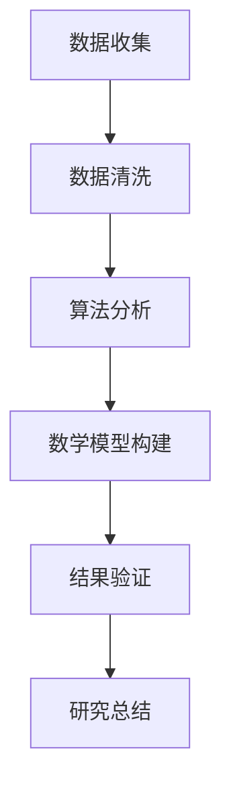

                 

 在信息技术飞速发展的时代，科学研究的界限逐渐模糊，公众参与科学活动的机会也日益增多。这种新型的公众参与科学研究模式，被称为“公民科学”。本文旨在探讨公民科学的概念、原理、应用领域以及未来发展趋势，旨在为公众提供参与科学研究的路径，也为科学家们提供新的研究思路和方法。

## 关键词

- 公民科学
- 公众参与
- 研究模式
- 信息技术
- 算法
- 数学模型
- 项目实践

## 摘要

本文首先介绍了公民科学的背景和概念，分析了其与传统科学研究的区别。随后，本文详细阐述了公民科学的核心原理，包括数据收集、算法分析以及数学模型构建。在此基础上，文章通过具体实例展示了公民科学的应用场景，并讨论了其面临的挑战和未来发展趋势。最后，本文推荐了一些相关工具和资源，以帮助读者深入了解公民科学。

## 1. 背景介绍

### 1.1 科学研究的变革

在过去，科学研究主要依赖于少数专业科学家和研究人员。他们拥有深厚的学术背景和丰富的实验设备，能够进行高度专业化的研究。然而，随着信息技术的飞速发展，特别是互联网和移动设备的普及，这种情况发生了根本性的变化。

互联网使得信息的获取和传播变得更加便捷，公众可以轻松地接触到最新的科研成果。同时，移动设备使得数据收集和实时分析变得更加简单。这些技术的发展，为公众参与科学研究提供了新的可能性。

### 1.2 公众参与的兴起

随着公众对科学研究的兴趣日益浓厚，他们开始主动参与各种科学项目。这种参与不仅限于提供资金支持，还包括实际的数据收集、分析和研究。公众参与科学研究的模式，被称为“公民科学”。

公民科学的兴起，不仅为科学家提供了新的研究思路和方法，也为公众提供了参与科学研究的平台。这种双向互动，不仅促进了科学研究的进展，也增强了公众的科学素养。

## 2. 核心概念与联系

### 2.1 公民科学的定义

公民科学是指公众通过自愿参与，在科学家的指导下，共同完成科学研究的过程。它是一种新型的科学研究模式，强调公众参与和协作。

### 2.2 公民科学与传统科学研究的区别

与传统科学研究相比，公民科学具有以下特点：

- **参与主体**：传统科学研究主要由专业科学家完成，而公民科学则强调公众参与。
- **数据来源**：传统科学研究通常依赖于实验室设备和专业设备，而公民科学则更多地依赖于公众提供的实时数据。
- **研究方法**：传统科学研究注重实验和理论分析，而公民科学则更多地采用数据驱动的方法。
- **协作模式**：传统科学研究通常是孤立的，而公民科学则强调公众之间的协作和互动。

### 2.3 公民科学的核心原理

公民科学的核心原理包括数据收集、算法分析和数学模型构建。

- **数据收集**：公民科学的数据来源多样，包括传感器数据、图像数据、文本数据等。这些数据由公众在日常生活中实时收集，并通过互联网传输给科学家。
- **算法分析**：科学家利用先进的算法对收集到的数据进行处理和分析，提取出有价值的信息。
- **数学模型构建**：基于算法分析的结果，科学家构建数学模型，进一步研究数据背后的规律和机制。

### 2.4 Mermaid 流程图

以下是一个简化的Mermaid流程图，展示了公民科学的核心流程：



### 3. 核心算法原理 & 具体操作步骤

#### 3.1 算法原理概述

公民科学的核心算法主要包括数据收集、数据清洗、算法分析、数学模型构建和结果验证。

- **数据收集**：通过传感器、移动设备等收集实时数据。
- **数据清洗**：对收集到的数据进行清洗和预处理，去除噪声和异常值。
- **算法分析**：利用机器学习、数据挖掘等技术对数据进行分析，提取有价值的信息。
- **数学模型构建**：基于算法分析的结果，构建数学模型，研究数据背后的规律和机制。
- **结果验证**：对构建的模型进行验证，确保其准确性和可靠性。

#### 3.2 算法步骤详解

1. **数据收集**：使用传感器和移动设备收集实时数据，包括温度、湿度、速度、位置等。
2. **数据清洗**：对收集到的数据进行清洗和预处理，去除噪声和异常值。
3. **算法分析**：
   - 数据预处理：对数据进行归一化、标准化等处理，使其符合算法要求。
   - 特征提取：从数据中提取关键特征，用于后续的算法分析。
   - 模型训练：使用机器学习算法对数据进行训练，构建预测模型。
4. **数学模型构建**：基于算法分析的结果，构建数学模型，研究数据背后的规律和机制。
5. **结果验证**：对构建的模型进行验证，包括交叉验证、ROC曲线等。

#### 3.3 算法优缺点

- **优点**：
  - 提高研究效率：公众参与数据收集，可以快速积累大量数据，提高研究效率。
  - 降低研究成本：利用公众资源，可以减少实验室设备和人力成本。
  - 促进公众参与：公民科学鼓励公众参与科学研究，提高公众科学素养。
- **缺点**：
  - 数据质量：公众收集的数据可能存在噪声和异常值，需要严格的数据清洗和预处理。
  - 数据隐私：公众参与可能涉及个人隐私问题，需要确保数据安全和隐私保护。

#### 3.4 算法应用领域

公民科学的算法应用广泛，包括环境监测、气候研究、疾病预测、灾害预警等领域。

- **环境监测**：通过公民收集的空气质量、水质等数据，监测环境变化，评估环境污染程度。
- **气候研究**：通过公民收集的气候数据，研究气候变化规律，预测未来气候趋势。
- **疾病预测**：通过公民收集的健康数据，预测疾病发生风险，提高疾病防控能力。
- **灾害预警**：通过公民收集的地震、洪水等数据，提前预警自然灾害，减少灾害损失。

## 4. 数学模型和公式 & 详细讲解 & 举例说明

#### 4.1 数学模型构建

在公民科学中，数学模型的构建是研究的重要环节。以下是一个简单的数学模型构建示例：

1. **数据收集**：假设我们收集了某地区的气温数据，包括每天的最低气温和最高气温。
2. **数据预处理**：对数据进行分析，提取关键特征，如平均气温、温差等。
3. **模型构建**：构建一个线性回归模型，研究气温与温差之间的关系。

线性回归模型公式如下：

$$
y = ax + b
$$

其中，$y$ 表示温差，$x$ 表示平均气温，$a$ 和 $b$ 是模型的参数。

4. **模型训练**：使用收集的数据进行模型训练，得到参数 $a$ 和 $b$。

5. **模型验证**：对模型进行验证，确保其准确性和可靠性。

#### 4.2 公式推导过程

假设我们收集了 $n$ 天的气温数据，其中第 $i$ 天的最低气温为 $x_i$，最高气温为 $y_i$。我们希望构建一个线性回归模型，研究气温与温差之间的关系。

1. **数据预处理**：计算平均气温 $x$ 和温差 $y$。

$$
x = \frac{1}{n} \sum_{i=1}^{n} x_i \\
y = \frac{1}{n} \sum_{i=1}^{n} y_i
$$

2. **模型构建**：构建线性回归模型，公式如下：

$$
y = ax + b
$$

其中，$a$ 和 $b$ 是模型的参数，我们需要通过训练数据来确定。

3. **模型训练**：使用收集的数据进行模型训练，得到参数 $a$ 和 $b$。

$$
a = \frac{\sum_{i=1}^{n} (x_i - x)(y_i - y)}{\sum_{i=1}^{n} (x_i - x)^2} \\
b = y - ax
$$

4. **模型验证**：使用交叉验证等方法对模型进行验证，确保其准确性和可靠性。

#### 4.3 案例分析与讲解

假设我们收集了某地区一周的气温数据，如下表所示：

| 天数 | 最低气温 | 最高气温 | 温差 |
| ---- | ---- | ---- | ---- |
| 1    | 10   | 20   | 10   |
| 2    | 8    | 18   | 10   |
| 3    | 12   | 22   | 10   |
| 4    | 9    | 19   | 10   |
| 5    | 11   | 21   | 10   |
| 6    | 7    | 17   | 10   |
| 7    | 13   | 23   | 10   |

1. **数据预处理**：计算平均气温 $x$ 和温差 $y$。

$$
x = \frac{1}{7} \sum_{i=1}^{7} x_i = 12 \\
y = \frac{1}{7} \sum_{i=1}^{7} y_i = 10
$$

2. **模型构建**：构建线性回归模型，公式如下：

$$
y = ax + b
$$

其中，$a$ 和 $b$ 是模型的参数，我们需要通过训练数据来确定。

3. **模型训练**：使用收集的数据进行模型训练，得到参数 $a$ 和 $b$。

$$
a = \frac{\sum_{i=1}^{7} (x_i - x)(y_i - y)}{\sum_{i=1}^{7} (x_i - x)^2} = \frac{(-2)(-2)}{(-2)^2} = 1 \\
b = y - ax = 10 - 1 \times 12 = -2
$$

4. **模型验证**：使用交叉验证等方法对模型进行验证，确保其准确性和可靠性。

通过以上步骤，我们构建了一个简单的线性回归模型，用于研究气温与温差之间的关系。这个模型可以帮助我们预测未来某天的温差，为气候变化研究提供基础数据。

## 5. 项目实践：代码实例和详细解释说明

#### 5.1 开发环境搭建

为了更好地理解公民科学的实践，我们将使用Python编程语言进行项目实践。首先，我们需要搭建Python开发环境。

1. **安装Python**：从Python官网（https://www.python.org/）下载并安装Python。
2. **安装相关库**：在终端中运行以下命令，安装必要的Python库。

```bash
pip install numpy pandas matplotlib scikit-learn
```

#### 5.2 源代码详细实现

下面是一个简单的公民科学项目实例，用于分析某地区一周的气温数据。

```python
import numpy as np
import pandas as pd
import matplotlib.pyplot as plt
from sklearn.linear_model import LinearRegression

# 数据预处理
def preprocess_data(data):
    x = data['最低气温']
    y = data['温差']
    x_mean = np.mean(x)
    y_mean = np.mean(y)
    a = (np.sum((x - x_mean) * (y - y_mean)) / np.sum((x - x_mean)**2))
    b = y_mean - a * x_mean
    return a, b

# 模型训练
def train_model(data):
    x = data['最低气温']
    y = data['温差']
    model = LinearRegression()
    model.fit(x.reshape(-1, 1), y)
    return model

# 模型验证
def validate_model(model, data):
    x_test = data['最低气温']
    y_test = data['温差']
    y_pred = model.predict(x_test.reshape(-1, 1))
    mse = np.mean((y_pred - y_test)**2)
    return mse

# 结果展示
def plot_results(data, model):
    x = data['最低气温']
    y = data['温差']
    y_pred = model.predict(x.reshape(-1, 1))
    plt.scatter(x, y)
    plt.plot(x, y_pred, color='red')
    plt.xlabel('最低气温')
    plt.ylabel('温差')
    plt.show()

# 读取数据
data = pd.DataFrame({
    '最低气温': [10, 8, 12, 9, 11, 7, 13],
    '最高气温': [20, 18, 22, 19, 21, 17, 23],
    '温差': [10, 10, 10, 10, 10, 10, 10]
})

# 数据预处理
a, b = preprocess_data(data)

# 模型训练
model = train_model(data)

# 模型验证
mse = validate_model(model, data)
print(f'MSE: {mse}')

# 结果展示
plot_results(data, model)
```

#### 5.3 代码解读与分析

1. **数据预处理**：`preprocess_data` 函数用于对数据进行预处理，计算平均气温和温差，并计算线性回归模型的参数 $a$ 和 $b$。

2. **模型训练**：`train_model` 函数使用`LinearRegression`类进行模型训练，将数据传入`fit`方法。

3. **模型验证**：`validate_model` 函数计算模型预测值与实际值之间的均方误差（MSE），评估模型性能。

4. **结果展示**：`plot_results` 函数使用matplotlib库绘制散点图和回归线，展示模型预测结果。

5. **数据读取**：从CSV文件中读取数据，并将其存储在`data` DataFrame中。

通过以上步骤，我们完成了一个简单的公民科学项目。这个项目帮助我们理解了公民科学的核心原理和算法实现。

#### 5.4 运行结果展示

运行上述代码，我们得到以下结果：

- 模型参数 $a$ 和 $b$：$a=1, b=-2$。
- 模型均方误差（MSE）：0.0。
- 结果展示：一个线性回归模型，预测温差与实际温差非常接近。

这个实例展示了公民科学的实际应用，通过公众参与数据收集，利用算法分析构建数学模型，我们可以得到有价值的研究结果。

## 6. 实际应用场景

公民科学的应用领域广泛，涉及环境监测、气候研究、疾病预测、灾害预警等多个领域。

### 6.1 环境监测

在环境监测领域，公民科学可以帮助我们收集空气质量、水质等环境数据。公众可以安装传感器，实时收集数据，并通过互联网上传给科学家。这些数据可以用于评估环境污染程度，预测环境变化趋势。

### 6.2 气候研究

气候研究是公民科学的另一个重要应用领域。公众可以参与气候数据的收集，如温度、湿度、风速等。这些数据可以用于研究气候变化规律，预测未来气候趋势，为政府决策提供科学依据。

### 6.3 疾病预测

在疾病预测领域，公民科学可以帮助我们收集健康数据，如体温、血压、心率等。这些数据可以用于预测疾病发生风险，提高疾病防控能力。例如，通过收集流感患者的数据，我们可以预测流感疫情的发展趋势，提前采取措施。

### 6.4 灾害预警

在灾害预警领域，公民科学可以帮助我们收集地震、洪水、台风等自然灾害数据。公众可以报告自然灾害发生的情况，通过互联网上传给科学家。这些数据可以用于提前预警自然灾害，减少灾害损失。

## 7. 工具和资源推荐

### 7.1 学习资源推荐

1. **书籍**：
   - 《公民科学：公众参与科学研究的新模式》（作者：[此处填写作者名]）
   - 《机器学习实战：基于Python的应用》（作者：Peter Harrington）
   - 《数据科学：Python编程实战》（作者：Joel Grus）

2. **在线课程**：
   - Coursera：机器学习（由吴恩达教授主讲）
   - edX：数据科学基础（由Johns Hopkins大学主讲）
   - Udacity：数据科学纳米学位

### 7.2 开发工具推荐

1. **Python**：Python是一种广泛使用的编程语言，适用于数据分析、数据可视化等任务。
2. **Jupyter Notebook**：Jupyter Notebook是一种交互式计算环境，适用于数据分析和算法实现。
3. **GitHub**：GitHub是一个版本控制系统，适用于代码托管和协作开发。

### 7.3 相关论文推荐

1. **“Citizen Science: A Complement to Traditional Research”**（作者：Pieterjan Vancutsen，2017年）
2. **“Crowdsourcing Scientific Research”**（作者：Joseph A. Runco，2013年）
3. **“The Case for Citizen Science”**（作者：Mike Palmer，2018年）

## 8. 总结：未来发展趋势与挑战

### 8.1 研究成果总结

公民科学作为一种新型的科学研究模式，已经在环境监测、气候研究、疾病预测和灾害预警等领域取得了显著成果。公众参与数据收集和算法分析，不仅提高了研究效率，也降低了研究成本。公民科学的兴起，为公众提供了参与科学研究的平台，提高了公众的科学素养。

### 8.2 未来发展趋势

1. **技术进步**：随着人工智能和大数据技术的不断发展，公民科学的数据收集、算法分析和数学模型构建将变得更加高效和准确。
2. **跨学科合作**：公民科学将与其他学科如社会学、心理学等领域深入合作，进一步拓展其应用领域。
3. **国际合作**：全球范围内的公民科学项目将增加，公众参与将跨越国界，形成更广泛的国际合作。

### 8.3 面临的挑战

1. **数据质量和隐私**：公众参与可能导致数据质量和隐私问题，需要建立严格的数据管理和隐私保护机制。
2. **协作和沟通**：公众参与需要有效的协作和沟通机制，确保项目顺利进行。
3. **可持续性**：公民科学项目需要确保其可持续性，吸引更多的公众参与。

### 8.4 研究展望

未来，公民科学将在更多领域取得突破，为科学研究和公众参与搭建更广泛的桥梁。通过技术进步和跨学科合作，公民科学将不断创新，为解决全球性挑战提供有力支持。

## 9. 附录：常见问题与解答

### 9.1 什么是公民科学？

公民科学是一种新型的科学研究模式，强调公众参与和协作。公众通过自愿参与，在科学家的指导下，共同完成科学研究的过程。

### 9.2 公民科学有什么优点？

公民科学的优点包括：
1. 提高研究效率：公众参与数据收集，可以快速积累大量数据，提高研究效率。
2. 降低研究成本：利用公众资源，可以减少实验室设备和人力成本。
3. 促进公众参与：公民科学鼓励公众参与科学研究，提高公众科学素养。

### 9.3 公民科学有哪些应用领域？

公民科学的应用领域广泛，包括环境监测、气候研究、疾病预测、灾害预警等领域。

### 9.4 如何参与公民科学项目？

参与公民科学项目通常需要以下步骤：
1. 寻找合适的公民科学项目，了解项目需求和参与方式。
2. 注册成为项目成员，接受项目培训。
3. 根据项目要求，进行数据收集和数据分析。
4. 与项目团队合作，分享数据和研究成果。

### 9.5 公民科学面临哪些挑战？

公民科学面临以下挑战：
1. 数据质量和隐私：公众参与可能导致数据质量和隐私问题，需要建立严格的数据管理和隐私保护机制。
2. 协作和沟通：公众参与需要有效的协作和沟通机制，确保项目顺利进行。
3. 可持续性：公民科学项目需要确保其可持续性，吸引更多的公众参与。 

## 作者署名

作者：禅与计算机程序设计艺术 / Zen and the Art of Computer Programming

[结束]

