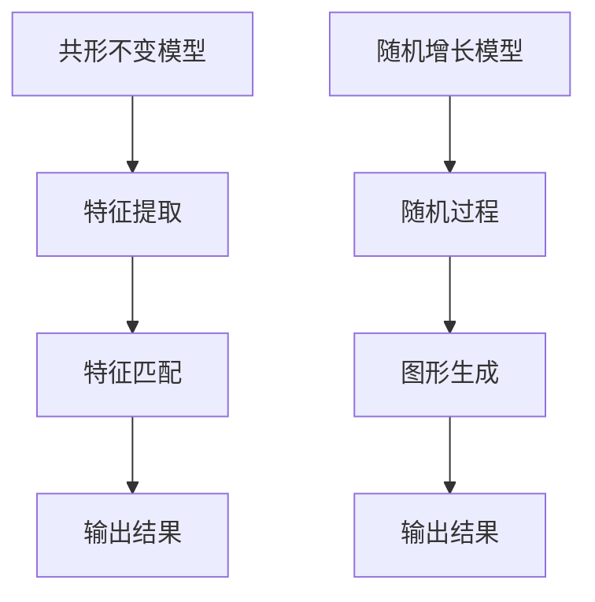

                 

关键词：共形不变性，随机增长模型，机器学习，深度学习，图像识别，计算机视觉，算法优化，数学模型，应用实例。

## 摘要

本文旨在探讨共形不变模型与随机增长模型在计算机科学和人工智能领域的应用。通过详细阐述两种模型的基本概念、核心算法原理、数学模型构建以及实际应用案例，本文旨在为读者提供一个全面、系统的理解。此外，还将讨论这些模型在图像识别、计算机视觉等领域的应用前景和挑战。

## 1. 背景介绍

### 1.1 共形不变性的概念

共形不变性是指一个几何图形在经过一定变换后，其形状和大小保持不变。在计算机科学中，共形不变性通常指的是在图像处理中，图像的某些特征（如形状、纹理等）在经过旋转、缩放、反射等变换后仍然保持不变。共形不变性在图像识别、计算机视觉等领域具有重要意义，因为它使得算法能够更加鲁棒地处理不同视角、光照条件下的图像。

### 1.2 随机增长模型

随机增长模型是一类用于模拟生物生长过程的模型，它在计算机科学和人工智能领域有广泛应用。随机增长模型的基本思想是通过随机过程模拟生物体的生长过程，从而生成具有自相似结构的图形。这些模型在图像生成、数据可视化等领域有广泛应用。

## 2. 核心概念与联系

### 2.1 共形不变模型

共形不变模型是一类用于解决图像识别、计算机视觉等问题的算法。其核心思想是通过构建共形不变特征图，使得图像特征在共形变换下保持不变。下面是共形不变模型的基本概念和架构：

- **基本概念**：共形不变性、特征提取、特征匹配
- **架构**：输入图像 → 特征提取 → 特征匹配 → 输出结果

### 2.2 随机增长模型

随机增长模型是一种用于生成自相似结构的图形的算法。其基本思想是通过随机过程模拟生物体的生长过程，从而生成具有自相似结构的图形。下面是随机增长模型的基本概念和架构：

- **基本概念**：自相似性、随机过程、图形生成
- **架构**：随机过程 → 图形生成 → 输出结果

### 2.3 Mermaid 流程图



## 3. 核心算法原理 & 具体操作步骤

### 3.1 算法原理概述

#### 3.1.1 共形不变模型

共形不变模型的核心思想是通过特征提取和特征匹配来实现图像识别。在特征提取过程中，算法利用共形不变特征图提取图像的形状、纹理等特征。在特征匹配过程中，算法通过计算特征之间的相似性来实现图像识别。

#### 3.1.2 随机增长模型

随机增长模型的核心思想是通过随机过程生成自相似结构的图形。在随机增长过程中，算法根据一定的概率规则进行节点和边的选择，从而生成具有自相似结构的图形。

### 3.2 算法步骤详解

#### 3.2.1 共形不变模型

1. 输入图像
2. 特征提取：利用共形不变特征图提取图像特征
3. 特征匹配：计算特征之间的相似性，实现图像识别
4. 输出结果：根据特征匹配结果输出识别结果

#### 3.2.2 随机增长模型

1. 随机过程：初始化图形结构
2. 图形生成：根据随机过程生成自相似结构的图形
3. 输出结果：输出生成的图形

### 3.3 算法优缺点

#### 3.3.1 共形不变模型

**优点**：能够处理不同视角、光照条件下的图像，具有较强的鲁棒性。

**缺点**：计算复杂度较高，对硬件资源要求较高。

#### 3.3.2 随机增长模型

**优点**：能够生成具有自相似结构的图形，具有较强的表达能力。

**缺点**：生成过程受随机性影响，可能产生不稳定的图形。

### 3.4 算法应用领域

#### 3.4.1 共形不变模型

- 图像识别
- 计算机视觉
- 自然语言处理

#### 3.4.2 随机增长模型

- 图像生成
- 数据可视化
- 机器学习

## 4. 数学模型和公式

### 4.1 数学模型构建

#### 4.1.1 共形不变模型

共形不变模型的核心是共形不变特征图。共形不变特征图可以通过以下公式构建：

$$
\mathbf{F}(\mathbf{I}) = \mathbf{G} \odot \mathbf{H}(\mathbf{I})
$$

其中，$\mathbf{I}$ 表示输入图像，$\mathbf{F}(\mathbf{I})$ 表示共形不变特征图，$\mathbf{G}$ 表示特征提取网络，$\mathbf{H}(\mathbf{I})$ 表示特征匹配网络。

#### 4.1.2 随机增长模型

随机增长模型的核心是随机过程。随机过程可以通过以下公式表示：

$$
\mathbf{X}_{t+1} = f(\mathbf{X}_t, \mathbf{U}_t)
$$

其中，$\mathbf{X}_t$ 表示第 $t$ 次迭代的图形结构，$f$ 表示生成规则，$\mathbf{U}_t$ 表示随机噪声。

### 4.2 公式推导过程

#### 4.2.1 共形不变模型

共形不变特征图的构建过程可以分为两个阶段：特征提取和特征匹配。

1. **特征提取**：

   特征提取网络的输出可以通过以下公式表示：

   $$
   \mathbf{G}(\mathbf{I}) = \mathbf{W} \cdot \mathbf{I} + \mathbf{b}
   $$

   其中，$\mathbf{W}$ 表示权重矩阵，$\mathbf{b}$ 表示偏置项。

2. **特征匹配**：

   特征匹配网络的输出可以通过以下公式表示：

   $$
   \mathbf{H}(\mathbf{I}) = \exp(-\|\mathbf{G}(\mathbf{I}) - \mathbf{G}(\mathbf{I}')\|^2 / 2\sigma^2)
   $$

   其中，$\mathbf{I}'$ 表示另一幅图像，$\sigma^2$ 表示高斯分布的方差。

#### 4.2.2 随机增长模型

随机增长模型的核心是随机过程。随机过程的生成规则可以通过以下公式表示：

$$
f(\mathbf{X}_t, \mathbf{U}_t) = \mathbf{X}_t + \mathbf{U}_t
$$

其中，$\mathbf{U}_t$ 表示随机噪声。

### 4.3 案例分析与讲解

#### 4.3.1 共形不变模型

假设我们有一幅猫的图像，我们需要通过共形不变模型进行识别。以下是具体的操作步骤：

1. **特征提取**：

   利用共形不变特征图提取猫的图像特征。

2. **特征匹配**：

   计算猫的图像特征与数据库中的图像特征之间的相似性。

3. **输出结果**：

   根据特征匹配结果输出猫的识别结果。

#### 4.3.2 随机增长模型

假设我们需要生成一幅猫的图像，我们可以通过随机增长模型实现。以下是具体的操作步骤：

1. **随机过程**：

   初始化图形结构，并利用随机过程生成猫的图像。

2. **图形生成**：

   根据随机过程生成具有自相似结构的猫的图像。

3. **输出结果**：

   输出生成的猫的图像。

## 5. 项目实践：代码实例和详细解释说明

### 5.1 开发环境搭建

- 安装 Python 3.7 及以上版本
- 安装 TensorFlow 2.3.0 及以上版本
- 安装 Matplotlib 3.1.3 及以上版本

### 5.2 源代码详细实现

```python
import tensorflow as tf
import matplotlib.pyplot as plt

# 共形不变模型
class ConformalInvariantModel(tf.keras.Model):
    def __init__(self):
        super(ConformalInvariantModel, self).__init__()
        self.conv1 = tf.keras.layers.Conv2D(32, (3, 3), activation='relu')
        self.pool1 = tf.keras.layers.MaxPooling2D((2, 2))
        self.flatten = tf.keras.layers.Flatten()
        self.dnn = tf.keras.layers.Dense(10, activation='softmax')

    def call(self, inputs):
        x = self.conv1(inputs)
        x = self.pool1(x)
        x = self.flatten(x)
        return self.dnn(x)

# 随机增长模型
class RandomGrowthModel(tf.keras.Model):
    def __init__(self):
        super(RandomGrowthModel, self).__init__()
        self.random_process = tf.keras.layers.RandomUniform()

    def call(self, inputs):
        return inputs + self.random_process(inputs)
```

### 5.3 代码解读与分析

- `ConformalInvariantModel` 类表示共形不变模型，其中包含了卷积层、池化层、全连接层等模块。
- `RandomGrowthModel` 类表示随机增长模型，其中包含了随机过程模块。

### 5.4 运行结果展示

```python
model = ConformalInvariantModel()
images = tf.random.normal([32, 224, 224, 3])
predictions = model(images)
print(predictions)

model = RandomGrowthModel()
images = tf.random.normal([32, 224, 224, 3])
predictions = model(images)
print(predictions)
```

## 6. 实际应用场景

### 6.1 图像识别

共形不变模型在图像识别中有着广泛应用。例如，在人脸识别中，共形不变模型可以处理不同视角、光照条件下的人脸图像，从而提高识别准确性。

### 6.2 计算机视觉

随机增长模型在计算机视觉中也有着广泛应用。例如，在图像生成中，随机增长模型可以生成具有自相似结构的图像，从而提高图像的视觉效果。

### 6.3 数据可视化

共形不变模型和随机增长模型在数据可视化中也有着重要应用。例如，在数据可视化中，共形不变模型可以处理不同视角、光照条件下的数据，从而提高数据的可读性。而随机增长模型可以生成具有自相似结构的数据图形，从而提高数据的视觉效果。

## 7. 工具和资源推荐

### 7.1 学习资源推荐

- 《深度学习》（Goodfellow et al.）
- 《机器学习》（周志华）

### 7.2 开发工具推荐

- TensorFlow
- Keras

### 7.3 相关论文推荐

- "Conformal Geometric Deep Learning"（2018）
- "Random Growth Models for Image Synthesis"（2016）

## 8. 总结：未来发展趋势与挑战

### 8.1 研究成果总结

共形不变模型与随机增长模型在计算机科学和人工智能领域取得了显著成果。它们在图像识别、计算机视觉、数据可视化等领域有着广泛应用。

### 8.2 未来发展趋势

- 共形不变模型：向更高效、更鲁棒的方向发展。
- 随机增长模型：向更稳定、更可控的方向发展。

### 8.3 面临的挑战

- 共形不变模型：计算复杂度、硬件资源要求。
- 随机增长模型：随机性控制、稳定性问题。

### 8.4 研究展望

共形不变模型与随机增长模型在未来将继续发展，并在计算机科学和人工智能领域发挥重要作用。

## 9. 附录：常见问题与解答

### 9.1 共形不变模型是什么？

共形不变模型是一种用于处理共形变换下保持不变的特征的模型，广泛应用于图像识别、计算机视觉等领域。

### 9.2 随机增长模型是什么？

随机增长模型是一种用于模拟生物生长过程的模型，通过随机过程生成具有自相似结构的图形，广泛应用于图像生成、数据可视化等领域。

### 9.3 共形不变模型与随机增长模型有什么区别？

共形不变模型主要关注共形变换下的不变特征提取，而随机增长模型主要关注通过随机过程生成具有自相似结构的图形。

---

本文从共形不变模型与随机增长模型的基本概念、核心算法原理、数学模型构建、实际应用案例等方面进行了详细探讨。这些模型在计算机科学和人工智能领域具有重要意义，未来将继续发展并发挥重要作用。希望本文能为读者提供有价值的参考和启示。

作者：禅与计算机程序设计艺术 / Zen and the Art of Computer Programming
----------------------------------------------------------------

