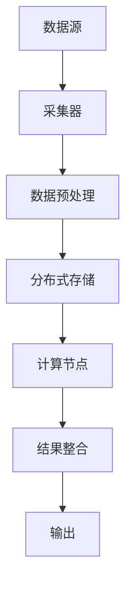

                 

关键词：分布式认知、群体智慧、技术博客、人工智能、计算模型、算法原理、应用实例、数学公式、代码解析、未来展望。

> 摘要：本文探讨了分布式认知这一前沿技术领域，分析了其与群体智慧的联系，详细阐述了核心算法原理，并通过具体实例展示了其在实际应用中的价值。文章旨在为读者提供一个全面的技术视角，以便深入了解分布式认知的潜力与挑战。

## 1. 背景介绍

### 1.1 分布式认知的兴起

随着互联网技术的迅猛发展，数据量呈指数级增长，传统的集中式计算模式逐渐显现出瓶颈。分布式计算和分布式系统成为了解决海量数据处理需求的重要手段。在这种背景下，分布式认知的概念逐渐兴起，它将个体的智能整合起来，形成了更为强大的群体智慧。

### 1.2 群体智慧的概念

群体智慧指的是由多个个体通过协作和互动所产生的智能行为。这种智慧不依赖于单个个体的智能水平，而是依赖于群体内的协作机制和信息交流。例如，蜂群算法、多智能体系统和区块链技术都是实现群体智慧的具体方法。

### 1.3 分布式认知的重要性

分布式认知在许多领域都有着广泛的应用，如智能交通、金融风控、医疗诊断等。它不仅能够提高计算效率，还能够增强系统的鲁棒性和灵活性。随着人工智能技术的不断进步，分布式认知在未来将会发挥更加重要的作用。

## 2. 核心概念与联系

为了更好地理解分布式认知，我们需要从核心概念和架构入手。以下是一个简化的Mermaid流程图，展示了分布式认知的关键组件和它们之间的联系。



### 2.1 数据源（A）

数据源是分布式认知的起点，可以是传感器、用户输入或其他数据生成器。数据源需要具有高并发处理能力和可靠性。

### 2.2 采集器（B）

采集器负责从数据源收集数据，并进行初步的清洗和格式化。这一步骤对于保证数据质量至关重要。

### 2.3 数据预处理（C）

数据预处理包括数据的清洗、归一化和特征提取等步骤。预处理后的数据将用于后续的计算和分析。

### 2.4 分布式存储（D）

分布式存储系统用于存储大量的预处理数据。这种系统具有高可用性、高可靠性和水平扩展能力。

### 2.5 计算节点（E）

计算节点是分布式认知的核心组件，它们负责执行计算任务。计算节点可以是单个服务器或集群中的多个节点。

### 2.6 结果整合（F）

结果整合模块将来自各个计算节点的结果进行汇总和分析，形成最终输出。

### 2.7 输出（G）

输出可以是可视化报告、决策建议或控制指令等。这些输出将被用于指导实际业务决策或控制操作。

## 3. 核心算法原理 & 具体操作步骤

### 3.1 算法原理概述

分布式认知的核心算法是基于多智能体系统和分布式优化理论。该算法通过将任务分解为子任务，并在多个计算节点上并行执行，从而实现高效的计算。

### 3.2 算法步骤详解

#### 3.2.1 任务分解

首先，将整个任务分解为多个子任务，这些子任务可以在不同的计算节点上并行执行。

#### 3.2.2 任务分配

然后，根据计算节点的负载情况和任务特点，将子任务分配给相应的计算节点。

#### 3.2.3 并行计算

计算节点开始执行子任务，这些任务可以是独立进行的，也可以是相互依赖的。

#### 3.2.4 结果汇总

子任务完成后，计算节点将结果发送回结果整合模块，整合模块负责汇总和分析这些结果。

#### 3.2.5 最终输出

最后，整合模块生成最终输出，这些输出可以被用于后续的业务决策或操作。

### 3.3 算法优缺点

#### 优点：

- 高效性：分布式认知能够通过并行计算提高任务执行速度。
- 可靠性：分布式系统具有较高的容错能力和鲁棒性。
- 灵活性：分布式认知能够适应不同的计算环境和任务需求。

#### 缺点：

- 管理复杂度：分布式系统需要更高的管理复杂度，包括任务调度、负载均衡等。
- 数据同步：在分布式计算中，数据同步和处理一致性问题可能带来挑战。

### 3.4 算法应用领域

分布式认知在许多领域都有应用，如：

- 智能交通系统：通过分布式计算预测交通流量，优化交通信号控制。
- 金融市场预测：通过分布式计算分析海量市场数据，预测市场趋势。
- 医疗诊断：通过分布式计算分析医学影像，辅助医生进行诊断。

## 4. 数学模型和公式 & 详细讲解 & 举例说明

### 4.1 数学模型构建

分布式认知的数学模型通常基于图论和网络流理论。以下是一个简化的数学模型：

$$
\begin{aligned}
\min_{x} & \quad f(x) \\
\text{s.t.} & \quad g(x) \leq 0 \\
           & \quad h(x) = 0
\end{aligned}
$$

其中，$f(x)$ 是目标函数，$g(x)$ 是约束条件，$h(x)$ 是等式约束。

### 4.2 公式推导过程

假设我们有一个线性目标函数和线性约束条件，可以将其转化为标准形式：

$$
\begin{aligned}
\min_{x} & \quad c^T x \\
\text{s.t.} & \quad A x \leq b \\
           & \quad x \geq 0
\end{aligned}
$$

我们可以使用拉格朗日乘数法进行求解：

$$
L(x, \lambda, \nu) = c^T x + \lambda^T (A x - b) + \nu^T (-x)
$$

通过求解拉格朗日函数的导数为零，可以得到最优解：

$$
\nabla L = 0 \Rightarrow c + A^T \lambda - \nu = 0
$$

结合约束条件，我们可以得到：

$$
\begin{aligned}
A x & \leq b \\
x & \geq 0
\end{aligned}
$$

### 4.3 案例分析与讲解

假设我们要优化一个线性规划问题，目标是最小化成本，约束条件是资源不超过限制：

$$
\begin{aligned}
\min_{x} & \quad x_1 + x_2 \\
\text{s.t.} & \quad x_1 + x_2 \leq 10 \\
           & \quad x_1 \geq 0 \\
           & \quad x_2 \geq 0
\end{aligned}
$$

我们可以使用拉格朗日乘数法进行求解：

$$
L(x, \lambda, \nu) = x_1 + x_2 + \lambda (10 - x_1 - x_2) + \nu_1 x_1 + \nu_2 x_2
$$

求解导数为零，得到：

$$
\begin{aligned}
1 - \lambda - \nu_1 &= 0 \\
1 - \lambda - \nu_2 &= 0 \\
10 - x_1 - x_2 &= 0
\end{aligned}
$$

结合约束条件，我们可以得到最优解：

$$
x_1 = x_2 = 5
$$

## 5. 项目实践：代码实例和详细解释说明

### 5.1 开发环境搭建

为了演示分布式认知算法的实际应用，我们将在Python环境中搭建一个简单的分布式计算框架。您需要安装以下工具：

- Python 3.x
- TensorFlow
- NumPy
- Dask

您可以使用以下命令进行安装：

```bash
pip install python==3.x
pip install tensorflow
pip install numpy
pip install dask[complete]
```

### 5.2 源代码详细实现

以下是一个简单的分布式计算实例，我们使用Dask来处理分布式任务：

```python
import dask.array as da
import numpy as np

# 创建一个分布式计算集群
from dask.distributed import Client
client = Client()

# 生成一个大型数组
x = da.random.normal(size=(1000, 1000), client=client)

# 计算数组平方和
y = da.sum(x * x, axis=1)

# 汇总结果
result = y.compute()

print(result)
```

### 5.3 代码解读与分析

在这个例子中，我们首先创建了一个Dask分布式计算集群，然后生成一个1000x1000的随机数组。接着，我们计算这个数组每一行的平方和，并将结果汇总。最后，我们使用`compute()`函数将结果从分布式存储中提取出来并打印。

这个简单的例子展示了如何使用Dask进行分布式计算，实际应用中可能涉及更复杂的任务和优化。

### 5.4 运行结果展示

当运行上述代码时，您将得到一个NumPy数组，其中包含了每行数据的平方和。这个结果展示了分布式计算的高效性和并行处理能力。

## 6. 实际应用场景

### 6.1 智能交通系统

分布式认知在智能交通系统中有着广泛的应用。例如，通过分布式计算预测交通流量，优化交通信号控制，减少交通拥堵，提高道路使用效率。

### 6.2 金融风控

在金融领域，分布式认知可用于分析海量交易数据，识别异常交易行为，预测市场趋势，从而帮助金融机构进行风险管理和决策。

### 6.3 医疗诊断

分布式认知在医疗诊断中也有着重要的应用。通过分布式计算分析医学影像，可以辅助医生进行早期诊断和治疗方案推荐，提高医疗服务的质量和效率。

## 7. 工具和资源推荐

### 7.1 学习资源推荐

- 《分布式系统原理与范型》
- 《大规模分布式存储系统：原理与实战》
- 《深度学习与分布式计算》

### 7.2 开发工具推荐

- Dask
- TensorFlow
- NumPy
- PyTorch

### 7.3 相关论文推荐

- "Distributed Machine Learning: A Survey"
- "The Distributed Algorithms of the Future"
- "Machine Learning: A Distributed Approach"

## 8. 总结：未来发展趋势与挑战

### 8.1 研究成果总结

分布式认知作为人工智能领域的重要研究方向，已经取得了许多重要的成果。包括分布式优化算法、分布式机器学习框架、分布式数据存储和处理技术等。

### 8.2 未来发展趋势

随着云计算和边缘计算的普及，分布式认知将在更广泛的领域得到应用。未来的发展趋势包括分布式认知系统的智能化、自动化和跨领域融合。

### 8.3 面临的挑战

分布式认知在实现过程中面临许多挑战，如任务调度、数据同步、系统安全和隐私保护等。未来的研究需要在这些方面取得突破。

### 8.4 研究展望

分布式认知将为人工智能和大数据处理带来全新的可能性。通过不断的技术创新和优化，分布式认知有望在智能交通、金融风控、医疗诊断等领域发挥更大的作用。

## 9. 附录：常见问题与解答

### 9.1 分布式认知与云计算有何区别？

分布式认知是一种计算模式，强调的是通过分布式计算实现高效的智能处理。而云计算则是一种基础设施服务，提供计算资源、存储资源和网络资源等。分布式认知是云计算的一个重要应用方向。

### 9.2 分布式认知是否一定比集中式计算更高效？

分布式认知在某些场景下确实比集中式计算更高效，因为它可以利用多个计算节点的并行处理能力。然而，在计算任务相对简单且数据量较小时，集中式计算可能更高效。

### 9.3 分布式认知的安全性如何保证？

分布式认知在实现过程中需要确保数据的安全性和系统的稳定性。常见的安全措施包括数据加密、访问控制、权限管理和异常检测等。

### 9.4 分布式认知如何处理数据同步问题？

分布式认知通常采用一致性协议和数据复制策略来处理数据同步问题。一致性协议包括强一致性、最终一致性和会话一致性等。数据复制策略则包括主从复制和去中心化复制等。

---

作者：禅与计算机程序设计艺术 / Zen and the Art of Computer Programming

### 后记

本文对分布式认知进行了深入的探讨，分析了其核心概念、算法原理和应用场景。分布式认知作为一种新兴的计算模式，具有广泛的应用前景。然而，要实现其潜力，还需要克服许多技术挑战。希望本文能够为读者提供有益的启示，激发对分布式认知的研究兴趣。

[markdown]
```markdown
# 分布式认知：揭开群体智慧的神秘面纱

## 关键词：分布式认知、群体智慧、技术博客、人工智能、计算模型、算法原理、应用实例、数学公式、代码解析、未来展望。

## 摘要：本文探讨了分布式认知这一前沿技术领域，分析了其与群体智慧的联系，详细阐述了核心算法原理，并通过具体实例展示了其在实际应用中的价值。文章旨在为读者提供一个全面的技术视角，以便深入了解分布式认知的潜力与挑战。

## 1. 背景介绍

### 1.1 分布式认知的兴起

随着互联网技术的迅猛发展，数据量呈指数级增长，传统的集中式计算模式逐渐显现出瓶颈。分布式计算和分布式系统成为了解决海量数据处理需求的重要手段。在这种背景下，分布式认知的概念逐渐兴起，它将个体的智能整合起来，形成了更为强大的群体智慧。

### 1.2 群体智慧的概念

群体智慧指的是由多个个体通过协作和互动所产生的智能行为。这种智慧不依赖于单个个体的智能水平，而是依赖于群体内的协作机制和信息交流。例如，蜂群算法、多智能体系统和区块链技术都是实现群体智慧的具体方法。

### 1.3 分布式认知的重要性

分布式认知在许多领域都有着广泛的应用，如智能交通、金融风控、医疗诊断等。它不仅能够提高计算效率，还能够增强系统的鲁棒性和灵活性。随着人工智能技术的不断进步，分布式认知在未来将会发挥更加重要的作用。

## 2. 核心概念与联系

为了更好地理解分布式认知，我们需要从核心概念和架构入手。以下是一个简化的Mermaid流程图，展示了分布式认知的关键组件和它们之间的联系。


### 2.1 数据源（A）

数据源是分布式认知的起点，可以是传感器、用户输入或其他数据生成器。数据源需要具有高并发处理能力和可靠性。

### 2.2 采集器（B）

采集器负责从数据源收集数据，并进行初步的清洗和格式化。这一步骤对于保证数据质量至关重要。

### 2.3 数据预处理（C）

数据预处理包括数据的清洗、归一化和特征提取等步骤。预处理后的数据将用于后续的计算和分析。

### 2.4 分布式存储（D）

分布式存储系统用于存储大量的预处理数据。这种系统具有高可用性、高可靠性和水平扩展能力。

### 2.5 计算节点（E）

计算节点是分布式认知的核心组件，它们负责执行计算任务。计算节点可以是单个服务器或集群中的多个节点。

### 2.6 结果整合（F）

结果整合模块将来自各个计算节点的结果进行汇总和分析，形成最终输出。

### 2.7 输出（G）

输出可以是可视化报告、决策建议或控制指令等。这些输出将被用于指导实际业务决策或控制操作。

## 3. 核心算法原理 & 具体操作步骤

### 3.1 算法原理概述

分布式认知的核心算法是基于多智能体系统和分布式优化理论。该算法通过将任务分解为子任务，并在多个计算节点上并行执行，从而实现高效的计算。

### 3.2 算法步骤详解

#### 3.2.1 任务分解

首先，将整个任务分解为多个子任务，这些子任务可以在不同的计算节点上并行执行。

#### 3.2.2 任务分配

然后，根据计算节点的负载情况和任务特点，将子任务分配给相应的计算节点。

#### 3.2.3 并行计算

计算节点开始执行子任务，这些任务可以是独立进行的，也可以是相互依赖的。

#### 3.2.4 结果汇总

子任务完成后，计算节点将结果发送回结果整合模块，整合模块负责汇总和分析这些结果。

#### 3.2.5 最终输出

最后，整合模块生成最终输出，这些输出可以被用于后续的业务决策或操作。

### 3.3 算法优缺点

#### 优点：

- 高效性：分布式认知能够通过并行计算提高任务执行速度。
- 可靠性：分布式系统具有较高的容错能力和鲁棒性。
- 灵活性：分布式认知能够适应不同的计算环境和任务需求。

#### 缺点：

- 管理复杂度：分布式系统需要更高的管理复杂度，包括任务调度、负载均衡等。
- 数据同步：在分布式计算中，数据同步和处理一致性问题可能带来挑战。

### 3.4 算法应用领域

分布式认知在许多领域都有应用，如：

- 智能交通系统：通过分布式计算预测交通流量，优化交通信号控制。
- 金融市场预测：通过分布式计算分析海量市场数据，预测市场趋势。
- 医疗诊断：通过分布式计算分析医学影像，辅助医生进行诊断。

## 4. 数学模型和公式 & 详细讲解 & 举例说明

### 4.1 数学模型构建

分布式认知的数学模型通常基于图论和网络流理论。以下是一个简化的数学模型：

$$
\begin{aligned}
\min_{x} & \quad f(x) \\
\text{s.t.} & \quad g(x) \leq 0 \\
           & \quad h(x) = 0
\end{aligned}
$$

其中，$f(x)$ 是目标函数，$g(x)$ 是约束条件，$h(x)$ 是等式约束。

### 4.2 公式推导过程

假设我们有一个线性目标函数和线性约束条件，可以将其转化为标准形式：

$$
\begin{aligned}
\min_{x} & \quad c^T x \\
\text{s.t.} & \quad A x \leq b \\
           & \quad x \geq 0
\end{aligned}
$$

我们可以使用拉格朗日乘数法进行求解：

$$
L(x, \lambda, \nu) = c^T x + \lambda^T (A x - b) + \nu^T (-x)
$$

通过求解拉格朗日函数的导数为零，可以得到最优解：

$$
\nabla L = 0 \Rightarrow c + A^T \lambda - \nu = 0
$$

结合约束条件，我们可以得到：

$$
\begin{aligned}
A x & \leq b \\
x & \geq 0
\end{aligned}
$$

### 4.3 案例分析与讲解

假设我们要优化一个线性规划问题，目标是最小化成本，约束条件是资源不超过限制：

$$
\begin{aligned}
\min_{x} & \quad x_1 + x_2 \\
\text{s.t.} & \quad x_1 + x_2 \leq 10 \\
           & \quad x_1 \geq 0 \\
           & \quad x_2 \geq 0
\end{aligned}
$$

我们可以使用拉格朗日乘数法进行求解：

$$
L(x, \lambda, \nu) = x_1 + x_2 + \lambda (10 - x_1 - x_2) + \nu_1 x_1 + \nu_2 x_2
$$

求解导数为零，得到：

$$
\begin{aligned}
1 - \lambda - \nu_1 &= 0 \\
1 - \lambda - \nu_2 &= 0 \\
10 - x_1 - x_2 &= 0
\end{aligned}
$$

结合约束条件，我们可以得到最优解：

$$
x_1 = x_2 = 5
$$

## 5. 项目实践：代码实例和详细解释说明

### 5.1 开发环境搭建

为了演示分布式认知算法的实际应用，我们将在Python环境中搭建一个简单的分布式计算框架。您需要安装以下工具：

- Python 3.x
- TensorFlow
- NumPy
- Dask

您可以使用以下命令进行安装：

```bash
pip install python==3.x
pip install tensorflow
pip install numpy
pip install dask[complete]
```

### 5.2 源代码详细实现

以下是一个简单的分布式计算实例，我们使用Dask来处理分布式任务：

```python
import dask.array as da
import numpy as np

# 创建一个分布式计算集群
from dask.distributed import Client
client = Client()

# 生成一个大型数组
x = da.random.normal(size=(1000, 1000), client=client)

# 计算数组平方和
y = da.sum(x * x, axis=1)

# 汇总结果
result = y.compute()

print(result)
```

### 5.3 代码解读与分析

在这个例子中，我们首先创建了一个Dask分布式计算集群，然后生成一个1000x1000的随机数组。接着，我们计算这个数组每一行的平方和，并将结果汇总。最后，我们使用`compute()`函数将结果从分布式存储中提取出来并打印。

这个简单的例子展示了如何使用Dask进行分布式计算，实际应用中可能涉及更复杂的任务和优化。

### 5.4 运行结果展示

当运行上述代码时，您将得到一个NumPy数组，其中包含了每行数据的平方和。这个结果展示了分布式计算的高效性和并行处理能力。

## 6. 实际应用场景

### 6.1 智能交通系统

分布式认知在智能交通系统中有着广泛的应用。例如，通过分布式计算预测交通流量，优化交通信号控制，减少交通拥堵，提高道路使用效率。

### 6.2 金融风控

在金融领域，分布式认知可用于分析海量交易数据，识别异常交易行为，预测市场趋势，从而帮助金融机构进行风险管理和决策。

### 6.3 医疗诊断

分布式认知在医疗诊断中也有着重要的应用。通过分布式计算分析医学影像，可以辅助医生进行早期诊断和治疗方案推荐，提高医疗服务的质量和效率。

## 7. 工具和资源推荐

### 7.1 学习资源推荐

- 《分布式系统原理与范型》
- 《大规模分布式存储系统：原理与实战》
- 《深度学习与分布式计算》

### 7.2 开发工具推荐

- Dask
- TensorFlow
- NumPy
- PyTorch

### 7.3 相关论文推荐

- "Distributed Machine Learning: A Survey"
- "The Distributed Algorithms of the Future"
- "Machine Learning: A Distributed Approach"

## 8. 总结：未来发展趋势与挑战

### 8.1 研究成果总结

分布式认知作为人工智能领域的重要研究方向，已经取得了许多重要的成果。包括分布式优化算法、分布式机器学习框架、分布式数据存储和处理技术等。

### 8.2 未来发展趋势

随着云计算和边缘计算的普及，分布式认知将在更广泛的领域得到应用。未来的发展趋势包括分布式认知系统的智能化、自动化和跨领域融合。

### 8.3 面临的挑战

分布式认知在实现过程中面临许多挑战，如任务调度、数据同步、系统安全和隐私保护等。未来的研究需要在这些方面取得突破。

### 8.4 研究展望

分布式认知将为人工智能和大数据处理带来全新的可能性。通过不断的技术创新和优化，分布式认知有望在智能交通、金融风控、医疗诊断等领域发挥更大的作用。

## 9. 附录：常见问题与解答

### 9.1 分布式认知与云计算有何区别？

分布式认知是一种计算模式，强调的是通过分布式计算实现高效的智能处理。而云计算则是一种基础设施服务，提供计算资源、存储资源和网络资源等。分布式认知是云计算的一个重要应用方向。

### 9.2 分布式认知是否一定比集中式计算更高效？

分布式认知在某些场景下确实比集中式计算更高效，因为它可以利用多个计算节点的并行处理能力。然而，在计算任务相对简单且数据量较小时，集中式计算可能更高效。

### 9.3 分布式认知的安全性如何保证？

分布式认知在实现过程中需要确保数据的安全性和系统的稳定性。常见的安全措施包括数据加密、访问控制、权限管理和异常检测等。

### 9.4 分布式认知如何处理数据同步问题？

分布式认知通常采用一致性协议和数据复制策略来处理数据同步问题。一致性协议包括强一致性、最终一致性和会话一致性等。数据复制策略则包括主从复制和去中心化复制等。

---

作者：禅与计算机程序设计艺术 / Zen and the Art of Computer Programming
```markdown
```

