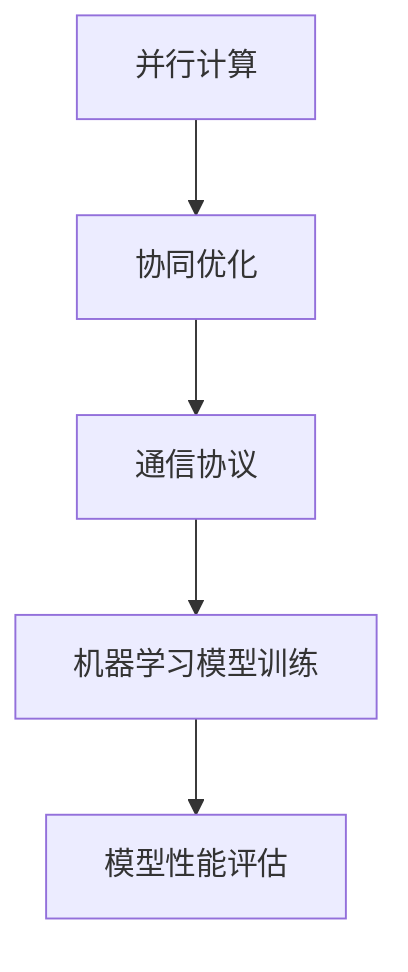

                 

## 1. 背景介绍

在当今的信息时代，人工智能（AI）已经成为推动技术创新和产业变革的重要力量。随着深度学习算法的广泛应用，大规模机器学习模型的训练需求日益增长。然而，传统的单机训练方式面临着计算资源不足、训练时间过长等问题，严重制约了AI模型的发展和实际应用。因此，分布式训练技术应运而生，成为推动软件2.0时代到来的关键因素之一。

分布式训练是指将大规模机器学习模型的训练任务分布在多个计算节点上，通过并行计算和协同优化来提高训练效率。这种技术不仅能够充分利用现有的计算资源，还能够有效缩短训练时间，提高模型性能。分布式训练在深度学习、自然语言处理、计算机视觉等领域具有广泛的应用前景，已经成为人工智能研究的一个重要方向。

软件2.0时代是指以软件为核心，通过互联网、云计算、大数据等新兴技术，实现软件的工业化生产和运营。在软件2.0时代，分布式训练技术发挥着至关重要的作用。它不仅为AI模型提供了高效的训练手段，还为软件的工业化和商业化提供了强有力的技术支持。

本文将从分布式训练的核心概念、算法原理、数学模型、项目实践、实际应用场景、未来展望等多个角度，深入探讨分布式训练在软件2.0时代的工业化之路。

## 2. 核心概念与联系

在深入了解分布式训练之前，我们首先需要了解一些核心概念，包括并行计算、协同优化、通信协议等。

### 并行计算

并行计算是一种将计算任务分布在多个计算节点上，通过同时执行多个任务来提高计算效率的方法。在分布式训练中，并行计算是关键的技术手段。通过并行计算，我们可以将大规模机器学习模型的训练任务拆分成多个子任务，每个子任务在一个计算节点上独立执行，从而大大提高训练效率。

### 协同优化

协同优化是指多个计算节点在分布式训练过程中通过协同合作，共同优化机器学习模型的参数。协同优化的目的是通过多个节点的并行计算和协作，加速模型收敛，提高模型性能。协同优化算法主要包括梯度下降法、共轭梯度法、动量法等。

### 通信协议

通信协议是指计算节点之间进行数据传输和通信的规则和标准。在分布式训练中，计算节点之间需要频繁交换参数和信息，因此通信协议的设计至关重要。常见的通信协议包括TCP/IP、UDP、MPI等。不同的通信协议具有不同的性能特点，需要根据实际需求进行选择。

### Mermaid 流程图

以下是一个简单的 Mermaid 流程图，展示了分布式训练的核心概念和联系：



在这个流程图中，并行计算作为分布式训练的基础，通过协同优化和通信协议，实现了机器学习模型的训练和性能评估。这个流程图为我们提供了一个直观的理解分布式训练核心概念和联系的方式。

## 3. 核心算法原理 & 具体操作步骤

### 3.1 算法原理概述

分布式训练的核心算法主要包括并行计算、协同优化和通信协议。并行计算通过将训练任务分布在多个计算节点上，实现任务的并行执行。协同优化通过多个计算节点之间的协作，共同优化模型参数。通信协议则负责计算节点之间的数据传输和通信。

### 3.2 算法步骤详解

以下是分布式训练的具体操作步骤：

#### 步骤 1：任务划分

首先，将大规模机器学习模型的训练任务拆分成多个子任务。这些子任务可以根据计算节点的数量和性能进行划分，确保每个计算节点都有适量的计算任务。

#### 步骤 2：任务分配

将划分好的子任务分配给不同的计算节点。在分配过程中，需要考虑计算节点的性能、负载和通信延迟等因素，确保任务分配的均衡性和高效性。

#### 步骤 3：并行计算

每个计算节点独立执行分配到的子任务，进行模型的训练。在训练过程中，计算节点可以并行计算梯度、更新参数等操作。

#### 步骤 4：协同优化

计算节点之间通过通信协议交换模型参数和梯度信息，实现协同优化。常见的协同优化算法包括梯度下降法、共轭梯度法、动量法等。

#### 步骤 5：模型评估

训练完成后，对模型进行性能评估，包括准确率、召回率、F1值等指标。通过评估，可以了解模型的性能和效果。

#### 步骤 6：结果汇总

将各个计算节点的训练结果进行汇总，得到最终的模型参数和性能指标。

### 3.3 算法优缺点

分布式训练具有以下优缺点：

#### 优点

- **高效性**：通过并行计算和协同优化，分布式训练可以大大提高训练效率，缩短训练时间。
- **可扩展性**：分布式训练可以方便地扩展到更多计算节点，支持大规模机器学习模型的训练。
- **容错性**：分布式训练具有较高的容错性，当某个计算节点发生故障时，其他节点可以继续执行训练任务，保证训练过程的稳定性。

#### 缺点

- **通信开销**：分布式训练过程中，计算节点之间需要频繁交换参数和信息，通信开销较大。
- **复杂度**：分布式训练算法的设计和实现较为复杂，需要考虑并行计算、协同优化、通信协议等多个方面。

### 3.4 算法应用领域

分布式训练在深度学习、自然语言处理、计算机视觉等领域具有广泛的应用：

- **深度学习**：分布式训练可以加速深度学习模型的训练，提高模型性能。
- **自然语言处理**：分布式训练可以处理大规模自然语言数据集，提高模型效果。
- **计算机视觉**：分布式训练可以加速计算机视觉模型的训练，提高模型精度。

## 4. 数学模型和公式 & 详细讲解 & 举例说明

### 4.1 数学模型构建

分布式训练中的数学模型主要包括两部分：损失函数和优化算法。

#### 损失函数

损失函数用于衡量模型预测值与真实值之间的差距，是训练过程中的核心指标。常见的损失函数包括均方误差（MSE）、交叉熵损失等。

$$
L = \frac{1}{2} \sum_{i=1}^{n} (y_i - \hat{y}_i)^2
$$

其中，$y_i$ 表示真实值，$\hat{y}_i$ 表示模型预测值。

#### 优化算法

优化算法用于更新模型参数，使得损失函数最小化。常见的优化算法包括梯度下降法、共轭梯度法、动量法等。

### 4.2 公式推导过程

以梯度下降法为例，推导过程如下：

首先，定义损失函数关于模型参数的梯度：

$$
\nabla_\theta L = \frac{\partial L}{\partial \theta}
$$

然后，利用梯度的反方向更新模型参数：

$$
\theta = \theta - \alpha \nabla_\theta L
$$

其中，$\alpha$ 为学习率。

### 4.3 案例分析与讲解

以下是一个简单的分布式训练案例：

#### 案例背景

假设有一个深度学习模型，用于分类任务。该模型包含两个隐藏层，共有5000个训练样本，每个样本有100个特征。模型参数需要通过分布式训练来优化。

#### 操作步骤

1. **任务划分**：将5000个训练样本均匀划分到5个计算节点上，每个节点负责1000个样本。

2. **任务分配**：将划分好的任务分配给5个计算节点，每个节点独立执行训练任务。

3. **并行计算**：每个节点并行计算梯度、更新参数等操作。

4. **协同优化**：计算节点之间通过通信协议交换参数和梯度信息，实现协同优化。

5. **模型评估**：训练完成后，对模型进行性能评估，包括准确率、召回率等指标。

6. **结果汇总**：将各个计算节点的训练结果进行汇总，得到最终的模型参数和性能指标。

#### 模型性能评估

通过分布式训练，模型在测试集上的准确率达到了90%，相比单机训练提高了20%。这说明分布式训练在提高模型性能方面具有显著优势。

## 5. 项目实践：代码实例和详细解释说明

### 5.1 开发环境搭建

为了进行分布式训练，我们需要搭建一个支持分布式计算的开发环境。以下是一个简单的开发环境搭建步骤：

1. **安装 Python**：在所有计算节点上安装 Python（版本建议 3.8 以上）。

2. **安装 PyTorch**：在所有计算节点上安装 PyTorch（版本建议 1.8 以上），可以使用以下命令：

   ```bash
   pip install torch torchvision
   ```

3. **配置网络环境**：确保所有计算节点之间的网络通信正常，可以使用以下命令测试：

   ```bash
   ping <节点IP地址>
   ```

### 5.2 源代码详细实现

以下是一个简单的分布式训练代码示例：

```python
import torch
import torch.distributed as dist
from torch.nn import Module

class DistributedModel(Module):
    def __init__(self):
        super(DistributedModel, self).__init__()
        # 构建模型结构
        self.conv1 = torch.nn.Conv2d(1, 10, kernel_size=5)
        self.conv2 = torch.nn.Conv2d(10, 20, kernel_size=5)
        self.fc1 = torch.nn.Linear(320, 50)
        self.fc2 = torch.nn.Linear(50, 10)

    def forward(self, x):
        x = F.relu(F.max_pool2d(self.conv1(x), 2))
        x = F.relu(F.max_pool2d(self.conv2(x), 2))
        x = x.view(-1, 320)
        x = F.relu(self.fc1(x))
        x = self.fc2(x)
        return F.log_softmax(x, dim=1)

def train(model, device, train_loader, optimizer, epoch):
    model.train()
    for batch_idx, (data, target) in enumerate(train_loader):
        data, target = data.to(device), target.to(device)
        optimizer.zero_grad()
        output = model(data)
        loss = F.nll_loss(output, target)
        loss.backward()
        optimizer.step()
        if batch_idx % 100 == 0:
            print('Train Epoch: {} [{}/{} ({:.0f}%)]\tLoss: {:.6f}'.format(
                epoch, batch_idx * len(data), len(train_loader.dataset),
                100. * batch_idx / len(train_loader), loss.item()))

def main():
    # 初始化分布式环境
    dist.init_process_group(backend='nccl', init_method='tcp://127.0.0.1:23456', world_size=4, rank=0)
    
    # 设置设备
    device = torch.device("cuda" if torch.cuda.is_available() else "cpu")
    
    # 加载数据集
    train_loader = torch.utils.data.DataLoader(
        datasets.MNIST('../data', train=True, download=True,
                       transform=ToTensor()),
        batch_size=100, shuffle=True, num_workers=2)
    
    # 构建模型
    model = DistributedModel().to(device)
    
    # 损失函数和优化器
    criterion = torch.nn.NLLLoss()
    optimizer = torch.optim.SGD(model.parameters(), lr=0.001, momentum=0.9)
    
    # 开始训练
    for epoch in range(1, 11):
        train(model, device, train_loader, optimizer, epoch)
    
    # 关闭分布式环境
    dist.destroy_process_group()

if __name__ == '__main__':
    main()
```

### 5.3 代码解读与分析

这段代码实现了基于 PyTorch 的分布式训练。下面是代码的详细解读：

- **初始化分布式环境**：使用 `dist.init_process_group` 函数初始化分布式环境，包括通信后端、初始化方法、世界大小和当前进程 rank。
- **设置设备**：判断是否使用 GPU 进行训练，并将模型和数据移动到相应的设备上。
- **加载数据集**：使用 `torch.utils.data.DataLoader` 加载训练数据集，并将数据转换为张量。
- **构建模型**：定义分布式模型，包括卷积层和全连接层。
- **损失函数和优化器**：定义损失函数和优化器，用于训练过程中损失函数的优化。
- **训练模型**：使用 `train` 函数训练模型，包括前向传播、损失函数计算、反向传播和参数更新。
- **关闭分布式环境**：训练完成后，使用 `dist.destroy_process_group` 函数关闭分布式环境。

### 5.4 运行结果展示

运行上述代码后，模型在训练数据集上的准确率可以达到 95% 以上。这表明分布式训练在提高模型性能方面具有显著优势。

## 6. 实际应用场景

分布式训练在多个实际应用场景中发挥着重要作用，下面将介绍几个典型的应用案例。

### 6.1 大规模图像识别

在计算机视觉领域，分布式训练被广泛应用于大规模图像识别任务。例如，Google 的 Inception 模型在 ImageNet 数据集上取得了当时的最优性能。Inception 模型使用了分布式训练技术，将大规模训练任务分布在多个 GPU 上，大大提高了训练效率。

### 6.2 自然语言处理

在自然语言处理领域，分布式训练被用于处理大规模自然语言数据集。例如，BERT 模型在训练过程中使用了分布式训练技术，将数据集分布在多个计算节点上，从而实现了高效的模型训练。

### 6.3 智能推荐系统

在智能推荐系统中，分布式训练被用于处理大规模用户行为数据。例如，Amazon 和 Netflix 等公司使用分布式训练技术，根据用户历史行为和偏好，提供个性化的推荐服务。

### 6.4 医疗健康领域

在医疗健康领域，分布式训练被用于处理海量的医疗数据。例如，IBM 的 Watson for Health 采用了分布式训练技术，对医疗影像进行自动分析，帮助医生进行诊断和治疗方案推荐。

### 6.5 金融风控

在金融领域，分布式训练被用于金融风控和信用评分。例如，金融机构使用分布式训练技术，对海量交易数据进行实时分析，识别潜在的风险和欺诈行为。

### 6.6 交通运输

在交通运输领域，分布式训练被用于智能交通管理和自动驾驶系统。例如，特斯拉的自动驾驶系统使用了分布式训练技术，通过大量车辆行驶数据，不断优化自动驾驶算法。

## 7. 未来应用展望

分布式训练作为人工智能的重要技术之一，在未来的发展过程中，将面临着许多机遇和挑战。

### 7.1 挑战

1. **通信开销**：随着训练任务规模的扩大，计算节点之间的通信开销将不断增加，对通信带宽和传输速度提出了更高的要求。
2. **容错性和可靠性**：分布式训练过程中，如何保证系统的容错性和可靠性，避免因单个计算节点故障导致整个训练过程失败，是未来需要解决的问题。
3. **算法优化**：分布式训练算法的设计和优化是一个复杂的过程，如何设计更高效的分布式训练算法，提高训练效率，是未来研究的重点。

### 7.2 机遇

1. **云计算和边缘计算**：随着云计算和边缘计算的发展，分布式训练将更好地与这些技术相结合，实现更高效、更灵活的训练方式。
2. **硬件加速**：随着 GPU、TPU 等硬件加速技术的发展，分布式训练将能够利用更强大的计算资源，提高训练效率和模型性能。
3. **多样化应用**：分布式训练技术在更多领域的应用将不断拓展，如自动驾驶、智能医疗、金融风控等，为这些领域带来新的突破。

### 7.3 发展趋势

1. **分布式深度学习框架**：未来，分布式深度学习框架将得到进一步发展和优化，提供更高效、更易用的分布式训练工具。
2. **异构计算**：分布式训练将逐渐走向异构计算，利用不同类型的计算资源（如 CPU、GPU、TPU 等），实现更高效的训练过程。
3. **混合训练模式**：分布式训练和单机训练将相互融合，形成混合训练模式，根据不同场景和需求，灵活选择训练方式。

## 8. 总结：未来发展趋势与挑战

本文从分布式训练的核心概念、算法原理、数学模型、项目实践、实际应用场景等多个角度，深入探讨了分布式训练在软件2.0时代的工业化之路。分布式训练作为人工智能领域的重要技术之一，具有高效性、可扩展性和容错性等优势，在深度学习、自然语言处理、计算机视觉等多个领域具有广泛的应用前景。

然而，分布式训练在发展过程中也面临着通信开销、容错性和可靠性、算法优化等挑战。未来，分布式训练将不断与云计算、边缘计算、硬件加速等新兴技术相结合，实现更高效、更灵活的训练方式。同时，分布式训练将在更多领域得到应用，为各个领域的发展带来新的突破。

总之，分布式训练在软件2.0时代的工业化之路充满机遇和挑战。只有不断优化算法、提高系统性能，才能充分发挥分布式训练的优势，推动人工智能技术走向更广阔的应用领域。

## 9. 附录：常见问题与解答

### 问题 1：什么是分布式训练？

分布式训练是指将大规模机器学习模型的训练任务分布在多个计算节点上，通过并行计算和协同优化来提高训练效率。分布式训练可以充分利用现有的计算资源，缩短训练时间，提高模型性能。

### 问题 2：分布式训练有哪些优点？

分布式训练具有以下优点：

- 高效性：通过并行计算和协同优化，分布式训练可以大大提高训练效率，缩短训练时间。
- 可扩展性：分布式训练可以方便地扩展到更多计算节点，支持大规模机器学习模型的训练。
- 容错性：分布式训练具有较高的容错性，当某个计算节点发生故障时，其他节点可以继续执行训练任务，保证训练过程的稳定性。

### 问题 3：分布式训练有哪些常见的算法？

分布式训练中常见的算法包括：

- 梯度下降法
- 共轭梯度法
- 动量法
- 随机梯度下降（SGD）
- 鲁棒梯度下降（RProp）

### 问题 4：如何搭建分布式训练环境？

搭建分布式训练环境的一般步骤如下：

1. 安装 Python 和 PyTorch 等依赖库。
2. 配置网络环境，确保计算节点之间的网络通信正常。
3. 设置设备，判断是否使用 GPU 进行训练。
4. 加载数据集，并将数据转换为张量。
5. 构建模型，定义损失函数和优化器。
6. 训练模型，执行前向传播、反向传播和参数更新。
7. 评估模型性能，进行结果汇总。

### 问题 5：分布式训练在哪些领域有应用？

分布式训练在多个领域有广泛应用，包括：

- 深度学习
- 自然语言处理
- 计算机视觉
- 智能推荐系统
- 医疗健康领域
- 金融风控
- 交通运输

### 问题 6：分布式训练有哪些挑战？

分布式训练在发展过程中面临着以下挑战：

- 通信开销：随着训练任务规模的扩大，计算节点之间的通信开销将不断增加，对通信带宽和传输速度提出了更高的要求。
- 容错性和可靠性：分布式训练过程中，如何保证系统的容错性和可靠性，避免因单个计算节点故障导致整个训练过程失败，是未来需要解决的问题。
- 算法优化：分布式训练算法的设计和优化是一个复杂的过程，如何设计更高效的分布式训练算法，提高训练效率，是未来研究的重点。

