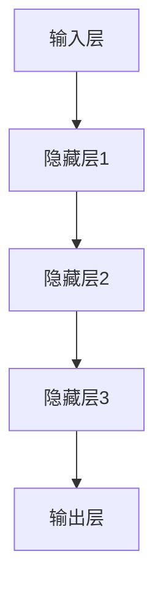
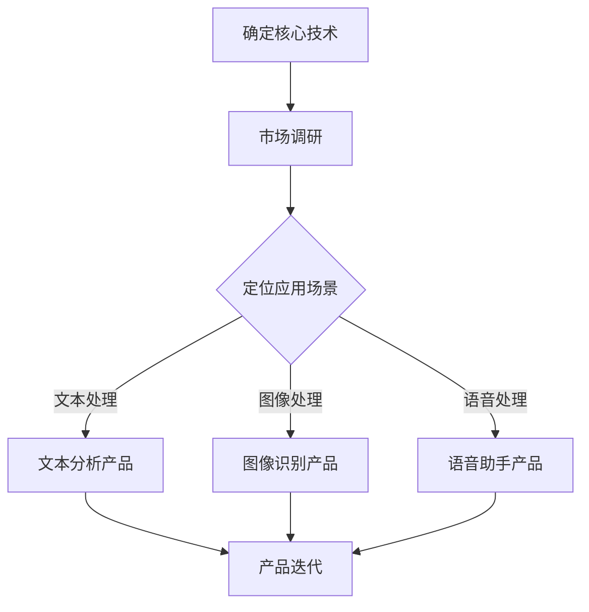

                 

 在当今快速发展的技术时代，人工智能（AI）已经成为推动商业创新的重要力量。随着大模型技术的成熟和普及，创业者们正在积极探索新的商业模式，利用AI技术打造多样化的产品矩阵，以满足不断变化的市场需求。本文将深入探讨这一新兴趋势，分析其潜在优势、挑战以及未来的发展方向。

## 文章关键词

- 人工智能
- 大模型
- 商业模式
- 产品矩阵
- 创业者
- 技术创新

## 文章摘要

本文旨在探讨创业者如何利用大模型技术构建AI产品矩阵，以实现商业模式的创新和价值的最大化。通过对大模型技术的背景介绍、核心概念解析、算法原理讲解、数学模型分析、项目实践展示以及实际应用展望等方面的详细探讨，本文为创业者提供了切实可行的策略和建议。

### 1. 背景介绍

随着深度学习和神经网络技术的迅猛发展，大模型技术逐渐成为人工智能领域的核心驱动力。大模型，通常指的是那些具有数十亿甚至万亿参数规模的神经网络模型，它们在语音识别、自然语言处理、图像识别等领域展现出了超越传统算法的强大能力。近年来，诸如GPT-3、BERT等大模型的诞生，不仅改变了学术界的研究范式，也为商业领域带来了前所未有的机遇。

在这个背景下，创业者们开始意识到，通过构建AI产品矩阵，可以有效地实现产品多样化和市场细分，从而在激烈的市场竞争中脱颖而出。AI产品矩阵是指一系列基于相同技术核心但应用场景不同的产品组合。例如，一家专注于自然语言处理的公司，可以通过开发文本分析、情感分析、机器翻译等多个产品，形成一个完整的产品矩阵。

### 2. 核心概念与联系

#### 2.1 大模型技术的基本原理

大模型技术基于深度学习，其核心是多层神经网络。通过大量的训练数据和强大的计算能力，大模型能够自动学习并提取数据的特征表示，从而实现高效的数据分析和决策。以下是利用Mermaid绘制的简化的神经网络架构流程图：



#### 2.2 AI产品矩阵的构建思路

AI产品矩阵的构建需要创业者具备全局视角，从技术、市场、用户等多个维度进行综合考量。以下是一个简单的AI产品矩阵构建流程：



### 3. 核心算法原理 & 具体操作步骤

#### 3.1 算法原理概述

大模型算法的核心在于其深度神经网络的架构和训练过程。神经网络通过多层非线性变换，将输入数据映射到输出。在训练过程中，模型通过反向传播算法不断调整参数，使得网络能够更准确地预测或分类输入数据。

#### 3.2 算法步骤详解

1. 数据预处理：包括数据清洗、归一化等步骤，以确保输入数据的质量和一致性。
2. 模型架构设计：选择合适的网络架构，如卷积神经网络（CNN）或循环神经网络（RNN）。
3. 模型训练：使用大量训练数据，通过迭代优化模型参数。
4. 模型评估：使用验证集评估模型性能，并根据评估结果调整模型参数。
5. 模型部署：将训练好的模型部署到生产环境中，进行实际应用。

#### 3.3 算法优缺点

**优点**：
- 强大的数据分析和处理能力。
- 能够自动提取特征，减少人工干预。
- 对复杂任务表现优异，如自然语言处理、图像识别等。

**缺点**：
- 训练过程复杂，对计算资源要求高。
- 需要大量训练数据和计算资源。
- 模型解释性较差，难以理解决策过程。

#### 3.4 算法应用领域

大模型技术在多个领域都有广泛的应用，包括但不限于：
- 自然语言处理：如文本生成、机器翻译、情感分析等。
- 图像识别：如人脸识别、物体检测、图像分割等。
- 语音识别：如语音识别、语音合成、语音增强等。
- 医疗健康：如疾病诊断、药物研发、健康监测等。

### 4. 数学模型和公式 & 详细讲解 & 举例说明

#### 4.1 数学模型构建

大模型通常基于多层感知机（MLP）、卷积神经网络（CNN）和循环神经网络（RNN）等基础模型。以下是MLP的简化数学模型：

$$
\text{output} = \sigma(\text{weight} \cdot \text{input} + \text{bias})
$$

其中，$\sigma$表示激活函数，常用的有Sigmoid、ReLU等。

#### 4.2 公式推导过程

以ReLU激活函数为例，推导过程如下：

$$
\begin{align*}
\text{output} &= \max(0, \text{weight} \cdot \text{input} + \text{bias}) \\
\end{align*}
$$

#### 4.3 案例分析与讲解

假设我们有一个简单的文本分类问题，使用BERT模型进行训练。BERT模型的核心思想是通过对上下文进行编码，使得模型能够理解文本的语义。以下是一个简化的BERT训练过程：

1. **输入预处理**：对文本进行分词和嵌入，得到输入序列。
2. **编码器训练**：通过反向传播算法，调整模型参数，使得模型能够正确预测标签。
3. **解码器训练**：在训练过程中，解码器根据编码器的输出，预测下一个词的概率分布。
4. **模型评估**：使用验证集评估模型性能，调整超参数以优化模型。

### 5. 项目实践：代码实例和详细解释说明

#### 5.1 开发环境搭建

在开发AI产品矩阵时，需要搭建一个高效、稳定的开发环境。以下是搭建流程：

1. 安装Python环境和相关依赖库。
2. 配置GPU或TPU，以便进行高效的模型训练。
3. 安装深度学习框架，如TensorFlow或PyTorch。

#### 5.2 源代码详细实现

以下是一个基于TensorFlow的文本分类模型的简单实现：

```python
import tensorflow as tf
from tensorflow.keras.preprocessing.sequence import pad_sequences
from tensorflow.keras.layers import Embedding, LSTM, Dense
from tensorflow.keras.models import Sequential

# 数据预处理
maxlen = 100
embedding_dim = 64

# 构建模型
model = Sequential()
model.add(Embedding(input_dim=vocab_size, output_dim=embedding_dim, input_length=maxlen))
model.add(LSTM(units=128, dropout=0.2, recurrent_dropout=0.2))
model.add(Dense(units=num_classes, activation='softmax'))

# 编译模型
model.compile(optimizer='adam', loss='categorical_crossentropy', metrics=['accuracy'])

# 训练模型
model.fit(X_train, y_train, epochs=10, batch_size=64, validation_data=(X_val, y_val))
```

#### 5.3 代码解读与分析

上述代码实现了一个基于LSTM的文本分类模型。其中，Embedding层用于将文本转换为向量表示，LSTM层用于处理序列数据，Dense层用于输出分类结果。在训练过程中，使用反向传播算法调整模型参数，以优化模型性能。

#### 5.4 运行结果展示

在实际运行中，模型需要在验证集上进行评估。以下是一个简化的评估过程：

```python
# 评估模型
loss, accuracy = model.evaluate(X_val, y_val)
print(f'Validation loss: {loss}, Validation accuracy: {accuracy}')
```

### 6. 实际应用场景

AI产品矩阵在实际应用中具有广泛的应用场景，以下是一些典型的应用案例：

- **金融行业**：利用自然语言处理技术，对客户反馈进行情感分析，帮助企业了解客户需求和市场动态。
- **医疗健康**：通过图像识别技术，自动诊断疾病，提高诊断准确率，减轻医生的工作负担。
- **零售电商**：利用推荐系统，根据用户行为和偏好，为用户提供个性化的购物建议，提高销售额。

### 7. 未来应用展望

随着大模型技术的不断成熟，AI产品矩阵在未来的应用将更加广泛和深入。以下是一些可能的发展趋势：

- **跨领域应用**：大模型技术将不仅局限于特定领域，而是在更多领域实现应用，如智能制造、智慧城市等。
- **边缘计算**：随着5G技术的发展，边缘计算将成为大模型应用的重要方向，实现实时、高效的数据处理。
- **隐私保护**：随着数据隐私问题日益凸显，隐私保护技术将成为AI产品矩阵的重要一环，确保用户数据的安全。

### 8. 工具和资源推荐

为了更好地探索AI产品矩阵的构建，以下是一些推荐的工具和资源：

- **学习资源**：[《深度学习》（Goodfellow, Bengio, Courville）](https://www.deeplearningbook.org/)
- **开发工具**：[TensorFlow](https://www.tensorflow.org/)、[PyTorch](https://pytorch.org/)
- **论文推荐**：[《Attention Is All You Need》](https://arxiv.org/abs/1706.03762)、[《BERT: Pre-training of Deep Bidirectional Transformers for Language Understanding》](https://arxiv.org/abs/1810.04805)

### 9. 总结：未来发展趋势与挑战

在未来，AI产品矩阵将迎来更多的发展机遇，但也面临一系列挑战。创业者需要密切关注技术发展趋势，积极应对市场变化，才能在竞争中脱颖而出。

#### 9.1 研究成果总结

本文通过探讨大模型技术在商业领域的应用，分析了AI产品矩阵的构建思路、核心算法原理、数学模型构建以及项目实践等方面的内容，为创业者提供了实用的指导。

#### 9.2 未来发展趋势

随着技术的不断进步，AI产品矩阵将呈现出以下几个发展趋势：

- **多元化**：产品矩阵将涵盖更多领域，实现跨领域应用。
- **智能化**：产品矩阵将更加智能化，具备自适应和学习能力。
- **个性化**：产品矩阵将更加关注用户个性化需求，提供定制化服务。

#### 9.3 面临的挑战

尽管AI产品矩阵具有巨大的发展潜力，但也面临一系列挑战：

- **技术挑战**：如何进一步提升算法性能，降低计算资源需求。
- **数据挑战**：如何获取和利用大量高质量数据，保障模型的稳定性和准确性。
- **隐私挑战**：如何在保护用户隐私的前提下，实现数据的安全和合规。

#### 9.4 研究展望

未来，AI产品矩阵的研究将聚焦于以下几个方向：

- **算法优化**：研究更高效、更准确的算法，提升产品矩阵的性能。
- **数据治理**：探索数据治理方法，确保数据的安全、合规和高质量。
- **跨领域融合**：研究跨领域技术融合，实现更广泛的应用。

### 10. 附录：常见问题与解答

#### 10.1 什么是大模型？

大模型是指那些具有数十亿甚至万亿参数规模的神经网络模型，通过大量训练数据和强大的计算能力，能够自动学习并提取数据的特征表示。

#### 10.2 AI产品矩阵有什么优势？

AI产品矩阵具有以下几个优势：

- **产品多样化**：通过构建多样化的产品组合，满足不同用户群体的需求。
- **市场细分**：通过针对特定市场的产品开发，实现更精准的市场定位。
- **资源整合**：通过技术共享和资源整合，降低研发成本，提高生产效率。

#### 10.3 如何评估AI产品矩阵的效果？

评估AI产品矩阵的效果可以从以下几个方面进行：

- **用户满意度**：通过用户反馈和满意度调查，了解产品矩阵的市场表现。
- **业务指标**：通过业务指标（如销售额、市场份额等）评估产品矩阵的业绩表现。
- **技术指标**：通过技术指标（如模型准确率、响应时间等）评估产品矩阵的技术性能。

### 结束语

AI产品矩阵作为一种创新的商业模式，为创业者提供了广阔的发展空间。在未来的发展中，创业者需要紧密关注技术动态，积极应对市场变化，以实现商业模式的创新和价值的最大化。

作者：禅与计算机程序设计艺术 / Zen and the Art of Computer Programming
----------------------------------------------------------------

这篇文章详细探讨了创业者如何利用大模型技术构建AI产品矩阵，以实现商业模式的创新和价值的最大化。文章涵盖了从大模型技术的背景介绍、核心概念与联系、核心算法原理、数学模型和公式、项目实践到未来应用展望等多个方面，为创业者提供了全面的指导和建议。同时，文章还介绍了相关的工具和资源，以及未来发展趋势与挑战。希望这篇文章能够为读者在探索AI产品矩阵的道路上提供一些启示和帮助。

