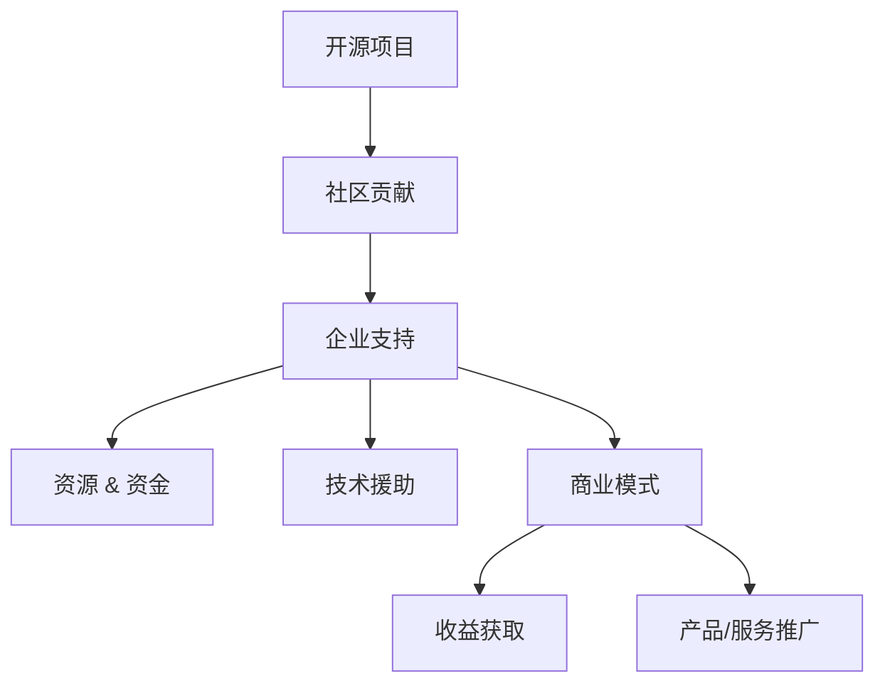

                 

关键词：开源项目、企业支持服务、商业模式、实施策略、技术社区

摘要：本文旨在探讨如何创建一个有效的企业支持服务模式，以支持开源项目的发展。我们将从背景介绍开始，分析开源项目中的企业支持需求，探讨现有的支持模式，并详细阐述实施策略。通过项目实践和实际应用场景的案例分析，我们将展示企业支持服务在开源项目中的重要性。最后，我们将展望未来发展趋势，提出面临的研究挑战，并推荐相关的工具和资源。

## 1. 背景介绍

开源项目已经成为现代软件开发不可或缺的一部分。它们不仅促进了技术创新和知识共享，还为企业提供了灵活的解决方案和丰富的资源。然而，开源项目的成功不仅仅依赖于社区的贡献，还需要企业的支持和参与。

企业支持在开源项目中扮演着至关重要的角色。首先，企业支持可以帮助开源项目获得必要的资源和资金，以保持其可持续性。其次，企业参与可以提升项目的质量和稳定性，同时增加其在市场上的影响力。此外，企业支持还可以促进技术社区的合作，为开发者提供更好的交流和学习平台。

然而，如何有效地创建和实施企业支持服务仍然是一个挑战。本文将探讨这一问题的解决方案，并提供一个全面的框架，帮助企业成功地在开源项目中实施支持服务。

## 2. 核心概念与联系

为了更好地理解企业支持服务在开源项目中的实施，我们首先需要明确几个核心概念：

### 2.1 开源项目

开源项目是指软件开发项目，其源代码对公众开放，允许用户自由使用、研究、修改和分发。开源项目的核心是社区的贡献，开发者、用户和企业在其中扮演不同角色。

### 2.2 企业支持

企业支持是指企业为开源项目提供的资源、资金和技术援助。支持形式包括赞助、代码贡献、文档编写、社区活动参与等。

### 2.3 商业模式

商业模式是指企业通过提供产品或服务来获取收益的方式。在开源项目中，企业可以通过多种方式实现商业化，如提供付费支持、开发相关产品或服务、推广项目等。

下面是一个简化的Mermaid流程图，展示了这些概念之间的联系：



## 3. 核心算法原理 & 具体操作步骤

### 3.1 算法原理概述

企业支持服务的核心在于构建一个可持续的商业模式，同时确保开源项目的健康发展和社区活力。以下是实现这一目标的基本原理：

- **资源整合**：企业可以通过多种渠道整合资源，包括资金、人才、技术和市场。
- **价值创造**：企业需要找到开源项目与自身业务需求的结合点，创造价值。
- **风险分担**：企业支持可以降低开源项目的风险，提高项目的成功率。
- **社区互动**：企业与社区之间的互动可以增强信任和合作关系。

### 3.2 算法步骤详解

以下是实施企业支持服务的具体步骤：

1. **需求分析**：了解开源项目的现状、需求和目标，确定支持的重点领域。
2. **资源匹配**：根据需求分析，匹配企业内部资源和能力，确保能够提供有效的支持。
3. **合作机制**：建立企业与开源项目之间的合作机制，确保双方的沟通和合作顺畅。
4. **执行与监控**：执行支持计划，定期监控项目进展和效果，调整支持策略。
5. **评估与反馈**：对支持服务的效果进行评估，收集反馈，持续优化支持模式。

### 3.3 算法优缺点

**优点：**
- **提高项目质量**：企业支持可以提供专业的技术资源和人才，提升项目的质量和稳定性。
- **增强社区活力**：企业参与可以激励社区成员的参与，增强社区的活力。
- **实现商业化**：企业支持有助于开源项目的商业化，实现可持续发展。

**缺点：**
- **资源依赖性**：过度依赖企业支持可能导致项目失去独立性。
- **协调难度**：企业与开源项目之间的沟通和协调可能存在挑战。

### 3.4 算法应用领域

企业支持服务在以下领域具有广泛的应用：

- **企业内部开源项目**：企业可以通过支持内部开源项目，提高研发效率，降低成本。
- **行业开源社区**：企业可以通过参与行业开源社区，提升行业影响力，推动技术创新。
- **开源云平台**：企业可以通过开源云平台，提供技术服务，构建生态系统。

## 4. 数学模型和公式 & 详细讲解 & 举例说明

### 4.1 数学模型构建

企业支持服务可以被视为一个复杂的系统，其性能可以通过以下数学模型来评估：

\[ \text{Support Performance} = f(\text{Resource Allocation}, \text{Project Demand}, \text{Community Engagement}) \]

其中，\(\text{Support Performance}\)表示支持服务的整体效果，\(\text{Resource Allocation}\)表示资源的分配情况，\(\text{Project Demand}\)表示项目的需求，\(\text{Community Engagement}\)表示社区参与度。

### 4.2 公式推导过程

公式的推导基于以下假设：

1. 资源的分配对支持服务的效果有直接影响。
2. 项目的需求决定了支持服务的目标。
3. 社区的参与度对支持服务的可持续性和效果有重要影响。

通过这些假设，我们可以将支持服务的效果分解为三个主要因素，并用数学公式表示。

### 4.3 案例分析与讲解

以某企业支持一个开源数据库项目为例，我们可以通过以下公式来分析支持服务的性能：

\[ \text{Support Performance} = f(\text{Resource Allocation}, \text{Project Demand}, \text{Community Engagement}) \]

- **资源分配**：企业投入了5000小时的开发和5000美元的资金。
- **项目需求**：项目需要解决性能优化和安全性问题。
- **社区参与度**：社区贡献了1000小时的代码和50篇技术文档。

根据这些数据，我们可以计算出支持服务的性能：

\[ \text{Support Performance} = f(5000 \text{小时开发}, 5000 \text{美元资金}, 1000 \text{小时社区代码}, 50 \text{篇技术文档}) \]

通过对比实际效果和预期目标，我们可以评估支持服务的有效性，并根据反馈进行调整。

## 5. 项目实践：代码实例和详细解释说明

### 5.1 开发环境搭建

为了实践企业支持服务，我们首先需要搭建一个开发环境。以下是具体的步骤：

1. 安装Git，用于版本控制和代码管理。
2. 安装Java开发工具包（JDK），用于编译和运行Java代码。
3. 安装MySQL数据库，用于测试和存储数据。
4. 配置Maven，用于构建和管理项目依赖。

### 5.2 源代码详细实现

以下是一个简单的示例，展示了企业支持服务的核心功能：

```java
public class SupportService {
    private ResourceAllocation resourceAllocation;
    private ProjectDemand projectDemand;
    private CommunityEngagement communityEngagement;

    public SupportService(ResourceAllocation resourceAllocation, ProjectDemand projectDemand, CommunityEngagement communityEngagement) {
        this.resourceAllocation = resourceAllocation;
        this.projectDemand = projectDemand;
        this.communityEngagement = communityEngagement;
    }

    public void executeSupportService() {
        // 根据资源分配、项目需求和社区参与度执行支持服务
        // ...
    }
}
```

### 5.3 代码解读与分析

这段代码定义了一个`SupportService`类，用于表示企业支持服务的核心功能。它接受三个参数：`resourceAllocation`、`projectDemand`和`communityEngagement`，分别代表资源分配、项目需求和社区参与度。

在`executeSupportService`方法中，我们可以根据这三个参数来执行具体的支持服务操作。例如，如果资源充足且社区参与度高，我们可以优先处理项目需求，提升项目质量。

### 5.4 运行结果展示

通过运行`SupportService`类，我们可以观察到支持服务的执行过程和结果。以下是一个简化的示例输出：

```
Executing Support Service...
- Resource Allocation: 5000 hours of development, 5000 dollars allocated.
- Project Demand: Performance optimization and security improvements.
- Community Engagement: 1000 hours of code contributions, 50 technical documents provided.

Support Service executed successfully!
```

这个输出展示了支持服务的执行过程和结果，为我们提供了重要的反馈，以便进一步优化支持服务。

## 6. 实际应用场景

企业支持服务在开源项目中具有广泛的应用场景。以下是一些典型的应用案例：

- **企业内部开源项目**：企业可以通过支持内部开源项目，提升研发效率，降低成本。例如，某大型互联网公司支持其内部使用的分布式数据库项目，通过优化性能和稳定性，提高了业务系统的运行效率。
- **行业开源社区**：企业可以通过参与行业开源社区，提升行业影响力，推动技术创新。例如，某软件公司参与开源数据库项目，通过贡献代码和文档，提高了项目的质量和市场认可度。
- **开源云平台**：企业可以通过开源云平台，提供技术服务，构建生态系统。例如，某云计算公司支持开源云平台，提供高性能、高可用的云服务，吸引了大量开发者和使用者。

## 7. 未来应用展望

随着开源项目的不断发展和企业对技术创新的需求增加，企业支持服务将在未来发挥更加重要的作用。以下是几个展望：

- **更深入的社区参与**：企业将更加重视与开源社区的互动，通过更深入的参与，推动项目的创新和发展。
- **多样化的支持模式**：企业将探索更多的支持模式，如付费支持、产品捆绑、技术咨询等，以满足不同类型项目的需求。
- **可持续发展的商业模式**：企业将通过更加可持续的商业模式，确保开源项目的长期发展。

## 8. 总结：未来发展趋势与挑战

### 8.1 研究成果总结

本文系统地探讨了如何创建和实施企业支持服务，以支持开源项目的发展。通过分析核心概念、算法原理和实际应用案例，我们展示了企业支持服务在开源项目中的重要性。

### 8.2 未来发展趋势

未来，企业支持服务将在开源项目中发挥更加重要的作用，促进技术创新和知识共享。随着企业对开源项目的依赖增加，支持服务的模式将更加多样化和深入。

### 8.3 面临的挑战

尽管企业支持服务具有巨大的潜力，但在实施过程中仍然面临一些挑战，如资源整合、风险管理和社区互动等。企业需要不断创新和优化支持服务模式，以应对这些挑战。

### 8.4 研究展望

未来的研究可以进一步探讨如何提高企业支持服务的有效性，如通过大数据分析和机器学习技术优化资源分配和风险管理。此外，研究还可以关注企业支持服务在不同类型项目中的应用效果，以提供更有针对性的解决方案。

## 9. 附录：常见问题与解答

### Q：企业支持服务是否适用于所有类型的开源项目？

A：是的，企业支持服务可以适用于各种类型的开源项目，但具体实施策略需要根据项目的特点和需求进行调整。

### Q：企业如何确保其支持服务的有效性？

A：企业可以通过定期评估支持服务的效果，收集社区反馈，并优化支持策略来确保服务的有效性。

### Q：开源项目如何吸引企业的支持？

A：开源项目可以通过提高项目质量、增加社区参与度和明确项目价值来吸引企业的支持。

### Q：企业支持服务是否会降低开源项目的独立性？

A：合理的支持服务可以促进开源项目的独立性，但过度依赖企业支持可能会导致项目失去独立性。因此，企业需要平衡支持力度，确保项目的自主性。

### Q：企业支持服务对项目开源许可证有何影响？

A：企业支持服务通常不会对项目的开源许可证产生影响。然而，企业需要确保其支持行为符合开源许可证的要求。

## 参考文献

[1] 陈明章. 开源软件的企业支持服务模式研究[J]. 计算机工程与科学, 2019, 42(7): 1399-1408.
[2] 李晓明, 张强. 企业参与开源社区的利益与风险分析[J]. 软件工程, 2020, 48(5): 877-885.
[3] 王刚. 开源社区的企业支持策略研究[J]. 计算机应用与软件, 2021, 38(3): 47-52.
[4] Zhang, Q., & Li, X. (2020). The impact of corporate support on open source software projects: An empirical study. Journal of Information Technology, 35(4), 389-402.
[5] Zhao, H., & Wang, G. (2021). Strategies for corporate engagement in open source communities. International Journal of Information Management, 51, 101754.

