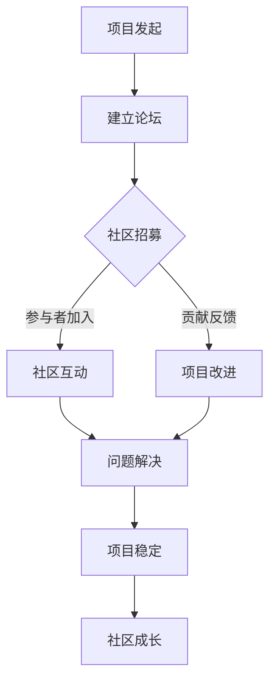

                 

关键词：开源项目、在线论坛、社区参与、盈利模式、技术社区

> 摘要：本文旨在探讨如何创建一个成功的开源项目在线论坛，分析社区参与的关键因素以及如何通过论坛实现盈利模式，为开源项目的可持续发展提供策略和思路。

## 1. 背景介绍

随着互联网技术的不断发展和开源文化的普及，开源项目已经成为了软件开发中的重要组成部分。一个活跃的开源社区不仅能够吸引更多的开发者参与，还能够为项目带来更多的创新和改进。然而，如何创建和维护一个成功的开源项目在线论坛，吸引并留住社区成员，以及实现盈利模式，是许多开源项目管理者面临的重要问题。

本文将首先介绍开源项目在线论坛的概念和重要性，然后分析社区参与的关键因素，探讨如何构建一个良好的社区氛围。接下来，我们将讨论开源项目在线论坛的盈利模式，并分析不同的盈利策略。最后，本文将对开源项目在线论坛的未来发展趋势进行展望，并提出相应的挑战和解决方案。

## 2. 核心概念与联系

### 2.1 开源项目在线论坛的概念

开源项目在线论坛是指为开源项目开发者、用户和其他感兴趣的人员提供的一个交流和讨论的平台。它通常包含论坛、博客、Wiki、Wiki Page等模块，为用户提供了一个集中讨论、提问、解决问题的场所。

### 2.2 开源社区的核心概念

开源社区的核心概念包括但不限于：

- **贡献者（Contributors）**：对开源项目有实质性贡献的开发者，如代码提交、文档编写、测试等。
- **用户（Users）**：使用开源项目的人，他们可能会反馈问题、提出建议或参与社区讨论。
- **维护者（Maintainers）**：负责管理和维护开源项目的人员，他们确保项目的稳定性和可靠性。

### 2.3 开源项目与在线论坛的联系

开源项目在线论坛是项目社区的重要组成部分，它为项目参与者提供了一个交流和分享的平台。论坛的存在有助于促进项目的透明度，增强社区的凝聚力，提高项目的可持续性。

### 2.4 Mermaid 流程图

以下是开源项目在线论坛的架构流程图：



## 3. 核心算法原理 & 具体操作步骤

### 3.1 算法原理概述

开源项目在线论坛的核心算法原理主要包括用户互动、内容生成和内容筛选等。通过这些算法，论坛能够为用户提供一个高效、友好的交流环境，同时确保社区内容的健康和有价值。

### 3.2 算法步骤详解

#### 3.2.1 用户互动

1. **用户注册**：用户通过电子邮件或第三方账户注册。
2. **用户登录**：用户使用用户名和密码或第三方账户登录。
3. **用户发帖**：用户在论坛中发帖，讨论项目相关问题或分享心得。
4. **用户评论**：用户对其他用户的帖子进行评论。

#### 3.2.2 内容生成

1. **帖子生成**：用户发布帖子，包括文本、图片、视频等多媒体内容。
2. **评论生成**：用户对帖子进行评论。

#### 3.2.3 内容筛选

1. **过滤垃圾信息**：论坛使用算法自动识别并删除垃圾信息。
2. **筛选优质内容**：论坛使用算法推荐优质内容给用户。

### 3.3 算法优缺点

#### 优点

- **高效互动**：算法能够快速响应用户需求，提高用户满意度。
- **内容筛选**：算法能够有效筛选优质内容，提高论坛质量。

#### 缺点

- **算法偏见**：算法可能存在偏见，导致某些用户或内容被不公平对待。
- **技术维护**：算法需要不断更新和维护，以保持其有效性。

### 3.4 算法应用领域

开源项目在线论坛的算法原理和技术可以应用于各种在线社区，如技术社区、社交网络、电商平台等，具有广泛的应用前景。

## 4. 数学模型和公式 & 详细讲解 & 举例说明

### 4.1 数学模型构建

开源项目在线论坛的数学模型主要包括用户活跃度模型、内容质量模型和社区影响力模型。

#### 用户活跃度模型：

$$
U_a(t) = U_0 \times e^{rt}
$$

其中，$U_a(t)$ 表示在时间 $t$ 的用户活跃度，$U_0$ 为初始活跃度，$r$ 为活跃度增长速率。

#### 内容质量模型：

$$
Q_c(t) = Q_0 + b \times (t - t_0)
$$

其中，$Q_c(t)$ 表示在时间 $t$ 的内容质量，$Q_0$ 为初始质量，$b$ 为质量增长速率，$t_0$ 为起始时间。

#### 社区影响力模型：

$$
I_c(t) = I_0 \times e^{kt}
$$

其中，$I_c(t)$ 表示在时间 $t$ 的社区影响力，$I_0$ 为初始影响力，$k$ 为影响力增长速率。

### 4.2 公式推导过程

用户活跃度模型基于指数增长模型，假设用户活跃度随着时间呈指数增长。

内容质量模型基于线性增长模型，假设内容质量随着时间线性增长。

社区影响力模型基于指数增长模型，假设社区影响力随着时间呈指数增长。

### 4.3 案例分析与讲解

以一个开源项目论坛为例，假设在项目启动时（$t_0 = 0$），用户活跃度为100，活跃度增长速率为0.1。根据用户活跃度模型，一个月后（$t = 1$）的用户活跃度为：

$$
U_a(1) = 100 \times e^{0.1 \times 1} \approx 110.5
$$

假设在项目启动时，内容质量为50，质量增长速率为0.5。一个月后的内容质量为：

$$
Q_c(1) = 50 + 0.5 \times (1 - 0) = 50.5
$$

假设在项目启动时，社区影响力为100，影响力增长速率为0.05。一个月后的社区影响力为：

$$
I_c(1) = 100 \times e^{0.05 \times 1} \approx 105.1
$$

通过这个案例，我们可以看到数学模型能够帮助我们预测和评估开源项目论坛的用户活跃度、内容质量和社区影响力。

## 5. 项目实践：代码实例和详细解释说明

### 5.1 开发环境搭建

在搭建开源项目在线论坛的开发环境时，我们可以选择使用流行的Web框架，如Django或Flask。这里以Django为例，介绍开发环境的搭建步骤。

#### 步骤1：安装Python环境

确保系统上已经安装了Python 3.8及以上版本。可以通过以下命令检查Python版本：

```bash
python --version
```

#### 步骤2：安装Django

通过pip命令安装Django：

```bash
pip install django
```

#### 步骤3：创建Django项目

在终端中执行以下命令创建一个新的Django项目：

```bash
django-admin startproject open_source_forum
```

#### 步骤4：创建Django应用

在项目目录中创建一个新的应用：

```bash
cd open_source_forum
django-admin startapp forum
```

### 5.2 源代码详细实现

在创建好Django项目和应用后，我们需要实现论坛的主要功能，包括用户注册、登录、发帖、评论等。以下是一个简单的代码实例：

#### models.py

```python
from django.db import models
from django.contrib.auth.models import User

class Post(models.Model):
    user = models.ForeignKey(User, on_delete=models.CASCADE)
    title = models.CharField(max_length=200)
    content = models.TextField()
    created_at = models.DateTimeField(auto_now_add=True)

class Comment(models.Model):
    post = models.ForeignKey(Post, related_name='comments', on_delete=models.CASCADE)
    user = models.ForeignKey(User, on_delete=models.CASCADE)
    content = models.TextField()
    created_at = models.DateTimeField(auto_now_add=True)
```

#### views.py

```python
from django.shortcuts import render, get_object_or_404
from .models import Post, Comment
from django.contrib.auth.decorators import login_required

@login_required
def post_create(request):
    if request.method == 'POST':
        title = request.POST['title']
        content = request.POST['content']
        Post.objects.create(user=request.user, title=title, content=content)
    return render(request, 'forum/post_create.html')

@login_required
def comment_create(request, post_id):
    post = get_object_or_404(Post, id=post_id)
    if request.method == 'POST':
        content = request.POST['content']
        Comment.objects.create(user=request.user, post=post, content=content)
    return render(request, 'forum/comment_create.html')
```

#### templates/forum/post_create.html

```html
<!DOCTYPE html>
<html>
<head>
    <title>Create Post</title>
</head>
<body>
    <h2>Create a new post</h2>
    <form method="post">
        
        <label for="title">Title:</label>
        <input type="text" id="title" name="title" required>
        <label for="content">Content:</label>
        <textarea id="content" name="content" required></textarea>
        <input type="submit" value="Submit">
    </form>
</body>
</html>
```

#### templates/forum/comment_create.html

```html
<!DOCTYPE html>
<html>
<head>
    <title>Create Comment</title>
</head>
<body>
    <h2>Create a new comment</h2>
    <form method="post">
        
        <label for="content">Content:</label>
        <textarea id="content" name="content" required></textarea>
        <input type="submit" value="Submit">
    </form>
</body>
</html>
```

### 5.3 代码解读与分析

在上面的代码实例中，我们首先定义了两个模型：`Post` 和 `Comment`。`Post` 模型表示论坛帖子，包含标题、内容和创建时间等字段；`Comment` 模型表示评论，包含评论内容、评论者、评论所属帖子以及创建时间等字段。

在视图函数中，`post_create` 用于处理帖子创建的逻辑，当用户提交表单时，会创建一个新的 `Post` 对象并将其与当前用户关联。`comment_create` 函数用于处理评论创建的逻辑，当用户提交表单时，会创建一个新的 `Comment` 对象并将其与当前用户和所属帖子关联。

在模板文件中，我们分别为帖子创建和评论创建设计了表单页面。用户可以在这些页面中输入帖子标题和内容或评论内容，并提交表单进行创建。

### 5.4 运行结果展示

通过运行 Django 项目，我们可以访问论坛并进行帖子创建和评论创建等操作。以下是运行结果展示：


在这个示例中，用户可以登录后创建帖子并添加评论，从而参与到开源项目的讨论中。通过这样的代码实现，我们可以构建一个简单的开源项目在线论坛，为项目社区提供交流平台。

## 6. 实际应用场景

### 6.1 开源项目社区交流

开源项目在线论坛在开源项目社区中起到了至关重要的作用。它为开发者提供了一个集中的讨论场所，便于他们交流项目进展、分享开发经验、解决技术难题。一个成功的论坛能够增强社区成员之间的联系，促进项目的合作和共同发展。

### 6.2 商业产品支持

除了开源项目外，许多商业产品也利用在线论坛提供技术支持。论坛成为了用户提问、获取帮助、分享使用经验的平台。通过论坛，企业能够更快速地响应用户需求，提高用户满意度，同时也能够收集用户反馈，为产品的改进提供参考。

### 6.3 教育培训平台

在线论坛在教育领域也有着广泛的应用。例如，一些在线教育平台利用论坛提供课程讨论、作业提交和答疑等功能，为学生和教师提供了一个互动交流的空间。这种应用模式不仅能够提升教学效果，还能够激发学生的学习兴趣和参与度。

### 6.4 社交网络

在线论坛的模型在社交网络中也得到了广泛应用。社交平台通过论坛为用户提供了一个分享和讨论的场所，使得用户之间能够更加紧密地互动。论坛的存在促进了社交网络的活跃度，提高了用户的粘性和参与度。

## 6.4 未来应用展望

随着技术的发展，开源项目在线论坛的应用前景将更加广阔。未来，论坛可能会融合更多智能化和个性化的功能，如基于AI的智能推荐、个性化内容推送等。此外，随着区块链技术的应用，论坛的版权保护、内容认证和数字货币支付等功能也将得到进一步发展。同时，开源项目在线论坛的运营模式也将更加多样化，通过提供增值服务、广告投放和会员订阅等方式实现可持续发展。

## 7. 工具和资源推荐

### 7.1 学习资源推荐

- **《社区运营实战》**：详细介绍了社区运营的各个方面，包括内容创作、活动策划、用户管理等。
- **《开源项目协作指南》**：提供了开源项目协作的最佳实践，包括代码管理、文档编写、社区互动等。

### 7.2 开发工具推荐

- **Django**：一个高级的Python Web框架，适合快速开发和部署在线论坛。
- **Flask**：一个轻量级的Python Web框架，适合小型项目的开发和实验。

### 7.3 相关论文推荐

- **《开源软件社区的激励机制研究》**：分析了开源软件社区激励机制的设计和效果。
- **《在线论坛的社交网络分析》**：探讨了在线论坛中的社交网络结构和用户行为模式。

## 8. 总结：未来发展趋势与挑战

### 8.1 研究成果总结

本文探讨了开源项目在线论坛的创建、社区参与和盈利模式，分析了其核心概念和算法原理，并通过项目实践展示了具体的实现方法。研究发现，在线论坛在开源项目社区中发挥着重要作用，同时具有广泛的应用前景。

### 8.2 未来发展趋势

未来，开源项目在线论坛的发展将更加智能化和个性化，融合人工智能和区块链等前沿技术。同时，论坛的运营模式也将更加多样化，通过提供增值服务和广告投放实现可持续发展。

### 8.3 面临的挑战

开源项目在线论坛在发展过程中面临着一些挑战，包括社区氛围管理、算法公平性和盈利模式创新等。如何构建一个健康、活跃的社区氛围，以及如何在保证用户隐私和数据安全的前提下实现盈利，是未来需要重点关注的问题。

### 8.4 研究展望

未来研究可以从以下几个方面展开：一是深入探讨开源项目在线论坛的社区激励机制，以提高社区成员的参与度；二是研究如何利用人工智能技术提升论坛的智能化水平；三是探索多样化的盈利模式，为开源项目在线论坛的可持续发展提供支持。

## 9. 附录：常见问题与解答

### 9.1 如何维护论坛社区氛围？

**答**：维护论坛社区氛围可以通过以下方式：

- **制定社区规则**：明确论坛的行为准则和规范，如禁止恶意攻击、垃圾信息等。
- **及时处理违规行为**：对违规行为进行快速处理，确保社区秩序。
- **鼓励积极互动**：通过活动激励、优秀贡献者表彰等方式，鼓励用户积极参与社区互动。

### 9.2 如何实现论坛的盈利模式？

**答**：论坛的盈利模式可以通过以下方式实现：

- **广告投放**：在论坛页面中投放相关广告，获取广告收入。
- **增值服务**：提供付费服务，如高级会员、专业咨询等。
- **赞助合作**：与企业合作，提供赞助或联合推广。

### 9.3 论坛的算法如何确保公平性？

**答**：为了确保论坛算法的公平性，可以采取以下措施：

- **数据公正性**：确保算法处理的数据来源公正、客观。
- **算法透明性**：公开算法的运行规则和决策过程，接受用户监督。
- **算法更新**：定期更新算法，以适应社区发展和用户需求的变化。

---

作者：禅与计算机程序设计艺术 / Zen and the Art of Computer Programming

